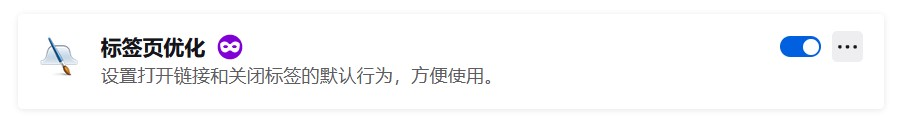
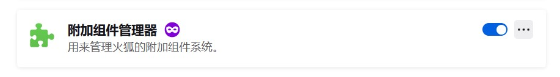
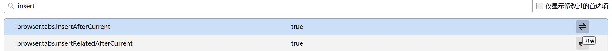

# 背景

可能大家的Firefox里面会有以下几个插件：

此外还有火狐新标签页（个人不喜欢），火狐主页（个人不喜欢），网银支付助手（没用），网页截图（一般都用qq截图了）等插件。

你可能完全不知道它们是什么时候装在你的Firefox里的，但是它们无形中修改了你的操作使用习惯。

但是你会发现这几个插件（2021年或2022年以后）是没法在（至少是国际版）Firefox里同步的。也就是说你使用一台新的电脑，新的Firefox，登陆了你的账户，进行同步。却发现以前的一些操作变得非常不习惯，例如：

- 新建标签页永远在最右边
- 无法双击关闭标签页
- 打开书签会默认替换当前页面而不是新开一个标签页
- 地址栏没有二维码生成器了
- 拖拽文字、超链接必须拖拽到标签页那一栏才能搜索、打开连接。以前只要拖拽几毫米就可以。
- 恢复最近关闭的页面的按钮没了

这些功能其实都是这两个奇怪的插件提供的。这两个插件无法在[addons.mozilla.org](https://addons.mozilla.org)搜索到，这两个插件实际上藏在[mozilla.com.cn/moz-addon.html](http://mozilla.com.cn/moz-addon.html)这个中国特供插件网站。这几个插件也是中国特供版Firefox自带的。

为什么我的国际版也会有这些插件？曾经我在Firefox将同步由国内服务转变为国际服务，我想我可能就在这个转变的途中，把这几个插件同步到了国际版上。

至于现在无法同步插件，我猜测以前Firefox可以同步用户自己下载的乱七八糟的插件，比如这几个，比如Listen1。而现在同步的插件必须是官方审核过的，也就是[addons.mozilla.org](https://addons.mozilla.org)中的。这导致这些东西无法同步，并且如果你在大陆的话甚至也没法同步uBlock Origin（因为在官网上这个插件是锁区的）。

下面我们通过一些设置来改回我们习惯的操作，这些都是可选的，根据自己的喜好来。

# 新建标签页在当前标签页的右边

我们在Firefox的地址栏输入about:config，进入之后接受风险并继续。

搜索insert，把下面两个选项改为true。

# 双击关闭标签页

搜索browser.tabs.closeTabByDblclick，改为true。

# 新建标签页打开书签

browser.tabs.loadBookmarksInTabs改为true。

# 新建标签页打开搜索

browser.search.openintab改为true

# 地址栏二维码生成器

你也许可以尝试使用[https://addons.mozilla.org/zh-CN/firefox/addon/qr-code-address-bar/](https://addons.mozilla.org/zh-CN/firefox/addon/qr-code-address-bar/)这个插件。

# 拖拽手势

有几个插件可以使用

[https://addons.mozilla.org/zh-CN/firefox/addon/quickdrag-we/](https://addons.mozilla.org/zh-CN/firefox/addon/quickdrag-we/)，它的设置比较简单，也是可以设置拖拽新建标签页在foreground还是background。我本人选用了这个。我把他的选项里的搜索引擎改成百度，位置改成Right，剩下四个选项全部取消勾选。不过这个插件好像在部分页面中不起作用，例如mozilla.org的网站中，以及Firefox自己的设置页面中。

[https://addons.mozilla.org/zh-CN/firefox/addon/drag-to-go/](https://addons.mozilla.org/zh-CN/firefox/addon/drag-to-go/)，它的设置更为复杂，可以把拖拽的四个方向的动作分开算，但是不知道为什么，拖拽文字搜索居然不可以设置background。而且拖拽的时候虽然确实能拖拽，但是鼠标指针显示的还是“禁止”的那个图样，让我很不爽。

[https://addons.mozilla.org/zh-CN/firefox/addon/fire-drag/](https://addons.mozilla.org/zh-CN/firefox/addon/fire-drag/)，它总体而言和第一个差不多。缺点也是有几个页面用不了。

# 恢复最近关闭页面的按钮

简单的可以用[https://addons.mozilla.org/zh-CN/firefox/addon/%E6%81%A2%E5%A4%8D%E6%A0%87%E7%AD%BE%E9%A1%B5/](https://addons.mozilla.org/zh-CN/firefox/addon/%E6%81%A2%E5%A4%8D%E6%A0%87%E7%AD%BE%E9%A1%B5/)，这个插件右键没有关闭页面的列表。

功能更齐全的可以用[https://addons.mozilla.org/zh-CN/firefox/addon/undoclosetabbutton/](https://addons.mozilla.org/zh-CN/firefox/addon/undoclosetabbutton/)，这个插件右键就有列表了。
