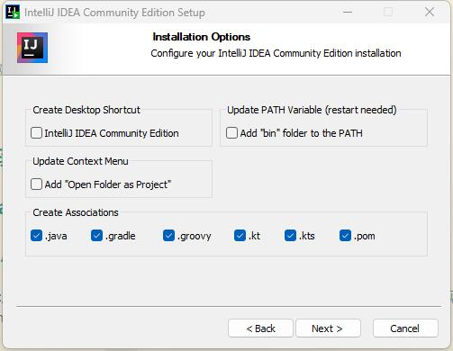
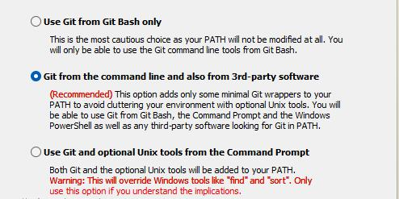
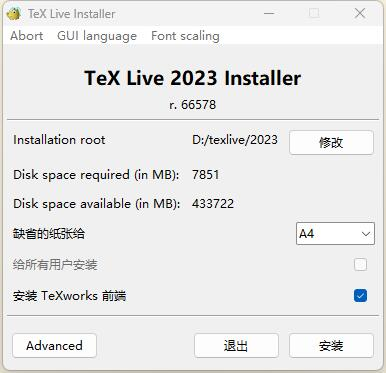

# 编辑器/IDE

## Emacs

[https://mirrors.tuna.tsinghua.edu.cn/gnu/emacs/windows/](https://mirrors.tuna.tsinghua.edu.cn/gnu/emacs/windows/)，在清华源下载安装，可以更改的只有安装目录。

我的.emacs.d可见[https://github.com/kegalas/dotfiles](https://github.com/kegalas/dotfiles)

现在emacs29自带use-package，直接打开就可以，不需要手动安装。

all-the-icons很奇怪，不会被use-package安装，我们`M-x package-install all-the-icons`安装重启即可。

另外，我安装了lsp-pyright来提供python的补全，python里面也要用pip安装pyright才能运行。

此时，用GUI版本的Emacs已经可以了，但是如果想在命令行里用Emacs，则需要添加环境变量。出于对环境变量冲突的恐惧，我没有直接将Emacs的bin添加进PATH，我选择了照抄Vim的bat文件。如下

```bat
@echo off
rem -- Run Emacs --

setlocal
set EMACS_EXE_DIR=D:\Program_Files\Emacs\emacs-29.1\bin
if exist "%EMACS%\emacs-29.1\bin\emacs.exe" set EMACS_EXE_DIR=%EMACS%\emacs-29.1\bin
if exist "%EMACSRUNTIME%\emacs.exe" set EMACS_EXE_DIR=%EMACSRUNTIME%

if not exist "%EMACS_EXE_DIR%\emacs.exe" (
    echo "%EMACS_EXE_DIR%\emacs.exe" not found
    goto :eof
)

"%EMACS_EXE_DIR%\emacs.exe"  %*

```

把这个文件保存为`emacs.bat`，然后找一个文件夹放进去，例如我放在了`xxx\myExec`下，然后把这个文件夹添加到PATH的末尾。

## IDEA

[https://www.jetbrains.com/idea/download/?section=windows](https://www.jetbrains.com/idea/download/?section=windows)，官网下载，我现在主要用Community版本，免费，而且其是可商用的，这点和其他很多软件的社区版不同。

我这里没有选择添加进`PATH`，并且把所有文件关联都勾选上了。主要是考虑到防止PATH里面东西太多，干扰运行。



## Pycharm

[https://www.jetbrains.com/pycharm/download/?section=windows](https://www.jetbrains.com/pycharm/download/?section=windows)，和IDEA一样。

## QT Creator

TODO

（如果设置Android SDK会导致奇怪的卡顿）

## Android Studio

[https://developer.android.google.cn/studio](https://developer.android.google.cn/studio)，官网下载。

勾上AVD，这个是安卓虚拟机，很显然是必要的。


AVD设置TODO（包括用软连接把安装目录转移等）

## Obsidian

[https://obsidian.md/](https://obsidian.md/)，官网下载，不需要设置环境变量。

其软件设置，我一般会加上Completr插件来为Latex提供补全，安装Solarized主题。设置`严格换行`，`显示行号`，`tab`功能替换为4个空格而非制表符等。

另外Obsidian自带的PDF导出并不能导出目录，我会安装[https://github.com/l1xnan/obsidian-better-export-pdf](https://github.com/l1xnan/obsidian-better-export-pdf)来解决。

## CP Editor

[https://cpeditor.org](https://cpeditor.org)下载，

建议选择64位版，不带mingw和llvm的版本，因为我们已经在msys里安装过了。

这里没有选择all users安装，其他就只有目录可以修改。

## TexStudio

见后

# 字体

## Jetbrains Mono

[https://www.jetbrains.com/lp/mono/](https://www.jetbrains.com/lp/mono/)，下载解压，得到一大堆ttf格式的文件。虽然你可以一个一个双击安装，但是太慢了，我推荐你把它们全部选中，拖入到`C:\Windows\Fonts`文件夹中，可以批量安装。

## Noto

TODO

# Git

## Git for Windows


我这里除了创建桌面图标都勾选了。


这里选择了vim当作默认编辑器。


这里选择第一个，因为我还有一些库是用master作为默认分支的。



这里思虑再三我还是选择第二个。如果选第一个，更小心的避免PATH冲突，可以用和Emacs一样的手法：

```bat
@echo off
rem -- Run GIT --

setlocal
set GIT_EXE_DIR=D:\Program_Files\Git\bin
if exist "%GIT%\bin\git.exe" set GIT_EXE_DIR=%GIT%\bin
if exist "%GITRUNTIME%\git.exe" set GIT_EXE_DIR=%GITRUNTIME%

if not exist "%GIT_EXE_DIR%\git.exe" (
    echo "%GIT_EXE_DIR%\git.exe" not found
    goto :eof
)

"%GIT_EXE_DIR%\git.exe"  %*

```

但是，这样做许多软件就识别不到git，例如jetbrains家的IDE。所以我还是选择第二个好了。

但是会不会和msys2中的软件冲突，还有待观察。目前我把他的环境变量顺序放到msys2以下。


选第一个，感觉影响不大。


跨平台，就选第二个吧。


第一个，一直都是用第一个。


关于合并的操作，一直都是用的第一个。


这个不太懂，选默认的。


都勾选，有用。


两个实验功能就不勾选了。

## Github Desktop

[https://desktop.github.com/](https://desktop.github.com/)，可说的不多，甚至不需要安装，双击就打开安装完毕了，也没有环境变量需要配置（自动配置在User的PATH里了）。

# 终端模拟器

## Terminal

### 主题

## tabby

## alacritty

# C/C++相关

## GCC

这里使用的是`MSYS2`，[https://www.msys2.org/](https://www.msys2.org/)，下载安装包。

打开安装包，其中只有安装目录是能修改的。

安装完成后勾选立即打开，打开的是ucrt64，我们首先更换软件源。

进入`xxx\msys64\etc\pacman.d`，参照[https://developer.aliyun.com/mirror/msys2](https://developer.aliyun.com/mirror/msys2)进行修改，这里我们全都修改一下。

在文件中搜索ali


把阿里云的这一行复制到第一行。对所有文件都进行这个操作。

之后在ucrt64的命令行中执行`pacman -Sy`

之后安装`pacman -S mingw-w64-ucrt-x86_64-gcc`，当然，也可以使用`pacman -S mingw-w64-ucrt-x86_64-toolchain`。前者是目前官网的安装示例里的，后者则是以前的示例里的。

环境变量我们只设置ucrt64、clang64和msys的，全部设置可能会加大冲突风险。


注意顺序，不能颠倒。

之后我们打开`MSYS`的命令行，安装`pacman -S gcc`，这一步的目的是，我们使用MSYS提供的虚拟Linux的POSIX，方便我们在windows上进行Linux系统调用，这两个gcc的区别可见[MSYS2,MinGW64,Cygwin的使用区别浅谈](../../p/-msys2mingw64cygwin的使用区别浅谈)

另外，还可以把msys2添加到右键菜单，见[添加msys2到右键菜单](../../p/添加msys2到右键菜单)

## Clang

我们不去安装LLVM官方给Windows的二进制包了，我们直接在clang64里安装。

```bash
pacman -S mingw-w64-clang-x86_64-toolchain
```

安装了clang，clangd等工具。安装完之后不用进行任何环境变量配置。

注意：不能只安装clang、clang-tools-extra等，否则clangd可能会出现找不到iostream库的问题。

## MSVC

TODO

## Make/Cmake/Ninja

在UCRT64的terminal里面，输入

```bash
pacman -S mingw-w64-ucrt-x86_64-cmake mingw-w64-ucrt-x86_64-cmake-gui mingw-w64-ucrt-x86_64-ninja mingw-w64-ucrt-x86_64-make
```

安装cmake官网的windows版本会不会更优有待考察TODO。

另外，直接安装`make`后，并不能在powershell里直接使用，见[MSYS2中的make工具安装方法](../../p/msys2中的make工具安装方法)

要让clangd能够检测Cmake项目，还需要进行[https://clangd.llvm.org/installation#project-setup](https://clangd.llvm.org/installation#project-setup)里提到的操作，简单来说

1. 在cmake进行configure的时候添加参数-DCMAKE_EXPORT_COMPILE_COMMANDS=1
2. 把configure后build目录里生成的compile_commands.json软连接到项目根目录

## Lua

TODO

# Rust相关

TODO

# GO相关

TODO

# Java相关

## JRE和JDK

### Java8运行时

很多软件（例如Minecraft），都还建立在Java8之上，所以安装JRE8是理所当然的。

[https://www.java.com/en/download/](https://www.java.com/en/download/)，java官网目前首选的下载也是Java8。安装过程没什么可说的，只有安装位置可以更改。

环境变量他也会自动配置好。

### JDK11和JDK17

因为有许多库，其在JDK11上运行最稳定，所以JDK11是要安装的，而想用新特性，最好安装一下JDK17。JDK11和17是LTS版本，更新的有需要再安装。如果你不可避免的要用JDK8 LTS，那么也可以去安装。

我这里安装的都是Adoptium Eclipse Temurin的JDK，见[https://adoptium.net/zh-CN/temurin/releases/?version=17](https://adoptium.net/zh-CN/temurin/releases/?version=17)

以JDK17为例


我这里全都勾选了，但是PATH和JAVA_HOME其实可以不用勾选，因为很多IDE（如IDEA，Android Studio）都支持搜索所有JDK，并且手动选择JDK版本，所以这个其实不是很必要。

另外，如果你加入了PATH，要记得把JAVA8的PATH放到JDK上面，以防运行不了Minecraft。

## Scala

TODO

## Kotlin

TODO

## Clojure

TODO

# Python相关

## 普通版

[https://www.python.org/downloads/](https://www.python.org/downloads/)下载最新版（注意是Windows installer (64-bit)），安装。

安装它的原因是，因为直接把Anaconda3的Python导入环境变量实在是太容易造成冲突了，我们需要一个默认的Python给Windows用。

我选择添加python.exe进PATH，并且Customize installation。勾选第二页的全部选项（默认就是全部）、第三页也全部勾选（注意有一个选项需要先安装Visual Studio）。


如上勾选之后，环境变量也会自动配置。这个普通版Python并不会影响Anaconda的virtual env，放心使用。

更换pip源见[https://mirrors.tuna.tsinghua.edu.cn/help/pypi/](https://mirrors.tuna.tsinghua.edu.cn/help/pypi/)

## Anaconda3

[https://www.anaconda.com/download](https://www.anaconda.com/download)下载安装包。

安装时，我选择的是Just Me而不是All Users


勾选如下，勾选了第三个，可以让Pycharm选择里面的环境。第四个看到他推荐也就勾选了。第二个不勾选，防止环境变量冲突。


Anaconda的软件源也比较慢，推荐参考[https://mirrors.tuna.tsinghua.edu.cn/help/anaconda/](https://mirrors.tuna.tsinghua.edu.cn/help/anaconda/)换为国内源。

# Latex相关

## TexStudio

这其实只是一个编辑器，不包含latex的运行环境。

[https://texstudio.sourceforge.net/](https://texstudio.sourceforge.net/)，下载后只有安装目录可以更改，不需要设置环境变量。

## texlive

这才是真正的运行环境。

[https://mirrors.tuna.tsinghua.edu.cn/CTAN/systems/texlive/Images/](https://mirrors.tuna.tsinghua.edu.cn/CTAN/systems/texlive/Images/)，推荐在清华源下载，官网实在太慢。下载texlive.iso即可。

下载后装载这个iso，打开install-tl-windows.bat安装



选好位置点击安装。

安装完成后关闭，弹出iso。环境变量已经自动设定在User的Path里。

## Miktex

这个和texlive其实二选一即可。这里列出来是因为我的笔记本居然打不开texlive的安装包。

[https://mirrors.ustc.edu.cn/CTAN/systems/win32/miktex/setup/windows-x64/](https://mirrors.ustc.edu.cn/CTAN/systems/win32/miktex/setup/windows-x64/)找到basic-miktex安装包。

优点是比较小，安装包只有一百多MB，特别是相较于texlive的几GB的安装包。代价是，每用到一个包，需要当场下载这个包，在第一次运行的时候很费鼠标点下载。个人估计最终安装的体积差不了多少。

当然，不想费鼠标的话，可以在安装时选择


换源也非常简单，只需要进管理员模式点点鼠标即可


这之后点击下一步，选择ustc的源后finish。

# SQL相关

## Postgresql

TODO

## SQLite

大多数时候操作都是在编程语言里面操作的。这里只介绍一个看数据的软件，即SQLiteStudio。

在[https://sqlitestudio.pl/](https://sqlitestudio.pl/)下载，我这里安装全默认，只修改了安装位置。

# JS相关

## Node.js

TODO

# SSH配置

## ssh客户端、服务端

安装的话很简单，在设置里面找到应用-可选功能。


点击圈出来这个查看功能，搜索openssh，把客户端和服务器都安装即可。

安装好之后在服务设置里，设置为自动即可开机启动。


一般配置文件在`C:\ProgramData\ssh\sshd_config`，具体如何参考[在校园网中用ssh连接宿舍电脑](../../p/在校园网中用ssh连接宿舍电脑)

# 博客（Hugo）

## Hugo

见我的文章[为Hugo安装goldmark-mathjax插件来更好地支持输入公式](../../p/为hugo安装goldmark-mathjax插件来更好地支持输入公式)，不推荐使用官网的安装包，推荐自己加插件自己编译。

把编译好生成的`hugo.exe`放到某个你喜欢的地方，比如我的`G:\Program_Files\Hugo\`，并把这个目录设置为环境变量。

## Pandoc

[https://www.pandoc.org/installing.html](https://www.pandoc.org/installing.html)，现在有安装包，以前只有压缩文件。我只是选择了为所有用户安装以及选择了安装位置，也没有其他可选项了。

需要手动配置环境变量，配置在`xxx\Pandoc\`即可。

但是我现在不怎么用这个了，hugo对goldmark适配的更好

# Matlab

从各种地方下载安装包，例如学校正版软件服务、官网等，直接安装即可。

软件包选择TODO

环境变量一般配置在`xxx\MATLAB\R2021b\bin`，注意版本`R2021b`换成自己的版本。

# 其他

## Gpg4win

从[https://www.gpg4win.org/](https://www.gpg4win.org/)下载安装，环境变量其会自动配置。我勾选了除了Okular以外的所有选项。

一般会配置在`xxx\Gpg4win\..\GnuPG\bin`


## 关闭Windows休眠

C盘下一般会有两个大文件，即`hiberfil.sys`和`pagefile.sys`。前面那个是休眠功能使用的文件，后面的是虚拟内存使用的文件。

休眠和睡眠不一样，睡眠是电脑低功率运行，但是保持开机，内存的数据就在内存里。而休眠相当于virtualbox里面给虚拟机“快速休眠”的操作，即把内存保存在硬盘中，此时可以不用保持开机。下次开机恢复电脑布局。

我从来不用这个功能（我甚至从来不知道它，知道了也找不到在哪里），所以关掉，防止占我C盘。办法很简单，管理员powershell运行

```powershell
powercfg -h off
```

# 环境变量顺序

众所周知，环境变量越靠前的优先级越高。我当前的设置是：最初就有的、Windows目录下的放在最前面；然后放python、java、其他编程语言编译器或者虚拟机的环境变量，这里java的环境变量把java 8放在了最前；之后才是msys的各种环境变量。其他各种应用软件的环境变量可以比较随意，毕竟不会和msys冲突。

总而言之，优先级遵从以下规则：系统自带的最优先，各种工具链的windows原生版本第二，msys第三，不和msys冲突的应用软件随意。
