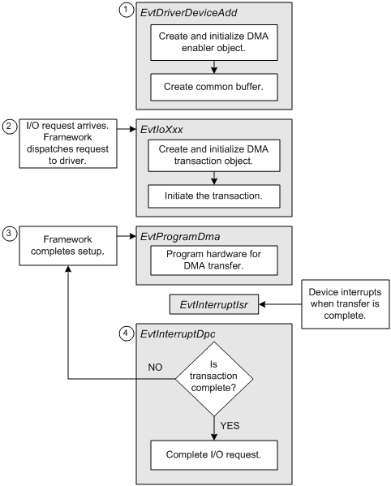
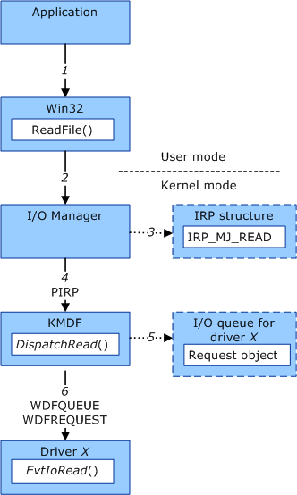

[使用 WDF 开发驱动程序](https://learn.microsoft.com/zh-cn/windows-hardware/drivers/wdf/using-the-framework-to-develop-a-driver)

# WDF 的几个重要且一般存在的操作

- 驱动程序的 [DriverEntry 例程](https://learn.microsoft.com/zh-cn/windows-hardware/drivers/wdf/driverentry-for-kmdf-drivers) 必须调用 [WdfDriverCreate](https://learn.microsoft.com/zh-cn/windows-hardware/drivers/ddi/wdfdriver/nf-wdfdriver-wdfdrivercreate) 来创建表示驱动程序的框架驱动程序对象。WdfDriverCreate 方法还会注册驱动程序的 [EvtDriverDeviceAdd](https://learn.microsoft.com/zh-cn/windows-hardware/drivers/ddi/wdfdriver/nc-wdfdriver-evt_wdf_driver_device_add) 回调函数，每次即插即用 (PnP) 管理器报告驱动程序支持的设备是否存在时，框架都会调用该函数。
- 所有驱动程序都必须调用 [WdfDeviceCreate](https://learn.microsoft.com/zh-cn/windows-hardware/drivers/ddi/wdfdevice/nf-wdfdevice-wdfdevicecreate)，来创建一个框架设备对象，从而支持PnP和电源管理。
- 调用[WdfIoQueueCreate](https://learn.microsoft.com/zh-cn/windows-hardware/drivers/ddi/wdfio/nf-wdfio-wdfioqueuecreate)来创建一个（IO队列的）框架队列对象。通常，驱动程序会为每个IO队列注册一个或多个请求处理程序。当IO管理器向驱动发送IO请求时，框架为该请求创建一个框架请求对象。之后放入IO队列，由驱动程序进行处理。
- 调用[WdfInterruptCreate](https://learn.microsoft.com/zh-cn/windows-hardware/drivers/ddi/wdfinterrupt/nf-wdfinterrupt-wdfinterruptcreate)来创建一个框架中断对象，从而注册回调函数。
- KMDF 驱动程序可以使用框架的 DMA 启用程序对象 和 DMA 事务对象。

# WDF体系结构

WDF 为驱动程序提供基于对象的接口。 框架定义的对象接口包括：

- 对象方法。其为驱动程序可以调用的函数，来对对象进行操作和读取。命名方式为WdfObjectAction，即对该object进行此action，例如WdfDeviceCreate
- 对象事件回调函数。其为驱动程序提供的函数。当发生对应的事件时，框架会调用此回调函数。命名方式为EvtObjectEvent，例如EvtDeviceD0Entry。不过这是用户提供的函数，命名可以根据自己的规则来。
- 对象属性。即存储在对象中的值，驱动程序可以对其进行读取和设置。
- 对象句柄。WDF驱动程序不会直接访问框架对象。而是接收对象句柄，该句柄可以传递给对象方法。

# WDF文件对象

使用CreateFile打开设备时，操作系统会向驱动程序堆栈发送文件创建请求。

如果驱动程序必须处理文件操作，则必须从其 [EvtDriverDeviceAdd](https://learn.microsoft.com/zh-cn/windows-hardware/drivers/ddi/wdfdriver/nc-wdfdriver-evt_wdf_driver_device_add) 回调函数中调用 [WdfDeviceInitSetFileObjectConfig](https://learn.microsoft.com/zh-cn/windows-hardware/drivers/ddi/wdfdevice/nf-wdfdevice-wdfdeviceinitsetfileobjectconfig)。

驱动程序使用此结构来注册其 [EvtDeviceFileCreate](https://learn.microsoft.com/zh-cn/windows-hardware/drivers/ddi/wdfdevice/nc-wdfdevice-evt_wdf_device_file_create)、 [EvtFileCleanup](https://learn.microsoft.com/zh-cn/windows-hardware/drivers/ddi/wdfdevice/nc-wdfdevice-evt_wdf_file_cleanup) 和 [EvtFileClose](https://learn.microsoft.com/zh-cn/windows-hardware/drivers/ddi/wdfdevice/nc-wdfdevice-evt_wdf_file_close) 回调函数，并选择性地指示每次驱动程序收到文件创建请求时框架是否应创建框架文件对象。

当框架收到函数驱动程序的文件创建请求时，它会：

1. 创建表示该文件的框架文件对象，除非驱动程序之前指示它不需要使用框架文件对象。
2. 如果驱动程序已注册回调函数，则调用驱动程序的 [EvtDeviceFileCreate](https://learn.microsoft.com/zh-cn/windows-hardware/drivers/ddi/wdfdevice/nc-wdfdevice-evt_wdf_device_file_create) 回调函数。

# IO队列

每个驱动程序可以创建一个或多个IO队列。

# 处理硬件中断

WDF必须为每个设备可以支持的每个中断创建框架中断对象。

驱动程序通常在其 [EvtDriverDeviceAdd](https://learn.microsoft.com/zh-cn/windows-hardware/drivers/ddi/wdfdriver/nc-wdfdriver-evt_wdf_driver_device_add) 回调函数中创建框架中断对象。 驱动程序还可以从其 [EvtDevicePrepareHardware](https://learn.microsoft.com/zh-cn/windows-hardware/drivers/ddi/wdfdevice/nc-wdfdevice-evt_wdf_device_prepare_hardware) 回调函数创建中断对象。

硬件触发中断时，会首先调用注册的[EvtInterruptIsr](https://learn.microsoft.com/zh-cn/windows-hardware/drivers/ddi/wdfinterrupt/nc-wdfinterrupt-evt_wdf_interrupt_isr)，进行简单的处理后，后面的任务交给[EvtInterruptDpc](https://learn.microsoft.com/zh-cn/windows-hardware/drivers/ddi/wdfinterrupt/nc-wdfinterrupt-evt_wdf_interrupt_dpc)。

# 处理DMA操作



如上所示，与 DMA 相关的处理分四个阶段进行：

1. 驱动程序的 [EvtDriverDeviceAdd](https://learn.microsoft.com/zh-cn/windows-hardware/drivers/ddi/wdfdriver/nc-wdfdriver-evt_wdf_driver_device_add) 或 [EvtDevicePrepareHardware](https://learn.microsoft.com/zh-cn/windows-hardware/drivers/ddi/wdfdevice/nc-wdfdevice-evt_wdf_device_prepare_hardware) 回调函数必须为设备 [启用 DMA 事务](https://learn.microsoft.com/zh-cn/windows-hardware/drivers/wdf/enabling-dma-transactions) ，以便驱动程序可以使用框架的 DMA 功能。 如果设备和驱动程序需要访问共享内存缓冲区，则相同的回调函数还必须 [创建一个公共](https://learn.microsoft.com/zh-cn/windows-hardware/drivers/wdf/using-common-buffers) 缓冲区。
2. 当驱动程序收到需要设备执行 DMA 操作的 I/O 请求时，驱动程序 [的请求处理程序](https://learn.microsoft.com/zh-cn/windows-hardware/drivers/wdf/request-handlers) 之一必须 [创建并初始化新的 DMA 事务](https://learn.microsoft.com/zh-cn/windows-hardware/drivers/wdf/creating-and-initializing-a-dma-transaction)。 (请注意，如果驱动程序 [重用 DMA 事务对象](https://learn.microsoft.com/zh-cn/windows-hardware/drivers/wdf/reusing-dma-transaction-objects)，驱动程序的 [EvtDriverDeviceAdd](https://learn.microsoft.com/zh-cn/windows-hardware/drivers/ddi/wdfdriver/nc-wdfdriver-evt_wdf_driver_device_add) 回调函数可以创建事务对象。) 然后，请求处理程序必须 [启动 DMA 事务](https://learn.microsoft.com/zh-cn/windows-hardware/drivers/wdf/starting-a-dma-transaction) ，以便框架可以根据需要开始将事务分解为较小的 DMA 传输，并调用驱动程序的 [EvtProgramDma](https://learn.microsoft.com/zh-cn/windows-hardware/drivers/ddi/wdfdmatransaction/nc-wdfdmatransaction-evt_wdf_program_dma) 回调函数。
3. 驱动程序的 [EvtProgramDma](https://learn.microsoft.com/zh-cn/windows-hardware/drivers/ddi/wdfdmatransaction/nc-wdfdmatransaction-evt_wdf_program_dma) 回调函数针对单个 [DMA 传输对 DMA 硬件进行编程](https://learn.microsoft.com/zh-cn/windows-hardware/drivers/wdf/programming-dma-hardware) ，并启用设备中断。
4. 设备中断时，框架会调用驱动程序的 [EvtInterruptIsr](https://learn.microsoft.com/zh-cn/windows-hardware/drivers/ddi/wdfinterrupt/nc-wdfinterrupt-evt_wdf_interrupt_isr) 回调函数，这将保存易失设备信息并计划驱动程序的 [EvtInterruptDpc](https://learn.microsoft.com/zh-cn/windows-hardware/drivers/ddi/wdfinterrupt/nc-wdfinterrupt-evt_wdf_interrupt_dpc) 回调函数的执行。

驱动程序的 [EvtInterruptDpc](https://learn.microsoft.com/zh-cn/windows-hardware/drivers/ddi/wdfinterrupt/nc-wdfinterrupt-evt_wdf_interrupt_dpc) 回调函数在硬件 [完成处理后完成每个 DMA 传输](https://learn.microsoft.com/zh-cn/windows-hardware/drivers/wdf/completing-a-dma-transfer) 。 DMA 事务的最终传输完成后， EvtInterruptDpc 回调函数 [完成 DMA 事务](https://learn.microsoft.com/zh-cn/windows-hardware/drivers/wdf/completing-a-dma-transaction)。

# ReadFile读取设备数据的流程



1. 在使用ReadFile之类的windows api后，操作系统会向IO管理器发出一个IO request。
2. 然后request会放入对应的块的读取或者写入queue中。
3. 当队列中有读取/写入请求时，WDF会调用这个queue注册的回调函数[EvtIoRead](https://learn.microsoft.com/zh-cn/windows-hardware/drivers/ddi/wdfio/nc-wdfio-evt_wdf_io_queue_io_read)和[EvtIoWrite](https://learn.microsoft.com/zh-cn/windows-hardware/drivers/ddi/wdfio/nc-wdfio-evt_wdf_io_queue_io_write)。
4. 之后EvtIoReadDma就开始进行dma操作。WdfDmaTransactionInitializeUsingRequest来从request中创建一个DMA事务，WdfDmaTransactionExecute来启动此事务。
5. 启动事务后，[EvtProgramDma](https://learn.microsoft.com/zh-cn/windows-hardware/drivers/ddi/wdfdmatransaction/nc-wdfdmatransaction-evt_wdf_program_dma)会被调用。
6. DMA操作结束后会发出中断。
7. 之后就完成了读取。

# INF文件简介

## 语法规则

INF文件是纯文本文件，包含“节”和“条目”两部分（其实类似于INI文件）。例如

```
[XDMA_wdfsect]
KmdfLibraryVersion = 1.15

;======================= String Definitions ===================================
[Strings]
Companyname = "Kegalas"
```

其中[XDMA_wdfsect]和[Strings]是节，而KmdfLibraryVersion = 1.15和Companyname = "Kegalas"是条目。INF文件的注释以; 开头。

有些节是系统定义的名称，有些则是自定义的。有些条目以预定义的关键字开头，称为指令。

命名对大小写不敏感。

```
[Version]

Signature="signature-name"
[Class=class-name]
```

其中[Class=class-name]也是一个条目，方括号代表其是可选的。

一行不够写的时候，可以末尾写 \ 后换行。表示本身时要转义为\\

### 节名称

1. 各节可以任意顺序放置，不影响windows的读取顺序。相同名称的节会被自动合并成一个
2. 节从一个方括号[]括起来的节名称开头，在下一个节开始时或者文件结束时，该节结束
3. 节名不能有前后空格、不可见字符、方括号、单个百分比符号、分号、内部双引号，末尾不能是\。如果节名用双引号括起来，那么可以解除很多限制

字符串内的双引号要用双引号转义

### 字符串变量

一个INF文件必须有一个[Strings]节，在该节中定义其他位置使用的字符串变量

```
[Strings]
strkey1 = "test"
```

在别的地方使用时，如下

```
[abc]
xxx = %strkey1%
```

所以如果要在各种值中使用%符号，需要用% %来转义

### 逗号与省略

例如SourceDisksFiles 节条目的语法：

```
filename=diskid[，[subdir][，size]]
```

如果我们三个值都提供，那么

```
filename=diskid, subdir, size
```

如果我们省略size，则

```
filename=diskid, subdir
```

如果我们省略subdir，则

```
filename=diskid, , size
```

如果我们省略subdir和size，则

```
filename=diskid
```

## 必须要有的节

### Version节

- Signature = “signature-name”。其中取值必为$Windows NT$和$Chicago$其中之一。NT是新版本的windows，我们一般用这个。
- Class = class-name。指定安装的设备的设备安装类[的名称](https://learn.microsoft.com/zh-cn/windows-hardware/drivers/install/overview-of-device-setup-classes) 。
- ClassGuid = {nnnnnnnn-nnnn-nnnn-nnnn-nnnnnnnnnnnn}。指定[设备安装类](https://learn.microsoft.com/zh-cn/windows-hardware/drivers/install/overview-of-device-setup-classes)GUID
- Provider=%INF-creator%。标识驱动提供商，会在Strings节中定义
- CatalogFile=filename.cat。指定目录文件。当驱动包给微软进行whql验证后，会提供一个目录文件。catalog文件不列在SourceDisksFiles和CopyFiles节中。系统假设文件和INF文件在一个目录。
- DriverVer= mm/dd/yyyy，w.x.y.z。指定版本信息
- PnpLockDown=0|1。如果为1，则PnP会阻止应用程序直接修改INF CopyFiles指令复制的文件

### SourceDisksNames节

指向一个包含源文件的disks或者cd-rom，在安装时会复制这些源文件到目标计算机。

```
[SourceDisksNames]
diskid = disk-description[,tag-or-cab-file] | 
diskid = disk-description[,[tag-or-cab-file][,[unused][,path]]]
```

diskid是十进制非负整数。一般会用1、2、3

disk-description是一个带引号的字符串，用于描述diskid标识的磁盘的内容。

tag-or-cab-file指定一个cabinet (.cab) 文件。只需要提供filename.cab而不用提供目录，该文件位于 安装根 目录或 路径指定的子目录中

unused不再使用

path指定包含源文件的分发磁盘上的目录路径。 路径相对于安装根目录，表示为 \dirname1\dirname2...等。 如果某个条目中省略此值，则假定文件位于分发磁盘的安装根目录中。

### SourceDisksFiles节

命名安装期间使用的源文件，标识包含这些文件的安装磁盘，并提供包含单个文件的分发磁盘上的目录路径

```
[SourceDisksFiles]
filename=diskid[,[ subdir][,size]]
```

filename指定一个源文件的名称

diskid指定源磁盘的id，在之前的SourceDisksName中定义了。

subdir指定子目录（相对于SourceDisksName中的path）

size指定给定文件的未压缩大小（字节）

指定了这些文件之后，安装的时候就会复制这些源文件。注意不可复制INF文件本身。

示例：

```
[SourceDisksNames]
;
; diskid = description[, [tagfile] [, <unused>, subdir]]
;
1 = %Floppy_Description%,,,\WinNT

[SourceDisksFiles.x86]
aha154x.sys = 1,\x86 ; on distribution disk 1, in subdir \WinNT\x86
```

### DestinationDirs节

指定对 INF 文件中其他位置按名称引用的文件执行的所有复制、删除和/或重命名操作的目标目录。

```
[DestinationDirs]

[DefaultDestDir=dirid[,subdir]] ; 指定对文件执行的所有复制、删除和/或重命名操作的默认目标目录
[file-list-section=dirid[,subdir]]... ; 指定 INF 文件中其他位置的 CopyFiles、 RenFiles 或 DelFiles 指令引用的节的 INF 编写器确定的名称
```

dirid为按名称引用的文件（可能位于 INF 的命名 file-list-section 内）的操作指定目标目录的目录标识符。 

subdir指定 由 dirid 标识的目录下的子目录

这些dirid的内容见

### ControlFlags节

标识 Windows 应在安装过程中对其执行某些唯一操作的设备。

```
[ControlFlags]

ExcludeFromSelect=* | 
ExcludeFromSelect=device-identification-string[,device-identification-string] ...] 
```

device-identification-string是标识INF model节指定的硬件ID或兼容ID。*则标识所有设备。

ExcludeFromSelect标识了一些在INF model节中列出的ID，他们在手动安装时不会展示给用户看。

其他见

### Manufacturer节

标识可以使用 INF 文件安装的一个或多个设备的制造商。

```
[Manufacturer]

manufacturer-identifier
[manufacturer-identifier] 
[manufacturer-identifier] 
...
```

manufacturer-identifier为以下格式

```
manufacturer-name |
%strkey%=models-section-name |
%strkey%=models-section-name [,TargetOSVersion] [,TargetOSVersion] ... 
```

manufacturer-name标识设备的制造商。INF文件中还必须包含同名的INF model节。

models-section-name为该制造商指定一个model节。

TargetOSVersion指定特定的windows版本，具体的版本格式可见

如果一个models-section-name包含TargetOSVersion，那么其model节的名字也要有响应的部分

例如

```
[Manufacturer]
%FooCorp%=FooMfg，NTx86....0x80，NTamd64

[FooMfg.NTx86....0x80]
;...

[FooMfg.NTamd64]
;...
```

### Model节

标识至少一个设备，引用该设备的 INF 文件的 DDInstall 部分，并为该设备指定唯一到模型部分的硬件标识符 (ID) 。

```
[models-section-name] |
[models-section-name.TargetOSVersion]  (Windows XP and later versions of Windows)

device-description=install-section-name,[hw-id][,compatible-id...]
[device-description=install-section-name,[hw-id][,compatible-id]...] ...
```

device-description标识要安装的设备，用可见字符串标识，或者用%strkey%标识。

install-section-name指定要用于设备的 INF 安装部分的未修饰名称，见后面的DDInstall

hw-id指定硬件id，详情见

compatible-id指定兼容id

### DDInstall节总体结构

```
[install-section-name] | 
[install-section-name.nt] | 
[install-section-name.xxx]

[DriverVer=mm/dd/yyyy[,x.y.v.z]]
[CopyFiles=@filename | file-list-section[,file-list-section] ...] ...
```

还有很多可选的项，不列出

DriverVer=mm/dd/yyyy[，x.y.v.z]标识驱动程序包的版本信息。

CopyFiles=@filename | file-list-section[，file-list-section] ... 。指定从源复制到目标的文件，或者指定一个INF节，节中包含了一个文件名列表。

CopyINF=filename1.inf[，filename2.inf]... 。指定复制INF文件

AddReg=add-registry-section[，add-registry-section]... 。指定更改注册表，见后命令解析部分。

还有很多指令，见

### DDInstall.Services节

```
[install-section-name.Services] |
[install-section-name.nt.Services] |
[install-section-name.xxx.Services]

AddService=ServiceName,[flags],service-install-section
                     [,event-log-install-section[,[EventLogType][,EventName]]]...]
```

AddService指令见后

### DDInstall.HW节

通常用于安装多功能设备、安装 PnP 筛选器驱动程序，以及设置注册表中任何用户可访问的设备特定但与驱动程序无关的信息

```
[install-section-name.HW] |
[install-section-name.xxx.HW]

[AddReg=add-registry-section[,add-registry-section]...] ...
```

### DDInstall.Events节

### DDInstall.Components节

### DDInstall.Software节

### DDInstall.Interfaces节

### DDInstall.CoInstallers节

### DDInstall.WDF节

### ...

### 字符串节

见前

## INF指令

### AddReg

用于向注册表添加信息

```
AddReg=add-registry-section[,add-registry-section] ...
```

add-registry-section的格式则为

```
[add-registry-section]
reg-root,[subkey],[value-entry-name],[flags],[value][,[value]]
reg-root,[subkey],[value-entry-name],[flags],[value][,[value]]
 ...

[[add-registry-section.security]
"security-descriptor-string"]
```

### CopyFiles

```
CopyFiles=@filename | file-list-section[, file-list-section]... 
```

可以复制单个文件，也可以复制一个列表里的所有文件，列表的格式如下

```
[file-list-section]
destination-file-name[,[source-file-name][,[unused][,flag]]]
...
```

### AddService

```
AddService=ServiceName,[flags],service-install-section
                     [,event-log-install-section[,[EventLogType][,EventName]]]
```

# 驱动程序包的组件

## INF文件(.inf)

定义了驱动程序的许多信息，见前

## 目录文件(catalog, .cat)

包含驱动程序包中每个文件的加密哈希，Windows 使用这些哈希值来验证程序包在发布后是否未被更改。WHQL认证通过后会得到这样的一个目录文件。

## 驱动程序文件(.sys)

在大多数情况下，驱动程序包将包含一个或多个驱动程序服务，这些服务应是安装驱动程序包的设备的设备堆栈[的](https://learn.microsoft.com/zh-cn/windows-hardware/drivers/gettingstarted/device-nodes-and-device-stacks)一部分。驱动程序服务是提供设备的 I/O 接口的包的一部分。 通常，驱动程序是带有 sys 文件扩展名的动态链接库 (DLL)。

## 其他文件

# WHQL签名

[https://learn.microsoft.com/zh-cn/windows-hardware/drivers/dashboard/](https://learn.microsoft.com/zh-cn/windows-hardware/drivers/dashboard/)

在win10之后，要在非测试模式的windows上安装驱动，都需要WHQL签名，上面为WHQL签名的流程，其中EV证书有金钱开销。

# HLK测试

[https://learn.microsoft.com/zh-cn/windows-hardware/test/hlk/getstarted/step-1-install-controller-and-studio-on-the-test-server](https://learn.microsoft.com/zh-cn/windows-hardware/test/hlk/getstarted/step-1-install-controller-and-studio-on-the-test-server)

要通过WHQL签名需要通过HLK测试，大体流程如上。

## 静态工具徽标测试

大部分测试都是可以自动完成的，这一步需要手动进行。可能需要进行到步骤有：CodeQL、StaticDV、Code Analysis、创建DVL日志。大部分也是按照流程来即可。但是StaticDV和创建DVL日志这两步可能会遇到各种各样奇怪的问题，导致无法运行起来。这里建议直接在虚拟机新建一个环境，要求SDK、WDK的版本一致，Visual Studio的版本也要对应。如果VS的Driver插件无法正常使用，也可以换用EWDK从命令行进行。
