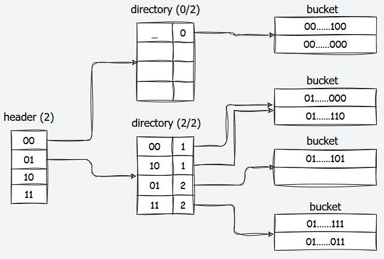
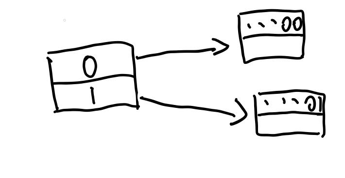
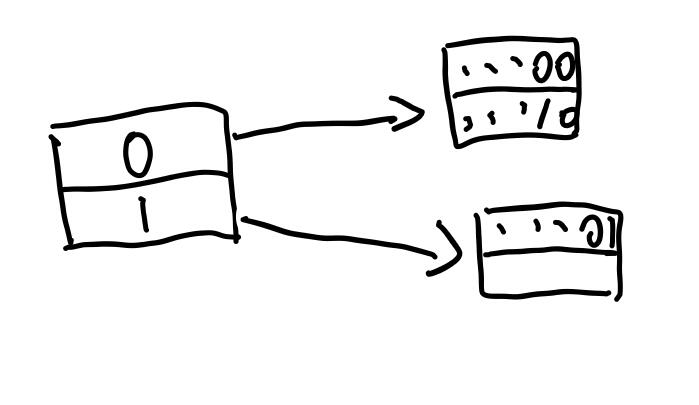
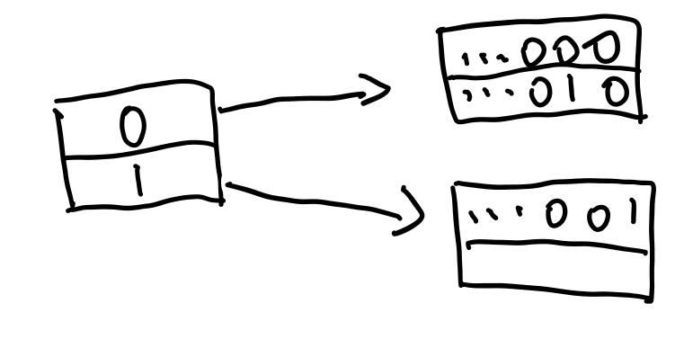
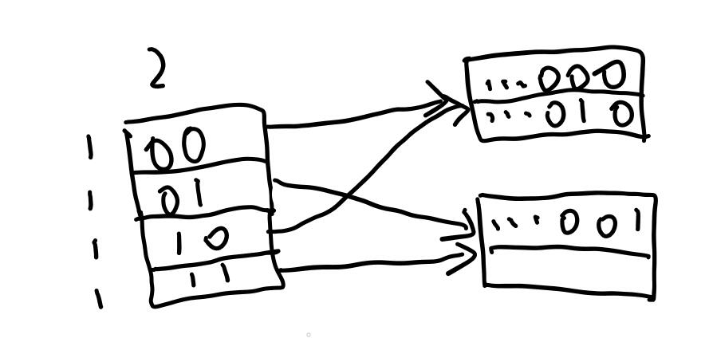
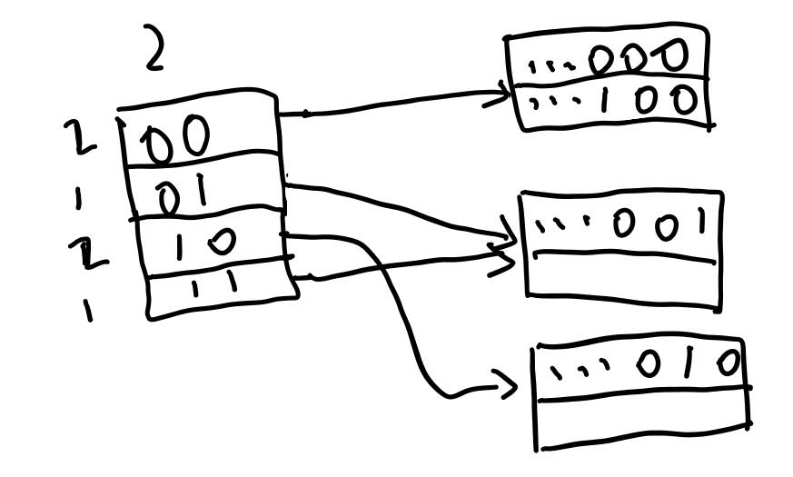

为了应对面试官的拷打，写下此文，方便我复习这个数据库的实现方法。

# Project 1

## Task 1

这一部分主要是要求实现一个LRU-K的替换算法。

LRU是最近最少使用算法，也就是把buffer里面，上次使用时间距离现在最远的元素换出去。但是LRU的问题在于，如果有很多“偶发性”数据访问，即只访问一两次的数据，那么LRU会替换掉几乎所有元素，从而降低命中率。

LRU-K的想法是，访问过K次及以上的数据和其他数据分开来算。显然，前者是更需要放在缓存里的，而后者是“偶发性”数据。

这里同样定义了距离，当访问次数大于等于$K$时，该元素的距离为当前时间点减去之前的第$K$次访问的时间点。如果一个元素的访问次数不足$K$，则距离无限大。换出的规则仍然是，把距离最大的元素换出。如果有多个元素距离无限大，则把最近访问最远的那个元素换出。相当于对它们进行朴素的LRU。

下面具体解析一下在`src/include/buffer/lru_k_replacer.h`里面的东西的作用

- `LRUNode`：这里记录我们刚刚提到的元素的信息。其中：
    - `history_`记录了最近的至多$K$次访问的时间戳，表头为最远的，表尾为最近的。
    - `k_`代表累计有几次访问，最大等于LRU-K算法设定的$K$值，不能超过。
    - `fid_`代表在buffer pool中的帧号，其作用在于通过帧号找到页号，具体会用在buffer pool中。
    - `is_evictable_`，为真时代表此元素可以换出。
- `LRUKReplacer`：这个就是具体实现LRU-K的地方。
    - 先看看它的成员变量：
        - `node_store_`，用于存储帧号对应的LRUNode。
        - `current_timestamp_`用于记录现在的时间戳，不需要用unix时间戳什么的，我们只要每次访问后将其加一即可。
        - `curr_size_`指的是目前有多少个evictable的帧。
        - `replacer_size_`指LRU-K能容纳多少Node
        - `k_`即代表LRU-K中的$K$值。
        - `latch_`即我们使用的互斥锁。
    - 再来看看成员函数：
        - 构造析构略
        - `Evict`指换出一个帧，参数为换出的帧其帧号的指针，返回真时换出成功，否则换出失败。换出规则即之前介绍的规则。
        - `RecordAccess`记录给定帧的一次访问。每次访问都要增加`current_timestamp_`，如果不在`node_store_`中还需要新建。然后修改`frame_id`对应的node的数据，包括`k_`和`history_`。如果已经有$K$次访问了，还需要注意不要自增超过$K$，以及`history_`不要多于$K$个记录。
        - `SetEvictable`即修改给定帧的可换出属性，同时会影响`curr_size_`的值。
        - `Remove`即删除给定帧的访问记录。注意只有evictable的帧才能换出。同时会影响`curr_size_`的值。

这里面所有的`frame_id`的范围都在`[0,replacer_size_)`中，否则为非法访问。

## Task 2

这里要求实现一个磁盘调度算法。不过这个算法并不高深，就是一个简单的FIFO，使用一个并发安全的队列实现。

`src/include/storage/disk/disk_scheduler.h`中，有：

- `DiskRequest`：代表一次磁盘访问的属性，包括
    - `is_write_`即是读还是写
    - `data_`一个指针。读磁盘时，指向要读入的内存数组的开头。写磁盘时，指向要写入的内存数组的开头。大小是固定的，为Page的大小，在bustub中为4096，不足的都会补0
    - `page_id_`即写入磁盘的第几页。在后面会详细介绍，我们只用知道bustub的`xxx.db`文件是一页一页顺着排列的就行。页号从`0`开始。
    - `callback_`一个线程同步的变量，后面（task 3）介绍。
- `DiskScheduler`：即实现磁盘调度算法的部分
    - 其成员变量有：
        - `disk_manager_`磁盘调度算法要向其发送磁盘操作请求，之后介绍
        - `request_queue_`即FIFO算法所用到的队列
        - `background_thread_`即在后台不断把队列里的请求拿出来，发送给`disk_manager`的线程
    - 其成员函数有：
        - 构造函数，在构造的时候，就启动了`background_thread_`线程，其执行`StartWorkerThread`
        - `Schedule`，即简单地把一个`DiskRequest`放入队列中
        - `StartWorkerThread`，可以看作是生产者-消费者模型中的消费者。其不断地从队列中拿出请求，向`disk_manager_`发送对应请求，然后将`callback_`赋值。无限循环直到拿出的请求是一个`std::nullopt`（队列中存的是`std::optional<DiskRequest>`）
        - 析构函数，主要负责向队列中放入`nullopt`，让其停止。然后和后台的线程进行`join`

这个队列在这个项目里是已经提供好了的，不需要自己实现。不过为了防止被面试官拷打，我们来解析一下这个队列的实现方式。其被称作`Channel`，在`src/include/common/channel.h`。其底层是STL的`queue`，在此基础上加入了一个互斥锁和一个条件变量。只支持两个方法，即`Put`在队尾放入元素，`Get`取出队头元素（相当于front和pop二合一）。实现也非常经典，值得抄下来学习

```cpp
void Put(T element){
    std::unique_lock<std::mutex> lk(m_);
    q_.push(std::move(element));
    lk.unlock();
    cv_.notify_all();
}

T Get(){
    std::unique_lock<std::mutex> lk(m_);
    cv_.wait(lk, [&](){return !q_.empty()})
    T element = std::move(q_.front());
    q_.pop();
    return element;
}
```

然后我们来看看`DiskManager`具体怎么访问硬盘的。抛去一些不重要的，有这些成员变量：

- `db_io_`，它是一个`std::fstream`，至此真相大白，根本没有什么更底层的东西，只是一个STL自带的文件流而已。
- `file_name_`，数据库文件的名字。
- `db_io_latch_`，在硬盘读写的时候持有锁，防止冲突。

再来看看其中比较重要的几个成员函数：

- 构造函数，传入文件名，打开fstream。
- `WritePage`，传入页号，以及data的指针。前面也提到过，bustub的数据文件就是把页顺序排列，我们知道页号、知道页大小，就知道页的开头在文件中的位置。这里需要使用`fstream`的`seekp`先定位，然后再`write`写出数据。
- `ReadPage`，传入页号，以及data的指针。基本上同上。只是需要注意，如果文件的最后一页不足4096，那么需要在内存中把后面全部填充0

## Task 3

这里就是真正实现buffer pool的地方。buffer pool对于数据库的作用，类似于cache对于cpu的作用。cpu一般是先把内存中的东西放到cache中，然后之后读取就会更快了。基于空间局部性和时间局部性，虽然cache比内存小，但是也可以提升访问速度。而buffer pool所做的，就是把磁盘中的东西拿到内存。

buffer pool中的东西分为两部分，第一部分是Project 1中实现的，其只实现了基本的操作。而Project 2中实现的下半部分主要是负责更好的自动控制，不再需要手动进行Unpin等操作，解放程序员。

还是先介绍`BufferPoolManager`（`src/include/buffer/buffer_pool_manager.h`）中的成员变量：

- `pool_size_`，代表这个buffer pool中能容纳多少个page。LRUKReplacer的大小将会和它一致
- `next_page_id_`，其为一个`std::atomic<page_id_t>`，也就是说可以并发地访问。其中`page_id_t`在这里定义为了`uint32_t`。之后创建一个新页的时候需要用到这个值。
- `pages_`，一个数组，用于存放所有page的
- `disk_scheduler_`，即task 2实现的东西
- `page_table_`，通过页号找到帧号
- `replacer_`，即我们的LRU-K算法
- `free_list_`，其最初的大小等于`pool_size_`，存储了所有空闲的帧的帧号
- `latch_`，自己的互斥量。

成员函数：

- 构造函数，主要就是传入大小、$K$值，`DiskManager`等。这里要初始化`pages_ = new Page[pool_size_]`，初始化`replacer_`，同时把所有帧号放到`free_list_`里
- 析构函数，主要进行`delete[] pages_`
- `NewPage`，分配一个新页，返回这个新页的指针，新页的页号通过参数中的指针返回。由于我们是在内存中分配新页的，所以要先找一个位置，如果有空闲的帧就直接获取一个帧号，否则换出一个帧到硬盘上（即判断是否为脏页，为脏则要向`DiskManager`发出一个写请求，然后从`page_table_`中删掉这一项。否则直接从`page_table_`中删掉。这里删除的时候，需要`auto future = r.callback_.get_future()`，然后再发送请求，然后`future.wait()`，这样在删除完成之前就会被阻隔，从而线程同步。），然后继续使用这个换出的帧号。在`pages_`数组上，直接对这个元素进行初始化。例如重置数据、分配页号、设置脏位、设置`pin_count_`。然后写入`page_table_`，并在`replacer_`中记录一次访问，以及设定`evictable`为`false`。这里可能所有页面都被设置为不能换出，这里要返回`nullptr`
- `FetchPage`，根据页号获取一个页。这个页可能已经在buffer pool里了，那么直接读这个页。否则，要去硬盘里找。同前，有空闲帧就分配、否则换出，等等操作。在之后，我们要给这个page的`pin_count_`加一，表明又有一个新的线程在访问这个页。以及，同样地更新`page_table_`、`replacer_`等。
- `UnpinPage`，一个线程不再需要这个页时，需要将其unpin，也就意味着对应的`pin_count_`减一。同时`UnpinPage`的参数里会带有`is_dirty`，用于标注这个页的脏位。注意，如果页不在buffer pool里，或者`pin_count_`已经归零，就不需要进行操作了。页的这些元信息只存在于内存中，硬盘中只有data，所以`pin_count_`不需要从硬盘里拿出来减一。如果成功进行了减一，并且计数器归零，就可以在`replacer_`中把`evictable`设置为`true`了
- `FlushPage`，给定页号，无论是否为脏页，都写回硬盘中。之后设置为非脏页。其他信息不做改动。
- `FlushAllPages`，刷新所有页。
- `DeletePage`，这里说的不是删掉硬盘上的页。是删掉buffer pool中的页，并标记为空闲帧。当然，如果给出的页号本来就不在buffer pool里，则什么改动都不做。删除的时候已经假定引用计数归零了，所以如果非零，则是非法操作。需要从`page_table_`、`replacer_`中删掉相应的元素。然后插入到`free_list_`中，把原来`pages_`这个位置上的页元信息重置。
- `AllocatePage`，其实就是分配了一个新页号`return next_page_id_++`
- `DeallocatePage`，这就是个空函数，bustub里根本不考虑这个。

之后我们来关注一下这个`Page`里面都有什么东西，在`src/include/storage/page/page.h`中，成员变量：

- `data_`，一个指针，和读写硬盘的那个`data`指针类似，就是指向一个数组的头。大小固定为4096，即页大小。在构造函数中分配内存。析构中释放。
- `page_id_`，页号。
- `pin_count_`，表示有多少线程正在使用这个页。
- `is_dirty_`，脏位。
- `rwlatch_`，读写锁。实际上是用`std::shared_mutex`实现的，写的时候进行`lock()`和`unlock()`，读的时候进行`lock_shared()`和`unlock_shared()`。

成员函数可说的反而不多，除了一大堆getter和setter、读写上锁之外，有：

- `ResetMemory`，就是一个`memset`，把`data_`的内容初始化。

这里面还有两个叫`GetLSN`和`SetLSN`的函数，不知道干嘛的，整个项目里倒也没用过这两个函数。

# Project 2

## Task 1

在上一部分，我们实现的`BufferPoolManager`实现的比较底层的操作。程序员需要手动创建页、获取页、删除页、Unpin页。本部分要求我们，实现一个wrapper，能够在构造的时候获取页，析构的时候Unpin、删除页。同时，实现要求我们保证并发安全，我们也要自动地控制锁。

首先关注`src/include/storage/page/page_guard.h`，其中有三个类：

- `BasicPageGuard`
- `ReadPageGuard`
- `WritePageGuard`

这三个类都是独占资源的类，所以类似于`unique_ptr`，它们的拷贝构造和拷贝赋值被禁用了。看看它们的成员变量：

- `BasicPageGuard`
    - `bpm_`指向一个`BufferPoolManager`的指针
    - `page_`指向自己所管理的页的指针
    - `is_dirty_`脏位
- `ReadPageGuard`
    - `guard_`是一个`BasicPageGuard`。本类的成员函数的实现方式，使得本页只读，后面介绍。
- `WritePageGuard`
    - `guard_`是一个`BasicPageGuard`。本类的成员函数的实现方式，使得本页可读写，后面介绍。

看看它们的前几个成员函数：

- `BasicPageGuard`
    - 默认构造函数，其传入`bpm`和`page`指针来初始化。
    - 移动构造函数，把另外一个guard的`page_`，`is_dirty_`，`bpm_`全部都移动过来，之前的清空。
    - `Drop`，即废弃掉这个页，或者说放弃控制权。这里就需要调用`bpm_`中的`UnpinPage`了，传入自己的页号和脏位。之后再把成员变量清空。
    - 移动赋值函数，和移动构造类似，但是要先把自己的资源`Drop`掉，再去考虑移动的事。
    - 析构函数，可以直接调用`Drop`
- `ReadPageGuard`
    - 默认构造函数，传入的也是`bpm`和`page`指针，其用来初始化`guard_`成员。其实我不是很明白这里为什么没有上读者锁（项目原版的代码），可能是因为项目里根本没有地方直接构造`ReadPageGuard`吧。
    - 移动构造函数，我们只用移动`guard_`即可。虽然我写了先把`that`解锁再把`this`加锁，但我想了一下好像没有必要，甚至可能是错的。不过评测没有问题。
    - `Drop`，废弃页。注意如果`this`已经有一个页，需要先解锁，然后再`Unpin`。之后再把`guard_`的信息清空。如果弄反了，可能`Unpin`后页立刻换出，然后我们再解锁，解锁的就是其他页的锁了。
    - 移动赋值函数，同前，如果需要，先考虑`Drop`掉自己。
    - 析构函数，调用`Drop`
- `WritePageGuard`，和`ReadPageGuard`基本一样，只不过加锁的时候加的是写者锁。

前面也提到，一般不会直接调用`ReadPageGuard`和`WritePageGuard`的默认构造函数，我们会通过`BasicPageGuard`中内置的两个函数来“升级”成另外两个：

- `UpgradeRead`，首先给`page_`上读者锁，然后记录下`page_`和`bpm_`的指针，清空自己的成员变量，调用默认构造函数返回一个`ReadPageGuard`
- `UpgradeWrite`，同上，只不过上的是写者锁。

这三个类还有几个读取数据的成员函数

- `BasicPageGuard`
    - `PageId`，获取`page_`的页号
    - `GetData`，获取`page_`的`data_`指针，一个`const char *`，也即不可修改内容
    - `As`，将`GetData`中获得的指针转化为另一个类型的指针，即`const T *`
    - `GetDataMut`，同`GetData`，只不过将`is_dirty_`设置为`true`，返回`char *`
    - `AsMut`，将`GetDataMut`获得的指针转为`T *`
- `ReadPageGuard`，只包含`PageId`，`GetData`，`As`
- `WritePageGuard`，包含全部五个函数。

之后我们回到`src/include/buffer/buffer_pool_manager.h`中，解决上个Project的遗留问题

- `FetchPageBasic`，首先调用自己的`FetchPage`获取页号，然后调用`BasicPageGuard`的默认构造函数构造，然后返回
- `FetchPageRead`，调用`FetchPageBasic`后进行`UpgradeRead`，返回
- `FetchPageWrite`，类似于上条。
- `NewPageGuarded`，类似于第一条，使用`NewPage`的页号。

## Task 2

从这里开始要求我们实现一个可扩哈希。我们先把可扩哈希的原理说明一下，从一张图开始



首先可以看到，它是一个三层结构。第一层是`header`，其大小固定。第二层是`directory`，其大小可以变化，从只有一项，到大小上限。而第三层是`bucket`。

`header`的每一项指向了一个`directory`（当然如果没有数据的话就指向空指针），而`directory`的每一项指向了一个`bucket`，数据实际上是存在`bucket`里。所以，如果我们要读写一个数据，我们要经过以下步骤：

1. 找到该数据对应与`header`中的哪一项。
2. 从`header`的这一项中找到其对应的`directory`，然后在找到该数据对应该`directory`中的哪一项
3. 从`directory`中的这一项找到其对应的`bucket`，然后在`bucket`中遍历（`bucket`可以看做是固定大小的数组），找到所需的数据位置。

具体是根据什么方法来找的呢？

首先，我们会获得该数据的哈希值。假设我们这里得到的哈希值是一个32位无符号整数，那么，根据`header`的`max_depth`，提取出哈希值的高`max_depth`位。如上图，其`max_depth`为$2$。如果我们的哈希值是`01...111`，那么就要映射到`header`中的第`1`项（从`0`开始计数）。如果是`10...111`就映射到第`2`项，以此类推。

接下来，我们在对应的`directory`里，根据其`global_depth`，找到哈希值的低`global_depth`位。例如在`global_depth`为$2$时，`01...111`就映射到`directory`的第`3`项。

可扩哈希具体指的是哪里可扩呢？实际上指的是`directory`可扩。我们画个简单的情况来介绍：


如图，我们省去了`header`，并且现在`directory`的`global_depth`的大小为`0`，也就是只有第`0`项。我们这里假设`bucket`大小为$2$。这里我们有一个放了两个数据的`bucket`，这里用哈希值表示数据。

整个`directory`有一个`global_depth`，主要是代表项数，也用来找哈希值对应的`bucket`。而每一项，有一个`local_depth`，代表的是，该项指向的`bucket`中，保证所有数据的哈希值最低的`local_depth`位是相同的。上图中，`local_depth`为`0`，即没有一位是保证相同的。

如果我们要再插入一个数据（假设是`...10`）到其中，怎么做呢？这里显然已经插入满了，所以我们要扩容。首先，把`global_depth`加一，同时`directory`的大小也就增加了（大小为$1<<{global\_depth}$），所以我们要增加`directory`的项数，其还是指向这个`bucket`。


现在，`directory`的`global_depth`是`1`，而两项的`local_depth`都是`0`。观察我们要插入的数据`...10`，其最低`1`位是`0`，所以要插入第`0`项。而第`0`项指向的`bucket`仍然是满的。所以我们现在要把`bucket`分裂。如下：



这里分裂的时候，需要按照`directory`的映射关系，将`bucket`的数据分别放到相应的新`bucket`中。这里，我们就可以增加`local_depth`了，都是`1`。然后我们再插入数据`...10`，就可以正常插入了。



再例如下图



我们插入`...100`，和之前一样，我们需要先扩容`directory`



这里`global_depth`变成了`2`，写在了上方。而`local_depth`都是`1`，写在左边。然后我们的数据`...100`是映射到第`0`项，其`bucket`是满的，所以要分裂`bucket`，再插入，如下



目前为止，插入和查询就说明白了。删除数据放到之后再说，先来看看代码，首先是`src/include/storage/page/extendible_htable_header_page.h`

首先，源代码注释中给出了这个`page`的布局

```cpp
/**
* Header page format:
*  ---------------------------------------------------
* | DirectoryPageIds(2048) | MaxDepth (4) | Free(2044)
*  ---------------------------------------------------
*/
```

这里我们也可以知道，无论是`header`、`directory`还是`bucket`，都是作为一个页存在硬盘上的。大小都依然是`4096`。

这段注释指出，`header`存储的数据有两个，一个是`MaxDepth`，一个是表项。通过阅读后面的代码可知，这个类有两个成员变量。

```cpp
page_id_t directory_page_ids_[HTABLE_HEADER_ARRAY_SIZE];
uint32_t max_depth_;
```

表项是用一个数组来表示的，其类型为`page_id_t`，被`using page_id_t = uint32_t`定义。而另一个就是代表表的最大大小。因为`uint32_t`是`4`字节的，而`DirectoryPageIds`占`2048`字节，所以最多有`512`项。这里也说明，实现上表项不是一个指向`directory`的指针，而是存储了对应的页号，找到`directory`需要读取硬盘上的另一个页。

接下来我们看看其中定义的三个静态变量

```cpp
static constexpr uint64_t HTABLE_HEADER_PAGE_METADATA_SIZE = sizeof(uint32_t);
static constexpr uint64_t HTABLE_HEADER_MAX_DEPTH = 9;
static constexpr uint64_t HTABLE_HEADER_ARRAY_SIZE = 1 << HTABLE_HEADER_MAX_DEPTH;
```

第一个定义了元信息的大小，第二个定义了`bustub`默认的`max_depth`，第三个定义了默认的表大小。接下来我们看`ExtendibleHTableHeaderPage`的成员函数

- 所有构造函数和析构函数都被禁用了，根据代码的注释说这样是为了保证内存安全。我水平不够暂时不了解原理。
- `Init`，传入`max_depth`，让我们对`header`进行初始化。我们照做即可，注意表项要全部初始化为`INVALID_PAGE_ID`，代表没有指向任何一个`directory`
- `HashToDirectoryIndex`，传入32位无符号整数的哈希值，找到对应的表项。就像我们之前说的一样，找到高`max_depth`位就行。`return hash>>(32-max_depth_);`。可能要特殊处理`0`深度的情况。
- `GetDirectoryPageId`，传入表项下标，返回页号。说白了就是根据数组下标返回数组元素。
- `SetDirectoryPageId`，说白了就是根据数组下标设置元素。
- `MaxSize`，返回表大小。

之后，我们来看`src/include/storage/page/extendible_htable_directory_page.h`，首先同样是看`page`的布局

```cpp
/**
* Directory page format:
*  --------------------------------------------------------------------------------------
* | MaxDepth (4) | GlobalDepth (4) | LocalDepths (512) | BucketPageIds(2048) | Free(1528)
*  --------------------------------------------------------------------------------------
*/
```

存储了四种数据，首先是`max_depth_`，代表`global_depth_`的上限，然后就是`global_depth_`自己，用于表示`directory`现在的大小，以及用于映射关系。之后是`local_depths_`，这是一个数组，每个元素都是`8`位无符号整数，代表对应表项的`local_depth`，可知directory最多有`512`个表项。最后的`bucket_page_ids_`也是一个数组，类型为`page_id_t`的数组，存储表项对应的`bucket`的页号。

```cpp
static constexpr uint64_t HTABLE_DIRECTORY_MAX_DEPTH = 9;
static constexpr uint64_t HTABLE_DIRECTORY_ARRAY_SIZE = 1 << HTABLE_DIRECTORY_MAX_DEPTH;
```

静态变量和之前相似。接下来我们看看成员函数

- 所有构造函数和析构函数都被禁用
- `Init`，传入`max_depth`，初始化`max_depth_`，`global_depth`，以及各个表项的信息。
- `HashToBucketIndex`，传入`32`位无符号哈希值，算出对应第几个表项。从前面的讨论可以得到，取`hash % (1<<global_depth_)`即可。
- `GetSplitImageIndex`，传入下标，获得其镜像`bucket`的下标。这里的镜像`bucket`指的是，前面进行`directory`扩容时，表项会翻倍，指向同一个`bucket`的表项数也会翻倍。每一个旧表项都会有一个新表项与它指向同一个`bucket`。这两个表项互为镜像。该项的`local_depth`已知，则当`local_depth`为零时，镜像为自己。否则镜像下标为`bucket_idx ^ (1<<(local_depth-1))`。无非是翻转一个二进制位。
- `IncrGlobalDepth`，我这里把扩容操作一起做进来了。具体来说，假设原来的大小是`sz`，那么，`global_depth_++`之后，新的大小变为`sz*2`。其中的表项有`element[sz+i]=element[i]`，顺着复制表项即可。
- `DecrGlobalDepth`，这里只需要`global_depth_--`。因为具体的缩容操作更复杂，需要在`bucket`层面才能执行。这里不需要清空数组多余的部分。
- `CanShrink`，具体怎么缩容后面再说。这里只要记住，所有的`local_depth`都小于`global_depth`，则可以缩容。

省略掉了一些简单的`getter`和`setter`。

之后，我们来看`src/include/storage/page/extendible_htable_bucket_page.h`，首先同样是看`page`的布局

```cpp
/**
* Bucket page format:
*  ----------------------------------------------------------------------------
* | METADATA | KEY(1) + VALUE(1) | KEY(2) + VALUE(2) | ... | KEY(n) + VALUE(n)
*  ----------------------------------------------------------------------------
*
* Metadata format (size in byte, 8 bytes in total):
*  --------------------------------
* | CurrentSize (4) | MaxSize (4)
*  --------------------------------
*/
```

首先是`METADATA`，八个字节组成，分别是`bucket`的当前大小和最大大小。之后就是实际存储的键值对（KV）。每个键值对的键和值的大小不定（括号后面的是序号），具体存的什么数据，之后会介绍。

直接来看成员函数

- 所有构造函数和析构函数都被禁用
- `Init`，负责初始化`max_size_`和`size_`
- `LookUp`，传入`key`和比较`key`的比较函数，查找这个`bucket`里有没有`key`相等的元素，返回`value`。（本课程不考虑`key`冲突，也不考虑`multimap`这样的情况）
- `Insert`，传入`key, value, cmp`，插入到`bucket`中，只要`key`没出现过并且空间还有空闲就可以插入。
- `Remove`，传入`key, cmp`，删除`key`对应的元素。注意，删除的时候，要把后面的所有元素往前移动一个来填补空缺。因为我们的插入是顺着插入，找到第一个空闲就插入。

省略掉其他的`getter`和`setter`，现在我们来讨论一下，它`bucket`里面的KV究竟是在存什么。

在`extendible_htable_bucket_page.cpp`中，代码末尾有：

```cpp
template class ExtendibleHTableBucketPage<int, int, IntComparator>;
template class ExtendibleHTableBucketPage<GenericKey<4>, RID, GenericComparator<4>>;
template class ExtendibleHTableBucketPage<GenericKey<8>, RID, GenericComparator<8>>;
template class ExtendibleHTableBucketPage<GenericKey<16>, RID, GenericComparator<16>>;
template class ExtendibleHTableBucketPage<GenericKey<32>, RID, GenericComparator<32>>;
template class ExtendibleHTableBucketPage<GenericKey<64>, RID, GenericComparator<64>>;
```

这样的模板特化。首先我们知道了，KV中的V是`RID`（第一个除外，应该只是用来调试的）。什么是`RID`？实际上，又可以看做是一种指针。`RID`存储了两个成员变量`page_id_`和`slot_num_`，也就是说，具体的数据是存在别的页中，存在序号为`slot_num_`的部分。这一部分具体可以阅读`src/include/common/rid.h`

然后是前面的`GenericKey<>`是什么？他其实是一个包装的数组，当作哈希值来使用。这个数组可以用我们数据库里的具体的数据来设置（称作`Tuple`，以后再说），也可以直接整数值来设置（仅用于测试意义）。`GenericKey<4>`代表数组长度为`4`（数组类型为`char[]`）。具体可见`src/include/storage/index/generic_key.h`。

同样的这个文件里，定义了`GenericComparator<>`，具体做的事就是比较`GenericKey<>`之间的大小关系，当然，也就是通过比较数组，或者说比较`Tuple`来实现的。

这个`Tuple`其实就是我们在数据库表里看到的一行数据，具体展开就太大了，跟这里也关系没有太密切，我放到后面的附录来说。

## Task3

上一个task我们了解了可扩展Hash大概是怎么运行的，也介绍了一下三个层级的信息是如何存储的，接下来我们来具体实现可扩展Hash的功能。具体需要修改的代码在`src/container/disk/hash/disk_extendible_hash_table.cpp`

先介绍`DiskExtendibleHashTable`的成员变量：

- `index_name_`，似乎没有作用，只在构造函数里进行了赋值。
- `bpm_`，即一个BufferPoolManager，我们创建、读取各种page的时候会用到。
- `cmp_`，用于在查询等功能中比较数据键值的。
- `hash_fn_`，TODO
- `header_max_depth_, directory_max_depth_, bucket_max_size_`，前面介绍过了，不再重复。
- `header_page_id_`，显然，你要访问hash表必须得有个入口，才能找到header的内容，才能依次往下访问数据，所以我们必须存一下header所在的页的页号。

首先，在你创建这个hash表的时候（即调用构造函数），还没有任何数据被插入，所以我们只需要创建一个`header_page`即可，后面插入数据的时候才会按需要创建directory或者bucket。具体

# 附录

## Tuple
