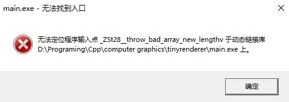

情况如图所示，_ZSt28__throw_bad_array_new_lengthv无法被定位。

经过检查，通过mingw64.exe运行的g++版本是12.1.0。这也是通过[官网的教程](https://www.msys2.org/)安装的版本。并且我们通常会把msys2\mingw64\bin\作为环境变量。

而通过安装gcc（命令是pacman -S gcc，而不是官网的教程提供的命令），然后用msys2.exe运行的g++版本是11.3.0。将环境变量换为msys2\usr\bin\，此时编译的程序可以正常运行不报错。

推测原因是版本问题，或者是msys2和mingw64有什么差别。

另外，通过mingw64打开的命令行来运行编译出来的exe文件不会报错。

另外，如果遇到failed to synchronize all databases (unable to lock database)，而经过检查又没有发现/var/lib/pacman/db.lck这个文件的存在，可以考虑用管理员身份打开msys2.exe。如果能够打开就说明是权限问题，可以将整个msys2的权限进行修改，允许非管理员用户完全控制。

2023.5.7 后记，msys2和mingw确实有区别，新博客文章见[链接](https://kegalas.top/p/msys2mingw64cygwin%E7%9A%84%E4%BD%BF%E7%94%A8%E5%8C%BA%E5%88%AB%E6%B5%85%E8%B0%88/)。另外本文上述办法没法完美解决，如果发给别人，他电脑上没有msys-2.0.dll，那么没法运行msys2编译的程序。
