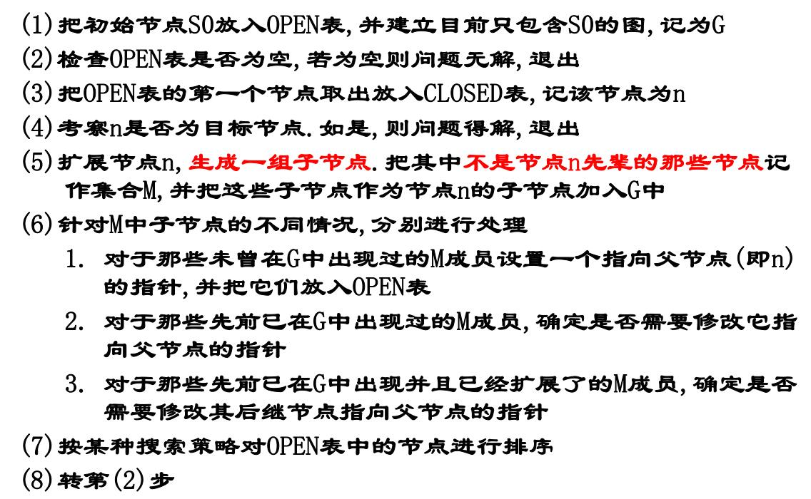
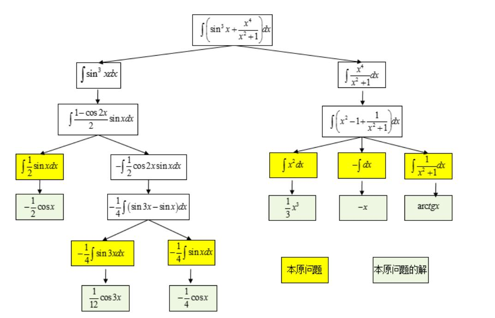
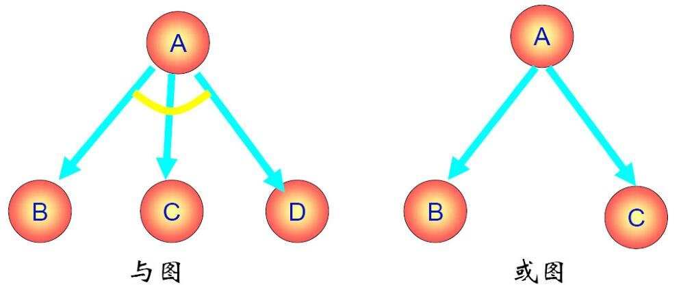
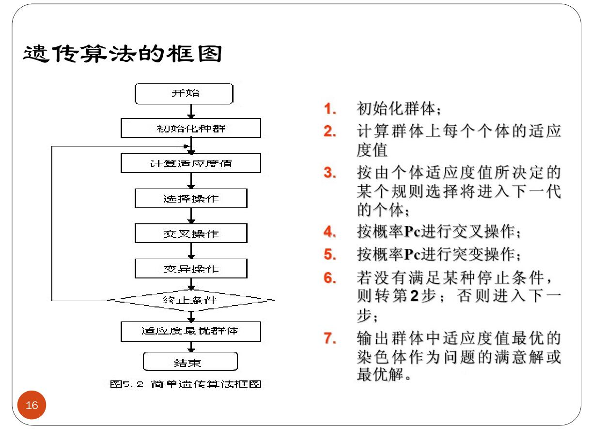
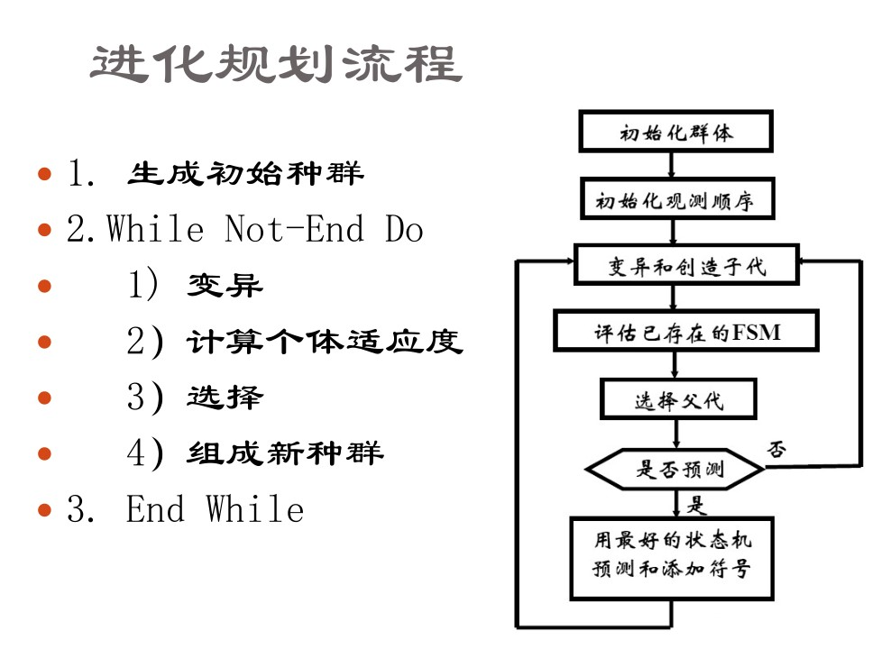
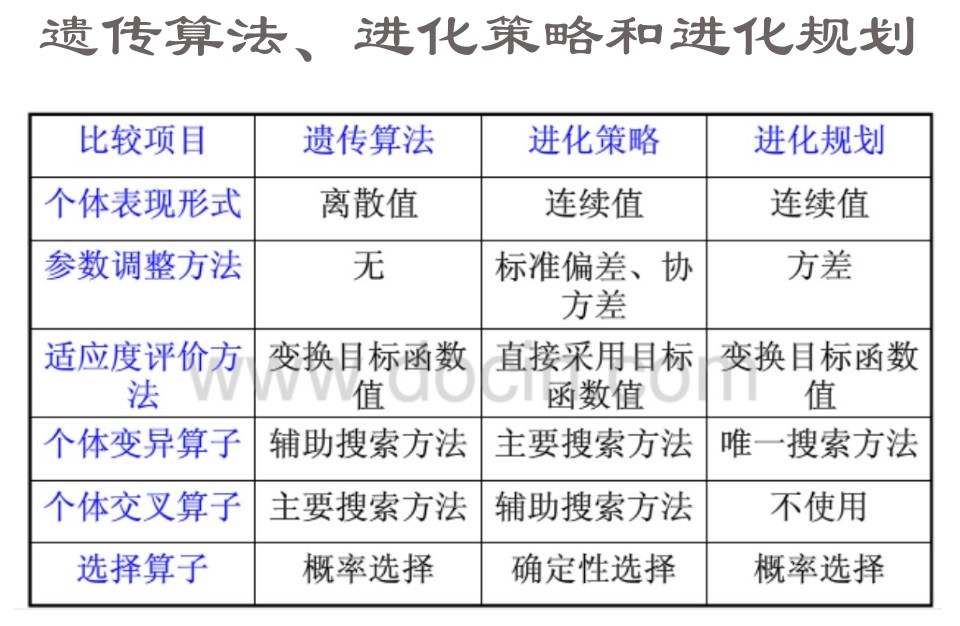
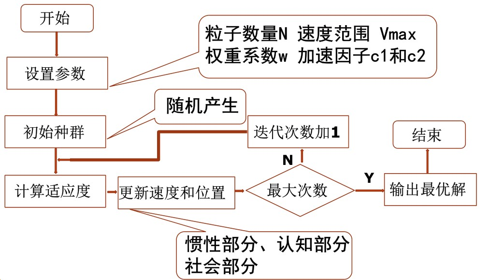
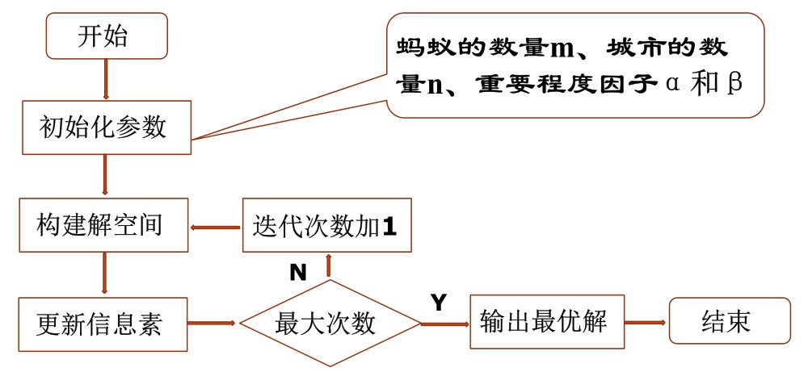

# 一些概念解释

## 弱人工智能与强人工智能

弱人工智能是指不能真正实现推理和解决问题的智能机器，这些机器表面看像是智能的，但是并不真正拥有智能，也不会有自主意识。

强人工智能是指真正能思维的智能机器，并且认为这样的机器是有知觉的和自我意识的，这类机器可分为类人（机器的思考和推理类似人的思维）与非类人（机器产生了和人完全不一样的知觉和意识，使用和人完全不一样的推理方式）两大类。

## 符号处理系统

### 六种功能

1. 输入符号
2. 输出符号
3. 存储符号
4. 复制符号
5. 建立符号结构：在符号系统中形成符号结构
6. 条件性迁移：根据已有符号，继续完成活动的过程

可以把人看作是一个物理符号系统。如果一个物理符号系统具有上述全部6种功能，能够完成这个全过程，那么它就是一个完整的物理符号系统。人具有上述6种功能；现代计算机也具备物理符号系统的这6种功能。

有一个假设：任何一个系统，如果它能表现出智能，那么它就必定能够执行上述6种功能。反之，任何系统如果具有这6种功能，那么它就能够表现出智能；这种智能指的是人类所具有的那种智能。把这个假设称为物理符号系统的假设。

这个假设有很多局限性，许多乐观预言都成了泡影。90年代之后人工智能领域形成了很多新的研究模式

## 人工智能的学派

### 符号主义

又称：逻辑主义、心理学派或计算机学派

原理：物理符号系统（即符号操作系统）假设和有限合理性原理

符号主义认为人的认知基元是符号，认知过程即符号操作过程。认为人是一个物理符号系统，计算机也是一个物理符号系统，因此能够用计算机来模拟人的智能行为。人工智能的核心问题是知识表示、知识推理和知识运用。

### 连接主义

又称：仿生学派或生理学派

原理：神经网络及神经网络间的连接机制与学习算法。

连接主义认为思维基元是神经元，而不是符号处理过程。认为人脑不同于电脑，并提出连接主义的大脑工作模式，用于取代符号操作的电脑工作模式。

### 行为主义

又称：进化主义或控制论学派

原理：控制论及感知—动作型控制系统

行为主义认为智能取决于感知和行动（所以被称为行为主义），提出智能行为的“感知—动作”模式。认为智能不需要知识、不需要表示、不需要推理；人工智能可以象人类智能一样逐步进化(所以称为进化主义)；智能行为只能在现实世界中与周围环境交互作用而表现出来。

## 研究领域

### 自然语言理解

是计算机对人类的书面和口头形式的自然语言信息进行处理加工的技术,涉及语言学,数学和计算机科学等多学科知识领域.其主要任务是建立各种自然语言处理系统,如:文字(语音)自动识别系统,电子词典,机器翻译,自动索引系统等.

### 模式识别

模式识别是指用计算机代替人类或帮助人类感知模式，是对人类感知外界功能的模拟，研究的是计算机模式识别系统，也就是使一个计算机系统具有模拟人类通过感官接受外界信息、识别和理解周围环境的感知能力。

其已在医学图象,指纹识别,天气预报,汽车牌照识别中广泛应用。

### 计算机视觉

机器视觉或计算机视觉是一种用计算机实现(或模拟)人的视觉功能，对客观外界进行感知和理解的技术。它是在图像处理和模式识别技术基础上发展起来的一门新兴的学科分支，其主要目的就是用机器识别客观外界景物，即从外界获得二维图像，抽取其特征(如形状、位置、大小、灰度、颜色、纹理等)构成本征描述，然后与已知物体的描述相匹配，从而辨认出所描述的物体。

### 专家系统

专家系统是一个具有大量专门知识和经验的程序系统，它应用于人工智能技术，根据某个领域中一个或多个人类专家提供的知识和经验进行推理和判断，模拟人类专家的决策过程，以解决那些需要专家决定的复杂问题。

### 机器学习

所谓机器学习，就是要使计算机能模拟人的学习行为，自动地通过学习获取知识和技能，不断改善性能，实现自我完善。机器学习就是计算机自动获取知识，它是知识工程的三个分支（使用知识、知识表示、获取知识）之一 。

### 神经网络

也称神经计算,是指一类计算模型,其工作原理模仿了人类大脑的某些工作机制,其利用大量人工神经元组成一个大网络,来实现大规模并行运算。

# 状态空间知识表示及其搜索技术

## 知识

**知识**是人们在改造客观世界的实践中积累起来的认识和经验。

一般来说，我们把有关信息关联在一起所形成的信息结构称为知识。

**知识表示**就是对知识的一种描述，一种计算机可以
接受的用于描述知识的数据结构。

**知识的要素**，一般而言，人工智能系统的知识包含事实、规则、控制和元知识。

**事实**：事物的分类、属性、事物间关系、科学事实、客观事实等。

**规则**：事物的行动、动作和联系的因果关系知识。

**控制**：是有关问题的求解步骤、规划、求解策略等技巧性知识，告诉怎么做一件事。

**元知识**：怎样使用规则、解释规则、校验规则、解释程序结构等知识。是有关知识的知识，是知识库中的高层知识。

## 知识表示的一般方法

一般有：状态空间法、问题归约法、谓词逻辑法、语义网络、框架表示、剧本表示、过程表示等。

### 状态空间法

问题求解(problem solving)是个大课题，它涉及归约、推断、决策、规划、常识推理、定理证明和相关过程的核心概念。在分析了人工智能研究中运用的问题求解方法之后，就会发现许多问题求解方法是采用试探搜索方法的。也就是说，这些方法是通过在某个可能的解空间内寻找一个解来求解问题的。这种基于解答空间的问题表示和求解方法就是状态空间法，它是以状态和算符(operator)为基础来表示和求解问题的。

**状态**

为描述某类不同事物间的差别而引入的一组最少变量$q_0,q_1,\cdots,q_n$的有序集合

可用矢量来表示：$Q=[q_0,q_1,\cdots,q_n]^T$

其中的每一个元素为集合的分量，称为状态变量。

给定每个分量的一组值就得到一个具体的状态。

**算符**

把问题从一种状态变换为另一种状态的手段。

**问题的状态空间**

是一个表示该问题全部可能状态及其关系的图。

它包含三种说明的集合,即三元状态（S，F，G），S-初始状态集合，F-操作符集合，G-目标状态集合。

**状态图示法**

用有向带权图来表示，图上的节点代表状态，边代表状态转移的路径以及转移的代价。这个路径通常也和算符有关。

## 搜索推理技术

知识表示是问题求解所必须的，从问题表示到问题的解决，有一个求解过程，也就是搜索推理过程。

### 搜索

根据问题的实际情况不断寻找可利用的知识,构造出一条代价较少的推理路线,使问题得到圆满解决的过程称为搜索

要求，找到一条从初始事实到问题的最终答案的一条推理路径、找到的这条路在时间和空间复杂度上最优。

在状态空间中搜索时，我们通常会用：图搜索策略、盲目搜索、启发式搜索等方法。

### 图搜索策略

这是一种在图中寻找路径的方法。

图中每个节点对应一个状态，每条连线对应一个操作符。

搜索方法有很多，例如深度优先搜索等，可以看算法竞赛整理。

在这里我们通常需要

1. 必须记住下一步可以走哪些点。OPEN表，记录还没有扩展的节点，用于存放刚生成的节点。
2. 必须记住哪些点走过了。CLOSED表，记录已经扩展过的节点，用于存放已经扩展或将要扩展的节点
3. 必须记住从目标返回的路径

其基本思想是，先把问题的初始状态作为当前扩展节点对其进行扩展，生成一组子节点，然后检查问题的目标状态是否出现在这些子节点中。

若出现，则找到问题的解。

若没有出现，则按照某种策略继续扩展。

重复上述过程，直到找到解或者没有可以操作的节点为止。

总结如下

其中第七步的排序可以是任意的即盲目的（属于盲目搜索），也可以用之后讨论的各种启发性思想或其他准则为依据（属于启发式搜索）。

### 盲目搜索

这是没有启发信息的一种搜索形式，搜索过程中获得的信息不会用来改进策略。

一般只适用于求解比较简单的问题。

不需要重排OPEN表。

种类主要分为：宽度优先、深度优先、等代价搜索。

DFS和BFS不再介绍，介绍一个有界深度优先搜索。

**有界深度优先搜索**

对深度优先搜索引入搜索深度的界限（设为$d_m$），当搜索深度达到了深度界限，而仍未出现目标节点时，就换一个分支进行搜索。

**等代价搜索**

它宽度优先搜索的一种推广。不是沿着等长度路径断层进行扩展，而是沿着等代价路径断层进行扩展。

**代价树的广度优先搜索**

每次从OPEN表中选择节点往CLOSED表传送时，总是选择其中代价最小的节点。

换句话说就是用二叉堆去维护OPEN表的节点。

**代价树的深度优先搜索**

如果说深度优先搜索是将后继节点按枚举顺序放入OPEN表里，那么代价树的深度优先搜索就是将后继节点按代价从小到大的顺序放入OPEN表。

### 启发式搜索

特点是重排OPEN表,选择最有希望的节点加以扩展。种类有：有序搜索、$A^*$算法等等。

**启发式搜索的估价函数**

估价函数(evaluation function)，是估算节点希望程度的量度，用$f(n)$表示节点$n$的估价函数值。

建立估价函数的一般方法是：提出任意节点与目标集之间的距离量度或差别量度

**有序搜索**

有序搜索，也称最好优先搜索，选择OPEN表上具有最小$f$值的节点作为下一个要扩展的节点。

**$A^*$算法**

它是有序搜索的一种，其特点在于对估价函数的定义上。

用$k(n_i,n_j)$表示任意两个节点$n_i$和$n_j$之间最小代价路径的实际代价。

如果两个节点没有通路，则$k$没有定义。

对于一个具体的目标节点$t_i$，用$h^*(n)$表示整个目标节点集合$\{t_i\}$上所有$k(n,t_i)$中最小的一个，此时$h^*(n)$就是从$n$到目标节点最小代价路径的代价，从$n$到目标节点的代价为$h^*(n)$的任一路径就是一条最佳路径。

估价函数设计如下(S是初始状态)

$$
g^*(n) = k(S,n)
$$

$$
f^*(n) = g^*(n)+h^*(n)
$$

$f^*(n)$就是从$S$开始约束通过节点$n$的一条最佳路径的代价。

希望估价函数$f$是$f^*$的一个估计，$g$是$g^*$的一个估计，$h$是$h^*$的一个估计，$h$叫做启发函数

$$
f(n) = g(n)+h(n)
$$

在图搜索中，如果OPEN表的重排是根据$f(n) = g(n)+h(n)$来进行的，那么称为$A$算法。

在$A$算法中,如果对所有的$n$存在$h(n)\leq h^*(n)$ ,则称$h(n)$为$h^*(n)$的下界,它表示某种偏于保守的估计;

采用$h^*(n)$的下界$h(n)$为启发函数的$A$算法，称为$A^*$算法。

# 问题归约知识表示及其搜索技术

已知问题的描述，通过一系列变换把此问题最终变为一个子问题集合；这些子问题的解可以直接得到，从而解决了初始问题。

该方法也就是从目标(要解决的问题)出发逆向推理，建立子问题以及子问题的子问题，直至最后把初始问题归约为一个平凡的本原问题集合。这就是问题归约的实质。

问题归约法的组成部分：

1. 一个初始问题描述
2. 一套把问题变为子问题的操作符
3. 一套本原问题描述

举个例子

## 与或图表示

**或节点**：只要解决某个问题就可以解决其父节点的问题

**与节点**：只有解决所有子问题才可以解决其父节点的问题

**终叶节点**：对应本原问题的节点

**可解节点**：如下定义

1. 终叶节点是可解节点
2. 如果某个非终叶节点含有**或**后继节点，那么只有当其后继节点至少有一个是可解的时，此非终叶节点才是可解的。
3. 如果某个非终叶节点含有**与**后继节点，那么只要当其后继节点全部为可解时，此非终叶节点才是可解的

**不可解节点**：如下定义

1. 没有后裔的非终叶节点为不可解节点
2. 如果某个非终叶节点含有**或**后继节点，那么只有当其全部后裔为不可解时，此非终叶节点才是不可解的。
3. 如果某个非终叶节点含有**与**后继节点，那么只要当其后裔至少有一个为不可解时，此非终叶节点才是不可解的。

## 与或图搜索

整体与之前提到的图搜索基础没有差别，只是要去记录节点的可解性。如果最终初始节点可解，原问题就有解，否则就无解。

## Max-Min搜索

- 目的是为博弈的双方中的一方寻找一个最优行动方案
- 要寻找这个最优方案，就要通过计算当前所有可能的方案来进行比较；
- 方案的比较是根据问题的特征来定义一个估价函数，用来估算当前博弈树端节点的得分；
- 当计算出端节点的估值后，再推算出父节点的得分（即计算倒推值）；
- - 对或节点，选其子节点中一个最大得分作为父节点的得分
- - 对与节点，选其子节点中一个最小得分作为父节点的得分
- 如果一个行动方案能获得较大的倒推值，则它就是当前最好的行动方案。

假设Max是机器人下棋，Min是人类对手下棋，搜索的步骤是

1. 以$c(o)$为根，生成$k$-步博弈树；
2. 评估博弈树叶节点对应的博弈状态(棋局)；
3. 进行极大极小运算 (Max-Min 运算)；
4. 等待 Min 行棋，产生新的 c(o)，返回 step1.

其实和人类思考差不多，往下多想$k$步可能的局面，选择自己最优，对方最差的局面。但是机器暴力地枚举了所有可能。

## $\alpha-\beta$剪枝

之前说的暴力算法，先生成一棵博弈树，然后再计算其倒推值，效率非常低。

而$\alpha-\beta$剪枝技术的基本思想是，边生成博弈树边计算评估各节点的倒推值并且根据评估出的倒推值范围，及时停止扩展那些已无必要再扩展的子节点，即相当于剪去了博弈树上的一些分枝，从而节约了机器开销，提高了搜索效率。

# 谓词逻辑表示与推理技术

谓词逻辑的概念和离散数学中讲授的一样，不再重复。具体可见<u>**[离散数学整理](../离散数学整理)**</u>

## 谓词逻辑法

谓词逻辑法采用谓词合式公式和一阶谓词演算把要解决的问题变为一个有待证明的问题,然后采用消解原理和消解反演来证明一个新语句是从已知的正确语句导出的,从而证明新语句也是正确的.

## 利用谓词公式进行知识表示的步骤

1. 定义谓词及个体，确定其含义
2. 根据要表达的事物或概念,为每个谓词中的变元赋值
3. 根据表达的知识的含义,用适当的连接符号将各个谓词连接起来,形成谓词公式。

## 置换与合一

### 置换

介绍一下在离散数学中不是很详细的部分。

一个表达式的置换就是在该表达式中用置换项置换变量。

置换是形如

$$
\{t_1/x_1,t_2/x_2,\cdots,t_n/x_n\}
$$

的有限集合。其中，$t_i$是不同于$x_i$的项（常量、变量、函数）；$x_1,x_2,\cdots,x_n$是互不相同的变量；$t_i/x_i$表示用$t_i$代换$x_i$

令置换$s=\{t_1/x_1,t_2/x_2,\cdots,t_n/x_n\}$，而$E$是一个谓词公式，那么$s$作用于$E$，就是将$E$中出现的$x_i$都以$t_i$代入。结果以$Es$表示，并称为$E$的一个例

而合成，也称为置换乘法，是置换之间的一种运算，若

$$
\theta = \{t_1/x_1,\cdots,t_n/x_n\}
$$

$$
\lambda = \{u_1/y_1,\cdots,u_m/y_m\}
$$

置换的乘积$\theta\cdot\lambda$是个新的置换，作用于$E$相当于先$\theta$后$\lambda$对$E$的作用。

先作置换

$$
\{t_1\cdot\lambda/x_1,\cdots,t_n\cdot\lambda/x_n,u_1/y_1,\cdots,u_m/y_m\}
$$

若$y_i\in\{x_1,\cdots,x_n\}$时，先从中删除$u_i/y_i$；$t_i\cdot\lambda=x_i$时，再从中删除$t_i\cdot\lambda/x_i$

所得的置换称为$\theta$与$\lambda$的乘积，记作$\theta\cdot\lambda$

置换的乘法是有结合律的，但没有交换率。

### 合一

合一是寻找项对变量的置换，以使两表达式一致。

如果一个置换$s$作用于表达式集$\{E_i\}$的每个元素，则我们用$\{E_i\}s$来表示置换例的集。

称表达式集$\{E_i\}$是可合一的。如果存在一个置换$s$，使得：

$$
E_1s=E_2s=E_3s=\cdots
$$

那么我们称此$s$为$\{E_i\}$的合一者，因为$s$的作用是使
集合$\{E_i\}$成为单一形式。

通过置换最少的变量以使表达式一致，这个置换就叫最一般合一者,记为mgu。

## 消解原理

消解原理又称为归结原理。该原理是Robinson提出的一种基于逻辑的、采用反证法的推理方法。

消解法的基本原理是采用反证法或者称为反演推理方法，将待证明的表达式（定理）转换成为逻辑公式（谓词公式），然后再进行归结，归结能够顺利完成，则证明原公式(定理）是正确性的。

## 子句集的求解

先给出一些定义

**文字**

一个原子公式和原子公式的否定都叫做文字

**子句**

由文字的析取组成的公式

**空子句**

不包含任何文字的子句

**子句集**

由子句构成的集合

任一谓词演算公式可以化成一个子句集。由九个步骤组成

1. 消去蕴涵符号（使用蕴含律）
2. 减少否定符号的辖域，应用德摩根定律等使得每个否定符号都只结合一个谓词符号
3. 对变量标准化。在任一量词辖域内，受该量词约束的变量为一哑元(虚构变量)，它可以在该辖域内处处统一地被另一个没有出现过的任意变量所代替，而不改变公式的真值。
4. 消去存在量词

    1. 如果要消去的存在量词在某些全称量词的辖域内，例如$(\forall y)[(\exists x)P(x,y)]$中，中，存在量词是在全称量词的辖域内，我们允许所存在的$x$可能依赖于$y$值。令这种依赖关系明显地由函数$g(y)$所定义，它把每个$y$值映射到存在的那个$x$。这种函数叫做Skolem函数。如果用Skolem函数代替存在的$x$,我们就可以消去全部存在量词，并写成：$(\forall y)P(g(y),y)$
    2. 如果不在全称量词的辖域内，直接用一个新的常量符号来替代即可。
5. 化为前束形。把所有全称量词移到公式的左边，并使每个量词的辖域包括这个量词后面公式的整个部分。所得公式称为前束形。前束形公式由前缀和母式组成，前缀由全称量词串组成，母式由没有量词的公式组成。
6. 把母式化为合取范式
7. 消去全称量词
8. 消去连词符号$\wedge$。用$\{(A\vee B),(A\vee C)\}$替代$(A\vee B)\wedge(A\vee C)$
9. 更换变量名称，把每个子句中重复变量的名称换成不同的。

## 消解反演

一般过程

1. 建立子句集$S$
2. 从子句集$S$出发,仅对$S$的子句间使用归结推理规则（也即反证法）
3. 如果得出空子句, 则结束;否则转下一步
4. 将所得归结式仍放入$S$中
5. 对新的子句集使用归结推理规则
6. 转3.

空子句不含有文字,它不能被任何解释满足,所以空子句是永假的,不可满足的。

归结过程出现空子句,说明出现互补文字,说明S中有矛盾,因此S是不可满足的。

## 语义网络法

语义网络是知识的一种结构化图解表示，它由节点和弧线组成。节点用于表示实体、概念和情况等，节点之间的弧线用于表示节点间的关系。

## 框架表示

框架是一种结构化表示法，通常采用语义网络中的节点-槽-值表示结构。

# 规则演绎系统

基于规则的演绎推理是一种直接的推理方法，它不像消解反演把知识转化为子句集，而是把有关问题的知识和信息划分为规则和事实两种类型。

规则由包含蕴含形式的表达式表示，事实由无蕴含形式的表达式表示，并画出相应的与或图，然后通过规则进行演绎推理。

规则演绎系统可以分为规则正向演绎推理、规则逆向演绎系统和规则双向演绎系统。

基于规则的问题求解系统运用下述规则来建立：

$$
If\to Then
$$

其中，If部分可能由几个if组成，而Then部分可能由一个或一个以上的then组成。

在这种系统中，通常称每个if部分为前项，称每个then部分为后项。

## 规则正向演绎系统

规则正向演绎系统是从事实到目标进行操作的，即从状况条件到动作进行推理的，也就是从if到then的方向进行推理的。

过程

1. 事实表达式的与或形变换。把事实表示为非蕴涵形式的与或形，作为系统的总数据库。具体变换步骤与前述化为子句形类似。
2. 事实表达式的与或图表示，即用与或图来表达事实表达式。
3. 与或图的F规则变换

> 这些规则是建立在某个问题辖域中普通陈述性知识的蕴涵公式基础上的。我们把允许用作规则的公式类型限制为下列形式：

$$
L\Rightarrow W
$$

> 式中：$L$是单文字；$W$为与或形的公式。

4. 作为终止条件的目标公式

> 基于规则的正向演绎推理的基本原理是：应用F规则作
用于表示事实的与或图，改变与或图的结构，从而产生
新的事实，直到推出目标公式，则推理成功结束。

> 其推理过程为

> 1. 首先用与或图把已知事实表示出来。
> 2. 用F规则的左部和与或图的叶节点进行匹配，并将匹配成功的F规则加入到与或图中，即利用F规则转换与或图。
> 3. 重复第（2）步，直到产生一个含有以目标节点作为终止节点的解图为止。

## 规则逆向演绎系统

规则逆向演绎系统是从then向if进行推理的，即从目标或动作向事实或状况条件进行推理的。

逆向演绎系统能够处理任意形式的目标表达式。采用和变换事实表达式类似的过程，把目标公式化成与或形。

**与或图的B规则变换**

这个B规则是建立在确定的蕴涵式基础上的，正如正向系统的F规则一样。不过，我们现在把这些B规则限制为: $W\Rightarrow L$形式的表达式。

其中，W为任一与或形公式，L为文字，而且蕴涵式中任何变量的量词辖域为整个蕴涵式。其次，把B规则限制为这种形式的蕴涵式还可以简化匹配，使之不会引起重大的实际困难。

此外，可以把像$W\Rightarrow(L1\wedge L2)$这样的蕴涵式化为两个规则$W\Rightarrow L1$和$W\Rightarrow L2$。

**作为终止条件的事实节点的一致解图**

逆向系统中的事实表达式均限制为文字合取形，它可以表示为一个文字集。当一个事实文字和标在该图文字节点上的文字相匹配时，就可把相应的后裔事实节点添加到该与或图中去。这个事实节点通过标有mgu的匹配弧与匹配的子目标文字节点连接起来。同一个事实文字可以多次重复使用(每次用不同变量)，以便建立多重事实节点。逆向系统成功的终止条件是与或图包含有某个终止在事实节点上的一致解图。

## 规则双向演绎系统

正向和逆向组合系统是建立在两个系统相结合的基础上的。此组合系统的总数据库由表示目标和表示事实的两个与或图结构组成，并分别用F规则和B规则来修正。

双向演绎系统的主要复杂之处在于其终止条件，终止涉及两个图结构之间的适当交接处。这些结构可由标有合一文字的节点上的匹配棱线来连接。

## 产生式系统

用来描述若干个不同的以一个基本概念为基础的系统。这个基本概念就是产生式规则或产生式条件和操作对的概念。

在产生式系统中，论域的知识分为两部分：用事实表示静态知识，如事物、事件和它们之间的关系；用产生式规则表示推理过程和行为。由于这类系统的知识库主要用于存储规则，因此又把此类系统称为基于规则的系统。

# 不确定性推理

## 模糊计算和模糊推理

与二值逻辑这样的非真即假的概念不同，模糊概念中，从属于该概念到不属于该概念之间无明显分界线。

比如快慢、大小、软硬、强弱等。

其基本思想是，用属于程度替代属于或不属于。

### 经典集合

设$A$是论域$U$上的一个集合，对任意$u\in U$，令

$$
C_A(u) = \left\{\begin{matrix}
1,u\in A\\
0,u\notin A
\end{matrix}\right.
$$

则称$C_A(u)$为集合$A$的特征函数。

### 模糊理论基本概念

**模糊集合**

论域$U$中的模糊集$F$用一个在区间$[0,1]$的取值的隶属函数$\mu_F$来表示，即：

$$
\mu_F:U\to[0,1]
$$

$\mu_F$称为$F$的隶属函数，$\mu_F(u)$称为$u$对$A$的隶属度。

直观上来说，就是将一些元素属于某个集合的程度映射到连续的$[0,1]$上。

### 模糊集的表示方法

若$U$为离散域且为有限集合时，模糊集合可以表示为：

**扎德表示法**

$$
F = \sum^n_{i=1}\mu_F(u_i)/u_i
$$

其中“$/$”符号表示的意思是，分母是论域中的元素，分子是该元素对模糊子集$F$的隶属度。$\sum$也不是表示相加，只是一个记号。

比如我们写出来的可能是$A = 1/u_1+0.7/u_2+0/u_3+0.5/u_4$这样的形式。如果隶属度为$0$可以省略不写。

**序偶表示法**

$$
F=\{(u_1,\mu(u_1)),(u_2,\mu(u_2)),\cdots,(u_n,\mu(u_n))\}
$$

**向量表示法**

$$
F = \{\mu(u_1),\mu(u_2),\cdots,\mu(u_n)\}
$$

无论论域是有限的还是无限的，连续的还是离散的，扎德都用如下记号作为模糊子集的一般表示形式：

$$
F = \int_U\frac{\mu_F}{u}
$$

这里的积分号不是数学中的积分，也不是求和，只是表示论域中各元素与其隶属度对应关系的总括，是一个记号。

### 集合运算

**定义1**

设$A,B$是论域$U$的模糊集，即$A,B\in F(U)$，若对于任一$u\in U$都有$\mu_B(u)\leq\mu_A(A)$，则称$B$包含于$A$，或者说$B$是$A$的一个子集，记作$B\subseteq A$。若对于任一$u\in U$都有$\mu_B(u)=\mu_A(A)$，则称$B$等于$A$，记作$B=A$

**定义2**

并运算（$A\bigcup B$）的隶属度函数$\mu_{A\bigcup B}$对所有的$u\in U$被逐点定义为取大运算，即

$$
\mu_{A\bigcup B} = \mu_A(u)\vee\mu_B(u)
$$

式中，$\vee$符号取极大值运算。

**定义3**

交运算（$A\bigcap B$）的隶属度函数$\mu_{A\bigcap B}$对所有的$u\in U$被逐点定义为取小运算，即

$$
\mu_{A\bigcap B} = \mu_A(u)\wedge\mu_B(u)
$$

式中，$\wedge$符号取极小值运算。

**定义4**

补，隶属度函数$\mu_{\bar A}$，对所有的$u\in U$，被逐点定义为$\mu_{\bar A}(u) = 1-\mu_{A}(u)$

模糊集合中有时会用$\neg A$表示$A$的补集。

**定理**

集合运算的定理和经典的集合没有区别，例如结合、分配律，德摩根律等等。

### 模糊集的截集

**定义1**

设$A\in F(u),\lambda\in[0,1]$，则

1. $A_\lambda=\{u|u\in U,\mu_A(u)\geq\lambda\}$，称$A_\lambda$为$A$的一个$\lambda$截集，称$\lambda$为阈值（置信水平）
2. $A_\lambda=\{u|u\in U,\mu_A(u)>\lambda\}$，称$A_\lambda$为$A$的一个$\lambda$强截集
3. $SuppA=\{u|u\in U,\mu_A(u)>0\}$为$A$的支集
4. $KerA=\{u|u\in U,\mu_A(u)=1\}$为$A$的核

当$A$的核不为空，则称$A$为正规$F$集。

### 模糊集合的模糊度

模糊度是模糊集模糊程度的一种度量

**定义**

设$A\in F(U)$，$d$是定义在$F(U)$上的一个实函数，如果它满足以下条件：

1. 对任意$A\in F(U)$，有$d(A)\in[0,1]$
2. 当且仅当$A$是一个普通集合时，$d(A) = 0$
3. 若$A$的隶属函数$\mu_A(U)\equiv0.5$，则$d(A)=1$
4. 若$A,B\in F(U)$，且对任意$u\in U$，满足

$$
\mu_B(u)\leq\mu_A(u)\leq0.5或者\mu_B(u)\geq\mu_A(u)\geq0.5
$$

则有$d(B)\leq d(A)$

5. 对任意$A\in F(U)$，有$d(A)=d(\neg A)$

则称$d$为定义在$F(U)$上的一个模糊度，$d(A)$称为$A$的模糊度。

直观地理解

- 模糊度是$[0,1]$上的一个数
- 普通集合的模糊度是$0$，也就代表其不模糊
- 越靠近$0.5$就越模糊，$\mu_A(u)=0.5$时最模糊
- 模糊集$A$与其补集$\neg A$具有相同的模糊度

**模糊度的计算方法**

*Haming（海明）模糊度*

$$
d_1(A) = \frac{2}{n}\sum^n_{i=1}|\mu_A(u_i)-\mu_{A_{0.5}}(u_i)|
$$

其中，$\mu_{A_{0.5}}(u_i)$是$A$的$\lambda=0.5$截集的隶属函数。由于$A_{0.5}$是一个普通集合，所以$\mu_{A_{0.5}}(u_i)$实际上是特征函数

*Euclid（欧几里得）模糊度*

$$
d_2(A) = \frac{2}{\sqrt n }(\sum^n_{i=1}|\mu_A(u_i)-\mu_{A_{0.5}}(u_i)|^2)^{1/2}
$$

*Minkowski（明可夫斯基）模糊度*

$$
d_p(A) = \frac{2}{n^{1/p}}(\sum^n_{i=1}|\mu_A(u_i)-\mu_{A_{0.5}}(u_i)|^p)^{1/p}
$$

*Shannon（香农）模糊度*

$$
d(A) = \frac{1}{n\ln 2}\sum^n_{i=1}S(\mu_A(u_i))
$$

其中$S(x)$是定义在$[0,1]$上的香农函数，即

$$
S(x) = \left\{\begin{matrix}
-x\ln x-(1-x)ln(1-x),\quad &x\in(0,1) \\
0,\quad &x=1\ or\ x = 0
\end{matrix}\right.
$$

### 模糊数

模糊的数量，例如：500人左右，大约0.6等

**定义**

如果实数域$R$上的模糊集$A$的隶属函数$\mu_A(u)$在$R$上连续且具有如下性质

1. $A$是凸模糊集，即对任意$\lambda\in[0,1]$，$A_\lambda$是闭区间
2. $A$是正规模糊集，即存在$u\in R$，使得$\mu_A(u)=1$

则称$A$为一个模糊数

直观上模糊数的隶属函数图形是单峰的，且在峰顶使隶属度达到$1$

### 模糊关系

在普通集合上定义的关系已经在离散数学中介绍过了。这种关系是一种确定性的关系，要么有，要么没有。

而模糊关系就不是非常明确的。

**定义**

设论域$U,V$，则$U\times V$（笛卡尔积）的一个子集$R$就是从$U$到$V$的模糊关系，记作

$$
U\overset{R}{\rightarrow} V 
$$

这里的模糊关系$R$是属于模糊二元关系。

其隶属函数为映射$\mu_R:U\times V\to[0,1]$

隶属度$\mu_R(u_0,v_0)$，表示$u_0$与$v_0$具有关系$R$的程度。

对于有限论域$U = \{u_1,u_2,\cdots,u_m\},V = \{v_1,v_2,\cdots,v_n\}$，则$U$对$V$的模糊关系的隶属函数可以用$m\times n$阶模糊矩阵$R$来表示，即

$$
R = (r_{ij})_{m\times n}
$$

**模糊集的笛卡尔乘积**

模糊集$A,B$的笛卡尔乘积为

$$
A\times B = \int_{U\times V}\min(\mu_A(u),\mu_B(v))/(u,v)
$$

**模糊关系的合成**

设$R_1$与$R_2$分别是$u\times v$及$v\times w$上的两个模糊关系，则$R_1$与$R_2$的合成是指从$u$到$w$的一个模糊关系，记为$R_1\circ R_2$，其隶属度为

$$
\mu_{R_1\circ R_2}(u,w) = \{\bigvee^{v}\mu_{R_1}(u,v)\wedge\mu_{R_2}(v,w) \}
$$

### 模糊推理

**模糊命题**

含有模糊概念、模糊数据的语句称为模糊命题。

它的一般表示形式为

$$
x\quad is \quad A
$$

或者

$$
x\quad is \quad A(CF)
$$

其中$A$是模糊概念或模糊数，用相应的模糊集及隶属函数刻画；$x$是论域上的变量，用以代表所论述对象的属性； $CF$是该模糊命题的可信度，它既可以是一个确定的数，也可以是一个模糊数或者模糊语言值。

模糊语言值是指表示大小、长短、多少等程度的一些词汇。如：极大、很大、相当大、比较大。模糊语言值同样可用模糊集描述。

## 模糊的知识表示

1. 模糊产生式规则的一般形式是

$$
IF\quad E\quad THEN\quad H\quad (CF,\lambda)
$$

其中$E$是用模糊命题表示的模糊条件；$H$是用模糊命题表示的模糊结论；$CF$是知识的可信度因子，它既可以是一个确定的数，也可以是一个模糊数或模糊语言值。$\lambda$是匹配度的阈值，用以指出知识被运用的条件。

2. 推理中所用的证据也用模糊命题表示，一般形式为

$$
x\quad is \quad A'
$$

或者

$$
x\quad is \quad A'(CF)
$$

3. 模糊推理要解决的问题：证据与知识的条件是否匹配；如果匹配，如何利用知识及证据推出结论。

## 模糊匹配与冲突消解

### 贴近度

设$A,B$分别是论域$U=\{u_1,u_2,\cdots,u_n\}$上的两个模糊集，则它们的贴近度定义为：

$$
(A,B) = [A\cdot B+(1-A\odot B)]/2
$$

其中

$$
A\cdot B = \bigvee_U(\mu_A(u_i)\wedge\mu_B(u_i))
$$

是内积

$$
A\odot B = \bigwedge_U(\mu_A(u_i)\vee\mu_B(u_i))
$$

是外积。

### 语义距离

**海明距离**

$$
d(A,B) = \frac{1}{n}\sum^n_{i=1}|\mu_A(u_i)-\mu_B(u_i)|
$$

$$
d(A,B) = \frac{1}{b-a}\int^b_a|\mu_A(u)-\mu_B(u)|du
$$

**欧几里得距离**

$$
d(A,B) = \frac{1}{\sqrt n}\sqrt{\sum^n_{i=1}(\mu_A(u_i)-\mu_B(u_i))^2}
$$

**明可夫斯基距离**

$$
d(A,B) = [\frac{1}{n}\sum^n_{i=1}|\mu_A(u_i)-\mu_{A_{0.5}}(u_i)|^p]^{1/p},\quad p\geq1
$$

**切比雪夫距离**

$$
d(A,B) = \underset{1\leq i\leq n}{\max}|\mu_A(u_i)-\mu_B(u_i)|
$$

匹配度为$1-d(A,B)$

### 相似度

1. 最大最小法

$$
r(A,B) = \frac{\sum\min\{\mu_A(u_i),\mu_B(u_i)\}}{\sum\max\{\mu_A(u_i),\mu_B(u_i)\}}
$$

2. 算术平均法

$$
r(A,B) = \frac{\sum\min\{\mu_A(u_i),\mu_B(u_i)\}}{\frac{1}{2}\sum(\mu_A(u_i)+\mu_B(u_i))}
$$

3. 几何平均最小法

$$
r(A,B) = \frac{\sum\min\{\mu_A(u_i),\mu_B(u_i)\}}{\sum\sqrt {(\mu_A(u_i)\times\mu_B(u_i))}}
$$

4. 相关系数法

$$
r(A,B) = \frac{\sum(\mu_A(u_i)-\bar\mu_A)\times(\mu_B(u_i)-\bar\mu_B)}{\sqrt{[\sum(\mu_A(u_i)-\bar\mu_A)^2]\times[\sum(\mu_B(u_i)-\bar\mu_B)^2]}}
$$

$$
\bar\mu_A = \frac{1}{n}\sum\mu_A(u_i),\quad\bar\mu_B = \frac{1}{n}\sum\mu_B(u_i)
$$

5. 指数法

$$
r(A,B) = \exp\bigg(-\sum|\mu_A(u_i)-\mu_B(u_i)|\bigg)
$$

### 复合条件的模糊匹配

1. 分别计算出每一个子条件与其证据的匹配度
2. 求出整个前提条件与证据的总匹配度。目前常用的方法有“取极小”和“相乘”等。
3. 检查总匹配度是否满足阈值条件，如果满足就可以匹配，否则为不可匹配。

### 冲突消解

1. 按匹配度大小排序
2. 按加权平均值排序
3. 按广义顺序关系排序

## 模糊推理的基本形式

1. 模糊假言推理

知识：$IF\quad x\ is\ A\quad THEN\quad y\ is\ B$

证据：$x\ is\ A'$

结论：$y\ is\ B'$

2. 模糊拒取式推理

知识：$IF\quad x\ is\ A\quad THEN\quad y\ is\ B$

证据：$y\ is\ B'$

结论：$x\ is\ A'$

知识中只含有简单条件，且不带可信度因子的模糊推理称为简单模糊推理。

**合成推理知识**

对于知识$IF\quad x\ is\ A\quad THEN\quad y\ is\ B$

首先构造出$A,B$之间的模糊关系$R$，

- 如果已知证据是$x\ is\ A'$，且$A,A'$之间可以进行模糊匹配，则$B' = A'\circ R$

- 如果已知证据是$y\ is\ B'$，且$B,B'$之间可以进行模糊匹配，则$A' = R\circ B'$

## 构造模糊关系R的方法

### 扎德方法

扎德提出了两种方法：一种称为条件命题的极大极小规则。另一种称为条件命题的算术规则，由它们获得的模糊关系分别记为$R_m$和$R_a$

设$A\in F(U), B\in F(V)$，其分别表示为

$$
A = \int_U \mu_A(u)/u, B = \int_V \mu_B(u)/u
$$

则

$$
R_m = (A\times B)\cup(\neg A\times V) = \int_{U\times V}(\mu_A(u)\wedge\mu_B(v))\vee(1-\mu_A(u))/(u,v)
$$

$$
R_a = (\neg A\times V)\oplus(U\times B) = \int_{U\times V}1\wedge(1-\mu_A(u)+\mu_B(v))/(u,v)
$$

其中$\times$是笛卡尔积；有界和$x\oplus y=\min\{1,x+y\}$

### Mamdani方法

对于知识$IF\quad x\ is\ A\quad THEN\quad y\ is\ B$

$$
R_C = A\times B = \int_{U\times V}\mu_A(u)\wedge\mu_B(v)/(u,v)
$$

### Mizumoto方法

米祖莫托等人根据多值逻辑中计算$T(AB)$的定义，提出了一组构造模糊关系的方法，分别记为$R_s,R_g,R_{sg},R_{gs},R_{gg},R_{ss}$等等。

$$
R_s = A\times V \underset{s}{\Rightarrow} U\times B = \int_{U\times V}[\mu_A(u)\underset{s}{\to}\mu_B(v)]/(u,v)
$$

其中

$$
\mu_A(u)\underset{s}{\to}\mu_B(v) = \left\{\begin{matrix}
1,\mu_A(u)\leq\mu_B(v) \\
0,\mu_A(u)>\mu_B(v)
\end{matrix}\right.
$$

$$
R_s = A\times V \underset{g}{\Rightarrow} U\times B = \int_{U\times V}[\mu_A(u)\underset{g}{\to}\mu_B(v)]/(u,v)
$$

其中

$$
\mu_A(u)\underset{g}{\to}\mu_B(v) = \left\{\begin{matrix}
1,&\mu_A(u)\leq\mu_B(v) \\
\mu_B(v),&\mu_A(u)>\mu_B(v)
\end{matrix}\right.
$$

## 模糊判决方法

在推理得到的模糊集合中取一个相对最能代表这个模糊集合的单值的过程就称作解模糊（去模糊）或模糊判决(Defuzzification)。

方法有：重心法、最大隶属度方法、加权平均法、隶属度限幅元素平均法等等。

### 重心法

所谓重心法就是取模糊隶属函数曲线与横坐标轴围成面积的重心作为代表点。理论上应该计算输出范围内一系列连续点的重心，即

$$
u = \frac{\int_x x\mu_N(x)dx}{\int_x \mu_N(x)dx}
$$

### 最大隶属度法

这种方法最简单，只要在推理结论的模糊集合中取隶属度最大的那个元素作为输出量即可。不过，要求这种情况下的隶属函数曲线一定是单峰曲线。如果该曲线是梯形平顶，那么具有最大隶属度的元素就可能不只一个，这时就要对所有取最大隶属度的元素求其平均值。

### 系数加权平均法

$$
u = \sum k_i\cdot x_i/\sum k_i
$$

其中系数$k_i$的选择要根据实际情况而定。

### 隶属度限幅元素平均法

用所确定的隶属度值 a对隶属度函数曲线进行切割，再对切割后大于等于该隶属度的所有元素进行平均，用这个平均值作为输出执行量，这种方法就称为隶属度限幅元素平均法。

## 不确定性推理的基本概念

不确定性推理是建立在非经典逻辑基础上的一种推理，它是对不确定性知识的运用与处理。

具体地说，所谓不确定性推理就是从不确定性的初始证据（即事实）出发，通过运用不确定性的知识，最终推出具有一定程度不确定性的结论。

## 不确定性推理中的基本问题

1. 不确定性的表示与度量

不确定性一般分为两类，一类是知识的不确定性，一类是证据的不确定性。

知识不确定性的表示：目前在专家系统中知识的不确定性一般是由领域专家给出的，通常用一个数值表示，它表示相应知识的不确定性程度，称为知识的静态强度。

证据不确定性的表示：证据不确定性的表示方法与知识不确定性的表示方法一致，通常也用一个数值表示，代表相应证据的不确定性程度，称之为动态强度。

2. 不确定性匹配算法及阈值的选择

推理是不断运用知识的过程,为了找到所需的知
识,需要在这一过程中用知识的前提与已知证据进
行匹配.只有匹配成功的知识才有可能被应用.

3. 组合证据不确定性的计算方法

即已知证据$E_1$和$E_2$的不确定性度量，求证据$E_1$和$E_2$的析取和合取的不确定性，常用的方法有：

- 最大最小法

$$
T(E_1\ AND\ E_2) = \min\{T(E_1),T(E_2)\}
$$

$$
T(E_1\ OR\ E_2) = \max\{T(E_1),T(E_2)\}
$$

- 概率法

$$
T(E_1\ AND\ E_2) = T(E_1)\times T(E_2)
$$

$$
T(E_1\ OR\ E_2) = T(E_1)+T(E_2) - T(E_1)\times T(E_2)
$$

- 有界法

$$
T(E_1\ AND\ E_2) = \max\{0,T(E_1)+T(E_2)-1\}
$$

$$
T(E_1\ OR\ E_2) = \min\{1,T(E_1)+T(E_2)\}
$$

其中，$T(E)$表示证据$E$为真的程度（动态强度），如可信度、概率等。

4. 不确定性的传递算法

- 在每一步推理中，如何把证据及知识的不确定性传递给结论
- 在多步推理中，如何把初始证据的不确定性传递给最终结论

5. 结论不确定性的合成

用不同知识进行推理得到了相同结论，但所得结论的
不确定性却不同。此时，需要用合适的算法对结论的
不确定性进行合成。

## 不确定性推理方法的分类

不确定性推理方法主要可分为模型法与控制法。

模型法：在推理一级对确定性推理进行扩展，引入证据的不确定性及知识的不确定性。

模型方法又分为数值方法和非数值方法两类。数值方法对不确定性进行定量的描述，按其所依据的理论又可分为基于概率的方法和基于模糊理论的方法。

本节主要针对模型方法中相关的典型算法展开.

### 逆概率法

*经典概率方法*

1. 设有如下产生式规则：

$$
\text{IF\quad E\quad\quad THEN\quad H}
$$

其中，$E$为前提条件，$H$为结论。条件概率$P(H|E)$可以作为在证据$E$出现时结论$H$的确定性程度，即规则的静态强度。

2. 对于复合条件

$$
E=E_1\ \text{AND}\ E_2\ \text{AND}\cdots\text{AND}\ E_n
$$

当已知条件概率$P(H|E_1,E_2,\cdots,E_n)$时，就可把它作为在证
据$E_1,E_2,\cdots,E_n$出现时结论H的确定性程度。

3. 先验概率：$P(H)$，后验概率$P(H|E)$

经典概率方法要求给出条件概率$P(H|E)$，在实际中通常比较困难。例如$E$代表咳嗽，$H$代表支气管炎，则$P(H|E)$表示在咳嗽的人群中患支气管炎的概率，这个比较困难，因为样本空间太大。而$P(E|H)$表示在得支气管炎的人群中咳嗽的概率，这个就比较容易获得。我们可以根据Bayes定理从$P(E|H)$推出$P(H|E)$

*优点*

逆概率法有较强的理论背景和良好的数学特性，当证据彼此独立时计算的复杂度比较低。

*缺点*

逆概率法要求给出结论$H_i$的先验概率$P(H_i)$及条件概率$P(E_j|H_i)$。

### 可信度方法

可信度方法是在确定性理论的基础上，结合概率论等提出的一种不确定性推理方法，简称C-F模型。该方法首先在医疗系统MYCIN中得到成功的应用。

*可信度的概念*

根据经验对一个事物和现象为真的相信程度称为可信度。

在可信度方法中，由专家给出规则或知识的可信度，从而可避免对先验概率、或条件概率的要求。

#### 1.知识不确定性的表示

在C-F模型中，知识是用产生式规则表示的，其一般形式为：

$$
\text{IF}\quad E\quad \text{THEN}\quad H\quad (CF(H,E))
$$

其中

1. 前提$E$可以是命题的合取和析取组合
2. 结论$H$可为单一命题，也可以是复合命题
3. $CF(H,E)$为确定性因子(Certainty factor)，简称可信度，用以量度规则的确定性（可信）程度。取值于$[-1，1]$，表示$E$为真时，对$H$的支持程度。$CF(H,E)$值越大，$E$就越支持$H$为真。

*可信度因子的定义*

$CF(H,E)$定义为

$$
CF(H,E) = MB(H,E) - MD(H,E)
$$

MB反映了证据对结论有利的一面，MD反映了证据对结论不利的一面。MB(Measure Belief) 表示因与$E$匹配的证据出现，使$H$为真的信任增长度。MD(Measure Disbelief)指不信任增长度，表示因与$E$匹配的证据出现，使$H$为真的不信任增长度。 MB和MD的定义为：

$$
MB(H,E) = \left\{\begin{matrix}
1 & ,P(H)=1\\
\dfrac{max\{P(H|E),P(H)\}-P(H)}{1-P(H)} & ,\text{other}
\end{matrix}\right.
$$

$$
MD(H,E) = \left\{\begin{matrix}
1 & ,P(H)=0\\
\dfrac{min\{P(H|E),P(H)\}-P(H)}{-P(H)} & ,\text{other}
\end{matrix}\right.
$$

- 当$P(H|E)>P(H)$时：表示证据E支持结论$H$，$MB(H,E)>0，MD(H,E)=0$。
- 当$P(H|E)< P(H)$时，表示$E$不支持$H$，$MD(H,E)>0， MB(H,E)=0$。当$p(H|E)=p(H)$时，表示$E$对$H$无影响，则有$MB=MD=0$
- $MB(H,E)$与$MD(H,E)$是互斥的：当$MB(H,E)>0$时，$MD(H,E)=0$;当$MD(H,E)>0$时，$MB(H,E)=0$

*$CF(H,E)$的计算公式*

根据上述定义，可知

$$
CF(H,E) = \left\{\begin{matrix}
MB(H,E)-0=\dfrac{P(H|E)-P(H)}{1-P(H)} & ,P(H|E) > P(H)\\
0 & ,P(H|E)=P(H)\\
0-MD(H,E)=-\dfrac{P(H)-P(H|E)}{P(H)}& ,P(H|E) < P(H)
\end{matrix}\right.
$$

从上式可以看出

$CF(H,E)>0$对应于$P(H|E)>P(H)$

$CF(H,E)=0$对应于$P(H|E)=P(H)$

$CF(H,E) < 0$对应于$P(H|E) < P(H)$

当且仅当$P(H|E)=1$时,$CF(H,E)=1$

当且仅当$P(H|E)=0$时,$CF(H,E)=-1$

$CF(H,E)$定性地反映了$P(H|E)$的大小,因此可以用$CF(H,E)$近似表示$P(H|E)$的大小,从而描述了规则的可信度。

#### 2.证据不确定性的表示

证据的不确定性也用可信度因子表示。如：$CF(E)=0.6$

$CF(E)$的取值范围：$[-1，+1]$。

$CF(E)>0$:表示证据以某种程度为真。

$CF(E)<0$:表示证据以某种程度为假。

$CF(E)$表示证据的强度，即动态强度。

设证据E所在的环境为$S$，则可用可信度$CF(E,S)$来表示$E在$S$下的确定性程度，并有：

$$
CF(E,S) = MB(E,S)-MD(E,S)
$$

若$S$下$E$为真，则$CF(E,S) = 1$；

若$E$为假，则$CF(E,S) =-1$；

若$S$对$E$的真值无影响，则$CF(E,S)= 0$。

类似于规则的不确定性，证据的可信度往往可由领域专家凭经验主观确定。

证据的可信度值来源于两种情况：

1. 初始证据由领域专家或用户给出；
2. 中间结论由不确定性传递算法计算得到。

#### 3.组合证据不确定性的算法

1. 当组合证据是多个单一证据的合取时，即:

$$
E=E_1\ \text{AND}\ E_2\ \text{AND}\cdots\text{AND}\ E_n
$$

则$CF(E)=min\{CF(E_1),CF(E_2),\cdots,CF(E_n)\}$

2. 当组合证据是多个单一证据的析取时，即:

$$
E=E_1\ \text{OR}\ E_2\ \text{OR}\cdots\text{OR}\ E_n
$$

则$CF(E)=max\{CF(E_1),CF(E_2),\cdots,CF(E_n)\}$

#### 4. 不确定性的传递

不确定性的传递算法定义如下：

$$
CF(H) = CF(H,E)\times max\{0,CF(E)\}
$$

由上式可以看出:

1. $CF(E)<0$时,$CF(H)=0$,说明该模型没有考虑证据为假时对结论$H$所产生的影响。
2. $CF(E)=1$时,$CF(H)=CF(H,E)$,说明规则可信度$CF(H,E)$就是证据为真时的结论$H$的可信度。

#### 5. 结论不确定性的合成算法

若由多条不同知识推出了相同的结论，但可信度不同，则可用合成算法求出综合的可信度。由于对多条知识的综合可通过两两的合成实现，所以下面只考虑两条知识的情况。

设有如下知识：

$$
\text{IF}\quad E_1\quad \text{THEN}\quad H\quad\quad (CF(H,E_1))
$$

$$
\text{IF}\quad E_2\quad \text{THEN}\quad H\quad\quad (CF(H,E_2))
$$

则结论H的综合可信度可分为如下两步算出：

1. 首先分别对每一条知识求出$CF(H)$

$$
CF_1(H) = CF(H,E_1)\times max\{0,CF(E_1)\}
$$

$$
CF_2(H) = CF(H,E_2)\times max\{0,CF(E_2)\}
$$

2. 然后用下述公式求出$E_1$与$E_2$对$H$的综合可信度$CF_{12}(H)$:

$$
CF_{12}(H) = \left\{\begin{matrix}
CF_1(H)+CF_2(H)-CF_1(H)\times CF_2(H) &,CF_1(H)\geq 0,CF_2(H)\geq 0\\
CF_1(H)+CF_2(H)+CF_1(H)\times CF_2(H) &,CF_1(H)<0,CF_2(H)<0\\
\dfrac{CF_1(H)+CF_2(H)}{1-min\{|CF_1(H)|,|CF_2(H)|\}} &,CF_1(H)\times CF_2(H)<0\\
\end{matrix}\right.
$$

*冲突消解*

$$
r_1: \text{IF}\quad \{E_1(\omega_1)\}\quad \text{THEN}\quad H_1\quad\quad (CF(H_1,E_1),\lambda_1)
$$

$$
r_2: \text{IF}\quad \{E_2(\omega_2)\}\quad \text{THEN}\quad H_2\quad\quad (CF(H_2,E_2),\lambda_2)
$$

且$CF(\{E_1(\omega_1)\})\geq\lambda_1,CF(\{E_2(\omega_2)\})\geq\lambda_2$

若$CF(\{E_1(\omega_1)\})\geq CF(\{E_2(\omega_2)\})$，则优先使用$r_1$进行推理。

### 加权的不确定性推理

#### 1. 知识的不确定性的表示

$$
\text{IF}\quad \{E_1(\omega_1)\}\quad \text{AND}\quad \{E_2(\omega_2)\}\quad \text{AND}\cdots\text{AND}\quad \{E_n(\omega_n)\}
$$

$$
\text{THEN}\quad H\quad (CF(H,E),\lambda)
$$

其中$\omega_i(i=1,2,\cdots,n)$是加权因子，$λ$是阈值，其值均由专家给出。

其中

$$
0\leq \omega_i\leq 1,\sum\omega_i=1
$$

#### 2. 组合证据不确定性的算法

若有$CF(E_1),CF(E_2),\cdots,CF(E_n)$，则组合证据的可信度为：

$$
CF(E)=\sum(\omega_i\times CF(E_i))
$$

#### 3. 不确定性的传递算法

当一条知识的$CF(E)$满足如下条件时，

$$
CF(E)\geq\lambda
$$

该知识就可被应用。结论$H$的可信度为：

$$
CF(H) = CF(H,E)\times CF(E)
$$

加权因子的引入不仅可以区分不同证据的重要性同时还可以解决证据不全时的推理问题。

**基于可信度的不确定性推理方法的特点**

*优点*

简单、直观。

*缺点*

可信度因子依赖于专家主观指定，没有统一、客观的尺度，容易产生片面性。

随着推理延伸，可信度越来越不可靠，误差越来越大。当推理深度达到一定深度时，有可能出现推出的结论不再可信的情况。

# 遗传算法

## 计算智能

计算智能就是受自然界（生物界）规律的启迪，根据其原理，模仿设计求解问题的算法。

计算智能:生物智能的计算模拟, 是一种智力方式的低层认知，它与人工智能的区别只是认知层次从中层下降至低层而已。中层系统含有知识，低层系统则没有。

当一个系统只涉及数值（低层）数据，含有模式识别部分，不应用人工智能意义上的知识，而且能够呈现出：

1. 计算适应性
2. 计算容错性
3. 接近人的速度
4. 误差率与人相近

则该系统就是计算智能系统。

当一个智能计算系统以非数值方式加上知识，即成为人工智能系统。

## 进化计算

进化计算是一类模拟生物进化过程与机制求解问题的自组织、自适应技术。

生物种群的生存过程普遍遵循达尔文的物竞天择、适者生存的进化准则；生物通过个体间的选择、交叉、变异来适应大自然环境。

依照达尔文的自然选择和孟德尔的遗传变异理论，生物的进化是通过繁殖、变异、竞争、选择来实现的，进化算法就是建立在上述生物模型基础上的一种随机搜索技术。

几十年来的研究与应用已经清楚地表明：虽然模拟自然进化搜索过程的一些模型还只是自然界生物体的粗糙简化，但是已经可以产生非常鲁棒的计算方法。

进化算法（Evolutionary Algorithm—EA）就是基于这种思想发展起来的，目前研究的进化算法主要有三种典型的算法：遗传算法、进化规划和进化策略。这三种算法是彼此独立发展起来的。

种群搜索策略和种群中个体之间的信息交换是进化算法的两大特点。它们的优越性主要表现在：

1. 进化算法在搜索过程中不容易陷入局部最优
2. 由于它们固有的并行性，进化算法非常适合于并行机
3. 由于它们容易介入到已有的模型中并且具有可扩展性，以及易于同别的技术混合等因素，因而进化算法目前已经在最优化、机器学习和并行处理等领域得到越来越广泛的应用。

## 基本思想

遗传算法把问题的解表示成“染色体”，在算法中即是以一定方式编码的串。并且，在执行遗传算法之前，给出一群“染色体”，也即假设解（候选解）。然后，把这些假设解置于问题的“环境”中，并按适者生存的原则，从中选择出较适应环境的“染色体”进行复制，再通过交叉，变异过程产生更适应环境的新一代“染色体”群。这样，一代一代地进化，最后就会收敛到最适应环境的一个“染色体”上，它就是问题的最优解。

其算法框图为

## 一些基本概念

- 串(String)
- - 它是个体(Individual)的形式，在算法中为二进制串或者其它编码方式的串，并且对应于遗传学中的染色体(Chromosome)。
- 种群(Population)
- - 个体的集合称为种群，串是种群的元素
- 种群规模(Population Size)
- - 在种群中个体的数量称为种群的规模。
- 基因(Gene)
- - 基因是串中的元素，基因用于表示个体的特征
- 适应度(Fitness)
- - 表示某一个体对于环境的适应程度

## 基本机理

- 一般的遗传算法由四个部分组成:
- - 编码机制、适应度函数、控制参数、遗传算子
- 编码机制(encoding mechanism)
- - 用遗传算法解决问题时，首先要对待解决问题的模型结构和参数进行编码，一般用字符串表示。
- 编码机制是GA的基础
- - GA不是对研究对象直接进行讨论,而是通过某种编码机制把对象统一赋于由特定符号(字母)按一定顺序排成的串(string)。正如研究生物遗传,是从染色体着手,染色体则是由基因排成的串。
- 适应度函数
- - 优胜劣败是自然进化的原则。优、劣要有标准。在GA中，用适应度函数描述每一个体的适应程度。
- - 对优化问题,适应度函数与目标函数直接相关。引进适应度函数的目的在于可根据其适应度对个体进行评估比较,定出优劣程度。
- - 在遗传算法的执行过程中,每一代有许多不同的个体(染色体)同时存在。这些染色体中哪个保留(生存)、哪个淘汰(死亡),是根据它们对环境的适应能力来决定的,适应性强的有更多的机会保留下来。
- - 适应性强弱是通过计算适应度函数f(x)的值来判别的,这个值称为适应值。适应度函数f(x)的构成与目标函数有密切关系。
- 算法参数；在GA的实际操作时,需适当确定某些参数的值以提高选优的效果。这些参数包含：
- - 字符串所含字符的个数,即串长。这一长度为常数,即为定长,记为$L$
- - 每一代种群的大小,即所包含字符串的个数,也称种群规模,记为$n$
- - 交叉概率(crossover rate),即施行交叉算子的概率,记为$P_c$
- - 变异概率(mutation rate),即施行变异算子的概率,记为$P_m$
- 在GA中,种群规模$n$太小时难以求出最优解，太大则增长收敛时间。一般$n=30\sim 160$。
- 交叉概率$P_c$太小时难以向前搜索，太大则容易破坏高适应值的结构。一般取$P_c=0.25\sim 0.75$。
- 变异概率$P_m$太小时难以产生新的基因结构，太大使遗传算法成了单纯的随机搜索。一般取$P_m=0.01\sim 0.2$。系统参数对算法的收敛速度及结果有很大的影响，应视具体问题选取不同的值。

## 遗传算子

1. 选择算子(Selection/Reproduction): 选择算子从 种群中按某一概率成对选择个体，某个体$x_i$被选择的概率$P_i$与其适应度值成正比。最通常的实现方法是轮盘赌(roulette wheel)模型。
2. 交叉算子(Crossover): 交叉算子将被选中的两个个体的基因链按概率$P_c$进行交叉，生成两个新的个体，交叉位置是随机的。其中$P_c$是一个系统参数。
3. 变异算子(Mutation): 变异算子将新个体的基因链的各位按概率$P_m$进行变异，对二值基因链(0,1编码)来说即是取反。上述各种算子的实现是多种多样的，而且许多新的算子正在不断地提出，以改进GA的某些性能。

## 编码与解码

GA中的编码方法可分为三大类：二进制编码方法、浮点数编码方法和符号编码方法。

**二进制编码方案**

是GA中最常用的一种编码方法。它所构成的个体基因型是一个二进制编码符号串。

二进制编码符号串的长度与问题所要求的求解精度有关。设某一参数的取值范围是$[A, B]，A< B$。则二进制编码的编码精度为：

$$
\delta = \dfrac{B-A}{2^l-1}
$$

假设某一个体的编码是：$X:b_lb_{l-1}b_{l-2}\cdots b_2b_1$，则对应的解码公式为：

$$
x = A+\dfrac{B-A}{2^l-1}\bigg(\sum^l_{i=1}b_i2^{i-1}\bigg)
$$

**格雷码**

格雷码是这样的一种编码方法，其连续的两个整数所对应的编码值之间仅仅有一个码位是不相同的，其余码位都完全相同。

**浮点编码**

所谓浮点数编码方法是指个体染色体编码串中的基因值用某一范围内的一个浮点数来表示，个体的编码长度等于其决策变量的个数。因为这种编码方法使用的是决策变量的真实值，所以浮点数编码方法也叫做真值编码方法。

**符号编码**

符号编码方法是指个体染色体编码串中的基因值取自一个无数值含义、而只有代码含义的符号集。

这个符号集可以是一个字母表，如$\{A,B,C,D,\cdots\}$；也可以是一个数字序号表，如$\{1,2,3,\cdots\}$；还可以是一个代码表，如$\{A_1,A_2,A_3,\cdots\}$等等。

## 适应度函数

为了体现染色体的适应能力，引入了对问题中的每一个染色体都能进行度量的函数，叫适应度函数。通过适应度函数来衡量染色体的优、劣程度，它体现了自然进化中的优胜劣汰原则。一般，对于最大化的优化问题，适应度函数就是目标函数。

## 交叉算子

对于选中用于繁殖下一代的个体，随机地选择两个个体的相同位置，按交叉概率$P_c$在选中的位置实行交叉。这个过程反映了随机信息交换；

目的在于产生新的基因组合，也即产生新的个体。交叉时，可实行单点交叉或多点交叉。

例如有个体

$$
P1 = 10010110\\
P2 = 01011110
$$

选择它们的左边$3$位进行交叉操作，则有

$$
P1 = 01010110\\
P2 = 10011110
$$

## 变异算子

根据生物遗传中基因变异的原理，以变异概率$P_m$对某些个体的某些位执行变异。

在变异时，对执行变异的串的对应位求反，即把$1$变为$0$，把$0$变为$1$。

变异概率$P_m$与生物变异极小的情况一致，所以，$P_m$的取值较小。

变异能保证算法过程不会产生无法进化的单一种群。因为在所有的个体一样时，交叉是无法产生新的个体的，这时只能靠变异产生新的个体。

## 选择算子

选择操作：根据适应度函数值所度量的个体的优、劣程度决定它在下一代是被淘汰还是被保留。

简单遗传算法采用轮盘赌选择机制

**轮盘赌选择机制**

令$\sum f_i$表示种群的适应度值之总和，$f_i$表示种群中第$i$个染色体的适应度值，则它产生后代的能力正好为其适应度值所占份额$f_i/\sum f_i$。

显然，从上式可知：

1. 适应度较高的个体，繁殖下一代的能力就较强。
2. 适应度较小的个体，繁殖下一代的能力就较弱，甚至被淘汰。

这样，就产生了对环境适应能力较强的后代。对于问题求解角度来讲，就是选择出和最优解较接近的中间解。

## 停止条件

1. 完成了预先给定的进化代数则停止；
2. 种群中的最优个体在连续若干代没有改进
3. 平均适应度在连续若干代基本没有改进时停止

## 特点

1. 遗传算法是从问题解的编码组开始而非从单个解开始搜索；
2. 遗传算法利用目标函数的适应度这一信息而非利用导数或其它辅助信息来指导搜索；
3. 遗传算法利用选择、交叉、变异等算子而不是利用确定性规则进行随机操作。

## 不足

1. 在变量多，取值范围大或无给定范围时，收敛速度下降；
2. 可找到最优解附近，但无法精确确定最优解位置；
3. 遗传算法的参数选择尚未有定量方法。

## 进化策略概述

进化策略 (Evolution Strategies，ES)是一类模仿自然进化原理以求解参数优化问题的算法。

进化策略与遗传算法的结构类似，只是在算法的具体策略上存在差异。

- 染色体编码：浮点数编码
- 交叉：离散重组、中值重组、混杂重组
- 变异：在每个分量上面加上零均值、某一方差的高斯分布的变化产生新的个体
- 选择：$(\mu+\lambda)-ES$、$(\mu, \lambda)-ES$

## 进化规划概述

进化规划（Evolutionary Programming）又称为进化编程，是由福格尔（Fogel）在1962年提出的一种模仿人类智能的方法。进化规划根据正确预测的符号数来度量适应值。通过变异，为父代群体中的每个机器状态产生一个子代。父代和子代中最好的部分被选择生存下来。

## 遗传算法、进化策略、进化规划的对比

进化计算的三种算法——遗传算法、进化策略和进化规划都是模拟生物界自然进化过程而建立的鲁棒性计算机算法。在统一框架下对三种算法进行比较，可以发现它们有许多
相似之处，同时也存在较大的差别。

进化策略和进化规划都把变异作为主要搜索算子，而在标准的遗传算法中，变异只处于次要位置。交叉在遗传算法中起着重要作用，而在进化规划中却被完全省去，在进化策略中与自适应结合使用，起了很重要的作用。标准遗传算法和进化规划都强调随机选择机制的重要性，而从进化策略的角度看，选择是完全确定的。

## 进化计算的应用

1. 复杂的非线性最优化问题
2. 复杂的组合规划或整数规划问题
3. 生物学：小生境理论、生物物种的形成
4. 计算机科学：图像处理、自动识别、文档自动处理
5. 工程应用：通讯网络的优化、超大规模集成电路布线、飞机外形设计
6. 社会科学：人类行为规范进化过程的模拟、人口迁移模型

## 人工生命

人工生命(试图通过人工方法建造具有自然生命特征的人造系统。人工生命(Artificial Life ，AL))

1987年兰德提出的人工生命定义为：“人工生命是研究能够演示出自然生命系统特征行为的人造系统”。

### 人工生命的研究内容

人工生命的研究对象包括人工动物、人工植物和人工人等，而人工人的研究又涉及人工脑和其它人工器官。

研究内容包括

1. 构成生物体的内部系统，包括脑、神经系统、内分泌系统、免疫系统、遗传系统、酶系统、代谢系统等。
2. 生物体及其种群的外部系统，包括环境适应系统和遗传进化系统等。

### 人工生命的科学框架

- 生命现象仿生系统
- 生命现象的建模与仿真
- 进化动力学
- 人工生命的计算理论和工具
- 进化机器人
- 进化和学习等方面的结合
- 人工生命的应用

### 人工生命的研究方法

从生物体内部和外部系统的各种信息出发，可得到人工生命的不同研究方法，主要可分为两类：

1. 信息模型法。
2. 工作原理法。

人工生命的研究技术途径也可分为两种：

1. 工程技术途径。
2. 生物科学途径。

### 人工生命的实例

人工脑、计算机病毒、计算机进程、细胞自动机、人工核苷酸

# 群智能算法

## 群智能概述

**群智能（Swarm Intelligence, SI）**

群（swarm）：某种交互作用的组织或agent的结构集合。

对于群居昆虫，如蚂蚁、蜜蜂、鱼群、鸟群等，个体在结构上是很简单的，而它们的集体行为却可能变得相当复杂。

人们把群居昆虫的集体行为称作“群智能”，即低智能的主体通过合作表现出高智能行为的特性。

群智能算法是一种基于生物群体行为规律的计算技术。

**特点**

1. 个体的行为很简单，但当它们一起协同工作时却能够突现出非常复杂（智能）的行为特征。

2. 群智能优化在没有集中控制且不提供全局模型的前提下，为寻找复杂的分布式问题求解方案提供了基础。

**优点**

1. 灵活性：群体可以适应随时变化的环境；
2. 稳健性：个体失败，群体仍能完成任务；
3. 自组织：活动既不受中央控制，也不受局部监管。

**典型算法**

粒子群优化算法（鸟群捕食），蚁群算法（蚂蚁觅食）

## 粒子群优化算法

**简述**

粒子群优化算法（Particle Swarm Optimization，PSO），也称为粒子群算法，是近几年来发展起来的一种新的群体搜索算法。

和遗传算法相似，它也是从随机的解出发，通过迭代寻找最优解，通过适应度来评价解的品质。

比遗传算法规则更为简单，它没有遗传算法的“交叉”(Crossover) 和“变异”(Mutation) 操作，而是追随当前搜索到的最优值来寻找全局最优。

**原理描述**

假设存在一个区域，所有的鸟都不知道食物的位置，但是它们知道当前的位置离食物还有多远。找到食物的最优策略是什么呢？搜寻目前离食物最近的鸟的周围区域。

在该算法中，每个解看作一只鸟，称为粒子(particle)，所有的粒子都有一个适应值，每个粒子都有一个速度决定它们的飞翔方向和距离，粒子们追随当前最优粒子在解空间中搜索。

当其它鸟发现了更佳的觅食地点，鸟群间会有某种类似广播的沟通行为，渐渐的将其它鸟群引领至较佳的地点。这样的觅食行为是利用社会中所存在的互相影响的概念，来引领所有个体朝向最佳解位置。

*假设在D维搜索空间中，有m个粒子；*

1. 其中第i个粒子的位置矢量表示为：

$$
\overrightarrow{x_i} = (x_{i1},x_{i2},\cdots,x_{iD})
$$

2. 飞翔速度矢量表示为：

$$
\overrightarrow{v_i} = (v_{i1},v_{i2},\cdots,v_{iD})
$$

3. 第 i个粒子搜索到的最优位置为：

$$
\overrightarrow{p_i} = (p_{i1},p_{i2},\cdots,p_{iD})
$$

4. 整个粒子群搜索到的最优位置为：

$$
\overrightarrow{p}_{gbest} = (p_{gbest1},p_{gbest2},\cdots,p_{gbestD})
$$

*粒子速度和位置的更新*

$$
v_{id}^{k+1} = wv_{id}^k+c_1\text{rand}()(p_{id}-x_{id}^k)+c_2\text{rand}()(p_{gbest}-x_{id}^k)
$$

$$
x_{id}^{k+1} = x_{id}^k + v_{id}^{k+1}
$$

其中$w$为惯性权重，$d=1,2,\cdots,D,\quad i=1,2,\cdots,M$。$c_1,c_2$为两个正常数称为加速因子，$\text{rand}()$为分布于$[0,1]$的随机数

$v_{id}^{k+1}$分为三项，第一项是惯性部分，第二项是认知部分，第三项是社会部分

*参数分析*

1. 惯性权重$w$

使粒子保持运动惯性，使其有搜索扩展空间的趋势，有能力探索新的区域。

也表示微粒对当前自身运动状态的信任，依据自身的速度进行惯性运动。

较大的$w$有利于跳出局部极值，而较小的$w$有利于算法收敛。

2. 改进的惯性权重$w$

在优化实际优化问题时，往往希望先采用全局搜索，使搜索空间快速收敛于某一区域，然后采用局部精细搜索以获得高精度的解。

因此提出了自适应调整的策略，即随着迭代的进行，线性地减小$w$的值。

$$
w = w_{\text{max}} - \dfrac{w_{\text{max}}-w_{\text{min}}}{iter_{\text{max}}}\times iter
$$

其中$iter,iter_{\text{max}}$分别是当前迭代次数和最大迭代次数

3. 加速因子$c_1,c_2$

使代表将微粒推向$pbest$和$gbest$位置的统计加速项的权重。

表示粒子的动作来源于自己经验的部分和其它粒子经验的部分。

低的值粒子在目标区域外徘徊，而高的值导致粒子越过目标域。

4. 改进的加速因子$c_1$和$c_2$

通常将$c_1$和$c_2$统一为一个控制参数，$\varphi=c_1+c_2$

如果$\varphi$很小，微粒群运动轨迹将非常缓慢；

如果$\varphi$很大，则微粒位置变化非常快；

通过仿真可以获得$\varphi$的经验值，当$\varphi=4.0(c_1=2.0,c_2=2.0)$时，具有很好的收敛效果。

5. 粒子数

通常一般取20～40，对较难或特定类别的问
题可以取100～200。

6. 最大速度$v_{max}$

决定粒子在一个循环中最大的移动距离，通常设定为粒子的范围宽度。

*粒子群算法与遗传算法的比较*

共性：

1. 都属于仿生算法；
2. 都属于全局优化方法；
3. 都属于随机搜索算法；
4. 都隐含并行性；
5. 根据个体的适配信息进行搜索，因此不受函数约束条件的限制，如连续性、可导性。
6. 对高维复杂问题，无法保证收敛到最优点。

差异：

1. PSO有记忆，所有粒子都保存较优解的知识，而GA，以前的知识随着种群的改变被改变；
2. PSO中的粒子是一种单向共享信息机制。而GA中的染色体之间相互共享信息；
3. GA需要编码和遗传操作，粒子只是通过内部速度进行更新，实现更容易。

## 蚁群算法

**蚂蚁可以找出最短路径，为什么？**

1. 信息素（pheromone）：蚂蚁在寻找食物时，其经过的路 上释放的一种易挥发的物质。该信息素 可以被其它的蚂蚁感知，并且信息素的浓度越高，对应的路径越短。

2. 正反馈：蚂蚁会以较大的概率选择信息素浓度较高的路径，并释放一定量的信息素以增强该路径上的信息素浓素，从而距离较短的路径被加强，形成一个正反馈。

**蚁群算法的模型与实现----TSP**

1. 不失一般性设蚂蚁的数量为$m$，城市的数量为$n$，城市$i$和城市$j$的距离为$d(i,j)$，距离选用欧式距离，$t$时刻城市$i$和城市$j$连接路径的信息素浓度为$\tau(i,j)$。

2. 在算法初始时刻，设各城市连接路径的信息素浓度具有相同的值，$m$只蚂蚁放到$n$座城市。

3. 蚂蚁的初始分布

- 所有蚂蚁初始时刻放在同一城市。
- 所有蚂蚁初始时刻分布在不同城市中。

显而易见，第二种方法将蚂蚁放在不同的城市中算法具有较高的性能。在不同城市分布时，随机分布与统一均匀分布的效果差别不大。

4. 每只蚂蚁根据路径上的信息素和启发式信息，独立地访问下一座城市，概率公式如下

$$
p^k(i,j)=\left\{\begin{align*}
& \dfrac{[\tau(i,j)]^\alpha\cdot[\eta(i,j)]^\beta}{\displaystyle{\sum_{s\notin tabu_k}}[\tau(i,s)]^\alpha\cdot[\eta(i,s)]^\beta},\ &if\ j\notin tabu_k\\
& 0,\ &otherwise
\end{align*}\right.
$$

其中$\eta(i,j) = 1/d(i,j)$是启发函数，表示蚂蚁从城$i$到城$j$的期望程度，距离越短函数值越大。

$\alpha$是信息素重要程度因子。$\beta$是启发函数重要程度因子。

$tabu_k$为禁忌表，表示已经访问的城市集合

5. 蚂蚁从当前城市访问下一城市的概率确定后，通常采用轮盘赌法选择下一城市，概率大被选中机会就大。

6. 当所有蚂蚁完成一次访问后，各路径上的信息素将进行更新，信息素公式更新如下

$$
\tau_{i,j}(t+1) = (1-\rho)\cdot\tau_{i,j}(t)+\Delta\tau_{ij}
$$

$$
\Delta\tau_{ij} = \sum^m_{k=1}\Delta\tau_{ij}^k
$$

其中$ρ$的取值为$0<ρ<1$，表示路径上信
素的挥发系数。

7. 针对蚂蚁释放信息素问题，比较常用的有如下三种模型：

*Ant cycle system*

$$
\Delta\tau^k_{ij}=\left\{\begin{align*}
& \dfrac{Q}{L_k},\ &ij\in l_k\\
& 0,\ &otherwise
\end{align*}\right.
$$

$Q$为正常数，$L_k$表示第$k$只蚂蚁在本次访问城市中所走过路径的长度

*Ant quantity system*

$$
\Delta\tau^k_{ij}=\left\{\begin{align*}
& \dfrac{Q}{D_{ij}},\ &ij\in l_k\\
& 0,\ &otherwise
\end{align*}\right.
$$

$Q$为正常数，$D_{ij}$表示第$k$只蚂蚁在本次访问中城市$i$和城市$j$的距离

*Ant density system*

$$
\Delta\tau^k_{ij}=\left\{\begin{align*}
& Q,\ &ij\in l_k\\
& 0,\ &otherwise
\end{align*}\right.
$$

$Q$为正常数，在整个访问过程中密度始终保持不变。

这三种模型分别对应路径的整体信息（蚂蚁所访问路径的总长）、局部信息（蚂蚁所访问城市间的距离）和不考虑路径信息。

以下优化TSP问题，选用ant cycle system模型，即路径的整体信息路径越短，释放的信息素度越高

8. 蚁群算法解决TSP问题基本流程

**优点**

1. 蚁群算法与其他启发式算法相比，在求解性能上，具有很强的鲁棒性（对基本蚁群算法模型稍加修改，便可以应用于其他问题）和搜索较好解的能力。
2. 蚁群算法是一种基于种群的进化算法，具有本质并行性，易于并行实现。
3. 蚁群算法很容易与多种启发式算法结合如遗传算法、粒子群算法，以改善算法性能。

**不足**

1. 如果初始化参数设置不当，导致求解速度很慢且所得解的质量特别差。
2. 基本蚁群算法即无改进的蚁群算法计算量大，求解所需时间较长。
3. 基本蚁群算法理论上要求所有的蚂蚁选择同一路线，该线路即为所求的最优线路；但在实际计算中，在给定一定循环数的条件下很难达到这种情况。

**改进**

1. 最优解保留策略（Ant System with Elitist）该策略能够以更快的速度获得最好解，但是如果选择的精英过多则算法会由于较早收敛于局部次优解而导致搜索的过早停滞。
2. 局部信息素更新使已选的路径对后来的蚂蚁具有较小的影响力，从而使蚂蚁对没有选中的路径有更强的探索能力。
3. 最大--最小蚂蚁系统（max-min ant system）
- 每次迭代后，只有最优解（最优蚂蚁）所属路径上的信息被更新；
- 为了避免过早收敛，将各条路径可能的信息素限制于$[\tau_{min},\tau_{max}]$；
- 在算法初始时刻，$\rho$取较小值，算法有更好的发现较好解的能力。随着迭代次数的增加，$\rho$变大加快算法的收敛。

## 群智能优化的特点与不足

**共同特点：**

基于概率计算的随机搜索进化算法，在结 构、研究内容、方法以及步骤上有较大的相似性；结果偏随机性。

**存在的问题：**

1. 数学理论基础相对薄弱；
2. 参数设置没有确切的理论依据，对具体问题和应用环境的依赖性大；

**进一步的改进：**

1. 进一步研究真实群居动物的行为特征，建立合适的数学模型；
2. 进一步研究算法的收敛性；
3. 进一步提高收敛速度，从而解决大规模优化问题；
4. 进一步研究各种参数设置问题；
5. 研究群智能的并行算法；
6. 进一步研究各算法的适用范围；
7. 研究与其它算法的混合技术。

# 人工神经网络

## 神经计算

智慧（思维）是人的大脑的功能的表现。

大脑是由无数的脑细胞组成。既然“思维”是大脑的功能的表现，即智慧是脑神经网络的功能。那么人们希望利用人工神经网络来模拟人脑的神经网络，研究其性能，希望从中悟出人的思维的一些“奥秘”。这就是所谓的人工神经网络技术，这种技术为人工智能提供新的解决问题的方法,并广泛应用于各个领域。

## 生物神经系统

生物神经系统是一个有高度组织和相互作用的数量巨大的细胞组织群体。

神经细胞也称神经元，是神经系统的基本单元，它们按不同的结合方式构成了复杂的神经网络。通过神经元及其联接的可塑性，使得大脑具有学习、记忆和认知等各种智能。

生物神经元主要由以下3个部分组成：

- 细胞体，是神经细胞的本体;
- 树突，用于接受来自其它细胞元的信号;
- 轴突，用于输出信号，与多个神经元连接;

突触，是神经元之间相互连接的的接口部分，即一个神经元的神经末梢与另一个神经元的树突相接触的交界面，位于神经元的神经末梢尾端。

**生物神经元的基本工作机制**

一个神经元有两种状态-兴奋和抑制。

平时处于抑制状态的神经元，其树突和细胞体接受其它神经元经由突触传来的兴奋电位，多个输入在神经元中以代数和的方式叠加。

如输入兴奋总量超过阈值，神经元被激发进入兴奋状态，发出输出脉冲，由轴突的突触传递给其它神经元。

**生物神经特性**

1. 并行分布处理的工作模式。
2. 神经系统的可塑性和自组织性。
3. 信息处理与信息存贮合二为一。
4. 信息处理的系统性。
5. 能接受和处理模糊的、模拟的、随机的信息。
6. 求满意解而不是精确解。
7. 系统的恰当退化和冗余备份(鲁棒性和容错性)

## 人工神经网络

人工神经网络（Artificial Neural Network，ANN）是由大量处理单元经广泛互连而组成的人工网络，用来模拟脑神经系统的结构和功能。而这些处理单元称作人工神经元。

**人工神经网络的结构**

人工神经网络（ANN）可以看成是以人工神经元为结点，用有向加权弧连接起来的有向图。

在此有向图中，人工神经元就是对生物神经元的模拟，而有向弧则是树突—突触—轴突对的模拟。有向弧的权值表示相互连接的两个人工神经元间相互作用的强弱。

**人工神经网络的进展**

- 初创阶段（二十世纪四十年代至六十年代）
- 过渡阶段（二十世纪六十年代初至七十年代）
- 高潮阶段（二十世纪八十年代）
- 平稳发展阶段（二十世纪九十年代以后）

**人工神经网络的特性**

1. 可以充分逼近任意复杂的非线性关系
2. 所有定量或定性的信息都等势分布贮存于网络内的各神经元，故有很强的鲁棒性和容错性
3. 采用并行分布处理方法，使得快速进行大量运算成为可能
4. 可学习和自适应不知道或不确定的系统
5. 能够同时处理定量、定性知识。
6. 可以通过软件和硬件实现。

**人工神经元模型**

神经元单元由多个输入$x_i,i=1,2,\cdots,n$和一个输出$y$组成。中间状态由输入信号的权和表示，而输出为

$$
y_j = a\bigg(\sum^n_{i=1}\omega_{ji}x_i-\theta_j \bigg)
$$

式中，$\theta_j$为神经元单元的偏置或阈值，$w_{ji}$为连接权系数。$n$为输入信号数目，$y_j$为神经元输出，
$a(\cdots)$为输出变换函数,也叫激励函数，特性函数。

**神经网络的基本特性和结构**

人工神经网络是具有下列特性的有向图

- 对于每个节点$i$，存在一个状态变量$x_i$；
- 从节点$i$至节点$j$,存在一个连接权系数$w_{ij}$；
- 对于每个节点$i$，存在一个阈值$\theta_i$；
- 对于每个节点$i$，定义一个激活函数。

**神经网络中的常见模型**

主要有前馈神经网络（也叫前向神经网络）；反馈神经网络（也叫递归神经网络）。

- 前馈神经网络：具有递阶分层结构,神经元从一层连接至下一层，不存在同层神经元间的连接。

- 反馈神经网络：有些神经元的输出被反馈至同层或前层神经元。其输入数据决定反馈系统的初始状态，然后系统经过一系列的状态转移后逐渐收敛于平衡状态，即为反馈神经网络经过计算后的输出结果。

## 前馈神经网络

前馈网络具有递阶分层结构，由同层神经元间不存在互连的层级组成。

从输入层至输出层的信号通过单向连接流通；神经元从一层连接至下一层，不存在同层神经元间的连接，前馈网络的例子有：

- 反向传播神经网络（BP）
- 径向基神经网络（RBF）
- 多层感知器（MLP）
- 学习矢量量化（LVQ）网络
- 小脑模型联接控制（CMAC）网络

## 反馈神经网络

反馈网络又叫做递归网络。在反馈（递归）神经网络中，多个神经元互连以组织一个互连神经网络。如图所示。有些经元的输出被反馈至同层或前层神经元。因此，信号能够从正向和反向流通。

Hopfield网络，Elmman网络和Jordan网络是递归网络有代表性的例子。

## 神经网络的主要学习算法

学习是神经网络研究的一个重要内容，它的适应性是通过学习实现的。根据环境的变化，对权值进行调整，改善系统的行为。

神经网络主要通过指导式（有师）学习算法和非指导式（无师）学习算法。此外，还存在第三种学习算法，即强化学习算法；可把它看做有师学习的一种特例。

**有师学习**

有师学习算法能够根据期望的和实际的网络输出（对应于给定输入）间的差来调整神经元间连接的强度或权。因此，有师学习需要有个老师或导师来提供期望或目标输出信号。

有师学习算法的例子包括$\delta$规则、广义$\delta$规则或反向传播算法以及LVQ算法等。

**无师学习**

无师学习算法不需要知道期望输出。在训练过程中，只要向神经网络提供输入模式，神经网络就能够自动地适应连接权，以便按相似特征把输入模式分组聚集。

无师学习算法的例子包括Kohonen算法和
Carpenter-Grossberg自适应谐振理论(ART)
等.

**强化学习**

强化（增强）学习是有师学习的特例。它不需要老师给出目标输出。强化学习算法采用一个“评论员”来评价与给定输入相对应的神经网络输出的优度（质量因数）。

## 基于神经网络的知识表示

在基于神经网络的系统中，知识的表示方法与传统人工智能系统中所用的方法（如产生式系统、框架、语义网络等）完全不同。人工智能系统中所用的方法是知识的显式表示，而神经网络中的知识是一种隐式的表示方法。在这里，知识并不像在产生式系统中那样独立地表示为每一条规则, 而是将某一问题的若干知识在同一网络中表示。

## 基于神经网络的知识推理

基于神经网络的知识推理实质上是在一个已经训练成熟的网络基础上对未知样本进行反应或者判断。

神经网络的训练是一个网络对训练样本内在规律的学习过程，而对网络进行训练的目的主要是为了让网络模型对训练样本以外的数据具有正确的映射能力。

通常将神经网络在训练完成后输入其训练样本以外的新数据时获得正确输出的能力定义为神经网络的泛化能力（推广能力）。

它是人工神经网络的一个属性，称为泛化性能。

泛化性能的好坏取决于人工神经网络是否
从训练样本中找到内在的真正规律。

影响泛化能力的因素主要有：

1. 训练样本的质量和数量
2. 网络结构
3. 问题本身的复杂程度

神经网络的训练次数也称为神经网络的学
习时间。在一定范围内，训练次数的增加
可以提高神经网络的泛化能力。

然而，在神经网络的训练过程中经常出现一种过拟合现象，即在训练样本的误差逐渐减小并达到某个定值以后，往往会出现网络对训练样本以外的测试样本的误差反而开始增加的情况。因而，对网络的训练，并不是使训练误差越小越好，而是要从实际出发，提高泛化能力。

最佳的泛化能力往往出现在训练误差的全局最小点出现之前，最佳泛化点出现存在一定的时间范围。只要训练时间合适，较大的神经网络也会有好的泛化能力。

训练完成后，基于神经网络的推理是通过网络计算实现的。把用户提供的初始证据用作网络的输入，通过网络计算最终得到输出结果。

网络推理的大致过程。一般来说，正向网络推理的步聚如下：

1. 把已知数据输入网络输入层的各个节点。
2. 利用特性函数分别计算网络中各层的输出。计算中，前一层的输出作为后一层有关节点的输入，逐层进行计算 ，直至计算出输出层的输出值为止。
3. 用阈值函数对输出层的输出进行判定，从而得到输出结果。

# 机器学习

