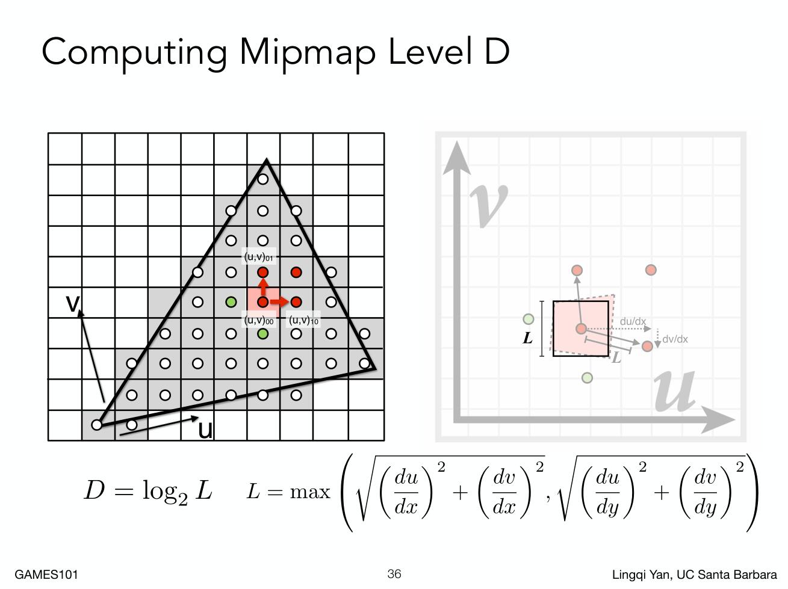
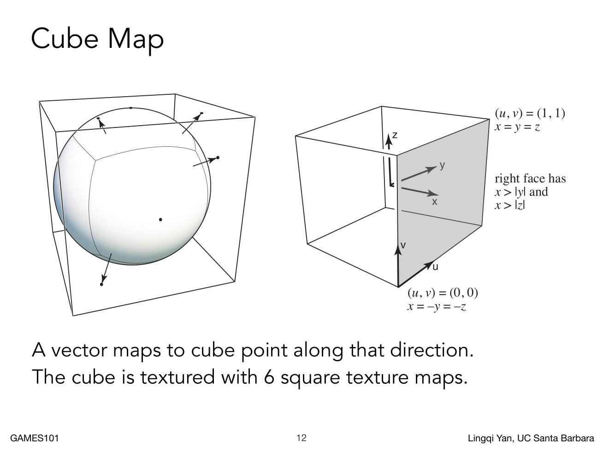

## 纹理映射

纹理映射流程如下

对于每个光栅化的屏幕采样点$(x,y)$（通常是像素的中心点）

1. 令$(u,v)$为纹理上对应于$(x,y)$的坐标
2. 对纹理上$(u,v)$进行采样
3. 将采样得到的颜色作为光栅化需要使用的颜色

### 纹理映射函数

从世界坐标$(x,y,z)$映射到纹理坐标$(u,v)$的函数。

**平面投影**

直接忽略掉$z$坐标（或者根据理解，是忽略掉法向量那个方向的坐标）（世界空间是$[-1,1]^3$）：

$$
\phi(x,y,z)=(u,v)\quad where\quad 
\begin{bmatrix}
u \\
v \\
* \\
1
\end{bmatrix}=M_t
\begin{bmatrix}
x \\
y \\
z \\
1
\end{bmatrix}
$$

其中，$M_t$是一个仿射变换矩阵，而星号代表我们不在乎这个坐标。

这个映射对于比较平的面的效果较好，但是对于一些闭合曲面（例如一个正方体）效果不佳。

用透视投影替代正交投影，我们可以得到一个投影的纹理坐标

$$
\phi(x,y,z)=(\tilde{u}/\omega,\tilde{v}/\omega)\quad where\quad
\begin{bmatrix}
\tilde{u} \\
\tilde{v} \\
* \\
\omega
\end{bmatrix}=P_t
\begin{bmatrix}
x \\
y \\
z \\
1
\end{bmatrix}
$$

其中矩阵$P_t$代表着一个投影变换。这个投影纹理坐标在阴影贴图中有重要的作用。

**球体坐标**

从球体上的点$(x,y,z)$映射到纹理上$(u,v)$，假设球心在原点，并且世界空间是$[-1,1]^3$，则因为

$$
x = rcos\phi sin\theta\\
y = rsin\phi sin\theta\\
z = rcos\theta
$$

有

$$
\theta = acos(z/\sqrt{x^2+y^2+z^2})\\
\phi = atan2(y,x)
$$

再转化为$(u,v)$的形式，有：

$$
\phi(x,y,z) = ([\pi+atan2(y,x)]/2\pi,[\pi-acos(z/||x||)]/\pi)
$$

**圆柱体坐标**

世界空间是$[-1,1]^3$，圆柱体中心在原点

$$
\phi(x,y,z)=([\pi+atan2(y,x)]/2\pi,[1+z]/2)
$$

注，Fundamentals Of Computer Graphics中写的是$\phi(x,y,z)=(\frac{1}{2\pi}[\pi+atan2(y,x)]/2\pi,\frac{1}{2}[1+z])$，怀疑有误。

## 纹理放大

### 双线性插值

现在假设纹理上需要采样的点的坐标为(x,y)，显然这个点会落在某个$2\times2$的像素矩形中。

设左下角的像素为$u_{00}$，左上$u_{01}$，右下$u_{10}$，右上$u_{11}$

设左下角像素中心点为原点建立坐标系。横轴记为$s$,纵轴记为$t$。则$u_{00}=(0,0)$，$u_{10}=(1,0)$，$u_{01}=(0,1)$，$u_{11}=(1,1)$

记采样点(x,y)在这个坐标系下的坐标为$(s,t)$

设函数$lerp(x,v_0,v_1)=v_0+x(v_1-v_0)$

这个函数的意义是，假设直线上两个点的值为$v_0,v_1$，$x$为这两个点间的坐标，$x$在$x_0$处等于$0$，在$x_1$处等于$1$。此时所得的函数值为$x$处的插值。

现在我们可以对$(s,t)$这个点进行插值，首先定义

$$
u_0 = lerp(s,u_{00},u_{10})
u_1 = lerp(s,u_{01},u_{11})
$$

得到这两个点后再进行一次插值得

$$
f(x,y) = lerp(t,u_0,u_1)
$$

当然也可以先进行垂直的插值，再水平插值。

### 双立方插值

TODO

## 纹理缩小

### Mipmap

当一个像素代表了纹理中的一大块时，需要进行纹理缩小。

之前介绍的超采样等是可以使用的，只不过这样会导致开销过大。

我们需要找到一种办法直接对区间求平均值。

引入Mipmap的概念。它允许快速的、近似的（而非准确的）、方形的范围均值查询。

假设第0层是原纹理图像（方形）。

则第1层是将长宽各缩小为一半，所所放出来的纹理。第2层则为第1层缩小一半，以此类推直到只有一个像素。

额外占用的存储空间只有原纹理的$1/3$。

我们要计算应该使用第几层，首先确定我们要光栅化的像素的坐标(x,y)，然后将其对应到纹理上的坐标记为$(u,v)$。

找到它的邻居像素，例如右边像素，然后如图进行计算。

存在的一个问题就是，层数是不连续的，但我们的空间是连续的。所以每一层mipmap在纹理映射时会出现块状的、不连续的现象。

### 三线性插值

为了解决mipmap不连续的现象，引入三线性插值。

1. 在$D$层进行双线性插值
2. 在$D+1$层进行双线性插值
3. 对$D,D+1$层进行一次线性插值

### Mipmap的缺陷

相较于超采样，在远处会出现模糊现象。原因在于，只能查询一个方形取余、近似的、以及是插值得到的。

解决（部分的）办法：各向异性过滤。

比各向异性过滤更好的：EWA过滤。

## 纹理的应用

### 环境光贴图

将整个环境做成贴图，可以给比较镜面光滑的物体使用，使之反射出环境的样子。

除了保存成方形的贴图，还可以保存在球面上。

保存在球面上带来的问题是，越靠近上下的地方，越会出现变形。此时可以将球上的点映射到一个立方体上，来解决这种变形。

### 法线贴图

储存一个相对高度，从而改变某一点的法线，从而改变光照效果，从而实现凹凸不平的视觉效果。

新的法向量的计算方法：

*二维情况：*

假设原来$p$点的法向量$n(p)=(0,1)$。

将$p$点通过法线贴图的相对高度移到对应位置，则$p$点此时的导数为$dp=c[h(p+1)-h(p)]$，其中$c$是常数，$h(x)$是高度函数。

则新的法向量为$n(p)=(-dp,1).normalized()$

*三维情况*

原始法向量为$n(p)=(0,0,1)$

导数为

$$
\frac{dp}{du} = c_1[h(u+1)-h(u)]
$$

$$
\frac{dp}{dv} = c_2[h(v+1)-h(v)]
$$

新的法向量为$(-dp/du,-dp/dv,1)$

*法向量的一般情况*

对于原法向量为$\bm n=(x,y,z)$的，首先令

$$
\bm t = \left(\frac{xy}{\sqrt{x^2+z^2}},\sqrt{x^2+z^2},\frac{zy}{\sqrt{x^2+z^2}}\right)
$$

$$
\bm b = \bm n\times\bm t
$$

$$
TBN = [\bm{t,b,n}]
$$

$$
dU = kh\cdot kn\cdot(h(u+1/w,v)-h(u,v))
$$

$$
dV = kh\cdot kn\cdot(h(u,v+1/h)-h(u,v))
$$

其中$kh,kn$是常数，$h(u,v)$是高度函数,$h,w$是纹理的高度和宽度。

$$
\bm{ln} = (-dU,-dV,1)
$$

那么最终得到的法向量为

$$
\bm n = normalize(TBN\cdot \bm{ln})
$$

**将法线的XYZ坐标以RGB的形式存储**

有些法线贴图会将法线的xyz坐标以RGB的形式存储。要得到$[-1,1]$上的法线方向坐标，要经过两次转换。首先将$0\sim 255$的$RGB$换到$[0,1]$的形式，然后再转换到$[0,1]*2-1=[-1,1]$。

这在有些时候比从模型中顶点的法向量来插值计算内部点的法向量要更有细节。

**切线空间存储法向量**

在切线空间存储法向量时，会直接存储某个值的值作为颜色（当然也要转化到$[-1,1]$），我们要做的就是计算出切线空间的基，然后将其转化为世界坐标中的法向量。

对于一个三角形上的三个点$p_0,p_1,p_2$，以及这个三角形的法向量$\bm n$。设$u_0,u_1,u_2$分别为三个点的纹理上的$u$坐标，$v_0,v_1,v_2$为$v$坐标。那么就有

$$
\bm i = A^{-1}\begin{pmatrix}
u_1-u_0 \\
u_2-u_0 \\
0
\end{pmatrix}
$$

$$
\bm j = A^{-1}\begin{pmatrix}
v_1-v_0 \\
v_2-v_0 \\
0
\end{pmatrix}
$$

其中

$$
A = \begin{pmatrix}
\overrightarrow{p0p1} \\
\overrightarrow{p0p2} \\
\bm n
\end{pmatrix}
$$

之后切线空间的基就是$(\bm i,\bm j,\bm n)$，将其乘以纹理中提取到的值，就得到世界坐标中的法向量。

### 位移贴图

与法线贴图类似，但是位移贴图真正地移动了顶点的位置，很多时候比法线贴图真实。

### 噪声

TODO

### 对纹理进行环境光预处理

TODO

### 3D贴图和体积渲染

TODO

### 阴影贴图

将光源也当作一个相机，进行光栅化，只计算zbuffer的信息。

然后在相机光栅化时，判断两个zbuffer是否相等，相等才能被相机和光源看见。不相等的则在阴影中。
