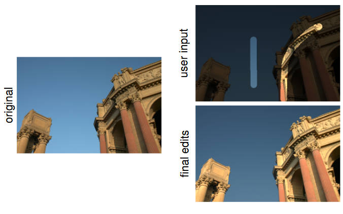

原论文：[https://dl.acm.org/doi/10.1145/1360612.1360639](https://dl.acm.org/doi/10.1145/1360612.1360639)

# 摘要

本文提供了一种方法来简单有效地编辑复杂的图片，用户只需要粗略选定需要调整的物体（的一部分），编辑操作就会自动扩展到整个物体和其他相似物体上。

# 算法

算法的任务是，将用户输入的（粗略的）编辑$g_i$和其对应的权重$w_i$，扩展到整个相似的物体上的编辑$e_i$。这些操作是对于每个像素的。最终，我们使用编辑$e_i$，将原图像$a_i$修改为新图像$a_i'$，即$a_i'=f(a_i;e_i)$。

$e$是通过最小化如下的能量来取得的

$$
\sum_i\sum_jw_jz_{ij}(e_i-g_j)^2 + \lambda\sum_i\sum_jz_{ij}(e_i-e_j)^2
$$

$$
\text{with}\quad z_{ij} = \exp(-||f_i-f_j||^2/\sigma_a)\exp(-||x_i-x_j||^2/\sigma_s)
$$

其中$\sum_i,\sum_j$等指的是对图片上的每一个像素遍历。这里的$g_j$即代表着我们输入的编辑操作，例如我们在LAB空间中进行提高亮度的操作，$g_j$就可以是对像素$j$增大$L$分量的值。而$w_j$是一个$[0, 1]$上的权重，也是用户输入的。如果我们非常希望对于该像素，最终的修改和用户的输入保持一致，权重就取$1$。如果我们希望最终的结果可以是任意合适的编辑，那么权重就取$0$。

这里的$z_{ij}$是一种相似性度量，用于度量图片上两个像素的相似性，从而决定要不要扩展编辑选区，扩展到同一个物体的整体，以及相似的物体上。

$f$为该像素的特征向量，其具体含义取决于编辑的图片。例如对于LAB空间的图像，其为$9$维向量，前$3$维为该像素的LAB分量，中间$3$维为其$3\times 3$范围的LAB分量均值，最后三维则为范围内的LAB分量标准差。对于BRDF之类的材质，该算法也可以运行，只需要设置合适的特征即可。

$x$代表像素的空间坐标，一般图片上为二维坐标。

上式中存在三个超参数。$\lambda$是调整比例的参数。显然上式由两部分组成，直观上第一项是让最终的编辑尽可能和用户输入相似，而第二项则是一个平滑项：让相近的、特征相似的元素拥有相似的编辑。在文章中，作者使用$\lambda=\sum_i w_i/n$

$\sigma_a$决定了“特征相似”的重要性，与输入图像的格式有关。作者指出低动态范围的图片使用$500$，对于HDR图片和材质，使用$0.2$。而$\sigma_s$决定了“空间距离”的重要性，和图像内容有关。如果图片中相似的物体只有一个、距离很近，则可以使用小的值如$0.05$。对于相似物体很多，距离又比较远的图片，可以使用大的值如$10$。

最小化上述的能量等价于求解如下的线性方程

$$
\bigg(\sum_j z_{ij}w_j+2\lambda\sum_jz_{ij}\bigg)e_i-2\lambda\sum_jz_{ij}e_j = \sum_jz_{ij}w_jg_j
$$

写成矩阵的形式为

$$
e = \dfrac{1}{2\lambda}(D-Z)^{-1}ZWg
$$

其中$D,Z,W$都是$n\times n$矩阵，$n$为像素数量。$g$为$n$维向量。$Z$的每一个元素$z_{ij}$的含义同前，$W,D$为对角矩阵，$W_{ii}=w_i, D_{ii}=d_i=\sum_j(z_{ij}+z_{ij}w_j/(2\lambda))$。

上式的问题在于$D, Z, W$三个矩阵都是$n\times n$大小的，这样的算法时间和空间开销过大。作者研究发现$Z$矩阵是低秩的，于是可以有一些近似算法。从$Z$中随机采样出$m$列当作列线性无关的矩阵$U(m\times n)$，其中$U$的前$m$行记作矩阵$A(m\times m)$。再加上逆矩阵的近似算法，最终有

$$
e\approx\dfrac{1}{2\lambda}(D^{-1}-D^{-1}U(-A+U^TD^{-1}U)^{-1}U^TD^{-1})\cdot(UA^{-1}U^T)Wg
$$

其中$D$和$W$都是对角矩阵容易求逆与求乘法。这样就转换成了多个小矩阵的计算，解决了复杂度的问题。

# 我的实现

[https://github.com/kegalas/AppProp](https://github.com/kegalas/AppProp)

# 优化

本文的数据规模是像素个数，可以通过一些数据结构缩小数据规模来加速。具体例如[https://dl.acm.org/doi/10.1145/1618452.1618464](https://dl.acm.org/doi/10.1145/1618452.1618464)
