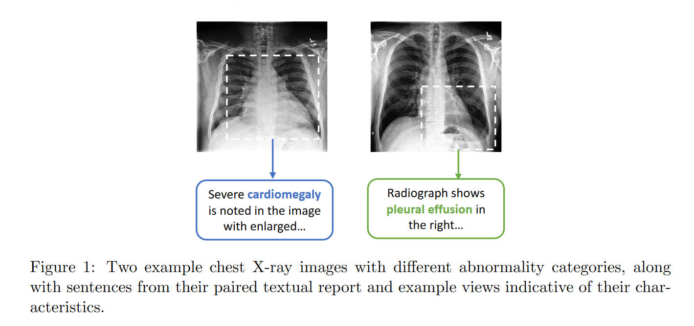
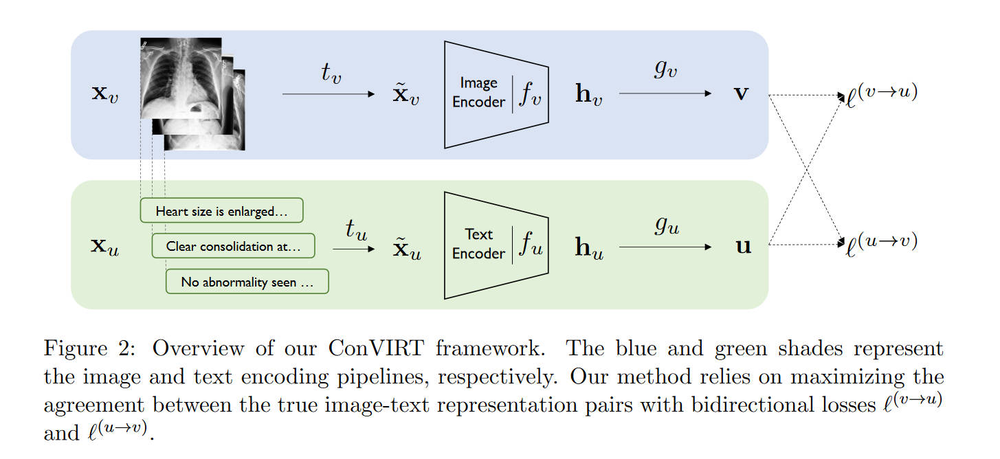

原论文：[https://arxiv.org/abs/2010.00747](https://arxiv.org/abs/2010.00747)

# 摘要

医学图像的视觉表示是核心研究方向，但是由于标注的缺少，效果不够好。现有的工作要么是在ImageNet上进行微调（次优，因为图像差距太大）；要么是从医学文本中，用基于规则（rule-based）的方式提取标签（不精确且不泛用）。同时，对比学习在自然图像上表现很好，而在类间相似度（inter-class similarity）很高的医学图像上表现不好。

本文提出ConVIRT，一个无监督的模型，通过利用配对的医学文本来学习视觉表示。并且，它是领域无关的，也不需要额外的专家输入。

# 简介

现有的获取医学图像标注的方法有两种：

1. 使用医学专家标注的高质量标注。缺点是数据量特别小，远小于ImageNet。所以业内经常用ImageNet来迁移权重。但是，ImageNet的图像区别会很明显，不像医学图像（如图1），其区别是非常细微的，具有非常细致的（fine-grained）视觉特征。
2. 使用专家定义的规则，来提取图片对应的文字报告中的标签。这样数据集是更大了（图像和医学报告本来就会在医生的诊断过程中记录），但是有两个缺点：一是规则不准确，且类型有限；二是领域特定（domain-specific），并且对文字的风格比较敏感，泛化能力差。

近期的对比学习用在自然图片上和第一条遭遇了差不多的问题，也是由于类间相似度很高，所以效果不够好。

本文提出的ConVIRT可以利用上图片-文字对，来进行无监督的学习。ConVIRT通过图像和文本模态之间的bidirectional contrastive objective，最大限度地提高真实图像-文本对与随机对之间的一致性，从而提高视觉表示的效果。

# 相关工作

（略过ImageNet预训练和自然图像的对比学习，前面介绍过）

另外一个相关的研究方向是视觉-语言表示学习（visual-linguistic representation learning）。本文的关键不同点在于：

1. 这些研究是通过binary contrastive prediction task来学习视觉表示的。而本文展示了cross-modality NCE objectives来提示视觉表示效果的优越性
2. 这些研究主要依赖于图像分割的预处理过程，但医学图像的图像分割是很难进行的
3. 这些研究的评估主要是在视觉问答任务上进行的，而本文则在分类任务和检索任务（retrieval tasks）上进行。

# 问题定义

假设数据输入是形如$(x_v, x_u)$的成对数据，其中$x_v$是一张或一组图像，而$x_u$是一段对于$x_v$的文字描述。目标是学习到一个参数化的图像编码器$f_v$，可以将该图片的信息映射到一个固定维度的向量中。之后就可以利用这个$f_v$去进行下游任务，例如分类和检索。本文中，$f_v$是一个CNN。

# 从文本中学习的比较视觉表示

本文的方法将图片$x_v$和文字$x_u$分别转化成同样是$d$维的两个向量$u,v$。对于每一张输入的图片$x_v$，本方法首先使用一个采样变换$t_v\sim T$来对图像进行一次变换，得到一个随机的view $\tilde{x}_v$。其中$T$是稍后定义的一套图像随机变换的函数。之后，编码器$f_v$将$\tilde{x}_v$变换成固定维度的向量$h_v$。再之后，使用非线性变换$g_v$将其进一步转化为$v$，即最终有

$$
\mathbf{v} = g_v(f_v(\tilde{\mathbf{x}}_v ))
$$

其中$\mathbf{v}\in \mathbb{R} ^d$。类似的，对于每一个文字输入$x_u$，用一个采样变换$t_u$得到该输入的一部分，$\tilde{x}_u$，然后也适用类似的编码器和非线性变换得到$\mathbf{u}=g_u(f_u(\tilde{\mathbf{x}}_u))$。这里也有$\mathbf{u}\in \mathbb{R} ^d$.

在训练时，从训练集中采样一个大小为$N$的minibatch，每一个数据都是一对$(x_v,x_u)$，然后计算出它们的表示对$(v, u)$。记$(v_i, u_i)$为第$i$对。ConVIRT的训练目标函数包括两个损失函数，第一个是第$i$对数据的图像到文字的对比误差

$$
\ell_i^{(v\to u)} = -\log\dfrac{\exp( < v_i, u_i > /\tau)}{\sum^N_{k=1}\exp( < v_i,u_k > /\tau)}
$$

其中$< v_i, u_i>$是余弦相似度，即$< v, u>=v^Tu/||v||||u||$。而$\tau\in \mathbb{R^+}$是一个温度参数。最小化这个损失可以使得编码器最大化保留true pairs之间的相互信息。直觉上来说，这就是一种$N$类分类器的损失函数，其将$(v_i, u_i)$分类为true pair（正类对）。与前人不同，前人的损失函数是对于同模态的数据，而本文的对比损失则对每一个输入模态都是非对称的。因此，定义文字到图像的对比误差为

$$
\ell_i^{(u\to v)} = -\log\dfrac{\exp( < u_i, v_i > / \tau)}{\sum^N_{k=1}\exp( < u_i,v_k > /\tau)}
$$

最终的训练损失函数即为两个损失的加权和

$$
\mathcal{L} = \dfrac{1}{N} \sum^N_{i=1}\bigg(\lambda\ell_i^{(v\to u)}  +(1-\lambda)\ell_i^{(u\to v)} \bigg)
$$

其中$\lambda\in [0,1]$是一个放缩参数。

# 实现

注意到，ConVIRT的框架中所定义的东西，并不和特定的编码器、变换函数、投影函数相关。本文跟随前人的工作，将$g_v, g_u$用分离的-可学习的-单隐藏层神经网络来实现。也就是说，有$g_v(\cdot) = W^{(2)}\sigma(W^{(1)}(\cdot))$，其中$\sigma$是ReLU。$g_u$同样。

对于图片的编码器$f_v$，本文使用ResNet50的架构。对于文本的编码器$f_u$，则使用BERT，最后的输出向量前加一个最大池化层。BERT在训练的时候使用ClinicalBERT作为初始权重，并且微调只调整BERT的后6层，而冻结前6层。

注，这里的max-pooling和CNN中的池化层不同。BERT接池化是想对整个句子求特征表示，即sentence embedding。通常，\[CLS\]代表的embedding就可以用作句子嵌入，但本文所说的池化操作也可以。BERT会输出所有token的embedding，对他们求平均值就是avg-pooling，对它们求最大值就是max-pooling。最终的输出和单个token的embedding维度相同。

对于前文提到的图像变换函数$T$，本文使用一系列变换过程，顺序应用五个随机的变换：剪裁、水平翻转、仿射变换、颜色抖动、高斯模糊。其中颜色抖动环节只使用改变亮度和对比度的操作（因为医学图像基本都是单色的）。

而对于文字的变换函数$t_u$，本文使用很简单的均匀采样，从$x_u$中采样一句话。不使用更复杂的方式的原因是为了保证语义不变。

除了对图像进行变换，也可以直接使用$x_v$，或者使用$x_v$的不同版本，例如某些诊断中有针对同一部分的不同角度的版本。
