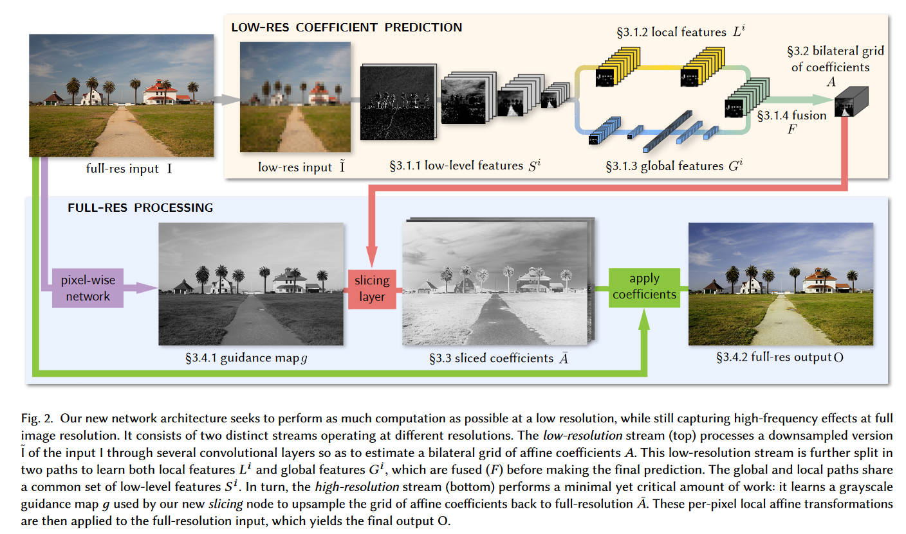
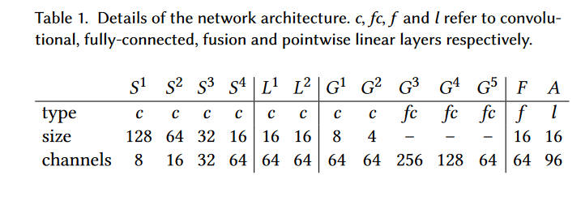

原论文[https://groups.csail.mit.edu/graphics/hdrnet/](https://groups.csail.mit.edu/graphics/hdrnet/)

# 摘要

在移动设备中进行图像处理，优秀的性能是关键的挑战。给出一个作为参考的图像处理管线，或者甚至只给出原图和人工ps过的图，本文希望可以以实时的速度去对这些图像的修改进行再现。为此，本文提出了一种神经网络结构，其受到了bilateral grid处理和区域仿射颜色变换（local affine color transform）的启发。

使用一对输入输出图像（即原图和ps过后的图），本文的CNN可以在bilateral空间中预测出局部仿射模型的系数。本文的模型可以生成局部、全局、内容相关的决策，来近似得到期望的图像变换。在运行时，本模型输入一个图像的低分辨率版本，生成一组在bilateral空间中的仿射变换，再对变换进行上采样（同时使用一种新的slicing节点，保证edge-preserving），最后将上采样后的变换应用在原图分辨率上。

本文提出的模型速度很快，在智能手机上，对1080p也有实时性能，并且保持SOTA效果。与前人工作不同，本文的模型进行离线训练，所以在运行时不需要访问原始的operator（算子？）。这允许模型学习到复杂的、依赖场景的变换，通常这样的场景没有参考的实现（应该是前文提到的管线），例如人工ps。

# 简介

本文提出的模型可以学习到多种多样的图像增强处理过程，并且可以高速地应用在高分辨率图上。为此，本文使用了3个关键策略：

1. 本文的预测环节都是在低分辨率的bilateral grid上进行的。grid中，每个像素的坐标$x,y$都增加了一个第三维，即该像素的颜色的函数。为了实现这点，本文引入了一个新的node，来执行数据依赖的查询。这也就是一种slicing（切片）操作，其可以使用像素的颜色信息和位置信息，从3D bilateral grid中将期望图像在高分辨率上重建出来。
2. 本文参照前人工作，注意到预测输入-输出之间的变换，通常比起直接预测输出要更简单。所以，本文架构只是学习到了一个中间的转换关系的表示，使用这个转换关系就能将输入转化到期望的输出。
3. 虽然学习和推理是在低分辨率上的，但是训练过程中的损失函数是在高分辨率上进行的。这使得模型学习到的低分辨率的变换函数是直接为高分辨率图像而优化的。

综上，这三条允许本模型大量的计算在低分辨率，但输出仍然是高分辨率。

# 架构

大部分推理都是在低分辨率的$\tilde{I}$上进行，即上图中的上半部分，最终预测出一个局部仿射变换。根据作者的经验，图像增强不仅取决于局部图像特征，还取决于全局的信息，例如直方图、平均亮度，甚至是场景的类型。所以，low-res的部分在后面进一步分成两条路，即local和global。最终又把这两种特征混合起来并生成最终的参数。

下面的high-res部分就在原图分辨率上进行，它会应用最少的计算，并且主要集中于应用影响最大的操作，并且还会保持边缘不变。为此，本文提出了一个切片节点，其受到了bilateral grid的启发。这种节点对低分辨率的grid执行依赖于数据的（data-dependent）查找，该节点基于一个可学习的guidance map。给出从guidance map得出的高分辨率的仿射变换因子，再对图片中的每个像素应用局部的颜色变换，就得到了最终的输出$O$。在训练时，损失函数是在原分辨率上最小化的。

本架构有三点超越了前人：

1. 下采样到bilateral grid的过程是可学习的
2. guidance image也是可学习的，并且不受亮度限制
3. 损失函数不是在仿射因子上评估的，而是在原分辨率的最终图像上。

## bilateral因子在低分辨率下的预测

（本段原文废话过多，建议直接看最后的表格和$A$、$F$的公式）

$\tilde{I}$被固定为$256\times 256$的大小。首先经过一连串卷积层（含stride）$(S^i)_{i=1,\cdots,n_S}$，来提取底层特征并降低分辨率。然后，数据分为两条道路。第一条路是$(L^i)_{i=1,\cdots,n_L}$，全都是卷积层，其主要学习局部特征并保留空间信息。第二条路是$(G^i)_{i=1,\cdots,n_G}$，包含了卷积层和全连接层，来学习一个固定大小的向量，表示$\tilde{I}$全局特征（例如场景类型）。这两条路的最后输出$G^{n^G}$和$L^{n_L}$进行混合，得到一个特征集$F$，在模型最后使用一个pointwise的线性层输出一个最终的数组$A$。可以将这个$A$解释为仿射因子的bilateral grid。因为使用2D图像以内容依赖的方式造出了3D的bilateral grid，可以将low-res部分视为一种可学习的splatting的实现。

**低层特征**

首先使用一连串卷积层来处理低分辨率图$S^0 := \tilde{I}$，其中所有卷积层的stride都是$s=2$

$$
S^i_c[x,y]=\sigma\bigg(b^i_c+\sum_{x',y',c'}w^i_{cc'}[x',y']S^{i-1}_{c'}[sx+x',sy+y']\bigg)
$$

其中$i=1,\cdots,n_S$是卷积层的序号，$c$和$c'$是该层的通道的序号，$w_i$是卷积层的权重数组，$b^i$是偏置向量。而$-1\leq x', y' \leq 1$，或者说卷积核的大小为$3$。使用ReLU作为激活函数。所有的padding都设置为$0$。本文使用4层卷积，即$n_S=4$。

**局部特征路径**

在低层特征的最后一层$S^{n_S}$之后，数据送入另外一串卷积层$L^i, n_L=2$，也就是架构图中黄色的那一部分。这些卷积层的形式和低层特征中的卷积层的形式是一样的，区别在于stride为$s=1$。并且之前的卷积层会降低分辨率、增加通道数，本部分卷积层不改变分辨率也不改变通道数。

**全局特征路径**

同样的，在$S^{n_S}$之后，数据送入卷积层$G^i$中，其为stride为$s=2$的同样形式的卷积层，总共5层即$n_G=5$。在卷积层之后再加上3个全连接层。

**特征混合**

将两条路径的输出以如下的形式混合

$$
F_c[x,y]=\sigma\bigg(b_c+\sum_{c'}w'_{cc'}G^{n_G}_{c'}+\sum_{c'}w_{cc'}L^{n_L}_{c'}[x, y]\bigg)
$$

其中激活函数也是ReLU，输出了一个$16\times 16\times 64$的数组，之后我们将其输出为$1\times 1$的线性预测（我自己也看不懂什么意思，建议下面的表格就清晰了）

$$
A_c[x, y] = b_c+\sum_{c'}F_{c'}[x,y]w_{cc'}
$$

（PS：在别的文献里两句话说完的怎么本文里这么多细节）

## 将图像特征用作bilateral grid

为了叙述方便，定义以下等价形式的$A$

$$
A_{dc+z}[x,y]\leftrightarrow A_c[x,y,z]
$$

其中$d=8$是grid的深度。在这种意义下，$A$可以被视作$16\times 16\times 8$的bilateral grid，其中每个grid有12个数字（$96/8=12$），每一个数字都是$3\times 4$的仿射颜色变换矩阵的一个系数。

## 使用一个可训练的slicing层来上采样

在使用神经网络预测bilateral grid之后，下一步就是用到原图上了。为了实现这个目的，引入一个slicing操作，输入一个单通道的guidance map $g$和我们之前算出来的$A$，该操作就可以在$A$上进行数据依赖的查询。公式如下（$g$的大小和原图大小一样，最终结果的大小也是）

$$
\bar A_c[x,y]=\sum_{i,j,k}\tau(s_xx-i)\tau(s_yy-j)\tau(d\cdot g[x,y]-k)A_c[i,j,k]
$$

这实际上就是一个三线性插值。其中$\tau(\cdot)=\max(1-|\cdot|,0)$，而$s_x$和$s_y$分别是是grid和原图宽高的比例。本质上来说，这是给每个像素进行赋值，赋的值近似可以理解为$A_c[i,j,g[x,y]]$。同前，$d=8$

slicing操作是无参数的，并且可以用OpenGL来高效实现。

## 最终的全尺寸输出

对于全尺寸的原输入$I$，我们提取$n_\phi$个全尺寸特征$\phi$，来实现两个目的

1. 预测guidance map $g$
2. 用作局部仿射模型的回归变量（regression variables）

最高效的方式是将原图的通道直接用作特征，即$\phi=I(\text{with}\ \ n_\phi=3)$，然后局部仿射模型就是颜色变换。

**Guidance map辅助网络**

定义$g$为一个原图上的简单的pointwise的非线性变换

$$
g[x,y]=b+\sum^2_{c=0}\rho_c(M_c^T\cdot\phi_c[x,y]+b_c')
$$

$M^T_c$是$3\times 3$的矩阵，$b$和$b'_c$是偏置，$\rho_c$是一个16个ReLU的加权平均

$$
\rho_c(x)=\sum^{15}_{i=0}a_{c,i}\max(x-t_{c,i},0)
$$

这上面的$M,a,t,b,b'$都是可学习的参数。$M$初始化为一个单位矩阵，而$a,t,b,b'$的初始化能够使得$\rho_c$是一个在$[0,1]$上的恒等映射。

**生成最终结果**

$$
O_c[x, y]=\bar A_{n_\phi+(n_\phi+1)c}+\sum^{n_\phi-1}_{c'=0}\bar A_{c'+(n_\phi+1)c}[x,y]\phi_{c'}[x,y]
$$

## 训练过程

即数据集为$\mathcal D=\{(I_i, O_i)\}_i$，即全尺寸的输入输出图像对（应当应用同一种图片编辑操作），训练过程即为最小化下面的误差

$$
\mathcal L = \dfrac{1}{|\mathcal D|}\sum_i||I_i-O_i||^2
$$

训练时，本文引入了权重衰减$10^{-8}$。卷积层和全连接层使用Kaiming初始化，其他部分初始化为0。在特征maps上使用batch normalization。使用Adam优化算法。batch size在4到16之间（取决于分辨率）。学习率为$10^{-4}$。
