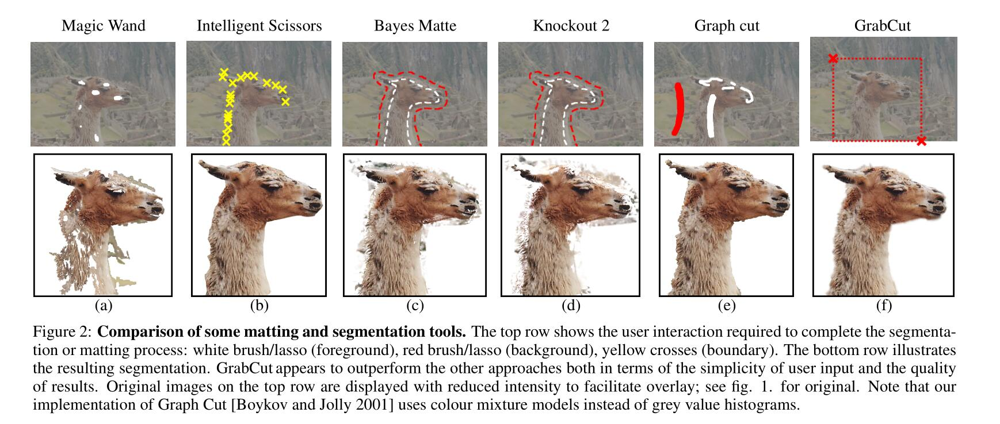
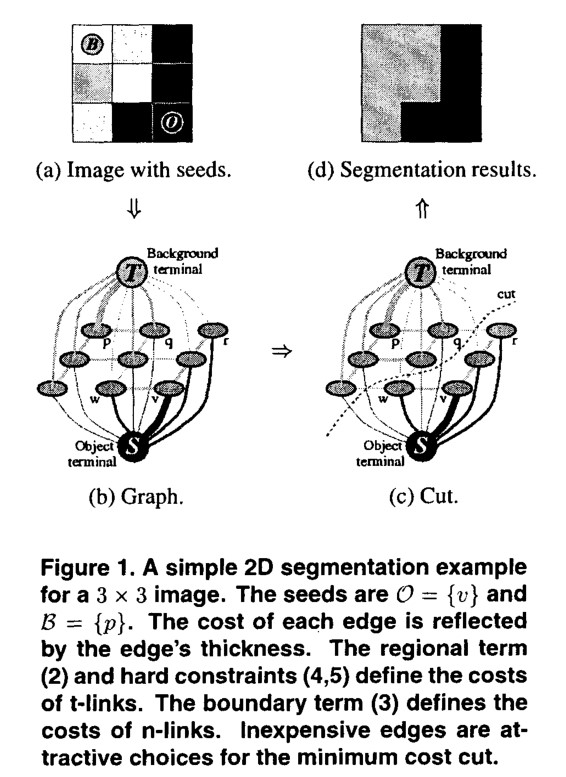
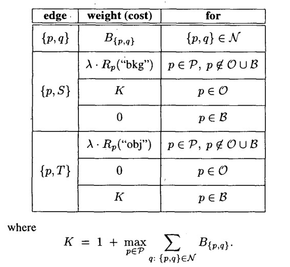
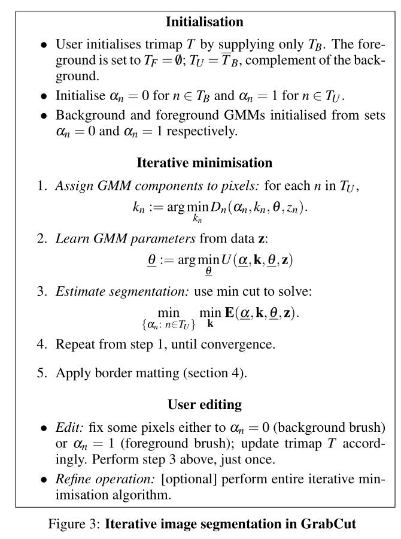
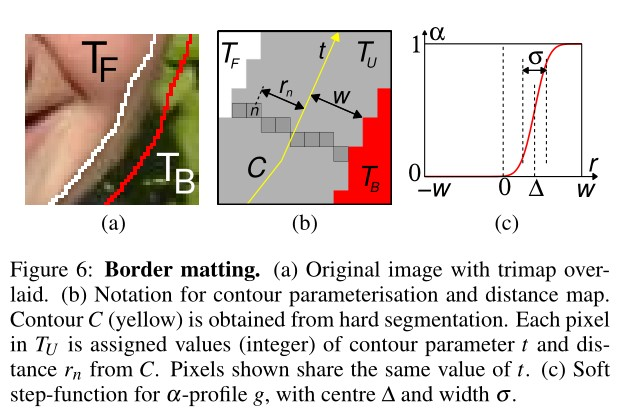

# 摘要

分离出图像的前景和背景，对于图像编辑是很重要的。经典的image segmentation实现方式有两个，一是使用纹理（颜色）信息，例如魔棒工具。另一种是使用边缘信息，例如磁力套索（Intelligent Scissors）。本文介绍使用graph-cut来进行图像分割。本文提出了三方面的改进：优化迭代、优化用户交互、border matting的处理优化

# 简介

这里提到，所谓的“前景对象”的结果是一个alpha-matte，反应了前景和背景的比例。个人理解应该是，某个像素属于前景的可能性的大小和背景的可能性的比。本文想要实现保证高性能的前提下，不需要用户的过多交互，就能得到很好的效果。

高性能指：精准分割前背景，主观上可信的alpha值，可以处理模糊、混合像素（mixed pixels）、和透明度（透明的物体），前景图片不带有背景透过来的颜色。

用户交互的简易程度：作者举例了两个极端，一个是需要用户逐像素地点击前景，一个是只需要用户点击前景和背景的几个位置。

## 之前的交互式获取matte的工作

**魔棒（Magic Band）**

和PS里用到的魔棒差不多，就是选择容差，选择图片中点击区域附近在容差之类的像素。但是这个容差有时不容易选择。导致结果不好。

**磁力套索（Intelligent Scissors）**

和PS里的磁力套索差不多，用户需要在前景的边缘大概地移动鼠标，选取整个前景。缺点是如果背景太复杂，用户需要的操作会很多。

**Bayes matting**

对颜色概率分布进行建模，来实现一个full alpha mattes。用户要选取一个trimap。记作$T=\{T_B,T_U,T_F\}$，其中$T_B$标记了背景，$T_F$标记了前景。之后alpha值是在剩下的那个区域$T_U$上计算的。有时效果还是不错的，但是只有当$T_U$区域不太大，并且前背景的颜色概率分布可以很好地分开时，效果才不错。另外，需要的用户操作也不少。

**Knockout 2**

是一个PS的插件，里面用的是用户定义的trimap，总体和Bayes matting差不多。

**Graph Cut**

优化了bayes matting，同样利用了trimaps和对颜色的概率分布建模，鲁棒性很好，它甚至可以区分出环境里的迷彩服。具体在第二节才会介绍。

**Level sets**

通过解偏微分方程来做。缺点是可能会陷入局部最优。

## 作者提出的系统：grabcut

理想状态中，一个matting工具应该能够在$T_U$上计算连续的alpha值，没有强制约束的话，alpha的值可能就只会是0、1两个值。如果有连续的alpha值，那么对于烟雾、头发、树（叶）等问题应该可以自动地、近似地解决。但是作者发现，对于前景背景颜色分布容易分开的图像效果还可以，遇到迷彩这样的东西就不行。 

首先作者会在第二节和第三节介绍一个使用迭代图割（iterative graph cut）的方法来获取图像硬分割（hard segmentation）。然后在第四节border matting部分会用上通过硬分区之间的区域来计算alpha value。作者说，grabcut不处理完全透明的情况，除非是在border部分。作者建议使用matting brush来处理这种完全透明，只要没有迷彩，结果就可以很好。

作者认为，本文的首要创新在于处理图像的分割。他们为graph cut提供了两个优化：迭代估计、不完全标记。这两个东西可观的减少了用户交互的复杂度。只需要拖拽一个矩形框柱前景。另外，也开发出了一种新的计算alpha值的机制，来用于border matting的部分。

# 使用Graph Cut进行图像分割

grabcut是建立在graph cut的研究基础上的，所以有必要对此进行详细描述。

## 图像分割

graph cut是用于黑白图像分割的。给定一个初始的trimap，$T$，图像是一个数组$z=(z_1,\cdots,z_N)$，每个值都是灰度值，下标是一维的。图像的分割用一个“不透明度”的数组来表示，$\underline{\alpha}=(\alpha_1,\cdots,\alpha_N)$表示。每个像素都有一个这种数组。一般来说$\alpha_n$是$[0,1]$上的实数，但对于硬分割来说，其取值为集合$\{0,1\}$。$0$代表背景，$1$代表前景。

参数$\underline{\theta}$描述图像前景和背景的grey-level概率分布，也包含了灰度值的直方图。即

$$
\underline{\theta} = \{h(z;\alpha), \alpha=0,1\}
$$

其中直方图是直接用$T_B, T_F$标记的像素得来的。这里直方图进行了归一化，$\int_zh(z;\alpha)=1$

图像分割的任务就是使用给定的$z$和$\underline{\theta}$，来推断出未知部分的不透明度数组$\underline{\alpha}$

## 最小化能量法来进行分割

定义能量函数$E$，其值最小化的时候，得到最好的分割结果。某种意义上，这个$E$应该和前景、背景的直方图都有关，并且也和不透明度有关。反应了物体的一种稳定趋势。作者从吉布斯自由能中获得了灵感，写出了一个类似的形式：

$$
E(\underline{\alpha},\underline{\theta},z) = U(\underline{\alpha},\underline{\theta},z)+V(\underline{\alpha},z)
$$

其中，数据项$U$在给定直方图模型$\underline{\theta}$的情况下，评估不透明度分布$\underline{\alpha}$对图像$z$的拟合。定义为

$$
U(\underline{\alpha},\underline{\theta},z) = \sum_n-\log h(z_n;\alpha_n)
$$

其中，平滑项为

$$
V(\underline{\alpha},z) = \gamma\sum_{(m,n)\in C}dis(m,n)^{-1}[\alpha_n\neq\alpha_m]\exp-\beta(z_m-z_n)^2
$$

里面的$[...]$是一个艾弗森括号。$C$是一个集合，里面的元素是邻居像素点对。$dis(\cdot)$是邻居像素点对的欧拉距离。这种能量（指平滑项）让灰度相似的区域更加具有一致性。实践中，像素的邻居有8个。

当常数$\beta=0$时，平滑项就简化为著名的Ising prior（但我不知道是什么）。此时平滑项就对全图进行平滑，其程度由$\gamma$决定。在Graph Cut的论文中指出，设置$\beta>0$更好，这可以放松对于高对比度区域的平滑，同时这里的$\beta$可以选为

$$
\beta = \bigg(2\bigg<(z_m-z_n)^2\bigg>\bigg)^{-1}
$$

这里$<\cdot>$代表图像上样本的期望。选这个$\beta$能够保证，平滑项可以适当的从高对比度和低对比度场景中切换。

常数$\gamma$取$50$，这是后面的文章通过实验得到的经验值。

在定义完能量模型后，图像分割就可以被估计为

$$
\underline{\hat{\alpha}} = \arg\min_{\underline{\alpha}} E(\underline{\alpha}, \underline{\theta})
$$

这里的最小化使用最小割算法。这也是硬分割的基础。

下一部分会介绍作者三方面的改进。首先是把黑白图像的模型，用高斯混合模型替换，从而可以用到彩色图像上。第二，执行一次最小割的算法被替换为一个迭代过程。第三，简化用户操作，只需要使用一个矩形或者一个套索来标注$T_B$

## 如何用网络流为该问题建模？

这里是GrabCut在介绍GraphCut时没有介绍到的，所以只读这篇论文我们根本不知道如何建图。

GraphCut的作者其实给出了更为泛用的理论，而不仅仅是黑白图像的处理。在这篇论文里，能量定义为

$$
E(A) = \lambda R(A)+B(A)
$$

这里的$A$即为之前提到的$\alpha$，是硬分割。$R(A)$是区域项，$B(A)$是边缘项。

$$
R(A) = \sum_{p\in P} R_p(A_p)
$$

$$
B(A) = \sum_{\{p,q\}\in N} B_{\{p,q\}}[A_p, A_q]
$$

这里的$P$是所有像素的集和。$N$是相邻像素对的集合，其中$\{p,q\}$是无序的。

一般的$\lambda\geq 0$。$R(A)$代表着，给某个像素预测为前景和背景的惩罚。而$B_{\{p, q\}}\geq 0$则是边缘差异的乘法，两个相邻像素$p,q$，如果它们的颜色非常相近，那么$B_{\{p,q\}}$应该非常大；而颜色差异很大时，边缘项会非常接近$0$。

这里只是给出了泛用的理论，具体怎么去定义这些东西，看大家的具体问题。比如GrabCut就定义了自己的两个惩罚项，本文后面也针对黑白图像定义了惩罚项。

建图是像上面一样的，其中邻居像素之间有$N-Links$，虽然它只画出来4个邻居，但是一般我们也会连上对角的邻居，作为8邻居。每个像素都和源点、汇点有一条边，称作$T-Links$。

建图如上，邻居间的$N-Links$倒是非常简单，直接就是$B_{\{p, q\}}$。对于$T-Links$则更难一些。

首先要说明，求出最小割后，在源点一侧的节点是前景，在汇点一侧的节点是背景。所以，要给$\{p, S\}$这样的边一个误判为背景的惩罚项。图中$O$即为$T_F$，$B$即为$T_B$。如果已经由用户定义了前景和背景，那么其权值就是固定的$K$或$0$。

在跑完最小割后，原本属于$T_U$的节点就可以根据自己属于源点部分还是汇点部分，分类到前景背景中了。

下面我们来讨论为什么最小割可以最小化能量。

首先是关于$N-Links$，显然，两个像素颜色差异越大，这里越有可能是前背景的边界，而差异大的时候边权接近$0$，所以这样的$N-Links$必然会出现在最小割中。

然后是关于$T-Links$，一个像素如果被误判的惩罚项很大，比如前景误判为背景，那么它更有可能是前景。我们只能牺牲局部，保全大局，将误判惩罚最小的项让出去，来实现局部最优。所以这样的$T-Links$也会出现在最小割中。

# GrabCut图像分割算法

这一部分也是硬分割的。

## 对彩色图像数据建模

现在图像是RGB三通道的了，再像以前一样去构建灰度直方图是不切实际的（从256变成了17M）。

作者这里参考前人的工作，对前景和背景各使用一个GMM，其$K$值都等于$0$。简便起见，在优化框架框架中，添加了一个向量$k=\{k_1,\cdots,k_n,\cdots,k_N\}$，其中$k_n\in\{1,\cdots,K\}$。为每个像素分配一个不同的GMM分量，根据$\alpha_n=0$还是$1$来确定分配前景还是背景GMM分量。

此时，吉布斯能公式变为

$$
E(\underline{\alpha},k,\underline{\theta},z) = U(\underline{\alpha},k,\underline{\theta},z)+V(\underline{\alpha},z)
$$

现在数据项$U$变为

$$
U(\underline{\alpha},k,\underline{\theta},z) = \sum_nD(\alpha_n,k_n,\underline{\theta},z_n)
$$

$$
D(\alpha_n,k_n,\underline{\theta},z_n) = -\log p(z_n|\alpha_n,k_n,\underline{\theta})-\log\pi(\alpha_a,k_n)
$$

其中$p$是正态分布，$\pi$是高斯混合模型中的那个混合系数。展开有

$$
D(\alpha_n,k_n,\underline{\theta},z_n) = -\log\pi(\alpha_n,k_n)+\dfrac{1}{2}\log\det\Sigma(\alpha_n, k_n)+\dfrac{1}{2}[z_n-\mu(\alpha_n, k_n)]^T\Sigma(\alpha_n, k_n)^{-1}[z_n-\mu(\alpha_n, k_n)]
$$

此时模型的参数为

$$
\underline{\theta} = \{\pi(\alpha, k), \mu(\alpha, k), \Sigma(\alpha, k), \alpha=0,1,k=1,\cdots,K\}
$$

平滑项几乎没变

$$
V(\underline{\alpha},z) = \gamma\sum_{(m,n)\in C}[\alpha_n\neq\alpha_m]\exp-\beta||z_m-z_n||^2
$$

这里的距离变成了颜色空间中的欧拉距离。

## 能量最小化迭代法来进行图像分割

GrabCut使用了迭代的算法来替代Graph Cut的一次性算法。好处在于我们可以通过迭代来不断地精炼不透明度$\underline{\alpha}$。然后对于初始的trimap中的$T_U$部分的新标记，被用于精炼GMM的参数$\underline{\theta}$。算法见下图

首先是初始化部分

- 用户用矩形框框选前景，那么方框外的东西就是$T_B$了，而方框内的东西都是$T_U$，即还未确定是否是$T_F$
- 对$T_B$内的每个像素初始化$\alpha_n=0$，对$T_U$内的每个像素初始化$\alpha_n=1$
- 然后我们就得到了属于背景的像素和属于前景的像素，这时候就可以初始化GMM的参数了。首先分别对前景和背景的像素，分别用k-means聚类为$K$类，即得到GMM中的$K$个高斯模型的元素。然后对每个高斯模型的元素计算均值、协方差，然后混合系数也可以通过计算属于第$k$个高斯模型的元素占全体元素的比例来得到。

迭代过程：

1. 对每个像素分配GMM中的高斯分量。$k_n$即为使得$D_n$最小的那个$k_n$，公式见上图
2. 对于给定的图像$z$，学习优化GMM的参数。
3. 使用最小割来进行图像分割。
4. 重复步骤1-3直到收敛。作者指出，由于能量是一直递减的，所以一定会收敛。至少会收敛到局部最优。
5. 应用第四节提到的border matting

用户编辑过程：

- 编辑：人为地固定一些像素为背景或前景，来更新trimap，然后执行一次第3步。
- 重操作：（可选）重复整个迭代过程。

## 用户人工编辑

GrabCut是根据颜色分布和边缘来进行图像分割的，但是也有一些“不合常理”的图片。此时还是需要进行人工的编辑。

**Incomplete trimaps**

这里指的应该就是，框选前景，反过来标记背景的操作。整个迭代算法也是不对$T_B$进行retract，但是$T_U$中的像素就可以被改变为背景或前景。

**Further user editing**

即前面描述的用户编辑过程。如果分割的图像错误地把一些东西分到了背景，则我们可以用前景刷把他们标记回来。反之亦然。

# 透明度处理

一个matting的工具应该可以处理连续的$\alpha$值。作者提出了一种机制，来使得之前的硬分隔增强为软分割，从而更好地处理物体边缘。

## Border Matting

这个Border Matting一般是在一个闭合的曲线$C$上进行的，这条曲线一般是根据之前的硬分割的两部分的边缘组成的多边形。此时我们定义一个新的trimap$\{T_B, T_U, T_F\}$，这里的$T_U$定义为$C$往外扩展$w$个像素（作者使用$w=6$）。之后会使用动态规划来在$T_U$上来进行$\alpha$值的预测。

将曲线$C$参数化为$t=1,\cdots ,T$，其中$T$是周期，因为$C$是闭合曲线。定义$t(n)$为$T_U$上的第$n$个像素组，这个组如下图(b)中的黑框灰色像素。

$\alpha_n$定义为$\alpha_n=g(r_n;\Delta_{t(n)},\sigma_{t(n)})$，其中$g$是一个“软”阶跃函数，见上图(c)。$r_n$是像素$n$到曲线$c$的有正负的距离，见上图(b)。$\Delta,\sigma$的意义见上图(c)，这里假设所有像素，如果它们的$t$相同，那么就拥有同样的$\Delta, \sigma$。

$\Delta, \sigma$是使用动态规划来求解的。最小化如下的能量

$$
E=\sum_{n\in T_U} \widetilde{D}_n(\alpha_n)+\sum^T_{t=1}\widetilde{V}(\Delta_t,\sigma_t,\Delta_{t+1},\sigma_{t+1})
$$

其中$\widetilde{V}$是光滑正则项

$$
\widetilde{V}(\Delta,\sigma,\Delta',\sigma')=\lambda_1(\Delta-\Delta')^2+\lambda_2(\sigma-\sigma')^2
$$

它的作用是，使$t$在增加时，$\alpha$的变化更为平滑。作者使用$\lambda_1=50, \lambda_2=10^3$。在DP过程中，$\Delta_t$的值有30个levels，而$\sigma_t$有10个levels。作者说它们的DP是线性时间的（我没看具体实现），需要两次遍历整个曲线$C$。

数据项$\widetilde{D}$定义为

$$
\widetilde{D}_n(\alpha_n)=-\log N(z_n;\mu_{t(n)}(\alpha_n), \Sigma_{t(n)}(\alpha_n))
$$

$N$即为多元高斯正态分布，其中均值和方差为

$$
\mu_t(\alpha) = (1-\alpha)\mu_t(0)+\alpha\mu_t(1)
$$

$$
\Sigma_t(\alpha) = (1-\alpha)^2\Sigma_t(0)+\alpha^2\Sigma_t(1)
$$

这里的$\mu_t(x),\Sigma_t(x),x=0,1$是从前景和背景中的像素样本估算来的。前景$F_t=S_t\cap T_F$，背景$B_t=S_t\cap T_B$，这里$S_t$是一个矩形区域，即曲线$C$上的某个点$t$扩张$L$个像素得到的$L\times L$区域，作者取$L=41$

## 前景估计

作者指出，之前的Bayes matting方法，会有背景的颜色渗出到前景中的问题。作者这里通过从$T_F$中借用像素，来避免这个问题。

Bayes matting从$n\in T_U$中预测得到一个前景色$\hat f_{n}$。根据之前定义的$F_{t(n)}$，可知$\hat f_n$会和借用的$f_n$很相似。

# 其他思考内容

## GMM换成彩色直方图会怎么样？

以我自己的实验经验来说，$256^3$的内存空间还是放得下的，但显然不是内存的原因，才导致作者不去使用颜色直方图。我实际测试过，其效果比较差。如果你定义某个像素属于前景和背景的概率，仅仅考虑该像素颜色在直方图中的概率的话，只会有很少的像素被去除。如果你定义该概率为该像素RGB都$\pm 5$的这个范围内的概率和，则计算量就爆炸了，而且效果也不好。

其主要的问题在于，颜色在色彩空间中分布过于分散，计算概率的效果不好。

## 彩色直方图的其他优化方法

[https://mmcheng.net/zh/salobj/](https://mmcheng.net/zh/salobj/)

这篇文章中，作者指出，一张照片的绝大多数颜色（90%）都是相近的，可以将颜色空间简化到$12^3$，即$RGB$每个通道都简化为$12$个值。

# 我的实现
