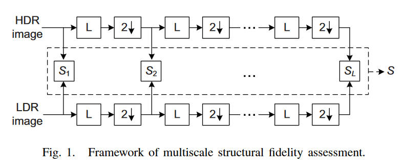
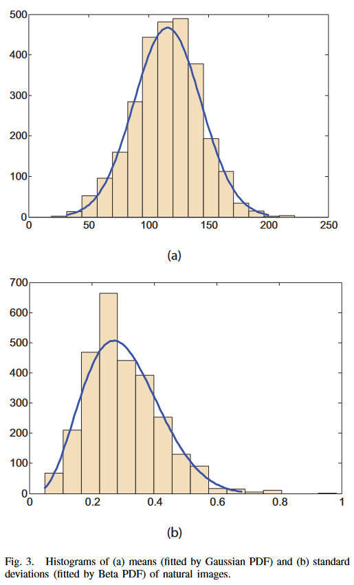
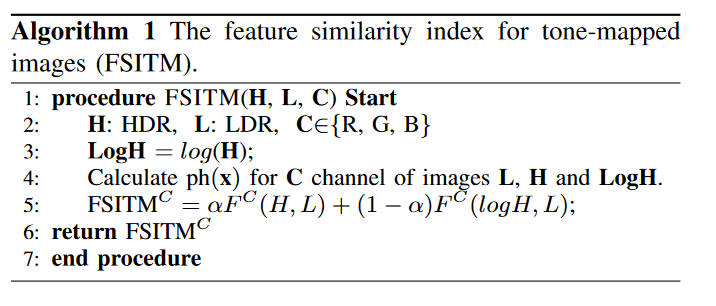
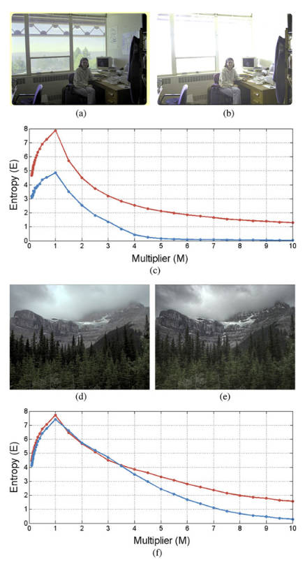

# TMQI

[Objective Quality Assessment of Tone-Mapped Images](https://ieeexplore.ieee.org/abstract/document/6319406)

本文之前的大多数IQA都只能应用在动态范围相同的图片上，本文的灵感来源于评估结构相似度的SSIM指标和评估整体自然度的NSS指标。本文希望权衡结构和自然度这两个指标来进行HDR-SDR图像评估。（同时这也说明了TMQI是全参评估指标）

**结构相似度**

局部评估定义如下

$$
S_{local}(x,y)=\dfrac{2\sigma'_x\sigma'_y+C_1}{\sigma_x^{'2}+\sigma^{'2}_y+C_1}\cdot\dfrac{\sigma_{xy}+C_2}{\sigma_x\sigma_y+C_2}
$$

其中$x,y$分别是HDR图和SDR图中的位置相同的一块小区域。$\sigma_x, \sigma_y, \sigma_{xy}$分别是小区域的标准差和相关系数。$C_1, C_2$为常数（取$C_1=0.01, C_2=10$）。

上式的第一项评估的是信号强度，在HDR和SDR中，如果这一块地方都很重要（信号强度大），或者都不重要，则不给予惩罚。如果一方重要，一方不重要，那么就给予惩罚。为了评估强度，将原本的方差$\sigma$经过一个非线性映射得到了这个$\sigma'$，其被设计为将重要的地方映射成$1$，不重要的地方就映射成$0$，其形式为高斯分布的积分

$$
\sigma'=\dfrac{1}{\sqrt{2\pi}\theta_\sigma}\int^\sigma_{-\infty}\exp\left[-\dfrac{(x-\tau_\sigma)^2}{2\theta_\sigma^2}\right]dx
$$

其中$\theta_\sigma$、$\tau_\sigma$是一些根据人眼特征设计的参数：

$$
\theta_\sigma(f)=\dfrac{\tau_\sigma(f)}{k}
$$

其中$k$作者这里取$3$，通常可以取$[2.3,4]$中的数

$$
\tau_{\sigma}(f)=\dfrac{\bar\mu}{\sqrt2\lambda A(f)}
$$

其中$\bar \mu$是亮度值的平均值，但作者实际上取的是SDR的中间值，即128。$\lambda$也是一个常数，作者完全没说取多少，我看有些实现里面取了$1$。

$$
A(f)=2.6[0.0192+0.114f]\exp[-(0.114f)^{1.1}]
$$

作者说这个$f$是一个空间频率，但实际上根图片内容没有任何关系，用了一个常数$16\ \text{cycles/degree}$，我并不是很懂作者在说什么。

光这样还不够，为了更好的排除采样密度、观察者距离、设备分辨率等干扰因素，引入了多尺度的评价流程，如下

每次获取到一个$S_{local}$之后，先将图片进行低通滤波，然后进行一次下采样，再获取一个$S_{local}$，反复重复直到$L=5$，其中之前提到的$f$也每次下采样（即除以$2$）

一整张图的局部相似度评估使用滑动窗口计算，最后取平均

$$
S_l=\dfrac{1}{N_l}\sum^{N_l}_{i=1}S_{local}(x_i, y_i)
$$

多尺度的评价指标则为加权乘积

$$
S=\prod^L_{l=1}S_l^{\beta_l}
$$

其中$\beta_l=\{0.0448,0.2856,0.3001,0.2363,0.1333\}$

**自然度**

评估自然度一般都是一个主观的任务，较难以量化，作者这里使用统计的方法来评估。首先选取了3000张灰度图像，包含了各种各样自然场景的图片，然后统计他们的平均值和方差，发现他们分别符合高斯分布和Beta分布：

即

$$
P_m(m)=\dfrac{1}{\sqrt{2\pi}\sigma_m}\exp\left[-\dfrac{(m-\mu_m)^2}{2\sigma^2_m}\right]
$$

$$
P_d(d)=\dfrac{(1-d)^{\beta_d-1}d^{\alpha_d-1}}{B(\alpha_d,\beta_d)}
$$

其中$\mu_m=115.94,\sigma_m=27.99,\alpha_d=4.4,\beta_d=10.1$。最近的研究认为对于人眼来说亮度和对比度更像是独立的要素，所以作者就将自然度评估定义为二者的乘积

$$
N=\dfrac{1}{K}P_mP_d
$$

其中$K=\max\{P_m,P_d\}$。从上面的介绍也可以看出来自然度这一部分不需要HDR原图的相关信息，所以这部分是无参评估指标。

**综合评估**

$$
Q=aS^{\alpha}+(1-a)N^{\beta}
$$

其中$a\in[0,1]$，而$\alpha,\beta$则定义了二者的灵敏度。

# FSITM

[FSITM: A Feature Similarity Index For Tone-Mapped Images](https://ieeexplore.ieee.org/abstract/document/6985727/)

本文的作者使用log-Gabor滤波来提取图像特征。本文基于一个简单的事实：理想的HDR图片和其对应的SDR图片应该同一个像素的同一个通道，拥有相同的相位。

作者使用了一种叫做二次对偶（quadratic pairs）的技术，来更好的描述图像的信息。偶对称和奇对称滤波器分别记为$M^e_{\rho r},M^o_{\rho r}$，其中$\rho,r$分别是该滤波器的缩放因子和方向。对图像$f(x)$进行滤波得到其响应

$$
\bigg[e_{\rho r}(x),o_{\rho r}(x)\bigg]=\bigg[f(x)*M^e_{\rho r}, f(x)*M^o_{\rho r}\bigg]
$$

于是我们计算局部相位为（原文应该是打错了，这里修改了过来）

$$
\phi_{pr}(x)=\arctan2\bigg(e_{\rho r}(x), o_{\rho r}(x)\bigg)
$$

$$
\arctan2(x,y)=2\arctan\dfrac{x}{\sqrt{x^2+y^2}+y}
$$

以上是对于特定的缩放和方向的，将所有缩放和方向综合起来考虑，得到我们所用的加权局部相位为

$$
\text{ph}(x)=\arctan2\bigg[\sum_{\rho, r}e_{\rho r}(x), \sum_{\rho, r}o_{\rho r}(x)\bigg]
$$

对于HDR图$H$和LDR图$L$，首先用简单的对数函数计算$LogH=\log(H)$，然后对于所有通道$C$都计算$\text{ph}(x)$，定义特征相似指标如下

$$
F^C(I_1,I_2)=|P_1^C(x)\cap P_2^C(x)|/(row\times col)
$$

$$
P(x)=U(\text{ph}(x))
$$

其中$U$是单位阶跃函数（注：相位的取值范围为$[-\pi/2,+\pi/2]$）。然后定义FSITM如下

$$
\text{FSITM}^C=\alpha F^C(H,L)+(1-\alpha)F^C(LogH,L)
$$

算法流程如下图

# FFTMI

[FFTMI: Features Fusion for Natural Tone-Mapped Images Quality Evaluation](https://ieeexplore.ieee.org/document/8894517)

本文将TMQI-II和FSITM中的一部分因子组合起来形成更好的指标。感觉没什么可讲的，略过。

# BTMQI

[Blind Quality Assessment of Tone-Mapped Images Via Analysis of Information, Naturalness, and Structure](https://ieeexplore.ieee.org/abstract/document/7384762)

BTMQI是一种无参评估指标。本文认为因为动态范围的限制，tone mapping后的图像无法保存所有HDR原图的信息，所以有理由认为保留了更多信息的图像其质量越高。本文首先就要估计图片中的信息量，作者使用了一种增亮/减暗的方法来评估原图和中间过渡图片的信息量。中间过渡图片定义如下

$$
I_i=\min(\max(M_i\cdot I, 0), 255)
$$

$I$是tone mapping得到的SDR图片，而$M_i$是一系列常数乘数。作者使用信息熵来评估信息量

$$
E(p)=-\int p(x)\log p(x)dx
$$

我认为这里的熵计算可能是先转成灰度图再来计算的，因为三通道不是那么好处理。再转成灰度图后统计直方图，将每一个亮度的频率除以总数当做概率，然后就可以计算熵了。

取$M_i$为$M=\{1,n,\frac{1}{n}|n=1.5,2.0,\cdots,10\}$，计算不同过渡图片的熵为

上图中红色曲线是左边的图，蓝色曲线是右边的图。显然(a)图比(b)图要好得多，其信息熵也更高。而(d)虽然在绝大部分情况下由于(e)，但还是在一些部分下略逊。

为了平衡效果和效率作者最终采用了$M=\{1,n,\frac{1}{n}|n=3.5,5,6.5,8\}$这$9$个数。当然，这是对于全图的信息量，根据业界一般的思路，也要考虑局部的信息量，于是

$$
E_t(I_i)=wE_g(I_i)+(1-w)E_l(I_i)^v
$$

对于每一张过渡图片$I_i$，分别计算全局的和局部的信息量$E_g(I_i)$和$E_l(I_i)$，然后再将它们结合起来考虑。其中$w=0.59,v=1.5$是一个可调常数。局部信息量就是滑动窗口再求平均

$$
E_l(I_i)=\dfrac{1}{L}\sum^L_{j=1}E(B_{i,j})
$$

其中$L$是滑动窗口的个数，而滑动窗口的大小为$72\times 72$。

当然，我们评测的信息量实际上只关注了有多少信息，而没有关注信息是什么样的。为了评估图片是否自然，作者直接照搬了TMQI中提出的方法，这里记作$N$。

实际上对于结构的关注并没有体现在信息量中，于是又引入第三项。由于是无参指标，没有办法跟HDR图片对比，所以这里采用了索贝尔算子来提取梯度大小图$G$。因为只想要基础的结构，所以又使用一个阶跃函数来去除多余的部分，$T=0.05$

$$
X(n)=\begin{cases}
1,&\text{if}\ G(n)\geq T \\
0,&\text{otherwise}
\end{cases}
$$

将$G$用阶跃函数过滤之后得到的图记作$S$。

综上所述，我们将11个特征记作$\{E_t(I_i),N,S|i=1,2,\cdots,9\}$。作者说可以用任意一种方法（如支持向量机）将这11个特征进行映射，得到一个标量评分，使其和人类主观评价相符（将人类评分数据集用于SVM训练）。

# TMIs-lpm

[Tone-Mapped Image Quality Assessment for Electronics Displays by Combining Luminance Partition and Colorfulness Index](https://ieeexplore.ieee.org/document/9057578)

思路和上一篇差不多，也是找一大堆特征，然后用SVM和主观评价拟合。不过区别是它首先将图片转化为LAB颜色空间，然后在L分量上使用Kmeans将图片分类为HR、DR、MR三个区域（高光、暗光、中等光），然后分别提取特征。这里Kmeans之前在全图应用了一次$7\times 7$的高斯滤波，来应对局部变化太快的情况。

**局部熵和对比度**

这里的熵和BTMQI里面的是一样的，只不过通过实验，作者认为只有HR和DR区域比较需要这个指标，因为中等光区域的信息保留比较好。记作$E_1, E_2$。

为了更好的评估HR和DR区域，又引入了两个对比度指标

$$
C_M=\dfrac{I_{max}-I_{min}}{I_{max}+I_{min}}
$$

其中$I_{max},I_{min}$分别为HR或DR区域中的最大亮度、最小亮度。

$$
C_L=\sum_LL(i,j)^2P_L(i,j)
$$

其中$L(i,j)$是两个像素的亮度差异值，$P_L(i,j)$是亮度差异值的概率分布（本人估计可能是滑动窗口内的所有亮度差异值的直方图统计出来的概率，看不懂作者想表达什么，但大概是一个加权平均值）。

总共四个指标分别记为$C_{M1},C_{M2},C_{L1},C_{L2}$。虽然作者好像没有明说，但是这六个指标应该都是局部区域算完再取平均的。

**颜色指标**

颜色指标只在MR区域上进行，使用了LAB中的A和B分量

$$
C_{ab} = \log\left(\dfrac{\sigma_a}{|\mu_a|^{0.2}}\right)\cdot \log\left(\dfrac{\sigma_b}{|\mu_b|^{0.2}}\right)
$$

其中$\sigma$和$\mu$就是A和B通道的标准差和均值了。这个是全图的，局部的指标为

$$
C_{RMS}=\sqrt{\dfrac{1}{m*n}\sum^m_{i=1}\sum^n_{j=1}(I_{i,j}-I_{mean})^2}{}
$$

$m,n$分别为滑动窗口的大小，而$I_{i,j},I_{mean}$即为特定像素的颜色值和该窗口的平均值。分别计算A和B通道的指标，得到两个指标$C_{RMSa},C_{RMSb}$

**结构信息**

作者使用GLCM算法提取图片的材质信息，其中使用能量信息$G_E$，对比度信息$G_C$，相关系数$G_H$，均匀度$G_V$。

同时，使用Canny算子进行边缘检测，然后在所有边缘像素上，统计$8\times 8$的邻居像素的均值$H_1$，标准差$H_2$，峰值$H_3$，偏度（skewness）$H_4$

# VQGC

[Blind Quality Assessment for Tone-Mapped Images by Analysis of Gradient and Chromatic Statistics](https://ieeexplore.ieee.org/document/9082863/)

也是提取了一大堆特征然后用SVM拟合，特征有新意但是整个过程没什么新意，略过。

# TReS

[No-Reference Image Quality Assessment via Transformers, Relative Ranking, and Self-Consistency](https://openaccess.thecvf.com/content/WACV2022/html/Golestaneh_No-Reference_Image_Quality_Assessment_via_Transformers_Relative_Ranking_and_Self-Consistency_WACV_2022_paper.html)
大体也是提取特征然后拟合的，只不过使用CNN提取局部特征，用Transformer计算非局部信息。然后将二者提取到的特征送到一个全连接层映射出一个得分，质量的损失函数即预测得分和人类主观评分的均方误差。后面还用了个Relative Ranking和Self-Consistency的损失函数加在里面。最后训练出来的模型就是端到端的评估模型。

# HDR10、HDR10+、HLG、Vivid、ACES资料解读

TODO
https://en.wikipedia.org/wiki/Academy_Color_Encoding_System