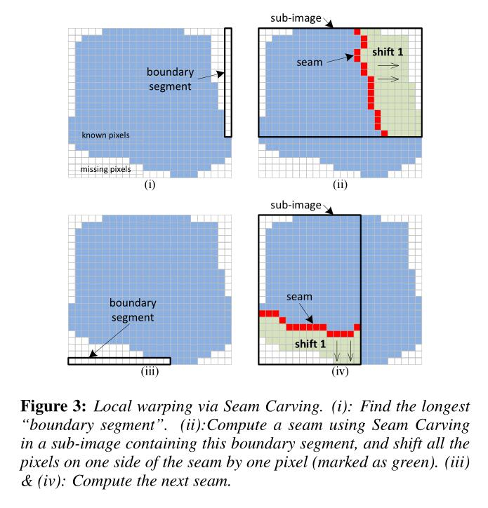
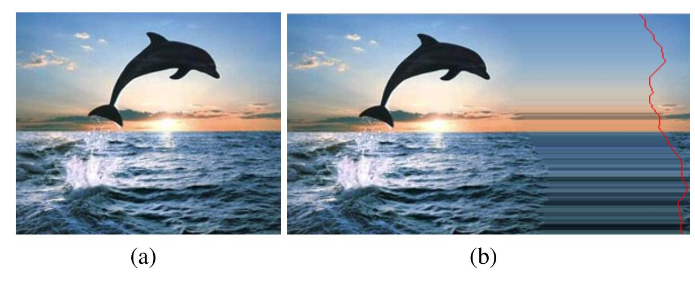
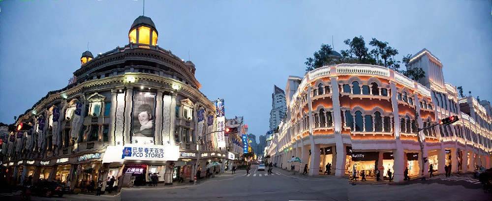
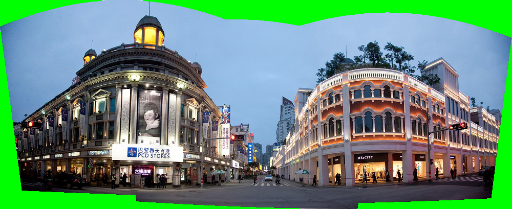
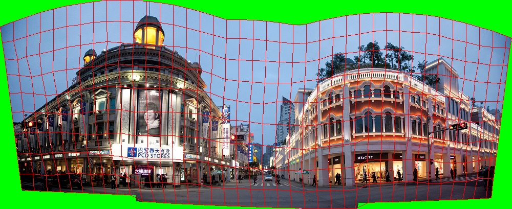

原论文：[https://people.csail.mit.edu/kaiming/sig13/index.html](https://people.csail.mit.edu/kaiming/sig13/index.html)

# 摘要

拍摄全景照片的时候，因为人手在抖，所以可能拍出来的图片边界就不是一个矩形框。在本文中，作者提出了一种可以感知图片内容的弯曲（warp）算法，来将这种形状非矩形的图片转化为矩形图片。分为两步，第一步是没有mesh的，初步把一张图片弯曲成矩形。第二步就是在矩形中建立mesh，然后在其中优化图片，使得图片中的各种形状保持原样（例如直线保持直线的样子）。

# 简介

同上介绍的，关于拍摄全景照片，因为手抖，无法拉出一个矩形图片。

一个简单的解决办法是：剪裁。从这个图片中剪裁出一个矩形区域。缺点是会损失很多信息。还有一种方法就是在原来的图片边缘的外面进行图片合成，缺陷是，对于复杂的语义信息无法处理。

作者这里提出了一种只会引入“可接受”的、“不容易注意到”的扭曲，并且保护图片原本内容的方法。

# 前人工作

**Image alignment and stitching**

全景照片实际上是将多张照片缝合（stitching）在一起的。通常用某种图片上的特征，来将原照片全部投影到一个相同的坐标系下。

**Projections**

众所周知，3D场景投影到2D会不可避免地导致一些折叠的扭曲。例如透视投影，虽然可以保持直线的形状，但是其他物体的形状则会被拉伸。圆柱投影和球面投影可以保持物体的形状，但会弯曲直线。

也有研究者提出了一种在自适应流形（adaptive manifold）上进行投影和缝合的方法。不过它是适应相机的移动，而不是适应图片的内容。

之前也有大量的工作，考虑将这些折叠后的扭曲，通过某种方式，让它们出现在不容易注意到的位置。虽然视觉上可以接受，但是无法移除固有的扭曲。

**Image retargeting and warping**

Image retargeting是一种基于图片内容的缩放图片的方式。但是它们都假设输入的图片具有矩形形状，而且其中一部分必须还要定义一个grid mesh。

**Image completion**

即前面提到的，在图片的边缘增加内容，使其变成一个矩形图片。一般的方法是把图片里面的内容，复制到需要合成的地方。但是对于需要生成语义内容来说，表现不好。

# 算法

算法分为两部分，一部分是改进的Seam Carving，是一个local warp的步骤，其将图片初步弯曲成矩形。然后另一部分（global warp）在前一步的基础上，建立一个grid mesh，在mesh上进行优化，来保证原图的物体形状和直线形状不变。

## Local Warp

原版的Seam Carving算法是在图片中插入水平或者垂直的接缝（seam），来穿过整张图片，然后再从接缝中水平或者垂直地扩展一个像素。作者这里想到，接缝不穿过整张图片，这样就可以改变图片边缘的形状，从而变成矩形。

原版的算法可见[https://faculty.runi.ac.il/arik/scweb/imret/index.html](https://faculty.runi.ac.il/arik/scweb/imret/index.html)

如上图，其中蓝色的部分是有效的图片像素，白色的部分是需要我们填充的像素。

首先定义boundary segment是待填充像素中的，在图片顶部/底部/左侧/右侧的一行/一列像素。例如上图。我们找到目前最长的一个boundary segment，然后从它扩展得到一个sub-image。

这里左侧右侧的boundary segment，扩展出来的sub-image的高度保持，而宽度则等于整张图。同理，顶部和底部的boundary segment，扩展出来的sub-image的宽度保持，高度等于整张图。

然后我们在这个sub-image上利用seam carving的方法，去进行图像扩展。方法很简单，首先根据图片颜色梯度信息，计算每一个像素的能量。然后使用动态规划，求解最短路径。

以Figure 3(ii)为例，计算得到每个像素的能量。因为我们需要向右边填入像素，所以我们需要一个竖直方向的seam。于是我们用动态规划的方式，求底部像素到顶部像素的最短路（8邻居路径），然后所有底部像素中距离顶部像素最近的像素，及其到顶部的路径，成为我们的seam。

注意这里使用8邻居是源于原算法的研究，另外，我们需要给待填入的像素的能量赋值为$10^8$或者更大的数，来防止seam穿过这些像素。

填充像素的时候，我们把seam及其右边的像素都往右移动一位。原本seam的位置则求取左右两个像素的平均。

原版算法中提到，为了防止反复在相同的位置插入seam、导致如下的情况

之前的作者建议同时采集多根seam，然后依次填入像素。

但是这在我们这篇文章中是行不通的。我们的Local Warp要求我们每次填充完一根seam之后，都要重新计算最长的bound segment，我们不能反复对同一个sub-image填入像素。

我这里的实现采用了一个比较trick的方法，算出seam后，对原本的seam的位置的能量设置为$10^5$这样的数，比一般的大，比非法像素的小。之后让像素和能量都右移。现在原本的seam位置的能量和其右边一个像素的能量都为$10^5$了，这样就有更少的可能会在这里再次插入seam。

总而言之，重复以上过程，直到填充完所有像素。例如我实现的下例

其原图为

可以看到，虽然填充是填充了，但是歪歪扭扭。于是还需要下面的步骤。

## Global Warp

### Mesh Placement

首先，我们在Local Warp之后的图片的长宽上，将其分成$(40-1)*(10-9)$个网格，其中$40*10$是网格的顶点数量。网格是正交的。

在Local Warp中，我们对像素进行了移动，我们需要记录下每个像素移动的偏移量。然后，我们使用网格顶点所在像素的偏移量，将各个网格顶点移动回去，就完成了mesh placement这一步。之后local warp的图像就可以抛弃了。移动后的结果例如：

### Energy Function

这里设计能量的目的有三个，对于目前的网格与最终的网格结果之间：

1. 保持网格的形状尽量不变，亦即Shape Preservation
2. 保持网格内的线段的笔直，并且与其平行的其他线段，在处理后依然平行，亦即Line Preservation
3. 网格上下左右贴合目标矩形图像框，亦即Boundary Constraints

**Shape Preservation**

最终输出的mesh的顶点（vertex）集记作$V$，其中的每一个元素$v_i=(x_i, y_i)$，可以用坐标表示出来。我们进行完Mesh Placement后得到的初始mesh记作$\hat V$

保型的能量定义为

$$
E_S(V) = \dfrac{1}{N}\sum_q||(A_q(A_q^TA_q)^{-1}A_q^T-I)V_q||^2
$$

这里$N$是quad的个数。其中

$$
A_q = \begin{bmatrix}
 \hat x_0 & -\hat y_0 & 1 & 0\\
 \hat y_0 & \hat x_0 & 0 & 1\\
  \vdots & \vdots & \vdots & \vdots\\
 \hat x_3 & -\hat y_3 & 1 & 0\\
 \hat y_3 & \hat x_3 & 0 & 1
\end{bmatrix}
$$

$$
V_q = \begin{bmatrix}
 x_0 \\
 y_0 \\
 \vdots \\
 x_3 \\
 y_3
\end{bmatrix}
$$

这里也就是说第$q$个quad的四个顶点的坐标。其中$A_q$中的是初始mesh的坐标，$V_q$是目标mesh的坐标。

**Line Preservation**

我们目前计算过的东西是不包含“线段”这样的信息的。我们首先要做的事是，使用任何一种线段检测算法，来算出图片中的线段。

根据作者的说法，我们需要将这些线段切分开来，放到mesh的各个quad里。然后将所有线段的方向角（范围$[-\dfrac{\pi}{2},\dfrac{\pi}{2})$），离散化为$M=50$个角度，每个离散化角度称为一个bin。为了保持直线性和平行性，设计的能量需要让每个bin里的线段拥有同样的角度。

给定一个线段，其方向向量$e$可以由线段的两个端点相减得到。如果我们将线段的两个端点用其所在的quad的$V_q$进行双线性插值表示，那么$e$就可以表示为$V_q$的线性函数。

同样的$e$是我们的目标，而$\hat e$则是最初的对应线段的方向向量。对于某一条线段，给定旋转操作的目标角度$\theta_m$，它的能量为

$$
||sR\hat e-e||^2
$$

其中

$$
R = \begin{bmatrix}
 \cos\theta_m &  -\sin\theta_m\\
 \sin\theta_m &  \cos\theta_m
\end{bmatrix}
$$

是旋转矩阵，而

$$
s=(\hat e^T\hat e)^{-1}\hat e^TR^Te
$$

是放缩因子。能量可以重新写为

$$
||Ce||^2
$$

其中

$$
C = R\hat e(\hat e^T\hat e)^{-1}\hat e^TR^T-I
$$

因为$\hat e$和$e$都可以写作$\hat V_q$和$V_q$的线性函数，所以能量就可以写成二次函数。

总的能量为

$$
E_L(V, \{\theta_m\}) = \dfrac{1}{N_L}\sum_j||C_j(\theta_{m(j)})e_{q(j)}||^2
$$

这里$N_L$为线段总数。对于第$j$条线段，$\theta_{m(j)}$代表其所属的bin中的目标旋转角度，$q(j)$代表其所属的quad。

**Boundary Constraints**

直白点说，就是把mesh的上下左右拉到图片框边缘上。

$$
E_B(V) = \sum_{v_i\in L} x_i^2 + \sum_{v_i\in R} (x_i-w)^2 + \sum_{v_i\in T} y_i^2 + \sum_{v_i\in B} (y_i-h)^2
$$

$L/R/T/B$分别是左右上下边界的mesh顶点，$w, h$则是图片框的宽高。

**最终能量**

将前面的几个加和，添加权重

$$
E(V, \{\theta_m\}) = E_S(V)+\lambda_LE_L(V, \{\theta_m\}) + \lambda_B E_B(V)
$$

显然，我们需要图片至少能够贴合图片框，我们设置$\lambda_B=10^8$来确保这一点。然后，关于$\lambda_L$的选择，作者说选取$>10$比较好，原文采取了$\lambda_L=100$。

### 优化算法

作者指出，可以分别优化$V$和$\{\theta_m\}$。每各优化一次算迭代一次，总共迭代10次。

**固定$\{\theta_m\}$优化$V$**

此时能量函数是$V$的二次函数，可以求解线性方程来计算。总共就几百个顶点，所以总体上来说，这部分的开销很小。

这里的求解是通过最小二乘法来算的，具体见我自己的实现部分。

**固定$V$优化$\{\theta_m\}$

因为另外两项和$\theta$无关，所以我们只用优化$E_L$这一部分。

作者指出，可以通过牛顿迭代等方法去优化。但是，几何意义上，$E_L$的目标是找到一个$\theta_m$，使得所有在第$m$个bin中的线段$e$和其初始线段$\hat e$的夹角，都近似等于$\theta_m$。所以，我们可以简单的计算所有这个夹角，然后加和，求平均，作为新的$\theta_m$。

# 我的实现

## 一些细节
