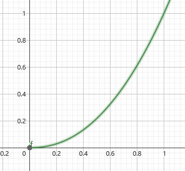

# 如何显示HDR

（注：本人对显示器技术了解有限，这一部分可能不够准确。另外，国内外网络上关于这些东西的说明实在太少，结合了我的一些个人理解，我尽量做到不自我矛盾）

白色$[255,255,255]$、红色$[255,0,0]$这样的颜色是怎么显示在屏幕上的呢？首先，将其转化为标准化的$[1.0, 1.0, 1.0]$、$[1.0, 0.0, 0.0]$，然后发送到显示器，显示器中分别显示RGB三种颜色的灯泡就会按照这个值去发出特定的亮度，这个特定的亮度由电光转换（EOTF）函数决定，在SDR显示器中，这个函数通常是gamma传递函数

$$
Y = E^\gamma
$$

这里$E$是我们给予的颜色值$[0, 1]$，而$Y$是标准化的亮度值$[0,1]$，其中$0$代表灯泡的最低亮度，而$1$代表灯泡的最高亮度。$\gamma$就是我们说的gamma值，一般会取$2.2$。一般来说，SDR显示器的最高亮度定义为$100$nits，所以

$$
F_D = 100Y = 100E^\gamma
$$

其中$F_D$是显示器理论上会发出的亮度值。

HDR的含义是高动态范围，要求我们能够显示更高的亮度，即超越$100$nits达到$400$、$1000$甚至更高的nits。虽然理论上来说你确实可以将$F_D = 400Y$来适应更高的亮度，但是使用其他曲线能够更好的符合人眼感知特性（以及其他原因，见后）。特别的，在HDR领域用的最多的是PQ曲线和HLG曲线，这里我们主要讲PQ：

$$
F_D = 10000\left(\dfrac{\max[(E^{1/m_2}-c_1),0]}{c_2-c_3\cdot E^{1/m_2}}\right)^{1/m_1}
$$

具体的参数数值可以在[https://en.wikipedia.org/wiki/Perceptual_quantizer](https://en.wikipedia.org/wiki/Perceptual_quantizer)找到。由公式和图像可知，PQ曲线最高支持到10000nits亮度。

PQ曲线是同样的，那对于只有400nits亮度的显示屏如何显示1.0大小的信号呢？答案是：不要使用1.0大小的信号。通过某一些方法（见后，即tonemapping）将1.0大小的信号缩放到0.7左右，并且视频、图像文件里都只存0.7以下的数字。

实际上这并不是乱说的，HDR视频制作过程中metadata确实会有记录视频制作时的显示器亮度，以及视频播放时显示器的亮度（至少HDR Vivid确实有），这对于HDR的合理播放至关重要。

接下来我们再来说说位深。从刚刚的描述中你也注意到，我们完全可以用$[0,255]$来表示HDR的所有亮度值$[0,1]$啊，为什么我们经常说HDR必须用上$10$bit呢？

我们先以简单的线性视角来看，如果要量化$[0,100]$nits这个区间，我们使用$8$位深度，那么就是用$256$个数去表示$[0,100]$，每两个连续的量化之间的差异是$100/256\approx 0.4$。而如果我们要量化$[0,10000]$nits这个区间，那么差异就是$10000/256\approx40$，大了一百倍，这造成的结果就是渐变变化跨度太大，有“条带”现象的出现。举个例子如下，从左到右量化精度越来越高，两个连续量化之间的差异越来越小。

问题是10bit用来量化10000nits他仍然有$10000/1024\approx 10$的连续差异啊？为什么HDR显示器10bit甚至8抖10bit就可以满足要求？这时我们就要脱离出线性的视角，实际上，在PQ域里，100nits对应的信号值是$0.5081$，而10000nits对应的是$1.0$。这就意味着我们使用10bit位深，来量化$[0,1.0]$这个区间，虽然$[0,511]$负责量化$[0,0.5]$，而$[512, 1023]$负责量化$[0.5, 1.0]$，但是将其使用PQ曲线转化后，实际上$[0, 511]$量化了$[0, 100]$nits，而$[512, 1023]$量化了$[100, 10000]$nits。换句话说，亮度越低的地方量化误差越小。

根据[https://en.wikipedia.org/wiki/High-dynamic-range_television#Transfer_function](https://en.wikipedia.org/wiki/High-dynamic-range_television#Transfer_function)所说，想要避免条带问题，在PQ域量化完整的10000nits需要至少12bits。而我们一般的HDR显示器也就支持到400nits，好一点的1000nits，用10bit来量化这些亮度低的地方完全足够。

回到之前的问题，为什么不再用gamma曲线了呢？除了人眼感知的一些因素，还因为gamma域中的10000nits量化要避免条带问题，至少需要15bit的位深。所以说白了，其实传递函数是对于量化亮度的分配规则（虽然gamma最初来源于CRT显示器的物理特性），将人眼最敏感的那部分区域用最多的空间去表示，而其他不敏感的地方用较少的空间区表示。

接下来还有颜色空间的问题。HDR10这样的标准确实规定了颜色空间必须是Rec2020，但是从上面的介绍中你也认识到，要显示HDR和颜色空间没有什么关系，你就算只支持灰度显示也可以HDR。不过，你若想将HDR映射到SDR显示器上显示，你仍然需要在tonemapping过后将Rec2020转到Rec709，防止SDR显示器显示有偏差的颜色。

# Tone Mapping的作用

最初是没有HDR显示器的，Tone mapping的作用是将用各种技术捕捉到的具有高亮度的图像，恰当的显示在SDR显示器上。通常来说，一张照片中的很大部分内容都在$[0,100]$nits之间，可以被SDR显示器正常显示，而只有很少一部分（例如太阳直射），具有很高的亮度，比如1000nits。而Tone mapping要做的事是，保留大部分正常显示的内容亮度不降低太少，而大幅度降低过于亮的部分。例如，我们可以用$[0,80]$nits来显示原来$[0,100]$的内容，而使用$[80, 100]$nits显示所有大于100nits的内容。

你可能会说这和刚刚提到的EOTF很像，都是在限定的范围内合理分配数值。那我们可不可以直接将PQ域的数据转换到线性域，再从线性域转换到Gamma域呢？答案是可以，但是不够好。借用论文[High Dynamic Range Image Tone Mapping: Literature review and performance benchmark](https://www.sciencedirect.com/science/article/pii/S1051200423001100)中的一张图（本文之后的内容也会极大程度参考该综述）

使用不同的Tone mapping效果是不一样的。上面的gamma曲线的图像明显是不如Drago曲线的，也就是说，gamma曲线对于HDR源的压缩还不够好，因为它毕竟只是为了SDR源而设计的。

在不同地方，Tone mapping曲线的目标可能是不一样的。例如在图形渲染当中，为了符合更好的物理规律，镜面反射+漫反射+环境光的亮度可能会大于1.0，这里的Tone mapping目的在于将$[0, +\infty]$的亮度映射到$[0, 1]$之间，然后再去gamma校正。而对于HDR Vivid这样的视频处理，其规则为：PQ域-线性域-Tone mapping-Gamma域，首先转化为$[0,1]$之间的标准化亮度，然后Tone mapping负责将这个$[0,1]$映射到另一个$[0,1]$上，更符合Gamma域的颜色分布，然后进行伽马校正。

通常，Tone mapping是在“亮度”上进行的，而非分别在RGB上做（当然也有），在改变亮度后再进行“颜色恢复”，形式如下

$$
C' = \left(\dfrac{C}{L}\right)^s T
$$

其中，$C$是指原图中某个像素的RGB通道中的任意一个的数值，而$C'$则是其对应的Tone mapping后的结果数值。$L$是该像素的亮度，而$T$是$L$使用Tone mapping曲线计算出来的结果，$s$是颜色补偿参数，一般会取$1$，如果小于$1$就会欠饱和。所以，面向亮度进行的Tone mapping就是在研究如何将$L$转换成$T$。

首先先谈一谈如何计算某个像素的亮度值。这通常很经验，要么就是根据某种人眼的生物学研究，但是有几个形式用的比较多，最多的可能是：

$$
L = 0.2959R + 0.5870G + 0.1140B
$$

即RGB的加权平均（事实上，人眼确实对绿色的亮度最敏感）。而像HDR Vivid这样的体系会使用$L=\max\{R,G,B\}$。虽然没有确切证据证据，但是前者恰好是RGB转YUV中Y的定义，而后者正好是RGB转HSV中V的定义。

# 只考虑单个像素亮度的TMO

（注：TMO是Tone Mapping Operator）

如果我们整张图只用一根曲线，并且只考虑某个像素自己的信息，那么这也可以叫做Global TMO。

例如，**极简化**的Reinhard方法可以被写作

$$
T = \dfrac{L}{1+L}
$$

其将$[0,+\infty]$映射到$[0, 1]$上。更多的这种用在游戏领域的GTMO可以看[https://zhuanlan.zhihu.com/p/21983679](https://zhuanlan.zhihu.com/p/21983679)，它们的显著特点就是形式简单，速度超快。（另外他这里面全是RGB上直接做的，而Reinhard的[原论文](https://dl.acm.org/doi/abs/10.1145/3596711.3596781)取的是$L=0.27R+0.67G+0.06B$）

这样的单根曲线很多时候是根据人眼视觉系统（human visual system, HVS）的特性来设计的，例如论文[Adaptive logarithmic mapping for displaying high contrast scenes](https://onlinelibrary.wiley.com/doi/abs/10.1111/1467-8659.00689)中，就使用了

$$
L_d = \dfrac{L_{dmax}\cdot 0.01}{\log_{10}(L_{wmax}+1)}\cdot\dfrac{\log(L_w+1)}{\log\left(2+\left(\left(\dfrac{L_w}{L_{wmax}}\right)^{\dfrac{\log(b)}{\log(0.5)}}\right)\cdot 8\right)}
$$

这样的公式，这里的$L_w$就是映射前的亮度，$L_d$就是映射后的亮度，而$L_{dmax}$一般取100代表显示器的最大亮度，$b$是可调参数。

还有一种方法是根据直方图来的，例如[Tone-mapping High Dynamic Range Images by Novel Histogram Adjustment](https://www.sciencedirect.com/science/article/pii/S0031320309004518)可以被**极简化**的写作

$$
D(I) = (D_{max}-D_{min})\times \dfrac{\log(I+\tau)-\log(I_{min}+\tau)}{\log(I_{max}+\tau)-\log(I_{min}+\tau)}+D_{min}
$$

其中$D_{max}, D_{min}$是显示器的最大最小亮度，而$I_{max}, I_{min}$是场景中的最大最小亮度。（注：曲线对于同一张图片是固定的，不同位置的像素拥有相同的输入就有相同的输出）

也有研究者引入了聚类算法，对不同的类别进行统计，决定该图像的映射曲线使用什么参数。

这类GTMO的问题在于，其对于局部对比度的保护不好。尤其是在特别亮和特别暗的地方，这些曲线倾向于将它们映射到非常接近的亮度，而一个像素和其周围的像素亮度通常是接近的，使用GTMO就丢失了局部对比度。

# 考虑周围像素亮度值的TMO

为了解决局部对比度的问题，Local TMO就被提出了。GTMO理论上同一张图片里相同的亮度会被映射成相同的结果，但LTMO就允许映射成不同的结果，来保护局部的对比度。

考虑空间上的信息的研究中比较著名的是**完全体**版[Reinhard](https://dl.acm.org/doi/abs/10.1145/3596711.3596781)，在传统的摄影技法中，摄影师能够通过调整曝光时间来将结果中的暗的地方增亮，亮的地方变暗，从而让结果包含更多有效信息。Reinhard方法通过自动的方法来进行这种操作。作者使用高斯滤波器来找到这种局部对比度差异大的像素，然后通过提亮被亮像素包围的暗像素，减暗被暗像素包围的亮像素，并且他们变化的幅度不会太大，来实现降低整体的亮度的同时保证局部对比度。

而在频域的信息上来做的最著名的是[Durand & Dorsey](https://dl.acm.org/doi/abs/10.1145/566570.566574)方法，原文大篇幅在讲滤波，我看不懂，但是其LTMO的思路如下（参考自[https://zhuanlan.zhihu.com/p/573894977](https://zhuanlan.zhihu.com/p/573894977)）

1. 通过我们之前加权求和方法计算图片的亮度图，并且将其进行对数运算，得到**对数域**亮度图$L$
2. 在$L$上进行双边滤波，得到$B$，即代表了基础层，我们需要压缩这部分
3. 计算细节信息层（局部对比度就在这里）$D=L-B$
4. 以某种方法压缩$B$，例如直接乘以常数，或者使用某种GTMO（我试过真的可以，不过要先从对数域转换回去，之后再转换回来），得到压缩后的结果$B'$
5. 重新算出全图亮度$L'=B'+D+\beta$，这里的$\beta$是曝光补偿参数，可调。
6. 将$L'$从对数域转回去，得到了新的亮度，然后使用我们之前说的颜色恢复方法恢复回去就可以了。

当然，这里的细节层也不是不可以增强或者压缩，看自己的选择。这种方法的原理是利用了双边滤波的特性，其可以保护边缘信息，而将其他变化平缓的部分取均值，从而我们可以通过计算出基础层$B$，然后用用$L-B$得到细节层$D$。实际上这个$D$就是将原图中的边缘信息去除，然后留下平缓部分的“差异”，也就是“局部对比度”。

之前用双边滤波可能会有点性能问题，但是双边网格被发明后，再加上现在电脑的算力提升，这种方法也是逐渐可以用到游戏里了，例如[对马岛之魂](https://advances.realtimerendering.com/s2021/jpatry_advances2021/index.html#/125)中，就应用了这种技术，其算法我认为本质上和上文的是相同的：

$$
I_o=c\times (B-M) + d\times (I_i-B) + M
$$

上面这些全在**对数域**，$I_o, I_i$就是输出和输入亮度，$B$是滤波得到的基础层，$M$是亮度的中值。$c$是调整对比度的可调参数，$d$是调整细节的参数。

双边滤波的问题是会有光晕问题。作者给出的解释如下

我认为作者的意思是想说，在减少对比度的同时，增加细节，就会让这根曲线从“大体上单增”，变成了一个“大体上先增后减再增“的曲线，正是这种奇怪的过渡使得光晕产生。

而作者给出的解决办法就是混合使用高斯滤波和双边滤波。大概40%的双边，60%的高斯，而且高斯核必须足够大。

# 考虑像素颜色值的TMO

我们之前说的颜色恢复并不是那么准确，像那样改亮度实际上是会稍微影响到色度的。

TODO

# 深度学习的TMO

## 基于GAN的方法

TODO
