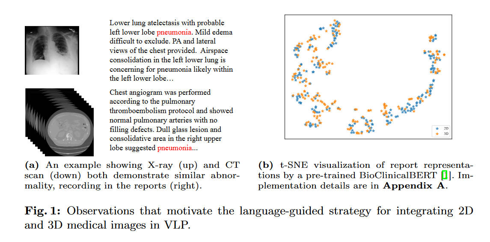
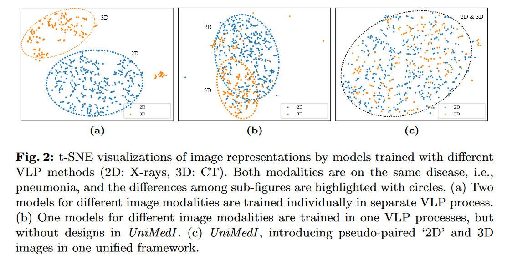
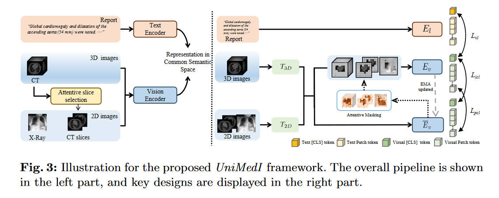
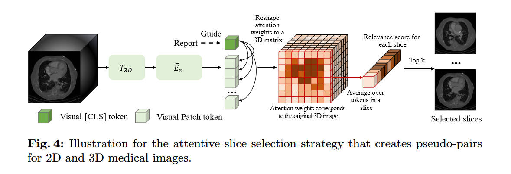

原论文：[https://eccv.ecva.net/virtual/2024/poster/1165](https://eccv.ecva.net/virtual/2024/poster/1165)

# 摘要

当今的语言视觉预训练（Vision-Language Pre-training (VLP)）在医学图像的分析方面展现出了不错的效果，但是它们大多只针对单一模态数据。而将真实场景中的多种模态的数据进行统一表示还是一个开放性问题。

医学场景中，有各种不同形式的数据，尤其还有3D的图像。另外，这些不同形式的数据并不一定配对（例如有些既做了X光（2D），又做了CT（3D），而有些病人只有CT或者只有X光）。

为此，本文提出UniMedI，使用医学诊断报告来当做公共的语义空间，来将各种模态的医学图像统一表示。

# 简介

作者观察到，虽然不同模态图像的差距可能很大，但是医疗过程中，对于同一个患者的医疗报告应该是相似的。

上图中的(b)更是在实验结果上证明了这一点。于是就可以使用语言（医学报告）信息作为桥梁，将各种模态的图像联系到一起。

但是问题是，并不一定每一个病人进到医院里都会把CT、超声、X光、MRI顺着做一遍。也就是说，同一个病人的配对数据并不一定总是存在，这给训练就带来了一定挑战。

上图(a)是将两个模态的数据用两次VLP（分别）训练得出的结果。而(b)则是简单地将多模态数据统一，在一个VLP上训练的结果。本文的UniMedI模型引入了一个“伪配对”技术，让2D、3D图像能够一起输入。

# 整体流程

跟ConVIRT有些像，也是对文本的图片分别使用两个编码器，然后进行对比学习。区别在于，UniMedI可以将3D、2D图像以统一的方式读取。

当输入是3D图像时，会使用一个叫attentive slice selection的策略来获取一些2D的切片，这些切片是和医学报告最相关的部分。然后这些切片和原来的3D图像一起送入编码器。当输入是2D图像时，切片这一步就会被忽略。

图像的编码器中，有$T_{2D}$和$T_{3D}$两个tokenizer，并且共用一个$E_v$来实现更好的结合。之后的过程和ConVIRT类似，$E_l$和$E_v$通过对比损失$L_{vl}$等进行训练。

另外，本文还介绍了auxiliary masking等技术来更好的结合2D、3D数据。

# 伪对创建过程

本文提出的attentive slice selection，模仿医生的行为，通过医学报告来选择最合适的3D图像的切片来看。注：本文这一段和ViT强相关，不了解ViT的建议阅读ViT的相关文章。

本文没有详细描写Tokenizer是什么结构，这里猜测是和ViT一样的结构，即将2D图片切分成多个16x16的patch，每一个patch就算是一个token了（所以上图中的图例有问题，绿色方块应该是embedding而非token）。然后这些patch送入后面的$\bar E_v$，将其embedding，这里的这一部分就相当于ViT论文中的“Linear Projection of Flattened Patches”。同样的，这里的\[CLS\]的就是ViT文章中的\[class\]或者是BERT论文中的\[CLS\] token。（另外本文居然没有Position Embedding。）

这里的\[CLS\]是跟随着$E_v$训练得到的，并且是受到文本监督的，因此它才能对相关得分的计算有效。计算attention value的公式如下

$$
v = \dfrac{1}{HL}\sum^L_{l=1}\sum^H_{h=1}\text{Softmax}\bigg(\dfrac{q_{lh}([CLS])K_{lh}([Patch])}{\sqrt C}\bigg)
$$

其中$L$是Layer的数量，$H$是Heads的数量。$q_{lh}\in \mathbb{R}^C$代表\[CLS\]的embedding，而$K_{lh}\in\mathbb R^{P\times C}$代表全部P个Patch的embedding。最终$v\in\mathbb R^P$。这里的$C$应该是可以自定的embedding的维度。

对于一整个slice的相关得分，则通过其每个patch的得分的算数平均来得到。对于第$i$个slice，有

$$
s_i = \dfrac{1}{N}\sum^N_{j=1}v_{ij}
$$

（很奇怪为什么作者不用$P$而改用$N$了）

之后就是选择得分最高的$k$个切片，来当做伪配对。

# 使用文本监督对比学习

大体上，UniMedI的对比学习是按照CLIP的结构来的（而CLIP则是ConVIRT后面的工作）。对于2D图像，直接使用$T_{2D}$和$E_v$来进行特征提取，并且获得\[CLS\] token来包含全局的图像信息。之后将这个\[CLS\]和文字编码器的\[CLS\]对齐。

对于3D图像，首先用之前的方法挑选出2D切片，然后将3D图像和2D图像分别使用$T_{3D}, T_{2D}$进行tokenize。所有这些token会直接前后拼接在一起传入$E_v$。之后的部分和2D图像一样。

# 通过自我蒸馏来增强不同维度数据的结合

为了更好地结合2D、3D数据，本文提出了一个简单的辅助工具。在训练过程中，使用一个在线的学生网络$E_v$和其教师网络$\bar E_v$。将输入的2D3D图像的一大部分进行mask，传递给学生网络，然后将所有2D3D图像传递给教师网络。学生网络被要求输出尽可能和教师网络一样的结果。

自蒸馏选用的架构是DINO，使用了DINO的loss和head部分。loss函数引用到\[CLS\]上（$L_{icl}$）和所有的patch上（$L_{pcl}$）

# 自我思考

（本段可能会暴露个人水平，本人水平还很初级）

文章标题很唬人啊，什么统一医学图像表示，实际上大部分内容是在探讨如何让2D和3D图像更好结合的。但我本人更想知道如果用两种2D图像，比如X光和超声，如何去解决这个配对问题。

是否使用一个tokenizer和一个encoder就行了呢？我个人猜测可能会有一些问题，比如先用超声训练再用X光训练，可能会有遗忘现象。如果以其他技巧进行训练，我估计也避免不了domain gap的问题。

另外，本文似乎也没有介绍如果输入的图像有配对，如何同时利用两者的信息来提高判断准确度。（看起来只能同时输入一种模态，并且实验部分也都是2D3D分开的）（配对的数据集可能也欠缺）

另外，如何应对三种以上的数据？一个胡思乱想：用多个VL对比学习对多种图片进行学习，然后将所有可用的图片的encoder的结果concat起来传入另一个transformer。因为transfomer可以应对任意长度的序列数据，所以就数据上来说肯定是能跑通的。只不过效果可能会差，如本文作者介绍的Fig2那样。
