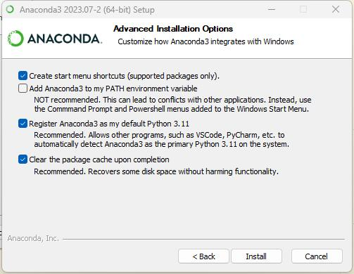

# 编辑器/IDE

## Emacs

[https://mirrors.tuna.tsinghua.edu.cn/gnu/emacs/windows/](https://mirrors.tuna.tsinghua.edu.cn/gnu/emacs/windows/)，在清华源下载安装，可以更改的只有安装目录。

我现在初步怀疑，不应该把Emacs添加进环境变量，还需要进一步观察。（TODO）

.emacs.d的部署TODO。

似乎emacs29自带use-package?TODO(https://www.gnu.org/software/emacs/manual///html_node/efaq/New-in-Emacs-29.html)

all-the-icons TODO

## IDEA

[https://www.jetbrains.com/idea/download/?section=windows](https://www.jetbrains.com/idea/download/?section=windows)，官网下载，我现在主要用Community版本，免费，而且其是可商用的，这点和其他很多软件的社区版不同。

我这里没有选择添加进`PATH`，并且把所有文件关联都勾选上了。主要是考虑到防止PATH里面东西太多，干扰运行。


## Pycharm

[https://www.jetbrains.com/pycharm/download/?section=windows](https://www.jetbrains.com/pycharm/download/?section=windows)，和IDEA一样。

## QT Creator

TODO

## Android Studio

[https://developer.android.google.cn/studio](https://developer.android.google.cn/studio)，官网下载。

勾上AVD，这个是安卓虚拟机，很显然是必要的。


AVD设置TODO（包括用软连接把安装目录转移等）

## Obsidian

[https://obsidian.md/](https://obsidian.md/)，官网下载，不需要设置环境变量。

其软件设置，我一般会加上Completr插件来为Latex提供补全，安装Solarized主题。设置`严格换行`，`显示行号`，`tab`功能替换为4个空格而非制表符等。

## CP Editor

[https://cpeditor.org](https://cpeditor.org)下载，

建议选择64位版，不带mingw和llvm的版本，因为我们已经在msys里安装过了。

这里没有选择all users安装，其他就只有目录可以修改。

## TexStudio

见后

# 字体

## Jetbrains Mono

[https://www.jetbrains.com/lp/mono/](https://www.jetbrains.com/lp/mono/)，下载解压，得到一大堆ttf格式的文件。虽然你可以一个一个双击安装，但是太慢了，我推荐你把它们全部选中，拖入到`C:\Windows\Fonts`文件夹中，可以批量安装。

# Git

## Git for Windows

## Github Desktop

[https://desktop.github.com/](https://desktop.github.com/)，可说的不多，甚至不需要安装，双击就打开安装完毕了，也没有环境变量需要配置（自动配置在User的PATH里了）。

# 终端模拟器

## Terminal

### 主题

# C/C++相关

## GCC

这里使用的是`MSYS2`，[https://www.msys2.org/](https://www.msys2.org/)，下载安装包。

打开安装包，其中只有安装目录是能修改的。

安装完成后勾选立即打开，打开的是ucrt64，我们首先更换软件源。

进入`xxx\msys64\etc\pacman.d`，参照[https://developer.aliyun.com/mirror/msys2](https://developer.aliyun.com/mirror/msys2)进行修改，这里我们全都修改一下。

在文件中搜索ali


把阿里云的这一行复制到第一行。对所有文件都进行这个操作。

之后在ucrt64的命令行中执行`pacman -Sy`

之后安装`pacman -S mingw-w64-ucrt-x86_64-gcc`，当然，更好是使用官网推荐的`pacman -S mingw-w64-ucrt-x86_64-toolchain`

环境变量我们只设置ucrt64和msys的，全部设置可能会加大冲突风险。


记住要把ucrt64设置在`\usr\bin`上面。

之后我们打开`MSYS`的命令行，安装`pacman -S gcc`，这一步的目的是，我们使用MSYS提供的虚拟Linux的POSIX，方便我们在windows上进行Linux系统调用，这两个gcc的区别可见[../MSYS2,MinGW64,Cygwin的使用区别浅谈](MSYS2,MinGW64,Cygwin的使用区别浅谈)

## Clang

我们不去安装LLVM官方给Windows的二进制包了，我们直接在ucrt64里安装。

```bash
pacman -S mingw-w64-ucrt-x86_64-clang mingw-w64-ucrt-x86_64-clang-analyzer mingw-w64-ucrt-x86_64-clang-tools-extra
```

安装了clang，clangd等工具。安装完之后不用进行任何环境变量配置。

## MSVC

## Make/Cmake/Ninja

在UCRT64的terminal里面，输入

```bash
pacman -S mingw-w64-ucrt-x86_64-cmake mingw-w64-ucrt-x86_64-cmake-gui mingw-w64-ucrt-x86_64-ninja mingw-w64-ucrt-x86_64-make
```

安装cmake官网的windows版本会不会更优有待考察TODO。

另外，直接安装`make`后，并不能在powershell里直接使用，见[MSYS2中的make工具安装方法](../MSYS2中的make工具安装方法)

## Lua

# Rust相关

# GO相关

# Java相关

## JRE和JDK

### Java8运行时

很多软件（例如Minecraft），都还建立在Java8之上，所以安装JRE8是理所当然的。

[https://www.java.com/en/download/](https://www.java.com/en/download/)，java官网目前首选的下载也是Java8。安装过程没什么可说的，只有安装位置可以更改。

环境变量他也会自动配置好。

### JDK11和JDK17

因为有许多库，其在JDK11上运行最稳定，所以JDK11是要安装的，而想用新特性，最好安装一下JDK17。JDK11和17是LTS版本，更新的有需要再安装。如果你不可避免的要用JDK8 LTS，那么也可以去安装。

我这里安装的都是Adoptium Eclipse Temurin的JDK，见[https://adoptium.net/zh-CN/temurin/releases/?version=17](https://adoptium.net/zh-CN/temurin/releases/?version=17)

以JDK17为例


我这里全都勾选了，但是PATH和JAVA_HOME其实可以不用勾选，因为很多IDE（如IDEA，Android Studio）都支持搜索所有JDK，并且手动选择JDK版本，所以这个其实不是很必要。

另外，如果你加入了PATH，要记得把JAVA8的PATH放到JDK上面，以防运行不了Minecraft。

## Scala

## Kotlin

## Clojure

# Python相关

## 普通版

[https://www.python.org/downloads/](https://www.python.org/downloads/)下载最新版（注意是Windows installer (64-bit)），安装。

安装它的原因是，因为直接把Anaconda3的Python导入环境变量实在是太容易造成冲突了，我们需要一个默认的Python给Windows用。

我选择添加python.exe进PATH，并且Customize installation。勾选第二页的全部选项（默认就是全部）、第三页也全部勾选（注意有一个选项需要先安装Visual Studio）。


如上勾选之后，环境变量也会自动配置。这个普通版Python并不会影响Anaconda的virtual env，放心使用。

## Anaconda3

[https://www.anaconda.com/download](https://www.anaconda.com/download)下载安装包。

安装时，我选择的是Just Me而不是All Users


勾选如下，勾选了第三个，可以让Pycharm选择里面的环境。第四个看到他推荐也就勾选了。第二个不勾选，防止环境变量冲突。



Anaconda的软件源也比较慢，推荐参考[https://mirrors.tuna.tsinghua.edu.cn/CTAN/systems/texlive/Images/](https://mirrors.tuna.tsinghua.edu.cn/CTAN/systems/texlive/Images/)换为国内源。

# Latex相关

## TexStudio

这其实只是一个编辑器，不包含latex的运行环境。

[https://texstudio.sourceforge.net/](https://texstudio.sourceforge.net/)，下载后只有安装目录可以更改，不需要设置环境变量。

## texlive

这才是真正的运行环境。

[https://mirrors.tuna.tsinghua.edu.cn/CTAN/systems/texlive/Images/](https://mirrors.tuna.tsinghua.edu.cn/CTAN/systems/texlive/Images/)，推荐在清华源下载，官网实在太慢。下载texlive.iso即可。

下载后装载这个iso，打开install-tl-windows.bat安装


选好位置点击安装。

安装完成后关闭，弹出iso。环境变量已经自动设定在User的Path里。

# SQL相关

## Postgresql

# JS相关

## Node.js

# 博客（Hugo）

## Hugo

见我的文章[为Hugo安装goldmark-mathjax插件来更好地支持输入公式](../为Hugo安装goldmark-mathjax插件来更好地支持输入公式)，不推荐使用官网的安装包，推荐自己加插件自己编译。

把编译好生成的`hugo.exe`放到某个你喜欢的地方，比如我的`G:\Program_Files\Hugo\`，并把这个目录设置为环境变量。

## Pandoc

[https://www.pandoc.org/installing.html](https://www.pandoc.org/installing.html)，现在有安装包，以前只有压缩文件。我只是选择了为所有用户安装以及选择了安装位置，也没有其他可选项了。

需要手动配置环境变量，配置在`xxx\Pandoc\`即可。

# Matlab

从各种地方下载安装包，例如学校正版软件服务、官网等，直接安装即可。

软件包选择TODO

环境变量一般配置在`xxx\MATLAB\R2021b\bin`，注意版本`R2021b`换成自己的版本。

# 其他

## Gpg4win

从[https://www.gpg4win.org/](https://www.gpg4win.org/)下载安装，环境变量其会自动配置。我勾选了除了Okular以外的所有选项。

一般会配置在`xxx\Gpg4win\..\GnuPG\bin`


# 环境变量顺序

TODO
