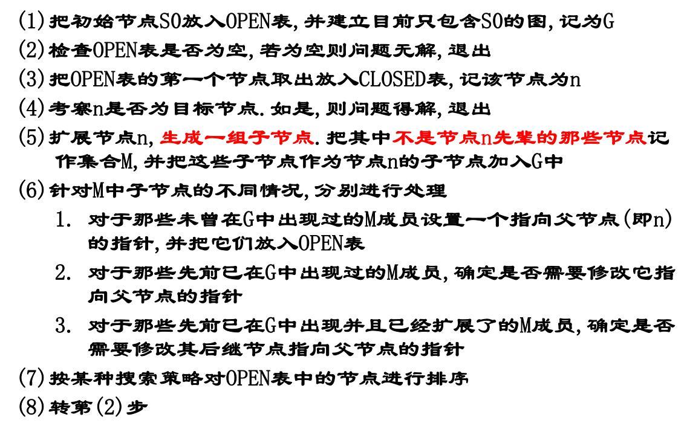

# 一些概念解释

## 弱人工智能与强人工智能

弱人工智能是指不能真正实现推理和解决问题的智能机器，这些机器表面看像是智能的，但是并不真正拥有智能，也不会有自主意识。

强人工智能是指真正能思维的智能机器，并且认为这样的机器是有知觉的和自我意识的，这类机器可分为类人（机器的思考和推理类似人的思维）与非类人（机器产生了和人完全不一样的知觉和意识，使用和人完全不一样的推理方式）两大类。

## 符号处理系统

### 六种功能

1. 输入符号
2. 输出符号
3. 存储符号
4. 复制符号
5. 建立符号结构：在符号系统中形成符号结构
6. 条件性迁移：根据已有符号，继续完成活动的过程

可以把人看作是一个物理符号系统。如果一个物理符号系统具有上述全部6种功能，能够完成这个全过程，那么它就是一个完整的物理符号系统。人具有上述6种功能；现代计算机也具备物理符号系统的这6种功能。

有一个假设：任何一个系统，如果它能表现出智能，那么它就必定能够执行上述6种功能。反之，任何系统如果具有这6种功能，那么它就能够表现出智能；这种智能指的是人类所具有的那种智能。把这个假设称为物理符号系统的假设。

这个假设有很多局限性，许多乐观预言都成了泡影。90年代之后人工智能领域形成了很多新的研究模式

## 人工智能的学派

### 符号主义

又称：逻辑主义、心理学派或计算机学派

原理：物理符号系统（即符号操作系统）假设和有限合理性原理

符号主义认为人的认知基元是符号，认知过程即符号操作过程。认为人是一个物理符号系统，计算机也是一个物理符号系统，因此能够用计算机来模拟人的智能行为。人工智能的核心问题是知识表示、知识推理和知识运用。

### 连接主义

又称：仿生学派或生理学派

原理：神经网络及神经网络间的连接机制与学习算法。

连接主义认为思维基元是神经元，而不是符号处理过程。认为人脑不同于电脑，并提出连接主义的大脑工作模式，用于取代符号操作的电脑工作模式。

### 行为主义

又称：进化主义或控制论学派

原理：控制论及感知—动作型控制系统

行为主义认为智能取决于感知和行动（所以被称为行为主义），提出智能行为的“感知—动作”模式。认为智能不需要知识、不需要表示、不需要推理；人工智能可以象人类智能一样逐步进化(所以称为进化主义)；智能行为只能在现实世界中与周围环境交互作用而表现出来。

## 研究领域

### 自然语言理解

是计算机对人类的书面和口头形式的自然语言信息进行处理加工的技术,涉及语言学,数学和计算机科学等多学科知识领域.其主要任务是建立各种自然语言处理系统,如:文字(语音)自动识别系统,电子词典,机器翻译,自动索引系统等.

### 模式识别

模式识别是指用计算机代替人类或帮助人类感知模式，是对人类感知外界功能的模拟，研究的是计算机模式识别系统，也就是使一个计算机系统具有模拟人类通过感官接受外界信息、识别和理解周围环境的感知能力。

其已在医学图象,指纹识别,天气预报,汽车牌照识别中广泛应用。

### 计算机视觉

机器视觉或计算机视觉是一种用计算机实现(或模拟)人的视觉功能，对客观外界进行感知和理解的技术。它是在图像处理和模式识别技术基础上发展起来的一门新兴的学科分支，其主要目的就是用机器识别客观外界景物，即从外界获得二维图像，抽取其特征(如形状、位置、大小、灰度、颜色、纹理等)构成本征描述，然后与已知物体的描述相匹配，从而辨认出所描述的物体。

### 专家系统

专家系统是一个具有大量专门知识和经验的程序系统，它应用于人工智能技术，根据某个领域中一个或多个人类专家提供的知识和经验进行推理和判断，模拟人类专家的决策过程，以解决那些需要专家决定的复杂问题。

### 机器学习

所谓机器学习，就是要使计算机能模拟人的学习行为，自动地通过学习获取知识和技能，不断改善性能，实现自我完善。机器学习就是计算机自动获取知识，它是知识工程的三个分支（使用知识、知识表示、获取知识）之一 。

### 神经网络

也称神经计算,是指一类计算模型,其工作原理模仿了人类大脑的某些工作机制,其利用大量人工神经元组成一个大网络,来实现大规模并行运算。

# 状态空间知识表示及其搜索技术

## 知识

**知识**是人们在改造客观世界的实践中积累起来的认识和经验。

一般来说，我们把有关信息关联在一起所形成的信息结构称为知识。

**知识表示**就是对知识的一种描述，一种计算机可以
接受的用于描述知识的数据结构。

**知识的要素**，一般而言，人工智能系统的知识包含事实、规则、控制和元知识。

**事实**：事物的分类、属性、事物间关系、科学事实、客观事实等。

**规则**：事物的行动、动作和联系的因果关系知识。

**控制**：是有关问题的求解步骤、规划、求解策略等技巧性知识，告诉怎么做一件事。

**元知识**：怎样使用规则、解释规则、校验规则、解释程序结构等知识。是有关知识的知识，是知识库中的高层知识。

## 知识表示的一般方法

一般有：状态空间法、问题归约法、谓词逻辑法、语义网络、框架表示、剧本表示、过程表示等。

### 状态空间法

问题求解(problem solving)是个大课题，它涉及归约、推断、决策、规划、常识推理、定理证明和相关过程的核心概念。在分析了人工智能研究中运用的问题求解方法之后，就会发现许多问题求解方法是采用试探搜索方法的。也就是说，这些方法是通过在某个可能的解空间内寻找一个解来求解问题的。这种基于解答空间的问题表示和求解方法就是状态空间法，它是以状态和算符(operator)为基础来表示和求解问题的。

**状态**

为描述某类不同事物间的差别而引入的一组最少变量$q_0,q_1,\cdots,q_n$的有序集合

可用矢量来表示：$Q=[q_0,q_1,\cdots,q_n]^T$

其中的每一个元素为集合的分量，称为状态变量。

给定每个分量的一组值就得到一个具体的状态。

**算符**

把问题从一种状态变换为另一种状态的手段。

**问题的状态空间**

是一个表示该问题全部可能状态及其关系的图。

它包含三种说明的集合,即三元状态（S，F，G），S-初始状态集合，F-操作符集合，G-目标状态集合。

**状态图示法**

用有向带权图来表示，图上的节点代表状态，边代表状态转移的路径以及转移的代价。这个路径通常也和算符有关。

## 搜索推理技术

知识表示是问题求解所必须的，从问题表示到问题的解决，有一个求解过程，也就是搜索推理过程。

### 搜索

根据问题的实际情况不断寻找可利用的知识,构造出一条代价较少的推理路线,使问题得到圆满解决的过程称为搜索

要求，找到一条从初始事实到问题的最终答案的一条推理路径、找到的这条路在时间和空间复杂度上最优。

在状态空间中搜索时，我们通常会用：图搜索策略、盲目搜索、启发式搜索等方法。

### 图搜索策略

这是一种在图中寻找路径的方法。

图中每个节点对应一个状态，每条连线对应一个操作符。

搜索方法有很多，例如深度优先搜索等，可以看算法竞赛整理。

在这里我们通常需要

1. 必须记住下一步可以走哪些点。OPEN表，记录还没有扩展的节点，用于存放刚生成的节点。
2. 必须记住哪些点走过了。CLOSED表，记录已经扩展过的节点，用于存放已经扩展或将要扩展的节点
3. 必须记住从目标返回的路径

其基本思想是，先把问题的初始状态作为当前扩展节点对其进行扩展，生成一组子节点，然后检查问题的目标状态是否出现在这些子节点中。

若出现，则找到问题的解。

若没有出现，则按照某种策略继续扩展。

重复上述过程，直到找到解或者没有可以操作的节点为止。

总结如下

其中第七步的排序可以是任意的即盲目的（属于盲目搜索），也可以用之后讨论的各种启发性思想或其他准则为依据（属于启发式搜索）。

### 盲目搜索

这是没有启发信息的一种搜索形式，搜索过程中获得的信息不会用来改进策略。

一般只适用于求解比较简单的问题。

不需要重排OPEN表。

种类主要分为：宽度优先、深度优先、等代价搜索。

DFS和BFS不再介绍，介绍一个有界深度优先搜索。

**有界深度优先搜索**

对深度优先搜索引入搜索深度的界限（设为$d_m$），当搜索深度达到了深度界限，而仍未出现目标节点时，就换一个分支进行搜索。

**等代价搜索**

它宽度优先搜索的一种推广。不是沿着等长度路径断层进行扩展，而是沿着等代价路径断层进行扩展。

**代价树的广度优先搜索**

每次从OPEN表中选择节点往CLOSED表传送时，总是选择其中代价最小的节点。

换句话说就是用二叉堆去维护OPEN表的节点。

### 启发式搜索

特点是重排OPEN表,选择最有希望的节点加以扩展。种类有：有序搜索、$A^*$算法等等。

**启发式搜索的估价函数**

估价函数(evaluation function)，是估算节点希望程度的量度，用$f(n)$表示节点$n$的估价函数值。

建立估价函数的一般方法是：提出任意节点与目标集之间的距离量度或差别量度

**有序搜索**

有序搜索，也称最好优先搜索，选择OPEN表上具有最小$f$值的节点作为下一个要扩展的节点。

**$A^*$算法**

它是有序搜索的一种，其特点在于对估价函数的定义上。

用$k(n_i,n_j)$表示任意两个节点$n_i$和$n_j$之间最小代价路径的实际代价。

如果两个节点没有通路，则$k$没有定义。

对于一个具体的目标节点$t_i$，用$h^*(n)$表示整个目标节点集合$\{t_i\}$上所有$k(n,t_i)$中最小的一个，此时$h^*(n)$就是从$n$到目标节点最小代价路径的代价，从$n$到目标节点的代价为$h^*(n)$的任一路径就是一条最佳路径。

估价函数设计如下(S是初始状态)

$$
g^*(n) = k(S,n)
$$

$$
f^*(n) = g^*(n)+h^*(n)
$$

$f^*(n)$就是从$S$开始约束通过节点$n$的一条最佳路径的代价。

希望估价函数$f$是$f^*$的一个估计，$g$是$g^*$的一个估计，$h$是$h^*$的一个估计，$h$叫做启发函数

$$
f(n) = g(n)+h(n)
$$

在图搜索中，如果OPEN表的重排是根据$f(n) = g(n)+h(n)$来进行的，那么称为$A$算法。

在$A$算法中,如果对所有的$n$存在$h(n)\leq h^*(n)$ ,则称$h(n)$为$h^*(n)$的下界,它表示某种偏于保守的估计;

采用$h^*(n)$的下界$h(n)$为启发函数的$A$算法，称为$A^*$算法。

# 问题归约知识表示及其搜索技术

已知问题的描述，通过一系列变换把此问题最终变为一个子问题集合；这些子问题的解可以直接得到，从而解决了初始问题。

该方法也就是从目标(要解决的问题)出发逆向推理，建立子问题以及子问题的子问题，直至最后把初始问题归约为一个平凡的本原问题集合。这就是问题归约的实质。

问题归约法的组成部分：

1. 一个初始问题描述
2. 一套把问题变为子问题的操作符
3. 一套本原问题描述

举个例子

## 与或图表示

**或节点**：只要解决某个问题就可以解决其父节点的问题

**与节点**：只有解决所有子问题才可以解决其父节点的问题

**终叶节点**：对应本原问题的节点

**可解节点**：如下定义

1. 终叶节点是可解节点
2. 如果某个非终叶节点含有**或**后继节点，那么只有当其后继节点至少有一个是可解的时，此非终叶节点才是可解的。
3. 如果某个非终叶节点含有**与**后继节点，那么只要当其后继节点全部为可解时，此非终叶节点才是可解的

**不可解节点**：如下定义

1. 没有后裔的非终叶节点为不可解节点
2. 如果某个非终叶节点含有**或**后继节点，那么只有当其全部后裔为不可解时，此非终叶节点才是不可解的。
3. 如果某个非终叶节点含有**与**后继节点，那么只要当其后裔至少有一个为不可解时，此非终叶节点才是不可解的。

## 与或图搜索

整体与之前提到的图搜索基础没有差别，只是要去记录节点的可解性。如果最终初始节点可解，原问题就有解，否则就无解。

## Max-Min搜索

- 目的是为博弈的双方中的一方寻找一个最优行动方案
- 要寻找这个最优方案，就要通过计算当前所有可能的方案来进行比较；
- 方案的比较是根据问题的特征来定义一个估价函数，用来估算当前博弈树端节点的得分；
- 当计算出端节点的估值后，再推算出父节点的得分（即计算倒推值）；
- - 对或节点，选其子节点中一个最大得分作为父节点的得分
- - 对与节点，选其子节点中一个最小得分作为父节点的得分
- 如果一个行动方案能获得较大的倒推值，则它就是当前最好的行动方案。

假设Max是机器人下棋，Min是人类对手下棋，搜索的步骤是

1. 以$c(o)$为根，生成$k$-步博弈树；
2. 评估博弈树叶节点对应的博弈状态(棋局)；
3. 进行极大极小运算 (Max-Min 运算)；
4. 等待 Min 行棋，产生新的 c(o)，返回 step1.

其实和人类思考差不多，往下多想$k$步可能的局面，选择自己最优，对方最差的局面。但是机器暴力地枚举了所有可能。

## $\alpha-\beta$剪枝

之前说的暴力算法，先生成一棵博弈树，然后再计算其倒推值，效率非常低。

而$\alpha-\beta$剪枝技术的基本思想是，边生成博弈树边计算评估各节点的倒推值并且根据评估出的倒推值范围，及时停止扩展那些已无必要再扩展的子节点，即相当于剪去了博弈树上的一些分枝，从而节约了机器开销，提高了搜索效率。

# 谓词逻辑表示与推理技术

谓词逻辑的概念和离散数学中讲授的一样，不再重复。具体可见<u>**[离散数学整理](../离散数学整理)**</u>

## 谓词逻辑法

谓词逻辑法采用谓词合式公式和一阶谓词演算把要解决的问题变为一个有待证明的问题,然后采用消解原理和消解反演来证明一个新语句是从已知的正确语句导出的,从而证明新语句也是正确的.

## 利用谓词公式进行知识表示的步骤

1. 定义谓词及个体，确定其含义
2. 根据要表达的事物或概念,为每个谓词中的变元赋值
3. 根据表达的知识的含义,用适当的连接符号将各个谓词连接起来,形成谓词公式。

## 置换与合一

### 置换

介绍一下在离散数学中不是很详细的部分。

一个表达式的置换就是在该表达式中用置换项置换变量。

置换是形如

$$
\{t_1/x_1,t_2/x_2,\cdots,t_n/x_n\}
$$

的有限集合。其中，$t_i$是不同于$x_i$的项（常量、变量、函数）；$x_1,x_2,\cdots,x_n$是互不相同的变量；$t_i/x_i$表示用$t_i$代换$x_i$

令置换$s=\{t_1/x_1,t_2/x_2,\cdots,t_n/x_n\}$，而$E$是一个谓词公式，那么$s$作用于$E$，就是将$E$中出现的$x_i$都以$t_i$代入。结果以$Es$表示，并称为$E$的一个例

而合成，也称为置换乘法，是置换之间的一种运算，若

$$
\theta = \{t_1/x_1,\cdots,t_n/x_n\}
$$

$$
\lambda = \{u_1/y_1,\cdots,u_m/y_m\}
$$

置换的乘积$\theta\cdot\lambda$是个新的置换，作用于$E$相当于先$\theta$后$\lambda$对$E$的作用。

先作置换

$$
\{t_1\cdot\lambda/x_1,\cdots,t_n\cdot\lambda/x_n,u_1/y_1,\cdots,u_m/y_m\}
$$

若$y_i\in\{x_1,\cdots,x_n\}$时，先从中删除$u_i/y_i$；$t_i\cdot\lambda=x_i$时，再从中删除$t_i\cdot\lambda/x_i$

所得的置换称为$\theta$与$\lambda$的乘积，记作$\theta\cdot\lambda$

置换的乘法是有结合律的，但没有交换率。

### 合一

合一是寻找项对变量的置换，以使两表达式一致。

如果一个置换$s$作用于表达式集$\{E_i\}$的每个元素，则我们用$\{E_i\}s$来表示置换例的集。

称表达式集$\{E_i\}$是可合一的。如果存在一个置换$s$，使得：

$$
E_1s=E_2s=E_3s=\cdots
$$

那么我们称此$s$为$\{E_i\}$的合一者，因为$s$的作用是使
集合$\{E_i\}$成为单一形式。

通过置换最少的变量以使表达式一致，这个置换就叫最一般合一者,记为mgu。

## 消解原理

消解原理又称为归结原理。该原理是Robinson提出的一种基于逻辑的、采用反证法的推理方法。

消解法的基本原理是采用反证法或者称为反演推理方法，将待证明的表达式（定理）转换成为逻辑公式（谓词公式），然后再进行归结，归结能够顺利完成，则证明原公式(定理）是正确性的。

## 子句集的求解

先给出一些定义

**文字**

一个原子公式和原子公式的否定都叫做文字

**子句**

由文字的析取组成的公式

**空子句**

不包含任何文字的子句

**子句集**

由子句构成的集合

任一谓词演算公式可以化成一个子句集。由九个步骤组成

1. 消去蕴涵符号（使用蕴含律）
2. 减少否定符号的辖域，应用德摩根定律等使得每个否定符号都只结合一个谓词符号
3. 对变量标准化。在任一量词辖域内，受该量词约束的变量为一哑元(虚构变量)，它可以在该辖域内处处统一地被另一个没有出现过的任意变量所代替，而不改变公式的真值。
4. 消去存在量词

    1. 如果要消去的存在量词在某些全称量词的辖域内，例如$(\forall y)[(\exists x)P(x,y)]$中，中，存在量词是在全称量词的辖域内，我们允许所存在的$x$可能依赖于$y$值。令这种依赖关系明显地由函数$g(y)$所定义，它把每个$y$值映射到存在的那个$x$。这种函数叫做Skolem函数。如果用Skolem函数代替存在的$x$,我们就可以消去全部存在量词，并写成：$(\forall y)P(g(y),y)$
    2. 如果不再全称量词的辖域内，直接用一个新的常量符号来替代即可。
5. 化为前束形。把所有全称量词移到公式的左边，并使每个量词的辖域包括这个量词后面公式的整个部分。所得公式称为前束形。前束形公式由前缀和母式组成，前缀由全称量词串组成，母式由没有量词的公式组成。
6. 把母式化为合取范式
7. 消去全称量词
8. 消去连词符号$\wedge$。用$\{(A\vee B),(A\vee C)\}$替代$(A\vee B)\wedge(A\vee C)$
9. 更换变量名称，把每个子句中重复变量的名称换成不同的。

## 消解反演

一般过程

1. 建立子句集$S$
2. 从子句集$S$出发,仅对$S$的子句间使用归结推理规则（也即反证法）
3. 如果得出空子句, 则结束;否则转下一步
4. 将所得归结式仍放入$S$中
5. 对新的子句集使用归结推理规则
6. 转3.

空子句不含有文字,它不能被任何解释满足,所以空子句是永假的,不可满足的。

归结过程出现空子句,说明出现互补文字,说明S中有矛盾,因此S是不可满足的。

## 语义网络法

语义网络是知识的一种结构化图解表示，它由节点和弧线组成。节点用于表示实体、概念和情况等，节点之间的弧线用于表示节点间的关系。

## 框架表示

框架是一种结构化表示法，通常采用语义网络中的节点-槽-值表示结构。
