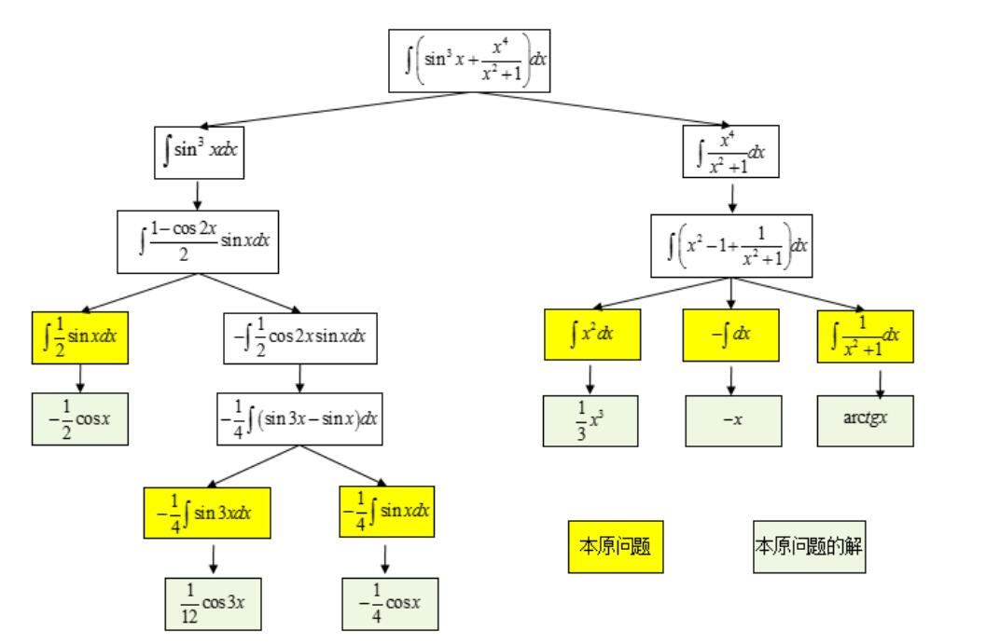
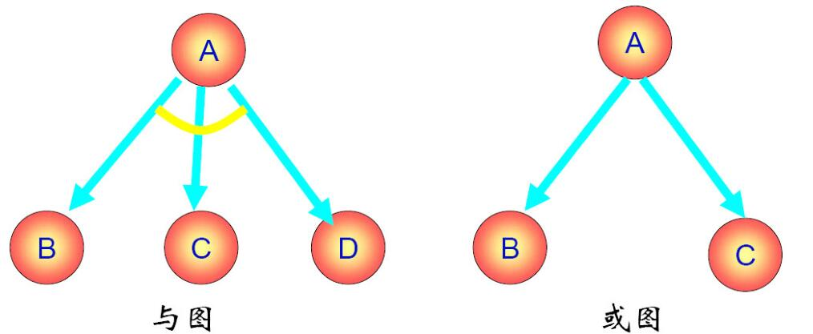
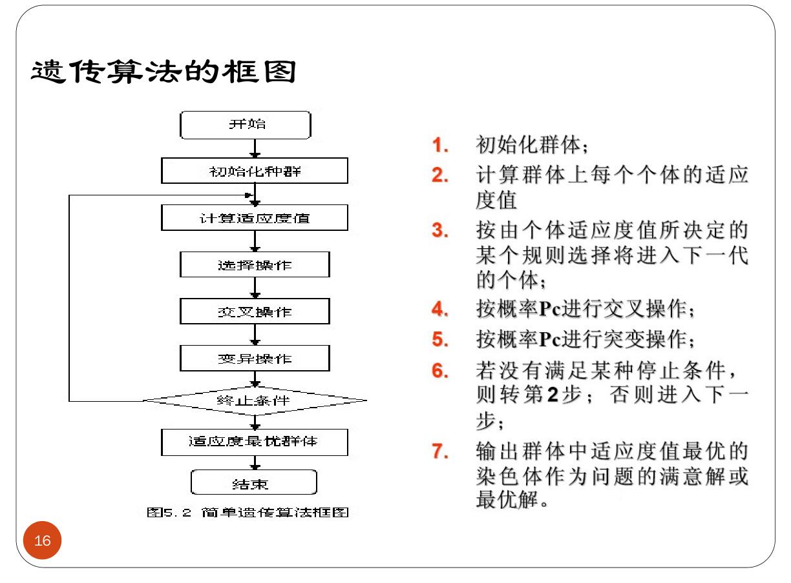

# 一些概念解释

## 弱人工智能与强人工智能

弱人工智能是指不能真正实现推理和解决问题的智能机器，这些机器表面看像是智能的，但是并不真正拥有智能，也不会有自主意识。

强人工智能是指真正能思维的智能机器，并且认为这样的机器是有知觉的和自我意识的，这类机器可分为类人（机器的思考和推理类似人的思维）与非类人（机器产生了和人完全不一样的知觉和意识，使用和人完全不一样的推理方式）两大类。

## 符号处理系统

### 六种功能

1. 输入符号
2. 输出符号
3. 存储符号
4. 复制符号
5. 建立符号结构：在符号系统中形成符号结构
6. 条件性迁移：根据已有符号，继续完成活动的过程

可以把人看作是一个物理符号系统。如果一个物理符号系统具有上述全部6种功能，能够完成这个全过程，那么它就是一个完整的物理符号系统。人具有上述6种功能；现代计算机也具备物理符号系统的这6种功能。

有一个假设：任何一个系统，如果它能表现出智能，那么它就必定能够执行上述6种功能。反之，任何系统如果具有这6种功能，那么它就能够表现出智能；这种智能指的是人类所具有的那种智能。把这个假设称为物理符号系统的假设。

这个假设有很多局限性，许多乐观预言都成了泡影。90年代之后人工智能领域形成了很多新的研究模式

## 人工智能的学派

### 符号主义

又称：逻辑主义、心理学派或计算机学派

原理：物理符号系统（即符号操作系统）假设和有限合理性原理

符号主义认为人的认知基元是符号，认知过程即符号操作过程。认为人是一个物理符号系统，计算机也是一个物理符号系统，因此能够用计算机来模拟人的智能行为。人工智能的核心问题是知识表示、知识推理和知识运用。

### 连接主义

又称：仿生学派或生理学派

原理：神经网络及神经网络间的连接机制与学习算法。

连接主义认为思维基元是神经元，而不是符号处理过程。认为人脑不同于电脑，并提出连接主义的大脑工作模式，用于取代符号操作的电脑工作模式。

### 行为主义

又称：进化主义或控制论学派

原理：控制论及感知—动作型控制系统

行为主义认为智能取决于感知和行动（所以被称为行为主义），提出智能行为的“感知—动作”模式。认为智能不需要知识、不需要表示、不需要推理；人工智能可以象人类智能一样逐步进化(所以称为进化主义)；智能行为只能在现实世界中与周围环境交互作用而表现出来。

## 研究领域

### 自然语言理解

是计算机对人类的书面和口头形式的自然语言信息进行处理加工的技术,涉及语言学,数学和计算机科学等多学科知识领域.其主要任务是建立各种自然语言处理系统,如:文字(语音)自动识别系统,电子词典,机器翻译,自动索引系统等.

### 模式识别

模式识别是指用计算机代替人类或帮助人类感知模式，是对人类感知外界功能的模拟，研究的是计算机模式识别系统，也就是使一个计算机系统具有模拟人类通过感官接受外界信息、识别和理解周围环境的感知能力。

其已在医学图象,指纹识别,天气预报,汽车牌照识别中广泛应用。

### 计算机视觉

机器视觉或计算机视觉是一种用计算机实现(或模拟)人的视觉功能，对客观外界进行感知和理解的技术。它是在图像处理和模式识别技术基础上发展起来的一门新兴的学科分支，其主要目的就是用机器识别客观外界景物，即从外界获得二维图像，抽取其特征(如形状、位置、大小、灰度、颜色、纹理等)构成本征描述，然后与已知物体的描述相匹配，从而辨认出所描述的物体。

### 专家系统

专家系统是一个具有大量专门知识和经验的程序系统，它应用于人工智能技术，根据某个领域中一个或多个人类专家提供的知识和经验进行推理和判断，模拟人类专家的决策过程，以解决那些需要专家决定的复杂问题。

### 机器学习

所谓机器学习，就是要使计算机能模拟人的学习行为，自动地通过学习获取知识和技能，不断改善性能，实现自我完善。机器学习就是计算机自动获取知识，它是知识工程的三个分支（使用知识、知识表示、获取知识）之一 。

### 神经网络

也称神经计算,是指一类计算模型,其工作原理模仿了人类大脑的某些工作机制,其利用大量人工神经元组成一个大网络,来实现大规模并行运算。

# 状态空间知识表示及其搜索技术

## 知识

**知识**是人们在改造客观世界的实践中积累起来的认识和经验。

一般来说，我们把有关信息关联在一起所形成的信息结构称为知识。

**知识表示**就是对知识的一种描述，一种计算机可以
接受的用于描述知识的数据结构。

**知识的要素**，一般而言，人工智能系统的知识包含事实、规则、控制和元知识。

**事实**：事物的分类、属性、事物间关系、科学事实、客观事实等。

**规则**：事物的行动、动作和联系的因果关系知识。

**控制**：是有关问题的求解步骤、规划、求解策略等技巧性知识，告诉怎么做一件事。

**元知识**：怎样使用规则、解释规则、校验规则、解释程序结构等知识。是有关知识的知识，是知识库中的高层知识。

## 知识表示的一般方法

一般有：状态空间法、问题归约法、谓词逻辑法、语义网络、框架表示、剧本表示、过程表示等。

### 状态空间法

问题求解(problem solving)是个大课题，它涉及归约、推断、决策、规划、常识推理、定理证明和相关过程的核心概念。在分析了人工智能研究中运用的问题求解方法之后，就会发现许多问题求解方法是采用试探搜索方法的。也就是说，这些方法是通过在某个可能的解空间内寻找一个解来求解问题的。这种基于解答空间的问题表示和求解方法就是状态空间法，它是以状态和算符(operator)为基础来表示和求解问题的。

**状态**

为描述某类不同事物间的差别而引入的一组最少变量$q_0,q_1,\cdots,q_n$的有序集合

可用矢量来表示：$Q=[q_0,q_1,\cdots,q_n]^T$

其中的每一个元素为集合的分量，称为状态变量。

给定每个分量的一组值就得到一个具体的状态。

**算符**

把问题从一种状态变换为另一种状态的手段。

**问题的状态空间**

是一个表示该问题全部可能状态及其关系的图。

它包含三种说明的集合,即三元状态（S，F，G），S-初始状态集合，F-操作符集合，G-目标状态集合。

**状态图示法**

用有向带权图来表示，图上的节点代表状态，边代表状态转移的路径以及转移的代价。这个路径通常也和算符有关。

## 搜索推理技术

知识表示是问题求解所必须的，从问题表示到问题的解决，有一个求解过程，也就是搜索推理过程。

### 搜索

根据问题的实际情况不断寻找可利用的知识,构造出一条代价较少的推理路线,使问题得到圆满解决的过程称为搜索

要求，找到一条从初始事实到问题的最终答案的一条推理路径、找到的这条路在时间和空间复杂度上最优。

在状态空间中搜索时，我们通常会用：图搜索策略、盲目搜索、启发式搜索等方法。

### 图搜索策略

这是一种在图中寻找路径的方法。

图中每个节点对应一个状态，每条连线对应一个操作符。

搜索方法有很多，例如深度优先搜索等，可以看算法竞赛整理。

在这里我们通常需要

1. 必须记住下一步可以走哪些点。OPEN表，记录还没有扩展的节点，用于存放刚生成的节点。
2. 必须记住哪些点走过了。CLOSED表，记录已经扩展过的节点，用于存放已经扩展或将要扩展的节点
3. 必须记住从目标返回的路径

其基本思想是，先把问题的初始状态作为当前扩展节点对其进行扩展，生成一组子节点，然后检查问题的目标状态是否出现在这些子节点中。

若出现，则找到问题的解。

若没有出现，则按照某种策略继续扩展。

重复上述过程，直到找到解或者没有可以操作的节点为止。

总结如下

其中第七步的排序可以是任意的即盲目的（属于盲目搜索），也可以用之后讨论的各种启发性思想或其他准则为依据（属于启发式搜索）。

### 盲目搜索

这是没有启发信息的一种搜索形式，搜索过程中获得的信息不会用来改进策略。

一般只适用于求解比较简单的问题。

不需要重排OPEN表。

种类主要分为：宽度优先、深度优先、等代价搜索。

DFS和BFS不再介绍，介绍一个有界深度优先搜索。

**有界深度优先搜索**

对深度优先搜索引入搜索深度的界限（设为$d_m$），当搜索深度达到了深度界限，而仍未出现目标节点时，就换一个分支进行搜索。

**等代价搜索**

它宽度优先搜索的一种推广。不是沿着等长度路径断层进行扩展，而是沿着等代价路径断层进行扩展。

**代价树的广度优先搜索**

每次从OPEN表中选择节点往CLOSED表传送时，总是选择其中代价最小的节点。

换句话说就是用二叉堆去维护OPEN表的节点。

### 启发式搜索

特点是重排OPEN表,选择最有希望的节点加以扩展。种类有：有序搜索、$A^*$算法等等。

**启发式搜索的估价函数**

估价函数(evaluation function)，是估算节点希望程度的量度，用$f(n)$表示节点$n$的估价函数值。

建立估价函数的一般方法是：提出任意节点与目标集之间的距离量度或差别量度

**有序搜索**

有序搜索，也称最好优先搜索，选择OPEN表上具有最小$f$值的节点作为下一个要扩展的节点。

**$A^*$算法**

它是有序搜索的一种，其特点在于对估价函数的定义上。

用$k(n_i,n_j)$表示任意两个节点$n_i$和$n_j$之间最小代价路径的实际代价。

如果两个节点没有通路，则$k$没有定义。

对于一个具体的目标节点$t_i$，用$h^*(n)$表示整个目标节点集合$\{t_i\}$上所有$k(n,t_i)$中最小的一个，此时$h^*(n)$就是从$n$到目标节点最小代价路径的代价，从$n$到目标节点的代价为$h^*(n)$的任一路径就是一条最佳路径。

估价函数设计如下(S是初始状态)

$$
g^*(n) = k(S,n)
$$

$$
f^*(n) = g^*(n)+h^*(n)
$$

$f^*(n)$就是从$S$开始约束通过节点$n$的一条最佳路径的代价。

希望估价函数$f$是$f^*$的一个估计，$g$是$g^*$的一个估计，$h$是$h^*$的一个估计，$h$叫做启发函数

$$
f(n) = g(n)+h(n)
$$

在图搜索中，如果OPEN表的重排是根据$f(n) = g(n)+h(n)$来进行的，那么称为$A$算法。

在$A$算法中,如果对所有的$n$存在$h(n)\leq h^*(n)$ ,则称$h(n)$为$h^*(n)$的下界,它表示某种偏于保守的估计;

采用$h^*(n)$的下界$h(n)$为启发函数的$A$算法，称为$A^*$算法。

# 问题归约知识表示及其搜索技术

已知问题的描述，通过一系列变换把此问题最终变为一个子问题集合；这些子问题的解可以直接得到，从而解决了初始问题。

该方法也就是从目标(要解决的问题)出发逆向推理，建立子问题以及子问题的子问题，直至最后把初始问题归约为一个平凡的本原问题集合。这就是问题归约的实质。

问题归约法的组成部分：

1. 一个初始问题描述
2. 一套把问题变为子问题的操作符
3. 一套本原问题描述

举个例子

## 与或图表示

**或节点**：只要解决某个问题就可以解决其父节点的问题

**与节点**：只有解决所有子问题才可以解决其父节点的问题

**终叶节点**：对应本原问题的节点

**可解节点**：如下定义

1. 终叶节点是可解节点
2. 如果某个非终叶节点含有**或**后继节点，那么只有当其后继节点至少有一个是可解的时，此非终叶节点才是可解的。
3. 如果某个非终叶节点含有**与**后继节点，那么只要当其后继节点全部为可解时，此非终叶节点才是可解的

**不可解节点**：如下定义

1. 没有后裔的非终叶节点为不可解节点
2. 如果某个非终叶节点含有**或**后继节点，那么只有当其全部后裔为不可解时，此非终叶节点才是不可解的。
3. 如果某个非终叶节点含有**与**后继节点，那么只要当其后裔至少有一个为不可解时，此非终叶节点才是不可解的。

## 与或图搜索

整体与之前提到的图搜索基础没有差别，只是要去记录节点的可解性。如果最终初始节点可解，原问题就有解，否则就无解。

## Max-Min搜索

- 目的是为博弈的双方中的一方寻找一个最优行动方案
- 要寻找这个最优方案，就要通过计算当前所有可能的方案来进行比较；
- 方案的比较是根据问题的特征来定义一个估价函数，用来估算当前博弈树端节点的得分；
- 当计算出端节点的估值后，再推算出父节点的得分（即计算倒推值）；
- - 对或节点，选其子节点中一个最大得分作为父节点的得分
- - 对与节点，选其子节点中一个最小得分作为父节点的得分
- 如果一个行动方案能获得较大的倒推值，则它就是当前最好的行动方案。

假设Max是机器人下棋，Min是人类对手下棋，搜索的步骤是

1. 以$c(o)$为根，生成$k$-步博弈树；
2. 评估博弈树叶节点对应的博弈状态(棋局)；
3. 进行极大极小运算 (Max-Min 运算)；
4. 等待 Min 行棋，产生新的 c(o)，返回 step1.

其实和人类思考差不多，往下多想$k$步可能的局面，选择自己最优，对方最差的局面。但是机器暴力地枚举了所有可能。

## $\alpha-\beta$剪枝

之前说的暴力算法，先生成一棵博弈树，然后再计算其倒推值，效率非常低。

而$\alpha-\beta$剪枝技术的基本思想是，边生成博弈树边计算评估各节点的倒推值并且根据评估出的倒推值范围，及时停止扩展那些已无必要再扩展的子节点，即相当于剪去了博弈树上的一些分枝，从而节约了机器开销，提高了搜索效率。

# 谓词逻辑表示与推理技术

谓词逻辑的概念和离散数学中讲授的一样，不再重复。具体可见<u>**[离散数学整理](../离散数学整理)**</u>

## 谓词逻辑法

谓词逻辑法采用谓词合式公式和一阶谓词演算把要解决的问题变为一个有待证明的问题,然后采用消解原理和消解反演来证明一个新语句是从已知的正确语句导出的,从而证明新语句也是正确的.

## 利用谓词公式进行知识表示的步骤

1. 定义谓词及个体，确定其含义
2. 根据要表达的事物或概念,为每个谓词中的变元赋值
3. 根据表达的知识的含义,用适当的连接符号将各个谓词连接起来,形成谓词公式。

## 置换与合一

### 置换

介绍一下在离散数学中不是很详细的部分。

一个表达式的置换就是在该表达式中用置换项置换变量。

置换是形如

$$
\{t_1/x_1,t_2/x_2,\cdots,t_n/x_n\}
$$

的有限集合。其中，$t_i$是不同于$x_i$的项（常量、变量、函数）；$x_1,x_2,\cdots,x_n$是互不相同的变量；$t_i/x_i$表示用$t_i$代换$x_i$

令置换$s=\{t_1/x_1,t_2/x_2,\cdots,t_n/x_n\}$，而$E$是一个谓词公式，那么$s$作用于$E$，就是将$E$中出现的$x_i$都以$t_i$代入。结果以$Es$表示，并称为$E$的一个例

而合成，也称为置换乘法，是置换之间的一种运算，若

$$
\theta = \{t_1/x_1,\cdots,t_n/x_n\}
$$

$$
\lambda = \{u_1/y_1,\cdots,u_m/y_m\}
$$

置换的乘积$\theta\cdot\lambda$是个新的置换，作用于$E$相当于先$\theta$后$\lambda$对$E$的作用。

先作置换

$$
\{t_1\cdot\lambda/x_1,\cdots,t_n\cdot\lambda/x_n,u_1/y_1,\cdots,u_m/y_m\}
$$

若$y_i\in\{x_1,\cdots,x_n\}$时，先从中删除$u_i/y_i$；$t_i\cdot\lambda=x_i$时，再从中删除$t_i\cdot\lambda/x_i$

所得的置换称为$\theta$与$\lambda$的乘积，记作$\theta\cdot\lambda$

置换的乘法是有结合律的，但没有交换率。

### 合一

合一是寻找项对变量的置换，以使两表达式一致。

如果一个置换$s$作用于表达式集$\{E_i\}$的每个元素，则我们用$\{E_i\}s$来表示置换例的集。

称表达式集$\{E_i\}$是可合一的。如果存在一个置换$s$，使得：

$$
E_1s=E_2s=E_3s=\cdots
$$

那么我们称此$s$为$\{E_i\}$的合一者，因为$s$的作用是使
集合$\{E_i\}$成为单一形式。

通过置换最少的变量以使表达式一致，这个置换就叫最一般合一者,记为mgu。

## 消解原理

消解原理又称为归结原理。该原理是Robinson提出的一种基于逻辑的、采用反证法的推理方法。

消解法的基本原理是采用反证法或者称为反演推理方法，将待证明的表达式（定理）转换成为逻辑公式（谓词公式），然后再进行归结，归结能够顺利完成，则证明原公式(定理）是正确性的。

## 子句集的求解

先给出一些定义

**文字**

一个原子公式和原子公式的否定都叫做文字

**子句**

由文字的析取组成的公式

**空子句**

不包含任何文字的子句

**子句集**

由子句构成的集合

任一谓词演算公式可以化成一个子句集。由九个步骤组成

1. 消去蕴涵符号（使用蕴含律）
2. 减少否定符号的辖域，应用德摩根定律等使得每个否定符号都只结合一个谓词符号
3. 对变量标准化。在任一量词辖域内，受该量词约束的变量为一哑元(虚构变量)，它可以在该辖域内处处统一地被另一个没有出现过的任意变量所代替，而不改变公式的真值。
4. 消去存在量词

    1. 如果要消去的存在量词在某些全称量词的辖域内，例如$(\forall y)[(\exists x)P(x,y)]$中，中，存在量词是在全称量词的辖域内，我们允许所存在的$x$可能依赖于$y$值。令这种依赖关系明显地由函数$g(y)$所定义，它把每个$y$值映射到存在的那个$x$。这种函数叫做Skolem函数。如果用Skolem函数代替存在的$x$,我们就可以消去全部存在量词，并写成：$(\forall y)P(g(y),y)$
    2. 如果不再全称量词的辖域内，直接用一个新的常量符号来替代即可。
5. 化为前束形。把所有全称量词移到公式的左边，并使每个量词的辖域包括这个量词后面公式的整个部分。所得公式称为前束形。前束形公式由前缀和母式组成，前缀由全称量词串组成，母式由没有量词的公式组成。
6. 把母式化为合取范式
7. 消去全称量词
8. 消去连词符号$\wedge$。用$\{(A\vee B),(A\vee C)\}$替代$(A\vee B)\wedge(A\vee C)$
9. 更换变量名称，把每个子句中重复变量的名称换成不同的。

## 消解反演

一般过程

1. 建立子句集$S$
2. 从子句集$S$出发,仅对$S$的子句间使用归结推理规则（也即反证法）
3. 如果得出空子句, 则结束;否则转下一步
4. 将所得归结式仍放入$S$中
5. 对新的子句集使用归结推理规则
6. 转3.

空子句不含有文字,它不能被任何解释满足,所以空子句是永假的,不可满足的。

归结过程出现空子句,说明出现互补文字,说明S中有矛盾,因此S是不可满足的。

## 语义网络法

语义网络是知识的一种结构化图解表示，它由节点和弧线组成。节点用于表示实体、概念和情况等，节点之间的弧线用于表示节点间的关系。

## 框架表示

框架是一种结构化表示法，通常采用语义网络中的节点-槽-值表示结构。

# 规则演绎系统

基于规则的演绎推理是一种直接的推理方法，它不像消解反演把知识转化为子句集，而是把有关问题的知识和信息划分为规则和事实两种类型。

规则由包含蕴含形式的表达式表示，事实由无蕴含形式的表达式表示，并画出相应的与或图，然后通过规则进行演绎推理。

规则演绎系统可以分为规则正向演绎推理、规则逆向演绎系统和规则双向演绎系统。

基于规则的问题求解系统运用下述规则来建立：

$$
If\to Then
$$

其中，If部分可能由几个if组成，而Then部分可能由一个或一个以上的then组成。

在这种系统中，通常称每个if部分为前项，称每个then部分为后项。

## 规则正向演绎系统

规则正向演绎系统是从事实到目标进行操作的，即从状况条件到动作进行推理的，也就是从if到then的方向进行推理的。

过程

1. 事实表达式的与或形变换。把事实表示为非蕴涵形式的与或形，作为系统的总数据库。具体变换步骤与前述化为子句形类似。
2. 事实表达式的与或图表示，即用与或图来表达事实表达式。
3. 与或图的F规则变换

> 这些规则是建立在某个问题辖域中普通陈述性知识的蕴涵公式基础上的。我们把允许用作规则的公式类型限制为下列形式：

$$
L\Rightarrow W
$$

> 式中：$L$是单文字；$W$为与或形的公式。

4. 作为终止条件的目标公式

> 基于规则的正向演绎推理的基本原理是：应用F规则作
用于表示事实的与或图，改变与或图的结构，从而产生
新的事实，直到推出目标公式，则推理成功结束。

> 其推理过程为

> 1. 首先用与或图把已知事实表示出来。
> 2. 用F规则的左部和与或图的叶节点进行匹配，并将匹配成功的F规则加入到与或图中，即利用F规则转换与或图。
> 3. 重复第（2）步，直到产生一个含有以目标节点作为终止节点的解图为止。

## 规则逆向演绎系统

规则逆向演绎系统是从then向if进行推理的，即从目标或动作向事实或状况条件进行推理的。

逆向演绎系统能够处理任意形式的目标表达式。采用和变换事实表达式类似的过程，把目标公式化成与或形。

**与或图的B规则变换**

这个B规则是建立在确定的蕴涵式基础上的，正如正向系统的F规则一样。不过，我们现在把这些B规则限制为: $W\Rightarrow L$形式的表达式。

其中，W为任一与或形公式，L为文字，而且蕴涵式中任何变量的量词辖域为整个蕴涵式。其次，把B规则限制为这种形式的蕴涵式还可以简化匹配，使之不会引起重大的实际困难。

此外，可以把像$W\Rightarrow(L1\wedge L2)$这样的蕴涵式化为两个规则$W\Rightarrow L1$和$W\Rightarrow L2$。

**作为终止条件的事实节点的一致解图**

逆向系统中的事实表达式均限制为文字合取形，它可以表示为一个文字集。当一个事实文字和标在该图文字节点上的文字相匹配时，就可把相应的后裔事实节点添加到该与或图中去。这个事实节点通过标有mgu的匹配弧与匹配的子目标文字节点连接起来。同一个事实文字可以多次重复使用(每次用不同变量)，以便建立多重事实节点。逆向系统成功的终止条件是与或图包含有某个终止在事实节点上的一致解图。

## 规则双向演绎系统

正向和逆向组合系统是建立在两个系统相结合的基础上的。此组合系统的总数据库由表示目标和表示事实的两个与或图结构组成，并分别用F规则和B规则来修正。

双向演绎系统的主要复杂之处在于其终止条件，终止涉及两个图结构之间的适当交接处。这些结构可由标有合一文字的节点上的匹配棱线来连接。

## 产生式系统

用来描述若干个不同的以一个基本概念为基础的系统。这个基本概念就是产生式规则或产生式条件和操作对的概念。

在产生式系统中，论域的知识分为两部分：用事实表示静态知识，如事物、事件和它们之间的关系；用产生式规则表示推理过程和行为。由于这类系统的知识库主要用于存储规则，因此又把此类系统称为基于规则的系统。

# 不确定性推理

## 模糊计算和模糊推理

与二值逻辑这样的非真即假的概念不同，模糊概念中，从属于该概念到不属于该概念之间无明显分界线。

比如快慢、大小、软硬、强弱等。

其基本思想是，用属于程度替代属于或不属于。

### 经典集合

设$A$是论域$U$上的一个集合，对任意$u\in U$，令

$$
C_A(u) = \left\{\begin{matrix}
1,u\in A\\
0,u\notin A
\end{matrix}\right.
$$

则称$C_A(u)$为集合$A$的特征函数。

### 模糊理论基本概念

**模糊集合**

论域$U$中的模糊集$F$用一个在区间$[0,1]$的取值的隶属函数$\mu_F$来表示，即：

$$
\mu_F:U\to[0,1]
$$

$\mu_F$称为$F$的隶属函数，$\mu_F(u)$称为$u$对$A$的隶属度。

直观上来说，就是将一些元素属于某个集合的程度映射到连续的$[0,1]$上。

### 模糊集的表示方法

若$U$为离散域且为有限集合时，模糊集合可以表示为：

**扎德表示法**

$$
F = \sum^n_{i=1}\mu_F(u_i)/u_i
$$

其中“$/$”符号表示的意思是，分母是论域中的元素，分子是该元素对模糊子集$F$的隶属度。$\sum$也不是表示相加，只是一个记号。

比如我们写出来的可能是$A = 1/u_1+0.7/u_2+0/u_3+0.5/u_4$这样的形式。如果隶属度为$0$可以省略不写。

**序偶表示法**

$$
F=\{(u_1,\mu(u_1)),(u_2,\mu(u_2)),\cdots,(u_n,\mu(u_n))\}
$$

**向量表示法**

$$
F = \{\mu(u_1),\mu(u_2),\cdots,\mu(u_n)\}
$$

无论论域是有限的还是无限的，连续的还是离散的，扎德都用如下记号作为模糊子集的一般表示形式：

$$
F = \int_U\frac{\mu_F}{u}
$$

这里的积分号不是数学中的积分，也不是求和，只是表示论域中各元素与其隶属度对应关系的总括，是一个记号。

### 集合运算

**定义1**

设$A,B$是论域$U$的模糊集，即$A,B\in F(U)$，若对于任一$u\in U$都有$\mu_B(u)\leq\mu_A(A)$，则称$B$包含于$A$，或者说$B$是$A$的一个子集，记作$B\subseteq A$。若对于任一$u\in U$都有$\mu_B(u)=\mu_A(A)$，则称$B$等于$A$，记作$B=A$

**定义2**

并运算（$A\bigcup B$）的隶属度函数$\mu_{A\bigcup B}$对所有的$u\in U$被逐点定义为取大运算，即

$$
\mu_{A\bigcup B} = \mu_A(u)\vee\mu_B(u)
$$

式中，$\vee$符号取极大值运算。

**定义3**

交运算（$A\bigcap B$）的隶属度函数$\mu_{A\bigcap B}$对所有的$u\in U$被逐点定义为取小运算，即

$$
\mu_{A\bigcap B} = \mu_A(u)\wedge\mu_B(u)
$$

式中，$\wedge$符号取极小值运算。

**定义4**

补，隶属度函数$\mu_{\bar A}$，对所有的$u\in U$，被逐点定义为$\mu_{\bar A}(u) = 1-\mu_{A}(u)$

模糊集合中有时会用$\neg A$表示$A$的补集。

**定理**

集合运算的定理和经典的集合没有区别，例如结合、分配律，德摩根律等等。

### 模糊集的截集

**定义1**

设$A\in F(u),\lambda\in[0,1]$，则

1. $A_\lambda=\{u|u\in U,\mu_A(u)\geq\lambda\}$，称$A_\lambda$为$A$的一个$\lambda$截集，称$\lambda$为阈值（置信水平）
2. $A_\lambda=\{u|u\in U,\mu_A(u)>\lambda\}$，称$A_\lambda$为$A$的一个$\lambda$强截集
3. $SuppA=\{u|u\in U,\mu_A(u)>0\}$为$A$的支集
4. $KerA=\{u|u\in U,\mu_A(u)=1\}$为$A$的核

当$A$的核不为空，则称$A$为正规$F$集。

### 模糊集合的模糊度

模糊度是模糊集模糊程度的一种度量

**定义**

设$A\in F(U)$，$d$是定义在$F(U)$上的一个实函数，如果它满足以下条件：

1. 对任意$A\in F(U)$，有$d(A)\in[0,1]$
2. 当且仅当$A$是一个普通集合时，$d(A) = 0$
3. 若$A$的隶属函数$\mu_A(U)\equiv0.5$，则$d(A)=1$
4. 若$A,B\in F(U)$，且对任意$u\in U$，满足

$$
\mu_B(u)\leq\mu_A(u)\leq0.5或者\mu_B(u)\geq\mu_A(u)\geq0.5
$$

则有$d(B)\leq d(A)$

5. 对任意$A\in F(U)$，有$d(A)=d(\neg A)$

则称$d$为定义在$F(U)$上的一个模糊度，$d(A)$称为$A$的模糊度。

直观地理解

- 模糊度是$[0,1]$上的一个数
- 普通集合的模糊度是$0$，也就代表其不模糊
- 越靠近$0.5$就越模糊，$\mu_A(u)=0.5$时最模糊
- 模糊集$A$与其补集$\neg A$具有相同的模糊度

**模糊度的计算方法**

*Haming（海明）模糊度*

$$
d_1(A) = \frac{2}{n}\sum^n_{i=1}|\mu_A(u_i)-\mu_{A_{0.5}}(u_i)|
$$

其中，$\mu_{A_{0.5}}(u_i)$是$A$的$\lambda=0.5$截集的隶属函数。由于$A_{0.5}$是一个普通集合，所以$\mu_{A_{0.5}}(u_i)$实际上是特征函数

*Euclid（欧几里得）模糊度*

$$
d_2(A) = \frac{2}{\sqrt n }(\sum^n_{i=1}|\mu_A(u_i)-\mu_{A_{0.5}}(u_i)|^2)^{1/2}
$$

*Minkowski（明可夫斯基）模糊度*

$$
d_p(A) = \frac{2}{n^{1/p}}(\sum^n_{i=1}|\mu_A(u_i)-\mu_{A_{0.5}}(u_i)|^p)^{1/p}
$$

*Shannon（香农）模糊度*

$$
d(A) = \frac{1}{n\ln 2}\sum^n_{i=1}S(\mu_A(u_i))
$$

其中$S(x)$是定义在$[0,1]$上的香农函数，即

$$
S(x) = \left\{\begin{matrix}
-x\ln x-(1-x)ln(1-x),\quad &x\in(0,1) \\
0,\quad &x=1\ or\ x = 0
\end{matrix}\right.
$$

### 模糊数

模糊的数量，例如：500人左右，大约0.6等

**定义**

如果实数域$R$上的模糊集$A$的隶属函数$\mu_A(u)$在$R$上连续且具有如下性质

1. $A$是凸模糊集，即对任意$\lambda\in[0,1]$，$A_\lambda$是闭区间
2. $A$是正规模糊集，即存在$u\in R$，使得$\mu_A(u)=1$

则称$A$为一个模糊数

直观上模糊数的隶属函数图形是单峰的，且在峰顶使隶属度达到$1$

### 模糊关系

在普通集合上定义的关系已经在离散数学中介绍过了。这种关系是一种确定性的关系，要么有，要么没有。

而模糊关系就不是非常明确的。

**定义**

设论域$U,V$，则$U\times V$（笛卡尔积）的一个子集$R$就是从$U$到$V$的模糊关系，记作

$$
U\overset{R}{\rightarrow} V 
$$

这里的模糊关系$R$是属于模糊二元关系。

其隶属函数为映射$\mu_R:U\times V\to[0,1]$

隶属度$\mu_R(u_0,v_0)$，表示$u_0$与$v_0$具有关系$R$的程度。

对于有限论域$U = \{u_1,u_2,\cdots,u_m\},V = \{v_1,v_2,\cdots,v_n\}$，则$U$对$V$的模糊关系的隶属函数可以用$m\times n $阶模糊矩阵$R$来表示，即

$$
R = (r_{ij})_{m\times n}
$$

**模糊集的笛卡尔乘积**

模糊集$A,B$的笛卡尔乘积为

$$
A\times B = \int_{U\times V}\min(\mu_A(u),\mu_B(v))/(u,v)
$$

**模糊关系的合成**

设$R_1$与$R_2$分别是$u\times v$及$v\times w$上的两个模糊关系，则$R_1$与$R_2$的合成是指从$u$到$w$的一个模糊关系，记为$R_1\circ R_2$，其隶属度为

$$
\mu_{R_1\circ R_2}(u,w) = \{\bigvee^{v}\mu_{R_1}(u,v)\wedge\mu_{R_2}(v,w) \}
$$

### 模糊推理

**模糊命题**

含有模糊概念、模糊数据的语句称为模糊命题。

它的一般表示形式为

$$
x\quad is \quad A
$$

或者

$$
x\quad is \quad A(CF)
$$

其中$A$是模糊概念或模糊数，用相应的模糊集及隶属函数刻画；$x$是论域上的变量，用以代表所论述对象的属性； $CF$是该模糊命题的可信度，它既可以是一个确定的数，也可以是一个模糊数或者模糊语言值。

模糊语言值是指表示大小、长短、多少等程度的一些词汇。如：极大、很大、相当大、比较大。模糊语言值同样可用模糊集描述。

## 模糊的知识表示

1. 模糊产生式规则的一般形式是

$$
IF\quad E\quad THEN\quad H\quad (CF,\lambda)
$$

其中$E$是用模糊命题表示的模糊条件；$H$是用模糊命题表示的模糊结论；$CF$是知识的可信度因子，它既可以是一个确定的数，也可以是一个模糊数或模糊语言值。$\lambda$是匹配度的阈值，用以指出知识被运用的条件。

2. 推理中所用的证据也用模糊命题表示，一般形式为

$$
x\quad is \quad A'
$$

或者

$$
x\quad is \quad A'(CF)
$$

3. 模糊推理要解决的问题：证据与知识的条件是否匹配；如果匹配，如何利用知识及证据推出结论。

## 模糊匹配与冲突消解

### 贴近度

设$A,B$分别是论域$U=\{u_1,u_2,\cdots,u_n\}$上的两个模糊集，则它们的贴近度定义为：

$$
(A,B) = [A\cdot B+(1-A\odot B)]/2
$$

其中

$$
A\cdot B = \bigvee_U(\mu_A(u_i)\wedge\mu_B(u_i))
$$

是内积

$$
A\odot B = \bigwedge_U(\mu_A(u_i)\vee\mu_B(u_i))
$$

是外积。

### 语义距离

**海明距离**

$$
d(A,B) = \frac{1}{n}\sum^n_{i=1}|\mu_A(u_i)-\mu_B(u_i)|
$$

$$
d(A,B) = \frac{1}{b-a}\int^b_a|\mu_A(u)-\mu_B(u)|du
$$

**欧几里得距离**

$$
d(A,B) = \frac{1}{\sqrt n}\sqrt{\sum^n_{i=1}(\mu_A(u_i)-\mu_B(u_i))^2}
$$

**明可夫斯基距离**

$$
d(A,B) = [\frac{1}{n}\sum^n_{i=1}|\mu_A(u_i)-\mu_{A_{0.5}}(u_i)|^p]^{1/p},\quad p\geq1
$$

**切比雪夫距离**

$$
d(A,B) = \underset{1\leq i\leq n}{\max}|\mu_A(u_i)-\mu_B(u_i)|
$$

匹配度为$1-d(A,B)$

### 相似度

1. 最大最小法

$$
r(A,B) = \frac{\sum\min\{\mu_A(u_i),\mu_B(u_i)\}}{\sum\max\{\mu_A(u_i),\mu_B(u_i)\}}
$$

2. 算术平均法

$$
r(A,B) = \frac{\sum\min\{\mu_A(u_i),\mu_B(u_i)\}}{\frac{1}{2}\sum(\mu_A(u_i)+\mu_B(u_i))}
$$

3. 几何平均最小法

$$
r(A,B) = \frac{\sum\min\{\mu_A(u_i),\mu_B(u_i)\}}{\sum\sqrt {(\mu_A(u_i)\times\mu_B(u_i))}}
$$

4. 相关系数法

$$
r(A,B) = \frac{\sum(\mu_A(u_i)-\bar\mu_A)\times(\mu_B(u_i)-\bar\mu_B)}{\sqrt{[\sum(\mu_A(u_i)-\bar\mu_A)^2]\times[\sum(\mu_B(u_i)-\bar\mu_B)^2]}}
$$

$$
\bar\mu_A = \frac{1}{n}\sum\mu_A(u_i),\quad\bar\mu_B = \frac{1}{n}\sum\mu_B(u_i)
$$

5. 指数法

$$
r(A,B) = \exp\bigg(-\sum|\mu_A(u_i)-\mu_B(u_i)|\bigg)
$$

### 复合条件的模糊匹配

1. 分别计算出每一个子条件与其证据的匹配度
2. 求出整个前提条件与证据的总匹配度。目前常用的方法有“取极小”和“相乘”等。
3. 检查总匹配度是否满足阈值条件，如果满足就可以匹配，否则为不可匹配。

### 冲突消解

1. 按匹配度大小排序
2. 按加权平均值排序
3. 按广义顺序关系排序

## 模糊推理的基本形式

1. 模糊假言推理

知识：$IF\quad x\ is\ A\quad THEN\quad y\ is\ B$

证据：$x\ is\ A'$

结论：$y\ is\ B'$

2. 模糊拒取式推理

知识：$IF\quad x\ is\ A\quad THEN\quad y\ is\ B$

证据：$y\ is\ B'$

结论：$x\ is\ A'$

知识中只含有简单条件，且不带可信度因子的模糊推理称为简单模糊推理。

**合成推理知识**

对于知识$IF\quad x\ is\ A\quad THEN\quad y\ is\ B$

首先构造出$A,B$之间的模糊关系$R$，

- 如果已知证据是$x\ is\ A'$，且$A,A'$之间可以进行模糊匹配，则$B' = A'\circ R$

- 如果已知证据是$y\ is\ B'$，且$B,B'$之间可以进行模糊匹配，则$A' = R\circ B'$

## 构造模糊关系R的方法

### 扎德方法

扎德提出了两种方法：一种称为条件命题的极大极小规则。另一种称为条件命题的算术规则，由它们获得的模糊关系分别记为$R_m$和$R_a$

设$A\in F(U), B\in F(V)$，其分别表示为

$$
A = \int_U \mu_A(u)/u, B = \int_V \mu_B(u)/u
$$

则

$$
R_m = (A\times B)\cup(\neg A\times V) = \int_{U\times V}(\mu_A(u)\wedge\mu_B(v))\vee(1-\mu_A(u))/(u,v)
$$

$$
R_m = (\neg A\times V)\oplus(U\times B) = \int_{U\times V}1\wedge(1-\mu_A(u)+\mu_B(v))/(u,v)
$$

其中$\times$是笛卡尔积；有界和$x\oplus y=\min\{1,x+y\}$

### Mamdani方法

对于知识$IF\quad x\ is\ A\quad THEN\quad y\ is\ B$

$$
R_C = A\times B = \int_{U\times V}\mu_A(u)\wedge\mu_B(v)/(u,v)
$$

### Mizumoto方法

米祖莫托等人根据多值逻辑中计算$T(AB)$的定义，提出了一组构造模糊关系的方法，分别记为$R_s,R_g,R_{sg},R_{gs},R_{gg},R_{ss}$等等。

$$
R_s = A\times V \underset{s}{\Rightarrow} U\times B = \int_{U\times V}[\mu_A(u)\underset{s}{\to}\mu_B(v)]/(u,v)
$$

其中

$$
\mu_A(u)\underset{s}{\to}\mu_B(v) = \left\{\begin{matrix}
1,\mu_A(u)\leq\mu_B(v) \\
0,\mu_A(u)>\mu_B(v)
\end{matrix}\right.
$$

$$
R_s = A\times V \underset{g}{\Rightarrow} U\times B = \int_{U\times V}[\mu_A(u)\underset{g}{\to}\mu_B(v)]/(u,v)
$$

其中

$$
\mu_A(u)\underset{g}{\to}\mu_B(v) = \left\{\begin{matrix}
1,&\mu_A(u)\leq\mu_B(v) \\
\mu_B(v),&\mu_A(u)>\mu_B(v)
\end{matrix}\right.
$$

## 模糊判决方法

在推理得到的模糊集合中取一个相对最能代表这个模糊集合的单值的过程就称作解模糊（去模糊）或模糊判决(Defuzzification)。

方法有：重心法、最大隶属度方法、加权平均法、隶属度限幅元素平均法等等。

### 重心法

所谓重心法就是取模糊隶属函数曲线与横坐标轴围成面积的重心作为代表点。理论上应该计算输出范围内一系列连续点的重心，即

$$
u = \frac{\int_x x\mu_N(x)dx}{\int_x \mu_N(x)dx}
$$

### 最大隶属度法

这种方法最简单，只要在推理结论的模糊集合中取隶属度最大的那个元素作为输出量即可。不过，要求这种情况下的隶属函数曲线一定是单峰曲线。如果该曲线是梯形平顶，那么具有最大隶属度的元素就可能不只一个，这时就要对所有取最大隶属度的元素求其平均值。

### 系数加权平均法

$$
u = \sum k_i\cdot x_i/\sum k_i
$$

其中系数$k_i$的选择要根据实际情况而定。

### 隶属度限幅元素平均法

用所确定的隶属度值 a对隶属度函数曲线进行切割，再对切割后大于等于该隶属度的所有元素进行平均，用这个平均值作为输出执行量，这种方法就称为隶属度限幅元素平均法。

## 不确定性推理的基本概念

不确定性推理是建立在非经典逻辑基础上的一种推理，它是对不确定性知识的运用与处理。

具体地说，所谓不确定性推理就是从不确定性的初始证据（即事实）出发，通过运用不确定性的知识，最终推出具有一定程度不确定性的结论。

## 不确定性推理中的基本问题

1. 不确定性的表示与度量

不确定性一般分为两类，一类是知识的不确定性，一类是证据的不确定性。

知识不确定性的表示：目前在专家系统中知识的不确定性一般是由领域专家给出的，通常用一个数值表示，它表示相应知识的不确定性程度，称为知识的静态强度。

证据不确定性的表示：证据不确定性的表示方法与知识不确定性的表示方法一致，通常也用一个数值表示，代表相应证据的不确定性程度，称之为动态强度。

2. 不确定性匹配算法及阈值的选择

推理是不断运用知识的过程,为了找到所需的知
识,需要在这一过程中用知识的前提与已知证据进
行匹配.只有匹配成功的知识才有可能被应用.

3. 组合证据不确定性的计算方法

即已知证据$E_1$和$E_2$的不确定性度量，求证据$E_1$和$E_2$的析取和合取的不确定性，常用的方法有：

- 最大最小法

$$
T(E_1\ AND\ E_2) = \min\{T(E_1),T(E_2)\}
$$

$$
T(E_1\ OR\ E_2) = \max\{T(E_1),T(E_2)\}
$$

- 概率法

$$
T(E_1\ AND\ E_2) = T(E_1)\times T(E_2)
$$

$$
T(E_1\ OR\ E_2) = T(E_1)+T(E_2) - T(E_1)\times T(E_2)
$$

- 有界法

$$
T(E_1\ AND\ E_2) = \max\{0,T(E_1)+T(E_2)-1\}
$$

$$
T(E_1\ OR\ E_2) = \min\{1,T(E_1)+T(E_2)\}
$$

其中，$T(E)$表示证据$E$为真的程度（动态强度），如可信度、概率等。

4. 不确定性的传递算法

- 在每一步推理中，如何把证据及知识的不确定性传递给结论
- 在多步推理中，如何把初始证据的不确定性传递给最终结论

5. 结论不确定性的合成

用不同知识进行推理得到了相同结论，但所得结论的
不确定性却不同。此时，需要用合适的算法对结论的
不确定性进行合成。

## 不确定性推理方法的分类

不确定性推理方法主要可分为模型法与控制法。

模型法：在推理一级对确定性推理进行扩展，引入证据的不确定性及知识的不确定性。

模型方法又分为数值方法和非数值方法两类。数值方法对不确定性进行定量的描述，按其所依据的理论又可分为基于概率的方法和基于模糊理论的方法。

本节主要针对模型方法中相关的典型算法展开.

### 逆概率法

TODO

# 遗传算法

## 基本思想

遗传算法把问题的解表示成“染色体”，在算法中即是以一定方式编码的串。并且，在执行遗传算法之前，给出一群“染色体”，也即假设解（候选解）。然后，把这些假设解置于问题的“环境”中，并按适者生存的原则，从中选择出较适应环境的“染色体”进行复制，再通过交叉，变异过程产生更适应环境的新一代“染色体”群。这样，一代一代地进化，最后就会收敛到最适应环境的一个“染色体”上，它就是问题的最优解。

其算法框图为

