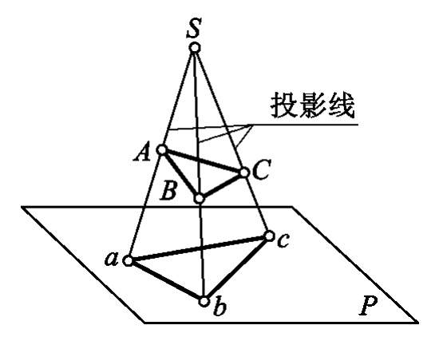

<u>**[导航页面](../从零开始的软渲染器-导航/)**</u>

# Z-Buffer介绍

首先说说为什么要引入Z-Buffer，在我们之前的光栅化操作中，我们完全没有管三角形的前后关系



拿这张图来举例，假设我们的摄像机在$S$点，则我们看到的$ABC$则会完全遮盖住$abc$，但是，我们在光栅化的时候没有考虑到距离的因素。实际上我们绘制在屏幕上的三角形取决于绘制的顺序，如果我们先绘制$ABC$再绘制$abc$，则我们只会看到$abc$。这还是简单的情况，复杂的情况还有三角形相交等等。

为了引入距离以及遮挡关系，我们使用Z-Buffer算法。

把摄像机对准的方向当作$z$轴负半轴，则所有点的$z$轴坐标也就确定了，显然的，$z$坐标大的点在前面，遮挡了$z$坐标小的物体，我们绘制三角形的时候，检测这个像素点的$z$坐标最大是多少，比它大，则绘制该像素，并且更新最大值，否则不绘制。

你可能会问，难道不是应该依照物体和摄像头的距离来判断遮挡吗？为什么判断的是$z$轴坐标？这其实是因为目前我们的物体是直接平行投影到显示屏上的，在之后我们会介绍透视投影，就像上面的点投影一样，到时候再说用什么来判断遮挡。

# 具体实现

话不多说我们直接上代码

```cpp
bool ras::triangle(
    TGAImage & image,
    std::array<geo::vec4f,3> const & points,
    std::array<geo::OARColor,3> const & colors,
    float zbuffer[]
){
    float const EPS = 1e-5;
    int width = image.getWidth(), height = image.getHeight();

    std::array<geo::vec2i,3> screenPoints;

    for(int i=0;i<3;i++){
        screenPoints[i] = world2screen(points[i], width, height);
    }

    int maxx = 0, minx = image.getWidth()-1, maxy = 0, miny = image.getHeight()-1;
    for(int i=0;i<3;i++){
        maxx = std::max(maxx, screenPoints[i].x);
        minx = std::min(minx, screenPoints[i].x);
        maxy = std::max(maxy, screenPoints[i].y);
        miny = std::min(miny, screenPoints[i].y);
    }
    maxx = std::min(maxx, width-1);
    minx = std::max(minx, 0);
    maxy = std::min(maxy, height-1);
    miny = std::max(miny, 0);

    for(int x=minx;x<=maxx;x++){
        for(int y=miny;y<=maxy;y++){
            std::tuple<float,float,float> ret = geo::getBarycentric(screenPoints, geo::vec2i(x,y));
            float alpha = std::get<0> (ret);
            float beta  = std::get<1> (ret);
            float gamma = std::get<2> (ret);
            if(alpha<-EPS || beta<-EPS || gamma<-EPS) continue;
            float z = alpha * points[0].z +
                      beta  * points[1].z +
                      gamma * points[2].z;
            if(z<zbuffer[y*width+x]){
                continue;
            }
            zbuffer[y*width+x] = z;

            geo::OARColor color = geo::vec4i(
                alpha*geo::vec4f(colors[0]) +
                beta*geo::vec4f(colors[1]) +
                gamma*geo::vec4f(colors[2]));
            image.setFragment(x,y,color);
        }
    }

    return true;
}
```
