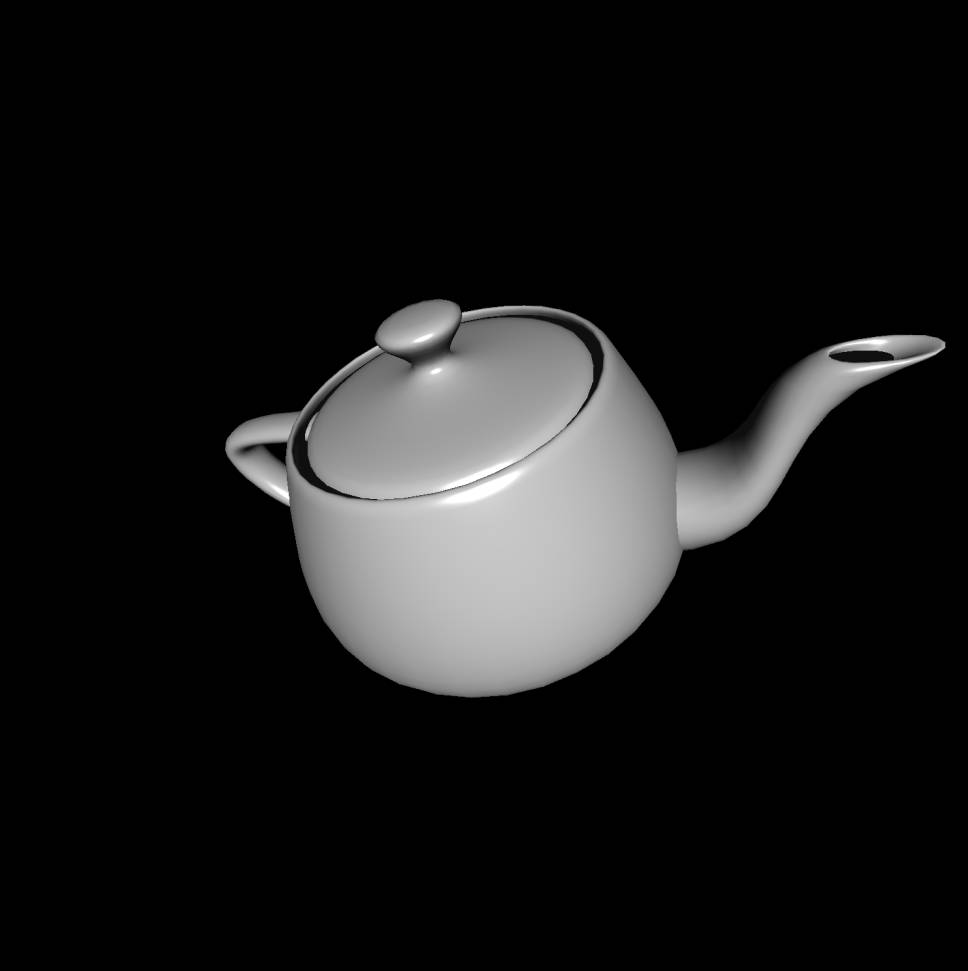

<u>**[导航页面](../从零开始的软渲染器-导航/)**</u>

# Z-Buffer介绍

首先说说为什么要引入Z-Buffer，在我们之前的光栅化操作中，我们完全没有管三角形的前后关系


拿这张图来举例，假设我们的摄像机在$S$点，则我们看到的$ABC$则会完全遮盖住$abc$，但是，我们在光栅化的时候没有考虑到距离的因素。实际上我们绘制在屏幕上的三角形取决于绘制的顺序，如果我们先绘制$ABC$再绘制$abc$，则我们只会看到$abc$。这还是简单的情况，复杂的情况还有三角形相交等等。

为了引入距离以及遮挡关系，我们使用Z-Buffer算法。

把摄像机对准的方向当作$z$轴负半轴，则所有点的$z$轴坐标也就确定了，显然的，$z$坐标大的点在前面，遮挡了$z$坐标小的物体，我们绘制三角形的时候，检测这个像素点的$z$坐标最大是多少，比它大，则绘制该像素，并且更新最大值，否则不绘制。

注意这里的$z$轴坐标是透视投影之后的坐标。

# 具体实现

话不多说我们直接上代码

```cpp
bool ras::trianglePhong(
    TGAImage & image,
    geo::TriCoords const & tcoords,
    std::array<geo::OARColorf, 3> const & colors,
    geo::vec4f const & lightPos, // 光的位置
    geo::OARColorf const & light, // 光的颜色
    geo::vec4f const & cameraPos, //相机的位置
    float zbuffer[]
){
    float const EPS = 1e-5;
    int width = image.getWidth(), height = image.getHeight();
    std::array<geo::vec2i,3> screenPoints;

    for(int i=0;i<3;i++){
        screenPoints[i][0] = (int)(tcoords.screenCoords[i][0] / tcoords.screenCoords[i].w+.5f);
        screenPoints[i][1] = (int)(tcoords.screenCoords[i][1] / tcoords.screenCoords[i].w+.5f);
    }

    int maxx = 0, minx = width-1, maxy = 0, miny = height-1;
    for(int i=0;i<3;i++){
        maxx = std::max(maxx, screenPoints[i].x);
        minx = std::min(minx, screenPoints[i].x);
        maxy = std::max(maxy, screenPoints[i].y);
        miny = std::min(miny, screenPoints[i].y);
    }
    maxx = std::min(maxx, width-1);
    minx = std::max(minx, 0);
    maxy = std::min(maxy, height-1);
    miny = std::max(miny, 0);

    geo::vec4f kd = {.75f, .75f, .75f, 1.f};
    geo::vec4f ks = {1.f, 1.f, 1.f, 1.f};
    geo::vec4f ka = {.2f, .2f, .2f, 1.f}; //设置三种反射的反射因子

    for(int x=minx;x<=maxx;x++){
        for(int y=miny;y<=maxy;y++){
            std::tuple<float,float,float> ret = geo::getBarycentric(screenPoints, geo::vec2i(x,y));
            float alpha = std::get<0> (ret);
            float beta  = std::get<1> (ret);
            float gamma = std::get<2> (ret);
            if(alpha<-EPS || beta<-EPS || gamma<-EPS) continue;
            float z = alpha * tcoords.screenCoords[0].z +
                      beta  * tcoords.screenCoords[1].z +
                      gamma * tcoords.screenCoords[2].z;
            // z值在这里可以先这样用，下一节我们会发现这样插值是有误差的
            // 虽然我们这里传进来的是屏幕空间而非剪裁空间，但这两个空间的z坐标是相同的

            if(z<zbuffer[y*width+x]){
                continue;
            }
            zbuffer[y*width+x] = z;

            geo::vec4f norm = alpha*tcoords.norms[0] + beta*tcoords.norms[1] + gamma*tcoords.norms[2];
            geo::vec4f world =  alpha*tcoords.worldCoords[0] + beta*tcoords.worldCoords[1] + gamma*tcoords.worldCoords[2];
            // 插值得出三角形内点的世界坐标与法向量

            geo::vec4f l = geo::normalized(lightPos-world); //顶点到光源的单位向量
            geo::vec4f v = geo::normalized(cameraPos-world); //顶点到相机的单位向量
            geo::vec4f h = geo::normalized(v+l); //半程向量

            float value = geo::dot(l, norm); //我们直接将dot(l,n)<0的点忽略
            if(value<0.f){
                continue;
            }
            geo::OARColorf ld = kd * light * value; //因为我们还没学zbuffer，如果用max的话会绘制全黑的三角形
            geo::OARColorf ls = ks * light * std::pow(std::max(0.f,geo::dot(norm, h)), 100.f);
            geo::OARColorf la = ka * geo::vec4f(.3f, .3f, .3f, 1.f); //三种光强
            geo::vec4f intensity = ld + ls + la;

            geo::OARColor color = geo::toOARColor(
                (alpha * colors[0] + beta  * colors[1] + gamma * colors[2]) * intensity
            );
            // 最终物体的颜色是 自身颜色*光照颜色
            image.setFragment(x,y,color);
        }
    }

    return true;
}
```

需要注意的是，我们这里直接用线性的重心坐标插值去计算三角形内部像素的$z$轴坐标了。虽然这里这样用确实效果还可以，但是下一节我们将会知道这样的差值是有误差的。

# 使用例

我们继续使用teapot模型，代码见 **[这里](https://github.com/kegalas/oar/blob/main/tutorial/chapter7/src/main.cpp)**  。



现在观察壶嘴连接处，已经不会再有穿模的现象了。

~~但是缺少了几个三角形，看起来像精度问题，我还在Debug，TODO~~
