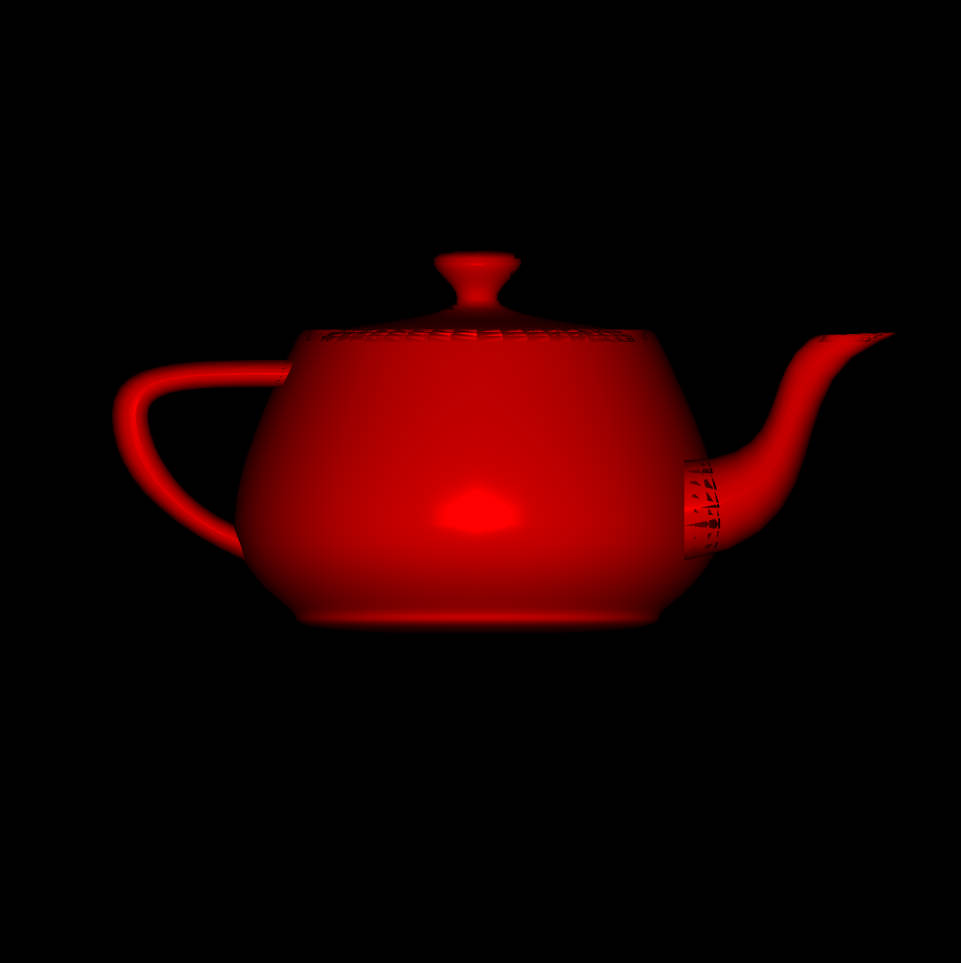

<u>**[导航页面](../从零开始的软渲染器-导航/)**</u>

# Blinn-Phong反射模型

Blinn-Phong反射模型将光的反射分为了三个部分。

- 漫反射
- 镜面反射
- 环境光反射

我们在具体实现光照的时候，会把这三个光照分开计算，然后最后显示出来的时候叠加显示。

为了方便，我们作出如下约定，对于物体表面上的一点$\bm p$，其单位法向量为$\bm n$，从$\bm p$指向摄像机的单位向量为$\bm v$，指向光源的单位向量为$\bm l$

## 漫反射

漫反射意味着，从四面八方看过来，这个位置的颜色（亮度）是一致的。

如图，光到了反射点后，朝着四面八方反射，并且并没有哪个方向特别突出。

处理漫反射的规则也叫做Lambert's Cosine Law，这个规则指明，如果光源照射到$\bm p$点上的光照强度为$I$，则其漫反射的光照强度为$L_d=I\cos\theta$，其中$\theta$是$\bm l$和$\bm n$的夹角。同时为了防止从物体表面以下的光线射过来影响亮度，以及考虑各种物体的反射性能不一样，我们写为

$$
L_d = k_d I \max(0,\bm n\cdot\bm l)
$$

其中$k_d$是该物体的材质的漫反射系数。这里$k_d$一般是三维向量，而同时$I$和$L_d$也是三维向量。这么做的原因是，我们的光是有颜色的，并且反射的时候物体也会对某种颜色反射的多，某种颜色反射的少。这里$k_d$和$I$是分量之间各自相乘的乘法，在我们的库里就是operator*，而不是dot函数。

并且由于我们在这里做乘法，试想一下我们用$255\times255$，得到的数超过了$255$，也就是颜色的上限值，是不对的。我们转化一下，把$RGB$三个分量的值定为$[0,1]$，用这个数字去进行计算。在最后屏幕上着色的时候，再转换回整数$[0,255]$。

你可能会问，我知道光有颜色，但是亮度怎么办？简单认为，一个颜色的0.9倍亮度，就是把每个分量都乘以0.9。更详细的我会在以后介绍（TODO）。

## 镜面反射

有时候，这个材质比较光滑，在反射角（指$\bm v$和$\bm n$的夹角）等于入射角（指$\bm l$和$\bm n$的夹角），或者反射角很接近入射角时，光强会明显强于其他角度。

出现这种情况的时候，不仅反射角很接近入射角，而且可以推出，半程向量$\bm h$非常接近法向量$\bm n$

所谓的半程向量就是$\bm l,\bm v$的角平分线的单位向量，有

$$
\bm h = \dfrac{\bm v+\bm l}{||\bm v+\bm l||}
$$

此时相机接收到的光强就是

$$
L_s = k_s I \max(0,\bm n\cdot\bm h)^p
$$

其中$k_s$是镜面反射系数，而$p$决定了$\bm n$和$\bm h$有多接近才算触发镜面反射。$p$越大，触发的范围越小，通常$p\geq 100$。

$L_s,k_s,I$也都是三维向量，并且乘法也是分量各自相乘。$k_s$会采用比较亮的白色，而不是其他颜色。

## 环境光反射

你可以把环境光当成是房间里的其他物体的漫反射经过非常多次再-漫反射，最终照射到该物体上的光。Blinn-Phong模型中，直接采取了取用常数的简单处理办法。

$$
L_a = k_aI_a
$$

$L_a,k_a,I_a$也都是三维向量，并且乘法也是分量各自相乘。$k_s$会采用比较暗的白色，而不是其他颜色。$I_a$通常也是比较暗的颜色。

## 反射组合

直接加一起即可

$$
L = L_a+L_d+L_s
$$

# 使用例子

我们把上一节所讲的人物模型拿出来使用一下。

用**[这个链接](https://github.com/kegalas/oar/blob/main/tutorial/chapter5/src/main.cpp)** 中的代码（需要去下载模型文件放到代码中的指定文件夹，见**[链接](https://github.com/kegalas/oar/blob/main/tutorial/chapter5/obj/african_head.obj)** ），我们可以得到如下的效果图

看上去还好，细看的话发现眼睛、嘴巴、耳朵一塌糊涂，这实际上是因为三角形的前后关系导致覆盖而出现的结果，在下一部分我们将介绍Z-buffer算法来解决这个问题。
