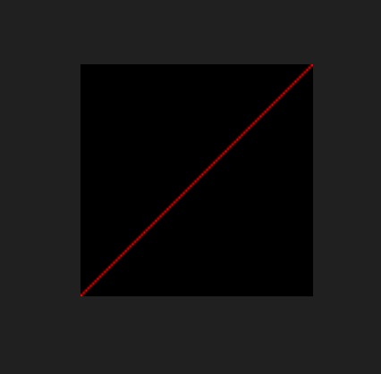

<u>**[导航页面](../从零开始的软渲染器-导航/)**</u>

# TGA格式介绍

具体可以参考[http://paulbourke.net/dataformats/tga/](http://paulbourke.net/dataformats/tga/)

这里将部分重要的介绍一下。

首先为了简单起见，我们使用没有颜色表，也没有压缩的TGA格式。

## 文件头

首先是文件头。

|字节数|内容|
|-|-|
|1|图像信息长度|
|1|颜色表类型|
|1|图像类型|
|5|颜色表规范|
|10|图像规范|

**图像信息长度**

我们并不会使用这个部分，所以我们定为0.

**颜色表类型**

0代表不使用颜色表，1代表使用，我们定为0.

**图像类型**

0代表没有图像数据，2代表未压缩的真彩色图像，3代表未压缩的彩色图像，其他类型可以参照原文。

**颜色表规范**

前两个字节为颜色表首地址，然后的两个字节为颜色表长度，最后一个字节是颜色表位数。我们不会使用颜色表，所以全部设置为0.

**图形规范**

十个字节分为

|字节数|内容|
|-|-|
|2|图像x坐标起始位置|
|2|图像y坐标起始位置|
|2|图像宽度|
|2|图像高度|
|1|每个像素占用的位数|
|1|图像描述字节|

和一些图像格式不同，TGA的坐标原点是左下角。不过这不影响我们选择xy坐标起始位置为(0,0)。

图像宽度和高度也不难理解，唯一需要注意的是，数据是以小端序来存储的，也就是说800在用两个字节表示，16进制的形式是，0x0320。但是实际上写入文件时，由低到高，第一个字节是20，第二个字节是03，连起来是2003。

每个像素占用的位数，如果是黑白图像，只有一个颜色，也就是0~255，只需要一个字节，也就是8位，所以会显示为8. 如果是RGB图像，就会是24，RGBA图像，就会是32. 值得注意的一点是，写入到文件的顺序是BGR和BGRA。

图像描述字节，占一个字节，从低到高，

*0-3位* TGA 16位图像设为0或1，TGA 24位设为0，TGA 32位设为8. 原文并没有说8位图像设置为多少，我设置为0没有问题。

*4位* 必须为0

*5位* 设置原点在左下角还是左上角，0为左下角，1为左上角，实际上就是垂直翻转图像，不过TGA默认为0.

*6-7位* 我们不考虑这个，直接设置为0，原文有详细解释

## 图像信息

如果没有颜色表，那么在文件头的十八个字节之后就进入图像信息。

很简单，如果是黑白图像，每个字节表示一个像素。如果是RGB图像，每三个字节表示一个像素，并且在文件中是以BGR的顺序放置的。如果是RGBA图像，每四个字节表示一个像素，并且在文件中是以BGRA的顺序放置的。

总共有“宽$\times$高$\times$每个像素占用的字节数”个字节

## 文件尾

在写完图像信息之后是文件尾，内容包含

|字节数|内容|
|-|-|
|2|扩展区域|
|2|开发者自定义区域|
|8|签名|
|2|结束|

扩展区域和开发者自定义区域我们不用，直接设置为0.

签名是TRUEVISION-XFILE的ASCII码表示，注意小端序。如果我们用两个uint64表示，就是0x4953495645555254和0x454C4946582D4E4F

最后的结束是ASCII中的.符号和eof符号，分别是0x2E和0x00，写成一个uint16就是0x002E（考虑小端序）。

整个TGA文件到此结束。

# tga_image.h

首先我们根据文件头的描述设定一个结构体

```cpp
struct TGAHeader{
    std::uint8_t  length = 0;       //TGA图像Identification Field的长度
    std::uint8_t  colorMapType = 0; //0：不使用颜色表，1：使用颜色表
    std::uint8_t  imageType = 0;    //图像类型，2代表未压缩的真彩色图像，3代表未压缩的黑白图像
    std::uint16_t cMapStart = 0;    //颜色表首地址
    std::uint16_t cMapLength = 0;   //颜色表长度
    std::uint8_t  cMapDepth = 0;    //颜色表位数
    std::uint16_t xOffset = 0;      //x坐标的起始位置
    std::uint16_t yOffset = 0;      //y坐标的起始位置
    std::uint16_t width = 0;        //图形宽度
    std::uint16_t height = 0;       //图像高度
    std::uint8_t  pixelDepth = 0;   //图像每一个像素占用的位数，例如RGB为24位，RGBA为32位
    std::uint8_t  descriptor = 0;   //图像描述信息，可见http://paulbourke.net/dataformats/tga/

    TGAHeader(){}
};
```

然后是文件尾的结构体

```cpp
struct TGAFooter{
    std::uint32_t extend = 0; //扩展区域
    std::uint32_t custom = 0; //开发者自定义区域
    std::uint64_t sig1 = 0;   //签名1
    std::uint64_t sig2 = 0;   //签名2
    std::uint16_t end = 0;      //结束

    TGAFooter(){
        sig1 = 0x4953495645555254;  //TRUEVISI
        sig2 = 0x454C4946582D4E4F;  //ON-XFILE
        end  = 0x002E;           
    }
};
```

注意，内存默认是以4字节对齐的，我们需要使用如下语句来保证对齐到1个字节，防止写入错误。

```cpp
#pragma pack(push)
#pragma pack(1)

//...这里放入刚刚的两个结构体。

#pragma pack(pop)
```

方便起见，我们定义

```cpp
namespace TGAType{
    const unsigned int rgb  = 0;
    const unsigned int rgba = 1;
    const unsigned int grey = 2;
    const unsigned int pixelSize[] = {3,4,1};
}
```

来帮助我们定义颜色的编号和颜色格式占用的字节数，这可能并不是最好的写法，并且可能会暴露我的C++水平。

然后我们给文件头一个新的构造函数

```cpp
TGAHeader(unsigned int type, std::uint16_t width_, std::uint16_t height_){
    if(type == TGAType::rgb){
        imageType = 2;
        pixelDepth = 24;
    }
    else if(type == TGAType::rgba){
        imageType = 2;
        pixelDepth = 32;
    }
    else if(type == TGAType::grey){
        imageType = 3;
        pixelDepth = 8;
    }
    else{
        std::cerr<<"Error! Wrong TGA Type!\n";
    }

    width  = width_;
    height = height_;

    if(type == TGAType::grey || type == TGAType::rgb){
        descriptor |= 0x00;
    }
    else if(type == TGAType::rgba){
        descriptor |= 0x08;
    }
}
```

这不难理解，如果我们要写入到一个新的文件中，我们定义它的颜色类型和宽度高度，然后修改内容。

之后我们定义一个图片类

```cpp
class TGAImage{
private:
    std::uint16_t   width;
    std::uint16_t   height;
    std::uint8_t    *data;
    unsigned int    type;
    bool            isFlipVertically;

public:
    TGAImage(std::uint16_t const width_, std::uint16_t const height_, unsigned int const type_);
    TGAImage(std::string const & dir);
    ~TGAImage();

    bool readFromFile(std::string const & dir);
    bool writeToFile(std::string const & dir);
    bool setFragment(std::uint16_t const x, std::uint16_t const y, geo::OARColor const & color);
    bool flipVertically();
    inline std::uint16_t getWidth(){return width;}
    inline std::uint16_t getHeight(){return height;}

};
```

赋予了它少量功能，包括读写图片文件，图像翻转，以及设置某个像素的颜色值。

完整的代码在<u>**[这里](https://github.com/kegalas/oar/blob/main/tutorial/chapter2/tga_image.h)**</u>

# tga_image.cpp

```cpp
TGAImage::TGAImage(std::uint16_t const width_, std::uint16_t const height_, unsigned int const type_){
    width               = width_;
    height              = height_;
    type                = type_;
    data                = new std::uint8_t[width*height*TGAType::pixelSize[type]];
    isFlipVertically    = 0;
    std::fill(data,data+width*height*TGAType::pixelSize[type],0);
}
```

首先是一个构造函数，也不难理解，只是设定了图像自身的属性以及分配了图像数据的内存。

注意我们分配图像数据内存的时候，要乘以每个像素占用的字节数。同时注意要把图像数据清零，也可以用memset来。

```cpp
TGAImage::TGAImage(std::string const & dir){
    readFromFile(dir);
}
```

如果要从文件中定义个新图像，则我们直接调用读取文件的功能。

```cpp
TGAImage::~TGAImage(){
    delete[] data;
}
```

析构函数，释放内存。

**读取文件**

```cpp
bool TGAImage::readFromFile(std::string const & dir){
//...    
}
```

```cpp
std::ifstream ifs;
ifs.open(dir, std::ios::binary);

if(!ifs.is_open()){
    std::cerr << "Error! Can't open file: " << dir << "\n";
    ifs.close();
    return false;
}
```

首先我们以二进制形式打开文件，并且检查错误

```cpp
TGAHeader header;
ifs.read(reinterpret_cast<char *>(&header), sizeof(header));
if(!ifs.good()){
    std::cerr << "An error occured while reading the header. File: " << dir << "\n";
    ifs.close();
    return false;
}

if(header.descriptor&0x20){
    isFlipVertically = 1;
}

width  = header.width;
height = header.height;
if(width<=0||height<=0){
    std::cerr << "Error! Bad image width/height. File: " << dir << "\n";
    ifs.close();
    return false;
}
```

然后我们读取文件头，并且检查是否成功读取以及数据是否有误。

```cpp
if(header.imageType == 2){
    if(header.pixelDepth == 24){
        type = TGAType::rgb;
    }
    else if(header.pixelDepth == 32){
        type = TGAType::rgba;
    }
    else{
        std::cerr << "Error! Unknown pixel depth. File: " << dir << "\n";
        ifs.close();
        return false;
    }
} 
else if(header.imageType == 3){
    type = TGAType::grey;
    if(header.pixelDepth != 8){
        std::cerr << "Error! Unknown pixel depth. File: " << dir << "\n";
        ifs.close();
        return false;
    }
}
else{
    std::cerr << "Error! Unknown image type. File: " << dir << "\n";
    ifs.close();
    return false;
}
```

根据图像信息来设置图像信息。

```cpp
int pixelSize = TGAType::pixelSize[type];

data = new std::uint8_t[width * height * pixelSize];

ifs.read(reinterpret_cast<char *>(data), pixelSize*width*height);
if(!ifs.good()){
    std::cerr << "An error occured while reading the data. File: " << dir << "\n";
    ifs.close();
    return false;
}
```

分配内存并读入图像数据，之后检查错误。

```cpp
if(isFlipVertically){
    flipVertically();
}
```

如果图像有翻转那么进行翻转。

**文件写入**

和文件读取大同小异，不再详细说明。

**翻转图像**

```cpp
bool TGAImage::flipVertically(){
    int pixelSize = TGAType::pixelSize[type];
    int half = height/2;
    isFlipVertically = isFlipVertically^1;

    for(int i=0;i<width;i++){
        for(int j=0;j<half;j++){
            for(int k=0;k<pixelSize;k++){
                std::swap(data[(i+j*width)*pixelSize+k], data[(i+(height-1-j)*width)*pixelSize+k]);
            }
        }
    }

    return true;
}
```

如上，我们将isFlipVertically取反，并且将图像数据按height/2位轴做翻转。不过我们这里虽然叫图像翻转，但是最后输出的图像和原图不会有区别，因为我们翻转图像的时候同时改变了坐标原点的位置。这样做只是方便将两个坐标系下的图像数据统一到一起去计算。

**设置像素颜色**

```cpp
bool TGAImage::setFragment(std::uint16_t const x, std::uint16_t const y, geo::OARColor const & color){
    assert(x>=0 && x<width && y>=0 && y<height);
    assert(color.r>=0 && color.r<=255);
    assert(color.g>=0 && color.g<=255);
    assert(color.b>=0 && color.b<=255);
    assert(color.a>=0 && color.a<=255);

    int pixelSize = TGAType::pixelSize[type];
    size_t index = (y*width + x)*pixelSize;

    if(type==TGAType::grey){
        data[index] = static_cast<std::uint8_t> (color.r/3.0+color.g/3.0+color.b/3.0+0.5);
    }
    else if(type==TGAType::rgb || type==TGAType::rgba){
        data[index] = color.b;
        data[index+1] = color.g;
        data[index+2] = color.r;

        if(type==TGAType::rgba){
            data[index+3] = color.a;
        }
    }
    else{
        std::cerr<<"An error occured while set fragment\n";
        return false;
    }

    return true;
}
```

主要注意下标要乘以像素占用的字节大小，以及颜色顺序为BGRA。

完整的代码在<u>**[这里](https://github.com/kegalas/oar/blob/main/tutorial/chapter2/tga_image.cpp)**</u>

# 使用例子

我们用红色画一条从左下到右上的斜线，我们可以用以下代码

```cpp
#include "tga_image.h"

int main(){

    TGAImage image(100,100,TGAType::rgb);

    for(int i=0;i<100;i++){
		image.setFragment(i,i,{255,0,0,255});
    }
    
    image.writeToFile("./test.tga");

    return 0;
}


```

输出结果如下：


