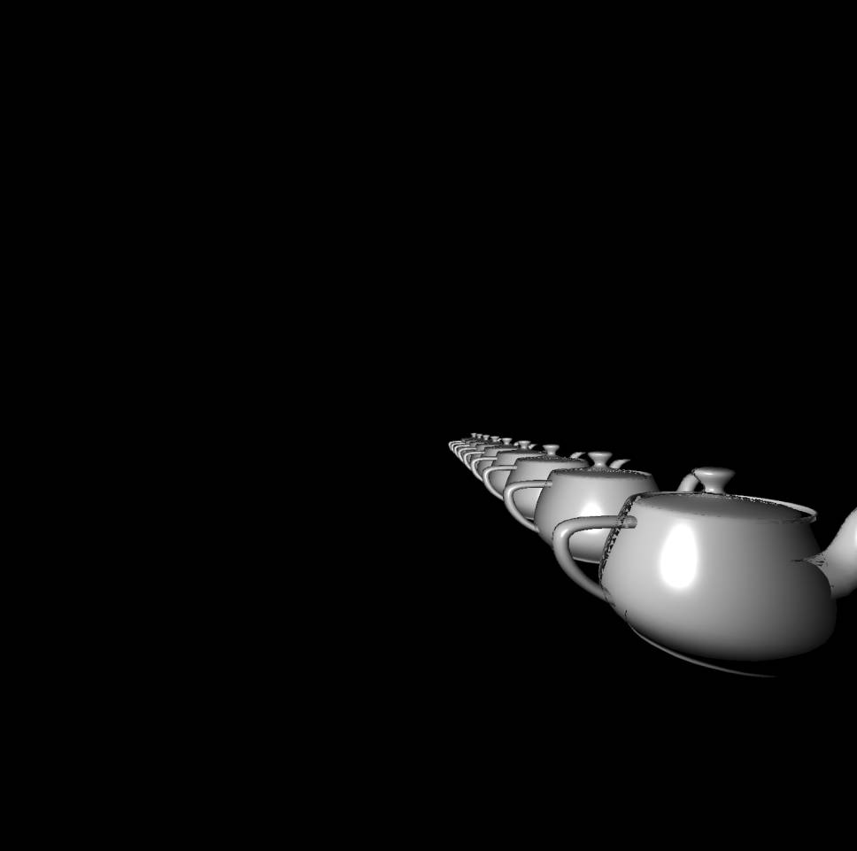

<u>**[导航页面](../从零开始的软渲染器-导航/)**</u>

我们的模型并不会停留在原地不动，比如当我们在游戏中前后左右移动时，其他物体相对于我们是在平移的。又比如在游戏中移动鼠标看向不同的地方，其他物体和我们距离保持不变，但方向却改编了。

为此，研究物体的坐标变换是十分有必要的。

我们之前都只是简单的把物体的$z$轴坐标去掉，只用$x,y$轴坐标来画图。这导致的问题是，我们无法实现近大远小的效果，美术上也把这个称为透视原理。为此，我们还必须研究一种方法，让渲染考虑$z$轴坐标，实现对于透视的模拟。

# 坐标变换

一般来说，我们主要用到平移、旋转、缩放，其他的如切变、镜像等并不是很常用到，暂时不做介绍。另外，我们最开始打算的就是在三维空间中运行，所以就不介绍更简单的二维情况了

## 缩放

从最简单的缩放讲起，如果一个点是$(x,y,z)$，那么把他缩放$k$倍，就是简单的$(kx,ky,kz)$。这实在是过于显然的结论。用矩阵实现的话，这个变换的矩阵是

$$
\begin{bmatrix}
 k & 0 & 0\\
 0 & k & 0\\
 0 & 0 & k
\end{bmatrix}
$$

当然，如果你想让各个轴上缩放比例不一样，例如$x$轴缩放$k_x$倍，$y$轴缩放$k_y$倍，$z$轴缩放$k_z$倍，那么

$$
\begin{bmatrix}
 k_x & 0 & 0\\
 0 & k_y & 0\\
 0 & 0 & k_z
\end{bmatrix}
$$

其作用在某一点$(x,y,z)^T$上，结果为

$$
\begin{bmatrix}
 k_x & 0 & 0\\
 0 & k_y & 0\\
 0 & 0 & k_z
\end{bmatrix}
\begin{bmatrix}
 x\\
 y\\
 z
\end{bmatrix}=
\begin{bmatrix}
 k_xx\\
 k_yy\\
 k_zz
\end{bmatrix}
$$

写成四维（后面介绍为什么）的形式就是

$$
\begin{bmatrix}
 k_x & 0 & 0 & 0\\
 0 & k_y & 0 & 0\\
 0 & 0 & k_z & 0\\
 0 & 0 & 0 & 1
\end{bmatrix}
\begin{bmatrix}
 x\\
 y\\
 z\\
 1
\end{bmatrix}=
\begin{bmatrix}
 k_xx\\
 k_yy\\
 k_zz\\
 1
\end{bmatrix}
$$

## 平移

事实上，三维矩阵是无法进行平移的，我们必须加入一维。

前面提到，我们在图形学中一般最多也就用到四维坐标，我把为什么用以及如何使用四维坐标放到本章附录里。我们先讨论如何平移。

具体而言，我们引入下面这个矩阵

$$
\begin{bmatrix}
 1 & 0 & 0 & t_x\\
 0 & 1 & 0 & t_y\\
 0 & 0 & 1 & t_z\\
 0 & 0 & 0 & 1
\end{bmatrix}
$$

对于任意一点$(x,y,z,1)^T$应用这个变换，得到

$$
\begin{bmatrix}
 1 & 0 & 0 & t_x\\
 0 & 1 & 0 & t_y\\
 0 & 0 & 1 & t_z\\
 0 & 0 & 0 & 1
\end{bmatrix}
\begin{bmatrix}
 x\\
 y\\
 z\\
 1
\end{bmatrix}=
\begin{bmatrix}
 x+t_x\\
 y+t_y\\
 z+t_z\\
 1
\end{bmatrix}
$$

我们很自然地发现，这就是真正的平移，每个坐标都位移了$t$的距离。

## 旋转

旋转操作有很多办法，例如欧拉角，四元数等等。这次我们先讨论欧拉角，未来可能会添加上四位数（TODO）

在二维空间中，一个点绕原点逆时针旋转$\phi$得到的新点为

$$
\begin{bmatrix}
 \cos\phi & -\sin\phi\\
 \sin\phi & \cos\phi
\end{bmatrix}
\begin{bmatrix}
 x\\
 y\\
\end{bmatrix}
$$

在三维空间中，这个旋转就相当于点绕$z$轴旋转，容易推出绕三个轴的旋转矩阵。

$$
rotate-z(\phi)=
\begin{bmatrix}
cos\phi  & -sin\phi & 0\\
sin\phi  & cos\phi & 0\\
0  & 0 & 1
\end{bmatrix}
$$

$$
rotate-x(\phi)=
\begin{bmatrix}
1  & 0 & 0\\
0  & cos\phi & -sin\phi\\
0  & sin\phi & cos\phi
\end{bmatrix}
$$

$$
rotate-y(\phi)=
\begin{bmatrix}
cos\phi  & 0 & sin\phi\\
0  & 1 & 0\\
-sin\phi  & 0 & cos\phi
\end{bmatrix}
$$

同样的，我们也可以很方便地将其扩展为4维矩阵。

## 复合变换

我们有时会对一个点进行连续的变换，例如先把他缩放50%，再把它旋转某个角度，再把它平移。设缩放矩阵为$M_1$，旋转矩阵为$M_2$，平移矩阵为$M_3$，我们的点初始为$P^{(0)}$

首先进行的是缩放，那么$P^{(1)}=M_1P^{(0)}$，然后再进行旋转，那么$P^{(2)}=M_2P^{(1)}$，然后再平移，那么$P^{(3)}=M_3P^{(2)}$。代入展开得

$$
P^{(3)} = M_3M_2M_1P^{(0)}
$$

这里我想指出非常明显的一点，就是变换的顺序不可以任意交换。例如，对$(1,0)$这个点，先逆时针旋转180度，再向右平移一个单位，得到$(0,0)$。而先平移再旋转就得到$(-2,0)$。

体现在矩阵上也是一样的，根据线性代数知识，我们知道，矩阵乘法有结合律，但是没有交换律。也就是例如，$M_3M_2M_1P^{(0)}$和$M_2M_3M_1P^{(0)}$，在绝大部分情况下都是不相等的。

我们计算确实是从左到右计算，但是我们观察这个式子，判断其是以什么顺序变换的，却是反过来从右到左看，先进行$M_1$变换，再进行$M_2$变换，最后再$M_3$变换

# 视角变换

我们为什么需要变换视角？我们需要先介绍一下空间坐标系统

看这个图，我们一般会用到$5$个坐标系。

1. 局部空间。其指的是物体模型自己的坐标，也就是我们之前在OBJ文件里见到的那个坐标。它有自己的原点，每个不同的模型、或者相同模型的不同实例都可以有自己的原点，也就有了自己的坐标。其不需要加载到你的程序中，这个坐标就存在了。以真实世界作为类比的话，局部空间相当于你这个人的肚脐眼为原点的空间，只保存我这个人的信息。
2. 世界空间。当你把模型加载到你的“游戏世界”，这个世界本身是有一个坐标的，以真实世界为类比，相当于宇宙的坐标系。你在这个宇宙有一个确切的坐标（如果原点确定）。这个空间存储了许多模型的信息。通过之前提到的平移、缩放、旋转矩阵，我们把物体放到世界各处。刚导入的时候，模型原点和世界原点是重叠的，所以我们只需要对局部空间的坐标应用上变换矩阵，就得到世界空间的坐标了。
3. 观察空间。也可以叫他摄像机空间。比起局部空间，观察空间更像是把世界空间的原点和坐标轴进行位移、旋转后得到的空间，其包含了众多模型的信息。而原来世界的原点会被变换到相机的位置，坐标轴会根据相机的朝向而设定。
4. 裁剪空间。你的摄像机并不能看到所有的东西，例如他有长宽高的限制，又例如你看不到背后的东西，再例如远处的东西太小了对你来说看不见。所以你的摄像机实际上能看到的东西只是整个观察空间中的一个很小的子集。通过投影矩阵（正交或透视投影，之后会介绍），你把能看到的东西映射到一个$[-1,1]^3$的正方形盒子里。看不到的东西则在这个盒子外，也就是被剪裁了。
5. 屏幕空间。这里是离散的，并且是$2$维的，你的屏幕（或者窗口）的分辨率是多少，屏幕空间大小就是多少。把剪裁空间里的东西真正放到屏幕上显示出来，就从剪裁空间转换到了屏幕空间。

## 模型变换

也就是图上的Model Matrix，其实就是之前将的缩放、平移、旋转矩阵，不需要再讲。这个矩阵记作$M_m$

## 视口变换

我们先来讲最简单的视口变换，也就是图上的Viewport Transform，最后一步的矩阵。

为了统一与便利，我们在最后一步之前，所有可见物体的$x,y$坐标都被限制在$[-1, 1]$这个连续范围内。但显然，我们的图片、显示屏等都是一个像素一个像素地去描述，其坐标是在$[0, witdh],[0,height]$这个离散区间内，所以我们就需要一个变换来进行转换。

非常容易想到，先将$[-1, 1]$平移变成$[0, 2]$，除以$2$变成$[0,1]$，再乘以宽度或高度，就有$[0, width]$。写成矩阵形式如下

$$
\begin{bmatrix}
 w & 0 & 0 & 0\\
 0 & h & 0 & 0\\
 0 & 0 & 1 & 0\\
 0 & 0 & 0 & 1
\end{bmatrix}
\begin{bmatrix}
 1/2 & 0 & 0 & 0\\
 0 & 1/2 & 0 & 0\\
 0 & 0 & 1 & 0\\
 0 & 0 & 0 & 1
\end{bmatrix}
\begin{bmatrix}
 1 & 0 & 0 & 1\\
 0 & 1 & 0 & 1\\
 0 & 0 & 1 & 0\\
 0 & 0 & 0 & 1
\end{bmatrix} = 
\begin{bmatrix}
 w/2 & 0 & 0 & w/2\\
 0 & h/2 & 0 & h/2\\
 0 & 0 & 1 & 0\\
 0 & 0 & 0 & 1
\end{bmatrix}
$$

其中$w, h$为图片的宽和高。我们称最后这个矩阵$M_{vp}$

## 相机变换

即图上的View Matrix变换。相机变换的目的是，将世界坐标的原点变换到相机这里，从而方便计算物体对于相机的远近关系、遮挡关系等等。

和OpenGL保持一致，我们使用右手系，并且摄像机看向的方向是$-z$方向，摄像机的头顶是$y$方向，右边是$x$方向，如下图。

我们可以把相机变换分为两步来看，首先是将原点平移到相机位置，或者更准确的说，是将相机的位置放置在$[0,0,0]^T$，世界上的其他物体都平移相同的距离和方向。矩阵如下

$$
\begin{bmatrix}
 1 & 0 & 0 & -c_x\\
 0 & 1 & 0 & -c_y\\
 0 & 0 & 1 & -c_z\\
 0 & 0 & 0 & 1
\end{bmatrix}
$$

其中$\bm c$是相机的世界坐标。

第二步是将世界坐标方向旋转到和相机的坐标方向相同。其实就是线性代数里的坐标变换。

刚才我们也说过，我们的相机看向（gaze，$g$）$-z$轴，其头上（up，$u$）的方向为$y$轴，右边（right，$r$）为$x$轴。由线性代数知识，任意基向量矩阵$\times$某点在该基下的坐标$=$该点在自然基下的坐标。。那么，对于自然基的点$[1, 1, 1]$，其相机基向量矩阵和在相机坐标系下的坐标满足

$$
\begin{bmatrix}
 r_x & u_x & -g_x \\
 r_y & u_y & -g_y \\
 r_z & u_z & -g_z 
\end{bmatrix}
\overrightarrow{x} = 
[1,1,1]^T
$$

一般情况下，我们的$\bm r, \bm u, \bm g$都是单位向量。只要上式两边同乘基向量矩阵的逆矩阵，就可以计算出$\bm x$了。而显然，这个矩阵是正交矩阵，只需要转置即可。

综上所述，世界坐标系上的任意一点在相机坐标系下的坐标为

$$
\begin{bmatrix}
 r_x & r_y & r_z & 0\\
 u_x & u_y & u_z & 0\\
 -g_x & -g_y & -g_z & 0\\
 0 & 0 & 0 & 1
\end{bmatrix}
\begin{bmatrix}
 1 & 0 & 0 & -c_x\\
 0 & 1 & 0 & -c_y\\
 0 & 0 & 1 & -c_z\\
 0 & 0 & 0 & 1
\end{bmatrix}
\begin{bmatrix}
 x\\
 y\\
 z\\
 1
\end{bmatrix}
$$

合并矩阵得

$$
\begin{bmatrix}
 r_x & r_y & r_z & -c_x\\
 u_x & u_y & u_z & -c_y\\
 -g_x & -g_y & -g_z & -c_z\\
 0 & 0 & 0 & 1
\end{bmatrix}
\begin{bmatrix}
 x\\
 y\\
 z\\
 1
\end{bmatrix}
$$

左边这个矩阵一般称为view矩阵，记作$M_v$

## 投影变换

在倒数第二步，即Projection Matrix变换，将所有想要的点变换到标准的$[-1, 1]^3$立方体内，而在这之外的点被裁剪掉，不再渲染和计算。

投影变换分为正交投影和透视投影两个，以blender为例

显然，上面的图片中，物体之间没有近大远小，而且地板的纹理都是平行的，此为正交投影。而下图中物体近大远小明显，地板纹理相较于延长线的远端，此为透视投影。

### 正交投影

正交投影就很简单，将我们想要的一个长方体变换到标准立方体。和之前的视口变换有些相似。先将长方体中心移动到原点，再将其伸缩到标准立方体。假设长方体的前后是near和far（z轴），near>far（记住相机指向$-z$轴）。左右是left和right（x轴），right>left，上下是top和bottom，top>bottom（y轴）。则变换矩阵如下

$$
\begin{bmatrix}
 \dfrac{2}{r-l} & 0 & 0 & 0\\
 0 & \dfrac{2}{t-b} & 0 & 0\\
 0 & 0 & \dfrac{2}{n-f} & 0\\
 0 & 0 & 0 & 1
\end{bmatrix}
\begin{bmatrix}
 1 & 0 & 0 & -\dfrac{r+l}{2}\\
 0 & 1 & 0 & -\dfrac{t+b}{2}\\
 0 & 0 & 1 & -\dfrac{n+f}{2}\\
 0 & 0 & 0 & 1
\end{bmatrix}=
\begin{bmatrix}
 \dfrac{2}{r-l} & 0 & 0 & -\dfrac{r+l}{r-l}\\
 0 & \dfrac{2}{t-b} & 0 & -\dfrac{t+b}{t-b}\\
 0 & 0 & \dfrac{2}{n-f} & -\dfrac{n+f}{n-f}\\
 0 & 0 & 0 & 1
\end{bmatrix}
$$

记作$M_o$

### 透视投影

透视投影的作用用一张图来表示

左图中的线可以看作是相机镜头（理想状态下为一个点）接收的光线。可以看到，穿过前面的小矩形（near平面）的光线，随着距离的增长覆盖到了更大的一个矩形（far平面）。而我们的任务，就是把这一个“平截头体”“拍扁”为右侧的长方体。

这个长方体有如下性质：

1. near平面上的点坐标在投影前后不变
2. far平面上的点的$z$坐标在投影前后不变
3. far平面的中心在投影后仍然是中心

以二维为例，作图如下

如图，假设我们要对点$(y_1, z_1)$进行投影，最终其$y$轴坐标会变为$y_2$，由相似三角形知识可知

$$
y_2 = n\dfrac{y_1}{z_1}
$$

同理可得，三维中，除了$y$的变换，也有

$$
x_2 = n\dfrac{x_1}{z_1}
$$

注意，我们的性质中没有提到截头体内部$z$的映射性质，目前还无法直接得到。

根据齐次坐标的性质，我们可以将我们的新点定义为（老点为$[x,y,z,1]^T$）

$$
[nx, ny, ??, z]^T = [nx/z,ny/z,??,1]^T
$$

将投影变换矩阵写出来如下

$$
\begin{bmatrix}
 n & 0 & 0 & 0\\
 0 & n & 0 & 0\\
 ? & ? & ? & ?\\
 0 & 0 & 1 & 0
\end{bmatrix}
\begin{bmatrix}
x\\
y\\
z\\
1
\end{bmatrix}=
\begin{bmatrix}
nx\\
ny\\
?\\
z
\end{bmatrix}
$$

因为近平面上的点$[x,y,n,1]^T$在投影前后坐标不变，又因为齐次坐标的性质$[x,y,n,1]^T=[nx,ny,n^2,n]^T$，所以有

$$
\begin{bmatrix}
 n & 0 & 0 & 0\\
 0 & n & 0 & 0\\
 A & B & C & D\\
 0 & 0 & 1 & 0
\end{bmatrix}
\begin{bmatrix}
x\\
y\\
n\\
1
\end{bmatrix}=
\begin{bmatrix}
nx\\
ny\\
Ax+By+Cn+D\\
n
\end{bmatrix}=
\begin{bmatrix}
nx\\
ny\\
n^2\\
n
\end{bmatrix}
$$

所以有$Ax+By+Cn+D=n^2$，即$A=0, B=0, Cn+D=n^2$

又因为远平面中心点的坐标变换前后不变，所以有

$$
\begin{bmatrix}
 n & 0 & 0 & 0\\
 0 & n & 0 & 0\\
 0 & 0 & C & D\\
 0 & 0 & 1 & 0
\end{bmatrix}
\begin{bmatrix}
0\\
0\\
f\\
1
\end{bmatrix}=
\begin{bmatrix}
0\\
0\\
Cf+D\\
f
\end{bmatrix}=
\begin{bmatrix}
0\\
0\\
f^2\\
f
\end{bmatrix}
$$

所以有$Cf+D=f^2$。

解得

$$
C=n+f, D=-nf
$$

综上所述，透视投影$M_p$矩阵为

$$
\begin{bmatrix}
 n & 0 & 0 & 0\\
 0 & n & 0 & 0\\
 0 & 0 & n+f & -nf\\
 0 & 0 & 1 & 0
\end{bmatrix}
$$

注意，我们用点$[x,y,z,1]^T$去算之后，得到的是$[nx,ny,(n+f)z-nf,z]^T$，这并不是我们想要的数值上的结果，我们还要进行一次除以$z$（也被称作透视除法），得到$[nx/z,ny/z,n+f-nf/z,1]^T$，才是我们想要的数值结果。

### 综合

我们可以用透视投影将截头体变成长方体，而用正交投影则可以将长方体变为标准立方体。显而易见的，要完成整个过程，我们只需要先透视再正交即可：

$$
M_oM_p
$$

有些教材里会直接将其乘在一起作为$M_p$

$$
\begin{bmatrix}
 \dfrac{2n}{r-l} & 0 &  \dfrac{l+r}{l-r} & 0\\
 0 & \dfrac{2n}{t-b} & \dfrac{b+t}{b-t} & 0\\
 0 & 0 &  \dfrac{f+n}{n-f} &  \dfrac{2fn}{f-n}\\
 0 & 0 & 1 & 0
\end{bmatrix}
$$

有些地方会比较喜欢使用无穷远的far平面，此时矩阵变为

$$
\begin{bmatrix}
 \dfrac{2n}{r-l} & 0 &  \dfrac{l+r}{l-r} & 0\\
 0 & \dfrac{2n}{t-b} & \dfrac{b+t}{b-t} & 0\\
 0 & 0 &  -1 &  2n\\
 0 & 0 & 1 & 0
\end{bmatrix}
$$

### FOV与宽高比

我们确实是可以直接控制$r,l,t,b$四个值来控制near平面的大小，但是游戏中我们一般是通过控制fov和宽高比来控制视角范围的。现在我们来介绍一下二者如何转化。

首先，我们需要将near平面的中心对准相机的镜头方向，这意味着

$$
l=-r
$$

$$
b=-t
$$

同时，这也就意味着其和宽高比的关系为

$$
\dfrac{w}{h} = \dfrac{r}{t}
$$

如上图，当$n, w, h$确定之后，我们就可以通过控制$\theta$来控制$r$和$t$。这里的$\theta$就是FOV。我们这里讨论的是纵向FOV，也有些地方会用横向的。显然，这几个量的关系为

$$
\tan\dfrac{\theta}{2} = \dfrac{t}{|n|}
$$

只要我们知道$n$和$\theta$，那么$t$就可以推知，从而$r$也可以根据宽高比推知。

### 注意事项

为了省事，直接使用fov和宽高比的那一套来算$M_oM_p$可能是更好的选择，否则我们得要根据near平面和宽高比手动设置r,l,t,b，设置的不对会导致问题。比如，我们设置$r=-l=1, t=-b=1, n=-0.01, f=-1000$这样的数值，看上去可能还挺正常的，但是问题是，其蕴含着纵向fov接近$180\degree$的事实。

假设相机面前3m有个东西（尺寸在1m左右），那么在这种fov的投影下，其会被投影到999米处的距离（取决于far平面有多远，可以手算一下验证），而大小只有几个像素，在图片上甚至看不出来。

实际上我们这里设置$r=-l=0.01, t=-b=0.01$是合理的，此时横向纵向fov都是90度。物体也会正确地出现在图片中。

### OpenGL中的透视投影

OpenGL中，会使用$>0$的near和far作为透视矩阵函数的参数，此时，矩阵稍微变化，有

$$
\begin{bmatrix}
 \dfrac{2|n|}{r-l} & 0 &  \dfrac{r+l}{r-l} & 0\\
 0 & \dfrac{2|n|}{t-b} & \dfrac{t+b}{t-b} & 0\\
 0 & 0 &  \dfrac{|n|+|f|}{|n|-|f|} &  \dfrac{2|f||n|}{|f|-|n|}\\
 0 & 0 & -1 & 0
\end{bmatrix}
$$

通过计算可以发现这与我们的矩阵刚好是$-1$倍关系。

## 视角变换流水线

从最开始的图可以看出来，我们需要依次经历模型变换、相机变换、投影变换、视口变换，才能得到最终的屏幕坐标，写成如下形式，对于世界坐标的点$p$，其屏幕坐标$p'$有

$$
p' = M_{vp}M_oM_pM_vM_mp
$$

# 法向量与变换

# 代码

所有的矩阵计算代码都可以在 **[这里](https://github.com/kegalas/oar/blob/main/tutorial/chapter6/src/geometry.cpp)** 找到没有什么需要强调的地方，都是填数据而已。

# 使用例

我们继续使用teapot模型，代码见 **[这里](https://github.com/kegalas/oar/blob/main/tutorial/chapter6/src/main.cpp)**  。

在这里，我们从远到近地（我们还没有zbuffer）画了8个teapot。当然，效果不够好，这也是因为我们没用使用zbuffer，导致部分结构错位，从而图片很奇怪。在下一部分我们将会介绍用于判断物体遮挡关系的zbuffer。

# 附录

为什么要用四维坐标？其实就是因为平移他不是线性变换，三维的矩阵无法处理三维的平移。但是我们可以通过多加一维的方式来引入平移运算。

具体而言，我们定义三维点$(x,y,z)^T$扩充为四维点$(x,y,z,1)^T$，定义三维向量$(x,y,z)^T$扩充为四维向量$(x,y,z,0)^T$。特别的，对于任意一个四维坐标$(x,y,z,w)^T$，如果$w=0$，则其代表$(x,y,z,0)^T$这个向量，如果$w\neq 0$，则其代表$(x/w,y/w,z/w,1)^T$这个点。

这样做的好处是，如果两个点相减，得到的第四维为$0$，也就得到了一个向量。同理可得两个向量相减还是向量，点减去向量相当于对点进行平移，向量减去点没有意义（除非你理解为点减去向量的相反数）。

还有一个好处，对于任意的平移变换

$$
\begin{bmatrix}
 1 & 0 & 0 & t_x\\
 0 & 1 & 0 & t_y\\
 0 & 0 & 1 & t_z\\
 0 & 0 & 0 & 1
\end{bmatrix}
$$

其作用在点上时，点正确的进行了平移

$$
\begin{bmatrix}
 1 & 0 & 0 & t_x\\
 0 & 1 & 0 & t_y\\
 0 & 0 & 1 & t_z\\
 0 & 0 & 0 & 1
\end{bmatrix}
\begin{bmatrix}
 x\\
 y\\
 z\\
 1
\end{bmatrix}=
\begin{bmatrix}
 x+t_x\\
 y+t_y\\
 z+t_z\\
 1
\end{bmatrix}
$$

而其作用在向量上时，并不会平移向量。即

$$
\begin{bmatrix}
 1 & 0 & 0 & t_x\\
 0 & 1 & 0 & t_y\\
 0 & 0 & 1 & t_z\\
 0 & 0 & 0 & 1
\end{bmatrix}
\begin{bmatrix}
 x\\
 y\\
 z\\
 0
\end{bmatrix}=
\begin{bmatrix}
 x\\
 y\\
 z\\
 0
\end{bmatrix}
$$

这就是数学意义上的向量，永远从原点开始。而与物理中有时讨论的矢量不同，物理中矢量有时可以让起始点在任意地方。

另外，你可能需要经常检查你的点的第四维坐标是否为1，如果不为1，可能会产生各种奇怪的问题。在某些变换矩阵作用后，第四维可能就不为1了，并且你可能不容易发现这个问题。
