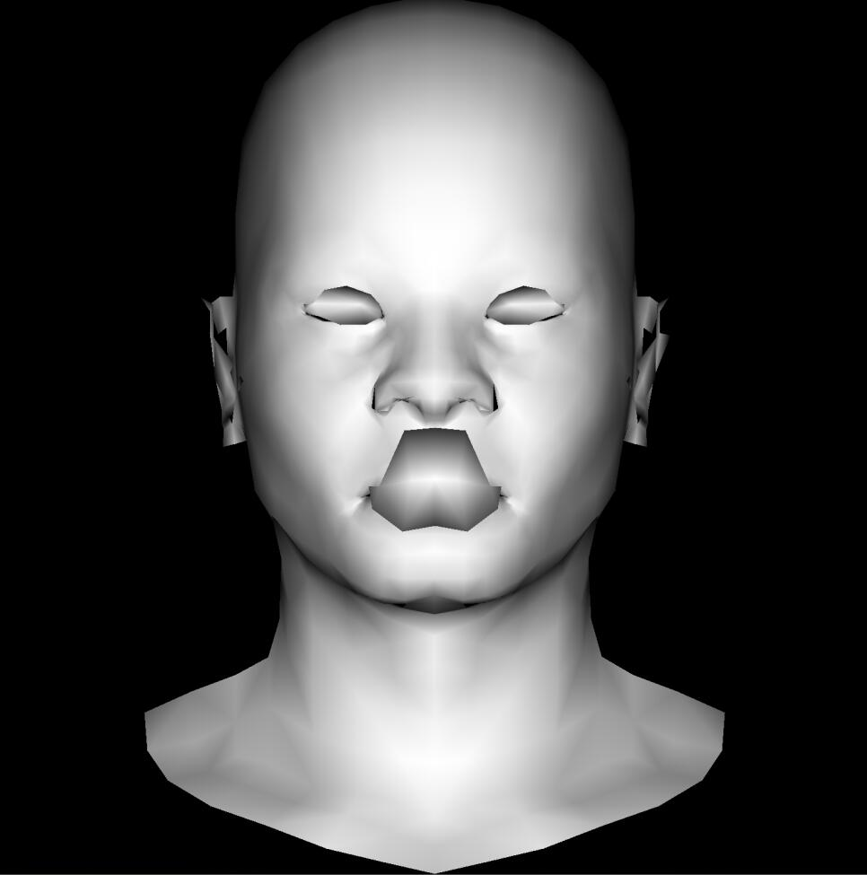

<u>**[导航页面](../从零开始的软渲染器-导航/)**</u>

# OBJ格式简介

.obj格式是描述几何模型的一种简单办法。它可以描述顶点的坐标、法向量、纹理坐标，以及三角面的顶点数据等等。

**注释**

.obj格式里的注释是以#开头的一行

**顶点坐标**

例如

```
v 0.511631 -0.845357 0.127832
v 0.608654 -0.568839 -0.416318
v 0.424663 -0.649937 -0.567418
...
```

以v开头，后面带三个小数。注意这个坐标是模型相对于自己原点的坐标，而不是我们渲染过程中的世界坐标。它不会提供总数，只会一条一条地提供。

读取的时候需要注意自己统计总数，另外还要记录序号（写在数组里没有这个问题）。以及序号从$1$开始计数。

**纹理坐标**

例如

```
vt  0.617 0.575 0.000
vt  0.623 0.573 0.000
vt  0.627 0.576 0.000
...
```

以vt开头，后面还是带三个数。通常我们的纹理是二维的，所以第三个会是零。这里的纹理坐标指的是在纹理图片文件上的坐标。显然你会怀疑，纹理图片的大小不是800x800这种形式的吗？为什么这里是小数？

我认为是为了统一，我们只要用坐标乘以宽度、长度，再四舍五入即可得到图片上的像素坐标。

**法向量方向**

例如

```
vn  -0.250 0.462 -0.851
vn  -0.192 0.568 -0.801
vn  -0.359 0.279 0.891
...
```

描述了法向量指向的方向。

注意可能并不是单位向量，我没有找到限制必须是单位向量的规定。

**注意**

上面这三种数据总数不一定是一样的，它们之间的关联也不是一定是序号对应的。大部分时候不一样，也不对应。它们只是描述了一组这样的数据而已，具体到三角面上，才会体现如何使用这些数据。

使用这些数据时，序号就变得重要了起来。再次提醒序号从$1$开始计数。

**三角面信息**

例如

```
f 1206/1252/1206 1207/1254/1207 1205/1255/1205
f 1206/1252/1206 1208/1256/1208 1086/1257/1086
f 1206/1252/1206 1086/1257/1086 1087/1253/1087
...
```

以f开头，带了三组数据。每组都有三个数字。带有三个数字是因为要描述三角面的三个顶点。

第一组，描述了三个顶点的（模型）空间坐标。这三个数字是序号，我们用序号去访问数组即可得到坐标。

第二组，描述了三个顶点的材质uv坐标，也是序号。

第三组，描述了三个顶点的法向量坐标，也是序号。

我们目前了解以上信息即可。

# model.h

首先我们需要定义一下model里面要有什么内容。

```cpp
std::vector<geo::vec3f> vertices{};
std::vector<geo::vec2f> tex_coords{};
std::vector<geo::vec3f> norms{};
std::vector<size_t> face_vi{};
std::vector<size_t> face_ti{};
std::vector<size_t> face_ni{};
```

我们需要三维的顶点坐标、二维的纹理uv坐标，以及三维的顶点法向量坐标。同时也需要记录每个三角面它的顶点坐标序号，纹理坐标序号以及法向量坐标序号。

再看看我们可能需要什么方法：

```cpp
Model(std::string const & dir);
~Model();

size_t getFaceSize();
geo::vec3f getVert(size_t faceid, size_t nth);
bool getTriangle(std::array<geo::vec3f,3> & dist, size_t faceid);
bool getNorm(std::array<geo::vec3f,3> & dist, size_t faceid);
```

一个构造函数和一个析构函数不用多说。

之后我们可能需要提供获取三角面数量的函数、获取（某个特定）顶点坐标的函数，获取一个三角面上所有顶点坐标的函数，以及获得三角面上所有顶点法向量的函数。

之后我们还会在读取材质纹理的地方需要提供纹理坐标的函数。这里先略过。

全部代码可见**[链接](https://github.com/kegalas/oar/blob/5f4cd5fc90df31b357b3580cf063b4bc83ad779a/src/model.h)**

# model.cpp

现在我们来看看具体要怎么实现

## 构造函数

```cpp
Model::Model(std::string const & dir){
    std::ifstream in;
    in.open(dir,std::ifstream::in);
    if(in.fail()) return;

    std::string line;
    while(!in.eof()){
        std::getline(in,line);
        std::istringstream iss(line);
        char discard;

        if(line.compare(0,2,"v ")==0){
            iss>>discard;
            geo::vec3f v;
            for(int i=0;i<3;i++) iss>>v[i];
            vertices.push_back(v);
        }
        else if(line.compare(0,3,"vt ")==0){
            iss>>discard>>discard;
            geo::vec2f vt;
            for(int i=0;i<2;i++) iss>>vt[i];
            tex_coords.push_back(vt);
        }
        else if (line.compare(0,3,"vn ")==0) {
            iss>>discard>>discard;
            geo::vec3f vn;
            for(int i=0;i<3;i++) iss>>vn[i];
            norms.push_back(vn);
        }
        else if(line.compare(0,2,"f ")==0){
            iss>>discard;
            size_t fv,ft,fn;
            while(iss>>fv>>discard>>ft>>discard>>fn){
                face_vi.push_back(fv-1);
                face_ti.push_back(ft-1);
                face_ni.push_back(fn-1);
            }
        }
    }
    std::cerr<<"v: "<<vertices.size()<<" t: "<<tex_coords.size()<<" n: "<<norms.size()<<"\n";
    std::cerr<<"f: "<<face_ni.size()/3<<"\n";
}
```

这其实没什么好多说的，把之前说过的OBJ文件格式理解一下，去实际看看obj文件里面怎么写的。如果掌握了ifstream，字符串的操作，整个操作就会了。

需要注意的是，obj里面提供的序号是从$1$开始的，而我这里用的是往vector里push_back元素的办法，方便起见把所有序号都减$1$。

## 获取坐标信息的函数

这一部分其实非常容易理解和实现，就把我们读入的数据，按照下标获取，然后返回即可。全部代码可见**[链接](https://github.com/kegalas/oar/blob/5f4cd5fc90df31b357b3580cf063b4bc83ad779a/src/model.cpp)**

# 效果测试

用**[这个链接](https://github.com/kegalas/oar/blob/5f4cd5fc90df31b357b3580cf063b4bc83ad779a/src/main.cpp)** 中的代码（需要去下载模型文件放到代码中的指定文件夹，见**[链接](https://github.com/kegalas/oar/blob/1eddb36577cd9403dfc0c763c8a738d21c2bd59c/obj/african_head.obj)** ），我们可以得到如下的效果图



看上去还好，细看的话发现眼镜、嘴巴、耳朵一塌糊涂，这实际上是因为三角形的前后关系导致覆盖而出现的结果，在下一部分我们将介绍Z-buffer算法来解决这个问题。
