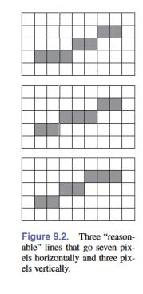
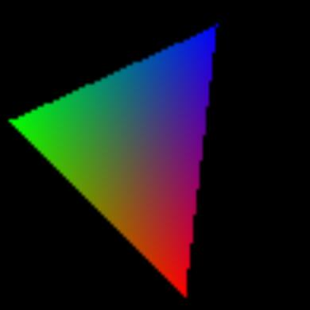

<u>**[导航页面](../从零开始的软渲染器-导航/)**</u>

# 线段光栅化算法

从《Fundamentals of Computer Graphics》（第五版）中的第179页，我们得到了一种直线的表达方式，

$$
f(x,y)\equiv (y_0-y_1)x+(x_1-x_0)y + x_0y_1-x_1y_0 = 0
$$

其中$(x_0,y_0),(x_1,y_1)$代表直线上的任意不同的两点。并且$x_0\leq x_1$，如果这个不满足，就交换两点的序号。然后直线的斜率显然就是

$$
m = \dfrac{y_1-y_0}{x_1-x_0}
$$

方便起见，我们先假设$m\in(0,1]$。

显然，我们要画一条直线的话，无非就两种情况：



要么向右移动一格，要么向右后再向上移动一格。总之，我们总是向右移动一格，然后根据某种条件向上移动一格。我们可以把这个条件设置为

$$
\mathbf{if}\ f(x+1,y+0.5)<0\ \mathbf{then}\ y=y+1
$$

注意这里的$(x,y)$取整数，起始像素在直线上。

进一步的，如果我们不想每次都调用函数$f$，我们有如下优化

```
y = y0
d = f(x0+1,y0+0.5)
for x = x0 to x1 do
    draw(x,y)
    if d<0 then
        y = y+1
        d = d+(x1-x0)+(y0-y1)
    else
        d = d+(y0-y1)
```

不优化的方法写成cpp的样子大概如下

```cpp
if(p0->x>p1->x) std::swap(p0,p1);
        
auto fxy = [&](float x, float y)->float{
    return (p0->y-p1->y)*x+(p1->x-p0->x)*y+p0->x*p1->y-p1->x*p0->y;
};

int y = p0->y;
for(int x = p0->x ; x<=p1->x ; x++){
    image.setFragment(x,y,color);
    float er = fxy(static_cast<float>(x)+1.f, static_cast<float>(y)+.5f);
    if(p0->y<p1->y && er<0.f && y<image.getHeight()-1){
        y++;
    }
    else if(p0->y>p1->y && er>0.f && y>0){
        y--;
    }
}
```

这里写的包括了$m\in[-1,1]$的情况，负数情况很简单，就把y++变成y--，以及判断小于零转变为判断大于零。

当$m\in(1,+\infty]$时，情况转变为，我们要么向上走一格，要么向上后向右走一格，与之前的情况非常相似，我们只有把遍历x改成遍历y，判断x++的条件即可。

# 三角形光栅化算法

我会直接使用三角形的重心坐标来实现三角形的光栅化，因为比起其他一些扫描方法，重心坐标能比较方便的实现插值。

三角形的重心坐标可见《Fundamentals of Computer Graphics》（第五版）中的第52页。

根据线性代数的知识，假设我们三角形有三个不重合的点$A,B,C$，则我们可以用$\vec{AB},\vec{AC}$表示平面中任意的点$p$，我们有如下公式

$$
\vec{p} = \alpha\vec{a} + \beta\vec{b}+\gamma\vec{c}
$$

其中$\alpha+\beta+\gamma=1$

可以计算得到，对于平面上的任意一个点$(x,y)$

$$
\gamma = \dfrac{(y_a-y_b)x+(x_b-x_a)y+x_ay_b-x_by_a}{(y_a-y_b)x_c+(x_b-x_a)y_c+x_ay_b-x_by_a}
$$

$$
\beta = \dfrac{(y_a-y_c)x+(x_c-x_a)y+x_ay_c-x_cy_a}{(y_a-y_c)x_b+(x_c-x_a)y_b+x_ay_c-x_cy_a}
$$

$$
\alpha = 1-\beta-\gamma
$$

当这个点在三角形内时，满足以下条件

$$
0<\alpha<1
$$

$$
0<\beta<1
$$

$$
0<\gamma<1
$$

特别的，如果在三角形上，则可以取等号。总体还是要满足$\alpha+\beta+\gamma=1$。

这个东西好就好在，如果需要对颜色进行插值，对于三角形内部任意一点$p$，有$color_p=\alpha color_a+\beta color_b+\gamma color_c$。

我们绘制的时候设置三个点为红、绿、蓝，中间颜色进行插值，就会得到这个结果



接下来我们谈谈具体怎么画三角形。

首先非常暴力的想法是，把整个屏幕上的点扫描一遍，如果这个点在三角形内部，就给他上色。

稍微优化一下，我们只需要扫描三角形的外接矩形（四边平行于坐标轴）即可。

cpp代码如下

```cpp
int maxx = 0, minx = image.getWidth()-1, maxy = 0, miny = image.getHeight()-1;
    for(int i=0;i<3;i++){
        maxx = std::max(maxx, points[i].x);
        minx = std::min(minx, points[i].x);
        maxy = std::max(maxy, points[i].y);
        miny = std::min(miny, points[i].y);
    }

    for(int x=minx;x<=maxx;x++){
        for(int y=miny;y<=maxy;y++){
            std::tuple<float,float,float> ret = geo::getBarycentric(points, x, y);
            float alpha = std::get<0> (ret);
            float beta  = std::get<1> (ret);
            float gamma = std::get<2> (ret);
            if(0.f<=alpha && alpha<=1.f &&
               0.f<=beta  && beta <=1.f &&
               0.f<=gamma && gamma<=1.f)
            {
                geo::OARColor color = static_cast<geo::vec4i>(
                                      alpha*static_cast<geo::vec4f>(colors[0]) +
                                      beta*static_cast<geo::vec4f>(colors[1]) +
                                      gamma*static_cast<geo::vec4f>(colors[2]));
                image.setFragment(x,y,color);
            }
        }
    }
```

全部光栅化的代码可见**[这里](https://github.com/kegalas/oar/blob/97058860346436641decc719d6b72cc7055eb24c/src/raster.cpp)**

另外，求重心坐标的代码我写到了geometry.cpp里，方便别处调用。链接在**[这里](https://github.com/kegalas/oar/blob/97058860346436641decc719d6b72cc7055eb24c/src/geometry.cpp)**（在文件末尾）
