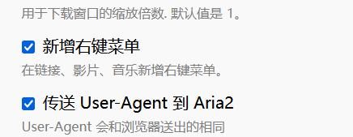

众所周知IDM是一款非常好用的下载器，其速度快、可以完全接管浏览器的下载、可以自动探测视频下载链接等等。但是，他是收费软件，并且不支持BT。

本文将使用开源免费的aria2，进行配置，以尽可能达到IDM的使用效果。根据我的使用情况，我会主要关注接管浏览器的下载和探测视频下载链接的功能。

# 接管浏览器下载

TODO.

在Firefox中，我使用`Aria2 下载器集成组件`这个插件，可以从插件市场下载。

我主要勾选了以下两个选项

这里重要的是第二个，如果不传送UA，那么你在下载直链时，很可能会无法下载，报HTTP 403错误。

# 探测视频下载链接

等我找到Aria2怎么下载m3u8再说，现在我推荐直接用XDM，也是开源免费，下载插件即可。
