# 前言

这篇文章是接在相机PSF标定之后的，我们也说过，PSF表征着光学系统的所有像差（除了畸变），也就描述了相机拍摄出来的照片是如何变得模糊的。我们获得PSF的目的实际上就是去校正这个相差，将图片中模糊的地方变得清晰。理论上来说，任何一种PSF标定方法得出的PSF都可以无缝接在这里面的所有像差矫正方法之前。

# Extreme-Quality Computational Imaging via Degradation Framework

之前的部分见上一篇博客，在预估完PSF后，就介绍了本文的校正模型。

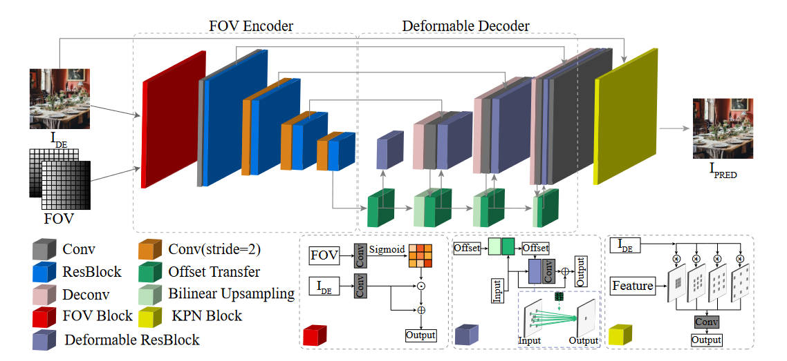

这是一个端到端的网络，输入一个退化的sRGB图像$I_{DE}$，输出重建后的图像$I_{PRED}$，大体上可以分为三个模块。

首先是FOV编码器。因为空间信息和退化有强相关性，本文提出了FOV模块来利用空间特征。这个网络的细节在上图的下方，可以看到它被用于计算一个mask，然后影响到$I_{DE}$的输出。

第二部分是一个可变形解码器。由于PSF的不规则形状和大小，传统的卷积层不是很适合来处理退化，因为传统卷积层只会获取到固定位置的特征。

最后一部分是KPN模块。按照前人的研究结果，预测卷积核来间接预测结果要比直接预测结果要更稳定一些，但是这会增加模型的开销，尤其是卷积核很大的时候。于是本文提出了一种扩大卷积的方式，来让卷积核影响更广的范围。可以看图像来理解。

我们预估的PSF到底用在哪里了呢？实际上在预估完PSF后，我们将ground truth与其进行卷积，合成退化图像。后面的恢复网络在这个配对数据上进行训练。

# Large depth-of-field ultra-compact microscope by progressive optimization and deep learning

[https://www.nature.com/articles/s41467-023-39860-0](https://www.nature.com/articles/s41467-023-39860-0)

本文主要是针对手机相机进行优化，让它能够较好的实现显微任务。作者指出过往的端到端方法计算开销太大，所以本文提出了一种渐进式的优化方法。

首先第一个需要优化的是镜头设计。首先考虑传统的镜头设计方法，例如光线追踪等等，来手动设计一系列镜头，后续的优化算法在每个镜头上都进行一次，选出最好的那一个。使用这种方法减小了参数量，从而减小开销。

关于镜头是如何设计的笔者不懂，也不是PSF估计的重点，就跳过。但是我们需要记得一些概念。在设计镜头的时候要考虑一个两难问题：景深和横向分辨率的关系，横向分辨率越大，景深越小。而对于一个显微镜来说景深是比较重要的。传统的增加景深的做法是减小数字孔径（NA），也就通常意味着减小物理孔径（光圈）或者增大焦距。但是减小光圈会导致进光量减小，从而减小信噪比；而增长焦距则会增大体积，对手机这种设备来说是不行的。

为了解决这个问题，本文开发了一种叫diffractive optical element (DOE)的物理元件，放在光圈之前。这个DOE在这里是一个三次曲面，表示为$\alpha(x^3,y^3)$。这里的$\alpha$是唯一一个参数，用于控制在不同的defocus（离焦）下PSF的扩散，从而控制景深大小。

针对这个$\alpha$，本文均匀选择了$[0.005,0.075]$上的15个值，每一个都做成一套系统（顺带一提材料便宜、工艺简单、成本很低），然后在神经网络上训练，选出最好的。最后选出来的是$\alpha=0.03$，使得景深增加了10倍。

网络架构基于pix2pix，可以很好的适应细节丰富的图像复原任务。本文获取训练数据的方式是，使用商用的显微镜，上下调节物镜高度，获得一系列图像

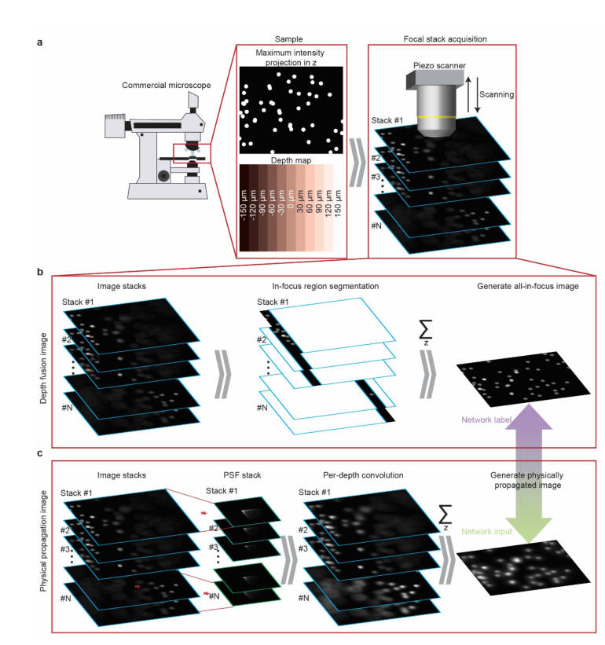

其中使用算法将每张图片中最清晰的部分提取出来，合并成一个all-in-focus图像，作为Ground-Truth。然后对每一张图片，使用本文设计的镜头在对应高度下的PSF进行卷积，最后再合并起来，得到近似的本文镜头拍摄的退化图象。二者作为配对数据送入pix2pix中进行训练。

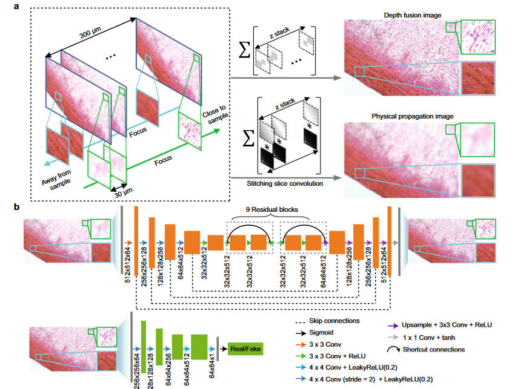

在PSF的标定方面很简单，用光刻技术直接在一块1mm厚的玻璃板子上刻了一系列1um的小孔，然后直接用镜头拍摄。

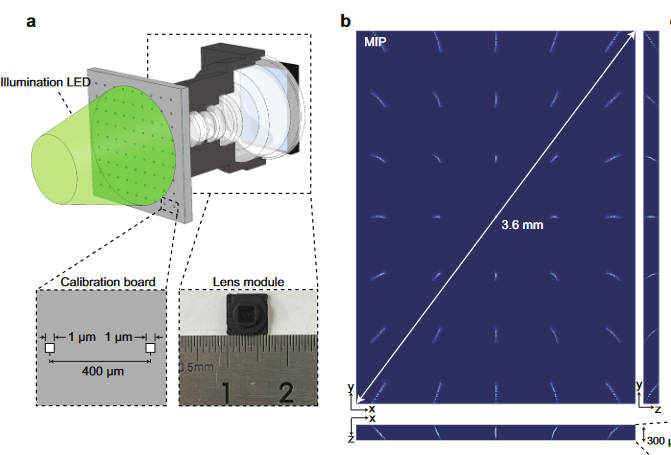

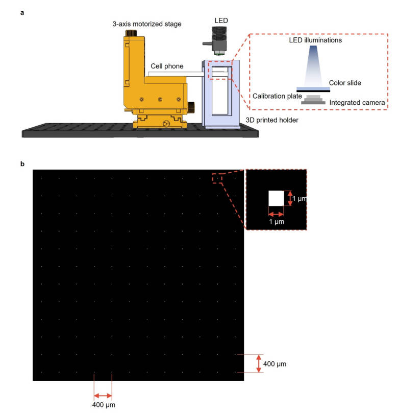

在如何对图片使用PSF卷积得到退化图像，本文建立了一个更细致的模型

由于相机系统拥有大FOV和大NA，导致PSF就更不像一个冲激函数了。为了解决这个问题，提出了一个考虑到PSF平移可变性的前向模型，并且优化了计算开销。假设具有平移可变性PSF的光学模型如下

$$
i(x,y)=\sum_{u,v,z}s(u,v)p(u,v,x-u,y-v,z)
$$

其中$(u,v)$和$(x,y)$分别是物平面和像平面的坐标，而$z$代表不同的深度，每个像$s(u,v)$都对应一个PSF矩阵，表示为$p(u,v,x,y,z)$。由上式也看得出来计算他要迭代所有PSF，复杂度很高，需要对其进行降维。作者这里的想法是进行矩阵分解，将PSF分成一系列基$h_i(x,y)$的加权和

$$
p(u,v,x,y,z) = \sum^N_{i} w_i(u,v,z)h_i(x,y,z)
$$

其中$N$是具有平移不变性的基$h_i$的个数。在实践上，对每个深度$z$，都只标定一共$M$个PSF，最后得到一个PSF集合$\{p(u,v,x_i,y_i,z)\},1\leq i\leq M$。这些PSF经过下采样、剪裁、向量化，最后合并成一个矩阵$\mathbf{P}$，同样的也有基矩阵$\mathbf{H}$和权重矩阵$\mathbf{W}$，于是我们就可以通过数值方法估计$\mathbf{H,W}$

$$
\mathbf{\hat H},\mathbf{\hat W}=\underset{\mathbf{H},\mathbf{W}}{\arg\min}||\mathbf{H}\times\mathbf{W}-\mathbf{P}||^2_2
$$

估计完成后，就可以将成像系统表示为

$$
i(x,y,z)=\sum^N_{i=1}\sum_{u,v}s(u,v)w_i(u,v)h_i(x-u,y-v,z)
$$

使用卷积表示则更简单

$$
i(x,y)=\sum^N_{i=1}\{(s(u,v)\times w_i(u,v))\ast h_i(u,v)\}[x,y]
$$

作者使用一个电动控制台和一个显微镜来获取训练数据。首先用显微镜在正好对上焦的位置拍摄一张图片（文中称作一个sample），然后在$[-150\mu m,150\mu m]$的范围上以$10\mu m$为步长移动显微镜来拍摄，从而得到一系列配对的训练数据。

似乎本文提出的镜头在PSF标定和使用方面就只有上面这些内容。下面的部分似乎是用于效果对比，将本文的神经网络方法和传统的PSF去卷积方法对比。

TODO：有待补完，Deconvolution部分本文说的很模糊，并且疑似有公式错误。

# A Physics-informed Low-rank Deep Neural Network for Blind and Universal Lens Aberration Correction

[https://openaccess.thecvf.com/content/CVPR2024/html/Gong_A_Physics-informed_Low-rank_Deep_Neural_Network_for_Blind_and_Universal_CVPR_2024_paper.html](https://openaccess.thecvf.com/content/CVPR2024/html/Gong_A_Physics-informed_Low-rank_Deep_Neural_Network_for_Blind_and_Universal_CVPR_2024_paper.html)

本文介绍了一种使用一组典型PSF来提取特征基，从而为畸变建模的方法。

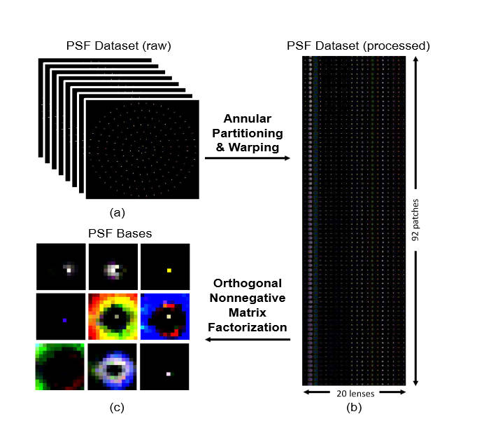

这里从Zemax里选出了20个PSF数据，因为PSF是具有旋转对称性的，于是又将一个平面上的PSF拆成多个同心圆环，然后再将圆环展开成长方形，将长方形前后拼合。最后将20个镜头的PSF长方形拼合起来得到一个矩阵，对其进行ONMF（正交非负矩阵分解）分解，得到一组基$\{B_i\}$，之后所有的PSF都可以由下式表述

$$
k=\sum_i\alpha_i\cdot B_i
$$

图像退化过程就可以由下式表述

$$
Y=X\ast(\sum_i\alpha_i\cdot B_i) + n = \sum_i(\alpha_i\cdot X)\ast B_i + n
$$

其中$X$是锐利图像，$Y$是退化图象，而$n$是噪声。

我们同样可以将退化图象进行分解，分解出模糊成分$\{Y_i=(\alpha_i\cdot X)\ast B_i\}$。之后，我们就可以通过预训练的方式，训练一个去卷积模型，通过预测参数$\alpha_i$的值来消除像差。

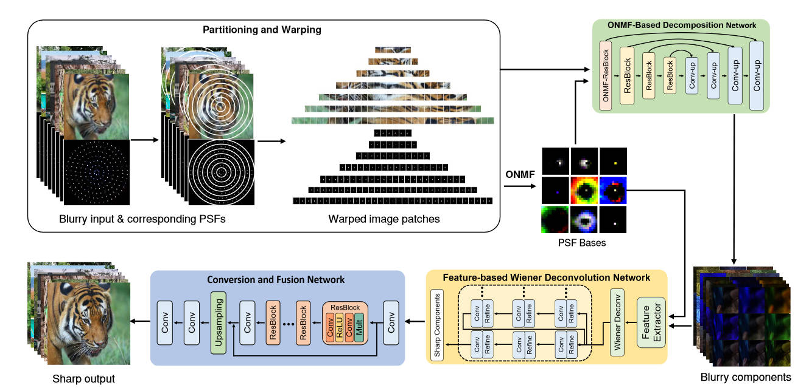

本文提出的方法主要分为三块。第一块负责将原图的模糊成分（特征）提取出来。

在训练过程中，使用Zemax及其中的PSF，来将一个锐利图像$X$合成出一个退化图象$\tilde{Y_i}=X\ast(\alpha_i\cdot B_i)$，然后将退化图像$\tilde{Y}$和基$B$一起送进基于U-net的网络中，输出模糊成分$Y_i$，使用的损失函数如下

$$
\mathcal{L}_{decom} = ||Y-\sum_iY_i||_2+\sum_i(Y_i-\tilde{Y}_i)
$$

其中第一项是为了让$Y_i$的加和和输入一样（我怀疑是不是符号有误），第二项是为了让每一项$Y_i$和合成的$\tilde{Y}_i$一样。

然后是第二部分，进行去卷积。本文提取出来的模糊成分和普通照片的特征区别挺大的，所以不能按常规的思路在空间域上进行去卷积，作者这里使用了在特征域上去卷积的方式。

$$
X^*_i=\arg\min||Y_i-X_i\ast B_i||
$$

在实现上，作者使用了一个基于特征的自适应维纳滤波网络，设$f_i$是可学习的线性滤波器集合，和$Y_i$进行卷积来获得有用的特征，于是

$$
F_iY_i=F_i(X_i\ast B_i)+F_in
$$

这里的$F_i$是$f_i$的傅立叶变换（作者能不能统一一下大小写，其他的大写都是空间域的，只有$F$是频域的）。于是，我们的优化目标也就等价于寻找一个维纳滤波操作$G_i$来进行像差矫正

$$
X_i^*=\arg\min||G_iF_iY_i-F_iX_i||
$$

最后误差函数是

$$
\mathcal{L}_{deconv} = ||F_iX_i-G_iF_iY_i||_2
$$

这里我个人觉得作者说的很乱，作者的意思看图可能更容易理解。首先将模糊成分$Y_i$送进特征提取器，提取特征得到$F_iY_i$，这个$F_i$似乎是可学习的，然后将其送入预训练的维纳滤波$G_i$中，这一部分是不可训练的。然后得到的$G_iF_iY_i$再经过一系列网络，输出了一个预测的$\hat X_i$。网络的目标是期望这个$F_i\hat X_i$和真实标注$F_iX_i$更接近。

目前来说将预估出来的$X_i$组合起来就得到了锐利图片，但事实上由于分解的不精确性和去卷积的伪影，最终会影响到图像质量。为此作者又提出了第三部分，基于注意力的混合模块。这个模块是一个可训练的网络，输入所有的锐利patch，输出一张完整的锐利的图。

# Image restoration for optical zooming system based on Alvarez lenses

[https://opg.optica.org/oe/fulltext.cfm?uri=oe-31-22-35765&id=540720](https://opg.optica.org/oe/fulltext.cfm?uri=oe-31-22-35765&id=540720)

本篇解决了基于Alvarez镜头组的光学变焦系统的图像恢复问题，有很多光学设计的内容，不过我不懂，除去这一部分的话本文内容不多。

首先是获取配对数据，仍然是使用锐利图像，然后卷积上PSF得到退化图象。对于图像恢复部分，本文基于MIMO-UNet进行了修改

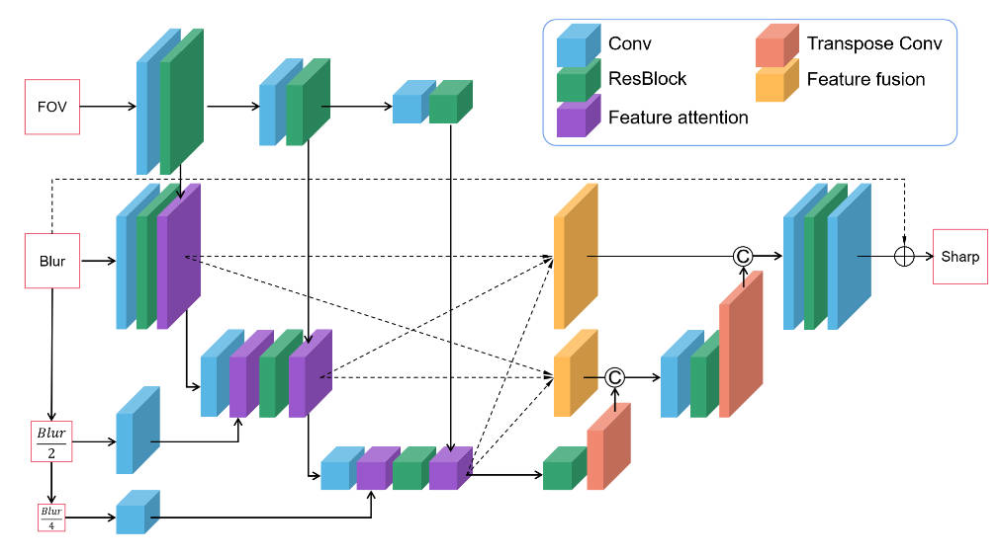

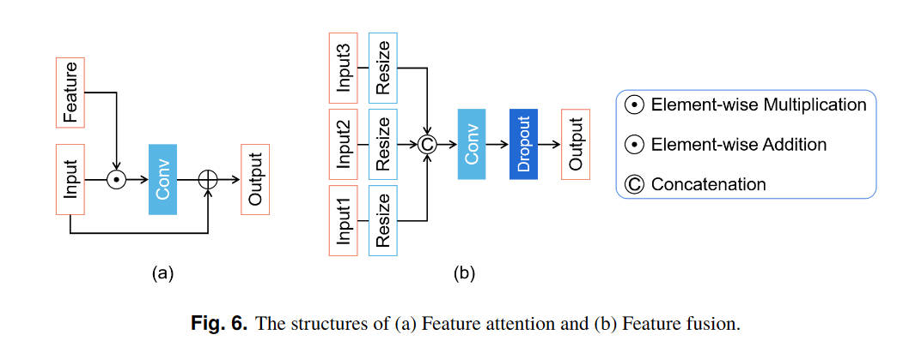

损失函数使用CharbonnierLoss

$$
Loss=\sqrt{(output-input)^2+\epsilon^2}
$$

# Neural nano-optics for high-quality thin lens imaging

[https://www.nature.com/articles/s41467-021-26443-0](https://www.nature.com/articles/s41467-021-26443-0)

本文针对超透镜进行校正。

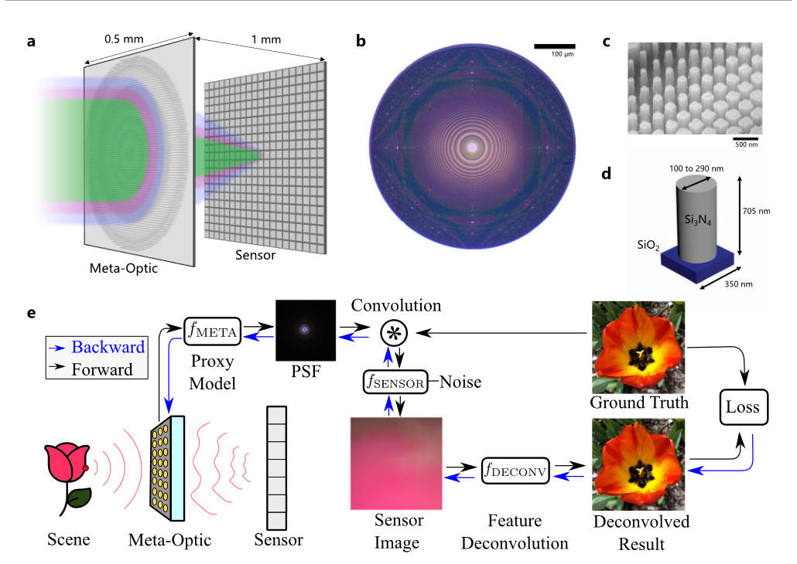

本文将超透镜的设计融入到了训练过程中，超透镜的参数可由下式表述

$$
\phi(r)=\sum^n_{i=0}a_i\left(\dfrac{r}{R}\right)^{2i}
$$

由于笔者不是很清楚光学设计，所以就把这里简单当做一个函数，参数可调，场景用其获取能产生一些数值。

上图描述的是整个端到端的流程，其可以用下式表述

$$
O=f_{\text{DECONV}}(P_{\text{DECONV}}, f_{\text{SENSOR}}(I\ast f_{\text{META}}(P_{\text{META}})), f_{\text{META}}(P_{\text{META}}))
$$

其中$P_{\text{META}}$就是超透镜的参数，使用函数$f_{\text{META}}$计算出理论PSF，和输入信号进行卷积（在训练过程中是数据集的gt图像）。$f_{\text{SENSOR}}$模拟传感器的行为，其中包含了传感器的噪声。然后就是去卷积的神经网络$f_{\text{DECONV}}$，其参数为$P_{\text{DECONV}}$，接受传感器产生的图像，并且由于是非盲，也接受PSF，最终生成一张预测的清晰图像。损失函数就是gt和预测之间的L1损失。

在联合优化过后，就使用最优的超透镜参数去制造超透镜物理实体。

# Realistic Image Degradation with Measured PSF

[https://arxiv.org/abs/1801.02197](https://arxiv.org/abs/1801.02197)

这篇文章虽然是反过来模拟像差的，但很多文章是用合成数据的，这篇文章也可以进行一定了解。

本文采集的PSF是用高精度仪器采集的，不是用我们之前说到的各种数值和深度学习方法，用的是单色滤镜，所以只有单通道的PSF。一共测试了27个镜头，有三个参数：离焦$\Delta z$、图像高度$R$、
方位角$\phi$。

由于这个测量的精度很高(0.3um)，比传感器的像素尺寸(3um)小的多，所以可以进行下采样来提升效率。在本文中，下采样至大约6um的像素大小，得到一个13x13的PSF。

作者这里是想对每一个像素都卷积一个专属于它的PSF，从而达到比较好的结果。为此，作者将之前测量到的PSF作为gt，将$\Delta z$、$R$、$\phi$作为数据输入，让神经网络拟合出PSF。然后对每一个像素都预测一个PSF。但作者认为这又太麻烦了，PSF在短距离内变化不大，不如直接用插值的方法去弄。

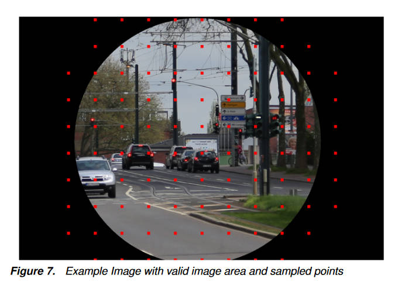

上面的红点是有测量过PSF的位置，其他位置通过双线性插值得到。

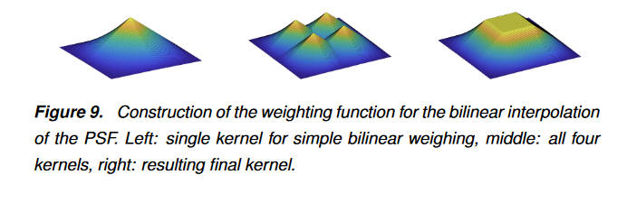

之后使用插值的或真实的PSF对图像卷积就得到了退化图像，同时为了减小拍摄图像自带的退化，还对数据提前使用了盲去卷积。

但是在模拟退化的这个过程中，没有考虑到离焦距离$\Delta z$，作者后面说了一大堆提出的PSF模型有$\Delta z$的好处，但我并没有看到和计算退化有什么关系，整篇文章都很乱。

# End-to-end hybrid refractive-diffractive lens design with differentiable ray-wave model

[https://dl.acm.org/doi/full/10.1145/3680528.3687640](https://dl.acm.org/doi/full/10.1145/3680528.3687640)

这篇文章首次提出一个可微分的、精度高的折射-衍射混合成像模型，来让镜头设计和神经网络结合在一起，从而能够端到端的进行训练。

同前，光学部分不是很懂，简要介绍一下提到的公式。

本文的镜头组如下图

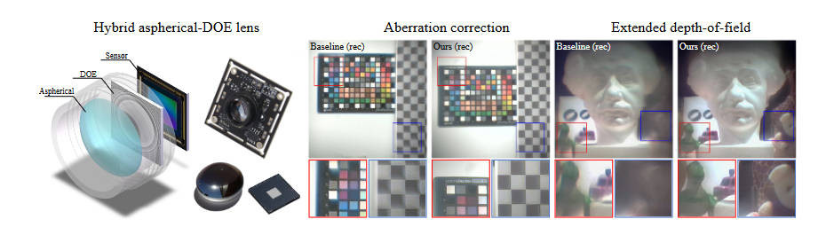

他首先是一连串折射镜片，最后接上一个衍射镜片（衍射光学元件，DOE），然后再接到传感器上。在模拟这个镜头的物理性质时，使用了一种光线-光波结合的方法，在前面的折射镜片上使用光线追踪，而在后面的DOE上使用相位调制等方法去分析。

蒙特卡洛光线追踪的过程可以表示如下

$$
\left\{\begin{matrix}
\mathcal{I}_n(\mathcal S_n):(o^{n-1}, d^{n-1},\phi^{n-1},\lambda)\to (o^{n}, d^{n-1},\phi^{n},\lambda)\\
\mathcal{R}_n(\mathcal S_n):(o^{n}, d^{n-1},\phi^{n},\lambda)\to (o^{n}, d^{n},\phi^{n},\lambda) \\
(o,d,\phi,\lambda)=(\mathcal{R}_N\mathcal{I}_N\dots\mathcal{R}_1\mathcal{I}_1)(o^0, d^0, \phi^0, \lambda)
\end{matrix}\right.
$$

其中$\mathcal{I}$指的是光线与平面$\mathcal{S}$的相交，$\mathcal{R}$指的是光线在平面$\mathcal{S}$上的折射，$o,d,\phi,\lambda$分别是位置、角度、相位、波长。当计算完所有折射后，光线就抵达DOE前表面，此时可以计算光场为

$$
U_{DOE^-}=\sum^{spp}_{i=1}u_i\exp(j\phi_i)\cos<d_i, n>
$$

其中$u_i$是振幅，$\phi_i$是光线$i$的相位，$spp$是蒙特卡洛采样的光线数，$n$是DOE表面的法向量。在DOE的调制过后，光场可以写为

$$
U_{DOE^+}=U_{DOE^-}\exp\left(j\dfrac{n_\lambda-1}{n_0-1}\dfrac{\lambda_0}{\lambda}\phi_0\right)
$$

计算完之后，我们就可以算出传感器表面的光场

$$
U_{Sensor}=\mathcal{F}^{-1}(\mathcal{F}(U_{DOE^+})H)
$$

其中$H$是传递函数，之后PSF计算如下

$$
PSF=|U_{Sensor}|^2
$$

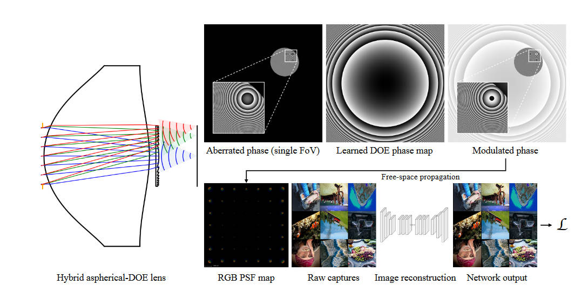

在实验中，作者计算了10x10个RGB PSF。同样，使用PSF来和图像卷积，构造出退化图像。之后使用NAFNet作为图像恢复模型，损失函数如下

$$
\mathcal{L}=\mathcal{L}_{pixel}(\mathcal{N}(PSF\ast I), I) + \alpha\mathcal{L}_{percep}(\mathcal{N}(PSF\ast I), I)
$$

其中$I$是输入图像，也被当做ground truth使用，$\mathcal{N}$代表着NAFNet，$\mathcal{L}_{pixel}$代表均方误差，$\mathcal{L}_{percep}$代表着VGG loss。

# Grayscale to Hyperspectral at Any Resolution Using a Phase-Only Lens

[https://arxiv.org/abs/2412.02798](https://arxiv.org/abs/2412.02798)

这篇文章主要面向metalens的像差矫正。本文使用的相机由一个衍射元件和一个无滤镜的传感器组成，获取到多个波长的光线，输出的是一个加和的灰度图。本文的目标是从这个灰度图中恢复出31个通道的图像。使用的是一个conditional denoising diffusion model

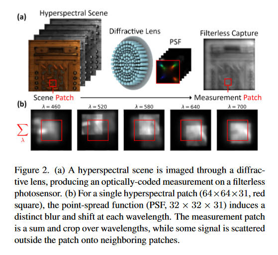

一个高光谱图像（HSI），记作$\mathbf{x}\in\mathcal{R}^{H\times W\times C}_{\geq 0}$，被传感器测量后变成单通道的$\mathbf{y}\in\mathcal{R}^{H\times W}_{\geq 0}$，成像的过程为

$$
\mathbf{y}(u,v)=\mathcal{M}(x)=\sum_\lambda o(\lambda)\cdot f(u,v,\lambda) \underset{(u, v)}{\ast} \mathbf{x}(u,v,\lambda)
$$

其中$f(u,v,\lambda)$是PSF，$\lambda$是波长。$o(\lambda)$是传感器的光谱响应。于是对于高光谱图像的测量就变成了一个线性的编码过程，将3D的高光谱“体”编码成2D“图”。这里的PSF测量似乎不是本文的重点，根据附录来说PSF似乎是理论计算值，整个实验是在合成数据上进行的。

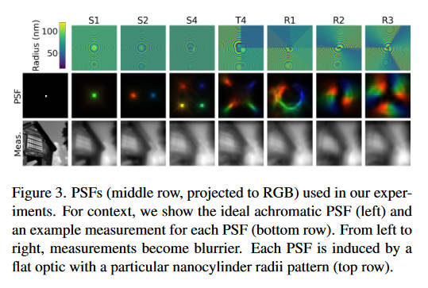

在本文的实验中使用了8个PSF，目的是为了测试哪种光学编码器（指的应该是衍射元件而非神经网络中的编码器）是最好的。左边的PSF较为稀疏，能够产生更锐利的图像，但是编码光谱信息的能力比右边的PSF弱。因为重建任务需要同时保持空间和光谱的高准确性，所以哪种PSF较好并不是很显然。

这上面的每一种PSF都可以通过设计合适的metalens来在物理上实现。我认为作者的逻辑应该是先用这八种PSF去测试，看哪种效果最好，然后依照最好的这个PSF来生产metalens。

本文使用扩散模型来解决图像恢复问题，但并不是整张图上进行，而是分patch进行，作者说从实验结果上来看这样是更好的。

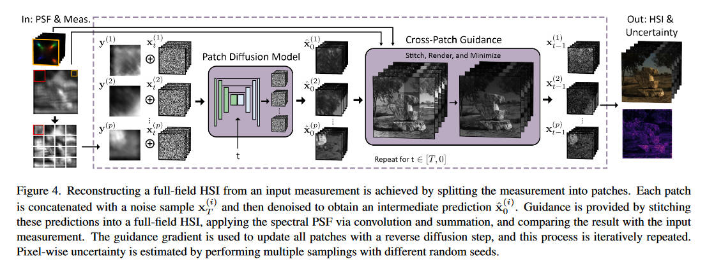

训练数据是从ARAD1K中获取的HSI，然后使用我们前面介绍的成像模型来合成退化图像，然后就得到了配对数据$(x_0^{(i)}, y^{(i)})$。看起来作者意识到它的合成过程中，卷积计算涉及到了patch以外的信号，但是结果上来说影响不大。

同上图介绍的，往扩散模型中添加condition是通过将$x,y$拼在一起实现的，然后让模型在每一步的中间都输出一个预测的HSI$(\hat{\mathbf{x}}^p_0)$，再将他们拼成一张大图，使用前述成像过程进行一次退化，让它的结果和真实标签$y$一致，作者说用这个方法引道全局的去噪过程。如下

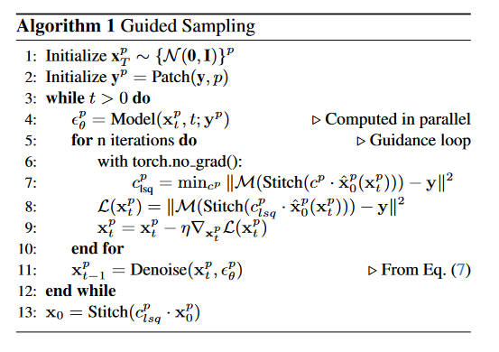

其中上标$p$代表patch，$Stitch$代表这个拼图的过程，$\mathcal{M}$就是前面的成像过程。由于$y$和$x_0$是max-normalized的，所以模型预测出来的HSI是带有一个未知的比例因子的，为了校正这个比例因子，多了一步过程，也就是这个cross-patch guidance。

（上图有误，应该是$\arg\min$）将$\hat x$乘以一个因子再拼起来，然后经过成像模型退化，尽量和标签$y$一致，取这个最好的因子$c$，再取和标签的误差，作为优化$x_t$的误差。将$x_t$优化后再放入扩散模型的去噪过程中。

最后按照这个模型走$T$步去噪过程，就得到了最终预测的HSI。作者将光谱的不确定性量化如下

$$
\text{Uncertainty} = \sum_{\lambda}\text{Var}(\{\mathbf{x}_0\}^N_{i=0})
$$

一共预测了$N$次。

# Achromatic Single Metalens Imaging viaDeepNeural Network

本文也是针对metalens进行像差矫正，但是没有引入PSF数据。模型没什么特别的，主要关注一下成像模型和数据获取方式。

首先介绍一下本文使用的成像模型

$$
I_{sensor} = C(\mathbf{w}\cdot\mathbf{v}\cdot e\mathbf{D}(T(I_{gt}(\lambda))_{H^{-1}}\ast PSF(\lambda))+n)
$$

其中$I_{sensor}$是相机获取到的图像，$I_{gt}(\lambda)$是真实图像的该波长下的分量，$T$指的是一个转换函数，将gt图像转化成显示屏上的图像。相机获取的一部分数据实际上是对着显示屏拍。

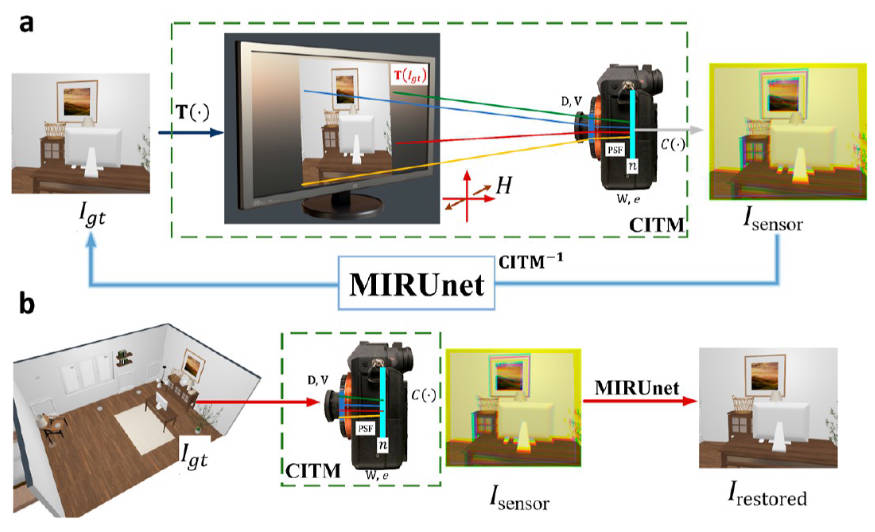

$PSF(\lambda)$是在该波长下的PSF，$\ast$是卷积，$\mathbf{W}$是色彩平衡矩阵，$\mathbf{V}$代表晕影，$H$代表透视投影矩阵，$D$代表镜头畸变，$e$是曝光参数，$n$是噪声，$C$是剪裁函数，剪裁最大最小信号值。

本文是盲去卷积，没有使用测量的PSF。作者认为是metalens的测量比较困难，而且和波长相关，并且PSF通常还不是uniform的。

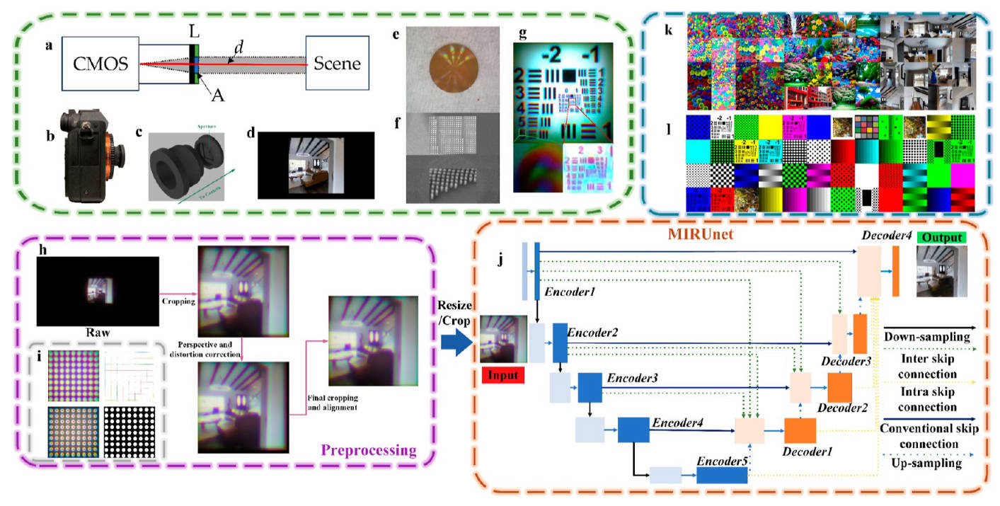

上面的成像模型很全面，但是本文主要只关注彩色图像的质量增强，于是就只保留了$\mathbf{w},\mathbf{v},PSF$这三项，其他的项在数据采集的过程中去除。其中，曝光参数的去除是通过手动设定相机曝光实现的。镜头畸变和透视投影是通过拍摄test charts来去除的。去除过程见上图h部分。gt到显示器的转移矩阵是通过校正显示器去除的。

可以从上图的g部分看到有效性，矫正过的图片在几何上和gt高度相似，在雾状退化、分辨率降低等方面就证实了我们只剩下前述的3项需要矫正。

矫正就没什么好说的，UNet一把抓。损失函数是

$$
\mathcal{L}=\alpha L_{Perceptual}+\beta L_{PSNR}
$$

$$
L_{Perceptual}=\sum^n_{i=m}\beta_il_{p_i}(I_{gt}, I_{restored})
$$

$$
l_p(I_{gt}, I_{restored}) = ||P(I_{gt})-P(I_{restored})||^2
$$

$P(\cdot)$指的是预训练的VGG19，$i$是指模型的第$i$个卷积层。

$$
L_{PSNR} = \dfrac{1}{(10\log 10((I_{max}^2)/MSE(I_{gt}, I_{restored})))}
$$
