# 前言

这篇文章是接在相机PSF标定之后的，我们也说过，PSF表征着光学系统的所有像差（除了畸变），也就描述了相机拍摄出来的照片是如何变得模糊的。我们获得PSF的目的实际上就是去校正这个相差，将图片中模糊的地方变得清晰。理论上来说，任何一种PSF标定方法得出的PSF都可以无缝接在这里面的所有像差矫正方法之前。

# Extreme-Quality Computational Imaging via Degradation Framework

之前的部分见上一篇博客，在预估完PSF后，就介绍了本文的校正模型。

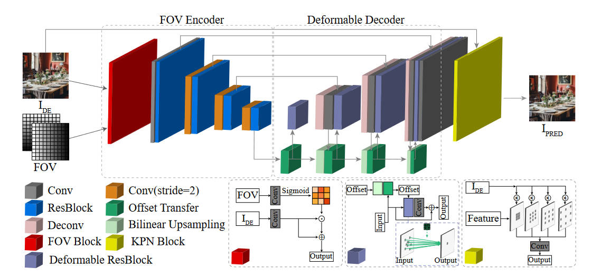

这是一个端到端的网络，输入一个退化的sRGB图像$I_{DE}$，输出重建后的图像$I_{PRED}$，大体上可以分为三个模块。

首先是FOV编码器。因为空间信息和退化有强相关性，本文提出了FOV模块来利用空间特征。这个网络的细节在上图的下方，可以看到它被用于计算一个mask，然后影响到$I_{DE}$的输出。

第二部分是一个可变形解码器。由于PSF的不规则形状和大小，传统的卷积层不是很适合来处理退化，因为传统卷积层只会获取到固定位置的特征。

最后一部分是KPN模块。按照前人的研究结果，预测卷积核来间接预测结果要比直接预测结果要更稳定一些，但是这会增加模型的开销，尤其是卷积核很大的时候。于是本文提出了一种扩大卷积的方式，来让卷积核影响更广的范围。可以看图像来理解。

我们预估的PSF到底用在哪里了呢？实际上在预估完PSF后，我们将ground truth与其进行卷积，合成退化图像。后面的恢复网络在这个配对数据上进行训练。我有点难以区别这算是盲去卷积还是非盲去卷积，说他是盲去卷积，他又利用了估计的PSF合成数据。说他是非盲去卷积，他又没有直接在去卷积的算法中使用PSF。

# Large depth-of-field ultra-compact microscope by progressive optimization and deep learning

[https://www.nature.com/articles/s41467-023-39860-0](https://www.nature.com/articles/s41467-023-39860-0)

本文主要是针对手机相机进行优化，让它能够较好的实现显微任务。作者指出过往的端到端方法计算开销太大，所以本文提出了一种渐进式的优化方法。

首先第一个需要优化的是镜头设计。首先考虑传统的镜头设计方法，例如光线追踪等等，来手动设计一系列镜头，后续的优化算法在每个镜头上都进行一次，选出最好的那一个。使用这种方法减小了参数量，从而减小开销。

关于镜头是如何设计的笔者不懂，也不是PSF估计的重点，就跳过。但是我们需要记得一些概念。在设计镜头的时候要考虑一个两难问题：景深和横向分辨率的关系，横向分辨率越大，景深越小。而对于一个显微镜来说景深是比较重要的。传统的增加景深的做法是减小数字孔径（NA），也就通常意味着减小物理孔径（光圈）或者增大焦距。但是减小光圈会导致进光量减小，从而减小信噪比；而增长焦距则会增大体积，对手机这种设备来说是不行的。

为了解决这个问题，本文开发了一种叫diffractive optical element (DOE)的物理元件，放在光圈之前。这个DOE在这里是一个三次曲面，表示为$\alpha(x^3,y^3)$。这里的$\alpha$是唯一一个参数，用于控制在不同的defocus（离焦）下PSF的扩散，从而控制景深大小。

针对这个$\alpha$，本文均匀选择了$[0.005,0.075]$上的15个值，每一个都做成一套系统（顺带一提材料便宜、工艺简单、成本很低），然后在神经网络上训练，选出最好的。最后选出来的是$\alpha=0.03$，使得景深增加了10倍。

网络架构基于pix2pix，可以很好的适应细节丰富的图像复原任务。本文获取训练数据的方式是，使用商用的显微镜，上下调节物镜高度，获得一系列图像

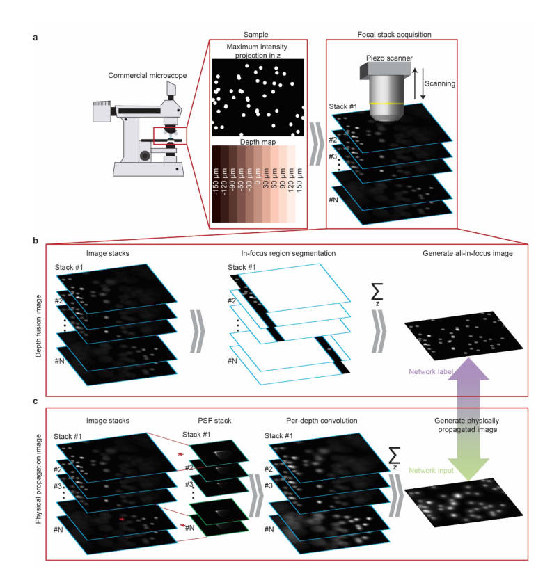

其中使用算法将每张图片中最清晰的部分提取出来，合并成一个all-in-focus图像，作为Ground-Truth。然后对每一张图片，使用本文设计的镜头在对应高度下的PSF进行卷积，最后再合并起来，得到近似的本文镜头拍摄的退化图象。二者作为配对数据送入pix2pix中进行训练。

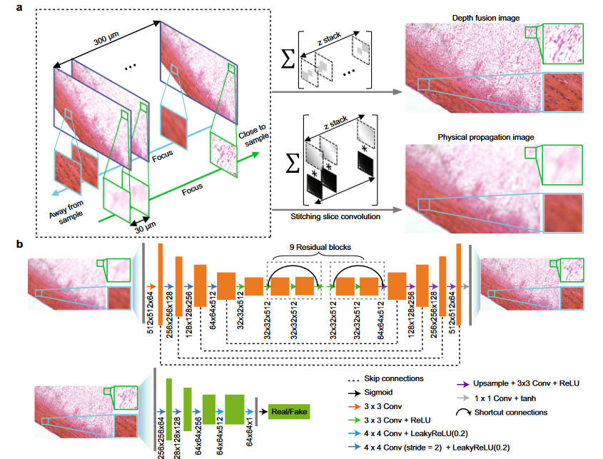

在PSF的标定方面很简单，用光刻技术直接在一块1mm厚的玻璃板子上刻了一系列1um的小孔，然后直接用镜头拍摄。

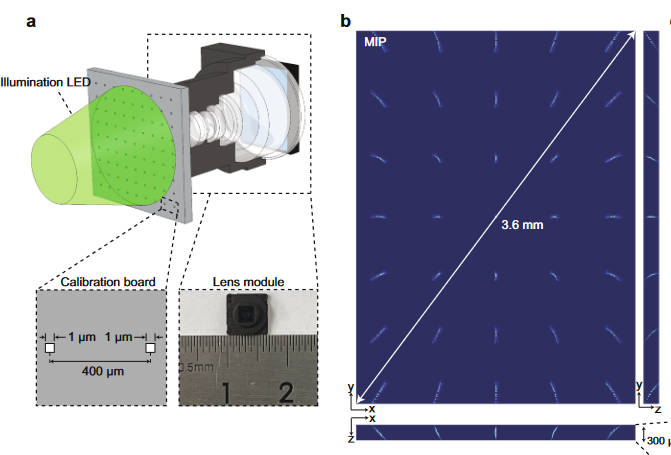

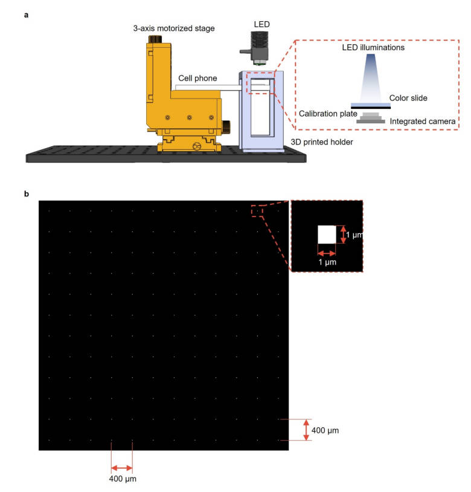

在如何对图片使用PSF卷积得到退化图像，本文建立了一个更细致的模型

由于相机系统拥有大FOV和大NA，导致PSF就更不像一个冲激函数了。为了解决这个问题，提出了一个考虑到PSF平移可变性的前向模型，并且优化了计算开销。假设具有平移可变性PSF的光学模型如下

$$
i(x,y)=\sum_{u,v,z}s(u,v)p(u,v,x-u,y-v,z)
$$

其中$(u,v)$和$(x,y)$分别是物平面和像平面的坐标，而$z$代表不同的深度，每个像$s(u,v)$都对应一个PSF矩阵，表示为$p(u,v,x,y,z)$。由上式也看得出来计算他要迭代所有PSF，复杂度很高，需要对其进行降维。作者这里的想法是进行矩阵分解，将PSF分成一系列基$h_i(x,y)$的加权和

$$
p(u,v,x,y,z) = \sum^N_{i} w_i(u,v,z)h_i(x,y,z)
$$

其中$N$是具有平移不变性的基$h_i$的个数。在实践上，对每个深度$z$，都只标定一共$M$个PSF，最后得到一个PSF集合$\{p(u,v,x_i,y_i,z)\},1\leq i\leq M$。这些PSF经过下采样、剪裁、向量化，最后合并成一个矩阵$\mathbf{P}$，同样的也有基矩阵$\mathbf{H}$和权重矩阵$\mathbf{W}$，于是我们就可以通过数值方法估计$\mathbf{H,W}$

$$
\mathbf{\hat H},\mathbf{\hat W}=\underset{\mathbf{H},\mathbf{W}}{\arg\min}||\mathbf{H}\times\mathbf{W}-\mathbf{P}||^2_2
$$

估计完成后，就可以将成像系统表示为

$$
i(x,y,z)=\sum^N_{i=1}\sum_{u,v}s(u,v)w_i(u,v)h_i(x-u,y-v,z)
$$

使用卷积表示则更简单

$$
i(x,y)=\sum^N_{i=1}\{(s(u,v)\times w_i(u,v))\ast h_i(u,v)\}[x,y]
$$

作者使用一个电动控制台和一个显微镜来获取训练数据。首先用显微镜在正好对上焦的位置拍摄一张图片（文中称作一个sample），然后在$[-150\mu m,150\mu m]$的范围上以$10\mu m$为步长移动显微镜来拍摄，从而得到一系列配对的训练数据。

似乎本文提出的镜头在PSF标定和使用方面就只有上面这些内容。下面的部分似乎是用于效果对比，将本文的神经网络方法和传统的PSF去卷积方法对比。

TODO：有待补完，Deconvolution部分本文说的很模糊，并且疑似有公式错误。

# A Physics-informed Low-rank Deep Neural Network for Blind and Universal Lens Aberration Correction

[https://openaccess.thecvf.com/content/CVPR2024/html/Gong_A_Physics-informed_Low-rank_Deep_Neural_Network_for_Blind_and_Universal_CVPR_2024_paper.html](https://openaccess.thecvf.com/content/CVPR2024/html/Gong_A_Physics-informed_Low-rank_Deep_Neural_Network_for_Blind_and_Universal_CVPR_2024_paper.html)

本文介绍了一种使用一组典型PSF来提取特征基，从而为像差建模的方法。

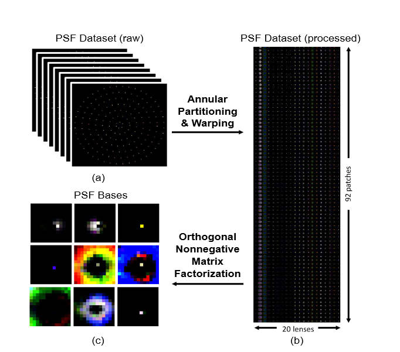

这里从Zemax里选出了20个PSF数据，因为PSF是具有旋转对称性的，于是又将一个平面上的PSF拆成多个同心圆环，然后再将圆环展开成长方形，将长方形前后拼合。最后将20个镜头的PSF长方形拼合起来得到一个矩阵，对其进行ONMF（正交非负矩阵分解）分解，得到一组基$\{B_i\}$，之后所有的PSF都可以由下式表述

$$
k=\sum_i\alpha_i\cdot B_i
$$

图像退化过程就可以由下式表述

$$
Y=X\ast(\sum_i\alpha_i\cdot B_i) + n = \sum_i(\alpha_i\cdot X)\ast B_i + n
$$

其中$X$是锐利图像，$Y$是退化图象，而$n$是噪声。

我们同样可以将退化图象进行分解，分解出模糊成分$\{Y_i=(\alpha_i\cdot X)\ast B_i\}$。之后，我们就可以通过预训练的方式，训练一个去卷积模型，通过预测参数$\alpha_i$的值来消除像差。

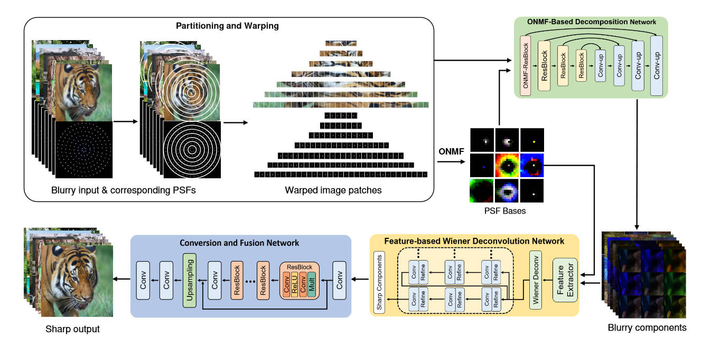

本文提出的方法主要分为三块。第一块负责将原图的模糊成分（特征）提取出来。

在训练过程中，使用Zemax及其中的PSF，来将一个锐利图像$X$合成出一个退化图象$\tilde{Y_i}=X\ast(\alpha_i\cdot B_i)$，然后将退化图像$\tilde{Y}$和基$B$一起送进基于U-net的网络中，输出模糊成分$Y_i$，使用的损失函数如下

$$
\mathcal{L}_{decom} = ||Y-\sum_iY_i||_2+\sum_i(Y_i-\tilde{Y}_i)
$$

其中第一项是为了让$Y_i$的加和和输入一样（我怀疑是不是符号有误），第二项是为了让每一项$Y_i$和合成的$\tilde{Y}_i$一样。

然后是第二部分，进行去卷积。本文提取出来的模糊成分和普通照片的特征区别挺大的，所以不能按常规的思路在空间域上进行去卷积，作者这里使用了在特征域上去卷积的方式。

$$
X^*_i=\arg\min||Y_i-X_i\ast B_i||
$$

在实现上，作者使用了一个基于特征的自适应维纳滤波网络，设$f_i$是可学习的线性滤波器集合，和$Y_i$进行卷积来获得有用的特征，于是

$$
F_iY_i=F_i(X_i\ast B_i)+F_in
$$

这里的$F_i$是$f_i$的傅立叶变换（作者能不能统一一下大小写，其他的大写都是空间域的，只有$F$是频域的）。于是，我们的优化目标也就等价于寻找一个维纳滤波操作$G_i$来进行像差矫正

$$
X_i^*=\arg\min||G_iF_iY_i-F_iX_i||
$$

最后误差函数是

$$
\mathcal{L}_{deconv} = ||F_iX_i-G_iF_iY_i||_2
$$

这里我个人觉得作者说的很乱，作者的意思看图可能更容易理解。首先将模糊成分$Y_i$送进特征提取器，提取特征得到$F_iY_i$，这个$F_i$似乎是可学习的，然后将其送入预训练的维纳滤波$G_i$中，这一部分是不可训练的。然后得到的$G_iF_iY_i$再经过一系列网络，输出了一个预测的$\hat X_i$。网络的目标是期望这个$F_i\hat X_i$和真实标注$F_iX_i$更接近。

目前来说将预估出来的$X_i$组合起来就得到了锐利图片，但事实上由于分解的不精确性和去卷积的伪影，最终会影响到图像质量。为此作者又提出了第三部分，基于注意力的混合模块。这个模块是一个可训练的网络，输入所有的锐利patch，输出一张完整的锐利的图。

# Rethinking Coarse-to-Fine Approach in Single Image Deblurring

[https://openaccess.thecvf.com/content/ICCV2021/html/Cho_Rethinking_Coarse-To-Fine_Approach_in_Single_Image_Deblurring_ICCV_2021_paper.html](https://openaccess.thecvf.com/content/ICCV2021/html/Cho_Rethinking_Coarse-To-Fine_Approach_in_Single_Image_Deblurring_ICCV_2021_paper.html)

这篇文章是盲去卷积。提出了MIMO-UNet模型。

这篇文章没有什么背景物理知识，纯粹的网络设计。在去模糊领域，经常用到多尺度信息，即把图片原图，还有各种下采样后的图片送入网络，进行特征提取。这主要是因为图像中的卷积核可大可小，然而你网络的卷积层的大小是固定的，如果要应对巨大的卷积核，你就不得不将卷积层设置的很大，很浪费算力。一种解决方案就是将不同尺度的图像送入网络，这样卷积核的感受野就大了，就相当于使用了大卷积核。

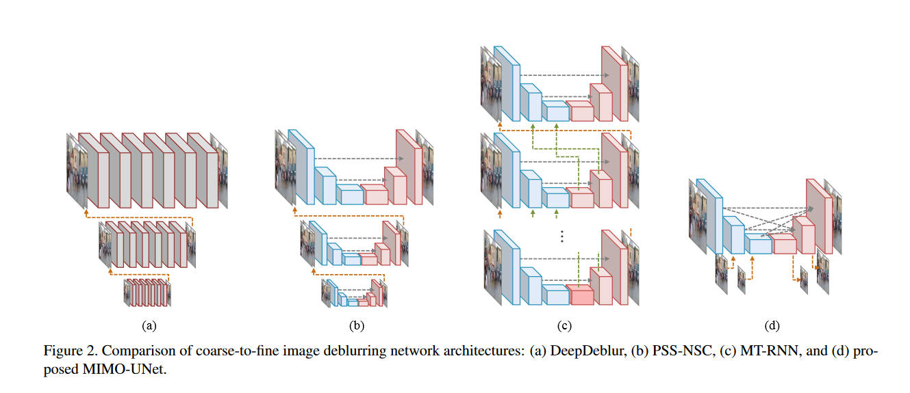

之前的工作，通常要训练多个网络来处理多尺度信息，本文提出了一个模型可以同时处理。

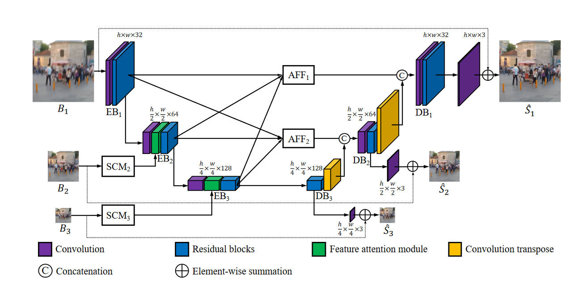

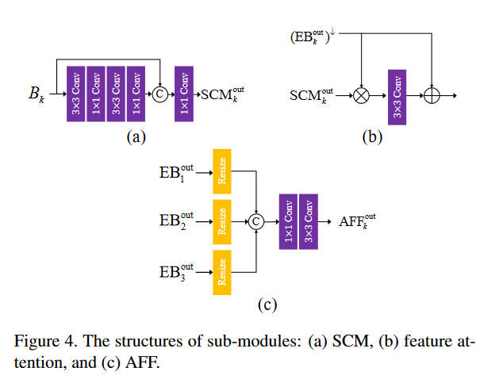

本质上是改进的UNet。其中SCM模块用于提取下采样图的特征，形式是典型的残差连接。由于UNet的每个阶段也要进行下采样，所以SCM提取的特征和UNet的某个阶段的特征尺寸一致，可以进行混合，这里用的是特征注意力混合，首先逐元素相乘，然后通过卷积层，然后再和编码器的特征相加。

这里的UNet的编码器部分可以看作是多输入的编码器，而解码器部分就是多输出的编码器了。之前的多尺度网络有多个网络可以分别训练，而这里的UNet需要将中间的状态提取出来计算误差。从网络结构图中可以看到，从DB中的蓝色部分拿出来特征，通过单个卷积层，然后通过残差连接的方式加上下采样图，得到该尺度下的去模糊图。

传统的多尺度方法，通常信息只能从粗糙层传导到精细层，本文提出了一个AFF模块，让信息往上往下都可以传递。在编码器的信息传入时，要先考虑该层的层级，然后缩放到合适的大小，过大的要下采样，过小的要上采样，拼接在一起，然后卷积。

损失函数如下

$$
L_{total}=L_{cont}+\lambda L_{MSFR}
$$

其中

$$
L_{cont} = \sum^K_{k=1}\dfrac{1}{t_k}||\hat S_k-S_k||_1
$$

其中$k$代表层级，而$t_k$是元素总数，用于归一化。

$$
L_{MSFR}=\sum^K_{k=1}\dfrac{1}{t_k}||\mathcal{F}(\hat S_k)-\mathcal{F}(S_k)||_1
$$

这是在频域上的误差，主要是为了保护高频信息。

# Single Image Defocus Deblurring via Implicit Neural Inverse Kernels

[https://openaccess.thecvf.com/content/ICCV2023/html/Quan_Single_Image_Defocus_Deblurring_via_Implicit_Neural_Inverse_Kernels_ICCV_2023_paper.html](https://openaccess.thecvf.com/content/ICCV2023/html/Quan_Single_Image_Defocus_Deblurring_via_Implicit_Neural_Inverse_Kernels_ICCV_2023_paper.html)

这篇文章是盲去卷积。提出INIKNet模型

首先还是来看一下这篇文章怎样建模去卷积这个问题的，关于退化，有

$$
y = k\ast x
$$

其中$k$是PSF，$y$是退化后图像，$x$是理想的锐利图像。记$\mathcal{F}$为离散傅里叶变换，那么上式等价于$\mathcal{F}(y)=\mathcal{F}(x)\odot \mathcal{F}(k)$，根据朴素的去卷积方式，我们就可以求出PSF的（伪）逆

$$
\mathcal{F}(k^\dagger)[\omega_x,\omega_y]=(\mathcal{F}(k)[s])^{-1},\quad if\quad |\mathcal{F}(k)[\omega_x, \omega_y]|\neq 0
$$

为了避免除以零，当$|\mathcal{F}(k)[\omega_x, \omega_y]|=0$时上式取$0$。于是去卷积的过程就表述为

$$
\mathcal{F}(x)=\mathcal{F}(k^\dagger)\odot \mathcal{F}(y)\Rightarrow x=k^\dagger\ast y
$$

上式的$\omega_x,\omega_y$和$s$文中没有具体标明是什么意思，我认为应该就是矩阵下标。目前这个公式还不能应对随空间变化的PSF，记$\mathbb{K}^\dagger=\{k^\dagger_{i,j}\}_{i,j}$为逆核集合（没有写明下标的含义，也没有解释为什么两个下标是一样的），于是去卷积的过程就可以用一个过程$\mathcal{C}$表示

$$
\mathcal{C}(y;\mathbb{K}^\dagger)[i,j] = \sum_{x,y}k^\dagger_{i,j}[x,y]y[i-x,j-y]
$$

上式的意思其实就是每个像素点都有一个自己的PSF，分别进行进行去卷积。由于PSF的尺寸是和物距有关的，当拍摄的场景中，各部分的物距差异很大，则PSF的尺寸差异也会很大。如果不对$\mathbb K^\dagger$加以约束，在去卷积时就会有过拟合的现象。于是作者提出了一个多尺度的方法。

这个方法将逆核$k^\dagger$用一组基$V=[v_1,\cdots,v_N]$来表示（虽然原文用的是dictionary这个词而不是basis）

$$
k^\dagger=w_1v_1+\cdots+w_Nv_N
$$

其中$w_1,\cdots,w_N\in R$，是权重。这个方法大大降低了表述所有像素的PSF所需要的空间。为了应对不同的PSF尺寸，可以使用上采样的方式。作者这样做是观察到同一位置的PSF，在不同物距的情况下，差异更多是尺寸上的，但不是形状上的。

记$\mathcal{U}_s$为标准二元（dyadic）上采样算子，其中$s$是上采样的倍数（我估计可能是整数），有

$$
(\mathcal{U}_s(k))^\dagger = w_1\mathcal{U}_s(v_1)+\cdots+w_N\mathcal{U}_s(v_N)
$$

这是可以证明的（在补充材料中）。于是，我们就可以使用不同尺度下的基来表述不同尺度下的PSF，记这种缩放后的基为$\{V^r\}^R_{r=1}$

$$
V^r=[v_1^r, \cdots, v_N^r]\subset R^{M_r\times M_r}, v_n^r = \mathcal{U}_{S_r}(v_n)
$$

其中$v_n^r$是第$r$个放大尺度下的基元素，$S_r$指的是该尺度下的上采样倍数，决定了$M_r$的大小。当$r$增大时，$S_r$增大，而$M_r$减小。

在下一步之前，我有必要探讨一下作者到底在说什么。首先，$v_1,\cdots,v_n$一定是矩阵，尺寸同$k^\dagger$。作者在记$V=[v_1,\cdots,v_N]$时，用的是方括号，而非花括号，虽然我们明知$V$应该是个集合。同样的，$V^r$应该也是个集合，而$\{V^r\}^R_{r=1}$应该是集合的集合，但作者却用了sub-dictionaries这个词，令人费解，按理来说应该是meta-之类的前缀才对。

现在我们主要关注一下为什么说$M_r$会减小一定是个笔误，作者的原话是$S_r$ denotes an upsampling factor that determines the size parameter $M_r$ of the atom. 可以知道$M_r$是一个尺寸参数。从$V_r\subset R^{M_r\times M_r}$这个表述来看，$M_r$似乎是一个标量。我们已经注意到，前文显然有使用过$k^\dagger[x,y]$这样的表述，表示$k$是集合$R^{M\times M}$中的一个元素，即$k\in R^{M\times M}$，同理可以推出$v_n^r\in R^{M_r\times M_r}$，当$V_r$是由$v_n^r$组成的集合时，$V_r\subset R^{M_r\times M_r}$是符合含义的。我们注意到在补充材料中，有$\mathcal{U}_s: R^{H\times W}\to R^{sH\times sW}$，所以当$r$增大时，如果$S_r$在增大，$M_r$是会增大的。

回到原文，我们可以用新的基来表示逆核

$$
k^\dagger_{i, j} = w_{1,i,j}v^{r_{i,j}}_1 + \cdots + w_{N,i,j}v^{r_{i,j}}_N\in R^{M_{r_{i,j}}\times M_{r_{i,j}}}
$$

其中$r_{i,j}$代表的是该像素下的缩放因子。注意到，每个$V^r$集合中的元素都只能用于表示特定尺寸的逆核。

由于冲激函数的筛选性质，有$v_n^{r_{i,j}}\ast y = \sum_r\delta(r-r_{i,j})v^r_n\ast y$，我们可以将之前的过程$\mathcal{C}$重写为

$$
\mathcal{C}(y)=\sum_{i,j}1_{i,j}\odot (\sum^N_{n=1}w_{n,i,j}v_n^{r_{i,j}}\ast y)
$$

其中$1_{i,j}$指的是一个矩阵，只在$i,j$这个下标下取$1$，其他位置取$0$。如果记$\mu_{r,i,j}=\delta(r-r_{i,j})$，那么有

$$
\mathcal{C}(y)=\sum_{i,j}1_{i,j}\odot (\sum^N_{n=1}\sum^R_{r=1}\mu_{r,i,j}w_{n,i,j}v_n^{r}\ast y)
$$

直觉上进行理解的话，$\mu$控制的是逆核的尺寸，而$w$控制的是形状。后面的模型分别预测$\mu,w,v$，来实现这个去卷积过程。

作者说，简单的上采样$v$，表达能力还不够，不能处理高频信息，于是使用了一个叫INR的模型

$$
v_n^r[x,y] = \Phi_n(x,y),\ \ [x,y]\in[1,\cdots, M_r]\times(1,\cdots, M_r)
$$

其中$\Phi$是INR模型，使用一个MLP来实现。

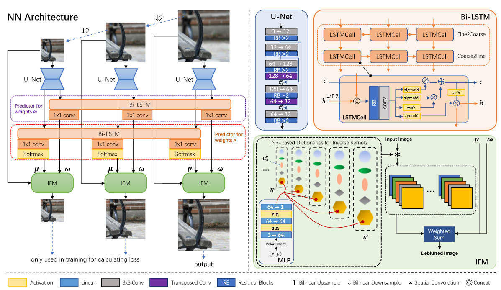

本文的网络模型使用了一种改进的、基于LSTM的，coarse-to-fine的架构。首先我们要明白一件事，在这里面，原始分辨率是精细的（fine），而下采样的图片是粗糙的（coarse），这很直观。上图的Bi-LSTM就先通过精细的图像特征来改善粗糙图像上的预测，然后粗糙图像上的特征再反过来改善精细图像上的预测。这里预测的是前文提到的$\mu$和$w$

损失函数如下

$$
\mathcal{L}=\sum_p\mathcal{L}^{(p)}_{MSE}+\lambda_1\mathcal{L}_{FD}^{(p)}+\lambda_2\mathcal{L}_{LPIPS}^{(p)}
$$

其中$\mathcal{L}_{FD}$指的是频域的$\ell_1$距离，上标$(p)$表示的是第$p$个缩放尺度。缩放的GT是用未缩放的GT缩放得到。

# Image restoration for optical zooming system based on Alvarez lenses

[https://opg.optica.org/oe/fulltext.cfm?uri=oe-31-22-35765&id=540720](https://opg.optica.org/oe/fulltext.cfm?uri=oe-31-22-35765&id=540720)

本篇解决了基于Alvarez镜头组的光学变焦系统的图像恢复问题，有很多光学设计的内容，不过我不懂，除去这一部分的话本文内容不多。

首先是获取配对数据，仍然是使用锐利图像，然后卷积上PSF得到退化图像。对于图像恢复部分，本文基于MIMO-UNet进行了修改

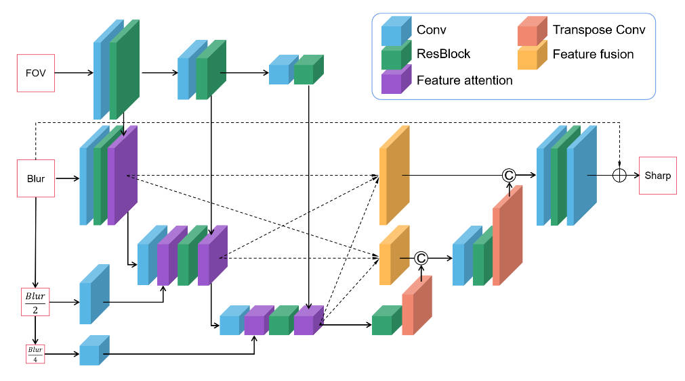

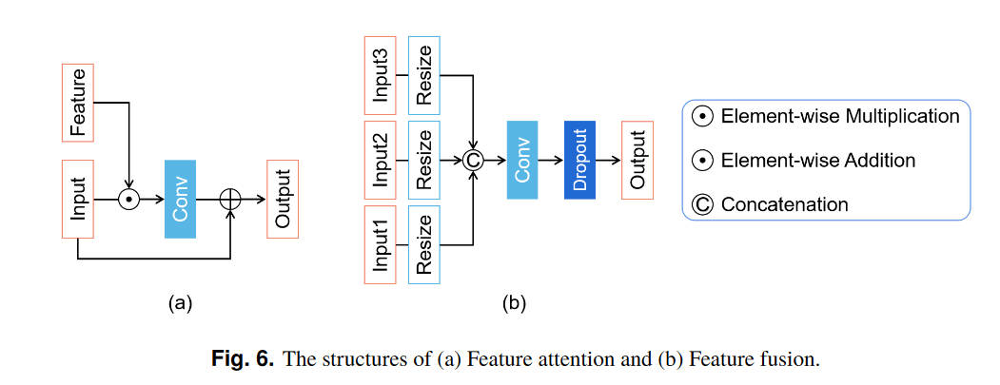

损失函数使用CharbonnierLoss

$$\
Loss=\sqrt{(output-input)^2+\epsilon^2}
$$

# Neural nano-optics for high-quality thin lens imaging

[https://www.nature.com/articles/s41467-021-26443-0](https://www.nature.com/articles/s41467-021-26443-0)

本文针对超透镜进行校正。

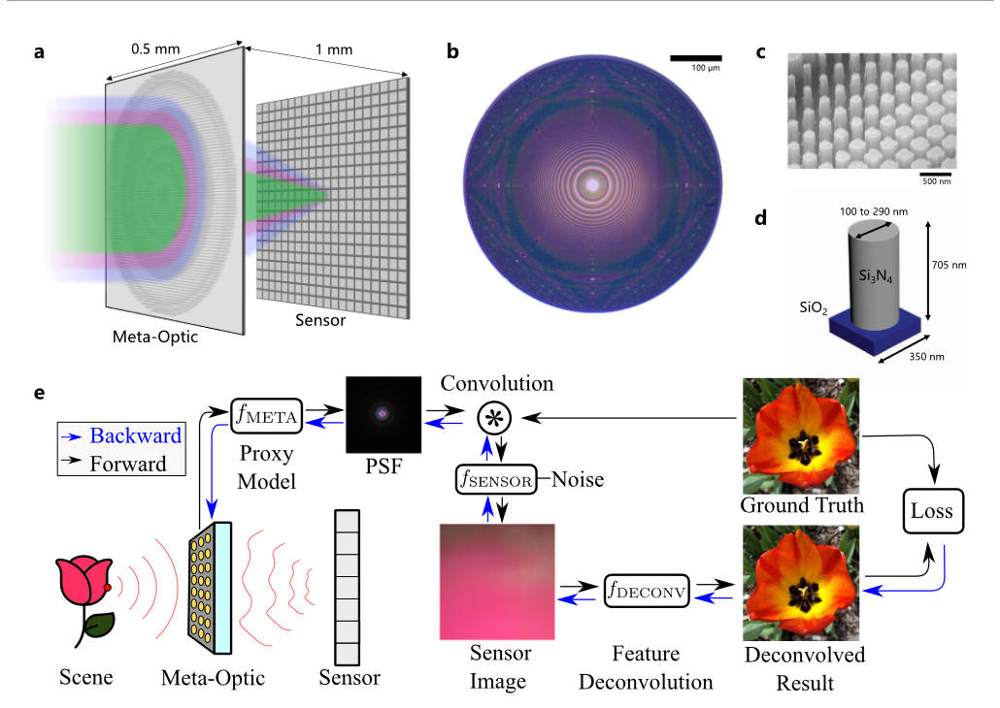

本文将超透镜的设计融入到了训练过程中，超透镜的参数可由下式表述

$$
\phi(r)=\sum^n_{i=0}a_i\left(\dfrac{r}{R}\right)^{2i}
$$

由于笔者不是很清楚光学设计，所以就把这里简单当做一个函数，参数可调，场景用其获取能产生一些数值。

上图描述的是整个端到端的流程，其可以用下式表述

$$
O=f_{\text{DECONV}}(P_{\text{DECONV}}, f_{\text{SENSOR}}(I\ast f_{\text{META}}(P_{\text{META}})), f_{\text{META}}(P_{\text{META}}))
$$

其中$P_{\text{META}}$就是超透镜的参数，使用函数$f_{\text{META}}$计算出理论PSF，和输入信号进行卷积（在训练过程中是数据集的gt图像）。$f_{\text{SENSOR}}$模拟传感器的行为，其中包含了传感器的噪声。然后就是去卷积的神经网络$f_{\text{DECONV}}$，其参数为$P_{\text{DECONV}}$，接受传感器产生的图像，并且由于是非盲，也接受PSF，最终生成一张预测的清晰图像。损失函数就是gt和预测之间的L1损失。

在联合优化过后，就使用最优的超透镜参数去制造超透镜物理实体。

# End-to-end hybrid refractive-diffractive lens design with differentiable ray-wave model

[https://dl.acm.org/doi/full/10.1145/3680528.3687640](https://dl.acm.org/doi/full/10.1145/3680528.3687640)

这篇文章首次提出一个可微分的、精度高的折射-衍射混合成像模型，来让镜头设计和神经网络结合在一起，从而能够端到端的进行训练。

同前，光学部分不是很懂，简要介绍一下提到的公式。

本文的镜头组如下图

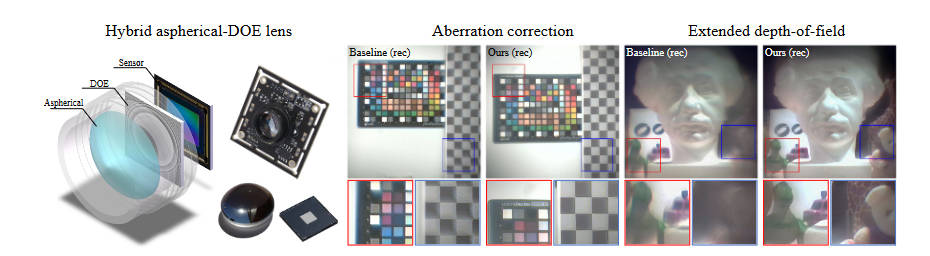

他首先是一连串折射镜片，最后接上一个衍射镜片（衍射光学元件，DOE），然后再接到传感器上。在模拟这个镜头的物理性质时，使用了一种光线-光波结合的方法，在前面的折射镜片上使用光线追踪，而在后面的DOE上使用相位调制等方法去分析。

蒙特卡洛光线追踪的过程可以表示如下

$$
\left\{\begin{matrix}
\mathcal{I}_n(\mathcal S_n):(o^{n-1}, d^{n-1},\phi^{n-1},\lambda)\to (o^{n}, d^{n-1},\phi^{n},\lambda)\\
\mathcal{R}_n(\mathcal S_n):(o^{n}, d^{n-1},\phi^{n},\lambda)\to (o^{n}, d^{n},\phi^{n},\lambda) \\
(o,d,\phi,\lambda)=(\mathcal{R}_N\mathcal{I}_N\dots\mathcal{R}_1\mathcal{I}_1)(o^0, d^0, \phi^0, \lambda)
\end{matrix}\right.
$$

其中$\mathcal{I}$指的是光线与平面$\mathcal{S}$的相交，$\mathcal{R}$指的是光线在平面$\mathcal{S}$上的折射，$o,d,\phi,\lambda$分别是位置、角度、相位、波长。当计算完所有折射后，光线就抵达DOE前表面，此时可以计算光场为

$$
U_{DOE^-}=\sum^{spp}_{i=1}u_i\exp(j\phi_i)\cos<d_i, n>
$$

其中$u_i$是振幅，$\phi_i$是光线$i$的相位，$spp$是蒙特卡洛采样的光线数，$n$是DOE表面的法向量。在DOE的调制过后，光场可以写为

$$
U_{DOE^+}=U_{DOE^-}\exp\left(j\dfrac{n_\lambda-1}{n_0-1}\dfrac{\lambda_0}{\lambda}\phi_0\right)
$$

计算完之后，我们就可以算出传感器表面的光场

$$
U_{Sensor}=\mathcal{F}^{-1}(\mathcal{F}(U_{DOE^+})H)
$$

其中$H$是传递函数，之后PSF计算如下

$$
PSF=|U_{Sensor}|^2
$$

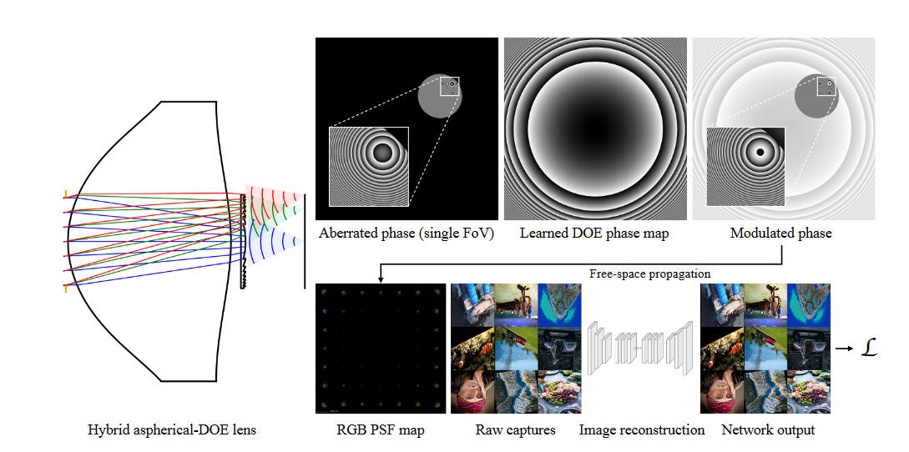

在实验中，作者计算了10x10个RGB PSF。同样，使用PSF来和图像卷积，构造出退化图像。之后使用NAFNet作为图像恢复模型，损失函数如下

$$
\mathcal{L}=\mathcal{L}_{pixel}(\mathcal{N}(PSF\ast I), I) + \alpha\mathcal{L}_{percep}(\mathcal{N}(PSF\ast I), I)
$$

其中$I$是输入图像，也被当做ground truth使用，$\mathcal{N}$代表着NAFNet，$\mathcal{L}_{pixel}$代表均方误差，$\mathcal{L}_{percep}$代表着VGG loss。

# Grayscale to Hyperspectral at Any Resolution Using a Phase-Only Lens

[https://arxiv.org/abs/2412.02798](https://arxiv.org/abs/2412.02798)

这篇文章主要面向metalens的像差矫正。本文使用的相机由一个衍射元件和一个无滤镜的传感器组成，获取到多个波长的光线，输出的是一个加和的灰度图。本文的目标是从这个灰度图中恢复出31个通道的图像。使用的是一个conditional denoising diffusion model

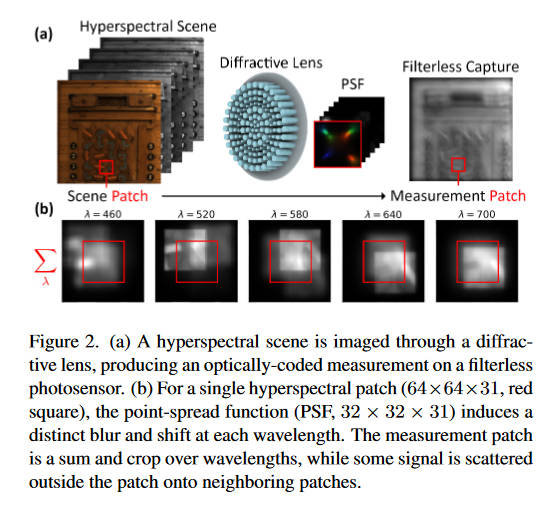

一个高光谱图像（HSI），记作$\mathbf{x}\in\mathcal{R}^{H\times W\times C}_{\geq 0}$，被传感器测量后变成单通道的$\mathbf{y}\in\mathcal{R}^{H\times W}_{\geq 0}$，成像的过程为

$$
\mathbf{y}(u,v)=\mathcal{M}(x)=\sum_\lambda o(\lambda)\cdot f(u,v,\lambda) \underset{(u, v)}{\ast} \mathbf{x}(u,v,\lambda)
$$

其中$f(u,v,\lambda)$是PSF，$\lambda$是波长。$o(\lambda)$是传感器的光谱响应。于是对于高光谱图像的测量就变成了一个线性的编码过程，将3D的高光谱“体”编码成2D“图”。这里的PSF测量似乎不是本文的重点，根据附录来说PSF似乎是理论计算值，整个实验是在合成数据上进行的。

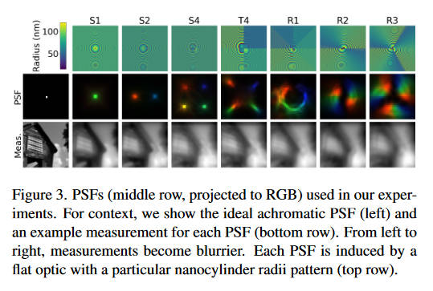

在本文的实验中使用了8个PSF，目的是为了测试哪种光学编码器（指的应该是衍射元件而非神经网络中的编码器）是最好的。左边的PSF较为稀疏，能够产生更锐利的图像，但是编码光谱信息的能力比右边的PSF弱。因为重建任务需要同时保持空间和光谱的高准确性，所以哪种PSF较好并不是很显然。

这上面的每一种PSF都可以通过设计合适的metalens来在物理上实现。我认为作者的逻辑应该是先用这八种PSF去测试，看哪种效果最好，然后依照最好的这个PSF来生产metalens。

本文使用扩散模型来解决图像恢复问题，但并不是整张图上进行，而是分patch进行，作者说从实验结果上来看这样是更好的。

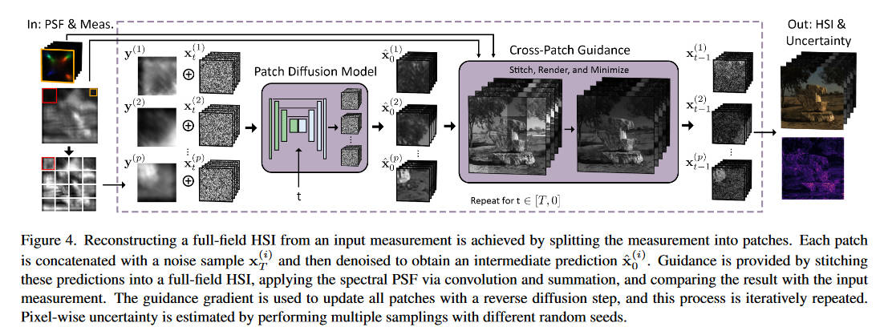

训练数据是从ARAD1K中获取的HSI，然后使用我们前面介绍的成像模型来合成退化图像，然后就得到了配对数据$(x_0^{(i)}, y^{(i)})$。看起来作者意识到它的合成过程中，卷积计算涉及到了patch以外的信号，但是结果上来说影响不大。

同上图介绍的，往扩散模型中添加condition是通过将$x,y$拼在一起实现的，然后让模型在每一步的中间都输出一个预测的HSI$(\hat{\mathbf{x}}^p_0)$，再将他们拼成一张大图，使用前述成像过程进行一次退化，让它的结果和真实标签$y$一致，作者说用这个方法引道全局的去噪过程。如下

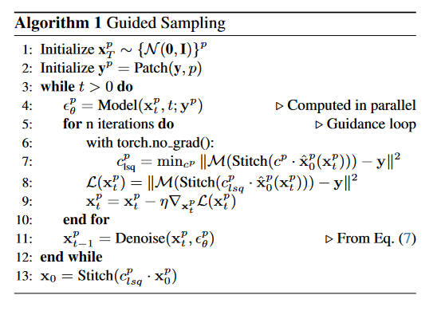

其中上标$p$代表patch，$Stitch$代表这个拼图的过程，$\mathcal{M}$就是前面的成像过程。由于$y$和$x_0$是max-normalized的，所以模型预测出来的HSI是带有一个未知的比例因子的，为了校正这个比例因子，多了一步过程，也就是这个cross-patch guidance。

（上图有误，应该是$\arg\min$）将$\hat x$乘以一个因子再拼起来，然后经过成像模型退化，尽量和标签$y$一致，取这个最好的因子$c$，再取和标签的误差，作为优化$x_t$的误差。将$x_t$优化后再放入扩散模型的去噪过程中。

最后按照这个模型走$T$步去噪过程，就得到了最终预测的HSI。作者将光谱的不确定性量化如下

$$
\text{Uncertainty} = \sum_{\lambda}\text{Var}(\{\mathbf{x}_0\}^N_{i=0})
$$

一共预测了$N$次。

# Achromatic Single Metalens Imaging via Deep Neural Network

[https://pubs.acs.org/doi/abs/10.1021/acsphotonics.3c01870](https://pubs.acs.org/doi/abs/10.1021/acsphotonics.3c01870)

本文也是针对metalens进行像差矫正，但是没有引入PSF数据。模型没什么特别的，主要关注一下成像模型和数据获取方式。

首先介绍一下本文使用的成像模型

$$
I_{sensor} = C(\mathbf{w}\cdot\mathbf{v}\cdot e\mathbf{D}(T(I_{gt}(\lambda))_{H^{-1}}\ast PSF(\lambda))+n)
$$

其中$I_{sensor}$是相机获取到的图像，$I_{gt}(\lambda)$是真实图像的该波长下的分量，$T$指的是一个转换函数，将gt图像转化成显示屏上的图像。相机获取的一部分数据实际上是对着显示屏拍。

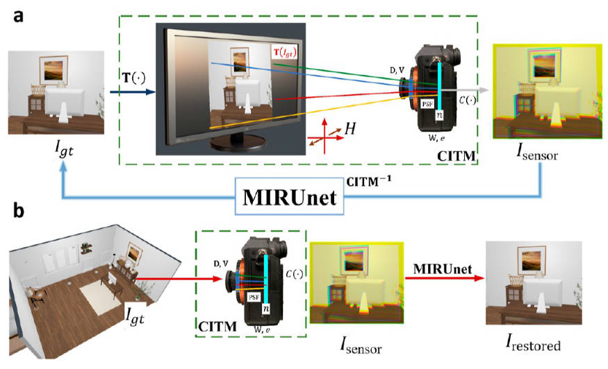

$PSF(\lambda)$是在该波长下的PSF，$\ast$是卷积，$\mathbf{W}$是色彩平衡矩阵，$\mathbf{V}$代表晕影，$H$代表透视投影矩阵，$D$代表镜头畸变，$e$是曝光参数，$n$是噪声，$C$是剪裁函数，剪裁最大最小信号值。

本文是盲去卷积，没有使用测量的PSF。作者认为是metalens的测量比较困难，而且和波长相关，并且PSF通常还不是uniform的。

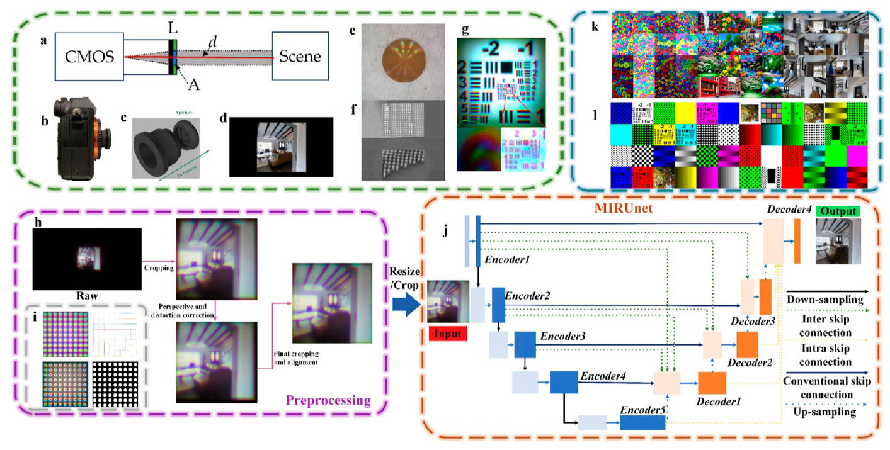

上面的成像模型很全面，但是本文主要只关注彩色图像的质量增强，于是就只保留了$\mathbf{w},\mathbf{v},PSF$这三项，其他的项在数据采集的过程中去除。其中，曝光参数的去除是通过手动设定相机曝光实现的。镜头畸变和透视投影是通过拍摄test charts来去除的。去除过程见上图h部分。gt到显示器的转移矩阵是通过校正显示器去除的。

可以从上图的g部分看到有效性，矫正过的图片在几何上和gt高度相似，在雾状退化、分辨率降低等方面就证实了我们只剩下前述的3项需要矫正。

矫正就没什么好说的，UNet一把抓。损失函数是

$$
\mathcal{L}=\alpha L_{Perceptual}+\beta L_{PSNR}
$$

$$
L_{Perceptual}=\sum^n_{i=m}\beta_il_{p_i}(I_{gt}, I_{restored})
$$

$$
l_p(I_{gt}, I_{restored}) = ||P(I_{gt})-P(I_{restored})||^2
$$

$P(\cdot)$指的是预训练的VGG19，$i$是指模型的第$i$个卷积层。

$$
L_{PSNR} = \dfrac{1}{(10\log 10((I_{max}^2)/MSE(I_{gt}, I_{restored})))}
$$

# Deep-learning-driven end-to-end metalens imaging

[https://www.spiedigitallibrary.org/journals/advanced-photonics/volume-6/issue-6/066002/Deep-learning-driven-end-to-end-metalens-imaging/10.1117/1.AP.6.6.066002.full](https://www.spiedigitallibrary.org/journals/advanced-photonics/volume-6/issue-6/066002/Deep-learning-driven-end-to-end-metalens-imaging/10.1117/1.AP.6.6.066002.full)

本文也是对超透镜进行像差矫正，同样也没用到标定的PSF。

虽说训练的时候没用到标定的PSF，但是本文也介绍了一下为什么metalens的像差这么大

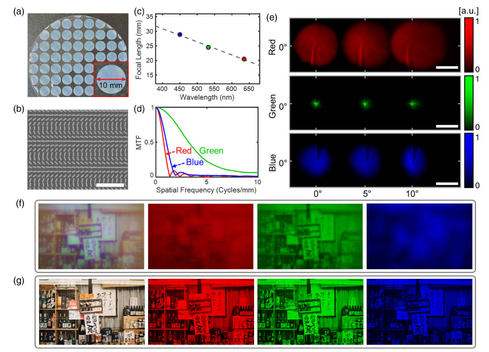

实际上metalens的各个波长下的焦距差异很大，如上图c，这在一般的折射镜头里不会差异这么大。于是就导致了，如果你绿色对上焦了，那么红色和蓝色就对不上焦了，可以从上图f中看出一些问题，这里的绿色是最清晰的。这种取决于波长的焦距就导致了轴向色差，

$$
TAC = |f-f_0|\dfrac{D}{2f}
$$

其中$f$是该波长在特定入射角下的焦距，$f_0$是metalens和sensor之间的距离，$D$是metalens的直径。从上图e和d中可以看出，在同一个距离下测出来的三通道的PSF差异巨大。

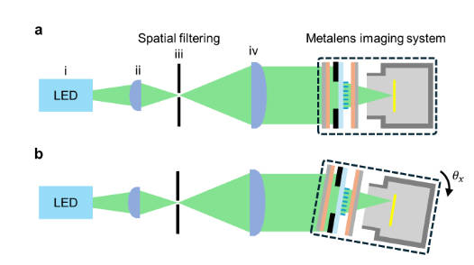

本文在测量PSF的时候还会将相机进行旋转，测出不同入射角下的PSF。结果显示有也有较大差异。

为了解决这个像差问题，作者使用了深度学习方法。

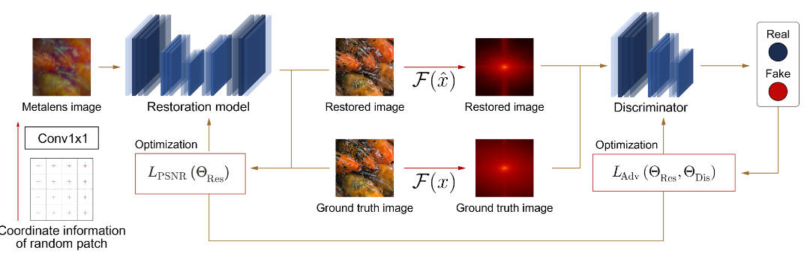

作者说因为生成式模型可以学习到复杂、高维的信息，所以就采用了对抗学习的架构。起初作者是在RGB空间域上进行对抗学习的，但是观察到恢复出来的图像有一些周期性的pattern，

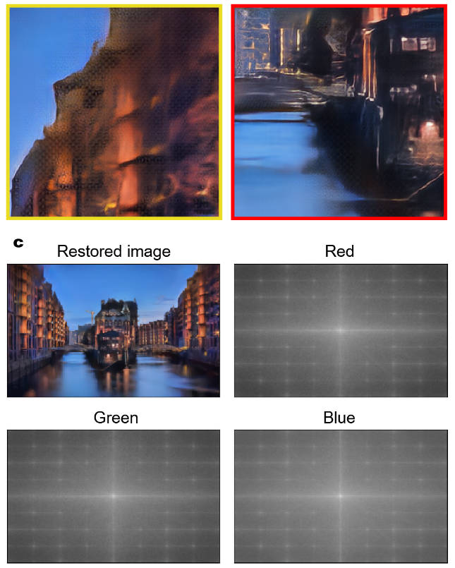

无论是RGB域还是频域都有这个问题，在频域上更加明显。于是作者就直接在频域上进行对抗学习了，GAN架构中的判别器判别的是频域的真伪。训练损失分为保真度的损失和GAN的损失

$$
L_{Total}=L_{PSNR}+\lambda L_a
$$

$$
L_{PSNR}(\hat x, x) = -10\log\dfrac{R^2}{MSE(\hat x, x)}
$$

$$
L^D_a=\mathbb{E}[\max(0, 1-D(\mathcal{F}(x)))] + \mathbb{E}_{\hat x}[\max(0, 1+D(\mathcal{F}(\hat x)))]
$$

$$
L_a^G=-\mathbb{E}_{\hat x}[D(\mathcal{F}(\hat x))]
$$

其中$\mathcal F$是傅里叶变换。

由于图像退化在边缘的部分比在中央的部分更严重，所以提供必要的位置信息给模型是有用的。而目前模型只是在各个patch上进行图像恢复，顺序随机，没有引入位置信息。本文将每个patch的在原图中的位置先收集起来，然后用一个$1\times 1$的卷积层进行映射。将这个映射后的位置信息和metalens图片接在一起，再放到恢复模型中进行图像恢复。

之后是本文的数据获取部分。

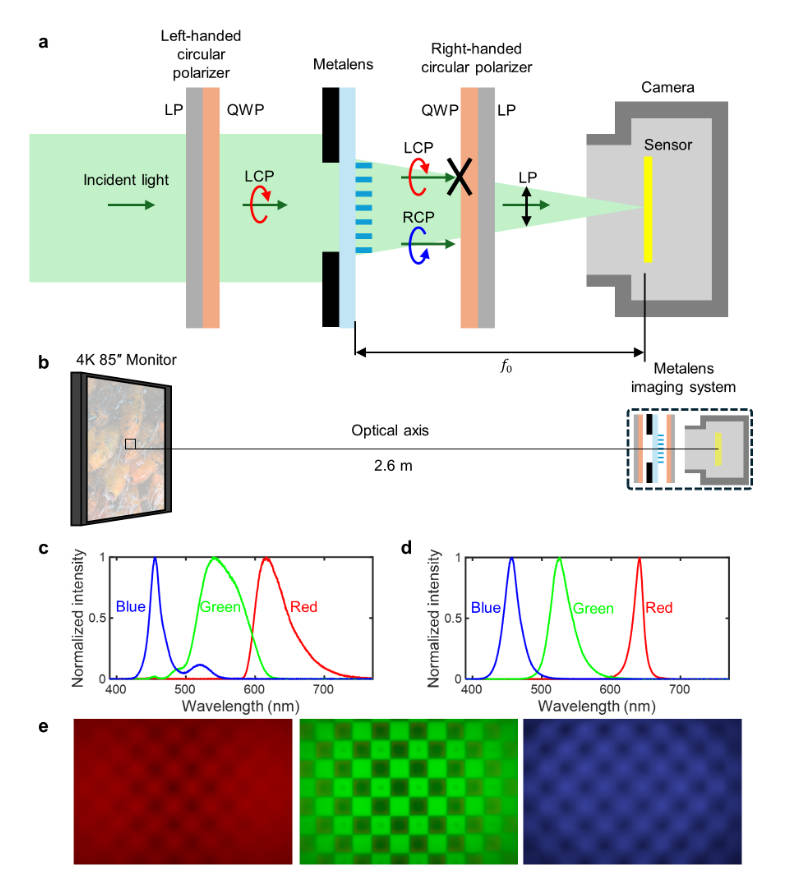

经典拍屏幕。使用的是DIV2K数据集，当然，由于这个metalens的fov限制，只拍了图像中心的1280x800的区域。

# Realistic Image Degradation with Measured PSF

[https://arxiv.org/abs/1801.02197](https://arxiv.org/abs/1801.02197)

这篇文章虽然是反过来模拟像差的，但很多文章是用合成数据的，这篇文章也可以进行一定了解。

本文采集的PSF是用高精度仪器采集的，不是用我们之前说到的各种数值和深度学习方法，用的是单色滤镜，所以只有单通道的PSF。一共测试了27个镜头，有三个参数：离焦$\Delta z$、图像高度$R$、
方位角$\phi$。

由于这个测量的精度很高(0.3um)，比传感器的像素尺寸(3um)小的多，所以可以进行下采样来提升效率。在本文中，下采样至大约6um的像素大小，得到一个13x13的PSF。

作者这里是想对每一个像素都卷积一个专属于它的PSF，从而达到比较好的结果。为此，作者将之前测量到的PSF作为gt，将$\Delta z$、$R$、$\phi$作为数据输入，让神经网络拟合出PSF。然后对每一个像素都预测一个PSF。但作者认为这又太麻烦了，PSF在短距离内变化不大，不如直接用插值的方法去弄。

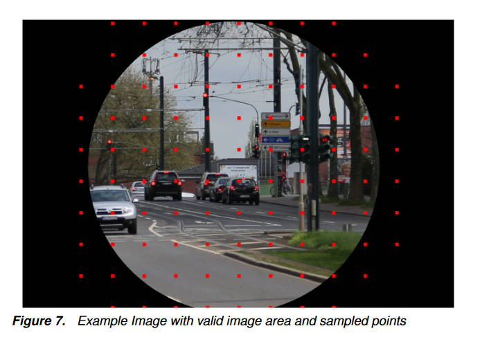

上面的红点是有测量过PSF的位置，其他位置通过双线性插值得到。

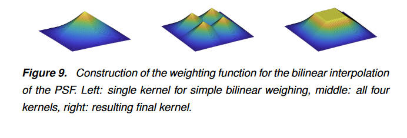

之后使用插值的或真实的PSF对图像卷积就得到了退化图像，同时为了减小拍摄图像自带的退化，还对数据提前使用了盲去卷积。

但是在模拟退化的这个过程中，没有考虑到离焦距离$\Delta z$，作者后面说了一大堆提出的PSF模型有$\Delta z$的好处，但我并没有看到和计算退化有什么关系，整篇文章都很乱。
