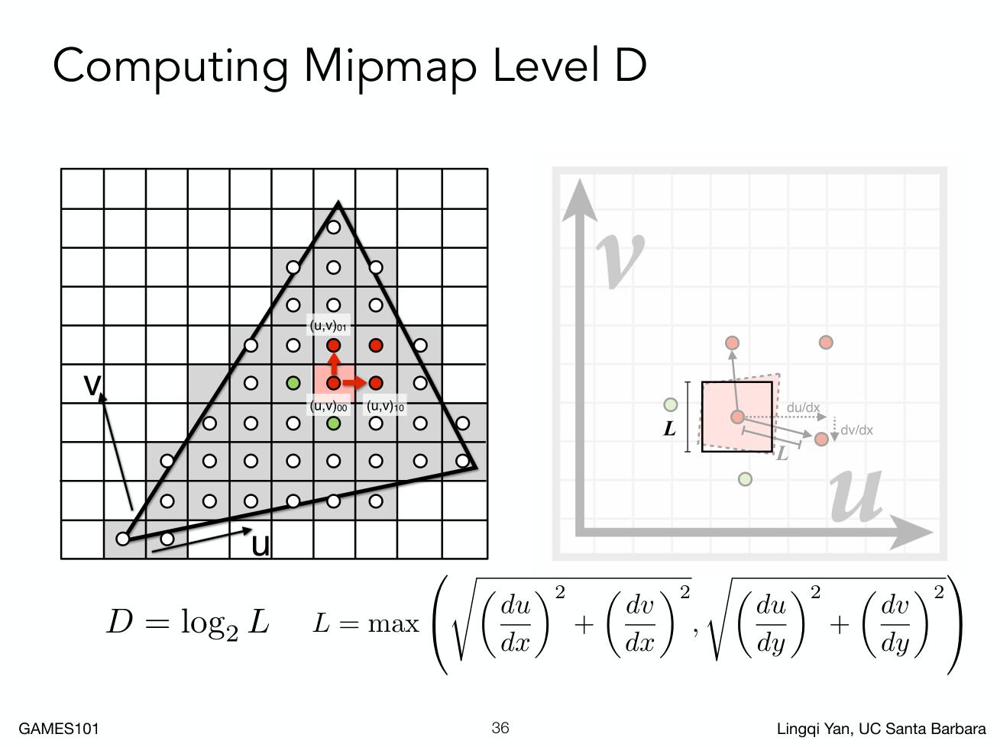

## 纹理映射

纹理映射流程如下

对于每个光栅化的屏幕采样点$(x,y)$（通常是像素的中心点）

1. 令$(u,v)$为纹理上对应于$(x,y)$的坐标
2. 对纹理上$(u,v)$进行采样
3. 将采样得到的颜色作为光栅化需要使用的颜色

## 纹理放大

### 双线性插值

现在假设纹理上需要采样的点的坐标为(x,y)，显然这个点会落在某个$2\times2$的像素矩形中。

设左下角的像素为$u_{00}$，左上$u_{01}$，右下$u_{10}$，右上$u_{11}$

设左下角像素中心点为原点建立坐标系。横轴记为s,纵轴记为t。则$u_{00}=(0,0)$,$u_{10}=(1,0)$,$u_{01}=(0,1)$,$u_{11}=(1,1)$

记采样点(x,y)在这个坐标系下的坐标为$(s,t)$

设函数$lerp(x,v_0,v_1)=v_0+x(v_1-v_0)$

这个函数的意义是，假设直线上两个点的值为$v_0,v_1$，$x$为这两个点间的坐标，$x$在$x_0$处等于$0$，在$x_1$处等于$1$。此时所得的函数值为$x$处的插值。

现在我们可以对$(s,t)$这个点进行插值，首先定义

$$
u_0 = lerp(s,u_{00},u_{10})
u_1 = lerp(s,u_{01},u_{11})
$$

得到这两个点后再进行一次插值得

$$
f(x,y) = lerp(t,u_0,u_1)
$$

当然也可以先进行垂直的插值，再水平插值。

### 双立方插值

TODO

## 纹理缩小

### Mipmap

当一个像素代表了纹理中的一大块时，需要进行纹理缩小。

之前介绍的超采样等是可以使用的，只不过这样会导致开销过大。

我们需要找到一种办法直接对区间求平均值。

引入Mipmap的概念。它允许快速的、近似的（而非准确的）、方形的范围均值查询。

假设第0层是原纹理图像（方形）。

则第1层是将长宽各缩小为一半，所所放出来的纹理。第2层则为第1层缩小一半，以此类推直到只有一个像素。

额外占用的存储空间只有原纹理的$1/3$0

我们要计算应该使用第几层，首先确定我们要光栅化的像素的坐标(x,y)，然后将其对应到纹理上的坐标记为$(u,v)$。

找到它的邻居像素，例如右边像素，然后如图进行计算。

存在的一个问题就是，层数是不连续的，但我们的空间是连续的。所以每一层mipmap在纹理映射时会出现块状的、不连续的现象。

### 三线性插值

为了解决mipmap不连续的现象，引入三线性插值。

1. 在$D$层进行双线性插值
2. 在$D+1$层进行双线性插值
3. 对$D,D+1$层进行一次线性插值

### Mipmap的缺陷

相较于超采样，在远处会出现模糊现象。原因在于，只能查询一个方形取余、近似的、以及是插值得到的。

解决（部分的）办法：各向异性过滤。

比各向异性过滤更好的：EWA过滤。
