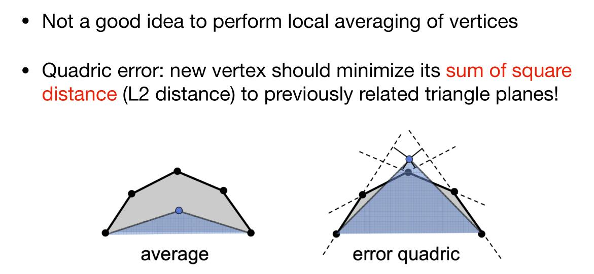

## 三角形网格的细分

### Loop细分

Loop Subdivision分为两步

1. 创建更多三角形（顶点）
2. 改变三角形顶点的位置

创建更多的三角形非常简单，只用将三角形每条边的中点相连，我们就得到了四个三角形。

对于顶点的位置，新的顶点和老的顶点都需要更改。

对于新的顶点：

对于老的顶点

## 更一般的网格的细分

### Catmull-Clark细分

对于不是方形的面和度数（所连边数）不等于4的点要进行细分

步骤如下：

1. 在每个面的上添加顶点
2. 在每条边的上添加顶点
3. 连接新顶点

添加的规则如下

## 网格简化

### 二次误差度量

对于如上图的情况，不应该对顶点求平均值，而应该使得新的顶点到原来顶点的平方距离之和最小

### 坍缩边的方法

通过坍缩某些边，然后使边的端点重合在一起，使得三角形减少。

一个想法是将边的中点进行二次误差度量。

一个更好地想法是选择那些拥有最小二次误差的点。可以用优先队列来维护。

## 不均匀分割空间的数据结构

有Oct-Tree，KD-Tree，BSP-Tree。

Oct-Tree是均匀地将一个正方体分为八个小正方体的结构。可以根据物体在某一部分的密度来决定是否往下分。

KD-Tree是将空间分为两部分，可以是不均匀的。但是分的时候是轴对齐的。

BSP-Tree也是分为两部分，但分的时候可以不轴对称。

### KD-Tree

KD-Tree的要求如下

对于中间节点，存储：

1. 分割空间的平面垂直的坐标轴
2. 分割空间的平面在坐标轴上的坐标
3. 指向儿子节点的指针
4. 不存储任何物体的信息

对于叶子节点，存储

1. 包含的物体列表

### 层次包围盒(BVH)

这也是一种树，根节点是所有物体的包围盒。

然后对节点进行分割，使得该节点划分为两个部分，每个部分都是一个包围盒，一个物体仅在一个包围盒中。

如果一个节点被分割了，它就不再作为含有物体的包围盒。只有叶子节点含有包围盒。

其中有几个注意事项：

1. 选择节点中的最长轴，如果物体有沿$x$轴分布的形状，则在$x$轴上将物体分为两部分。
2. 分割节点选择在中间的物体。
3. 当一个节点只有很少物体时停止分割

