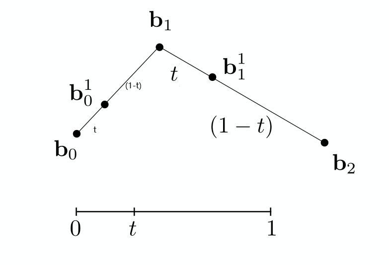
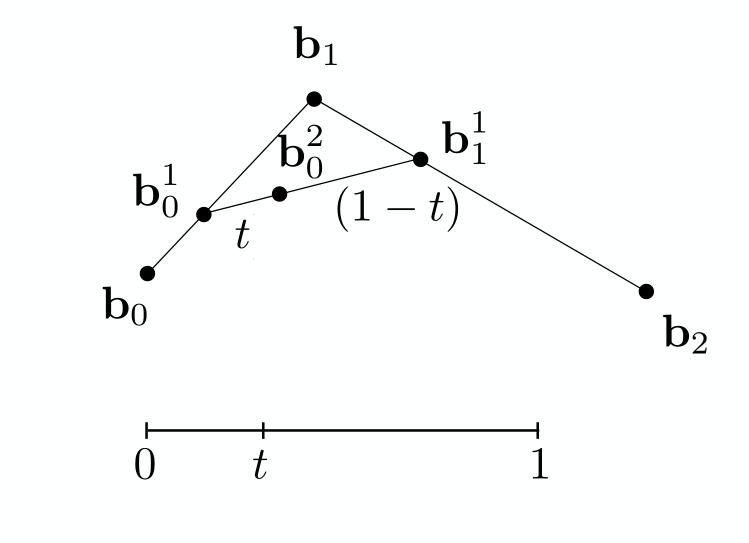
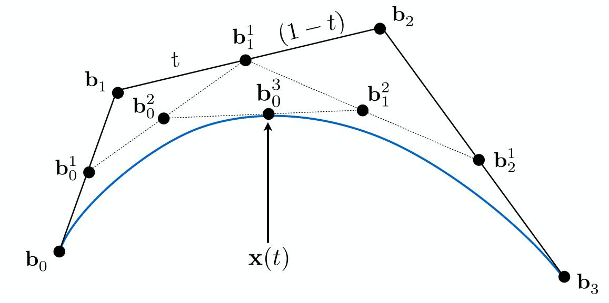

有两种方法描述几何：隐式的、显式的。

## 几何的隐式表示

取决于某些点是否符合表达式。

例如描述一个球面$x^2+y^2+z^2=1$，所有符合这个表达式的点就是一个球面。

更一般的情况：满足$f(x,y,z)=0$的所有点。

它的特点是，采样比较困难，但判断一个点在集合体内外或者在几何体上非常方便。

隐式表示包含：

1. 代数方程表示(Algebraic Surfaces)
2. 通过布尔表达式对几何体进行运算(Constructive Solid Geometry)
3. 距离函数(Distance Functions)
4. Blending Distance Functions
5. 水平集(Level Set)
6. 分形(Fractals)

## 几何的显式表示

所有的点直接给出，或者通过参数映射地给出。

比如从二维映射到三维

$$
f:\mathbb{R^2\to R^3};(u,v)\to(x,y,z)
$$

特点是，采样简单，但是判断关系较为困难。

显式表示包含：

1. 点云(Point Cloud)
2. 多边形网格(Polygon Mesh)
3. 贝赛尔曲线(Bezier Curves)

### 贝塞尔曲线

**Casteljau算法**

考虑平面上的三个点$b_0,b_1,b_2$，用线性差值的办法插入一个点到每一条边上。

将新增的两个点再利用相同的办法插入一个点。

然后对于插值的比例值$[0,1]$上的所有点进行这个算法。

对于更多点，因为每次在边上进行插值后，新的点比原来的点少一个，反复进行这个算法直到只有一个点。

将这个过程公式化，对于三个点的情况，即为

$$
b_0^1(t)=(1-t)b_0+tb_1\\
b_1^1(t)=(1-t)b_1+tb_2\\
b_0^2(t)=(1-t)b_0^1+tb_1^1
$$

$$
\therefore b_0^2(t) = (1-t)^2b_0+2t(1-t)b_1+t^2b_2
$$

对于更多点的情况：

$$
b^n(t) = b^n_0(t)=\sum^n_{j=0}b_jB^n_j(t)
$$

其中

$$
B^n_i(t)=\binom{n}{i}t^i(1-t)^{n-1}
$$

也可以用递归的方法计算，比较简便。

**贝赛尔曲线的一些性质**

1. $t=0$是起点，$t=1$是终点。
2. 曲线与端点段相切
3. 仿射变换中，对控制点仿射变换再画曲线，和对已经画出来的曲线做仿射变换，得到的曲线是一样的。
4. 曲线一定在控制点的凸包内

**分段的贝赛尔曲线及其算法**

四个顶点构成的贝赛尔曲线为一段，再将许多贝赛尔曲线接到一起。

这样的曲线一定是连续的，但光滑还有一个条件。即第一条曲线的第3、4个点的线段和第二条曲线的第1、2个点的线段长度、方向均相同。

### 样条(Spline)

TODO 

### 贝塞尔曲面

对于$4\times 4$的控制点，首先在$u$方向上画出四条贝赛尔曲线，然后再在$v$方向上，根据四条贝塞尔曲线计算出四个控制点，再计算出曲面上的点。
