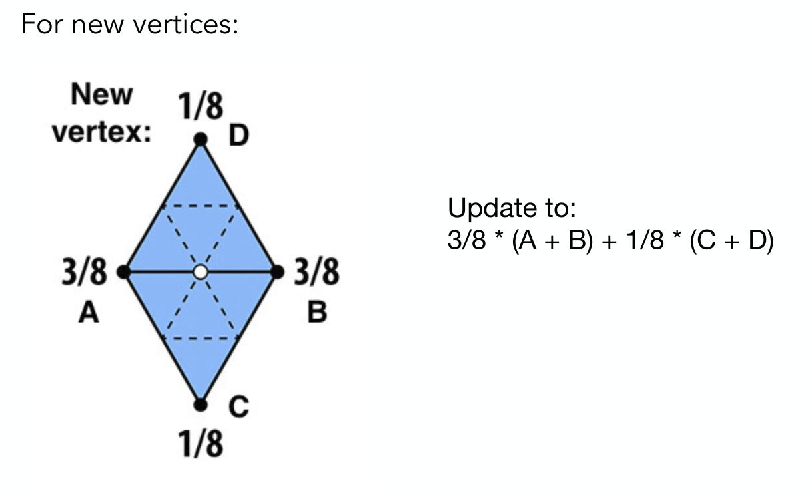
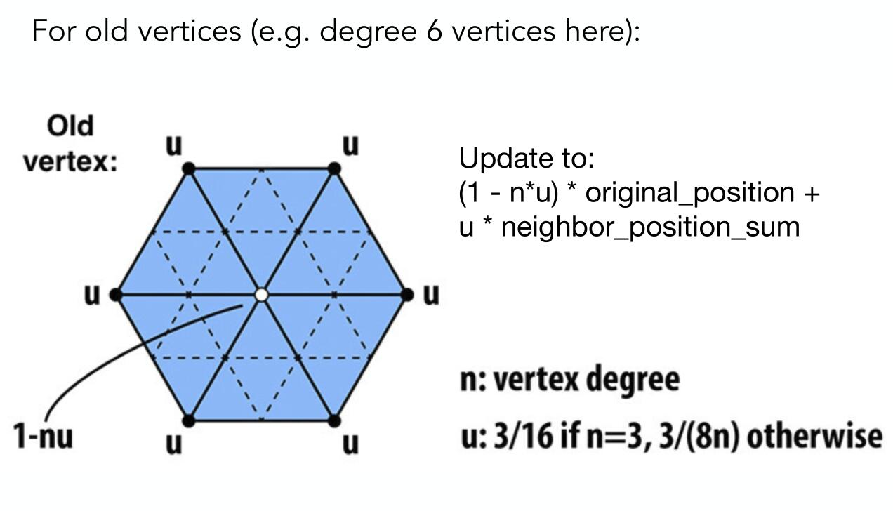
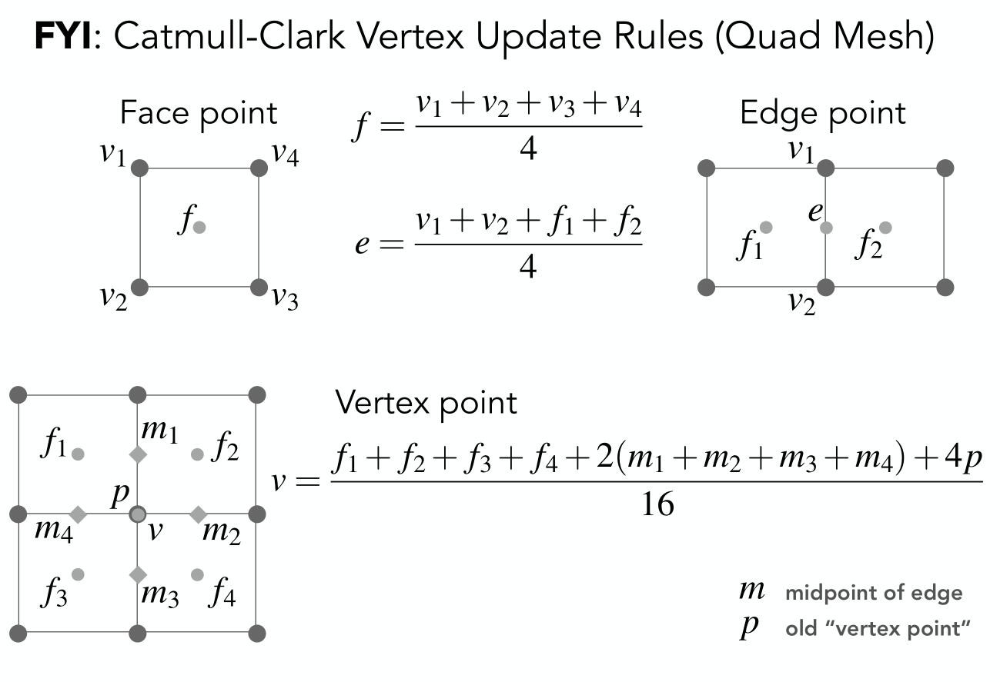
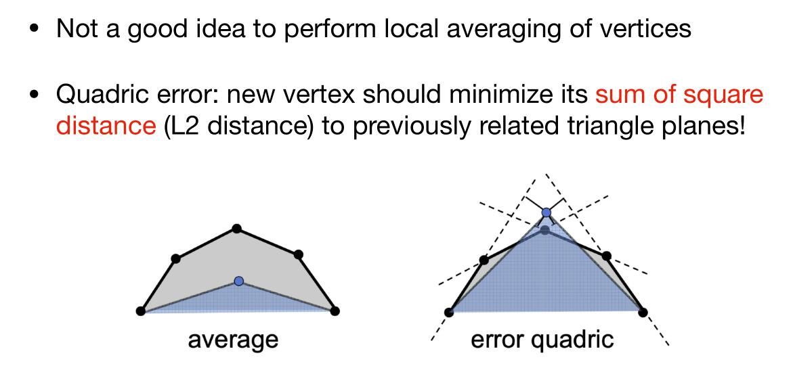
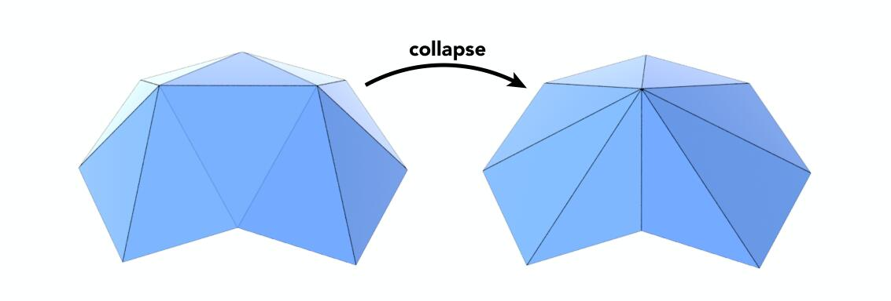

## 三角形网格的细分

### Loop细分

Loop Subdivision分为两步

1. 创建更多三角形（顶点）
2. 改变三角形顶点的位置

创建更多的三角形非常简单，只用将三角形每条边的中点相连，我们就得到了四个三角形。

对于顶点的位置，新的顶点和老的顶点都需要更改。

对于新的顶点：

对于老的顶点

## 更一般的网格的细分

### Catmull-Clark细分

对于不是方形的面和度数（所连边数）不等于4的点要进行细分

步骤如下：

1. 在每个面的上添加顶点
2. 在每条边的上添加顶点
3. 连接新顶点

添加的规则如下

## 网格简化

### 二次误差度量

对于如上图的情况，不应该对顶点求平均值，而应该使得新的顶点到原来顶点的平方距离之和最小

### 坍缩边的方法

通过坍缩某些边，然后使边的端点重合在一起，使得三角形减少。

一个想法是将边的中点进行二次误差度量。

一个更好地想法是选择那些拥有最小二次误差的点。可以用优先队列来维护。
