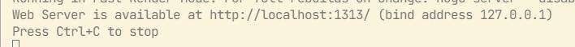
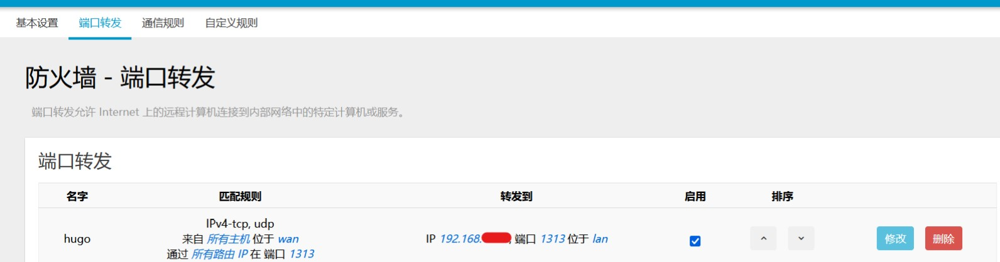
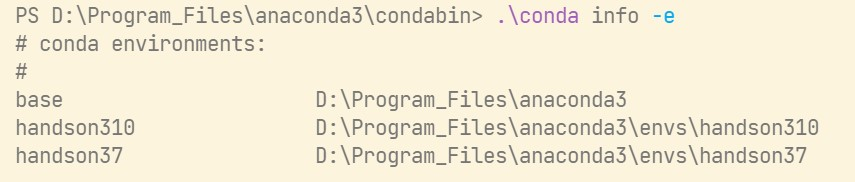
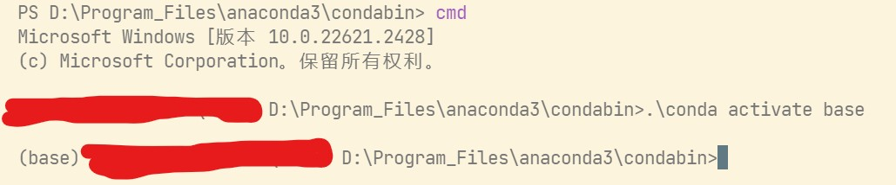

众所周知，学校校园网是一个巨大的局域网。你在教室里面连上校园网的WiFi，就可以访问用有线网（或者WiFi）连接到校园网的宿舍电脑。这给了我们使用SSH在学校的任意地点访问宿舍电脑的可能。

# Windows配置

## 客户端配置

### 软件安装

Win11下，我们在设置-应用-可选功能-添加可选功能（查看功能）中搜索ssh，安装OpenSSH客户端。

### 密码连接方式

这样就已经可以使用ssh登陆服务器了，当然现在你只能使用用户名和密码登陆。方法如下

```powershell
ssh username@ip
```

我们一般局域网都是直接访问ip的，username就是你windows的用户名。密码不是PIN，是你微软账号的密码。如果是本地用户就是用户的密码。

当然如果你要登陆的用户是管理员，现在可能还登不上，会显示`Permission Denied`

### 密钥连接方式

如果不想输入密码，就要用到ssh的密钥文件。如何生成密钥文件我推荐你参考[https://docs.github.com/zh/authentication/connecting-to-github-with-ssh/generating-a-new-ssh-key-and-adding-it-to-the-ssh-agent](https://docs.github.com/zh/authentication/connecting-to-github-with-ssh/generating-a-new-ssh-key-and-adding-it-to-the-ssh-agent)

生成完之后记得要`ssh-add`，把密钥添加到ssh-agent里，这也在这篇文章中讲到怎么做了。通常，我也会建议你把ssh-agent服务设置为自动。注意在`services.msc`中这个服务叫OpenSSH Authentication Agent，在任务管理器中这个服务叫`ssh-agent`

## 服务端配置

### 软件安装

类似于客户端，这次我们添加的功能叫做OpenSSH服务端。

安装完成后，启动服务。在`services.msc`中这个服务叫OpenSSH SSH Server，在任务管理器中叫sshd。建议设置为自动。

### 服务器参数配置

一般来说，开启服务之后，会自动在`C:\ProgramData\ssh\`下生成一大堆文件。其中包括服务器的配置文件，和服务器自己的密钥等等。

我们修改这个目录下的`sshd_config`文件，以下内容取消注释

```
PermitRootLogin prohibit-password
PubkeyAuthentication yes
AuthorizedKeysFile  .ssh/authorized_keys
PasswordAuthentication yes
```

然后，把`PermitRootLogin prohibit-password`改为`PermitRootLogin no`；把`PasswordAuthentication yes`改为`PasswordAuthentication no`

最后，再注释掉：

```
# Match Group administrators
       # AuthorizedKeysFile __PROGRAMDATA__/ssh/administrators_authorized_keys
```

这样，我们就只能用密钥登陆了。可能提升了些微的安全性。注意`PermitRootLogin`对Windows是无用的，我这样只是方便跟linux统一。

修改完后重启sshd服务。

### 服务器配置密钥连接方式

我们要把客户端的公钥上传服务器，这样我们才能让客户端正常登陆。为此我们要修改服务器用户的`~\.ssh\authorized_keys`文件（没有就创建一个），然后把客户端用户的公钥直接复制粘贴到authorized_keys中。公钥都是一行的，所以如果有多个公钥，每行一个即可。

### 更换默认命令行

你可能发现ssh连进去，打开的是cmd命令行，而你更想要PowerShell，参照[https://learn.microsoft.com/zh-cn/windows-server/administration/openssh/openssh_server_configuration#configuring-the-default-shell-for-openssh-in-windows](https://learn.microsoft.com/zh-cn/windows-server/administration/openssh/openssh_server_configuration#configuring-the-default-shell-for-openssh-in-windows)

我的版本如下，修改了我自己的PowerShell7的位置。

```
New-ItemProperty -Path "HKLM:\SOFTWARE\OpenSSH" -Name DefaultShell -Value "G:\Program_Files\PowerShell\7\pwsh.exe" -PropertyType String -Force
```

### 注意事项

注意，authorized_keys需要注意权限和所有权的问题。如果假如说，你创建了一个用户2，作为没有管理员权限的用户，用户1是拥有管理员权限的用户。它们两个在服务端。那么你需要确保用户2的`~\.ssh`是由用户2自己创建的，并且自己有完全控制的权限。`authorized_keys`文件同理。这样才能让用户2正常读取文件信息。

假设你为了方便用用户1为用户2创建文件、写入信息。那么你很有可能会登陆失败，显示`Permission Denied`。本人曾经踩过这个坑。

# Linux

# 使用例

## Hugo

Hugo是可以开启本地服务器的，其使用方法为`hugo server`，之后我们就可以在`localhost:1313`访问我们的博客了。



但是注意到，他开在127.0.0.1这个回环地址上。也就是说，只有本机才能访问，而内网的其他设备是无法访问的。

在此我们要区分一下几个ip。localhost、127.0.0.1、192.168.x.x，10.x.x.x。

**localhost**

这个其实是个域名，和baidu.com没有本质区别，它一般会被映射到127.0.0.1。我们可以通过修改hosts更改它的映射。

**127.0.0.1**

这个叫回环地址，本机发出的所有信息都会兜一圈再发回给本机，并且这个兜一圈只在本机内部。外部设备是无法连接到这个地址的。

**192.168.x.x**

一般路由器会分配给电脑这个内网地址，同一路由器所连的设备地址都会是这个样子，只是最后几位不同。这些设备可以用它们的这个地址互相访问。

**10.x.x.x**

如果你在用校园网的话，路由器wan口的地址一般会是这个。但是这不是公网地址，这是校内局域网的地址。我们在别处使用校园网的话，就可以用这个地址访问宿舍内的设备。

综上所述，如果你要让外部的设备访问到Hugo页面，你就不能把他开到127.0.0.1上，你应该开到192.168.x.x上。但是这样的话你本机访问localhost或者127.0.0.1又不能连上了。幸好我们有一种办法可以让两个同时可以访问，就是把服务器开在0.0.0.0上。开在这个ip上的服务器会自动探测本机的所有ip，让他们都能访问（不过0.0.0.0本身是不能访问的）。

Hugo本身的用法是`hugo server --bind 0.0.0.0`

到此为止，你已经可以用本机的各种地址访问了，但是还不能用校园网内的其他设备访问10.x.x.x这个地址，因为这个地址是你宿舍路由器的wan口地址（你直接拨号上网除外）。你需要把192.168.x.x:1313映射到10.x.x.x:1313，需要用到的技术叫做端口映射，一般可以在路由器内设置。例如openwrt：



之后我们就可以真正在学校任意一个有网的地方访问10.x.x.x:1313来连接博客了。

## Anaconda

假设这样一个场景：你宿舍、实验室的机器显卡很强，可以用来训练AI，但是笔记本不太行。所以你想要在课堂上、图书馆训练AI是不可能的。这时候ssh就派上用场了，直接连到远程机器进行训练即可。

你可能比较熟悉Anaconda的图形化界面，它启动特定的环境比较方便，只要按几个按钮即可。但是ssh只有命令行，命令行稍微困难点。

在Anaconda的安装目录下，有一个condabin文件夹，里面的conda.bat可以帮助我们启动环境。

你可以先使用`.\conda info -e`查看你有哪些环境：



启动环境的方法是

```powershell
.\conda activate base
```

你在powershell里输入会发现毫无变化。这其实是因为anaconda只支持cmd，我们要先输入`cmd`切换到cmd，之后再启动环境，即可。



与Hugo类似的，我们也可以通过校园网访问Jupyter Notebook。只要设定其ip即可

```
jupyter notebook --ip=0.0.0.0
```

同样，你也需要去开启路由器8888端口的映射。

