# 前言

这种方法试图将一张HDR图片首先用图像分割的方法分割成多个不同的区域，每个区域使用不同的色调映射曲线（或者别的技术），来将整个图片映射到SDR，以期获得比经典的全图使用一条曲线（或同一种方法）更好的效果。

这种方法也算是一个小众宝藏方法了，没有多少人研究，也没诞生出优势巨大的方法，本文大致上介绍一下现有的文献

# Tone Mapping Operators: Progressing Towards Semantic-Awareness

[https://ieeexplore.ieee.org/abstract/document/9106057/](https://ieeexplore.ieee.org/abstract/document/9106057/)

这种方法在我之前的文章[Tone Mapping简述](../tone-mapping简述)中也介绍过，这里再介绍一次。

关注到显然现实生活中不同材质的物体平均亮度是不同的，可以通过这种方式来将各种物体映射到各自偏好的亮度。本文结构如下

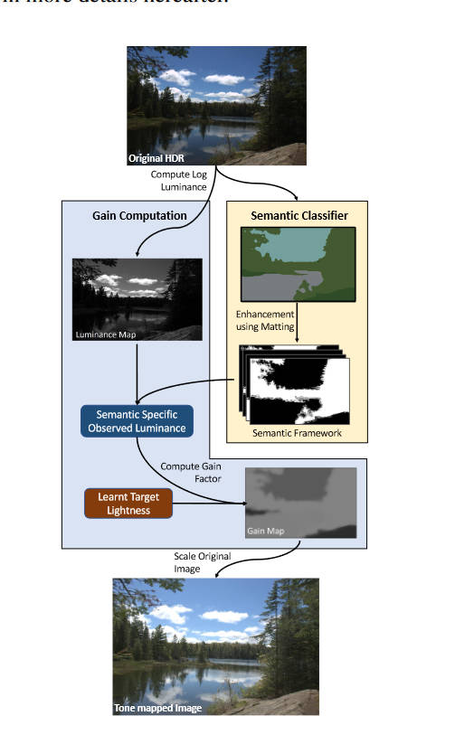

本文并没有提出什么新的网络架构。Mask的提取部分，使用了预训练的FastFCN，将其中的150个类又归为9类，然后使用形态学方法生成trimap，然后使用Alpha matting获取到精细的mask。然后，作者使用这样的方法对几百张LDR图片生成了mask，统计个各类的亮度直方图，也即学习到了个各类的目标亮度。

在Tone mapping的部分，作者在HDR上获取到mask后，就简单的将目前的亮度替换为目标亮度，然后再用颜色恢复方法恢复出来LDR图像。

# G-SemTMO: Tone Mapping With a Trainable Semantic Graph

[https://ieeexplore.ieee.org/abstract/document/10742368/](https://ieeexplore.ieee.org/abstract/document/10742368/)

本文可以说得上是上一篇文章的升级版，上一篇文章的ToneMapping部分过于简单粗暴，本文使用图神经网络来增加ToneMapping的表达能力。

作者首先观察了专业摄影师手工进行HDR图像编辑时的过程，分为两步：

1. 观察照片上有哪些对摄影来说更重要的物体（也即语义分割）
2. 对每个物体，综合考虑其类别、周围的物体的类别、其颜色特征来进行调整。

本文的作者想将这种思路用在数据驱动的方法上，于是提出了一种图神经网络的方法，结构如下

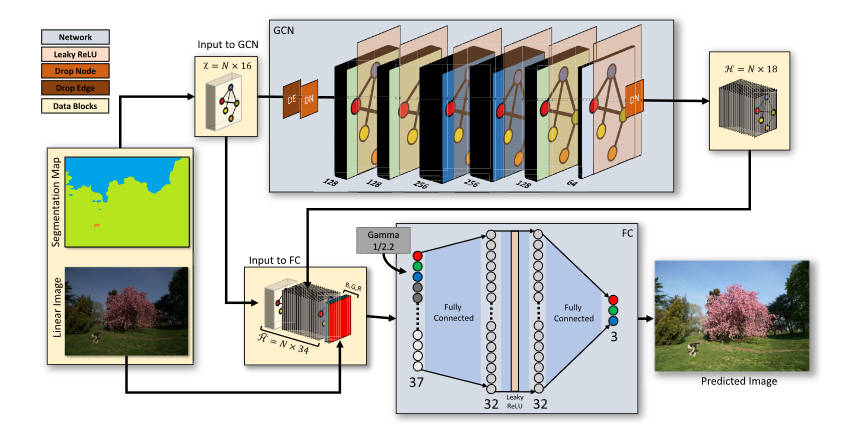

语义分割的部分和上一篇文章是一样的，都是用FastFCN将图像分为9个大类。

在图神经网络的部分，每个节点对应一个语义分割区域，相邻的两个区域之间有一条边。作者以这种结构来模仿专业摄影师“考虑周围物体”的过程。

以$A$来表示邻接矩阵，$X$表示输入的特征，$H$表示输出的特征。这里的$X$是$n\times 16$的矩阵，$n$为分割区域数，而$16$则是每个区域包含的特征数，这些特征分别为：独热编码的9个类别、该区域的RGB三个分量的均值和标准差、该区域的亮度均值。而$H$是一个$n\times 18$矩阵。该网络的每一层表示如下

$$
Y^{(l+1)}=\sigma\bigg(AY^{(l)}W^{(l)}\bigg)
$$

其中$Y^{0}=X, Y^{L}=H$，而$W$是可训练权重，本文选用的激活函数$\sigma$为Leaky-ReLU。

在色调映射的网络上，使用全连接网络（FCN，和全卷积网络撞缩写了），期望输入一个线性RGB值，输出一个适配于SDR显示器的RGB值（大部分情况就是sRGB）。对于图中的任意一个像素，将其RGB值、对应分割区域的$X$中的$16$个特征、$H$中的$18$个特征加起来作为FCN的输入（即37个channel），FCN输出一个3个channel的值，即色调映射后的RGB值。

本文使用的损失函数为$L_1$损失，即对于输出$O$和参考$R$，

$$
\mathcal L = \sum_{i,j}\sum_{c\in\{R,G,B\}}|R_{c,i,j}-O_{c,i,j}|
$$

这里两个图片都是sRGB图片，也即伽马矫正过的图片。

本文的分割也会造成图像分块的问题，解决方法同上一篇，使用alpha matting给分割一个权重，最后加权求和得到最终的图片。

# Tone Mapping for Single-shot HDR Imaging

[https://ieeexplore.ieee.org/abstract/document/7294799/](https://ieeexplore.ieee.org/abstract/document/7294799/)

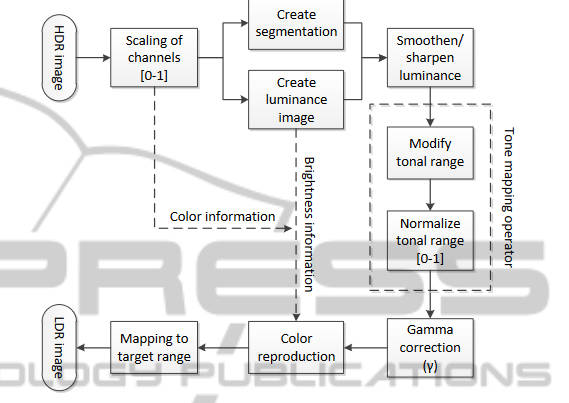

本文的TMO是对Reinhard的优化，主要是可以对每个像素选择Key值，即Reinhard论文中的

$$
L(x,y)=\dfrac{a}{\overline{L_w}}L_w(x,y)
$$

中的$a$，本文将其选择为（记作$\alpha$防止和后面冲突）

$$
\alpha(x,y) = 1-\exp(-(I(x,y)\cdot(1+d\cdot I(x,y)))^{1-(I_{avg})^{1/c}})
$$

其中$c$是一个正整数常数，决定了整体的对比度增强量，推荐设置为$c=4$，而$d$为

$$
d=\begin{cases}
 -1 & \text{ if } I(x,y)< I_{avg} \\
 1 & \text{ if } I(x,y)\geq I_{avg}
\end{cases}
$$

本文在色调映射之后不直接裁剪数值到$[0,1]$，而是进行了一次归一化

$$
I'_{normalized}(x,y) = \dfrac{I'(x,y)-I'_{min}}{I'_{max}-I'_{min}}
$$

本文用到了图像分割，主要是想提高低光区域的信噪比，然后将信噪比本就很高的区域进行细节加强。为此提出了两种操作，即光滑和锐利

$$
\text{SMOOTH}(I,a)=I\cdot(1+a)+I_G\cdot(-a),\quad a<0
$$

$$
\text{SHARPEN}(I,a) = I\cdot(1+a)+I_G\cdot(-a),\quad a>0
$$

其中$I_G$是对原图$I$使用$3\times 3$的高斯滤波得到的，高斯核$\sigma = 0.8$

本文的图像分割是使用[Efficient graph-based image segmentation](https://link.springer.com/article/10.1023/B:VISI.0000022288.19776.77)中提到的方法，对于不同的区域的特性：

1. 如果该区域的标准差较小，则使用均值代替原来的像素值

$$
0\leq I^s_\sigma\leq \sigma_{noise} \to I^s(x,y)=I^s_{avg}
$$

2. 如果该区域熵较小，同上

$$
0\leq I^s_H\leq \sigma_{noise} \to I^s(x,y)=I^s_{avg}
$$

3. 如果该区域信噪比较低，则进行光滑

$$
0\leq I^s_{SNR}\leq 30 \to \text{SMOOTH}(I^s, -1)
$$

4. 如果该区域信噪比中等，则进行中等程度锐利

$$
30\leq I^s_{SNR}\leq 39 \to \text{SHARPEN}(I^s, 1)
$$

5. 如果该区域信噪比较高，则强锐利

$$
I^s_{SNR}\geq 39 \to \text{SHARPEN}(I^s, 1.5)
$$

作者提到说分割过多的区域要比起分很少的区域效果好一些。

作者提到也可以将“光滑和锐利”操作换成不同参数的Reinhard操作。

本文的分割类似于实例分割，而本文没有考虑到区域边缘融合的问题。

# 基于直方图与图像分块融合的阶调映射算法

[https://doi.org/10.3785/j.issn.1008-973X.2022.11.013]([https://doi.org/10.3785/j.issn.1008-973X.2022.11.013](https://doi.org/10.3785/j.issn.1008-973X.2022.11.013 "https://doi.org/10.3785/j.issn.1008-973X.2022.11.013"))

这篇文章的分割只是简单的分成多个正方形，但是其曲线融合和区域融合方法还是可以看一下

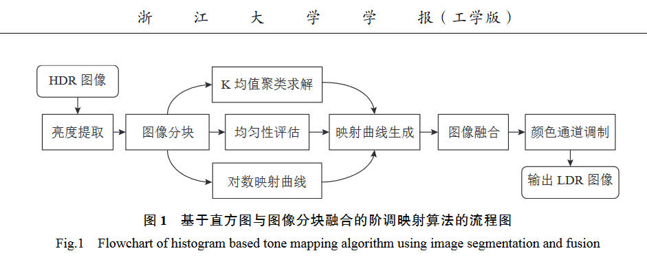

本文使用了K均值和对数曲线两种映射，对一幅HDR亮度图$I$，将其等分为$N$个亮度等级$(u_1,\cdots,u_N)$，而映射后的亮度图$\hat I$有$M$个亮度等级$(c_1,\cdots,c_M)$，于是就可以归结为一维K均值聚类问题

$$
\min_{c_1,\cdots,c_M}||I-\hat I||
$$

一维的K均值有动态规划法求得全局最优解，即映射函数

$$
F(u):\{u_1,\cdots,u_N\}\to\{c_1,\cdots,c_M\}
$$

由于LDR图像为8位，故$M=256$，来保证每个类对应于一个LDR像素值，为了保证映射函数精度，选择$N=1024$。

对于亮度比较均匀的地方，直方图分布集中，使用K均值容易出现对比度过度增强，于是作者让其和一条对数映射曲线结合，该曲线为：

$$
G(u): \{u_1,\cdots,u_N\}\to\{l_1,\cdots,l_M\}
$$

其中$G(u)$为HDR像素至其最接近的$l_i$的映射关系

$$
l_i=\exp\bigg(\ln(u_1)+i\dfrac{\ln(u_N)-\ln(u_1)}{M+1}\bigg)
$$

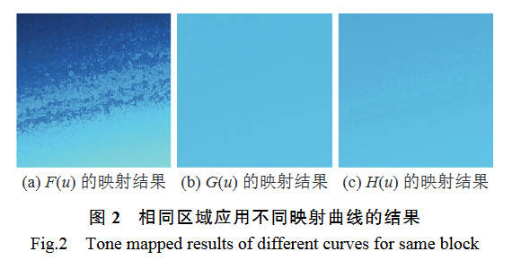

在亮度均匀的地方，需要更多保留$G(u)$，而在亮度跨度大的地方，需要更多保留$F(u)$，为此，使用一个均匀指标$\beta$来调解两条曲线的比例，即

$$
H(u): \{u_1,\cdots,u_N\}\to\{v_1,\cdots,v_M\}
$$

其中

$$
v_i = (1-\beta)c_i+\beta l_i
$$

其中$\beta$在HDR亮度图的组数为20的统计直方图上计算

$$
\beta=\begin{cases}
 0.5(1-\exp(a-\eta)), & a<\eta \\
 0, & a\geq\eta
\end{cases}
$$

其中$a$为大于频率均值的组数，$\eta$为控制曲线形状的常数，建议取$13$。

上述计算都是发生在原图中的不相交的矩形小区域中，也即每个区域拥有不同的曲线。这也导致了各个区域之间出现明显的分界线，本文作者使用双边滤波来融合区域。即某个区域内的像素会应用邻居B个区域（5x5区域）的曲线，加权的得出最终的LDR值$p(x,y)$。

$$
p(x,y)=\dfrac{\sum^B_{i=1}H_i(I(x,y))\cdot w_d(i)\cdot w_s(i)}{\sum^B_{i=1}w_d(i)\cdot w_s(i)}
$$

其中$w_d$为距离权重，$w_s$为亮度权重

$$
w_d(i)=\exp(-d_i/\sigma_d)
$$

$$
w_s(i)=\exp\bigg(-\dfrac{|\ln(I(x,y)+1)-\ln(I_i+1)|}{\ln(I_{max}+1)\cdot\sigma_s}\bigg)
$$

其中$d_i$为当前像素点和$H_i$对应区域中心点的欧式距离，$\sigma_d$为距离衰减因子，$I_i$为对应区域平均亮度，$I_{max}$为全图的最大亮度，$\sigma_s$为亮度衰减因子。

# Adaptive tone-mapping operator for HDR images based on image statistics

[https://ieeexplore.ieee.org/stamp/stamp.jsp?tp=&arnumber=6129047](https://ieeexplore.ieee.org/stamp/stamp.jsp?tp=&arnumber=6129047)

本文也使用Kmeans来分区域。首先讨论了$k$值的决定方式，作者首先将原图的亮度转为$log$域，然后计算其方差和均值，然后统计直方图，直方图的bin个数为

$$
N=\left \lfloor \sigma\lambda \right \rfloor 
$$

$\sigma$为刚刚在$log$域计算的方差，$\lambda$为常数，取$10$，意在对方差大（即动态范围大）的图片使用更多bin。

然后，计算

$$
T=\dfrac{size\ of\ image}{\omega}
$$

其中$\omega$为常数$8$。设$f(b_i)$为第$i$个bin里的像素个数，然后有

$$
\Psi=\{i|f(b_i)>T\}
$$

$$
k=|\Psi|
$$

本文使用的TMO为一个经典的对数型曲线

$$
D(I) = (D_{max}-D_{min})\times \dfrac{\log(I+\tau)-\log(I_{min}+\tau)}{\log(I_{max}+\tau)-\log(I_{min}+\tau)}+D_{min}
$$

本文自动决定这个$\tau$的取值，记$C_i$为第$i$类的聚类中心，则对于每一个区域，有

$$
\tau_i=\left \lfloor \epsilon\cdot C_i \right \rfloor 
$$

其中$\epsilon=0.3$

注：本文没有考虑分割边缘融合的问题，当然Kmeans分出来的区域边缘不是那么明显。

# Visual Salience Based Tone Mapping for High Dynamic Range Images

[https://ieeexplore.ieee.org/abstract/document/6779648/](https://ieeexplore.ieee.org/abstract/document/6779648/)

本文利用了显著性检测来定义其色调映射曲线，曲线基本上就是双边滤波那套分解成基础层和细节层再来进行压缩的方法。

显著性检测方面，本文并不关注，只需要知道输入一个图片，输出一个相同大小的矩阵，代表每一个像素的显著性，越与背景不同的区域显著性越大。本文修改前人的方法来计算这个显著性权重，记作$\Gamma_b(p')$，与此同时，使用窗口内的均值和方差等信息来进行边缘检测，得到一个边缘权重$\Gamma_e(p')$。两个东西组合起来成为一个权重

$$
W(p')=\dfrac{\Gamma_e(p')}{\Gamma_b(p')}
$$

这个权重会用在分离基础层中来减小光晕。细节层的加强就是一个常数参数，略过，基础层的压缩使用如下公式

$$
\hat L_b(p)=\log(a)+L_b(p)-\bar L_h-\log(1+a\exp(L_b(p)-\bar L_h))
$$

其中$a$是Reinhard方法中的Key value，其计算参考[Parameter Estimation for Photographic Tone Reproduction](https://www.tandfonline.com/doi/abs/10.1080/10867651.2002.10487554)，而$L_b$是映射前的基础层log亮度，$\hat L_b$则是映射后的。$\bar L_h$计算如下

$$
\bar L_h=\dfrac{\sum^N_{p=1}\Gamma_b(p)L_h(p)}{\sum^N_{p=1}\Gamma_b(p)}
$$

指的是HDR原图中的log亮度的加权平均。

注：本文虽然使用了分割，但是最终的曲线却不是作用于各个区域的，无需考虑分割边界问题。

# Content-Aware Automatic Photo Enhancement

[https://onlinelibrary.wiley.com/doi/abs/10.1111/j.1467-8659.2012.03225.x](https://onlinelibrary.wiley.com/doi/abs/10.1111/j.1467-8659.2012.03225.x)

本文虽然不是纯粹的Tone Mapping，但也值得看一下。

本文首先进行区域检测，提取出人脸区域、天空区域、较暗的区域。然后进行全局的对比度和饱和度调整。之后对人脸、天空、暗区进行单独调整。最终再进行细节和材质的增强。

本文的检测部分并没有提出新方法，作者使用了当时最好的方法，也指出如果后续有任何更好的方法都可以直接套在第一阶段里使用。

而在全局对比度提升到阶段，将对比度拉升到最大范围（full range），裁剪之前最暗的和最亮的0.5%的像素，然后增加每个像素的饱和度20%。这里的全局指的是除了脸部和天空的所有像素。

在人脸部分，首先也是将其分为基础层和细节层，亮度调整仅在基础层进行。统计人脸区域的亮度直方图

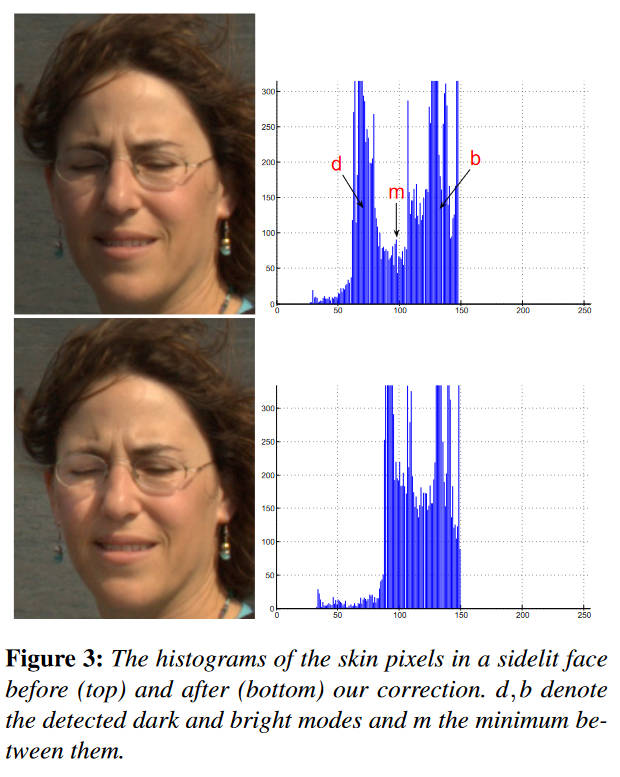

当人脸的是阴阳脸时，其直方图会出现两个峰，作者的想法是将低亮度峰往高亮度峰靠。即将低于$m$的值乘以一个参数$f(b-d)/(m-d)$。

为了调整曝光，作者经过统计发现绝大多数图片中75%的图像亮度在120以下，所以在下一步就是将所有的亮度进行平移，直到第75%个亮度处于120的位置。具体细节上还有一些防止过度调整的措施，详见原文。

对于天空，作者只针对蓝天和白云，不关注朝霞和晚霞，目的在让蓝天更蓝，而白云更白。作者构造了一个蓝天和白云的混色物理模型，通过估计参数然后调整参数来实现目的，跟tone mapping关系不大故略去。

然后是暗部增强，作者首先用前人的显著性检测方法来检测这种暗区域。然后将图像的像素分为两组，一组暗像素为亮度值低于50的（最高255），一组亮像素为其他所有像素。然后计算因子

$$
f^{sal}=\min\bigg\{2, \dfrac{PT(BRIGHT,35\%)}{PT(DARK,95\%)}\bigg\}
$$

其中$PT(A,b\%)$指的是$A$中从低到高的前$b\%$的元素，设$M_i^{sal}$为像素$i$的暗区显著性，$B$为亮度的base层，则前后的base层映射公式为

$$
B^{new}_{i}=f^{sal}M^{sal}_{i}B_i+(1-M^{sal}_i)B_i
$$

然后是最后的细节增强部分，设$P^{ns}$是一个像素点不属于人脸和天空的概率，$L$是log亮度，$D$是细节层，那么

$$
L^{new}=L+c P^{ns}D
$$

其中$c\in[0,0.25]$是一个可调参数。

注：本文的分割边缘融合问题，类似于最后的细节加强操作，是通过权重来处理的。

# Fast Segmentation-based Tone Mapping Operator

[https://www.dbpia.co.kr/Journal/articleDetail?nodeId=NODE07996848](https://www.dbpia.co.kr/Journal/articleDetail?nodeId=NODE07996848)

本文是对Reinhard的简单修改，首先计算低通滤波后的亮度图$\check L(x,y)$，然后计算其高通分量

$$
\hat L(x,y) = L(x,y)-\check L(x,y)
$$

然后，作者使用阈值来分割这个高通分量

$$
\hat L = \begin{cases}
 \hat L(x,y), & \hat L\geq T \\
 0, & \hat L < T
\end{cases}
$$

其目的是为了更好的控制边缘的强调程度。然后计算锐化图像

$$
L_{sharp}(x,y) = L(x,y)+\hat L(x,y)
$$

最终将其代回Reinhard算法

$$
\bar L_d(x,y) = \dfrac{L_{sharp}(x,y)\left(1+\dfrac{L_{sharp}(x,y)}{L^2_{white}}\right)}{1+L(x,y)}
$$

总结，本文按照一个亮度阈值分割，未考虑可能也不必考虑分割边界融合问题。

# Content-aware reverse tone mapping

[https://www.atlantis-press.com/proceedings/icaita-16/25849509](https://www.atlantis-press.com/proceedings/icaita-16/25849509)

本文虽然是逆色调映射，但是也值得看一看。

本文提出的方法主要分为两个版本，第一个版本是按照Zone System的思想，对图像的亮度进行分区，最多分成十个分区，

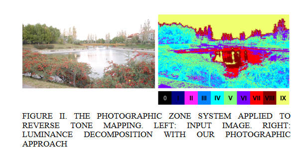

然后本文的rTM曲线较为简单，只使用了一个多段线性函数。简单来说，就是给10个区域设置一个其在HDR上的亮度范围，例如0区设置为$[0,0.1]$，1区、2区设置为$[0.1,0.15],[0.15,0.25]$，以此类推，保证函数单增即可。

第二个版本则是使用显著性检测的方法来分区，分完区后仍然使用上述的线性曲线来rTM，略过。

本文的一个好处是，用户可以方便的手动调整曲线参数。

总结：亮度分段来分割，或者显著性来分割，没有考虑区域边缘融合。

# Tone Reproduction: A Perspective from Luminance-Driven Perceptual Grouping

[https://link.springer.com/article/10.1007/s11263-005-3846-z](https://link.springer.com/article/10.1007/s11263-005-3846-z)

本文的分割是按照亮度分的，首先将RGB加权计算得到亮度，然后转为log域亮度，使用canny算子进行边缘检测，然后将图片分为$8\times 8$大小的网格，然后这些网格中，如果含有边缘的成分，就再将其分为$2\times 2$大小的小格。

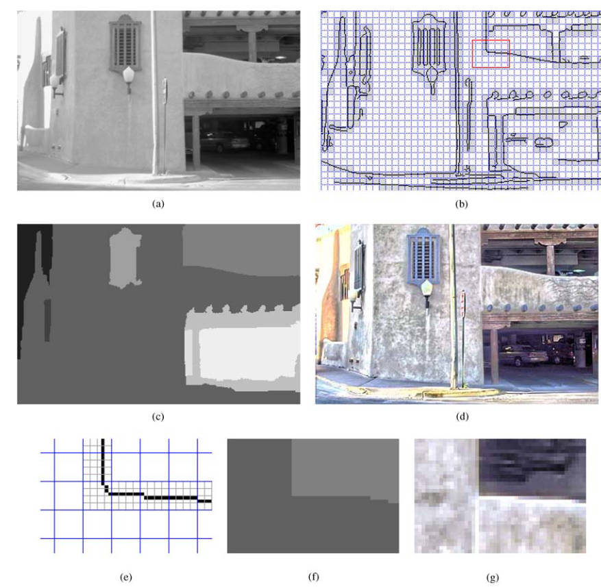

接下来是考虑如何将这些网格分组。作者这里使用了前人提出的earth mover’s distance (EMD)方法，也称作Wasserstein，用于度量两个概率分布之间的差异性。作者对于任意一个区域，将其像素按照动态范围（其实就是亮度范围）分为三段，计算其均值$s_i$和像素个数$h_i$，定义该区域的加权特征$p$为三元组$\{(s_1,w_1),(s_2,w_2),(s_3,w_3)\}$，其中$w_i=h_i/\sum^3_{j=1}h_j$，其顺序代表了该区域的亮部，中等部，暗部。两个区域的距离就定义为

$$
D(R_1,R_2)=EMD(p_1,p_2)
$$

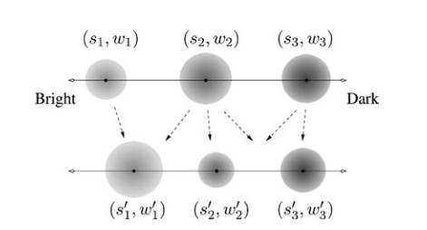

之后，作者使用这个距离来将之前分割的小块合并成更大的区域，算法如下

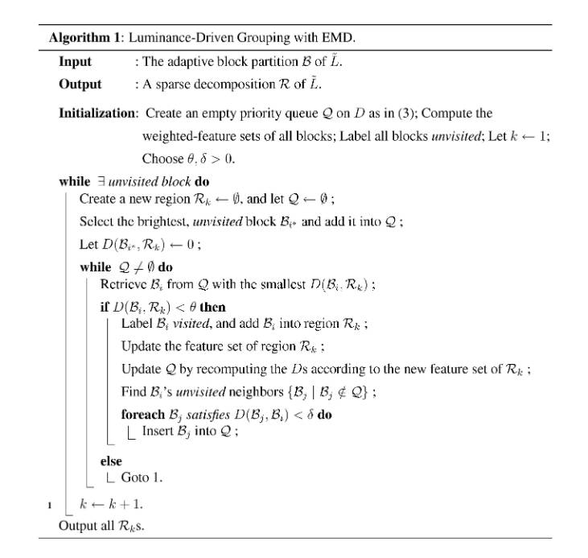

在分割完小块（包括$8\times8$和$2\times 2$的）后，计算每一个小块的加权特征$p_i$，将所有小块标记为未访问过。

创建一个新的空区域$R$，创建一个空（优先）队列，从所有未访问过的小块中取出一个最亮的，将其放入队列。之后，当队列不为空时，从队列中取出具有最小的$D(B,R)$的小块$B$，1. 如果$D(B,R)< \theta$，则将$B$标记为已访问，并将$B$加入到区域$R$中，更新$R$的加权特征$p$，并且重新计算队列中所有的$D(B_i,R)$（维护最小值）。然后将$B$的所有未访问过的邻居小块$B_j$中，满足$D(B_j,B)< \delta$的加入到$Q$中。2. 如果不满足$D(B,R)< \theta$，则终止该区域的扩张，从头开始新区域的扩张。

分完区后就到了Tone Mapping的部分，不过作者在这之前先计算了局部适应的（Local Adaptation）亮度，实际上就是爆改双边滤波器，让其可以考虑到分区域的信息

$$
\tilde V(x,y) = \dfrac{1}{\tilde Z_{x,y}}\left\{\sum_{(i,j)\in R_K}\tilde{L}(i,j)G_{x,y}(i,j)K_{x,y}(i,j)+\sum_{(i,j)\notin R_K}\tilde{L}(i,j)G_{x,y}(i,j)K'_{x,y}(i,j)\right\}
$$

其中$\tilde{L}$是log后的亮度，而

$$
G_{x,y}(i,j)=\exp\{-((i-x)^2+(j-y)^2)/2\sigma^2_s\}
$$

$$
K_{x,y}(i,j)=\exp\{-(\tilde L(i,j)-\tilde L(x,y))^2/2\sigma^2_r\}
$$

$$
K'_{x,y}(i,j)=\exp\{-(\tilde L(i,j)-\tilde L(x,y))^2/2\sigma^2_{r'}\}
$$

$$
\tilde Z_{x,y} = \sum_{(i,j)\in R_K} G_{x,y}(i,j)K_{x,y}(i,j) + \sum_{(i,j)\notin R_K} G_{x,y}(i,j)K'_{x,y}(i,j)
$$

得出的$\tilde V$也是log域的亮度，记$V=\exp \tilde V$。 作者可能说的不是很明确，但是$(i,j)\in R_K$指的应该不是图象中所有在区域$R_K$中的点，而是对于原始的双边滤波器核，在其范围内的那些$(i,j)$，如果这个$(i,j)$在该区域$R_K$中，则用一套核参数，而不在区域中的用另一套参数。这里$\sigma_r\geq\sigma_{r'}$，来更关注同区域的像素，减少不同区域像素的影响。

定义local mapping函数如下

$$
\varPsi(L, V;\rho, \gamma)=\left(\dfrac{L}{V}\right)^\rho\varphi^{\gamma}(V)=\left(\dfrac{L}{V}\right)^\rho\left(\dfrac{V}{1+V}\right)^\gamma
$$

（注：$L/V$其实就是等价于log域的$\tilde L-\tilde V$，也就是提取出细节层。而$V/(1+V)$其实就是极简版Reinhard。该函数本质上就是对基础层$V$使用Reinhard压缩，然后对再把细节层加回去。只不过这里有两个参数。并且，如果$\rho=\gamma$时，该函数退化到Durand的双边滤波方法）

其中$0 < \rho < 2,0< \gamma \leq 1$，$\rho$取值是取决于像素位置的。特别的$\gamma < 1$时，HDR图中的暗部会被映射到更大的动态范围中。本文取$\gamma=0.3$

对于其中的这个$\varphi^\gamma(V)$ global tone mapping，作者想要让其映射能够输出到整一个$[0,1]$的范围，而不是局限于其中的一部分，所以对其进行了重塑

$$
\hat \varphi^\gamma(L) = \alpha\varphi^\gamma(L)+\beta
$$

设$L_{max},L_{min}$为给定的亮度图的最大值和最小值，则上式的参数由以下方程组确定

$$
\begin{bmatrix}
 \left(\dfrac{L_{max}}{1+L_{max}}\right)^\gamma & 1\\
 \left(\dfrac{L_{min}}{1+L_{min}}\right)^\gamma & 1
\end{bmatrix}

\begin{bmatrix}
 \alpha \\
 \beta
\end{bmatrix} = 
\begin{bmatrix}
 1 \\
 0
\end{bmatrix}
$$

接下来，计算参数$\rho$，首先对于每一个区域$R$，构建一个网格$D$

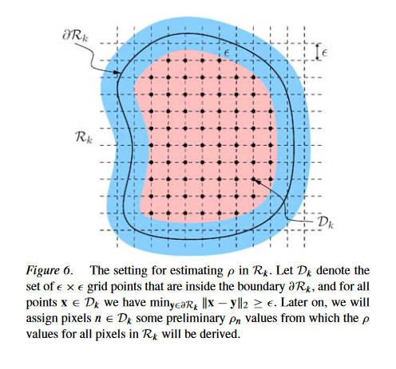

网格D是由一组$\epsilon\times\epsilon$的矩形组成的，其中每个矩形都在$R$内，并且和$R$的边缘都距离$\varepsilon$个像素。首先给$D$中的每一个像素$n$一个初始的$\rho_n$（本文使用$\rho_{max}=1.8, \epsilon = 4$）

$$
\rho_n=\begin{cases}
 \gamma, & \log(L_n/V_n)\leq -1 \\
 0.5\times(\gamma+\rho_{max}), & \log(L_n/V_n)\geq 1\\
 \rho_{max}, & otherwise
\end{cases}
$$

前两个行代表着该像素原始的亮度$L_n$已经和其局部亮度$V_n$差异很大了，用一个较大的$\rho_n$会过度增强细节。

另外，所有在$R$边缘的像素，其$\rho_n$都被设置为$\gamma$，在边缘和$D$之间的像素的$\rho_n$取值则可以通过插值获得。

在初步给像素赋$\rho_n$初值之后，就采用滤波器来光滑。

下一步是将映射曲线单调化，防止其出现光晕等问题。对于每一个区域$R_k$，其重塑后的色调映射曲线是

$$
\hat \varPsi(L,V;\rho, \gamma) = \alpha_k\varPsi(L, V;\rho, \gamma)+\beta_k
$$

为了估计这个$\alpha_k, \beta_k$，作者在每一个区域$R_k$的边缘，计算所有像素的$|\log(L_n/V_n)|$，然后升序排列，取前$N$个像素（本文取前5%），然后对于每一个取出来的像素，读取其$\varPsi_n$和$\hat \varphi_n^\gamma$，于是参数由下面的方程确定

$$
\begin{bmatrix}
 \varPsi_1 & \varPsi_2 & \cdots & \varPsi_N\\
 1 & 1 & \cdots & 1
\end{bmatrix}^T

\begin{bmatrix}
 \alpha_k \\
 \beta_k
\end{bmatrix} = 
\begin{bmatrix}
 \hat \varphi_1^\gamma & \hat \varphi_2^\gamma & \cdots & \hat \varphi_N^\gamma
\end{bmatrix}^T
$$

最终，映射公式是

$$
L'(x,y)=\hat \varPsi(L(x,y), V(x,y);\rho(x,y), \gamma) = \alpha_k\left(\dfrac{L(x,y)}{V(x,y)}\right)^{\rho(x,y)}\left(\dfrac{V(x,y)}{1+V(x,y)}\right)^\gamma + \beta_k
$$

（注：便于理解，$\hat \varphi$并不直接代回到这个公式里，而是隐式的通过求解方程的方式影响了$\hat \varPsi$）

总结：用亮度值分割，用了一种非常特别的算法去解决区域边缘问题。

# Scene-Segmentation-Based Exposure Compensation for Tone Mapping of High Dynamic Range Scenes

[https://ieeexplore.ieee.org/abstract/document/10849135/](https://ieeexplore.ieee.org/abstract/document/10849135/)

本文用上了亮度分割还有多重曝光tone mapping。

第一步，我们要将HDR图片分解出多个不同曝光度的照片。

首先，获得输入图像$E$的世界亮度（我理解的就是物理上的线性亮度）$\ell_w$。

然后，使用下式将亮度归一化到0 EV（曝光值）

$$
\ell_s(p)=\dfrac{\ell_{gray}}{G(\ell_w|P)}\ell_w(p)
$$

其中$\ell_{gray}$就是Reinhard中提到的key value，这里取$0.18$，$p$指的是该像素。$G$是个几何平均值，计算方法同Reinhard，对图像$P$，有

$$
G(\ell_w|P)=\exp\left(\dfrac{1}{|P|}\sum_{p\in P}\log\ell_w(p)\right)
$$

随后，使用高斯混合模型将这些像素分为$M$个类$\{P_m\}$，即

$$
p(\log\ell_s)=\sum^M_{m=1}\pi_mN(\log\ell_s|\mu_m, \sigma_m)
$$

$$
m=\underset{k}{\arg\max}\dfrac{\pi_kN(\log\ell_s(p)|\mu_k, \sigma_k)}{\sum^M_{j=1}\pi_jN(\log\ell_s(p)|\mu_j, \sigma_j)}
$$

之后我们将所有类用$\mu_m$排升序，即$P_1$代表最暗的块，$P_M$代表最亮的块。之后，我们找到一个参考区域$P_{m_{ref}}$，其对$\ell_{gray}$有最大贡献，即

$$
m_{ref} = \underset{k}{\arg\max}\ \pi_kN(\log\ell_{gray}|\mu_k,\sigma_k)
$$

接下来我们计算曝光时间$\Delta t_m$

$$
\Delta t_m=\dfrac{\exp(\mu'_m)}{\exp(\mu_m)}
$$

其中$\mu'_m$是目标均值，考虑显示器的亮度，作者将其端点的两个目标亮度均值使用最低曝光度和最高曝光度定义，即

$$
\mu'_1=\log 2^{v_{min}}\ell_{gray},\quad \mu'_M=\log2^{v_{max}}\ell_{gray}
$$

为了最大化区域之间的对比度，作者将剩下的目标均值均匀分散在log域亮度里

$$
\mu'_m=\begin{cases}
 \dfrac{\mu_{m_{ref}}-\mu'_1}{m_{ref}-1}(m-1)+\mu'_1, & 1<m<m_{ref} \\
 \mu_{m_{ref}}, & m=m_{ref}\\
 \dfrac{\mu'_M-\mu_{m_{ref}}}{M-m_{ref}}(m-m_{ref})+\mu_{m_{rref}}, & m_{ref}<m<M 
\end{cases}
$$

然后，使用曝光时间就获得了一系列不同的曝光图像

$$
\ell_m(p)=f(\ell_s(p)\Delta t_m)
$$

其中$f$是一个色调映射曲线，作者使用了Reinhard的全局版本，即

$$
f(\ell) = \dfrac{\ell}{1+\ell}\left(1+\dfrac{\ell}{\ell^2_{white}}\right)
$$

其中使用$\ell_{white}=2^{v_{white}}\ell_{gray}$

然后，第二步，使用生成的曝光图像来进行多曝光融合。

使用的是拉普拉斯金字塔的方法，记输入的多曝光图像为${x_m}$

$$
L_l[y](p)=\sum^M_{m=1}G_l[w_m](p)L_l[x_m]p
$$

其中$L_l[x_m](p)$指的是，图像$x_m$的第$l$层拉普拉斯金字塔的像素$p$的取值；而$G_l[w_m](p)$则是，混合权重图$w_m$（即第$m$层的混合权重）的第$l$层高斯金字塔在像素$p$的取值。接下来我们就考虑这个权重怎么算出来。

作者首先定义了亮度和目标均值的差异（很奇怪，没说是归一化前还是后的亮度）

$$
d_m(p)=g(\ell_m(p))-g(\exp(\mu'_m))
$$

其中$g(\ell)=(\gamma\circ f)(\ell)$，$\gamma$即为gamma校正，$f$则为前述的tone mapping。从而，混合权重为

$$
w_m(p)=\dfrac{\exp(-(d_m(p))^2)}{\sum^M_{k=1}\exp(-(d_k(p))^2)}
$$

这个公式旨在，使得亮度本身就接近目标亮度的图像具有更大的权重。

总结：亮度聚类分割，但不是直接分割了图片，而是决定了多重曝光的参数，多曝光融合避免区域边界融合问题。

# Segmentation Based Tone-Mapping for High Dynamic Range Images

[https://link.springer.com/chapter/10.1007/978-3-642-23687-7_33](https://link.springer.com/chapter/10.1007/978-3-642-23687-7_33)

作者用的前人的根据对象分割的方法， 作者注重讨论分割边缘处理和tone mapping。

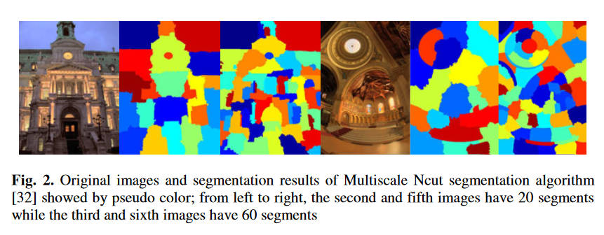

简单来说，作者使用的tone mapping是一个综合考虑直方图调整和线性映射的方法（HALEQ），

$$
d(x,y)=\beta\cdot EC[D(x,y)]+(1-\beta)\cdot LC[D(x,y)]
$$

其中$D$是原图log亮度，$d$是输出log亮度，$EC$是直方图调整，$LC$是线性映射。而$\beta$是可调系数，作者首先采用固定值$0.6$。作者在分割之后，对每一个小块内应用一次这个HALEQ，即

$$
d(x,y)=HALEQ_n[D(x,y)]\quad (x,y)\in n
$$

这个方法有两个问题：1. 边缘阶梯状改变。 2. 由于采用固定$\beta$，在一些颜色比较均匀的地方，仍然使用了较大比重的直方图调整，错误的加强了对比度，出现了噪声。

为了解决第一个问题，作者在考虑一个像素的时候，不只考虑其所在的区域，也考虑了$N$个最近的区域，加权计算最终的映射结果

$$
d(x,y)=\dfrac{\sum^N_{n=1}HALEQ_n[D(x,y)]\cdot w_d(n)}{\sum^N_{n=1}w_d(n)}
$$

其中的距离权重参数为

$$
w_d(n) = e^{-(d_n/\sigma_d)}
$$

$d_n$为当前像素和第$n$个区域的中心点的欧几里得距离，参数$\sigma_d$控制了平滑度。$\sigma_d$越大，$d_n$对于权重的影响就越小，亦即，分割边缘的伪影问题就越小，与此同时则导致了局部对比度丢失的越多。同样的，$N$的选择也有这种影响，$N$越大，伪影问题越小，局部对比度越损失。

为了解决第二个问题，作者引入了自适应调整$\beta$的方法。首先是检测这种颜色均匀的区域，观察到此种区域的直方图表现为很集中的一组数据，计算

$$
SD_n=\dfrac{\sum^M_{i=1}|Hist(i)-mean_n|}{M}
$$

$M$是bin的个数，$Hist(i)$是第i个bin的像素数量，$mean_n$则是每个bin内的像素的数量的均值。更大的$SD_n$表示每个bin内的像素的个数分布极不均匀，离均值很远，也就暗示着绝大部分像素分布在很集中的区域，也就是颜色均匀。当这个$SD_n$大于阈值$\eta$时，就视作一个均匀区域。作者选用了$M=20$，然后指出$\eta$对不同的图像有不同的最好选择。之后

$$
\beta = 0.6\cdot[1-e^{-(SD_{n_{max}}-SD_n)}]
$$

总结：针对对象进行分割，使用邻居加权的方式处理分割边缘问题。

# Clustering based content and color adaptive tone mapping

[https://www.sciencedirect.com/science/article/pii/S1077314217301789](https://www.sciencedirect.com/science/article/pii/S1077314217301789)

本文提出了一种非常不一样的策略，首先，它不使用那套提取出亮度，进行压缩，再进行颜色恢复的方式，而是把颜色和亮度一起考虑。首先，将图片分成重叠的方格，然后进行聚类，然后进行数据分析后的色调映射。

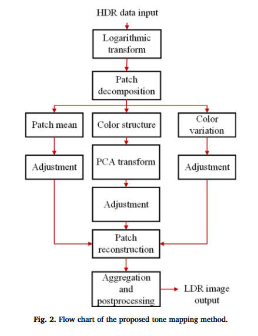

像前人的工作一样，一开始还是进行了一个log型曲线的初始化映射，本文使用的曲线为

$$
L(i,j,c)=\log(I(i,j,c)\cdot 10^6+1)
$$

其中$(i,j)$指的是像素坐标，而$c$是$RGB$通道中的一个。

然后，将图像分为$7\times 7$大小的重叠小块，步幅为$2$。设$\mathbf{x}$为该小块的颜色矩阵，而$\mathbf{x}_c$是其中的一个通道的矩阵，每个颜色通道的平均值（标量）记作$m_c$，于是

$$
\bar{\mathbf{x}}_c = \mathbf{x}_c-\mathbf{1}\cdot m_c
$$

此时$\bar{\mathbf{x}}_c$就是一个去除了直流分量的细节结构。而三个通道的颜色差异记作

$$
\bar m_c = m_c-m,\quad m=(m_r+m_g+m_b)/3
$$

结合上述，一个小块的颜色就能分解成

$$
\mathbf{x} = 
\begin{bmatrix}
\bar{\mathbf{x}}_r \\
\bar{\mathbf{x}}_g \\
\bar{\mathbf{x}}_b
\end{bmatrix}+
\begin{bmatrix}
\mathbf{1}\cdot m_r \\
\mathbf{1}\cdot m_g \\
\mathbf{1}\cdot m_b
\end{bmatrix}+
\begin{bmatrix}
\mathbf{1} \\
\mathbf{1} \\
\mathbf{1}
\end{bmatrix}
\cdot m = \bar{\mathbf{x}} + \bar{\mathbf{m}}+[\mathbf{1};\mathbf{1};\mathbf{1}]\cdot m
$$

把其中的$\bar{\mathbf{x}}$称作颜色结构，而$\bar{\mathbf{m}}$称作颜色差异。

接下来就是聚类环节，作者说用Kmeans还是GMM都可以，出于性能和效果的考虑，选择了Kmeans，其效果和GMM类似。在$\bar{\mathbf{x}}$上进行聚类，然后对每一类内部的$\bar{\mathbf{x}}$计算一个协方差矩阵$\Phi$，因为其半正定，于是进行特征值分解

$$
\Phi=Q\Lambda Q^{-1}
$$

因为$Q$包含了$\Phi$中的特征向量，所以主成分分析的变换矩阵为

$$
P=Q^T
$$

其中拥有较大特征值的特征向量代表了该聚类中最重要的结构特征，我们计算PCA域中的特征为

$$
\bar{\mathbf{y}} = P\bar{\mathbf{x}}
$$

注意$\bar{\mathbf{y}}$中的系数要比$\bar{\mathbf{x}}$中的更稀疏，小系数更多代表着噪音和不重要的结构特征。越大越重要。所以在$\bar{\mathbf{y}}$进行压缩要比在$\bar{\mathbf{x}}$上进行压缩要更具有鲁棒性。

在压缩操作中，首先把代表着噪声和不重要特征的，$\bar{\mathbf{y}}$中小于$0.1$的系数直接置$0$。而其他系数中，较大的需要被压缩，而较小的需要被增强，所以选用一条$S$型曲线

$$
\bar{\mathbf{y}}_a=(1.6/\pi)\cdot \arctan(a\cdot \bar{\mathbf{y}})
$$

其中$a$是一个参数，用于控制曲线形状，其越小，压缩程度越大。

而对于$\bar{\mathbf{m}}$，也使用同种曲线，但是参数不同

$$
\bar{\mathbf{m}}_b=(1.2/\pi)\cdot\arctan(b\cdot\bar{\mathbf{m}})
$$

而$m$的变化较为缓慢，用线性压缩即可，于是压缩后的图片小块为

$$
\mathbf{x}_t=P^T\bar{\mathbf{y}}_a+\bar{\mathbf{m}}_b+[\mathbf{1};\mathbf{1};\mathbf{1}]w\cdot m
$$

然后就是将小块混合在一起，以及后处理过程。混合非常简单，由于小块是重叠的，所以计算所有小块对该像素的贡献再求均值即可。而后处理方面，作者将最大和最小的$1\%$的像素值进行了裁剪，然后将所有小块中的像素值都拉伸到$[0,1]$的范围

后面还有一些扩展手段，但是核心方法就是上面所述的，略过。

总结：本文使用聚类进行分割，由于聚类所用的小块是重叠的，所以求平均即可避免分割边界问题。
