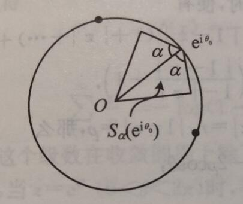

# 复数与复变函数

## 复数的定义及其运算

把负数定义为一堆有序的实数$(a,b)$，如果用$\bm R$作为实数集，$\bm C$为复数集，则

$$
\bm C = \{(a,b):a\in\bm R,b\in\bm R\}
$$

定义加法和乘法如下

$$
(a,b)+(c,d)=(a+c,b+d)
$$

$$
(a,b)(c,d)=(ac-bd,ad+bc)
$$

易知，加法和乘法满足交换率和结合律。

$(0,0)$是零元素，$(-a,-b)$是$(a,b)$的负元素，$(1,0)$是乘法的单位元素。每个非零元素$(a,b)$的逆元素是$(\frac{a}{a^2+b^2},-\frac{b}{a^2+b^2})$

此外还满足分配律

$$
[(a,b)+(c,d)](e,f) = (a,b)(e,f)+(c,d)(e,f)
$$

可以直接记$(a,0)=a$。

对于$(0,1)$有

$$
(0,1)^2=(-1,0)=-1
$$

记为$(0,1)=i$

同样有$(0,b)=(b,0)(0,1)=bi$

于是每一个复数都可以写成

$$
(a,b)=(a,0)+(0,b)=a+bi
$$

**定理1**

复数域不是有序域，换句话说，不可以比较大小。

出于方便和其他一些原因，用$z=a+bi$来描述复数，$a$称为$z$的实部，$b$称为$z$的虚部。可以记为$a=Rez,b=Imz$。

**四则运算**

*加法*

$$
(a+bi)+(c+di)=(a+c)+(b+d)i
$$

*乘法*

$$
(a+bi)(c+di)=(ac-bd)+(ad+bc)i
$$

*减法*

$$
(a+bi)-(c+di)=(a-c)+(b-d)i
$$

*除法*

$$
\frac{a+bi}{c+di}=(a+bi)\left(\frac{c-di}{c^2+d^2}\right)=\frac{ac+bd}{c^2+d^2}+\frac{bc-ad}{c^2+d^2}i
$$

**模**

$$
|z|=\sqrt{a^2+b^2}
$$

**共轭**

$$
\overline{z}=a-bi
$$

**定理2**

1. $Rez=(z+\overline{z})/2,Imz=(z-\overline z)/2i$
2. $z\overline z=|z|^2$
3. $\overline{z+w}=\overline z+\overline w,\overline{zw}=\overline z\cdot\overline w$
4. $|zw|=|z||w|,|z/w|=|z|/|w|$
5. $|z|=|\overline z|$
6. $|Rez|\leq |z|,|Imz|\leq|z|$
7. $|z+w|\leq|z|+|w|$当且仅当存在一个$t\geq 0,z=tw$时取等。
8. $|z-w|\geq||z|-|w||$

## 复数的几何表示

**三角表示法**

复数能用上一节提到的实数对$(a,b)$表示，同时就可以看成平面上的一个点。同样的，也可以用极坐标$(r,\theta)$表示，那么有，

$$
a=rcos\theta,b=rsin\theta
$$

所以复数也可以表示为

$$
z=r(cos\theta+isin\theta)
$$

其中$r=|z|$，$\theta$称为辐角，记为$\theta=Argz$。显然若$\theta$是辐角，那么$\theta+2k\pi$也是辐角。但在$Argz$中，只有一个辐角满足$-\pi<\theta\leq\pi$，称为辐角的主值，记为$argz$，所以有

$$
Argz=argz+2k\pi,\quad k\in Z
$$

特别注意，模为0的复数的辐角没有意义。

**指数表示法**

由欧拉公式

$$
e^{i\theta}=cos\theta+isin\theta
$$

得到

$$
z=re^{i\theta}
$$

**de Moivre公式**

设$z_1=r_1(cos\theta_1+isin\theta_1),\cdots,z_n=r_n(cos\theta_n+isin\theta_n)$是给定的n个复数，数学归纳法可知

$$
z_1\cdots z_n=r_1\cdots r_n[cos(\theta_1+\cdots+\theta_n)+isin(\theta_1+\cdots+\theta_n)]
$$

作为特殊情况，有

$$
z^n=r^n(\cos n\theta+i\sin n\theta)
$$

同样对于负整数也是成立的

$$
z^{-n}=r^{-n}(\cos(-n\theta)+i\sin(-n\theta))
$$

现在设$\omega=r(\cos\theta+i\sin\theta)$是给定的，要求的$z=\rho(\cos\varphi+i\sin\varphi)$.由de Moivre公式，$z^n=\omega$等价为

$$
\rho^n(\cos n\varphi+i\sin n\varphi)=r(\cos\theta+i\sin\theta)
$$

所以$\rho=\sqrt[n]{r},n\varphi=\theta+2k\pi,k=0,1,\cdots,n-1$.共有$n$个复数满足$z^n=w$，即

$$
z=\sqrt[n]{|\omega |}\left(\cos\frac{\theta+2k\pi}{n}+i\sin\frac{\theta+2k\pi}{n}\right),k=0,1,\cdots,n-1
$$

这$n$个复数恰好是以原点为中心，$\sqrt[n]{|\omega |}$为半径的圆的内接正$n$边形的顶点。

$\omega=1$时，若记$w=\cos\frac{2\pi}{n}+i\sin\frac{2\pi}{n}$，则$\sqrt[n]{1}$的$n$个值为

$$
1,w,w^2,\cdots,w^{n-1}
$$

称为$n$个单位根，如果用$\sqrt[n]{\omega}$的任一$n$次根，那么$\omega$的$n$个$n$次根又可以表示为

$$
\sqrt[n]{\omega}, \sqrt[n]{\omega}w,\cdots,\sqrt[n]{\omega}w^{n-1}
$$

## 扩充平面和复数的球面表示

因为需要，在$\bm C$中引入一个新的数$\infty$，其模是$\infty$，辐角没有意义，运算规则如下

$$
z\pm\infty = \infty, z\cdot \infty = \infty(z\neq 0)
$$

$$
\frac{z}{\infty} = 0, \frac{z}{0} = \infty(z\neq 0)
$$

而$0\cdot \infty$和$\infty\pm\infty$不规定意义。引入之后的复数系记为$\bm C_\infty$。在复平面上，没有一个点和$\infty$对应，但是我们想象有一个无穷远点和$\infty$对应，加上无穷远点的复平面称为扩充平面或闭平面。否则是开平面。

在复平面上，无穷远点和普通点是不一样的。但在黎曼引入的球面表示中没有什么区别。

设$S$是$\bm R^3$中的单位球面，即

$$
S = \{(x_1,x_2,x_3)\in \bm R^3:x_1^2+x_2^2+x_3^2=1\}
$$

把$\bm C$等同于平面

$$
\bm C = \{(x_1,x_2,0):x_1,x_2\in \bm R\}
$$

称$N=(0,0,1)$为北极点。在$\bm C$上的任一一点$z$，连接$N,z$的直线必然和$S$交于一点$P$。若$|z|>1$，则$P$在北半球；若$|z|<1$，则$P$在南半球；若$|z|=1$，则$z$就是$P$。

当$z$趋向$\infty$时，球面上的点就会趋向于$N$，所以就可以把$\infty$对应于$N$。这样一来$\bm C_\infty$中的所有点都可以被移植到球面上去了，并且所有的点一视同仁。

设$z=x+iy$，则$P$的坐标为

$$
x_1=\frac{2x}{x^2+y^2+1},x_2=\frac{2y}{x^2+y^2+1},x_3=\frac{x^2+y^2-1}{x^2+y^2+1}
$$

或者用复数表示为

$$
x_1=\frac{z+\bar z}{1+|z|^2},x_2=\frac{z-\bar z}{i(1+|z|^2)},x_3=\frac{|z|^2-1}{|z|^2+1}
$$

同样也就可以用球面上的点来表示复数

$$
z=\frac{x_1+ix_2}{1-x_3}
$$

## 复数列的极限

**极限**

复数列$\{z_n\}$收敛到点$z_0$，指的是对于任给的$\varepsilon>0$，存在正整数$N$，当$n>N$时，$|z_n-z_0|<\varepsilon$，记作$\lim_{n\to \infty}z_n=z_0$

复数列$\{z_n\}$收敛到$\infty$，指的是对于任意正数$M>0$，存在正整数$N$，当$n>N$时，$|z_n|>M$，记为$\lim_{n\to\infty}z_n=\infty$

**邻域**

对于$a\in\bm C,r>0$，称

$$
B(a,r)=\{z\in C:|z-a|<r\}
$$

为以$a$为中心、以$r$为半径的圆盘，特别当$a=0,r=1$时称为单位圆盘。$B(a,r)$也称为$a$点的一个$r$邻域，或简称邻域。无穷远点的邻域是指集合$\{z\in \bm C:|z|>R\}$，记为$B(\infty, R)$

此时极限有可以表示为：

$\lim_{n\to \infty}z_n=z_0$可以说成对任意$\varepsilon>0$，当$n$充分大时，$z_n\in B(z_0,\varepsilon)$

$\lim_{n\to\infty}z_n=\infty$可以说成对任意$M>0$，当$n$充分大时，$z_n\in B(\infty, M)$

同时马上就可以得到，$\lim_{n\to \infty}z_n=z_0$的充要条件是，其实部和虚部分别有$\lim_{n\to \infty}x_n=x_0$和$\lim_{n\to \infty}y_n=y_0$。

## 开集、闭集和紧集

**内点**

如果存在$r>0$，使得$B(a,r)\subset E$，就称$a$为$E$的内点

**外点**

如果存在$r>0$使得$B(a,r)\subset E^c$，就称$a$为$E$的外点。其中$E^c$是补集。

**边界点**

如果对于任意$r>0$,$B(a,r)$中既有$E$的点，也有$E^c$的点，就称$a$为$E$的边界点。

**内部**

$E$的内点的全体称为$E$的内部，记为$E\degree$

**外部**

$E$的外点的全体称为$E$的外部，记为$(E^c)\degree$

**边界**

$E$的边界点的全体称为$E$的边界，记为$\partial E$

**开集**

如果$E$的所有点都是他的内点，即$E=E\degree$，就称$E$是开集。

另外，空集是开集。

**闭集**

如果$E^c$是开集，就称$E$为闭集。

另外，无限集是闭集。

**极限点、聚点**

如果对任意$r>0$，$B(a,r)$中除$a$外总有$E$中的点，则称$a$为极限点或聚点。

**导集**

集$E$的所有极限点构成的集称为$E$的导集，记为$E'$。

**孤立点**

$E$中不属于$E'$的点称为孤立点。

**闭包**

$E$和它的导集的并称为$E$的闭包，记为$\bar E=E\cup E'$

**直径**

点集$E$的直径定义为$E$中任意两点间距离的上确界，记为$diamE$，即

$$
diamE=sup\{|z_1-z_2|:z_1,z_2\in E\}
$$

**Cantor定理**

若非空闭集序列$\{F_n\}$满足

1. $F_1\supset F_2\supset\cdots\supset F_n\supset\cdots$
2. $diamF_n\to 0$（当$n\to \infty$时）

那么$\bigcap^\infty_{n=1}F_n$是一个独点集（只有一个点的集）。

**开集族、开覆盖**

设$E$是一个集，$\mathscr{F}=\{G\}$是一个开集族，即$\mathscr{F}$中的每一个元素都是开集。如果$E$中每一点至少属于$\mathscr{F}$中的一个开集，就说$\mathscr{F}$是$E$的一个开覆盖。

**有限覆盖性质**

点集$E$具有有限覆盖性质，是指从$E$的任一个开覆盖中必能选出有限个开集$G_1,\cdots,G_n$，使得这有限个开集的并就能覆盖$E$，即

$$
E\subset\bigcup^n_{j=1}G_j
$$

**紧集**

具有有限覆盖性质的集称为紧集。

**有界**

集$E$称为是有界的，如果存在$R>0$，使得$E\subset B(0,R)$

**Heine-Borel定理**

在$C$中，$E$是紧集的充要条件为$E$是有界闭集；在$C_\infty$中，$E$是紧集的充要条件为$E$是闭集。

**定理**

设$E$是紧集，$F$是闭集，且$E\cap F=\empty$，则

$$
d(E,F) > 0
$$

其中

$$
d(E,F) = \inf\{|z_1-z_2|:z_1\in E, z_2\in F\}
$$

**Bolzano-Weierstrass定理**

任一无穷点集至少有一个极限点。

## 曲线和域

**连续曲线**

定义在闭区间$[a,b]$上的一个复值连续函数$\gamma:[a,b]\to \bm C$，写为

$$
z = \gamma(t)=x(t)+iy(t),\quad a\leq t\leq b
$$

这里$x(t),y(t)$都是$[a,b]$上的连续函数。

如果用$\gamma^*$记$\gamma$的像点所成的集合

$$
\gamma^* = \{\gamma(t):a\leq t\leq b\}
$$

那么$\gamma^*$是$\bm C$上的紧集。

曲线$\gamma$的方向就是$t$增加的方向。此时$\gamma(a)$为起点，$\gamma(b)$为终点。

**闭曲线**

如果$\gamma(a)=\gamma(b)$，则称为闭曲线。

**简单曲线**

如果当且仅当$t_1=t_2$时才有$\gamma(t_1)=\gamma(t_2)$，则称为简单曲线或Jordan曲线。

**简单闭曲线**

如果当且仅当如果当且仅当$t_1=a,t_2=b$时才有$\gamma(t_1)=\gamma(t_2)$，则称为简单闭曲线或Jordan闭曲线，或简称围道。

**可求长的**

设$z=\gamma(t)$是一条曲线，对区间$[a,b]$做分割$a=t_0<t_1<\cdots<t_n=b$，得到以$z_k=\gamma(t_k)$为顶点的折线$P$，那么$P$的长度为

$$
|P|=\sum_{k=1}^n|\gamma(t_k)-\gamma(t_{k-1})|
$$

如果不论如何分割区间$[a,b]$，所得折线的长度都是有界的，就称曲线$\gamma$是可求长的，其长度定义为$\gamma$的上确界。

**光滑曲线**

如果$\gamma'(t)=x'(t)+iy'(t)$存在，且$y'(t)\neq 0$，那么$\gamma$在每一点都有切线，$\gamma'(t)$就是曲线$\gamma$在$\gamma(t)$处的切向量，它与正实轴的夹角为$Arg\gamma'(t)$，

如果$\gamma'(t)$是连续函数，那么$\gamma$的切线随$t$而连续变动，这时称$\gamma$为光滑曲线。

此时$\gamma$的长度为

$$
\int^b_a \sqrt{(x'(t))^2+(y'(t))^2}dt = \int^b_a|\gamma'(t)|dt
$$

曲线$\gamma$称为逐段光滑的。

如果存在$t_0,t_1,\cdots,t_n$，使得$a=t_0<t_1<\cdots<t_n=b$，$\gamma$在每个参数区间$[t_{j-1},t_j]$上是光滑的，那么在每个分点$t_1,\cdots,t_{n-1}$处$\gamma$的左右导数存在。

**连通性**

平面点集$E$称为是联通的，如果对任意两个不相交的非空集$E_1$和$E_2$满足

$$
E = E_1\bigcup E_2
$$

那么$E_1$必含有$E_2$的极限点，或者$E_2$必含有$E_1$的极限点，也就是说，$E_1\cap\bar E_2$和$E_2\cap\bar E_1$至少有一个非空。

**定理1**

平面上的非空开集$E$是连通的充分必要条件是：$E$中任意两点可用位于$E$中的折线连接起来。

**域**

非空的连通开集称为域

**Jordan定理**

一条简单闭曲线$\gamma$吧复平面分成两个域，其中一个是有界的，称为$\gamma$的内部；另一个是无界的，称为$\gamma$的外部，而$\gamma$是这两个域的共同的边界。

**单连通与多连通**

域$D$称为是单连通的，如果$D$内任意简单闭曲线的内部仍在$D$内。

不是单连通的域称为多连通的。

如果域$D$是由$n$跳简单闭曲线围成的，就称$D$是$n$连通的，简单闭曲线中也可以有退化成一条简单曲线或一点的。

## 复变函数的极限和连续性

设$E$是复平面上一点集，如果对每一个$z\in E$，按照某一规则有一确定复数$\omega$与之对应，我们就说在$E$上确定了一个单值复变函数，记为$\omega=f(z)$或$f:E\to C$。

$E$称为$f$的定义域，点集$\{f(z):z\in E\}$称为$f$的值域。

如果对于$z\in E$，对应的$\omega$有几个或无穷多个，则称在$E$上确定了一个多值函数。

复变函数是定义在平面点集上的，而它的值域也是一个平面点集，因此复变函数也称为映射，它把一个平面点集映成另一个平面点集。

设$z=x+iy$，用$u$和$v$记$\omega=f(z)$的实部和虚部，则有

$$
\omega=f(z)=u(z)+iv(z)=u(x,y)+iv(x,y)
$$

这就是说，一个复变函数等价于两个二元的实变函数。

**极限**

设$f$是定义在点集$E$上的一个复变函数，$z_0$是$E$的一个极限点，$a$是给定的一个复数。如果对任意的$\varepsilon>0$，存在于$\varepsilon$有关的$\delta>0$，使得当$z\in E$且$0<|z-z_0|<\delta$时有$|f(z)-a|<\varepsilon$，就说当$z\to z_0$时$f(z)$有极限$a$，记作$\lim_{z\to z_0}f(z)=a$。

$\lim_{z\to z_0}f(z)=a$的充分必要条件是

$$
\lim_{x\to x_0,y\to y_0}u(x,y)=\alpha,\lim_{x\to x_0,y\to y_0}v(x,y)=\beta
$$

**连续**

我们说$f$在点$z_0\in E$连续，如果

$$
\lim_{z\to z_0}f(z)=f(z_0)
$$

如果$f$在集$E$中每点都连续，就说$f$在集$E$上连续。

**定理**

设$E$是$\bm C$中的紧集，$f:E\to\bm C$在$E$上连续，那么

1. $f$在$E$上有界
2. $|f|$在$E$上能取得最大值和最小值，即存在$a,b\in E$使得对于每个$z\in E$都有

$$
|f(z)|\leq |f(a)|，|f(z)|\geq|f(b)|
$$

3. $f$在$E$上一致连续。即对任意$\varepsilon>0$，存在只与$\varepsilon$有关的$\delta>0$，对$E$上任意的$z_1,z_2$，只要$|z_1-z_2|<\delta$，就有$|f(z_1)-f(z_2)|<\varepsilon$

# 全纯函数/解析函数

## 复变函数的导数

设$f:D\to\bm C$是定义在域$D$上的函数，$z_0\in D$，如果极限

$$
\lim_{z\to z_0}\frac{f(z)-f(z_0)}{z-z_0}
$$

存在，就说$f$在$z_0$处复可导或可微，这个极限称为在此处的导数或微商。

如果$f$在$D$中每点都可微，就称$f$是域$D$中的全纯函数或解析函数。

如果$f$在$z_0$的一个邻域中全纯，就称$f$在$z_0$处全纯。

**定理1**

如果$f$在$z_0$处可微，则必在$z_0$处连续。反过来说则不一定成立。

求复变函数的导数时，跟一元实变函数几乎没有什么区别，例如$f(z)=z^3, f'(z)=3z^2$。但是更加严格的一点时，在复平面上任何一个方向上的导数都要相等，而不是一元实变函数左右相等。

实变函数的四则运算的求导法则在全纯函数中也成立。

**定理2**

设$D_1,D_2$是$\bm C$中的两个域，且

$$
f:D_1\to D_2\\
g:D_2\to\bm C
$$

都是全纯函数，那么$h=g\circ f$是$D_1\to \bm C$的全纯函数，并且$h'(z)=g'(f(z))f'(z)$

## Cauchy-Riemann方程

**实可微**

设$f(z)=u(x,y)+iv(x,y)$是定义在域$D$上的函数，$z_0=x_0+iy_0\in D$.我们说$f$在$z_0$处实可微，是指$u,v$作为$x,y$的二元函数在$(x_0,y_0)$处可微。

设$f:D\to C$是定义在域$D$上的函数，$z_0\in D$，那么$f$在$z_0$处实可微的充要条件是下式成立

$$
f(z_0+\Delta z)-f(z_0)=\frac{\partial f}{\partial z}(z_0)\Delta z+\frac{\partial f}{\partial \bar z}(z_0)\Delta z+o(|\Delta z|)
$$

其中算子定义如下

$$
\frac{\partial}{\partial z}=\frac{1}{2}\left(\frac{\partial}{\partial x}-i\frac{\partial}{\partial y}\right)
$$

$$
\frac{\partial}{\partial \bar z}=\frac{1}{2}\left(\frac{\partial}{\partial x}+i\frac{\partial}{\partial y}\right)
$$

在进行微分运算时，可以把$z,\bar z$看成独立的变量。

**柯西-黎曼方程**

设$f$是定义在域$D$上的函数，$z_0\in D$，那么$f$在$z_0$处可微的充要条件是$f$在$z_0$处实可微且$\frac{\partial f}{\partial \bar z}(z_0)=0$.

在可微的情况下，$f'(z_0)=\frac{\partial f}{\partial z}(z_0)$.

其中$\frac{\partial f}{\partial \bar z}(z_0)=0$就称为柯西-黎曼方程。

将$u,v$代入以及算子展开，可以得到其等价于

$$
\left\{\begin{matrix}
\frac{\partial u}{\partial x}=\frac{\partial v}{\partial y} \\
\frac{\partial u}{\partial y}=-\frac{\partial v}{\partial x}
\end{matrix}\right.
$$

**调和函数**

设$u$是域$D$上的实值函数，如果$u\in C^2(D)$，且对于任意$z\in D$，有

$$
\Delta u(z)=\frac{\partial^2u(z)}{\partial x^2}+\frac{\partial^2u(z)}{\partial y^2}=0
$$

就称$u$是$D$中的调和函数。

$$
\Delta=\frac{\partial^2}{\partial x^2}+\frac{\partial^2}{\partial y^2}
$$

称为拉普拉斯算子。

设$D$是$\bm C$中的域，用$C(D)$表示$D$上连续函数的全体，$H(D)$表示$D$上全纯函数的全体。

用$C^1(D)$记$\frac{\partial f}{\partial x},\frac{\partial f}{\partial y}$在$D$上连续的$f$的全体。

有

$$
H(D)\subset C^\infty(D)\subset C^k(D)\subset C^1(D)\subset C(D)
$$

即域$D$上的全纯函数在$D$上有任意阶的连续偏导数。

*定理1*

设$f=u+iv\in H(D)$，那么$u,v$都是$D$上的调和函数。

**共轭调和函数**

设$u,v$是$D$上的一堆调和函数，如果它们还满足柯西-黎曼方程，

$$
\left\{\begin{matrix}
\frac{\partial u}{\partial x}=\frac{\partial v}{\partial y} \\
\frac{\partial u}{\partial y}=-\frac{\partial v}{\partial x}
\end{matrix}\right.
$$

就称$v$为$u$的共轭调和函数。

*定理1*

设$u$是单连通域$D$上的调和函数，则必存在$u$的共轭函数$v$，使得$u+iv$是$D$上的全纯函数。

## 导数的几何意义

过$z_0$点作一条光滑曲线$\gamma$，它的方程为

$$
z = \gamma(t),a\leq t\leq b
$$

设$\gamma(a)=z_0,\gamma'(a)\neq 0$。$\gamma$在点$z_0$处的切线与正实轴的夹角为$Arg\gamma'(a)$。设$\omega = f(z)$把曲线$\gamma$映为$\sigma$，它的方程为

$$
\omega=\sigma(t)=f(\gamma(t)),a\leq t\leq b
$$

由于$\sigma'(a)=f'(\gamma(a))\gamma'(a)=f'(z_0)\gamma'(a)\neq 0$，所以$\sigma$在$\omega_0=f(z_0)$处的切线与正实轴的夹角为

$$
Arg\sigma'(a) = Argf'(z_0)+Arg\gamma'(a)
$$

或者写为

$$
Arg\sigma'(a) - Arg\gamma'(a) = Argf'(z_0)
$$

这就说明像曲线$\sigma$在$\omega_0$处的切线与正实轴的夹角与原曲线$\gamma$在$z_0$处的切线与正实轴的夹角之差总是$Argf'(z_0)$，而与曲线$\gamma$无关，$Argf'(z_0)$就称为映射$\omega=f(z)$在$z_0$处的转动角。

过点$z_0$作两条光滑曲线$\gamma_1,\gamma_2$，它们的方程分别为

$$
z=\gamma_1(t),a\leq t\leq b
$$

和

$$
z=\gamma_2(t),a\leq t\leq b
$$

且$\gamma_1(a)=\gamma_2(a)=z_0$。映射$\omega=f(z)$把它们分别映为过$\omega_0$点的两条光滑曲线$\sigma_1$和$\sigma_2$，他们的方程分别为

$$
\omega = \sigma_1(t)=f(\gamma_1(t)),a\leq t\leq b
$$

$$
\omega = \sigma_2(t)=f(\gamma_2(t)),a\leq t\leq b
$$

因为$\sigma'(a)=f'(\gamma(a))\gamma'(a)=f'(z_0)\gamma'(a)\neq 0$，所以有

$$
Arg\sigma'(a) = Argf'(z_0)+Arg\gamma'(a)
$$

或者写为

$$
Arg\sigma'(a)-Arg\gamma'(a) = Argf'(z_0)
$$

由此就有

$$
Arg\sigma_1'(a)-Arg\gamma_1'(a) = Argf'(z_0) = Arg\sigma_2'(a)-Arg\gamma_2'(a)
$$

上式说明，如果$f'(z_0)\neq 0$，那么在映射$\omega=f(z)$的作用下，过$z_0$点的任意两条光滑曲线的夹角的大小与旋转方向都是保持不变的。

我们把这种性质的映射称为在$z_0$点是保角的。

**定理**

全纯函数在其导数不为零的点处是保角的。

**导数的模的几何意义**

$|f'(z_0)|$为$f$在$z_0$处的伸缩率。

像点之间的距离与原像之间的距离之比只与$z_0$有关，而与$\gamma$无关。

**共形映射的概念**

综合导数辐角和模的几何意义，我们看到：如果$f'(z_0)\neq0$，在$z_0$的邻域中，作一个以$z_0$为顶点的小三角形，这个小三角形被$f$映射为一个曲边三角形，它的微分三角形和原来的小三角形相似。因此，我们把这样的一个映射称为共形映射。

更形式化的定义是：设函数$\omega=f(z)$在$z_0$的领域内有定义，且在$z_0$处具有保角性和伸缩率的不变性，那么称映射$\omega=f(z)$是共形映射。如果对$D$内每一点都是共形的，那么$\omega=f(z)$是在$D$内的共形映射。

如果$\omega=f(z)$在$z_0$全纯，$f'(z_0)\neq 0$，那么其在$z_0$是共形的。

如果$\omega=f(z)$只保证伸缩率的不变性和夹角的绝对值不变（但方向相反），那么称为第二类共形映射，之前提到的属于第一类共形映射。

## 初等全纯函数

### 指数函数

设$z=x+iy$，定义

$$
e^z = e^x(\cos y+i\sin y)
$$

具有如下性质

1. $(e^z)'=e^z$
2. 复数的三角表示$z=r(\cos\theta+i\sin\theta)$可以表示为$z=re^{i\theta}$
3. 对于任意$z\in \bm C,e^z\neq 0$，这是因为

$$
|e^z|=e^x>0
$$

4. 对于任意$z_1,z_2$，有

$$
e^{z_1}e^{z_2}=e^{z_1+z_2}
$$

5. $e^z$是以$2\pi i$为周期的周期函数。

**单叶**

设$f:D\to \bm C$是一个复变函数，如果对于$D$中的任意两点$z_1,z_2(z_1\neq z_2)$，必有$f(z_1)\neq f(z_2)$，就称$f$在$D$中是单叶的，$D$称为$f$的单叶性域。

$\omega=e^z$的单叶性域有

$$
\{z=x+iy:2k\pi<y<2(k+1)\pi\},k=0,\pm1,\cdots
$$

### 对数函数

对于给定的$z\in C$，满足方程$e^\omega=z$的$\omega$称为$z$的对数，记为$\omega=Logz$。

设$z=re^{i\theta}$，$\omega=u+iv$，则$e^{u+iv}=re^{i\theta}$，所以$e^u=r,v=\theta+2k\pi$。所以有

$$
Logz=log|z|+iargz+2k\pi=log|z|+iArgz
$$

所以，$Logz$是一个多值函数，它的多值性是由$z$的辐角$Argz$的多值性产生的。

**定理1**

如果$D$是不包含原点和无穷远点的单连通域，则必在$D$上存在无穷多个单值全纯函数$\varphi_k,k=0,\pm1,\cdots$，使得在$D$上成立

$$
e^{\varphi_k(z)}=z,k=0,\pm1,\cdots;
$$

而且对每一个$k$，有$\varphi_k'(z)=\frac{1}{z}$.其中的每一个$\varphi_k$都称为$Logz$在$D$上的单值全纯分支。

至于为什么不包含原点和无穷远点：如果包含原点，那么$D$中就包含绕原点$z=0$的简单闭曲线$\gamma$，当$z$从$\gamma$上的一点$z_0$沿$\gamma$的正方向（即逆时针）回到$z_0$时，$z$的辐角增加了$2\pi$，$\varphi_{k_0}(z_0)$的值连续地变为$\varphi_{k_0+1}(z_0)$，而不再回到原来的$\varphi_{k_0}(z_0)$。因此再这样的域中就不可能分出单值的全纯分支。无穷远点同理。

**定义1**

如果当$z$沿着$z_0$的充分小邻域中的任意简单闭曲线绕一圈时，多值函数的值就从一支变到另一支，那么称$z_0$为该多值函数的一个支点。

以对数函数为例，$z=0,z=\infty$就是$Logz$的支点。

### 幂函数

$\omega=z^\mu$称为幂函数，这里$\mu=a+bi$，分情况讨论

**1. $\mu=n$，是一个自然数**

按照导数的定义，可以直接算出

$$
(z^n)'=nz^{n-1}
$$

其在$C$上每一点都是全纯的。这种函数也称作**整函数**

它的单叶性域是

$$
\bigg\{z:\alpha<argz<\beta,0<\beta-\alpha\leq\frac{2\pi}{n}\bigg\}
$$

**2. $\mu=\frac{1}{n}$，n是一个自然数**

对于一个给定的$z$，$z^{1/n}$有$n$个值，所以它是一个多值函数。多值性由$Argz$产生，$0,\infty$是其支点。$C$去掉正实轴后所成的域上可以分出$n$个单值的全纯分支，它们是

$$
\omega = \varphi_k(z) = \sqrt[n]{|z|}\bigg(\cos\frac{\theta+2k\pi}{n}+i\sin\frac{\theta+2k\pi}{n}\bigg)
$$

$$
k=0,1,\cdots,n-1
$$

其中$\theta=argz$，变化范围在$0<argz<2\pi$

**3. $\mu = a+bi$，是一个负数**

一般的幂函数$\omega=z^\mu$定义为

$$
\omega = z^\mu=e^{\mu Logz}
$$

显然这也是个多值函数

$$
\omega = exp(alog|z|-b(argz+2k\pi))exp(i[blog|z|+a(argz+2k\pi)])
$$

$$
k=0,\pm1,\cdots
$$

1. 若$b=0,a=n$是一个整数，则$\omega=z^n$是一个单值函数
2. 若$b=0,a=p/q$是一个有理数，不妨设$p<q$，这时

$$
\omega=z^\mu=z^{p/q}=|z|^{p/q}exp(i\frac{p}{q}(argz+2k\pi))
$$

当$k=0,1,\cdots,q-1$时，$\omega$有$q$个不同的值

3. 若$b=0,a$是一个无理数，这时

$$
\omega = z^\mu = |z|^aexp(iaargz)exp(i2k\pi a)
$$

此时$z^a$是一个无穷值函数

4. 若$b\neq 0$，则$\omega=z^\mu$是一无穷值函数。

### 三角函数

由欧拉公式知道

$$
e^{ix} = \cos x+i\sin x\\
e^{-ix} = \cos x -i\sin x
$$

可以得到

$$
\cos z = \frac{1}{2}(e^{ix}+e^{-ix})\\
\sin z = \frac{1}{2i}(e^{ix}-e^{-ix})
$$

有如下性质

1. 正弦余弦都是整函数，并且

$$
(\cos z)' = -\sin z\\
(\sin z)' = \cos z
$$

2. 以$2\pi$为周期
3. $\cos z$是偶函数，$\sin z$是奇函数
4. 对任意$z_1,z_2$

$$
\cos (z_1+z_2) = \cos z_1\cos z_2 - \sin z_1\sin z_2\\
\sin (z_1+z_2) = \sin z_1\cos z_2 + \cos z_1\sin z_2\\
$$

5. $\cos^2 z+\sin^2 z=1,\quad \sin 2z = 2\sin z\cos z$
6. $\sin z$仅在$z=k\pi$处为零，$\cos z$仅在$k\pi+\pi/2$处为零，$k=0,\pm1,\cdots$
7. $\cos z,\sin z$不是有界函数

同样我们就能定义正切余切

$$
\tg z = \frac{\sin z}{\cos z}
$$

$$
\ctg z = \frac{\cos z}{\sin z}
$$

前者在除掉$z=\pi/2+k\pi$的开平面上全纯，后者在除掉$z=k\pi$的开平面上全纯，$k=0,\pm1,\cdots$。

之后我们也能定义双曲函数

$$
chz=\frac{e^z+e^{-z}}{2},shz=\frac{e^z-e^{-z}}{2}
$$

并且有

$$
(chz)'=shz,(shz)'=chz
$$

反三角函数有

$$
Arcsinz=-iLn(iz+\sqrt{1-z^2})
$$

$$
Arccosz=-iLn(z+\sqrt{z^2-1})
$$

$$
Arctanz=-\frac{i}{2}Ln\frac{1+iz}{1-iz}
$$

反双曲函数有

$$
Arshz = Ln(z+\sqrt{z^2+1})
$$

$$
Archz = Ln(z+\sqrt{z^2-1})
$$

$$
Arthz = \frac{1}{2}Ln\frac{1+z}{1-z}
$$

## 分式线性变换

形如$\omega=T(z)=\frac{az+b}{cz+d}$的映射称为分式线性变换或Mobius变换，其中$a,b,c,d$是复常数，且满足$ad-bc\neq 0$，如果等于$0$原式就是常数或无意义，没有讨论价值。

如果$c\neq 0$，则除去点$z=-\frac{d}{c}$外，$T(z)$在$\bm C$上是全纯的，而且

$$
T'(z)=\frac{ad-bc}{(cz+d)^2}\neq 0
$$

所以分式线性变换在$z\neq -\frac{d}{c}$处是保角变换。

若$c=0$，则必$d\neq 0$，此时$T(z)=Az+B(A=a/d,B=b/d)$，称为整线性变换，它是一个整函数。

从方程$\omega=T(z)$中把$z$解出来，得

$$
z = T^{-1}(\omega)=\frac{-d\omega+b}{c\omega-a}
$$

称为$\omega=T(z)$的逆变换，它仍然是一个分式线性变换。由此可知$\omega=T(z)$在$\bm C$上是单叶的，当$c\neq 0$时，规定$T(-\frac{d}{c})=\infty,T(\infty)=\frac{a}{c}$。当$c=0$时，规定$T(\infty)=\infty$，于是$\omega=T(z)$把$\bm C_\infty$单叶地映射为$C_\infty$。

设$S,T$是两个分式线性变换，那么$S\circ T$也是分式线性变换。且对每一个$T$，都有逆变换$T^{-1}$，即$T(T^{-1}(z))=z$

分式线性变换有如下性质

1. 保角性
2. 分式线性变换把圆周变成圆周（保圆性）

分式线性变换也能拆成多个变换，例如

$$
\omega = \dfrac{az+b}{cz+d}
$$

就可以拆成三个变换

$$
z' = cz+d\\
z'' = \dfrac{1}{z'}\\
\omega=\alpha+\beta z''
$$

其中$\alpha = \dfrac{a}{c},\beta=\dfrac{bc-ad}{c}$。

这个变换中第一个第三个是整线性变换，也就是进行了伸缩和平移变换。当然圆在伸缩和平移后还是一个圆。我们同样可以证明$\omega=\dfrac{1}{z}$把圆周变为圆周，此时我们证明了分式线性变换吧圆周变为圆周。

3. 交比是分式线性变换的不变量

**命题1**

分式线性变换$T$最多只有两个不动点，除非是恒等变换，即$T(z)\equiv z$

**定义1**

设$z_1,z_2,z_3,z_4$是给定的四个点，其中至少有三个点是不相同的，称比值

$$
\frac{z_1-z_3}{z_1-z_4}\bigg /\frac{z_2-z_3}{z_2-z_4}
$$

为这四个点的交比，记为$(z_1,z_2,z_3,z_4)$

规定

$$
(\infty,z_2,z_3,z_4)=\frac{z_2-z_4}{z_2-z_3}
$$

$$
(z_1,\infty,z_3,z_4)=\frac{z_1-z_3}{z_1-z_4}
$$

$$
(z_1,z_2,\infty,z_4)=\frac{z_2-z_4}{z_1-z_4}
$$

$$
(z_1,z_2,z_3,\infty)=\frac{z_1-z_3}{z_2-z_3}
$$

按照交比的定义，有

$$
(z,z_2,z_3,z_4)=\frac{z-z_3}{z-z_4}\cdot\frac{z_2-z_4}{z_2-z_3}
$$

它是一个分式线性变换，若把它记为$L(z)$，那么

$$
L(z_2)=1,\\
L(z_3)=0,\\
L(z_4)=\infty.
$$

**定理1**

有且只有一个分式线性变换把$\bm C_\infty$上三个不同的点$z_2,z_3,z_4$映为事先给定的$\bm C_\infty$上的三个点$\omega_2,\omega_3,\omega_4$

**定理2**

交比是分式线性变换的不变量。也就是说，如果分式线性变换$T$把$z_1,z_2,z_3,z_4$映为$T(z_1),T(z_2),T(z_3),T(z_4)$，那么

$$
(z_1,z_2,z_3,z_4)=(T(z_1),T(z_2),T(z_3),T(z_4))
$$

**定理3**

如果$f(z_1,z_2,z_3,z_4)$是分式线性变换下的不变量，即对任意分式线性变换$T$都有

$$
f(z_1,z_2,z_3,z_4) = f(T(z_1),T(z_2),T(z_3),T(z_4))
$$

那么$f$只能是交比$(z_1,z_2,z_3,z_4)$的函数。

**命题2**

四点$z_1,z_2,z_3,z_4$共圆的充要条件是

$$
Im(z_1,z_2,z_3,z_4)=0
$$

**定义2**

设$\bm C_\infty$上的圆周$\gamma$把平面分成$g_1$和$g_2$两个域，$z_1,z_2,z_3$是$\gamma$上有序的三个点。如果当我们从$z_1$走到$z_2$再走到$z_3$时，$g_1$和$g_2$分别在我们的左边和右边，就分别称$g_1$和$g_2$为$\gamma$关于走向$z_1,z_2,z_3$的左边和右边

**命题3**

$z_1,z_2,z_3$是$\bm C_\infty$上的圆周$\gamma$上有序的三个点，那么$\gamma$关于走向$z_1,z_2,z_3$的右边和左边的点$z$分别满足

$$
Im(z,z_1,z_2,z_3)>0\\
Im(z,z_1,z_2,z_3)<0
$$

**定理4**

设$\gamma_1$和$\gamma_2$是$\bm C_\infty$中的两个圆周，$z_1,z_2,z_3$是$\gamma_1$上有序的三个点，如果分式线性变换$T$把$\gamma_1$映为$\gamma_2$，那么它一定把$\gamma_1$关于走向$z_1,z_2,z_3$的右边和左边分别变为$\gamma_2$关于走向$T(z_1),T(z_2),T(z_3)$的右边和左边。

4. 对称点及其在分布线性变换下的不变性

**定义1**

设$\gamma$是以$a$为中心，以$R$为半径的圆周，如果点$z,z^*$在从$a$出发的射线上，且满足

$$
|z-a||z^*-a|=R^2
$$

则称$z,z^*$是关于$\gamma$对称的。如果$\gamma$是直线时，则当$\gamma$是线段$[z,z^*]$的垂直平分线时，称$z,z^*$关于$\gamma$是对称的。

**命题1**

设$\gamma$是$\bm C_\infty$中的圆周，那么$z,z^*$关于$\gamma$对称的充要条件是对$\gamma$上任意三点$z_1,z_2,z_3$，有

$$
(z^*,z_1,z_2,z_3)=\overline{(z,z_1,z_2,z_3)}
$$

对于直线的情形，可以看做无限半径的圆。

**定理1**

对称点在分式线性变换下不变。这就是说，设分式线性变换$T$把圆周$\gamma$变为$\Gamma$，如果$z,z^*$是关于$\gamma$的对称点，那么$T(z),T(z^*)$是关于$\Gamma$的对称点。

# 全纯函数的积分表示

## 复变函数的积分

设$z=\gamma(t)(a\leq t\leq b)$是一条可求长曲线，$f$是定义在$\gamma$上的函数，沿$\gamma$的正方向取分点$\gamma(a)=z_0,z_1,z_2,\cdots,z_n=\gamma(b)$，在$\gamma$中从$z_{k-1}$到$z_k$的弧段上任取点$\zeta_k,k=1,\cdots,n$，作Riemann和

$$
\sum_{k=1}^n f(\zeta_k)(z_k-z_{k-1})
$$

用$s_k$记弧段$z_{k-1}z_k$的长度，如果$\lambda=max\{s_k\}\to 0$时，不论$\zeta_k$的取法，上式总有一确定的极限，就称次极限为$f$沿$\gamma$的积分，记为

$$
\int_{\gamma}f(z)dz = \lim_{\lambda\to 0}\sum_{k=1}^n f(\zeta_k)(z_k-z_{k-1})
$$

只要$f$在$\gamma$上连续，上述积分、上述极限一定存在。

**命题1**

设$f=u+iv$在可求长曲线$\gamma$上连续，则有

$$
\int_{\gamma}f(z)dz = \int_{\gamma}udx-vdy+i\int_{\gamma}vdx+udy
$$

或者便于记忆

$$
f(z)dz = (u+iv)(dx+idy) = (udx-vdy)+i(vdx+udy)
$$

如果曲线光滑，还可以通过曲线的参数方程来计算积分。

**命题2**

如果$z=\gamma(t)(a\leq t\leq b)$是光滑曲线，$f$在$\gamma$上连续，那么

$$
\int_{\gamma}f(z)dz = \int^b_af(\gamma(t))\gamma'(t)dt
$$

**命题3**

如果$f,g$在可求长曲线$\gamma$上连续，那么

1. $\int_{\gamma^-}f(z)dz=-\int_{\gamma}f(z)dz$，$\gamma^-$是与$\gamma$反向的曲线
2. $\int_{\gamma}f(\alpha f(z)+\beta g(z))dz=\alpha\int_{\gamma}f(z)dz+\beta \int_{\gamma}g(z)dz$，$\alpha,\beta$是两个复常数
3. $\int_{\gamma}f(z)dz=\int_{\gamma_1}f(z)dz+\int_{\gamma_2}f(z)dz$，这里$\gamma$是由$\gamma_1$和$\gamma_2$组成的曲线。

**命题4**

如果$\gamma$的长度为$L$，$M=\sup|f(z)|$（即上确界），那么

$$
\bigg |\int_\gamma f(z)dz\bigg |\leq ML
$$

## Cauchy积分定理

**Cauchy定理**

设$D$是$\bm C$中的单连通域，$f\in H(D)$（即全纯函数），且$f'$在$D$中连续，则对$D$中任意的可求长曲线$\gamma$，均有

$$
\int_\gamma f(z)dz = 0
$$

注意，只要使得$f$的不全纯的点在$\gamma$包围的区域中，而不是必须在$\gamma$上，就不能使用这个定理。

**引理1**

设$f$是域$D$中的连续函数，$\gamma$是$D$内的可求长曲线，对于任给的$\varepsilon>0$，一定存在一条$D$中的折线$P$，使得

1. $P$和$\gamma$有相同的起点和终点，$P$中其他的顶点都在$\gamma$上
2. $|\int_\gamma f(z)dz-\int_P f(z)dz|<\varepsilon$

**Cauchy-Goursat定理**

设$D$是$\bm C$中的单连通域，如果$f\in H(D)$，那么对$D$中任意的可求长闭曲线$\gamma$，均有

$$
\int_\gamma f(z)dz = 0
$$

注意点同上。

这个定理也意味着积分和路径无关，只与始末位置有关。

**定理1**

设$D$是可求长简单闭曲线$\gamma$的内部，若$f\in H(D)\bigcap C(\bar D)$（即在$D$上全纯且在$\bar D$（闭包）上连续），则

$$
\int_\gamma f(z)dz = 0
$$

**定理2**

设$\gamma_0,\gamma_1,\cdots,\gamma_n$是$n+1$条可求长简单闭曲线，$\gamma_1,\cdots,\gamma_n$都在$\gamma_0$内部，$\gamma_1,\cdots,\gamma_n$中的每一条都在其他$n-1$条的外部，$D$是由这$n+1$条曲线围成的域，用$\gamma$记$D$的边界，如果$f\in H(D)\bigcap C(\bar D)$，那么

$$
\int_\gamma f(z)dz = 0
$$

或者也可以写作

$$
\int_{\gamma_0} f(z)dz = \int_{\gamma_1} f(z)dz+\cdots+\int_{\gamma_n} f(z)dz
$$

## 全纯函数的原函数

**定义1**

设$f:D\to \bm C$是定义在域$D$上的一个函数，如果存在$F\in H(D)$，使得$F'(z)=f(z)$在$D$上成立，就称$F$是$f$的一个原函数

**定理1**

设$f$在$D$中连续，且对$D$中任意可求长闭曲线$\gamma$均有

$$
\int_\gamma f(z)dz=0
$$

那么

$$
F(z) = \int^z_{z_0}f(\zeta)d\zeta
$$

是$D$中的全纯函数，且在$D$中有$F'(z)=f(z)$，这里$z_0$是$D$中一固定点。

**定理2**

设$D$是$\bm C$中的单连通域，$f\in H(D)$，那么$F(z)=\int^z_{z_0}f(\zeta)d\zeta$是$f$在$D$中的一个原函数。

**定理3**

设$D$是$\bm C$中的单连通域，$f\in H(D)$，$\varPhi$是$f$的任一原函数，那么

$$
\int^z_{z_0}f(\zeta)d\zeta = \varPhi(z)-\varPhi(z_0)
$$

## Cauchy积分公式

**定理1**

设$D$是由可求长简单闭曲线$\gamma$围成的域，如果$f\in H(D)\bigcap C(\bar D)$，那么对任意$z\in D$，均有

$$
f(z) = \frac{1}{2\pi i}\int_\gamma \frac{f(\zeta)}{\zeta-z}d\zeta
$$

**定理2**

设$\gamma$是$C$中的可求长曲线，$g$是$\gamma$上的连续函数，那么由Cauchy型积分确定的函数

$$
G(z) = \frac{1}{2\pi i}\int_\gamma \frac{g(\zeta)}{\zeta-z}d\zeta
$$

在$C\setminus y$（差集）上有任意阶导数，而且

$$
G^{(n)}(z)=\frac{n!}{2\pi i}\int_\gamma\frac{g(\zeta)}{(\zeta-z)^{n+1}}d\zeta,n=1,2,\cdots
$$

**定理3**

设$D$是由可求长简单闭曲线$\gamma$围成的域，如果$f\in H(D)\bigcap C(\bar D)$，那么$f$在$D$上游任意阶导数，而且对任意$z\in D$，有

$$
f^{(n)}(z)=\frac{n!}{2\pi i}\int_\gamma\frac{f(\zeta)}{(\zeta-z)^{n+1}}d\zeta,n=1,2,\cdots
$$

**定理4**

如果$f$是域$D$上的全纯函数，那么$f$在$D$上有任意阶导数。

**定理5**

设$\gamma_0,\gamma_1,\cdots,\gamma_k$是$k+1$条可求长简单闭曲线，$\gamma_1,\cdots,\gamma_k$都在$\gamma_0$的内部，$\gamma_1,\cdots,\gamma_k$中的每一条都在其他$k-1$条的外部，$D$是由这$k+1$条曲线围成的域，$D$的边界$\gamma$由$\gamma_0,\gamma_1,\cdots,\gamma_k$所组成，如果$f\in H(D)\bigcap C(\bar D)$，则对任意$z\in D$，有

$$
f(z) = \frac{1}{2\pi i}\int_\gamma \frac{f(\zeta)}{\zeta-z}d\zeta
$$

$f$在$D$内有任意阶导数，且

$$
f^{(n)}(z)=\frac{n!}{2\pi i}\int_\gamma\frac{f(\zeta)}{(\zeta-z)^{n+1}}d\zeta,n=1,2,\cdots
$$

## Cauchy积分公式的一些重要推论

**Cauchy不等式**

设$f$在$B(a,R)$中全纯，且对任意$z\in B(a,R)$，有$|f(z)|\leq M$，那么

$$
|f^{(n)}(a)|\leq\frac{n!M}{R^n},n=1,2,\cdots
$$

**Liouville定理**

有界整函数必为常数

**代数学基本定理**

任意复系数多项式

$$
P(z)=a_0z^n+a_1z^{n-1}+\cdots+a_n,a_0\neq 0
$$

在$\bm C$中必有零点

**Morera定理**

如果$f$是域$D$上的连续函数，且沿$D$内任一可求长闭曲线的积分为零，那么$f$在$D$上全纯

## 调和函数

如果二元实变函数$\varphi(x,y)$在区域$D$内具有二阶连续偏导数并且满足拉普拉斯方程

$$
\frac{\partial^2 \varphi}{\partial x^2}+\frac{\partial^2 \varphi}{\partial y^2}=0
$$

那么称$\varphi(x,y)$为区域$D$内的调和函数。

**定理**

任何在区域$D$内全纯的函数，它的实部和虚部都是$D$内的调和函数

在$D$内满足柯西-黎曼方程

$$
\frac{\partial u}{\partial x}=\frac{\partial v}{\partial y},
\frac{\partial u}{\partial y}=-\frac{\partial v}{\partial x}
$$

的两个调和函数中，$v$称为$u$的共轭调和函数。也就是说，区域$D$内的全纯函数的虚部为实部的共轭调和函数。

## 非齐次Cauchy积分公式

TODO

## 一维$\bar\partial$问题的解

TODO

# 全纯函数的Taylor展开及其应用

## Weierstrass定理

设$z_1,z_2,\cdots$是$\bm C$中的一列复数，称

$$
\sum^\infty_{n=1}z_n = z_1+z_2+\cdots
$$

为一个复数项级数。这个级数称为是收敛的，如果它的部分和数列$S_n=\sum^n_{k=1}z_k$收敛，如果$\{S_n\}$的极限为$S$，就说这个级数的和为$S$，记为$\sum^\infty_{n=1}z_n = S$

从数列的Cauchy收敛准则马上可得级数的Cauchy收敛准则：

级数收敛的充要条件是对任意$\varepsilon>0$，存在正整数$N$，使得当$n>N$时，不等式

$$
z_{n+1}+z_{n+2}+\cdots+z_{n+p}<\varepsilon
$$

对任意自然数$p$成立

从收敛准则即得$\sum^\infty_{n=1}z_n$收敛的必要条件是$\lim_{n\to \infty}z_n=0$

如果$\sum^\infty_{n=1}|z_n|$收敛，就说级数$\sum^\infty_{n=1}z_n$绝对收敛。同样，绝对收敛的级数一定收敛，反之不一定成立。并且有$\sum^\infty_{n=1}|z_n|\geq|\sum^\infty_{n=1}z_n|$

另外，$\sum^\infty_{n=1}z_n$收敛的充要条件是其实部和虚部构成的数列分别都收敛。

设$E$是$\bm C$中的一个点集，$f_n:E\to \bm C$是定义在$E$上的一个函数列，如果对于每一个$z\in E$，级数

$$
\sum^\infty_{n=1}f_n(z)=f_1(z)+f_2(z)+\cdots
$$

收敛到$f(z)$，就说其在$E$上收敛，其和函数为$f$，记为$\sum^\infty_{n=1}f_n(z)=f(z)$

**一致连续**

设$\sum^\infty_{n=1}f_n(z)$是定义在点集$E$上的级数，我们说$\sum^\infty_{n=1}f_n(z)$在$E$上一致收敛到$f(z)$，是指对任意$\varepsilon>0$，存在正整数$N$，当$n>N$时，不等式

$$
|S_n(z)-f(z)|<\varepsilon
$$

对所有的$z\in E$成立，这里，$S_n(z)=\sum^n_{k=1}f_k(z)$是级数的部分和。

**Cauchy收敛准则**

级数$\sum^\infty_{n=1}f_n(z)$在$E$上一致收敛的充要条件是对任意$\varepsilon>0$，存在正整数$N$，当$n>N$时，不等式

$$
|f_{n+1}(z)+f_{n+2}(z)+\cdots+f_{n+p}(z)|<\varepsilon
$$

对所有$z\in E$及任意自然数$p$成立。

**Weierstrass一致收敛判别法**

设$f_n:E\to \bm C$是定义在$E$上的函数列，且在$E$上满足$|f_n(z)|\leq a_n,n=1,2,\cdots$，如果$\sum^\infty_{n=1}a_n$收敛，那么$\sum^\infty_{n=1}f_n(z)$在$E$上一致收敛。

**定理1**

设级数$\sum^\infty_{n=1}f_n(z)$在点集$E$上一致收敛到$f(z)$，如果每个$f_n(n=1,2,\cdots)$都是$E$上的连续函数，那么$f$也是$E$上的连续函数。

**定理2**

设级数$\sum^\infty_{n=1}f_n(z)$在可求长曲线$\gamma$上一致收敛到$f(z)$，如果每个$f_n(n=1,2,\cdots)$都在$\gamma$上连续，那么

$$
\int_\gamma f(z)dz=\sum^\infty_{n=1}\int_\gamma f_n(z)dz
$$

**内闭一致收敛**

如果级数$\sum^\infty_{n=1}f_n(z)$在域$D$的任意紧子集上一致收敛，就称$\sum^\infty_{n=1}f_n(z)$在$D$中内闭一致收敛。

**定义1**

如果$D$的子集$G$满足

1. $\bar G\subset D$
2. $\bar G$是紧的

就说$G$相对于$D$是紧的，记为$G\subset\subset D$

**引理1**

设$D$是$\bm C$中的域，$K$是$D$中的紧子集，且包含在相对于$D$是紧的开集$G$中，即$K\subset G\subset\subset D$，那么对任意$f\in H(D)$，均有

$$
sup\{|f^{(k)}|:z\in K\}\leq Csup{|f(z)|:z\in G}
$$

这里，$k$是任意自然数，$C$是与$k,K,G$有关的常数。

**Weierstrass定理**

设$D$是$\bm C$中的域，如果

1. $f_n\in H(D),n=1,2,\cdots$
2. $\sum^\infty_{n=1} f_n(z)$在$D$中内闭一致收敛到$f(z)$

那么

1. $f\in H(D)$
2. 对任意自然数$k$，$\sum^\infty_{n=1} f_n^{(k)}(z)$在$D$中内闭一致收敛到$f^{(k)}(z)$

## 幂级数

幂级数，是指形如

$$
\sum^\infty_{n=0}a_n(z-z_0)^n = a_0+a_1(z-z_0)+a_2(z-z_0)^2+\cdots
$$

的级数，其中$a_n,z_0$都是复常数。

**定义1**

如果存在常数$R$，使得当$|z|<R$时，级数$\sum^\infty_{n=0}a_nz^n$收敛；当$|z|>R$时，级数发散，就称$R$为该级数的收敛半径，$\{z:|z|<R\}$称为该级数的收敛圈。

**定理1**

$\sum^\infty_{n=0}a_nz^n$的收敛半径为

$$
R=1\bigg/\overline{\lim_{n\to\infty}}\sqrt[n]{|a_n|}
$$

其中$\overline\lim$是上极限

**Abel定理**

如果$\sum^\infty_{n=0}a_nz^n$在$z=z_0\neq 0$处收敛，则必在$\{z:|z|<|z_0|\}$中内闭绝对之一收敛。

**定理2**

幂级数在其收敛圆内确定一个全纯函数。

**非切向极限**

设$g$是定义在单位圆中的函数，$e^{i\theta_0}$是单位圆周上一点，$S_\alpha(e^{i\theta_0})$如下图所示，其中$\alpha<\frac{\pi}{2}$，如果当$z$在$S_\alpha(e^{i\theta_0})$中趋于$e^{i\theta_0}$时，$g(z)$有极限$l$，就称$g$在$e^{i\theta_0}$处有非切向极限$l$，记为

$$
\lim_{z\to e^{i\theta_0},z\in S_\alpha(e^{i\theta_0})}g(z)=l
$$

**Abel第二定理**

设$f(z)=\sum^\infty_{n=0}a_nz^n$的收敛半径$R=1$，且级数在$z=1$处收敛于$S$，那么$f$在$z=1$处有非切向极限$S$，即

$$
\lim_{z\to 1,z\in S_\alpha(1)}f(z)=S
$$

**其他一些求收敛半径的方法**

总体上和高等数学差别不大

*比值法*

如果$\lim_{n\to \infty}|c_{n+1}/c_n|=\lambda\neq 0$，那么半径为$R=1/\lambda$

*根值法*

如果$\lim_{n\to \infty}\sqrt[n]{|c_n|}=\mu\neq 0$，那么半径为$R=1/\mu$

**定理3**

设幂级数$\sum^\infty_{n=0}c_n(z-z_0)^n$的收敛半径为$R$，那么

1. 它的和函数$f(z)$，即

$$
f(z) = \sum^\infty_{n=0}c_n(z-a)^n
$$

是收敛圆：$|z-a|<R$内的解析函数

2. $f(z)$在收敛圆内的导数可将其幂级数逐项求导得到，即

$$
f'(z) = \sum^\infty_{n=0}nc_n(z-a)^{n-1}
$$

3. $f(z)$在收敛圆内可以逐项积分，即

$$
\int_C f(z)dz = \sum^\infty_{n=0}c_n\int_C(z-a)^ndz, C\in|z-a|<R
$$

或

$$
\int_0^zf(z)dz = \sum^\infty_{n=0}\frac{c_n}{n+1}(z-a)^{n+1}
$$

## 全纯函数的Taylor展开

前面已经证明，幂级数在它的收敛圆内表示一个全纯函数，而在一个圆内全纯的函数爷一定可以展开成幂级数。

**定理1**

若$f\in H(B(z_0,R))$，则$f$可以在$B(z_0,R)$中展开成幂级数

$$
f(z)=\sum_{n=0}^\infty\frac{f^{(n)}(z_0)}{n!}(z-z_0)^n,z\in B(z_0,R)
$$

右端的级数称为$f$的Taylor级数

**定理2**

$f$在点$z_0$处全纯的充要条件是$f$在$z_0$的邻域内可以展开成幂级数

$$
f(z)=\sum_{n=0}^\infty a_n(z-z_0)^n
$$

**定义1**

设$f$在$z_0$点全纯且不恒为零，如果

$$
f(z_0)=0,f'(z_0)=0,\cdots,f^{(m-1)}(z_0)=0,f^{(m)}(z_0)\neq 0
$$

则称$z_0$是$f$的$m$阶零点。

**命题1**

$z_0$为$f$的$m$阶零点的充要条件是$f$在$z_0$的邻域内可以表示为

$$
f(z)=(z-z_0)^mg(z)
$$

这里，$g$在$z_0$点全纯，且$g(z_0)\neq 0$

事实上，如果$z_0$是$f(z)$的$m$阶零点，那么$f(z)$可以表示成上述的形式，设$g(z)$在$z_0$处的泰勒展开为

$$
g(z) = c_0+c_1(z-z_0)+c_2(z-z_0)^2+\cdots
$$

其中$c_0=g(z_0)\neq 0$，从而

$$
f(z) = c_0(z-z_0)^m+c_1(z-z_0)^{m+1}+\cdots
$$

也就是前$m$项系数都为0.

**命题2**

设$D$是$\bm C$中的域，$f\in H(D)$，如果$f$在$D$中的小圆盘$B(z_0,\varepsilon)$上恒等于零，那么$f$在$D$上恒等于$0$。

**命题3**

设$D$是$\bm C$中的域，$f\in H(D), f(z)\not\equiv 0$，那么$f$在$D$中的零点是孤立的。即若$z_0$为$f$的零点，则必存在$z_0$的领域$B(z_0,\varepsilon)$，使得$f$在$B(z_0,\varepsilon)$中除了$z_0$外不再有其他的零点。

**唯一性定理**

设$D$是$\bm C$中的域，$f_1,f_2\in H(D)$，如果存在$D$中的点列$\{z_n\}$，使得$f_1(z_n)=f_2(z_n),n=1,2,\cdots$，且$\lim_{n\to\infty}z_n=a\in D$，那么在$D$中有$f_1(z)=\equiv f_2(z)$

**常见的泰勒展开**

以下都是在$z=0$处的展开式

$$
\frac{1}{1-z}=\sum^\infty_{n=0}z^n,|z|<1
$$

$$
\frac{1}{1+z}=\sum^\infty_{n=0}(-1)^nz^n,|z|<1
$$

$$
e^z = \sum^\infty_{n=0} \frac{z^n}{n!},z\in\bm C
$$

$$
cosz = \sum^\infty_{n=0} (-1)^n\frac{z^{2n}}{(2n)!},z\in\bm C
$$

$$
sinz = \sum^\infty_{n=0} (-1)^n\frac{z^{2n+1}}{(2n+1)!},z\in\bm C
$$

$$
\log(1+z) = \sum^\infty_{n=1} (-1)^{n-1}\frac{z^n}{n},|z|<1
$$

$$
exp[a\log(1+z)] = \sum^\infty_{n=0}\binom{a}{n}z^n,|z|<1
$$

## 辐角原理和Rouche定理

TODO

## 最大模原理和Schwarz引理

TODO

# 全纯函数的Laurent展开及其应用

前面证明了，圆盘中的全纯函数一定可以在圆盘中展开成幂级数。但圆环中的全纯函数不一定，但是一定可以展开成洛朗级数。

## 全纯函数的Laurent展开

称级数

$$
\sum^\infty_{n=-\infty}a_n(z-z_0)^n=\sum^\infty_{n=0}a_n(z-z_0)^n+\sum^\infty_{n=1}a_{-n}(z-z_0)^{-n}
$$

为洛朗级数。由两部分组成，第一部分是幂级数，第二部分为负幂项的级数。如果这两个级数都收敛，则整个洛朗级数收敛。

**定理1**

如果洛朗级数

$$
\sum^\infty_{n=-\infty}a_n(z-z_0)^n=\sum^\infty_{n=0}a_n(z-z_0)^n+\sum^\infty_{n=1}a_{-n}(z-z_0)^{-n}
$$

的收敛域为圆环$D=\{z:r<|z-z_0|<R\}$，那么它在$D$中绝对收敛且内闭一致收敛，它的和函数在$D$中全纯。

上述级数的幂级数部分称为全纯部分，负幂项级数部分称为主要部分。

该定理的逆定理也成立。

设$D=\{z:r<|z-z_0|<R\}$，如果$f\in H(D)$，那么$f$在$D$上可以展开为洛朗级数

$$
f(z) = \sum^\infty_{n=-\infty}a_n(z-z_0)^n
$$

其中

$$
a_n = \frac{1}{2\pi i}\int_{\gamma_\rho}\frac{f(\zeta)}{(\zeta-z_0)^{n+1}}d\zeta
$$

$$
\gamma_\rho = \{\zeta:|\zeta-z_0|=\rho\}(r<\rho<R)
$$

并且这个展开式是唯一的。

## 孤立奇点

如果$f$在无心圆盘$\{z:0<|z-z_0|<R\}$中全纯（而在圆心不全纯），就称$z_0$是$f$的孤立奇点。在奇点附近有三种情况

1. $\lim_{z\to z_0}f(z)=a,a$是一有限数，这时称$z_0$是$f$的可去奇点
2. $\lim_{z\to z_0}f(z)=\infty$，这时称$z_0$是$f$的极点
3. $\lim_{z\to z_0}f(z)$不存在，这时称$z_0$是$f$的本性奇点

**定理1**

$z_0$是$f$的可去奇点的充要条件是$f$在$z_0$附近有界。

**命题1**

$z_0$是$f$的极点的充要条件是$z_0$为$1/f$的零点。

**定义1**

如果$z_0$是$1/f(z)$的$m$阶零点，就称$z_0$是$f$的$m$阶极点。

**定理2**

$z_0$是$f$的$m$阶极点的充要条件是$f$在$z_0$附近的洛朗级数为

$$
f(z) = \frac{a_{-m}}{(z-z_0)^m}+\cdots+\frac{a_{-1}}{z-z_0}+a_0+a_1(z-z_0)+\cdots
$$

其中$a_{-m}\neq 0$

**定理3**

$f$在可去奇点处的特征是洛朗级数没有主要部分，只有全纯部分

$f$在极点处的特征是洛朗级数的主要部分只有有限项。最高负幂项为$t^{-m}$，则为$m$级极点。

$f$在本性奇点处的特征是洛朗级数的主要部分有无限项。

**定理4**

设$z_0$是$f$的本性奇点，那么对任意$A\in\bm C_\infty$，必存在趋于$z_0$的点列$\{z_n\}$，使得$\lim_{n\to\infty}f(z_n)=A$

**定理5**

全纯函数在本性奇点的邻域内无穷多次地取到每个有穷复值，最多只有一个例外

**定义2**

我们讨论无穷远点。如果$f$在无穷远点的邻域（不包括无穷远点）$\{z:0\leq R<|z|<\infty\}$中全纯，$\infty$就是$f$的孤立奇点。

记

$$
g(\zeta)=f(\frac{1}{\zeta})
$$

如果$\zeta=0$是$g$的可去奇点、$m$阶极点或本性奇点，那么我们相应地称$z=\infty$是$f$的可去奇点、$m$阶极点或本性奇点。

## 整函数与亚纯函数

如果$f$在整个复平面$\bm C$上全纯，就称$f$为整函数

**定理1**

在无穷远处全纯的整函数一定是常数。

**定理2**

如果无穷远点是整函数$f$的一个$m$阶极点，那么$f$是一个$m$次多项式。

如果$f$在整个复平面$\bm C$上除去极点外没有其他的奇点，就称$f$是一个亚纯函数。整函数显然是亚纯函数。

此外有理函数

$$
f(z) = \frac{P_n(z)}{Q_m(z)}
$$

也是亚纯函数，这里，$P_n(z),Q_m(z)$是两个既约（分式最简）的多项式

**定理3**

若$z=\infty$是亚纯函数$f$的可去奇点或极点，则$f$一定是有理函数。

反过来也成立。

## 残数定理

**定义1**

设$a$是$f$的一个孤立奇点，$f$在$a$点的邻域$B(a,r)$中的洛朗级数为$f(z)=\sum^\infty_{n=-\infty}c_n(z-a)^n$，称$c_{-1}$为$f$在$a$点的残数，记为

$$
Res(f,a) = c_{-1}
$$

或

$$
\underset{z=a}{Res}f = c_{-1}
$$

根据洛朗级数的计算方法，我们知道

$$
c_{-1} = \frac{1}{2\pi i}\int_\gamma f(\zeta)d\zeta
$$

结合上上式就有

$$
\int_\gamma f(z)dz = 2\pi iRes(f,a)
$$

这里，$\gamma=\{z:|z-a|=\rho\},0<\rho<r$

若$z=\infty$是$f$的孤立奇点，即$f$在$R<|z|<\infty$中全纯，我们定义$f$在$z=\infty$处的残数为

$$
Res(f,\infty) = -\frac{1}{2\pi i}\int_\gamma f(z)dz
$$

这里，$\gamma=\{z:|z|=\rho\},R<\rho<\infty$

**命题1**

若$a$是$f$的$m$阶极点，则

$$
Res(f,a) = \frac{1}{(m-1)!}\lim_{z\to a}\frac{d^{m-1}}{dz^{m-1}}\{(z-a)^mf(z)\}
$$

**命题2**

若$a$是$f$的$1$阶极点，则

$$
Res(f,a) = \lim_{z\to a}(z-a)f(z)
$$

**命题3**

设$f=\frac{g}{h}$，$g,h$都在$a$出全纯，且$g(a)\neq 0$，$h(a)=0$，$h'(a)\neq 0$，那么

$$
Res(f,a) = \frac{g(a)}{h'(a)}
$$

**残数定理**

设$D$是复平面上的一个有界区域，它的边界$\gamma$由一条或若干条简单闭曲线组成，如果$f$在$D$中除去孤立奇点$z_1,\cdots,z_n$外是全纯的，在闭域$\overline{D}$上除去$z_1,\cdots,z_n$外是连续的，那么

$$
\int_\gamma f(z)dz = 2\pi i\sum^n_{k=1} Res(f,z_k)
$$

**定理1**

若$f$在$\bm C$中除去$z_1,\cdots,z_n$外是全纯的，则$f$在$z_1,\cdots,z_n$及$z=\infty$处的残数之和为零。

这个定理可以用在，在用残数定理求积分时，如果里面的众多奇点不好算，就可以转化为算无穷远点的残数来代替。

**定理2**

$$
Res[f(z),\infty] = -Res\bigg[f\bigg(\frac{1}{z}\bigg)\cdot\frac{1}{z^2},0\bigg]
$$

## 利用残数定理计算定积分

**$\int^\infty_{-\infty}f(x)dx$型**

设$f$在上半平面$\{z: Imz>0\}$中除去$a_1,\cdots,a_n$外是全纯的，在$\{z: Imz\geq0\}$中除去$a_1,\cdots,a_n$外是连续的，如果$\lim_{z\to\infty}zf(z)=0$，那么

$$
\int^\infty_{-\infty}f(x)dx = 2\pi i\sum^n_{k=1}Res(f,a_k)
$$

*推论1*

设$P,Q$是两个既约多项式，$Q$没有实的零点，且$degQ-degP\geq2$，那么

$$
int^\infty_{-\infty}\frac{P(x)}{Q(x)}dx = 2\pi i\sum^n_{k=1}Res\bigg(\frac{P(z)}{Q(z)},a_k\bigg)
$$

这里$a_k$为$Q$在上半平面中的全部零点，$degP,degQ$为$P,Q$的次数。

*Jordan引理*

设$f$在$\{z:R_0\leq|z|<\infty,Imz\geq0\}$上连续，且$\lim_{z\to\infty,Imz\geq0}f(z)=0$，则对任意$a>0$，有

$$
\lim_{R\to\infty}\int_{\gamma_R}e^{iaz}f(z)dz = 0
$$

这里$\gamma_R=\{z:z=Re^{i\theta},0\leq\theta\leq\pi,R\geq R_0\}$

*定理1*

设$f$在上半平面$\{z: Imz>0\}$中除去$a_1,\cdots,a_n$外是全纯的，在$\{z: Imz\geq0\}$中除去$a_1,\cdots,a_n$外是连续的，如果$\lim_{z\to\infty}f(z)=0$，那么对任意$\alpha>0$，有

$$
\int^\infty_{-\infty}e^{i\alpha x}f(x)dx = 2\pi i\sum^n_{k=1}Res(e^{i\alpha z}f(z),a_k)
$$

*推论2*

$$
\int^\infty_{-\infty}f(x)\cos\alpha xdx = Re\{ 2\pi i\sum^n_{k=1}Res(e^{i\alpha z}f(z),a_k) \}
$$

$$
\int^\infty_{-\infty}f(x)\sin\alpha xdx = Im\{ 2\pi i\sum^n_{k=1}Res(e^{i\alpha z}f(z),a_k) \}
$$

*引理1*

设$f$在扇形域

$$
G = \{z=a+\rho e^{i\theta}:0<\rho\leq \rho_0,\theta_0\leq\theta\leq\theta_0+\alpha\}
$$

上连续，如果$\lim_{z\to a}(z-a)f(z) = A$，那么

$$
\lim_{\rho\to 0}\int_{\gamma_\rho}f(z)dz = iA\alpha
$$

这里，$\gamma_\rho = \{z=a+\rho e^{i\theta}:\theta_0\leq\theta\leq\theta_0+\alpha\}$，它的方向是沿着辐角增加的方向。

**$\int^\infty_0f(x)dx$型**

TODO

**$\int^b_af(x)dx$型**

对于一种重要的又穷限积分

$$
\int^{2\pi}_0 R(\sin\theta,\cos\theta)d\theta
$$

一种办法是

$$
\int^{2\pi}_0 R(\sin\theta,\cos\theta)d\theta = 2\int^\infty_{-\infty}R\bigg(\frac{2t}{1+t^2},\frac{1-t^2}{1+t^2}\bigg)\frac{1}{1+t^2}dt
$$

另一种办法是

$$
\int^{2\pi}_0 R(\sin\theta,\cos\theta)d\theta = \int_{|z|=1}R\bigg(\frac{1}{2i}\bigg(z-\frac{1}{z}\bigg),\frac{1}{2}\bigg(z+\frac{1}{z}\bigg)\bigg)\frac{1}{iz}dz
$$

对于另一种重要的又穷限积分

$$
\int^b_a(x-a)^r(b-x)^sf(x)dx
$$

TODO

**Fresnel积分**

$$
\int^\infty_0 \cos x^2dx = \int^\infty_0 \sin x^2dx = \frac{1}{2}\sqrt{\frac{\pi}{2}}
$$

**Poisson积分**

$$
\int^\infty_0 e^{-ax^2}\cos bxdx = \frac{1}{2}\sqrt{\frac{\pi}{a}}exp\bigg(-\frac{b^2}{4a}\bigg)
$$

# 共形映射

## 分式线性变换

见前

## 几个初等函数所构成的映射

### 幂函数

$\omega=z^n(n\in N,n\geq2)$这个函数在$z$平面内处处可导，当$z\neq 0$时$\omega'\neq 0$，也就是说除了原点外处处共形映射。

幂函数映射的特点是：把以原点为顶点的角形域映射为以原点为顶点的角形域。但张角变成了原来的$n$倍。

### 指数函数

$\omega=e^z$，易知在全平面上都是一个共形映射。

其特点是：把水平的带形区域$0<Im(z)<a(a\leq 2\pi)$映射成角形域$0<arg\omega<a$。

