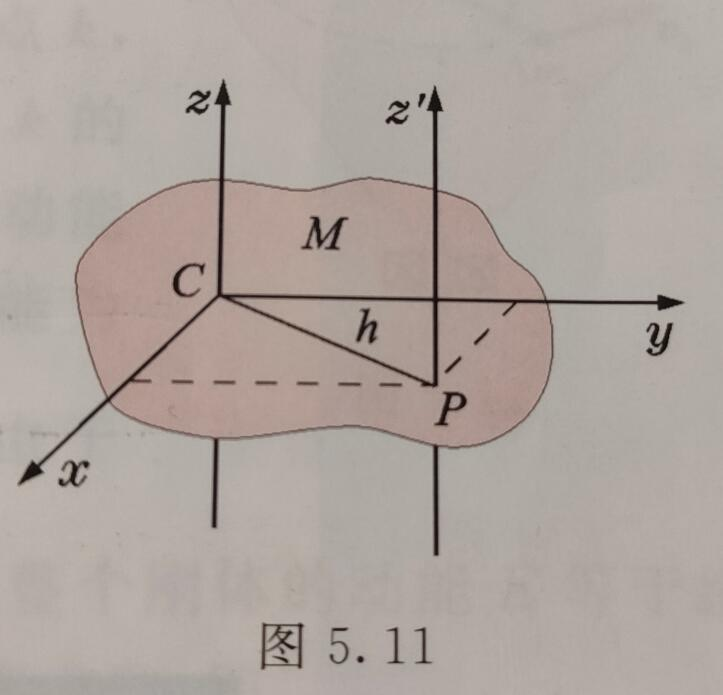

[TOC]

## 运动学

### 位移

位移：$\Delta\bm{r}$

位移的大小：$|\Delta\bm{r}|$

位矢大小的增量：$|\Delta r|$

其中后两者一般是不相等的，不能搞混。

### 速度

1. 平均速度

$$
\overline{\bm{v}}=\frac{\bm{r}(t+\Delta t)-\bm{r}(t)}{\Delta t}=\frac{\Delta\bm{r}}{\Delta t}
$$

2. 平均速度的大小

$$
|\overline{\bm{v}}|=\left|\frac{\Delta\bm{r}}{\Delta t}\right|
$$

同样的一般有

$$
|\overline{\bm{v}}|\neq\left|\frac{\Delta r}{\Delta t}\right|
$$

3. 瞬时速度

$$
\bm{v}=\frac{d\bm{r}}{dt}
$$

速度的大小常称速率。

$$
|\bm{v}|=\left|\frac{d\bm{r}}{dt}\right|
$$

同样一般有

$$
|\bm{v}|\neq \left|\frac{dr}{dt}\right|
$$

### 加速度

1. 平均加速度

$$
\overline{\bm{a}}=\frac{\Delta\bm{v}}{\Delta t}
$$

2. 瞬时加速度

$$
\bm{a}=\frac{d\bm{v}}{dt}
$$

关于加速度的大小和一般不相等与（）的性质类似于速度，不再介绍。

### 直角坐标表示运动

其位移、速度、加速度都可以分成几个坐标分量来计算，总的位移、速度、加速度则是勾股定理的形式，不再介绍。

### 自然坐标法表示运动

$$
\bm{v}=\frac{ds}{dt}\bm{\tau}
$$

其中$\bm{\tau}$是切向量。

$$
\bm{a}_n=a_n\bm{n}=\frac{v^2}{r}\bm{n}
$$

其中$n$是法向量，$r$是曲率半径，曲率半径计算见高数上整理。

$$
\bm{a}_\tau=a_\tau\bm{\tau}=\frac{dv}{dt}\bm{\tau}
$$

$$
\bm{a=a}_n+\bm{a}_\tau
$$

### 圆周运动的角量表示

1. 角坐标

$$
\theta=\theta(t)
$$

2. 角速度和角平均速度

$$
\overline{\omega}=\frac{\Delta\theta}{\Delta t}
$$

$$
\omega=\frac{d\theta}{dt}
$$

3. 角加速度和角平均加速度

$$
\overline{\beta}=\frac{\Delta\omega}{\Delta t}
$$

$$
\beta=\frac{d\omega}{dt}=\frac{d^2\theta}{dt^2}
$$

4. 线速度、加速度与角速度的关系

$$
v=r\omega\\
a_\tau=r\beta\\
a_n=r\omega^2
$$

### 坐标系变换

$$
\bm{v}_a=\bm{v}_r+\bm{u}
$$

即绝对速度等于相对于坐标系的速度与坐标系的绝对速度的矢量和。

$$
\bm{a}_a=\bm{a}_r+\bm{a}_e
$$

类似。

### 牛顿运动定律

1. 第一定律

$$
R=\sum_i\bm{F}_i=0
$$

也可以将$\bm{F}$写成坐标分量的形式。

2. 第二定律

$$
\bm{R}=\sum_i\bm{F}_i=\frac{d(m\bm{v})}{dt}
$$

质量为常量时

$$
\bm{R}=m\frac{d\bm{v}}{dt}=m\bm{a}
$$

可以写作坐标分量和切向量、法向量分量的形式。

3. 第三定律

$$
\bm{F}_1=\bm{F}_2
$$

### 刚体的平动

任意时刻，平动刚体上个点的速度、加速度都相同。

## 力学

### 常见的几种力

1. 万有引力

$$
\bm{F}_{21}=-G\frac{m_1m_2}{r^2}\bm{r}^0\\
G=6.67\times10^{-11}\quad m^2/(kg\cdot s^2)
$$

2. 弹性力

$$
F_x=-kx
$$

3. 摩擦力
   
**静摩擦力**

$$
f_{max}=\mu_0N
$$

前者为静摩擦系数，后者为支持力。

**滑动摩擦力**

$$
f=\mu N
$$

前者为滑动摩擦系数。

### 力矩

$$
M_O=\bm{r}\times\bm{F}
$$

单位：$N\cdot m$

### 转动惯量

$$
J_z=\int_Vr^2dm
$$

### 常见物体的转动惯量计算公式

### 平行轴定理

$$
J_z'=J_z+Mh^2
$$

### 转动惯量和力矩的关系

$$
M_z=J_z\beta
$$

## 功和能

### 功

1. 恒力做功

$$
A=\bm{F}\cdot\bm{s}=Fscos\theta
$$

2. 变力做功

$$
A=\int^b_{a(L)}\bm{F}\cdot d\bm{r}
$$

通常会拆分成对坐标系求曲线积分。

3. 平均功率

$$
P=\frac{\Delta A}{\Delta t}
$$

4. 瞬时功率

$$
P=\frac{dA}{dt}
$$

$$
P=\frac{\bm{F}\cdot d\bm{r}}{dt}=\bm{F}\cdot \bm{v}=Fvcos\theta
$$

### 几种常见力的功

1. 重力的功

$$
A=mg(z_1-z_2)
$$

2. 万有引力的功

$$
A=GmM(\frac{1}{r_2}-\frac{1}{r_1})
$$

3. 弹性力的功

$$
A=\frac{1}{2}k\lambda_1^2-\frac{1}{2}k\lambda_2^2
$$

### 动能定理

1. 质点动能定理

$$
dA=d(\frac{1}{2}mv^2)
$$

$$
A=\frac{1}{2}mv_1^2-\frac{1}{2}mv_2^2
$$

2. 质点系动能定理

$$
\sum_i A_i=E_{k2}-E_{k1}
$$

### 势能、机械能守恒定律

1. 保守力

做功只与始末位置有关而与路径无关的力。

2. 势能

零势能点$M_0$，空间中的某个点$M$

$$
E_p=\int_M^{M_0}\bm{F}\cdot d\bm{r}
$$

3. 重力势能

$$
E_p=mgz
$$

4. 万有引力势能

$$
E_p=-G\frac{mM}{r}
$$

5. 弹性势能

$$
A=\frac{1}{2}kx_1^2-\frac{1}{2}kx_2^2
$$

### 绕定轴转动刚体的动能、动能定理

1. 动能

$$
E=\frac{1}{2}J_z\omega^2
$$

2. 力矩的功

$$
A=\int_{\theta_1}^{\theta_2}M_z(\bm{F})d\theta
$$

3. 动能定理

$$
A=\frac{1}{2}J_z\omega_2^2-\frac{1}{2}J_z\omega_1^2
$$

## 冲量、动量、角动量

### 质点系动量定理

$$
d(m\bm{v})=\bm{F}dt
$$

$$
\bm{I}=m\bm{v}_2-m\bm{v}_1=\int^{t_2}_{t_1}\bm{F}dt
$$

如果是恒力

$$
m\bm{v}_2-m\bm{v}_1=\bm{F}(t_2-t_1)
$$

### 质点系动量定理

$$
\sum_i m_i\bm{v}_i-\sum_i m\bm{v}_{i0}=\sum_i\int^{t}_{t_0}\bm{F}_i dt
$$

### 质点系动量守恒定律

作用在质点系上的所有外力的矢量和为零，则该质点系的动量保持不变。

如果某个方向的矢量和为零，则这个方向上的动量保持不变。

$$
\sum_i m_i\bm{v}_{ix}=C
$$

$C$是常量

### 质心、质心运动定理

1. 质心位置

见高数下整理

2. 质心运动定理

质点系质心的运动，可以看成为一个质点的运动，这个质点集中了整个质点系的质量，也集中了质点系收到的所有外力。

### 动量矩和动量矩守恒定律

1. 动量矩

$$
\bm{L}_O=\bm{r}\times m\bm{v}
$$

$$
L_z=J_z\omega
$$

2. 动量矩定理

$$
\frac{d\bm{L_O}}{dt}=\bm{r}\times\bm{F}=\bm{M}_O
$$

3. 动量矩守恒定律

当作用在质点上的合理对固定点之矩总是为零时，质点动量对该点的矩为常矢量。即

$$
\bm{M}_O=0\Rightarrow \bm{L}_O=\bm{C}
$$

$\bm{C}$是常矢量。

4. 刚体绕定轴转动的动量矩定理

$$
(J_z\omega)_t-(J_z\omega)_{t_0}=\int^t_{t_0}M_zdt
$$

5. 刚体绕定轴转动的动量矩守恒定律

$$
M_z=0\Rightarrow J_z\omega=C
$$

## 机械振动

### 简谐振动

$$
x=Acos(\omega t+\varphi)
$$

$$
v=\overset{\cdot}{x}=-A\omega sin(\omega t+\varphi)
$$

$$
a=\overset{\cdot\cdot}{x}=-A\omega^2 cos(\omega t+\varphi)
$$

对于弹簧振子的周期：

$$
T=\frac{2\pi}{\omega}=2\pi\sqrt{\frac{m}{k}}
$$

对于单摆的周期：

$$
T=2\pi\sqrt{\frac{l}{g}}
$$

### 弹簧串联并联和弹性系数

1. 串联

$$
k=\frac{k_1k_2}{k_1+k_2}
$$

2. 并联

$$
k=k_1+k_2
$$

注：有一种两根弹簧中间连了物体的，是一种并联。

### 谐振动的能量

$$
E=\frac{1}{2}kA^2
$$

一个周期内，动能和势能的平均大小：

$$
\overline{E_p}=\frac{1}{4}kA^2
$$

$$
\overline{E_k}=\frac{1}{4}kA^2
$$

### 谐振动的合成

1. 同方向，同频率的合成

频率不变

$$
A=\sqrt{A_1^2+A_2^2+2A_1A_2cos(\varphi_2-\varphi_1)}
$$

$$
\varphi = arctan\frac{A_1sin\varphi_1+A_2sin\varphi_2}{A_1cos\varphi_1+A_2cos\varphi_2}
$$

2. 同方向不同频率的合成

$$
A=\sqrt{A_1^2+A_2^2+2A_1A_2cos(\omega_2-\omega_1)t}
$$

$$
\tau=\frac{2\pi}{|\omega_2-\omega_1|}
$$

$$
\nu=\frac{|\omega_2-\omega_1|}{2\pi}=|\nu_2-\nu_1|
$$

$\nu$为拍频。

3. 两个相互垂直谐振动的合成

根据参数方程求出平面解析式。

## 机械波

### 机械波的产生和传播

拉紧的绳子，横波的波速为

$$
u_t=\sqrt{\frac{T}{\mu}}
$$

其中$T$是绳子的张力，$\mu$是线密度。

### 平面简谐波

1. 波函数

正向传播：

$$
y(x,t)=Acos\left[\omega\left(t-\frac{x}{u}\right)+\varphi_0\right]
$$

或者写成

$$
y(x,t)=Acos\left[2\pi\left(\frac{t}{T}-\frac{x}{\lambda}\right)+\varphi_0\right]
$$

负向传播：

$$
y(x,t)=Acos\left[\omega\left(t+\frac{x}{u}\right)+\varphi_0\right]
$$

### 波的能量

1. 能量

设绳子每单位长度的质量为$\mu$，线元总机械能：

$$
W=W_k+W_p=\mu\Delta xA^2\omega^2sin^2\left[\omega\left(t-\frac{x}{u}\right)+\varphi_0\right]
$$

2. 能量密度

把单位体积中波的能量称为波的能量密度：

$$
w=\frac{W}{\Delta V}=\frac{W}{\Delta x\Delta S}=\rho A^2\omega^2sin^2\left[\omega\left(t-\frac{x}{u}\right)+\varphi_0\right]
$$

3. 能流密度（波的强度）

$$
I=\overline{w}u
$$

$$
I=\frac{1}{2}\rho A^2\omega^2u
$$

$$
\bm{I}=\overline{w}\bm{u}
$$

$$
w_{max}=2\overline{w}
$$

$$
I=\frac{P}{S}
$$

其中$P$是功率，$S$是波面面积。

4. 平面波和球面波的振幅

平面简谐波在理想无吸收的、均匀媒质中传播时振幅不变。

球面波在均匀、无吸收媒质中传播，有

$$
\frac{A_1}{A_2}=\frac{r_2}{r_1}
$$

即该点的振幅和到波源的距离成反比

5. 波的吸收

$$
I=I_0e^{-ax}
$$

### 波的干涉

干涉条件：频率相同、振动方向相同、相位差恒定。

$$
A^2=A_1^2+A_2^2+2A_1A_2cos\Delta\varphi
$$

$$
I=I_1+I_2+2\sqrt{I_1I_2}cos\Delta\varphi
$$

其中上面两式中

$$
\Delta\varphi=(\varphi_2-\varphi_1)-2\pi\frac{r_2-r_1}{\lambda}
$$

如果两个波源的初相位相同，则$\Delta\varphi$只取决于波程差$\delta=r_1-r_2$，于是干涉相长的条件为：

$$
\delta=r_1-r_2=\pm k\lambda,\quad k=0,1,2,\cdots
$$

干涉相消的条件为：

$$
\delta=r_1-r_2=\pm (2k+1)\frac{\lambda}{2},\quad k=0,1,2,\cdots
$$

### 驻波

1. 形成驻波的条件：

$$
L=n\frac{\lambda}{2},\quad n=1,2,3,\cdots
$$

2. 驻波波函数

$$
y=2Acos2\pi\frac{x}{\lambda}\cdot cos2\pi\nu t
$$

### 多普勒效应

1. 波源$S$静止，观察者相对于波源的速度为$v_O$，靠近为正值，远离为负值。则观察者接收到的频率为：

$$
\nu=(1+\frac{v_O}{u})\nu_0
$$

2. 观察者静止，波源相对于观察者的速度为$v_S$，靠近为正值，远离为负值。则观察者接收到的频率为：

$$
\nu=\frac{u}{u-v_S}\nu_0
$$

## 波动光学

### 光的干涉

相干叠加的条件：频率相同、光矢量振动方向平行、相位差恒定。

1. 杨氏双缝干涉

干涉加强的条件：

$$
\delta=\pm 2k\frac{\lambda}{2}
$$

干涉相消的条件：

$$
\delta=\pm(2k+1)\frac{\lambda}{2}
$$

屏上相邻明条纹或相邻暗条纹之间的间距为

$$
\Delta x=\frac{D\lambda}{d}
$$

$D$是双缝到屏的距离，$d$是双缝间距。

2. 洛埃镜

半波损失的条件：

波从波疏介质射向波密介质时反射过程中，反射波会相对于入射波有相位突变$\pi$

### 光程与光程差

数值上，光程等于介质折射率乘以光在介质中传播的路程，经过多重介质时，光程$=\sum_in_ir_i$

光程差：

$$
\delta=n_2r_2-n_1r_1
$$

### 薄膜干涉

#### 等厚干涉

干涉图样中同一干涉条纹对应于薄膜上厚度相同点的连线，这种条纹称为等厚干涉条纹。

1. 劈尖干涉

显然要考虑半波损失，假设为垂直入射，则明条纹的条件为

$$
\delta=2d+\frac{\lambda}{2}=2k\frac{\lambda}{2},\quad k=1,2,3,\cdots
$$

暗条纹的条件是

$$
\delta=2d+\frac{\lambda}{2}=(2k+1)\frac{\lambda}{2},\quad k=0,1,2,\cdots
$$

2. 牛顿环

$R$是平凸透镜的曲率半径，$r$是条纹半径。

明条纹：

$$
r=\sqrt{(2k-1)\frac{R\lambda}{2}},\quad k=1,2,3,\cdots
$$

暗条纹：

$$
r=\sqrt{k\lambda R}
$$

#### 等倾干涉

因干涉图样中同一干涉条纹是来自薄膜表面的等倾角光纤经透镜聚焦后的轨迹，故称为等倾干涉条纹。

### 迈克尔逊干涉仪

若视场从最亮到第$N$次最亮出现时，反光镜移动的距离为

$$
\Delta d=N\frac{\lambda}{2}
$$

1. 相干长度

两个分光束产生干涉效应的最大光程差$\delta_m$为波列长度$L$，称为相干长度

2. 相干时间

$$
\Delta t=\frac{\delta_m}{c}
$$

### 惠更斯-菲涅尔原理

同一波前上各点发出的次波是相干波，经过传播在空间某点相遇时的叠加是相干叠加。

### 单缝的夫琅禾费衍射

1. 菲涅尔半波带法研究分布

$a$是夹缝宽度

暗条纹：

$$
asin\varphi = \pm 2k\frac{\lambda}{2},\quad k=1,2,3,\cdots
$$

明条纹：

$$
asin\varphi=\pm(2k+1)\frac{\lambda}{2},\quad k=1,2,3,\cdots
$$

其中中央零级明条纹：

$$
asin\varphi=0
$$

中央明纹的宽度是

$$
-\lambda<asin\varphi<\lambda
$$

当$\varphi$很小时，有$sin\varphi\approx\varphi\approx\frac{\lambda}{a}$

2. 振幅矢量合成法研究强度

假设中央明纹的光强为$I_0$，则某一点$P$的光强为

$$
I=I_0\left(\frac{sinu}{u}\right)^2
$$

3. 艾里斑

$$
\theta_0\approx sin\theta_0=1.22\frac{\lambda}{D}
$$

$D$是圆孔直径。

### 衍射光栅及光栅光谱

刻痕间距为$a$，刻痕宽度为$b$，则$d=a+b$称为光栅常数。$N$是光栅的缝数，$n$是光栅一定长度内的缝数，单位通常为条/$mm$。并且有$d=1/n$

1. 光栅方程

光栅方程，或衍射明条纹的条件如下（只考虑干涉而不考虑各个缝的衍射的情况）

$$
(a+b)sin\varphi=\pm k\lambda,\quad k=0,1,2,\cdots
$$

2. 主极大条纹

满足光栅方程的明条纹称为主极大条纹。

3. 缺级

现在来考虑各个缝的衍射。

同时满足

$$
(a+b)sin\varphi=\pm k\lambda
$$

和

$$
asin\varphi=\pm k'\lambda,\quad k'=1,2,\cdots
$$

的为光谱线的缺级

缺级的级数为

$$
k=k'\frac{a+b}{a}
$$

4. 暗纹条件

$$
N(a+b)sin\varphi=\pm m\lambda
$$

其中$m=1,2,\cdots,(N-1),(N+1),\cdots,(2N-1),(2N+1),\cdots$，即除去$N$的整倍数。

易知，两个主极大条纹间有$(N-1)$条暗纹，以及$(N-2)$条次级大。

### 线偏振光、自然光

1. 线偏振光

光矢量只限于单一方向振动的光。

2. 自然光

无论哪一个方向的振动都不比其他方向占优势。

### 偏振片的起偏和检偏、马吕斯定律

1. 起偏和检偏

自然光获得偏振光的过程叫起偏。

对偏振光透过偏振片的角度的观察叫检偏。

2. 马吕斯定律

$$
I=I_0cos^2\alpha
$$

对于自然光透过偏振片

$$
I=I_0/2
$$

### 反射和折射产生的偏振、布儒斯特定律

1. 反射和折射产生的偏振

反射光为偏振方向垂直入射面成分较多的部分偏振光。

2. 布儒斯特定律

当入射角$i$与反射角$\gamma$之和为$90\degree$时，反射光称为光矢量与入射面垂直的完全偏振光。

公式表示为

$$
tani=\frac{n_2}{n_1}
$$

### 双折射现象

晶体的双折射现象：

其中一束折射光始终在入射面内，并遵守折射定律，称为寻常光，简称$o$光。另一束折射光一般不在入射面内，且不遵守折射定律，称为非常光，简称为$e$光。

## 热力学

### 平衡态、理想气体状态方程

$$
t=T-273.15
$$

理想气体状态方程（克拉伯龙方程）：

$$
pV=\nu RT
$$

注，大学物理一般用$n$表示分子数密度，而用$\nu$表示物质的量

### 功、热量、内能、热力学第一定律

绝热过程中外界对系统做功，则内能变化为

$$
E_2-E_1=A_Q
$$

假设外界不对系统做功，系统内能变化和外界给系统的热量的关系：

$$
E_2-E_1=Q
$$

热力学第一定律

$$
Q=(E_2-E_1)+A
$$

即系统从外界吸收能力，一部分转化为内能，一部分则对外界做功

对于无限小的变化过程

$$
dQ=dE+dA
$$

### 准静态过程中功和热量的计算

1. 功

在一个优先的准静态过程中，当气体的体积变化时，气体对外界所做的功为

$$
A=\int_{V_1}^{V_2}pdV
$$

应用上述结果，热力学第一定律可以表示为

$$
Q=(E_2-E_1)+\int_{V_1}^{V_2}pdV
$$

2. 热量、热容

$$
Q=mc(T_2-T_1)
$$

$c$是物体的比热容。不同物质的比热容值不同，并且同一物质的比热容值一般随温度而变。但在温度变化不大时，可以看做常量。

假定$1mol$气体在等体过程中温度升高$\Delta T$时，吸收的热量为$Q_V$，则气体的摩尔定体热容定义为

$$
C_V=\lim\limits_{\Delta T\to 0}\frac{Q_V}{\Delta T}=\left(\frac{dE}{dT}\right)_V
$$

假定$1mol$气体在等压过程中温度升高$\Delta T$时，吸收的热量为$Q_p$，则气体的摩尔定压热容定义为

$$
C_V=\lim\limits_{\Delta T\to 0}\frac{Q_p}{\Delta T}=\left(\frac{dE}{dT}\right)_p+p\left(\frac{dV}{dT}\right)_p
$$

### 理想气体的内能和$C_V$、$C_p$

气体的内能仅仅是其温度的函数，与体积等无关

$$
E=E(T)
$$

$$
C_p=C_V+R
$$

即迈耶公式，单位一般为$J/(mol\cdot K)$，$R=8.31$

比热容比：

$$
\gamma=\frac{C_p}{C_V}
$$

对单原子分子

$$
C_V\approx \frac{3}{2}R
$$

对双原子气体分子

$$
C_V\approx \frac{5}{2}R
$$

### 热力学第一定律对理想气体在典型准静态过程中的应用

1. 等体过程

$$
Q_V=E_2-E_1=\nu C_V(T_2-T_1)
$$

由克拉伯龙公式

$$
Q_V=\frac{V}{R}C_V(p_2-p_1)
$$

2. 等压过程

$$
A=p(V_2-V_1)=\nu R(T_2-T_1)
$$

$$
Q_p=vC_p(T_2-T_1)
$$

$$
E_2-E_1=Q_p-A=\nu C_V(T_2-T_1)
$$

3. 等温过程

等温膨胀过程中，吸收的热量全部用来对外做功

$$
Q_T=A=\nu RTln\frac{p_1}{p_2}
$$

### 绝热过程

绝热过程中$Q=0$，所以有$A=E_1-E_2=-vC_V(T_2-T_1)$

$$
A=\frac{1}{\gamma-1}(p_1V_1-p_2V_2)=-\frac{\nu R}{\gamma-1}(T_2-T_1)
$$

### 循环过程

1. 循环过程

$$
A=Q_1-Q_2
$$

2. 循环效率

$$
\eta=\frac{A}{Q_1}=1-\frac{Q_2}{Q_1}
$$

3. 制冷系数

$$
w=\frac{Q_2}{A}
$$

4. 绝对零度不可达原理

不可能用有限的步骤使物体达到绝对零度。

### 热力学第二定律

1. 开尔文表述

不可能只从单一热源吸收热量，使之完全转化为功而不引起其他变化。

2. 克劳修斯表述

不可能使热量从低温物体传向高温物体而不引起其他变化。

### 可逆与不可逆过程

如果过程的每一步都可沿相反的方向进行，同时不引起外界的任何变化，则称可逆过程。对于某一过程，用任何方法都不能使系统和外界恢复到原来状态，称为不可逆过程。

热力学第二定律揭示了，自然界的一切自发过程都是单方向进行的不可逆过程。

### 卡诺热机

1. 卡诺循环

两个等温过程和两个绝热过程组成。

$$
\eta = 1-\frac{T_2}{T_1}
$$

$$
w=\frac{T_2}{T_1-T_2}
$$

2. 卡诺定理

温度为$T_1,T_2$的两个给定热源之间工作的一切可逆热机，效率相同，都等于理想气体可逆卡诺热机的效率。这两个热源之间工作的一切不可逆热机，其效率都不可能大于卡诺热机。

## 气体动理论

### 气体分子的热运动

平衡状态下，平均速度

$$
\overline{v_x}=\overline{v_y}=\overline{v_z}=0
$$

统计平均值为

$$
\overline{v^2_j}=\frac{\sum_i\Delta N_iv^2_{ij}}{N},\quad j=x,y,z
$$

且有

$$
\overline{v^2_x}=\overline{v^2_y}=\overline{v^2_z}=\overline{v^2}/3
$$

大量分子平均平动动能的统计平均值为

$$
\overline{\varepsilon}=\frac{1}{2}\mu\overline{v^2}=\frac{\mu\sum_i\Delta N_iv^2_{i}}{2N}
$$

其中$\mu$为一个分子的质量

### 理想气体的压强公式

$$
p=\frac{2}{3}n(\frac{1}{2}\mu\overline{v^2})=\frac{2}{3}n\overline{\varepsilon}
$$

### 麦克斯韦速度分布定律

1. 麦克斯韦速度分布定律

$$
f(v)=4\pi\left(\frac{\mu}{2\pi kT}\right)^{3/2}v^2e^{-\frac{\mu v^2}{2kT}}
$$

其中

$$
k=\frac{R}{N_A}=\frac{8.31}{6.022\times 10^{23}}=1.38\times 10^{-23} J/K
$$

称为玻尔兹曼常数。

$$
\frac{dN}{N}=f(v)dv
$$

$$
\int_0^\infty f(v)dv=1
$$

2. 分子速率的三种统计平均值

$$
\overline{v}=\sqrt\frac{8kT}{\pi\mu}=1.59\sqrt{\frac{RT}{M}}
$$

$$
\sqrt{\overline{v^2}}=\sqrt\frac{3kT}{\mu}=1.73\sqrt{\frac{RT}{M}}
$$

$$
v_p=\sqrt\frac{2kT}{\mu}=1.41\sqrt{\frac{RT}{M}}
$$

### 温度的微观本质

$$
\overline{\varepsilon}=\frac{1}{2}\mu\overline{v^2}=\frac{3}{2}kT
$$

### 能量按自由度均分定理

1. 能量按自由度均分定理

处于平衡态的理想气体分子，无论作何种运动，相应于分子每个自由度的平均动能都相等，并且都等于$kT/2$。

如果气体分子有$i$个自由度，那么每个分子的平均总动能为$ikT/2$

2. 理想气体的内能

$1mol$气体中有$N_0$个分子，若不考虑振动能量，则$1mol$理想气体的内能为

$$
E=N_0\frac{i}{2}kT=\frac{i}{2}RT
$$

3. 气体的摩尔热容

$$
C_V=\frac{i}{2}R
$$

$$
C_p=\frac{(i+2)}{2}R
$$

$$
\gamma=\frac{i+2}{i}
$$

### 玻尔兹曼分布律

$$
n=n_0e^{-\frac{\varepsilon_p}{kT}}
$$

$n_0$是零势能面的分子数密度。

可以推知

$$
p=nkT=p_0e^{-\frac{\varepsilon_p}{kT}}
$$

### 分子的平均自由程

1. 平均碰撞频率

$$
\overline{z}=\sqrt{2}\pi d^2\overline{v}n
$$

2. 分子的平均自由程

$$
\overline{\lambda}=\frac{\overline{v}}{\overline{z}}=\frac{1}{\sqrt{2}\pi d^2n}=\frac{kT}{\sqrt{2}\pi d^2p}
$$

## 静电场

### 电荷、库仑定律

**电荷守恒定律**

在一个封闭系统内，不论进行怎样的变化过程，系统内正负电荷量的代数和保持不变。

**基尔霍夫第一定律**

根据电荷守恒定律，在稳恒电路中，节点处各支路电流的代数和应该为零。

**库伦定律**

在真空中两个静止点电荷之间的静电作用力为：

$$
F=\frac{1}{4\pi\varepsilon_0}\frac{q_1q_2}{r^2}
$$

作用力的方向沿着两个点电荷的连线。

其中$q_1,q_2$是两个点电荷的电量，$r$是它们之间的距离。$\varepsilon_0$是真空电容率。

用向量来表示，则有

$$
\bm F = \frac{1}{4\pi\varepsilon_0}\frac{q_1q_2}{r^2} \bm r^0
$$

### 电场

静电力是通过电场来传递的。电荷$q_1$对$q_2$施加的力是通过$q_1$产生的电场来传播的。并且这个电场不会对自身有作用力。

电场的传播速度是光速。

电场中某点的电场强度E的大小等于单位电荷在该点受力的大小，其方向为正电荷在该点受力的方向。

$$
\bm E=\frac{\bm F}{q_0}
$$

**电场强度叠加原理**

点电荷系在某点$P$产生的电场的电场强度等于各点电荷单独在该点产生的电场强度的矢量和。

### 电通量、高斯定理

#### 电场线

形象描述场强分布的空间曲线。

曲线上每一点的切斜方向为电场方向

通过垂直于电场方向单位面积电场线数为该点电场强度的大小。

**特点**

1. 始于正电荷（或无穷远），终于负电荷（或无穷远），不会在没有电荷的地方中断
2. 若体系正负电荷一样多，则正电荷发出的电场线全部终止与负电荷
3. 电场线不是闭合曲线，电场线不会相交。
   
#### 电通量

穿过某一有向曲面的电场线条数，称为通过该面的电通量，用$\varPhi_e$表示。

$$
d\varPhi_e=E_ndS=Ecos\theta dS
$$

直观上理解，就是将这个微小平面投影到垂直于电场线的平面上。用向量表示为

$$
d\varPhi_e = \bm E\cdot d\bm S
$$

积分得

$$
\varPhi_e=\int d\varPhi_e  = \int_S\bm E\cdot d\bm S
$$

#### 高斯定理

真空中的任何静电场中，穿过任一闭合曲面的电通量，在数值上等于该闭合曲面内包围的电量的代数和乘以$1/\varepsilon_0$。

显然可以推知，如果高斯面内不包围电荷，电荷在它的外面，则电通量为0.

对于不连续分布的源电荷

$$
\varPhi_e=\oint_S\bm E\cdot d\bm S=\frac{1}{\varepsilon_0}\sum_{(内)}q_i
$$

对于连续分布的源电荷

$$
\varPhi_e=\oint_S\bm E\cdot d\bm S=\int_V\frac{1}{\varepsilon_0}\rho dV
$$

很容易联想到能否用这个公式反过来求电场强度。对于一般的电场很难来求，但是对于一些对称的电荷分布来说，是可以使用的。具体案例见教材。

### 静电场的环路定理、电势能

**静电力的功**

设一正的实验电荷$q_0$在静止的点电荷$q$产生的电场中，由$a$点经过某一路径$L$移动到$b$点，则静电力对$q_0$做功为

$$
A_{ab}=\int^b_{a(L)}\bm F\cdot d\bm l=\int^b_{a(L)}q_0\bm E\cdot d\bm l
$$

$$
=\frac{qq_0}{4\pi\varepsilon_0}\int^{r_b}_{r_a}\frac{1}{r^2}dr=\frac{qq_0}{4\pi\varepsilon_0}\left(\frac{1}{r_a}-\frac{1}{r_b}\right)
$$

显然可知，这个功只取决于初末位置，而与路径无关。

可以扩展到任何静电场。

**静电场的环路定理**

从上文可以得知，在静电场中，电场强度沿任一闭合路径的线积分（或称电场强度的环流）恒为零。静电场是无旋有源场，静电场的电场线不可能是闭合的。静电场是保守场。

**电势能**

电荷在电场中某点的电势能，在量值上等于把电荷从该点移动到电势能零参考点时，静电力所做的功

$$
W_a=A_{a"0"}=\int^{"0"}_aq_0\bm E\cdot d\bm l
$$

### 电势、电势差

电场中某点的电势，其量值等于单位正电荷在该点所具有的电势能。

$$
u_a=\frac{W_a}{q_0}
$$

电场中某点的电势，其量值等于把单位正电荷从该点沿任意路径移动到电势能零参考点时，静电力所做的功。

$$
u_a = \frac{A_{a"0"}}{q_0}=\int^{"0"}_a\bm E\cdot d\bm l
$$

由电势的定义可知，电势差可以表示为

$$
U_{ab}=\frac{W_a}{q_0}-\frac{W_b}{q_0}=\frac{A_{ab}}{q_0}=\int^b_a\bm E\cdot d\bm l
$$

电场中$a,b$两点的电势差，在量值上等于把单位正电荷从$a$移动到$b$时，静电力所做的功。电势差与电势的零参考点的选择无关。

可以计算电势能如下

$$
W_a=qu_a
$$

可以计算电场做功如下

$$
A_{ab}=q(u_a-u_b)
$$

**电势叠加原理**

在点电荷系产生的电场中，某点的电势是各个点电荷单独存在时，在该点产生的电势的代数和。

### 等势面

类似于用电场线来描绘电场强度的空间分布，也可以用等势面来描绘电势的空间分布。

电势值相等的点联成的面称为等势面。

在静电场中，电场线与等势面处处正交。

### 电势与电场强度的关系

$$
E=-\frac{du}{dn}
$$

此式说明在任意一场点$P$处，电场强度的大小等于沿过该点等势面法线方向上电势的变化率。

而

$$
E_l=\frac{du}{dl}
$$

表明，电场强度在$d\bm l$方向的投影等于电势沿该方向变化率的负值。

而显然有$dl\geq dn$，所以

$$
\frac{du}{dl}\leq\frac{du}{dn}
$$

即电势沿等势面法线方向的变化率最大。

电场强度也可以表示为

$$
\bm E = E_x+E_y+E_z = -\left(\frac{\partial u}{\partial x}\bm i+\frac{\partial u}{\partial y}\bm j+\frac{\partial u}{\partial z}\bm k\right)
$$

### 导体的静电平衡

当导体内部的电场强度处处为零，导体上的电势处处相等时，导体达到静电平衡状态。

静电平衡的导体有以下性质

1. 其表面上任意一点的电场强度方向与该点处导体表面垂直。并且设该出导体表面上电荷面密度为$\sigma$，则

$$
\bm E = \frac{\sigma}{\varepsilon_0}\bm n
$$

2. 对于静电平衡状态的带电导体，未被抵消的净电荷只能分布在导体的表面上。
3. 处于静电平衡状态的孤立导体，其表面上电荷密度的大小与表面的曲率有关。

