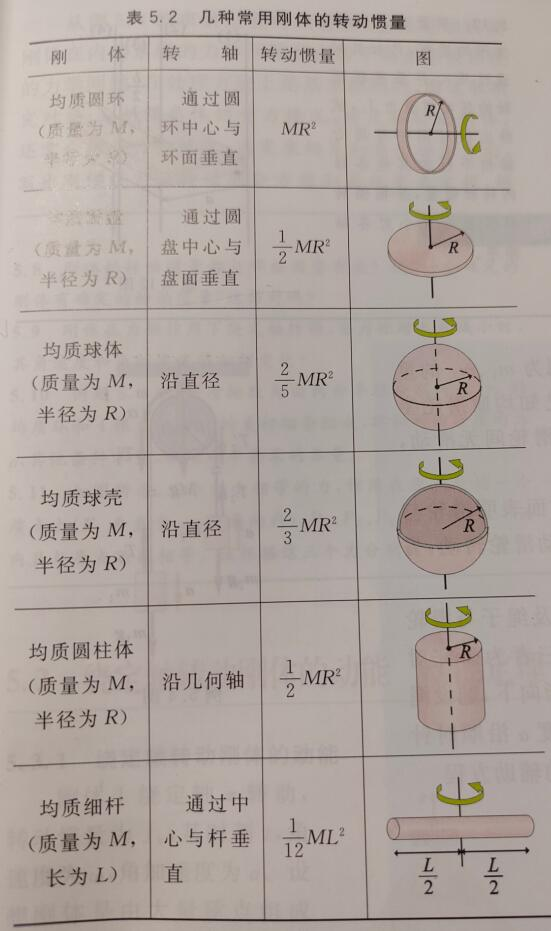
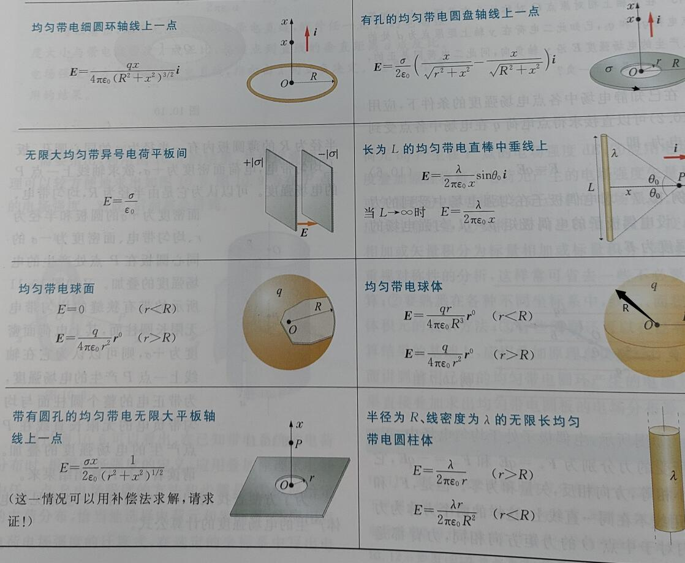

[TOC]

## 运动学

### 位移

位移：$\Delta\bm{r}$

位移的大小：$|\Delta\bm{r}|$

位矢大小的增量：$|\Delta r|$

其中后两者一般是不相等的，不能搞混。

### 速度

1. 平均速度

$$
\overline{\bm{v}}=\frac{\bm{r}(t+\Delta t)-\bm{r}(t)}{\Delta t}=\frac{\Delta\bm{r}}{\Delta t}
$$

2. 平均速度的大小

$$
|\overline{\bm{v}}|=\left|\frac{\Delta\bm{r}}{\Delta t}\right|
$$

同样的一般有

$$
|\overline{\bm{v}}|\neq\left|\frac{\Delta r}{\Delta t}\right|
$$

3. 瞬时速度

$$
\bm{v}=\frac{d\bm{r}}{dt}
$$

速度的大小常称速率。

$$
|\bm{v}|=\left|\frac{d\bm{r}}{dt}\right|
$$

同样一般有

$$
|\bm{v}|\neq \left|\frac{dr}{dt}\right|
$$

### 加速度

1. 平均加速度

$$
\overline{\bm{a}}=\frac{\Delta\bm{v}}{\Delta t}
$$

2. 瞬时加速度

$$
\bm{a}=\frac{d\bm{v}}{dt}
$$

关于加速度的大小和一般不相等与（）的性质类似于速度，不再介绍。

### 直角坐标表示运动

其位移、速度、加速度都可以分成几个坐标分量来计算，总的位移、速度、加速度则是勾股定理的形式，不再介绍。

### 自然坐标法表示运动

$$
\bm{v}=\frac{ds}{dt}\bm{\tau}
$$

其中$\bm{\tau}$是切向量。

$$
\bm{a}_n=a_n\bm{n}=\frac{v^2}{r}\bm{n}
$$

其中$n$是法向量，$r$是曲率半径，曲率半径计算见高数上整理。

$$
\bm{a}_\tau=a_\tau\bm{\tau}=\frac{dv}{dt}\bm{\tau}
$$

$$
\bm{a=a}_n+\bm{a}_\tau
$$

### 圆周运动的角量表示

1. 角坐标

$$
\theta=\theta(t)
$$

2. 角速度和角平均速度

$$
\overline{\omega}=\frac{\Delta\theta}{\Delta t}
$$

$$
\omega=\frac{d\theta}{dt}
$$

3. 角加速度和角平均加速度

$$
\overline{\beta}=\frac{\Delta\omega}{\Delta t}
$$

$$
\beta=\frac{d\omega}{dt}=\frac{d^2\theta}{dt^2}
$$

4. 线速度、加速度与角速度的关系

$$
v=r\omega\\
a_\tau=r\beta\\
a_n=r\omega^2
$$

### 坐标系变换

$$
\bm{v}_a=\bm{v}_r+\bm{u}
$$

即绝对速度等于相对于坐标系的速度与坐标系的绝对速度的矢量和。

$$
\bm{a}_a=\bm{a}_r+\bm{a}_e
$$

类似。

### 牛顿运动定律

1. 第一定律

$$
R=\sum_i\bm{F}_i=0
$$

也可以将$\bm{F}$写成坐标分量的形式。

2. 第二定律

$$
\bm{R}=\sum_i\bm{F}_i=\frac{d(m\bm{v})}{dt}
$$

质量为常量时

$$
\bm{R}=m\frac{d\bm{v}}{dt}=m\bm{a}
$$

可以写作坐标分量和切向量、法向量分量的形式。

3. 第三定律

$$
\bm{F}_1=\bm{F}_2
$$

### 刚体的平动

任意时刻，平动刚体上个点的速度、加速度都相同。

## 力学

### 常见的几种力

1. 万有引力

$$
\bm{F}_{21}=-G\frac{m_1m_2}{r^2}\bm{r}^0\\
G=6.67\times10^{-11}\quad m^2/(kg\cdot s^2)
$$

2. 弹性力

$$
F_x=-kx
$$

3. 摩擦力
   
**静摩擦力**

$$
f_{max}=\mu_0N
$$

前者为静摩擦系数，后者为支持力。

**滑动摩擦力**

$$
f=\mu N
$$

前者为滑动摩擦系数。

### 力矩

$$
M_O=\bm{r}\times\bm{F}
$$

单位：$N\cdot m$

### 转动惯量

$$
J_z=\int_Vr^2dm
$$

### 常见物体的转动惯量计算公式

### 平行轴定理

$$
J_z'=J_z+Mh^2
$$

### 转动惯量和力矩的关系

$$
M_z=J_z\beta
$$

## 功和能

### 功

1. 恒力做功

$$
A=\bm{F}\cdot\bm{s}=Fscos\theta
$$

2. 变力做功

$$
A=\int^b_{a(L)}\bm{F}\cdot d\bm{r}
$$

通常会拆分成对坐标系求曲线积分。

3. 平均功率

$$
P=\frac{\Delta A}{\Delta t}
$$

4. 瞬时功率

$$
P=\frac{dA}{dt}
$$

$$
P=\frac{\bm{F}\cdot d\bm{r}}{dt}=\bm{F}\cdot \bm{v}=Fvcos\theta
$$

### 几种常见力的功

1. 重力的功

$$
A=mg(z_1-z_2)
$$

2. 万有引力的功

$$
A=GmM(\frac{1}{r_2}-\frac{1}{r_1})
$$

3. 弹性力的功

$$
A=\frac{1}{2}k\lambda_1^2-\frac{1}{2}k\lambda_2^2
$$

### 动能定理

1. 质点动能定理

$$
dA=d(\frac{1}{2}mv^2)
$$

$$
A=\frac{1}{2}mv_1^2-\frac{1}{2}mv_2^2
$$

2. 质点系动能定理

$$
\sum_i A_i=E_{k2}-E_{k1}
$$

### 势能、机械能守恒定律

1. 保守力

做功只与始末位置有关而与路径无关的力。

2. 势能

零势能点$M_0$，空间中的某个点$M$

$$
E_p=\int_M^{M_0}\bm{F}\cdot d\bm{r}
$$

3. 重力势能

$$
E_p=mgz
$$

4. 万有引力势能

$$
E_p=-G\frac{mM}{r}
$$

5. 弹性势能

$$
A=\frac{1}{2}kx_1^2-\frac{1}{2}kx_2^2
$$

### 绕定轴转动刚体的动能、动能定理

1. 动能

$$
E=\frac{1}{2}J_z\omega^2
$$

2. 力矩的功

$$
A=\int_{\theta_1}^{\theta_2}M_z(\bm{F})d\theta
$$

3. 动能定理

$$
A=\frac{1}{2}J_z\omega_2^2-\frac{1}{2}J_z\omega_1^2
$$

## 冲量、动量、角动量

### 质点系动量定理

$$
d(m\bm{v})=\bm{F}dt
$$

$$
\bm{I}=m\bm{v}_2-m\bm{v}_1=\int^{t_2}_{t_1}\bm{F}dt
$$

如果是恒力

$$
m\bm{v}_2-m\bm{v}_1=\bm{F}(t_2-t_1)
$$

### 质点系动量定理

$$
\sum_i m_i\bm{v}_i-\sum_i m\bm{v}_{i0}=\sum_i\int^{t}_{t_0}\bm{F}_i dt
$$

### 质点系动量守恒定律

作用在质点系上的所有外力的矢量和为零，则该质点系的动量保持不变。

如果某个方向的矢量和为零，则这个方向上的动量保持不变。

$$
\sum_i m_i\bm{v}_{ix}=C
$$

$C$是常量

### 质心、质心运动定理

1. 质心位置

见高数下整理

2. 质心运动定理

质点系质心的运动，可以看成为一个质点的运动，这个质点集中了整个质点系的质量，也集中了质点系收到的所有外力。

### 动量矩和动量矩守恒定律

1. 动量矩

$$
\bm{L}_O=\bm{r}\times m\bm{v}
$$

$$
L_z=J_z\omega
$$

2. 动量矩定理

$$
\frac{d\bm{L_O}}{dt}=\bm{r}\times\bm{F}=\bm{M}_O
$$

3. 动量矩守恒定律

当作用在质点上的合理对固定点之矩总是为零时，质点动量对该点的矩为常矢量。即

$$
\bm{M}_O=0\Rightarrow \bm{L}_O=\bm{C}
$$

$\bm{C}$是常矢量。

4. 刚体绕定轴转动的动量矩定理

$$
(J_z\omega)_t-(J_z\omega)_{t_0}=\int^t_{t_0}M_zdt
$$

5. 刚体绕定轴转动的动量矩守恒定律

$$
M_z=0\Rightarrow J_z\omega=C
$$

## 机械振动

### 简谐振动

$$
x=Acos(\omega t+\varphi)
$$

$$
v=\overset{\cdot}{x}=-A\omega sin(\omega t+\varphi)
$$

$$
a=\overset{\cdot\cdot}{x}=-A\omega^2 cos(\omega t+\varphi)
$$

对于弹簧振子的周期：

$$
T=\frac{2\pi}{\omega}=2\pi\sqrt{\frac{m}{k}}
$$

对于单摆的周期：

$$
T=2\pi\sqrt{\frac{l}{g}}
$$

### 弹簧串联并联和弹性系数

1. 串联

$$
k=\frac{k_1k_2}{k_1+k_2}
$$

2. 并联

$$
k=k_1+k_2
$$

注：有一种两根弹簧中间连了物体的，是一种并联。

### 谐振动的能量

$$
E=\frac{1}{2}kA^2
$$

一个周期内，动能和势能的平均大小：

$$
\overline{E_p}=\frac{1}{4}kA^2
$$

$$
\overline{E_k}=\frac{1}{4}kA^2
$$

### 谐振动的合成

1. 同方向，同频率的合成

频率不变

$$
A=\sqrt{A_1^2+A_2^2+2A_1A_2cos(\varphi_2-\varphi_1)}
$$

$$
\varphi = arctan\frac{A_1sin\varphi_1+A_2sin\varphi_2}{A_1cos\varphi_1+A_2cos\varphi_2}
$$

2. 同方向不同频率的合成

$$
A=\sqrt{A_1^2+A_2^2+2A_1A_2cos(\omega_2-\omega_1)t}
$$

$$
\tau=\frac{2\pi}{|\omega_2-\omega_1|}
$$

$$
\nu=\frac{|\omega_2-\omega_1|}{2\pi}=|\nu_2-\nu_1|
$$

$\nu$为拍频。

3. 两个相互垂直谐振动的合成

根据参数方程求出平面解析式。

## 机械波

### 机械波的产生和传播

拉紧的绳子，横波的波速为

$$
u_t=\sqrt{\frac{T}{\mu}}
$$

其中$T$是绳子的张力，$\mu$是线密度。

### 平面简谐波

1. 波函数

正向传播：

$$
y(x,t)=Acos\left[\omega\left(t-\frac{x}{u}\right)+\varphi_0\right]
$$

或者写成

$$
y(x,t)=Acos\left[2\pi\left(\frac{t}{T}-\frac{x}{\lambda}\right)+\varphi_0\right]
$$

负向传播：

$$
y(x,t)=Acos\left[\omega\left(t+\frac{x}{u}\right)+\varphi_0\right]
$$

### 波的能量

1. 能量

设绳子每单位长度的质量为$\mu$，线元总机械能：

$$
W=W_k+W_p=\mu\Delta xA^2\omega^2sin^2\left[\omega\left(t-\frac{x}{u}\right)+\varphi_0\right]
$$

2. 能量密度

把单位体积中波的能量称为波的能量密度：

$$
w=\frac{W}{\Delta V}=\frac{W}{\Delta x\Delta S}=\rho A^2\omega^2sin^2\left[\omega\left(t-\frac{x}{u}\right)+\varphi_0\right]
$$

3. 能流密度（波的强度）

$$
I=\overline{w}u
$$

$$
I=\frac{1}{2}\rho A^2\omega^2u
$$

$$
\bm{I}=\overline{w}\bm{u}
$$

$$
w_{max}=2\overline{w}
$$

$$
I=\frac{P}{S}
$$

其中$P$是功率，$S$是波面面积。

4. 平面波和球面波的振幅

平面简谐波在理想无吸收的、均匀媒质中传播时振幅不变。

球面波在均匀、无吸收媒质中传播，有

$$
\frac{A_1}{A_2}=\frac{r_2}{r_1}
$$

即该点的振幅和到波源的距离成反比

5. 波的吸收

$$
I=I_0e^{-ax}
$$

### 波的干涉

干涉条件：频率相同、振动方向相同、相位差恒定。

$$
A^2=A_1^2+A_2^2+2A_1A_2cos\Delta\varphi
$$

$$
I=I_1+I_2+2\sqrt{I_1I_2}cos\Delta\varphi
$$

其中上面两式中

$$
\Delta\varphi=(\varphi_2-\varphi_1)-2\pi\frac{r_2-r_1}{\lambda}
$$

如果两个波源的初相位相同，则$\Delta\varphi$只取决于波程差$\delta=r_1-r_2$，于是干涉相长的条件为：

$$
\delta=r_1-r_2=\pm k\lambda,\quad k=0,1,2,\cdots
$$

干涉相消的条件为：

$$
\delta=r_1-r_2=\pm (2k+1)\frac{\lambda}{2},\quad k=0,1,2,\cdots
$$

### 驻波

1. 形成驻波的条件：

$$
L=n\frac{\lambda}{2},\quad n=1,2,3,\cdots
$$

2. 驻波波函数

$$
y=2Acos2\pi\frac{x}{\lambda}\cdot cos2\pi\nu t
$$

### 多普勒效应

1. 波源$S$静止，观察者相对于波源的速度为$v_O$，靠近为正值，远离为负值。则观察者接收到的频率为：

$$
\nu=(1+\frac{v_O}{u})\nu_0
$$

2. 观察者静止，波源相对于观察者的速度为$v_S$，靠近为正值，远离为负值。则观察者接收到的频率为：

$$
\nu=\frac{u}{u-v_S}\nu_0
$$

## 波动光学

### 光的干涉

相干叠加的条件：频率相同、光矢量振动方向平行、相位差恒定。

1. 杨氏双缝干涉

干涉加强的条件：

$$
\delta=\pm 2k\frac{\lambda}{2}
$$

干涉相消的条件：

$$
\delta=\pm(2k+1)\frac{\lambda}{2}
$$

屏上相邻明条纹或相邻暗条纹之间的间距为

$$
\Delta x=\frac{D\lambda}{d}
$$

$D$是双缝到屏的距离，$d$是双缝间距。

2. 洛埃镜

半波损失的条件：

波从波疏介质射向波密介质时反射过程中，反射波会相对于入射波有相位突变$\pi$

### 光程与光程差

数值上，光程等于介质折射率乘以光在介质中传播的路程，经过多重介质时，光程$=\sum_in_ir_i$

光程差：

$$
\delta=n_2r_2-n_1r_1
$$

### 薄膜干涉

#### 等厚干涉

干涉图样中同一干涉条纹对应于薄膜上厚度相同点的连线，这种条纹称为等厚干涉条纹。

1. 劈尖干涉

显然要考虑半波损失，假设为垂直入射，则明条纹的条件为

$$
\delta=2d+\frac{\lambda}{2}=2k\frac{\lambda}{2},\quad k=1,2,3,\cdots
$$

暗条纹的条件是

$$
\delta=2d+\frac{\lambda}{2}=(2k+1)\frac{\lambda}{2},\quad k=0,1,2,\cdots
$$

2. 牛顿环

$R$是平凸透镜的曲率半径，$r$是条纹半径。

明条纹：

$$
r=\sqrt{(2k-1)\frac{R\lambda}{2}},\quad k=1,2,3,\cdots
$$

暗条纹：

$$
r=\sqrt{k\lambda R}
$$

#### 等倾干涉

因干涉图样中同一干涉条纹是来自薄膜表面的等倾角光纤经透镜聚焦后的轨迹，故称为等倾干涉条纹。

### 迈克尔逊干涉仪

若视场从最亮到第$N$次最亮出现时，反光镜移动的距离为

$$
\Delta d=N\frac{\lambda}{2}
$$

1. 相干长度

两个分光束产生干涉效应的最大光程差$\delta_m$为波列长度$L$，称为相干长度

2. 相干时间

$$
\Delta t=\frac{\delta_m}{c}
$$

### 惠更斯-菲涅尔原理

同一波前上各点发出的次波是相干波，经过传播在空间某点相遇时的叠加是相干叠加。

### 单缝的夫琅禾费衍射

1. 菲涅尔半波带法研究分布

$a$是夹缝宽度

暗条纹：

$$
asin\varphi = \pm 2k\frac{\lambda}{2},\quad k=1,2,3,\cdots
$$

明条纹：

$$
asin\varphi=\pm(2k+1)\frac{\lambda}{2},\quad k=1,2,3,\cdots
$$

其中中央零级明条纹：

$$
asin\varphi=0
$$

中央明纹的宽度是

$$
-\lambda<asin\varphi<\lambda
$$

当$\varphi$很小时，有$sin\varphi\approx\varphi\approx\frac{\lambda}{a}$

2. 振幅矢量合成法研究强度

假设中央明纹的光强为$I_0$，则某一点$P$的光强为

$$
I=I_0\left(\frac{sinu}{u}\right)^2
$$

3. 艾里斑

$$
\theta_0\approx sin\theta_0=1.22\frac{\lambda}{D}
$$

$D$是圆孔直径。

### 衍射光栅及光栅光谱

刻痕间距为$a$，刻痕宽度为$b$，则$d=a+b$称为光栅常数。$N$是光栅的缝数，$n$是光栅一定长度内的缝数，单位通常为条/$mm$。并且有$d=1/n$

1. 光栅方程

光栅方程，或衍射明条纹的条件如下（只考虑干涉而不考虑各个缝的衍射的情况）

$$
(a+b)sin\varphi=\pm k\lambda,\quad k=0,1,2,\cdots
$$

2. 主极大条纹

满足光栅方程的明条纹称为主极大条纹。

3. 缺级

现在来考虑各个缝的衍射。

同时满足

$$
(a+b)sin\varphi=\pm k\lambda
$$

和

$$
asin\varphi=\pm k'\lambda,\quad k'=1,2,\cdots
$$

的为光谱线的缺级

缺级的级数为

$$
k=k'\frac{a+b}{a}
$$

4. 暗纹条件

$$
N(a+b)sin\varphi=\pm m\lambda
$$

其中$m=1,2,\cdots,(N-1),(N+1),\cdots,(2N-1),(2N+1),\cdots$，即除去$N$的整倍数。

易知，两个主极大条纹间有$(N-1)$条暗纹，以及$(N-2)$条次级大。

### 线偏振光、自然光

1. 线偏振光

光矢量只限于单一方向振动的光。

2. 自然光

无论哪一个方向的振动都不比其他方向占优势。

### 偏振片的起偏和检偏、马吕斯定律

1. 起偏和检偏

自然光获得偏振光的过程叫起偏。

对偏振光透过偏振片的角度的观察叫检偏。

2. 马吕斯定律

$$
I=I_0cos^2\alpha
$$

对于自然光透过偏振片

$$
I=I_0/2
$$

### 反射和折射产生的偏振、布儒斯特定律

1. 反射和折射产生的偏振

反射光为偏振方向垂直入射面成分较多的部分偏振光。

2. 布儒斯特定律

当入射角$i$与反射角$\gamma$之和为$90\degree$时，反射光称为光矢量与入射面垂直的完全偏振光。

公式表示为

$$
tani=\frac{n_2}{n_1}
$$

### 双折射现象

晶体的双折射现象：

其中一束折射光始终在入射面内，并遵守折射定律，称为寻常光，简称$o$光。另一束折射光一般不在入射面内，且不遵守折射定律，称为非常光，简称为$e$光。

## 热力学

### 平衡态、理想气体状态方程

$$
t=T-273.15
$$

理想气体状态方程（克拉伯龙方程）：

$$
pV=\nu RT
$$

注，大学物理一般用$n$表示分子数密度，而用$\nu$表示物质的量

### 功、热量、内能、热力学第一定律

绝热过程中外界对系统做功，则内能变化为

$$
E_2-E_1=A_Q
$$

假设外界不对系统做功，系统内能变化和外界给系统的热量的关系：

$$
E_2-E_1=Q
$$

热力学第一定律

$$
Q=(E_2-E_1)+A
$$

即系统从外界吸收能力，一部分转化为内能，一部分则对外界做功

对于无限小的变化过程

$$
dQ=dE+dA
$$

### 准静态过程中功和热量的计算

1. 功

在一个优先的准静态过程中，当气体的体积变化时，气体对外界所做的功为

$$
A=\int_{V_1}^{V_2}pdV
$$

应用上述结果，热力学第一定律可以表示为

$$
Q=(E_2-E_1)+\int_{V_1}^{V_2}pdV
$$

2. 热量、热容

$$
Q=mc(T_2-T_1)
$$

$c$是物体的比热容。不同物质的比热容值不同，并且同一物质的比热容值一般随温度而变。但在温度变化不大时，可以看做常量。

假定$1mol$气体在等体过程中温度升高$\Delta T$时，吸收的热量为$Q_V$，则气体的摩尔定体热容定义为

$$
C_V=\lim\limits_{\Delta T\to 0}\frac{Q_V}{\Delta T}=\left(\frac{dE}{dT}\right)_V
$$

假定$1mol$气体在等压过程中温度升高$\Delta T$时，吸收的热量为$Q_p$，则气体的摩尔定压热容定义为

$$
C_V=\lim\limits_{\Delta T\to 0}\frac{Q_p}{\Delta T}=\left(\frac{dE}{dT}\right)_p+p\left(\frac{dV}{dT}\right)_p
$$

### 理想气体的内能和$C_V$、$C_p$

气体的内能仅仅是其温度的函数，与体积等无关

$$
E=E(T)
$$

$$
C_p=C_V+R
$$

即迈耶公式，单位一般为$J/(mol\cdot K)$，$R=8.31$

比热容比：

$$
\gamma=\frac{C_p}{C_V}
$$

对单原子分子

$$
C_V\approx \frac{3}{2}R
$$

对双原子气体分子

$$
C_V\approx \frac{5}{2}R
$$

### 热力学第一定律对理想气体在典型准静态过程中的应用

1. 等体过程

$$
Q_V=E_2-E_1=\nu C_V(T_2-T_1)
$$

由克拉伯龙公式

$$
Q_V=\frac{V}{R}C_V(p_2-p_1)
$$

2. 等压过程

$$
A=p(V_2-V_1)=\nu R(T_2-T_1)
$$

$$
Q_p=vC_p(T_2-T_1)
$$

$$
E_2-E_1=Q_p-A=\nu C_V(T_2-T_1)
$$

3. 等温过程

等温膨胀过程中，吸收的热量全部用来对外做功

$$
Q_T=A=\nu RTln\frac{p_1}{p_2}
$$

### 绝热过程

绝热过程中$Q=0$，所以有$A=E_1-E_2=-vC_V(T_2-T_1)$

$$
A=\frac{1}{\gamma-1}(p_1V_1-p_2V_2)=-\frac{\nu R}{\gamma-1}(T_2-T_1)
$$

### 循环过程

1. 循环过程

$$
A=Q_1-Q_2
$$

2. 循环效率

$$
\eta=\frac{A}{Q_1}=1-\frac{Q_2}{Q_1}
$$

3. 制冷系数

$$
w=\frac{Q_2}{A}
$$

4. 绝对零度不可达原理

不可能用有限的步骤使物体达到绝对零度。

### 热力学第二定律

1. 开尔文表述

不可能只从单一热源吸收热量，使之完全转化为功而不引起其他变化。

2. 克劳修斯表述

不可能使热量从低温物体传向高温物体而不引起其他变化。

### 可逆与不可逆过程

如果过程的每一步都可沿相反的方向进行，同时不引起外界的任何变化，则称可逆过程。对于某一过程，用任何方法都不能使系统和外界恢复到原来状态，称为不可逆过程。

热力学第二定律揭示了，自然界的一切自发过程都是单方向进行的不可逆过程。

### 卡诺热机

1. 卡诺循环

两个等温过程和两个绝热过程组成。

$$
\eta = 1-\frac{T_2}{T_1}
$$

$$
w=\frac{T_2}{T_1-T_2}
$$

2. 卡诺定理

温度为$T_1,T_2$的两个给定热源之间工作的一切可逆热机，效率相同，都等于理想气体可逆卡诺热机的效率。这两个热源之间工作的一切不可逆热机，其效率都不可能大于卡诺热机。

## 气体动理论

### 气体分子的热运动

平衡状态下，平均速度

$$
\overline{v_x}=\overline{v_y}=\overline{v_z}=0
$$

统计平均值为

$$
\overline{v^2_j}=\frac{\sum_i\Delta N_iv^2_{ij}}{N},\quad j=x,y,z
$$

且有

$$
\overline{v^2_x}=\overline{v^2_y}=\overline{v^2_z}=\overline{v^2}/3
$$

大量分子平均平动动能的统计平均值为

$$
\overline{\varepsilon}=\frac{1}{2}\mu\overline{v^2}=\frac{\mu\sum_i\Delta N_iv^2_{i}}{2N}
$$

其中$\mu$为一个分子的质量

### 理想气体的压强公式

$$
p=\frac{2}{3}n(\frac{1}{2}\mu\overline{v^2})=\frac{2}{3}n\overline{\varepsilon}
$$

### 麦克斯韦速度分布定律

1. 麦克斯韦速度分布定律

$$
f(v)=4\pi\left(\frac{\mu}{2\pi kT}\right)^{3/2}v^2e^{-\frac{\mu v^2}{2kT}}
$$

其中

$$
k=\frac{R}{N_A}=\frac{8.31}{6.022\times 10^{23}}=1.38\times 10^{-23} J/K
$$

称为玻尔兹曼常数。

$$
\frac{dN}{N}=f(v)dv
$$

$$
\int_0^\infty f(v)dv=1
$$

2. 分子速率的三种统计平均值

$$
\overline{v}=\sqrt\frac{8kT}{\pi\mu}=1.59\sqrt{\frac{RT}{M}}
$$

$$
\sqrt{\overline{v^2}}=\sqrt\frac{3kT}{\mu}=1.73\sqrt{\frac{RT}{M}}
$$

$$
v_p=\sqrt\frac{2kT}{\mu}=1.41\sqrt{\frac{RT}{M}}
$$

### 温度的微观本质

$$
\overline{\varepsilon}=\frac{1}{2}\mu\overline{v^2}=\frac{3}{2}kT
$$

### 能量按自由度均分定理

1. 能量按自由度均分定理

处于平衡态的理想气体分子，无论作何种运动，相应于分子每个自由度的平均动能都相等，并且都等于$kT/2$。

如果气体分子有$i$个自由度，那么每个分子的平均总动能为$ikT/2$

2. 理想气体的内能

$1mol$气体中有$N_0$个分子，若不考虑振动能量，则$1mol$理想气体的内能为

$$
E=N_0\frac{i}{2}kT=\frac{i}{2}RT
$$

3. 气体的摩尔热容

$$
C_V=\frac{i}{2}R
$$

$$
C_p=\frac{(i+2)}{2}R
$$

$$
\gamma=\frac{i+2}{i}
$$

### 玻尔兹曼分布律

$$
n=n_0e^{-\frac{\varepsilon_p}{kT}}
$$

$n_0$是零势能面的分子数密度。

可以推知

$$
p=nkT=p_0e^{-\frac{\varepsilon_p}{kT}}
$$

### 分子的平均自由程

1. 平均碰撞频率

$$
\overline{z}=\sqrt{2}\pi d^2\overline{v}n
$$

2. 分子的平均自由程

$$
\overline{\lambda}=\frac{\overline{v}}{\overline{z}}=\frac{1}{\sqrt{2}\pi d^2n}=\frac{kT}{\sqrt{2}\pi d^2p}
$$

## 静电场

### 电荷、库仑定律

**电荷守恒定律**

在一个封闭系统内，不论进行怎样的变化过程，系统内正负电荷量的代数和保持不变。

**基尔霍夫第一定律**

根据电荷守恒定律，在稳恒电路中，节点处各支路电流的代数和应该为零。

**库伦定律**

在真空中两个静止点电荷之间的静电作用力为：

$$
F=\frac{1}{4\pi\varepsilon_0}\frac{q_1q_2}{r^2}
$$

作用力的方向沿着两个点电荷的连线。

其中$q_1,q_2$是两个点电荷的电量，$r$是它们之间的距离。$\varepsilon_0$是真空电容率，或者叫真空介电常数。其值为$8.854187817\times 10^{-12} F/m$

用向量来表示，则有

$$
\bm F = \frac{1}{4\pi\varepsilon_0}\frac{q_1q_2}{r^2} \bm r^0
$$

### 电场

静电力是通过电场来传递的。电荷$q_1$对$q_2$施加的力是通过$q_1$产生的电场来传播的。并且这个电场不会对自身有作用力。

电场的传播速度是光速。

电场中某点的电场强度E的大小等于单位电荷在该点受力的大小，其方向为正电荷在该点受力的方向。

$$
\bm E=\frac{\bm F}{q_0}
$$

**电场强度叠加原理**

点电荷系在某点$P$产生的电场的电场强度等于各点电荷单独在该点产生的电场强度的矢量和。

**电偶极矩**

两个大小相等的异号点电荷$+q$和$-q$，相距为$l$，如果要计算电场强度的各场点相对这一对电荷的距离$r$比$l$大很多（$r>>l$），这样一对点电荷称为电偶极子。定义

$$
\bm p = q\bm l
$$

为电偶极子的电偶极矩，$\bm l$的方向规定为由负电荷指向正电荷。

#### 一些常见带电体产生的电场强度

### 电通量、高斯定理

#### 电场线

形象描述场强分布的空间曲线。

曲线上每一点的切斜方向为电场方向

通过垂直于电场方向单位面积电场线数为该点电场强度的大小。

**特点**

1. 始于正电荷（或无穷远），终于负电荷（或无穷远），不会在没有电荷的地方中断
2. 若体系正负电荷一样多，则正电荷发出的电场线全部终止与负电荷
3. 电场线不是闭合曲线，电场线不会相交。
   
#### 电通量

穿过某一有向曲面的电场线条数，称为通过该面的电通量，用$\varPhi_e$表示。

$$
d\varPhi_e=E_ndS=Ecos\theta dS
$$

直观上理解，就是将这个微小平面投影到垂直于电场线的平面上。用向量表示为

$$
d\varPhi_e = \bm E\cdot d\bm S
$$

积分得

$$
\varPhi_e=\int d\varPhi_e  = \int_S\bm E\cdot d\bm S
$$

#### 高斯定理

真空中的任何静电场中，穿过任一闭合曲面的电通量，在数值上等于该闭合曲面内包围的电量的代数和乘以$1/\varepsilon_0$。

显然可以推知，如果高斯面内不包围电荷，电荷在它的外面，则电通量为0.

对于不连续分布的源电荷

$$
\varPhi_e=\oint_S\bm E\cdot d\bm S=\frac{1}{\varepsilon_0}\sum_{(内)}q_i
$$

对于连续分布的源电荷

$$
\varPhi_e=\oint_S\bm E\cdot d\bm S=\int_V\frac{1}{\varepsilon_0}\rho dV
$$

很容易联想到能否用这个公式反过来求电场强度。对于一般的电场很难来求，但是对于一些对称的电荷分布来说，是可以使用的。具体案例见教材。

### 静电场的环路定理、电势能

**静电力的功**

设一正的实验电荷$q_0$在静止的点电荷$q$产生的电场中，由$a$点经过某一路径$L$移动到$b$点，则静电力对$q_0$做功为

$$
A_{ab}=\int^b_{a(L)}\bm F\cdot d\bm l=\int^b_{a(L)}q_0\bm E\cdot d\bm l
$$

$$
=\frac{qq_0}{4\pi\varepsilon_0}\int^{r_b}_{r_a}\frac{1}{r^2}dr=\frac{qq_0}{4\pi\varepsilon_0}\left(\frac{1}{r_a}-\frac{1}{r_b}\right)
$$

显然可知，这个功只取决于初末位置，而与路径无关。

可以扩展到任何静电场。

**静电场的环路定理**

从上文可以得知，在静电场中，电场强度沿任一闭合路径的线积分（或称电场强度的环流）恒为零。静电场是无旋有源场，静电场的电场线不可能是闭合的。静电场是保守场。

**电势能**

电荷在电场中某点的电势能，在量值上等于把电荷从该点移动到电势能零参考点时，静电力所做的功

$$
W_a=A_{a"0"}=\int^{"0"}_aq_0\bm E\cdot d\bm l
$$

### 电势、电势差

电场中某点的电势，其量值等于单位正电荷在该点所具有的电势能。

$$
u_a=\frac{W_a}{q_0}
$$

电场中某点的电势，其量值等于把单位正电荷从该点沿任意路径移动到电势能零参考点时，静电力所做的功。

$$
u_a = \frac{A_{a"0"}}{q_0}=\int^{"0"}_a\bm E\cdot d\bm l
$$

由电势的定义可知，电势差可以表示为

$$
U_{ab}=\frac{W_a}{q_0}-\frac{W_b}{q_0}=\frac{A_{ab}}{q_0}=\int^b_a\bm E\cdot d\bm l
$$

电场中$a,b$两点的电势差，在量值上等于把单位正电荷从$a$移动到$b$时，静电力所做的功。电势差与电势的零参考点的选择无关。

可以计算电势能如下

$$
W_a=qu_a
$$

可以计算电场做功如下

$$
A_{ab}=q(u_a-u_b)
$$

**电势叠加原理**

在点电荷系产生的电场中，某点的电势是各个点电荷单独存在时，在该点产生的电势的代数和。

#### 常见带电体产生的电势（以无穷远为电势零点）

### 等势面

类似于用电场线来描绘电场强度的空间分布，也可以用等势面来描绘电势的空间分布。

电势值相等的点联成的面称为等势面。

在静电场中，电场线与等势面处处正交。

### 电势与电场强度的关系

$$
E=-\frac{du}{dn}
$$

此式说明在任意一场点$P$处，电场强度的大小等于沿过该点等势面法线方向上电势的变化率。

而

$$
E_l=-\frac{du}{dl}
$$

表明，电场强度在$d\bm l$方向的投影等于电势沿该方向变化率的负值。

而显然有$dl\geq dn$，所以

$$
\frac{du}{dl}\leq\frac{du}{dn}
$$

即电势沿等势面法线方向的变化率最大。

电场强度也可以表示为

$$
\bm E = E_x+E_y+E_z = -\left(\frac{\partial u}{\partial x}\bm i+\frac{\partial u}{\partial y}\bm j+\frac{\partial u}{\partial z}\bm k\right)
$$

### 导体的静电平衡

当导体内部的电场强度处处为零，导体上的电势处处相等时，导体达到静电平衡状态。

静电平衡的导体有以下性质

1. 其表面上任意一点的电场强度方向与该点处导体表面垂直。并且设该处导体表面上电荷面密度为$\sigma$，则

$$
\bm E = \frac{\sigma}{\varepsilon_0}\bm n
$$

2. 对于静电平衡状态的带电导体，未被抵消的净电荷只能分布在导体的表面上。
3. 处于静电平衡状态的孤立导体，其表面上电荷密度的大小与表面的曲率有关。

### 电介质

电介质是指在通常条件下导电性能极差的物质，例如云母、变压器油等。电工中一般认为电阻率超过$10^8\Omega\cdot m$的物质为电介质。

除了具有电气绝缘性能外，在电场作用下的电极化是它的一个重要特性。

电容为$C_0$的平行板电容器（边缘效应不计），充电后两基板间电势差为$U_0$，这时极板上的电荷量为$Q_0=C_0U_0$。断开电源，并在两极板间注满各向同性的均匀电介质，再测量两极板间电势差，发现

$$
U = \frac{U_0}{\varepsilon_r}
$$

并且同时有

$$
E = \frac{E_0}{\varepsilon_r}
$$

由于电荷量$Q_0$不变。所以有

$$
C = \frac{Q_0}{U} = \frac{\varepsilon_rQ_0}{U_0}=\varepsilon_rC_0
$$

其中$\varepsilon_r$对于各向同性的均匀电介质为一常数，称为该介质的相对介电常数，是无量纲量。

### 电解质分子的电结构

根据分子电结构的不同，可把电介质分为两类：

1. 无极分子。指分子中负电荷对称地分布在正电荷周围，以致在无外电场作用时，分子的正负电荷中心重合，分子无电偶极矩。无外电场作用时，对外呈现电中性。
2. 有极分子。在无外电场作用时，分子的正负电荷中心不重合。这时，等量的分子正负电荷形成电偶极子，具有电偶极矩$\bm p$。在无外电场作用时，由于分子的不规则热运动，各分子电偶极矩取向杂乱无章，因此宏观上也呈现电中性。

### 电介质的极化、束缚电荷

将有极分子电介质放在均匀外电场中，各分子的电偶极子受到外电场力偶的作用，都要转向外电场方向，并有序地排列起来。

由于分子的热运动，这种分子电偶极子的排列不可能是整齐的。然而，从总体来看，这种转向排列的结果，使电介质沿电场方向前后两个侧面分别出现正负电荷。

这种不能在电介质内自由移动，也不能离开电介质表面的电荷，称为束缚电荷。

在外电场作用下，电介质分子的电偶极矩趋于外电场方向排列，结果在电介质的侧面出现束缚电荷的现象称为电介质的极化现象。有极分子电介质的极化常称为取向极化。

将无极分子电介质放在外电场中，由于分子中的正负电荷受到相反方向的电场力，因而正负电荷中心将发生微小的相对位移，从而形成电偶极子，其电偶极矩将沿外电场方向排列起来。

这时，沿外电场方向电介质的前后两侧面也将分别出现正负束缚电荷，这也是一种电介质的极化现象。无极分子电介质的极化常称为位移极化。

一般来说，外电场越强，极化现象越显著，电介质两侧面束缚电荷的面密度也就越大，电极化程度也就越高。

另外，在各向同性均匀电介质内部的任何体积元内，都不会有净束缚电荷。

### 电介质内的电场强度

在电介质内部，合电场强度$E$总是小于自由电荷产生的电场强度$E_0$

电介质内任意一点的电场强度$\bm E$，应等于极板上自由电荷在该点产生的电场强度$\bm E_0$与分布在电介质两平行端面上的束缚电荷在该点产生的电场强度$\bm E'$的矢量和，即

$$
\bm E = \bm E_0+\bm E'
$$

$$
E = \frac{\sigma_0}{\varepsilon_0}-\frac{\sigma '}{\varepsilon_0}
$$

如果电介质满足

$$
E=\frac{E_0}{\varepsilon_r}
$$

则一定要有该各向同性的均匀电介质要充满电场所在空集。进一步研究表明，各向同性均匀电介质虽未充满电场所在空间，但只要电介质的表面是等势面，上式就成立。

另外上式和上上式可以得出

$$
\sigma'=(1-\frac{1}{\varepsilon_r})\sigma_0
$$

### 电介质中的高斯定理、电位移矢量D

在平板电容器中，作一封闭圆柱形高斯面，使得面积为$S$的两个端面平行于电容器极板，且一个端面在导体极板内，另一个在电介质中。

设自由电荷和束缚电荷面密度分别为$\sigma_0,\sigma'$，对所作高斯面应用高斯定理，有

$$
\oiint_S \bm E\cdot d\bm S = \frac{1}{\varepsilon_0}(\sigma_0-\sigma')S
$$

但是$\sigma'$通常难以预先知道，所以上式不方便使用。

而（电介质充满时）

$$
\sigma'=(1-\frac{1}{\varepsilon_r})\sigma_0
$$

所以有

$$
\frac{1}{\varepsilon_0}(\sigma_0-\sigma')=\frac{\sigma_0}{\varepsilon_0\varepsilon_r}
$$

代入得

$$
\oiint_S \bm E\cdot d\bm S = \frac{\sigma_0}{\varepsilon_0\varepsilon_r}S
$$

或者写成

$$
\oiint_S \varepsilon_0\varepsilon_r\bm E\cdot d\bm S = \sigma_0S = q_0
$$

令

$$
\bm D = \varepsilon_0\varepsilon_r\bm E
$$

称为电位移矢量（又称电通密度）

最后可以写成

$$
\oiint_S\bm D\cdot d\bm S = q_0
$$

通过任意闭合曲面$S$的总电位移通量，等于该比和曲面所包围的自由电荷量的代数和，与束缚电荷以及闭合曲面之外的自由电荷无关。

### 孤立导体的电容

一个带电量为$q$的孤立导体，在静电平衡时，具有一定的电势$u$。当带电量增加时，电势也增加，且比值不变

$$
C=\frac{q}{u}
$$

其中$C$是和$u,q$无关的常量，值只取决于导体的大小形状等因素。

### 电容器的电容

若电容器两极板上分别带电量为$+q,-q$，两极板间的电势差为$u_1-u_2$，则

$$
C=\frac{q}{u_1-u_2}
$$

并且可以推导出，若两极板相对面积为$S$，相距$d$，则有

$$
C=\frac{\varepsilon_0 S}{d}
$$

如果充入电介质，其相对介电常数为$\varepsilon_r$

$$
C=\frac{\varepsilon_0\varepsilon_r S}{d}
$$

### 电容器的串并联

**串联**

$$
\frac{1}{C} = \frac{1}{C_1}+\frac{1}{C_2}+\frac{1}{C_3}+\cdots
$$

电容越串越小，但是耐压值提高了

**并联**

$$
C=C_1+C_2+C_3+\cdots
$$

电容越并越大，但是耐压值不会改变。

### 静电能

电极板上迁移电荷，需要做功

$$
dA=U(t)dq=\frac{q(t)}{C}dq
$$

$$
A = \int dA = \int^Q_0\frac{q(t)}{C}dq=\frac{Q^2}{2C}
$$

另外因$Q=CU$，上式也可以写作

$$
A=\frac{1}{2}CU^2=\frac{1}{2}QU
$$

也就是电容器中储存的能量

$$
W = \frac{Q^2}{2C} = \frac{1}{2}CU^2=\frac{1}{2}QU
$$

在平行板电容器中，如果忽略边缘效应，两极板间的电场是均匀的。因此，单位体积内储存的能量（能量密度）$\omega$也应该是均匀的。因$U=Ed,C=\varepsilon_0S/d$，有

$$
W = \frac{1}{2}\varepsilon_0E^2Sd=\frac{1}{2}\varepsilon_0E^2V
$$

而

$$
\omega=\frac{W}{V}=\frac{1}{2}\varepsilon_0E^2
$$

只要空间任一处存在着电场，电场强度为$E$，该处单位体积中就储藏着$\varepsilon_0E^2/2$的能量。

## 恒定电流的磁场

### 磁感应强度

当$Id\bm l$与磁感应强度方向垂直时，所受的磁场力最大，

$$
B = \frac{dF_{max}}{Idl}
$$

力的方向由右手定则确定。

电流元$Id\bm l$在磁场中受到的磁场力$d\bm F$如下

$$
d\bm F = Id\bm l\times \bm B
$$

### 毕奥-萨伐尔定律

电流元$Id\bm l$在空间某点$P$出产生的磁感应强度为

$$
dB = \frac{\mu_0}{4\pi}\frac{Idl\sin\theta}{r^2}
$$

其中$r$是距离，$\theta$是矢量$\bm r$和$d\bm l$的夹角。$\mu_0=4\pi\times 10^{-7}N/A^2$，称为真空磁导率。

$d\bm B$的方向由右手定则确定。写成矢量形式如下

$$
d\bm B = \frac{\mu_0}{4\pi}\frac{Id\bm l\times \bm r^0}{\bm r^2}
$$

**运动电荷的磁场**

因为$I=nqvS$，代入有

$$
d\bm B = \frac{\mu_0}{4\pi}\frac{nqvSd\bm l\times \bm r^0}{\bm r^2}
$$

因为$\bm v$和$d\bm l$方向相同，又令$dN = nSdl$，故有

$$
d\bm B = \frac{\mu_0}{4\pi}\frac{(dN)q\bm v\times \bm r^0}{\bm r^2}
$$

此时，对于单个带电$q$的粒子，有

$$
\bm B = \frac{d\bm B}{dN} = \frac{\mu_0}{4\pi}\frac{q\bm v\times \bm r^0}{\bm r^2}
$$

#### 常用的磁感应强度公式

### 磁通量

类似于电场线，可以用磁感应线描绘恒定磁场，规定

1. 磁力线上各点的切线方向与该点处的磁感应强度$\bm B$的方向一致
2. 在磁场中的某点处，垂直于该点$\bm B$的单位面积上，穿过磁力线的数目等于该点处$\bm B$的大小

磁场是无源场，磁力线既无起点又无终点。磁力线的环绕方向与电流的方向及环形电流绕行方向与磁力线方向都遵守右手螺旋法则。

磁通量定义为

$$
d\varPhi_m=\bm B\cdot d\bm S=Bcos\theta dS
$$

也就有

$$
\varPhi_m=\int_S \bm B\cdot d\bm S
$$

### 磁场的高斯定理

穿过任一闭合曲面的总磁通量恒等于零，即

$$
\oint_S\bm B\cdot d\bm S = 0
$$

### 安培环路定理

1. 磁场中$B$矢量沿闭合路径的线积分和闭合路径的形状大小无关，只与闭合路径包围的电流有关
2. 当电流的方向与闭合路径绕行方向之间满足右螺旋法则时，I取正值；反之取负值

$$
\oint_L \bm B\cdot d\bm l=\mu_0\sum_{内}I_i
$$

### 磁场对电流的作用

**磁场对载流导线的作用力**

$$
\bm F = \int_L Id\bm l\times \bm B
$$

如果导线上各电流源的受力方向不一致，就要沿坐标轴分解力来计算。

另外闭合载流线圈在匀强磁场中受到的安培力矢量和为零

**均匀磁场对载流线圈的作用**

磁力矩为

$$
\bm M=\bm p_m\times B = IS\bm n\times B
$$

其中$I$是线圈的电流，$S$是线圈面积，$\bm n$是线圈法向量。

**磁力的功**

当回路中电流不变时，磁力所作的供等于电流乘以通过回路所包围面积内的磁通量的增量

$$
A=I\Delta\varPhi
$$

### 带电粒子在电场和磁场中的运动

**在电场中**

$$
q\bm E = m\bm a=m\frac{d\bm v}{dt}
$$

**在磁场中**

$$
\bm F=q\bm v\times \bm B
$$

洛伦兹力$F$的一个重要特点是它始终垂直于速度$v$，因此洛伦兹力只改变带电运动粒子的运动方向，而不改变它的速度的大小。

**霍尔效应**

霍尔元件上下两面的电势差为

$$
U_{ab}=\frac{IB}{nqd}=K\frac{IB}{d}
$$

其中$B$是与电流$I$垂直的，如果把电流方向记为霍尔元件的长度方向，那么宽度记为$d$（也就是$B$方向的长度），$n$为单位体积内载流子的数量，$q$为载流子的电荷量。

如果载流子是电子，则称为$n$型半导体。如果是空穴，则为$p$型。

### 磁介质

**磁介质的分类**

磁介质是指放在磁场中经磁化后能反过来影响原来磁场的物质

原来的磁场记作$\bm B_0$，磁介质产生的记作$\bm B'$，则磁介质中的磁感应强度是其矢量和

$$
\bm B=\bm B_0+\bm B'
$$

相对磁导率定义为

$$
\mu_r=\frac{B}{B_0}
$$

1. 顺磁质。顺磁质的$\mu_r>1$。产生的磁场和原来的磁场同方向
2. 抗磁质。抗磁质的$\mu_r<1$。产生的磁场和原来的磁场反方向
3. 铁磁质。铁磁质的$\mu_r>>1$。产生的磁场和原来的磁场同方向

铁磁质是强磁性物质，其他称为弱磁性物质（非磁性）物质

对于非磁性物质，其相对磁导率接近$1$，通常用磁化率来替代表示，即

$$
\mathcal{X}_m=\mu_r-1
$$

**磁介质中的环路定理**

将安培环路定理应用到磁介质中，并取以$r$为半径的闭合同心圆周为积分路径，则有

$$
\oint_L \bm B\cdot d\bm l = \mu_0(NI+I_s)
$$

其中$I_s$是束缚电流，是线圈电流导致的在磁介质中产生的电流。顺磁质电流方向相同，抗磁质则相反。

通常我们无法预先知道$I_s$，所以我们代换得

$$
\oint_L \bm B\cdot d\bm l = \mu_0\mu_rNI
$$

令$\mu=\mu_0\mu_r$称为磁导率,则

$$
\oint_L \frac{\bm B}{\mu}\cdot d\bm l = \sum_{内}I
$$

令$\frac{\bm B}{\mu}=\bm H$称为磁场强度，则

$$
\oint_L \bm H\cdot d\bm l = \sum_{内}I
$$

## 电磁感应与电磁场

### 电动势

法拉第通过研究发现，不论用什么办法，只要使穿过道题闭合回路的磁通量发生变化，此回路中就会产生电流。

电动势的定义为：非静电力把单位正电荷从负极通过电荷内部搬移到正极所做的功，用$\varepsilon$表示。如果用$A_k$表示在电源内非静电力把正电荷$q$从负极搬到正极所做的功，则

$$
\varepsilon = \frac{A_k}{q}
$$

同样的，我们定义单位正电荷所受的非静电力定义为非静电性电场强度。若用$F_k$表示正电荷$q$所受的非静电力，用符号$E_k$表示非静电性电场强度，则

$$
\bm E_k=\frac{\bm F_k}{q}
$$

结合两式，有

$$
A_k = \int^+_- \bm F_k\cdot d\bm l = q\int^+_- \bm E_k\cdot d\bm l
$$

$$
\varepsilon = \int^+_- \bm E_k\cdot d\bm l
$$

如果一个闭合回路$L$上处处都有非静电力$F_k$存在，这时整个闭合回路内的总电动势是

$$
\varepsilon = \oint \bm E_k\cdot d\bm l
$$

对于有非静电力$F_k$存在的一段电路$ab$上的电动势为

$$
\varepsilon = \int^b_a \bm E_k\cdot d\bm l
$$

### 法拉第电磁感应定律

导体回路中产生的感应电动势$\varepsilon_i$的大小与穿过回路的磁通量的变化率$d\varPhi/dt$成正比

$$
\varepsilon_i =-\frac{d\varPhi}{dt}
$$

具体方向由右手螺旋定则确定。

如果有多匝线圈，并且穿过各线圈的磁通量相同，则总磁通量$\varPsi=N\varPhi$

**楞次定律**

闭合回路中，感应电流的方向总是使得它自身所产生的磁通量反抗引起感应电流的磁通量的变化。

### 动生电动势

由于导体或导体回路在恒定磁场中运动，导体或导体回路内产生的感应电动势。

若长为$l$的导体棒$ab$，在恒定的均匀磁场中以匀速$\bm v$沿垂直于磁场$\bm B$的方向运动。

导体棒$ab$上的动生电动势为

$$
\varepsilon_i = \int^b_a \bm E_k\cdot d\bm l = \int^b_a (\bm v\times \bm B)\cdot d\bm l 
$$

可以根据左手定则判断电动势方向。

### 感生电动势

导体或导体回路不动，由于磁场随时间变化，导体或导体回路中产生的感应电动势。

变化的磁场在周围空间激发出电场线为闭合曲线的电场，称其为感生电场或有旋电场。有旋电场的出现与是否存在导体没有关系。

当回路固定不动，磁通量$\varPsi$的变化仅来自磁场的变化时，电动势为

$$
\varepsilon_i = \oint_L \bm E_V\cdot \bm l=-\iint_S\frac{\partial\bm B}{\partial t}\cdot d\bm S
$$

### 自感现象

导体回路中由于自身电流的变化，而在自身回路中产生感应电动势的现象。产生的电动势称为自感电动势。

设一回路通有电流$I$，根据毕奥-萨伐尔定律，总磁通

$$
\varPsi = LI
$$

式中比例系数$L$称为该回路的自感系数，简称自感。如果回路周围不存在铁磁质，自感$L$是衣蛾与电流$I$无关，仅由回路的匝数、几何形状、大小，以及周围介质的磁导率决定的物理量。

若回路的自感$L$保持不变，则通过回路的总磁通$\varPsi$仅随回路中电流的变化而变化，根据法拉第电磁感应定律，自感电动势为

$$
\varepsilon_L = -\frac{d\varPsi}{dt} = -L\frac{dI}{dt}
$$

式中的负号表明自感电动势产生的感应电流的方向总是反抗回路中电流$I$的变化。

### 互感现象

由于某一个导体回路中的电流发生变化，而在邻近导体回路内产生感应电动势的现象，称为互感现象。

类似于自感系数。设$\varPsi_{21}$表示回路$1$中通有电流$I_1$时，它激发的磁场在回路$2$中产生的总磁通。

$$
\varPsi_{21} = M_{21}I_1
$$

同样也有

$$
\varepsilon_M = -\frac{d\varPsi}{dt} = -M\frac{dI}{dt}
$$

### 磁能

一个自感为$L$通有电流$I$的线圈，其中所储存的磁能

$$
W_m=\frac{1}{2}LI^2
$$

称为自感磁能。

储存在线圈中的能量可以用描述磁场的物理量$B$或$H$来表示。长直螺线管的自感为$L=\mu n^2 V$，其磁能为

$$
W_m = \frac{1}{2}\mu n^2 I^2V
$$

对于长直螺线管，有

$$
H = nI;B=\mu n I
$$

有

$$
W_m = \frac{1}{2}BHV=\frac{1}{2}\mu H^2V=\frac{1}{2}\frac{B^2}{\mu} V
$$

其中$\mu$是其磁导率，$n$是每单位长度的匝数，$V$是螺线管的体积，所以能量密度为

$$
w_m = \frac{1}{2}BH
$$

进一步的研究表明，某点磁场的能量密度只与该点的磁感应强度$B$和介质的性质有关。

$$
dW_m = w_mdV = \frac{1}{2}BHdV
$$

$$
W_m = \int_V dW_m=\frac{1}{2}\int_V BHdV
$$

### 位移电流

对于非恒定电流，例如电路中加一个电容器，那么原始的安培环路定理则不再适用，因为将曲面穿过两极板之间得到的结果是0. 不符合事实。

于是麦克斯韦提出了位移电流的概念，即在电容器的两个极板中也有电流。定义为

$$
I_D=\frac{d\varPhi_D}{dt}
$$

设极板的面积为$S$，某时刻极板上自由电荷面密度为$\sigma$，则电位移为$D=\sigma$，于是极板间的电位移通量$\varPhi_D=DS=\sigma S$。电位移通量的时间变化率为

$$
\frac{d\varPhi_D}{dt} = \frac{d}{dt}\sigma S=\frac{dq}{dt}
$$

其中$dq/dt$就是导线中的传到电流。

于是可以把安培环路定理推广为

$$
\oint_L \bm H\cdot d\bm l=I+I_D
$$

### 麦克斯韦方程组的积分形式，电磁场

$$
\oint_S \bm D\cdot d\bm S = \sum_i q_i
$$

$$
\oint_L \bm E\cdot d\bm l = -\iint_S\frac{\partial \bm B}{\partial t}\cdot d\bm S
$$

$$
\oint_S \bm B\cdot d\bm S = 0
$$

$$
\oint_L \bm H\cdot d\bm l = \sum(I_D+I)
$$

## 狭义相对论基础

### 力学相对性原理

在彼此作匀速直线运动的所有惯性系中，物体运动所遵循的力学规律是完全相同的，应具有完全相同的数学表达形式。也就是说，对于描述力学现象的规律而言，所有惯性系都是等价的。这称为力学相对性原理

### 绝对时空观

狭义相对论之前，科学家们普遍认为时间和空间都是绝对的，可以脱离物质运动而存在，并且时间和空间也没有任何联系。

这就是经典力学的时空观，也称为绝对时空观。

### 伽利略坐标变换式

设有两个惯性参考系$S,S'$，取坐标系$Oxyz,O'x'y'z'$，简单起见他们的坐标轴相互平行且$x,x'$相互重合，设$S'$沿$x$轴方向以恒定速度$\bm u$相对$S$运动，并且$O,O'$重合时$t=t'=0$

则在$S$中一点$(x,y,z)$在$S'$中的坐标为

$$
\left.\begin{matrix}
x'=&x-ut \\
y'=&y \\
z'=&z
\end{matrix}\right\}
$$

根据绝对时间概念，有

$$
t' = t
$$

这就是这两个坐标系间的伽利略坐标变换式。

### 牛顿运动定律具有伽利略变换的不变性

经典力学所有的基本定律都满足经典力学相对性原理，但是之后发现麦克斯韦方程组并不满足。

### 狭义相对论的两个基本假设

**光速的伽利略变换未能被实验证实**

光是电磁波，由麦克斯韦方程组可知

$$
c=\frac{1}{\sqrt{\varepsilon_0\mu_0}}=2.998\times 10^8 m/s
$$

也就是说光速是恒定的，与传播方向和参考系的选择无关。

如果伽利略变换是正确的，则在$S'$中光速应该是$c-u$，但迈克耳孙-莫雷实验证实了光速都是$c$，发现了经典力学和光速的不相容性。

**假设1**

在所有惯性系中，一切物理学定律都相同，即具有相同的数学表达形式。或者说，对于描述一切物理现象的规律来说，所有惯性系都是等价的。这也称为狭义相对论的相对性原理。

**假设2**

在所有惯性系中，真空中光沿各个方向传播的速率都等于同一个恒量$c$，与光源和观察者的运动状态无关。这也称为光速不变原理。

### “同时性”的相对性

在$S'$系中异地同时发生的两个事件，在$S$系看来并不同时。反过来也是这样。

需要说明的是，在一个惯性系同一地点发生的两个同时事件，对于其他惯性系也是同时的。

产生“同时性”的相对性的原因是，光在不同惯性系中具有相同的速率和光的速率是有限的。

### 时间延缓

将在一个惯性系中测得的、发生在该惯性系中同一地点的两个事件之间的时间间隔称为原时。

时间的测量具有相对性，在不同惯性系中测量给定的两个事件之间的时间间隔，测得的结果以原时最短，这一现象称为时间延缓效应。

时间延缓效应还可陈述为，运动时钟走的速率比静止时钟走的速率要慢。

时间延缓效应也是相对的，运动的$S'$的时钟相对于静止的$S$的时钟要慢。反过来也是这样。

以公式来说，设两件事发生的间隔在静止的$S$看来是$\tau$，而在运动的$S'$看来是$\tau_0$（即原时，事件是在$S'$中同一地点发生的），$S'$相对于$S$以$\bm u$的速率运动则

$$
\tau = \frac{\tau_0}{\sqrt{1-\beta^2}}=\gamma\tau_0
$$

其中$\beta=u/c,\gamma = 1/\sqrt{1-\beta^2}$

### 长度收缩

设地面上有一静止的尺子，车（$S'$系）以速度$\bm u$相对地面（$S$系）沿尺子长度方向运动。

若地面上的人观察到尺子长为$L$，也称为原长，则车上的人观察到

$$
L'=L\sqrt{1-\bigg(\frac{u}{c}\bigg)^2}
$$

其表明，沿尺长度方向运动的观测者测得的尺长，较相对尺静止观测者测得的同一尺的原长$L$要短，或者说，各惯性系中测量同一尺长，以原长为最长。

### 洛伦兹坐标和时间变换式

条件设置和伽利略坐标变换式一致，只是增加了第四维时间，即$S$系中坐标为$(x,y,z,t)$，$S'$系中为$(x',y',z',t')$，洛伦兹坐标和事件变换式为

$$
x'=\frac{x-ut}{\sqrt{1-\beta^2}},\quad t'=\frac{t-\frac{u}{c^2}x}{\sqrt{1-\beta^2}}
$$

$$
y'=y,\quad z'=z
$$

逆变换为

$$
x=\frac{x'+ut'}{\sqrt{1-\beta^2}},\quad t=\frac{t'+\frac{u}{c^2}x'}{\sqrt{1-\beta^2}}
$$

$$
y=y',\quad z=z'
$$

在低速时，即$u<<c$时，$\beta\approx0$，此时洛伦兹变换与伽利略变换几乎一致，也就是说低速情况我们可以使用伽利略变换。

真空中的光速$c$是一切物体运动速率的极限。

空间间隔和时间间隔是紧密联系着的，即

$$
\Delta x'=\frac{\Delta x-u\Delta t}{\sqrt{1-\beta^2}},\quad \Delta t'=\frac{\Delta t-\frac{u}{c^2}\Delta x}{\sqrt{1-\beta^2}}
$$

逆变换

$$
\Delta x=\frac{\Delta x'+u\Delta t'}{\sqrt{1-\beta^2}},\quad \Delta t=\frac{\Delta t'+\frac{u}{c^2}\Delta x'}{\sqrt{1-\beta^2}}
$$

### 洛伦兹变换与狭义相对论时空观

**“同时性”的相对性**

设在$S'$系中不同地点、同时发生了两个事件，则在$S$看来发生的时间间隔为

$$
\Delta t= \bigg(\frac{u}{c^2}\Delta x'\bigg)\bigg/\sqrt{1-\beta^2}
$$

**时间延缓**

$S'$中在同一地点、不同时间发生的两个事件，对于$S$来说事件间隔为

$$
\Delta t = \frac{\Delta t'}{\sqrt{1-\beta^2}}=\frac{\tau_0}{\sqrt{1-\beta^2}}
$$

**长度收缩**

设尺沿$x'$方向静止在$S'$系中，$S'$系中观测者测得尺长$L_0=\Delta x'$为尺的原长，$S$系中观测者要测量运动尺的长度$L$，必须要在$S$系中同时确定尺两端的坐标$x_1,x_2$，这样$L=x_2-x_1$

$$
L=\Delta x=L_0\sqrt{1-\beta^2}
$$

### 爱因斯坦速度相加定律

$$
v_x' = \frac{v_x-u}{1-\frac{u}{c^2}v_x}
$$

$$
v_y' = \frac{v_y\sqrt{1-\beta^2}}{1-\frac{u}{c^2}v_x}
$$

$$
v_z' = \frac{v_z\sqrt{1-\beta^2}}{1-\frac{u}{c^2}v_x}
$$

### 相对论动量和质量

质量是一个和速率有关的量

$$
m(v) = \frac{m_0}{\sqrt{1-(\frac{v}{c})^2}}
$$

式中$m_0$是质点静止时的质量，即由相对该质点静止的观察者测得的质量，称为静止质量。

于是动量为

$$
\bm p = m\bm v = \frac{m_0}{\sqrt{1-(\frac{v}{c})^2}}\bm v
$$

同时，力为

$$
\bm F = \frac{d\bm p}{dt} = \frac{d}{dt}\bigg(\frac{m_0}{\sqrt{1-(\frac{v}{c})^2}}\bm v\bigg)
$$

### 相对论动能

$$
E_k = \int\bm F\cdot d\bm r = \int_0^v d(mv)\cdot \bm v
$$

$$
E_k = \int^m_{m_0}c^2dm = mc^2-m_0c^2
$$

### 质能关系式

$$
E=mc^2\\
E_0=m_0c^2
$$

光子的静质量为零，而频率为$\nu$的光子所对应的能量为$E=h\nu$，所以光子的动质量为

$$
m_\varphi = \frac{E}{c^2} = \frac{h\nu}{c^2}
$$

### 相对论能量和动量的关系

$$
E^2 = p^2c^2 + E_0^2
$$

对于光子

$$
p = \frac{h\nu}{c} = \frac{h}{\lambda}
$$

## 量子物理基础

### 普朗克量子假设

物体由其温度所决定的电磁辐射称为热辐射

当辐射和吸收达到平衡时，物体的温度不再变化而处于热平衡状态，这时的热辐射称为平衡热辐射。

物体的辐射本领越大，其吸收本领也越大，反之亦然

为描述物体热辐射能量按波长的分布规律，引入单色辐射出射度（简称单色辐出度）。其定义为：物体单位表面积在单位时间内发射的，波长在$\lambda\to\lambda+d\lambda$范围内的辐射能$dM_\lambda$与波长间隔$\lambda$的比值

$$
M_\lambda(T) = \frac{dM_\lambda}{d\lambda}
$$

能够全部吸收各种波长的辐射能而完全不发生反射和透射的物体称为绝对黑体，简称黑体。

维恩公式在短波部分和实验曲线吻合的很好，但在长波部分相差较大。

瑞利金斯公式在波长很长的部分与实验曲线吻合，但在短波部分，随着波长的减小，理论结果会趋于无穷大，这被称作紫外灾难。

普朗克找到一个经验公式，在一定温度$T$下，黑体单色辐出度为

$$
M_{B\lambda}(T) = 2\pi hc^2\lambda^{-5}\frac{1}{exp(\frac{hc}{k\lambda T})-1}
$$

其中$c$是光速，$k$是玻尔兹曼常数，$h$是普朗克常量，其值为$h=6.6260755\times 10^{-34} J\cdot s$

普朗克发现，要导出这个公式，必须引进一个假设：腔壁中带电谐振子的能量不能连续变化，频率为$\nu$的振子的能量$\varepsilon$只能取$h\nu$的整数倍，即$\varepsilon = nh\nu,n$称为量子数。谐振子和腔内辐射场交换能量（即发射和吸收辐射能）也只能是$h\nu$的整数倍。谐振子能量的这个最小单位称为能量子，上述假设称为普朗克的量子假设。

### 光电效应的实验规律

金属及其化合物在光照射下发射电子的现象称为光电效应。

研究表明光电效应有如下规律

1. 阴极$K$在单位时间内所发射的光电子数与照射光的光强$I$成正比。
2. 存在截止频率。当照射光频率$\nu$小于某个最小值$\nu_0$时，不管光强多大，照射时间多长，都没有光电子溢出。这个最小频率就叫做截止频率，也叫做红限。
3. 光电子的最大初动能与照射光的强度无关，而与其频率成线性关系。给光电子施加反向电势差，使得光电流为零，此时反向电势差的绝对值称为遏止电压。

遏止电压和最大初动能的关系为

$$
\frac{1}{2}mv_m^2=eU_a
$$

与频率的关系为

$$
U_a = K(\nu-\nu_0)
$$

式中$K$为$U_a-\nu$图线的斜率。$K$是一个与材料性质无关的普适常量。$\nu_0$是图线在横轴上的截距，它等于该种金属的光电效应红限。

4. 光子是即时发射的，滞后时间不超过$10^{-9}s$

### 经典物理难以解释光电效应

根据波动理论作出的预言和上述实验规律不符。例如它预言不存在红限、初动能和光强正相关而和频率无关、发射不是即时的等等。

### 爱因斯坦光子假说和光电效应方程

爱因斯坦假设说，一束光就是一束以光速运动的粒子流，这些粒子称为光子；频率为$\nu$的每一光子所具有的能量为$h\nu$，它不能再分割，而只能整个地被吸收或产生出来。

光电效应方程为

$$
h\nu = A + \frac{1}{2}mv^2_m
$$

式中$\frac{1}{2}mv_m^2$是光电子的最大初动能。也就是电子从金属表面逸出时所具有的最大初动能，内部电子逸出时所需做的功大于逸出功$A$，因而初动能较小。

显然我们可以解释最低频率$\nu_0$为

$$
\nu_0 = \frac{A}{h}
$$

### 光（电磁辐射）的波粒二象性

光子的质量为

$$
m_\varphi = \frac{E}{c^2} = \frac{h\nu}{c^2} = \frac{g}{c\lambda}
$$

动量为

$$
p = m_{\varphi}c=\frac{h}{\lambda}
$$

### 康普顿效应

康普顿发现，单色$X$射线被物质散射时，散射线中有两种波长，其中一种波长比入射线的长，且波长改变量与入射线波长无关，而随散射角的增大而增大，这种波长变大的散射现象称为康普顿散射，或康普顿效应。

实验结果显示，对任一散射角$\theta$都测量到两种波长$\lambda_0$和$\lambda$的散射线，且$\Delta\lambda = \lambda - \lambda_0$随$\theta$增大而增大，而与$\lambda_0$及散射物质无关。

实验还表明对轻元素，波长变大的散射线相对较强，而对重元素，波长变大的散射线相对较弱。

康普顿小于的微观机制是：自由电子吸收一个入射光子后发射一个波长较长的光子，且电子与光子沿不同方向运动，由于动量和能量都守恒，因此康普顿散射过程可以看成是入射光子与自由电子的弹性碰撞。

波长改变量为

$$
\Delta\lambda = \lambda-\lambda_0 = \frac{c}{\nu}-\frac{c}{\nu_0} = \frac{h}{m_0c}(1-cos\theta)
$$

也通常写为

$$
\lambda-\lambda_0 = \frac{2h}{m_0c}sin^2\frac{\theta}{2} = 2\lambda_C\sin^2\frac{\theta}{2}
$$

其中$\lambda_C = \frac{h}{m_0c}$

### 氢原子光谱

实验发现，各种元素的原子光谱都由分立的谱线所组成，并且谱线所组成，并且谱线的分布具有确定的规律。氢原子的是最简单的，其实验规律如下

1. 氢原子光谱是彼此分立的线状光谱，每一条谱线具有确定的波长（或频率）
2. 每一条光谱线的波数$\~\nu=1/\lambda$都可以表示为两项之差，即

$$
\~\nu = \dfrac{1}{\lambda} = T(k) - T(n) = R_H\left(\dfrac{1}{k^2}-\dfrac{1}{n^2}\right) 
$$

式中$k$和$n$均为正整数，且$n>k$。$R_H$称为氢光谱的里伯德常数，近代测量值为$R_H=1.0973731\times 10^7m^{-1},T(n)=R_H/n^2$称为氢的光谱项。上式称为里德伯-里兹并和原则。

3. 当整数$k$取一定值时，$n$取大于$k$的各整数所对应的各条谱线构成一谱线系；每一谱线系都有一个线系的极限，对应于$n\to\infty$的情况。$k=1(n=2,3,\cdots)$的谱线系称为赖曼系，$k=2(n=3,4,\cdots)$的谱线系称为巴耳末系。

玻尔理论对氢原子光谱的解释是：

1. 原子只能处在一系列具有不连续能量的稳定状态，简称定态。所以核外电子只能在一系列不连续的圆轨道上运动，但并不辐射电磁波。
2. 当原子从一个能量为$E_k$的定态跃迁到另一个能量为$E_n$的定态时，会发射或吸收一个频率为$\nu_{kn}$的光子

$$
\nu_{kn}=\dfrac{|E_k-E_n|}{h}
$$

3. 电子在稳定圆轨道上运动时，其轨道角动量$L=mvr$必须等于$\dfrac{h}{2\pi}$的整数倍，即

$$
L = mvr = n\dfrac{h}{2\pi} = n\hbar (n=1,2,3,\cdots)
$$

其中$\hbar = \dfrac{h}{2\pi}$，称为约化普朗克常数。上式称为角动量量子化条件，$n$称为量子数。

玻尔还推出，原子处于第$n$个定态时的电子轨道半径为

$$
r_n = n^2r_1
$$

其中$r_1$是氢原子中电子的最小轨道半径，称为玻尔半径，其值为

$$
r_1=\dfrac{\varepsilon_0h^2}{\pi me^2}=0.529\times 10^{-10}m
$$

$n=1$的定态称为基态，$n=2,3,4,\cdots$各态均称为受激态。

氢原子能量等于电子的动能和电势能之和，处在量子数为$n$的定态时，能量为

$$
E_n = -\dfrac{1}{8\pi\varepsilon_0}\dfrac{e^2}{r_n} = -\dfrac{1}{n^2}\left(\dfrac{me^4}{8\varepsilon_0^2h^2}\right)\quad n=1,2,3,\cdots
$$

这称为能量量子化，这种量子化的能量叫做能级。令$n=1$，则

$$
E_1 = -\left(\dfrac{me^4}{8\varepsilon_0^2h^2}\right) = -13.6 eV
$$

这个能量是基态能级的能量，也是氢原子的电离能。

### 微观粒子的波粒二象性

德布罗意假设：不仅光具有波粒二象性，一切实物粒子如电子、原子、分子等也都具有波粒二象性。他给出如下公式

$$
E = mc^2 = h\nu
$$

$$
p = mv = \dfrac{h}{\lambda}
$$

上二式可写成

$$
\nu = \dfrac{E}{h} = \dfrac{mc^2}{h} = \dfrac{m_0c^2}{h\sqrt{1-v^2/c^2}}
$$

$$
\lambda = \dfrac{h}{p} = \dfrac{h}{mv} = \dfrac{h}{m_0v}\sqrt{1-\dfrac{v^2}{c^2}}
$$

上面的$\lambda$称为德布罗意波或物质波的波长，该式称为德布罗意关系式。

德布罗意指出，电子在玻尔轨道上运动与这个电子的物质波沿轨道传播相联系，满足驻波条件

$$
2\pi r = n\lambda
$$

代入$\lambda = \dfrac{h}{mv}$就可以得到玻尔理论中的角动量量子化条件。

### 物质波的实验证明

德布罗意冠以物质波的假设，首先在1927年由戴维孙-革末实验证实。

二人在做电子束在晶体表面散射实验时，观察到了和$X$射线在晶体表面衍射想类似的电子衍射现象。

1961年他人还做了电子束的单缝、双缝等等实验。

除了电子，也有人做了中子、原子的实验。

### 不确定关系

在经典力学中，质点在任何时刻都有完全确定的位置、动量、能量、角动量等。与此不同，微观粒子具有明显的波动性，以致它的某些成对物理量不可能同时具有确定的量值。例如，位置坐标和动量、角坐标和角动量等，其中一个量确定越准确，另一个量的不确定程度就越大。

海森堡根据量子力学推出，一个粒子的位置坐标的不确定量$\Delta x$和其同一时刻的动量不确定量$\Delta p_x$，满足

$$
\Delta x\Delta p_x \geq \dfrac{\hbar}{2}
$$

称为海森堡坐标和动量的不确定关系式。

不确定关系不仅存在于坐标和动量之间，也存在于能量和时间之间，如果微观体系处于某一状态的时间为$\Delta t$，则其能量必有一个不确定量$\Delta E$，由量子力学可推出

$$
\Delta E\Delta t\geq\dfrac{\hbar}{2}
$$

上式称为能量和时间不确定关系式。

将其应用于原子系统可以讨论原子各受激态能级宽度$\Delta E$和该能级平均寿命$\Delta t$之间的关系。

原子通常处于能量最低的基态，在受激发后将跃迁到各个能量较高的受激态，停留一段时间后又自发跃迁进入能量较低的定态。大量同类原子在同一高能级上停留时间长短不一，但平均停留时间为一定值，称为该能级的平均寿命。$\Delta t$越长的能级越稳定，宽度$\Delta E$越小。由于能级有一定宽度，光谱线也就有一定宽度了。

有些原子具有一种特殊的受激态，寿命可长达$10^{-3}s$或更长，这类受激态称为亚稳态。

### 波函数及其统计解释

波函数是时间和空间坐标的函数，表示为

$$
\varPsi(\bm r,t)
$$

假设粒子只沿$x$轴正方向运动，且不受外力（即自由粒子）。则其德布罗意波的波函数可以表示为

$$
\varPsi(x,t) = \psi_0e^{-i2\pi(\nu t-\frac{x}{\lambda})} = \psi_0e^{-\frac{i}{\hbar}(Et-px)}
$$

其中$\nu$是其物质波的频率，$\lambda$是波长，$E$是能量，$p$是动量。$\psi_0$是一个待定常数，$\psi_0e^{\frac{i}{\hbar}px}$相当于$x$处波函数的复振幅，而$e^{-\frac{i}{\hbar}Et}$则反映波函数随时间的变化。

玻恩指出，实物粒子的德布罗意波是一种概率波；$t$时刻粒子在空间$\bm r$处附近的体积元$dV$中出现的概率$dW$与该处波函数绝对值的平方成正比，可以写成

$$
dW = |\varPsi(\bm r,t)|^2dV = \varPsi(\bm r,t)\varPsi^*(\bm r,t) dV
$$

其中$\varPsi^*(\bm r,t)$是$\varPsi(\bm r,t)$的共轭负数。

波函数绝对值平方$|\varPsi(\bm r,t)|^2$代表$t$时刻粒子在空间$r$处的单位体积中出现的概率，又称为概率密度。

波函数必须单值、有限、连续，不符合这三个条件的波函数是没有物理意义的。又因为粒子必定要在空间中的某一点出现，因此粒子在空间各点出现的概率总和等于$1$，即应有

$$
\iiint|\varPsi(\bm r,t)|^2dxdydz = 1
$$

上式又称为波函数的归一化条件，其中积分区域遍及粒子可能到达的整个空间。

### 定态薛定谔方程

薛定谔建立了适用于低速情况的、描述微观粒子在外力场中运动的微分方程，也就是物质波波函数$\varPsi(\bm r,t)$满足的方程，称为薛定谔方程。

质量为$m$的粒子在外力场中运动时，一般情况下，其势能$V$可能是空间坐标和时间的函数，即$V=V(\bm r,t)$，薛定谔方程为

$$
\bigg[-\dfrac{\hbar^2}{2m}\bigg(\dfrac{\partial^2}{\partial x^2}+\dfrac{\partial^2}{\partial y^2}+\dfrac{\partial^2}{\partial z^2}\bigg)+V(\bm r,t)\bigg]\varPsi(\bm r,t) = i\hbar\dfrac{\partial \varPsi(\bm r,t)}{\partial t}
$$

粒子在稳定力场中运动时，势能函数$V$与时间无关，$V=V(\bm r)$。此时也有$|\varPsi(\bm r,t)|^2=|\varPsi(\bm r)|^2$，即概率密度与时间无关。定态波函数的空间部分$\varPsi(\bm r)$也叫做定态波函数。其满足

$$
\bigg(\dfrac{\partial^2}{\partial x^2}+\dfrac{\partial^2}{\partial y^2}+\dfrac{\partial^2}{\partial z^2}\bigg)\varPsi(\bm r)+\dfrac{2m}{\hbar^2}(E-V)\varPsi(\bm r) = 0
$$

上式称为定态薛定谔方程，也称不含时间的薛定谔方程。

如果粒子在一维空间中运动，则

$$
\dfrac{d^2\varPsi(x)}{dx^2}+\dfrac{2m}{\hbar^2}(E-V)\varPsi(x)=0
$$

上式称为一维定态薛定谔方程。

在关于微观粒子的各种定态问题中，把势能函数$V(\bm r)$的具体形式代入薛定谔方程中即可求解，得到定态波函数。

### 一维无限深势阱中的粒子

以金属中电子的运动为例，讨论薛定谔方程的应用。实际情况是相当复杂的，为简单起见，假定电子只能作沿$x$轴的一维运动，且其势能函数具有如下的形式

$$
\left.\begin{align*}
V(x) = 0,&\quad0<x<a\\
V(x) = \infty,&\quad x<0\ or\ x>a 
\end{align*}\right\}
$$

这种形式的力场叫做一维无限深（方）势阱。由于力和势能的关系$F_x = -\dfrac{\partial V}{\partial x}$，在金属内部，电子不受力的作用；在金属表面处势能突变，受到指向金属内部的无限大作用力，因此不可能越出金属表面。不过这个模型过于简单和粗略。

我们可以推知，一维无限深势阱中粒子能量为

$$
E_n = \dfrac{\hbar^2k^2}{2m} = n^2\dfrac{h^2}{8ma^2},\quad n = 1,2,3,\cdots
$$

由此可见，一维无限深势阱中粒子能量是量子化的，$n$称为量子数。$E_1$是最小能力，也称为零点能。其余各级能量可以表示为$E_n = n^2E_1$

量子数为$n$的定态波函数为

$$
\varPsi_n(x) = \pm\sqrt{\dfrac{2}{a}}\sin\dfrac{n\pi}{a}x,\quad n=1,2,3,\cdots
$$

束缚在无限深势阱中的粒子的定态波函数具有驻波的形式，且波长$\lambda_n$满足

$$
a = n\dfrac{\lambda_{n}}{2},\quad,n=1,2,3,\cdots
$$

### 氢原子的量子力学结论

1. 能量量子化

$$
E_n = -\dfrac{1}{n^2}\dfrac{me^4}{8\varepsilon_0^2h^2},\quad,n=1,2,3,\cdots
$$

这是氢原子的总能量，$n$称为主量子数。

2. 角动量量子化

$$
L = \sqrt{l(l+1)}\hbar,\quad l = 0,1,2,\cdots,n-1
$$

式中的$l$为小于$n$的正整数，称为副量子数。

3. 角动量空间量子化

电子绕核运动的角动量$\bm L$在外磁场$\bm B$方向的投影$L_z$，量子力学给出的结果是

$$
L_z = m_l\hbar,\quad m_l = 0,\pm1,\pm2,\cdots,\pm l
$$

式中的$m_l$称为磁量子数。上式说明$\bm L$在空间的取向也是量子化的，称为空间量子化。

### 施特恩-盖拉赫实验、电子自旋

电子自旋角动量的大小$S$及其在外磁场方向的投影$S_z$分别为

$$
S = \sqrt{\dfrac{1}{2}\bigg(\dfrac{1}{2}+1\bigg)}\hbar = \sqrt{\dfrac{3}{4}}\hbar
$$

$$
S_z = \pm \dfrac{1}{2}\hbar
$$

自旋磁量子数$m_s=\pm\dfrac{1}{2}$，它决定了电子自旋角动量$\bm S$在外磁场中的取向。

### 原子的电子壳层结构

1. 泡利不相容原理

在一个原子中不能有两个或两个以上的电子处在完全相同的量子态。也就是说，任何两个电子都不可能具有一组完全相同的量子数$(n,l,m_l,m_s)$。

根据泡利不相容原理不难算出各壳层上最多可容纳的电子数为

$$
Z_n = \sum_{l=0}^{n-1}2(2l+1) = 2n^2
$$

在$n=1,2,3,4,\cdots$的$K,L,M,N,\cdots$各壳层上，最多可容纳$2,8,18,32,\cdots$个电子。而在$l=0,1,2,3,\cdots$的各支壳层上，最多可容纳$2,6,10,14,\cdots$个电子。

2. 能量最小原理

原子处于正常状态时，每个电子都趋向占据可能的最低能级。
