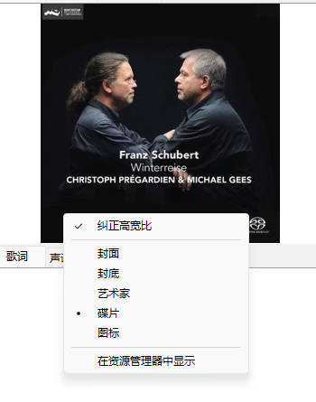
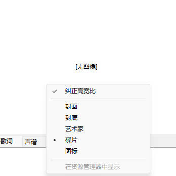

# 动机

foobar2000功能确实强大，也可以智能的选择mp3封面的位置，来进行显示

但是尴尬的是，从不同地方下载的mp3他们的封面位置可能不一样。根据我的经验，互联网论坛上下载的一般在“封面”部分，而网易云下载的却在“碟片”部分。如果你的播放列表里两种都有，那么切换歌曲的时候有时没有封面，有时又有封面，让人非常不爽。

像Clementine这样的播放器可以自动选择，而Audacious记忆中好像直接不读取“碟片”部分的图像。当然，foobar2000应该会有（没有也可以做）插件来实现自动选择，但是为了同时解决Audacious等其他播放器的问题，我认为还是直接从mp3上动手比较好。

# 方法

遗憾的是，foobar2000似乎并不支持这样的批量转换，还好我们可以用python库mutagen来自动修改mp3元数据。

具体的，mp3的封面图片一般是嵌入在[ID3](https://zh.wikipedia.org/wiki/ID3#ID3v2%E5%B5%8C%E5%85%A5%E5%9C%96%E7%89%87)中的，我们可以用mutagen先将序号为`6`的图片，即`$06 Media (e.g. label side of CD)`中的图片读取出来，然后放到`$03 Cover (front)`中。置于删不删除“碟片”图片看个人喜好。

我已经将其写成了一个GUI软件，见[https://github.com/kegalas/NeteaseMp3CoverMigrate](https://github.com/kegalas/NeteaseMp3CoverMigrate)

我们首先点击选择路径，选择一个文件夹，该软件随后会遍历该文件夹（含子文件夹）下的所有mp3文件，然后进行上述的封面迁移操作。

选项“另存新文件”，指的是在原文件的右边另存一份后缀为`_out.mp3`的文件，只在新文件上修改而不修改原文件。

选项“保留碟片图像”，即保留ID3中的序号为`6`的图片，取消勾选则不保留。

点击开始执行后等待结束即可。

**建议进行操作前备份自己的原始音乐文件**

*运行方法：*

- 安装python3
- 安装mutagen库，`pip install mutagen`
- python main.py
