# 绪论

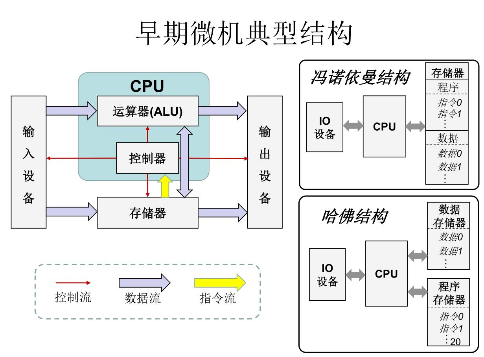

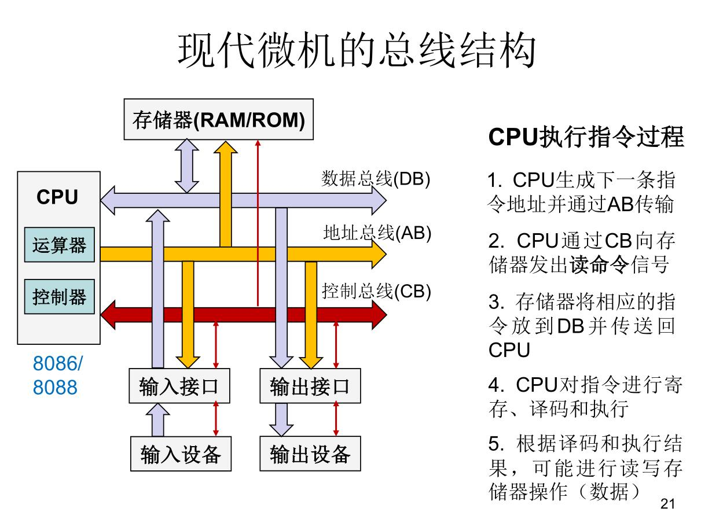

# 数制与码制

在计组、数电中已经学过这部分内容，这里着重讨论硬件的操作。

## 有符号数加减运算的溢出

设次高位向最高位的进位标志为$C_p$，最高位和次高位进位相加的进位标志为$C_s$，则当且仅当$C_p\oplus C_s=1$时，计算溢出。

8086CPU中PSW的OF标志位表示有符号数运算是否溢出。

# CPU的结构和功能

## 外部结构

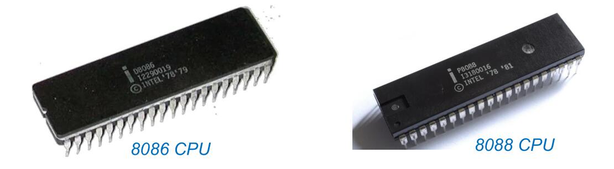

微处理器的外部结构表现为`数量有限的输入输出引脚`（共40个），这些引脚构成了微处理器级总线

这些引脚用来与存储器、IO设备交换信息，以及输入输出必要的信号。

通过分时复用技术，实现了引脚的复用。对于存储器，总共地址线为20条，寻址范围1M。对于IO设备则只有16条地址线。采用了独立编址的方式。控制线和数据线分别只有16条。也就是最大表示范围为$0\sim 2^{16}-1$

## 内部结构

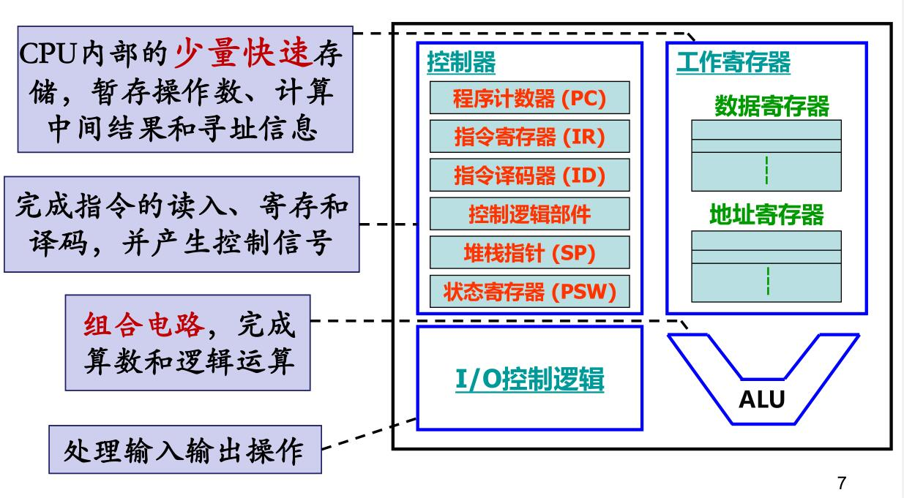

## 功能结构

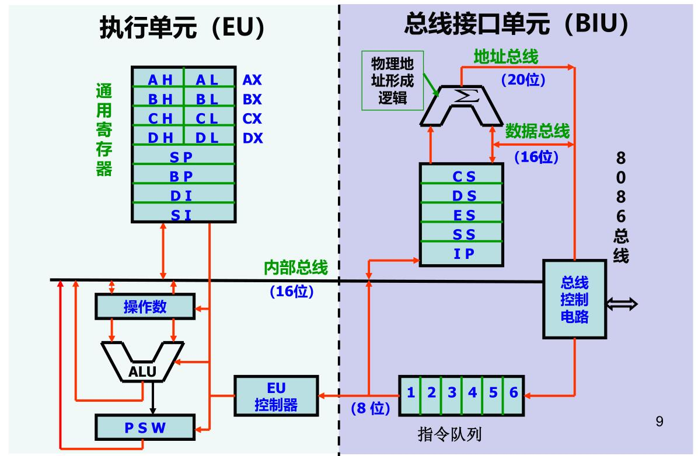

## 寄存器组织

### 通用寄存器

8086一共有8个通用寄存器，虽然通用并不意味着可以随便交换使用，还是有些操作只能用某个寄存器实现。

**数据寄存器**

一共有4个，分别叫AX，BX，CX，DX。每个都是16位大小的，但也可以拆成两个8位的使用。例如AH、AL分别表示AX的高8位、低8位。BH、BL表示BX的。

A的意思是Accumulator，即累加器。A在以前是8位寄存器，X代表miX，AX就为16位，而之后的EAX的E是Extend，为32位。再之后的RAX是64位。这些寄存器一般用来做运算操作。

B的意思是Base Register，基址寄存器，用于表示数据段的段内地址。

C的意思是Count Register，计数器，用于表示循环计数。

D的意思是Data Register，数据寄存器，用于表示IO端口的地址。

**地址指针与变址寄存器**

总共有4个，SP、BP、SI、DI。都是16位。前两个是地址指针

SP为Stack Pointer，堆栈指针，用于保存堆栈段的段内偏移地址。

BP为Base Pointer，基址指针，用于表示段内偏移地址，默认段地址由SS提供。

SI为Source Index，源变址寄存器。

DI为Destination Index，目的变址寄存器。

这两个寄存器用于字符串操作中，源操作数和目的操作数的段内偏移地址。

### 段寄存器

总共有4个，CS、DS、ES、SS。都是16位。

CS为Code Segment，代码段寄存器。用于保存当前执行程序的段地址，不能做被用户操作。

DS为Data Segment，数据段寄存器。用于保存数据段的段地址。

ES为Extra Segment，附加数据段寄存器。用于保存附加数据段的段地址。

SS为Stack Segment，堆栈段寄存器。用于保存堆栈段的段地址。

### 控制寄存器

总共有2个，IP、PSW。都是16位。

IP为Instruction Pointer，指令指针寄存器。始终指向下一条要执行的指令的偏移地址（段地址由CS提供）。相当于一般讨论中的程序计数器PC。IP的值不能被用户更改。

PSW为微处理器状态字。虽然有16位但是有用的只有其中9位。

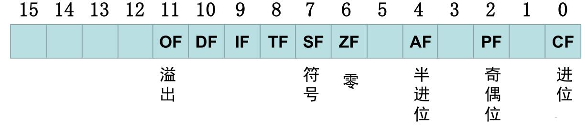

其中CF、PF、AF、ZF、SF、OF这6个是状态标志，反应ALU运算后的结果状态。

TF、IF、DF这3个是控制标志，用来控制CPU的运行状态。

CF表示最高位有无进/借位标志，有进位为1。

PF表示低8位含有1的个数，偶数个为1，奇数个为0。

AF表示D3位有无进/借位，有则为1。D3为即为8位二进制的第3位（从0位开始算）

ZF表示运算结果是否为0，是则为1。

SF为符号位，和数字的符号位一致。即等于D7或者等于D15。

OF之前介绍过，表示是否溢出，是则为1。

DF为方向标志，在进行字符串操作时，CPU每执行一条串操作指令，对源或(与)目的操作数的地址会自动进行一次调整。当DF为0时，SI/DI自动递增；DF为1时，SI/DI自动递减。在汇编中CLD指令把DF置0，STD指令把DF置1。

IF为外部中断允许标志，IF为1时，CPU能响应外部可屏蔽中断，即开中断状态。IF为0时为关中断状态。显然可以推知，对内部中断和外部不可屏蔽中断不起作用。STI指令置1，CLI指令置0。

TF为陷阱标志。当TF=1时，CPU每执行完一条指令便自动产生一个内部中断(类型为1)，转去执行一个中断服务程序，用户可以借助中断服务程序来检查每条指令执行的情况，称为单步工作方式，常用于程序的调试(Debug)。没有专门的设置指令。

## 存储器和IO组织

8086有20条地址线。

对于存储器用了全部的20条，寻址范围为1M，最小单位为字节，所以总共的空间为1MB。地址范围为00000H~FFFFFH。

对于IO端口则只使用低16条，寻址范围为64K。

由于寄存器全都是16位的，要表述20位的地址，就要用到两个寄存器。这两个寄存器加起来可以有32位，所以所有地址都可以有多重表示方式。之后会介绍。

## 数据在存储器中的存储

**字节型数据**

例如指令`DB 5, -12, 'a'`，存放三个字节型数据，它们顺序存放在内存中。

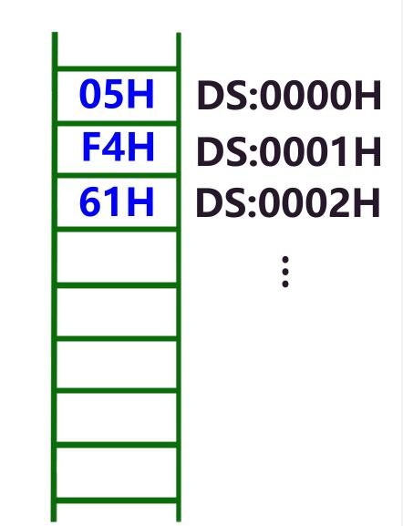

**字型数据**

字是16位，即两个字节。其低8位放在低地址，高8位放在高地址。例如1234H放在内存中，指令为`DW 1234H`，内存中就是34，12。这也叫做小端序。

整个字型数据的地址是低字节的地址。8086字的地址可以从任何地方开始。当地址为偶地址时，称为对准的；地址为奇地址时，称为未对准的。

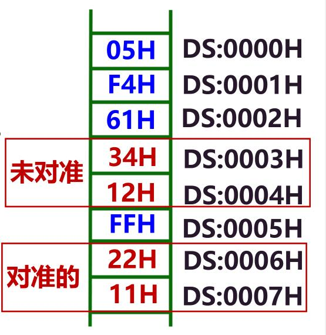

8086的数据总线为16位，所以存取一个字节只需要1个周期。而对于字，对准的需要1个周期，未对准的需要2个周期。

## 存储器的分段

由于寄存器全都是16位的，要表述20位的地址，就要用到两个寄存器。8086采用分段的方式，把地址空间分为若干个逻辑段。即20位地址表示为5位16进制数，例如12345H，1234H表示段地址，5H表示段内偏移。即高16位表示段地址，且每个段的起始地址可以被16整除（即XXXX0H可以被16整除）。

更具体的说，由于用两个寄存器表示，就可以写作1234H:0005H，前面的为段地址的寄存器，后面位段内偏移的寄存器。

显然的，这样操作，1MB的空间最多可以分为64K个段。每个段也最多可以有64KB的大小。但是我们最多也就1MB内存的大小，而不是64KB\*64K这么大的空间。我们几乎可以立即得到，段是可以重叠的，地址可以有多重表示方式。

事实上、$物理地址=段地址 \times 10H+偏移地址$。这样，00100H就可以表示为0000H:0100H和0010H:0000H，等等。

在硬件实现上，把段地址的寄存器（如CS、DS、ES、SS）的内容左移4位，加上偏移寄存器（如BX、BP、SP、SI、DI）中的内容，形成20位地址。

## 程序的分段存储

每个程序使用的内存可以分为三个段，即代码段、数据段、堆栈段。

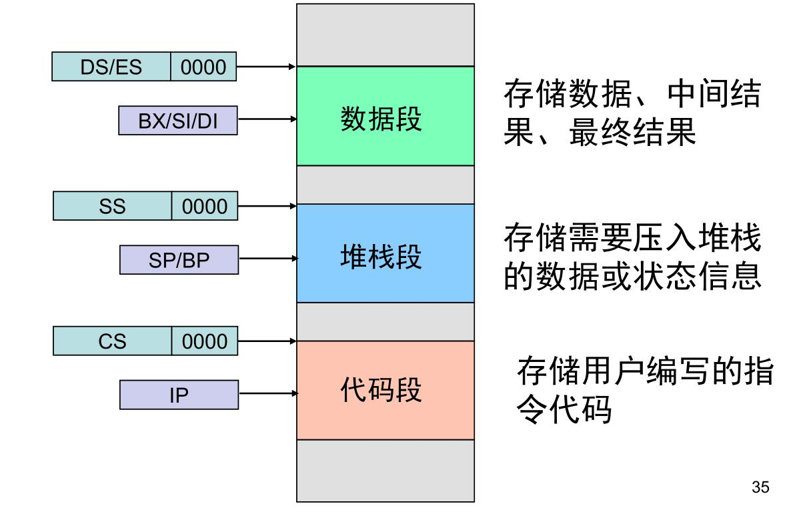

其中代码段的物理地址由CS:IP表示，数据段由DS/ES:BX/SI/DI表示，堆栈段由SS:SP/BP表示。

# 8086汇编

## 语句类型

**指令**

每条指令都对应一条CPU能执行的语句，即对应一条机器语言。

**伪指令**

不对应机器语言的代码，CPU无法进行操作。只是给汇编器看的，告诉汇编器如何汇编。

**宏指令**

用户自定义的一条能完成某一特定功能的新指令，由指令和伪指令组成，在程序汇编时展开，用指令和伪指令替代宏指令

## 语句格式

`[名称:] 助记符 [操作数] [;注释]`

其中名称有点像C/C++里面的label，给goto用的那个label。为可选项。

助记符就是指令、伪指令、宏指令的名字。必选项。

操作数，具体要看助记符要使用什么操作。有时候没有操作数，算是可选项。

注释用`;`开头，可选项。

## 常数和表达式

常数分为数值常数和字符（串）常数。

二进制数以B结尾，八进制数以O结尾，十六进制数以0开头，H结尾。

字符串用单引号括住。

表达式用的符号有算术、逻辑、关系等

`+,-,*,/,MOD`是算术操作

`AND, OR, XOR, NOT`是逻辑操作（其实是按位运算，不是逻辑与或）

`EQ, NE, LT, GT, LE, GE`是关系操作

这些运算符只能给常量使用，不能给寄存器使用。变量名使用是把变量名当作其偏移地址常数使用。

另外，关系判断中，如果为真，则所有位全取1，为假则全取0.

## 名称（标号）

前面提到，名称和goto里使用的label差不多。以冒号结尾，其后半部分的语句可以在下一行也可以在同一行。

标号还有一些属性，例如可以代表标号所在段的段地址，在段内的偏移，以及其类型。其分为两类，如果标号只在本段内使用，则其为NEAR型，如果在段间使用，则为FAR型。

## 变量

变量是用伪指令来表达的。分为五种类型

- DB，1字节变量
- DW，字，即2字节变量
- DD，双字，即4字节变量
- DQ，长字，即8字节变量
- DT，10字节变量。

变量可以有名称，但是名称不需要冒号。一个伪指令可以包含多个数值，用逗号分隔。例如

```asm
VAR1 DB 12H, 0A5H, 18+20, 50/3, 0, -1
```

它是单字节的，在内存中存储如下（注意这里内存+1不像C语言的指针+1是偏移一整个类型，这里就是偏移一个字节）

|地址|内容|
|-|-|
|VAR1|12H|
|VAR1+1|A5H|
|VAR1+2|26H|
|VAR1+3|10H|
|VAR1+4|0|
|VAR1+5|FFH|

由于x86是小端序，在2字节存储时

```asm
VAR2 DW 12H,$+1
```

其在内存中为

|地址|内容|
|-|-|
|VAR2|12H|
|VAR2+1|00H|
|VAR2+2|09H|
|VAR2+3|00H|

此处`$`表示当前汇编语句的偏移地址（假设前面已经定义VAR1），可以看到，逗号分隔的前面的数值算做了2个字节的偏移。再加上前面的6个字节，`$`表示8，那么8+1=9；另外`$`的长度为字形
    
另外，可以用`?`表示保留空间，但不预先赋值

```asm
VAR3 DB ?, ?
```

利用DUP，可以表示重复的声明

```asm
VAR4 DB 3 DUP(?) ; 这一句保留了3个未赋值的DB
VAR5 DB 4 DUP(0FFH, ?) ; 而且内部参数是可以有多个的，就保存了四个0FFH, ?的数据
VAR6 DB 3 DUP(55H,2 DUP(77H)) ; 而且还可以嵌套
```

表达字符串时，只能用DB和DW

```asm
VAR7 DB 'ABCD' ; 其等价于DB 'A', 'B', 'C', 'D'或者DB 'ABC', 'D'等
VAR8 DW 'AB', 'C', 'D'
; DW型保存字符时，要么两个字符，要么一个字符，不能多
; 其仍然遵循小端序，即B在低位，A在高位。或者C在低位，00H填充高位
```

变量也有类型：段地址、段内偏移、类型、长度、大小。长度为第一个DUP前的系数（没有DUP则为1），大小不是占用空间大小，是类型乘以长度。类型即为变量字节数（1/2/4/8/10）。可以用伪代码获取这些属性，获取的都是立即数常数。

```asm
MOV AX, SEG    VAR1 ; 获取段地址
MOV AX, OFFSET VAR1 ; 获取段内偏移
MOV AL, TYPE   VAR1 ; 获取类型
MOV AX, LENGTH VAR1 ; 获取长度
MOV AL, SIZE   VAR1 ; 获取大小
```

## PTR操作符

相当于汇编的强制类型转换。

```ASM
类型 PTR 表达式
```

例如

```
WORD PTR [BX]
```

其将BX指向的内存的大小当作字。避免运算过程中类型不确定的问题。

## 数据寻址操作

即`MOV`命令。其格式如下

```asm
MOV DST, SRC
```

把SRC里的东西放到DST里。根据DST和SRC的不同可以有很多种MOV操作。

### 立即数寻址

```asm
MOV AX, 1200H
```

即源操作数为立即数。

### 寄存器寻址

```asm
MOV AX, BX
```

两个寄存器的大小要匹配。另外CS不能作为目的操作数。

### 直接寻址

```asm
MOV AX, [1200H]
```

其中`[]`括起来的东西代表偏移地址，其加上段寄存器（默认为DS）的段地址得到物理地址，再把物理地址里的东西给AX。

可以指定段寄存器

```asm
MOV AX, ES:[1200H]
```

SRC可以是变量

```asm
MOV AX, VAR1+5
```

其中是把`VAR1+5`对应的地址开始的一个字给AX

还可以把立即数给变量

```asm
MOV VAR1, 2500
```

### 寄存器间接寻址

```asm
MOV AX,[SI]
```

把SI中的数据当作段内偏移，加上段地址（默认为DS）得到物理地址，再把物理地址里的东西赋值给AX。

但是，`[]`中的寄存器只能是BX、SI、DI这三个

也可以反过来进行

```asm
MOV ES:[SI], AL
```

即把寄存器里的东西放到内存里。

注意：

1. 不能DST和SRC都表示内存单元
2. 不能直接把立即数当作SRC，内存当作DST，因为没有指定类型，应当：

```asm
MOV WORD PTR [DI], 12H
; 而不是 MOV [DI], 12H
```

### 寄存器相对寻址

和上面的寄存器间接寻址相比，其就是增加了常数偏移。形式为

$$
[REG\pm 常数],常数[REG],变量名[REG],变量名[REG\pm 常数]
$$

其中REG可以为BX、BP、SI、DI，相比间接寻址多了BP。

当偏移为常数时，段地址为段寄存器，BX、SI、DI默认为DS段，BP默认为SS段。

偏移有变量名时，段地址取变量的段地址。

例如

```asm
MOV BX, [SI+5]
MOV BX, 5[SI] ; 和上一行等同
MOV CX, VAR1[BX] ; 变量名意味着段地址以变量为准
MOV AL, VAR2[DI-15]
```

### 基址变址寻址

```asm
MOV DX, [BX][SI]
```

如上例，操作数在存储器中，其地址为一个基址寄存器和一个变址寄存器之和，即((BX)+(SI))为其内容。

其中基址寄存器可以是BX和BP，变址寄存器可以为SI和DI。当BX时，默认为DS段，BP时，默认为SS段。

### 基址变址且相对寻址

把上面的基址变址缝上相对寻址，即加上偏移

$$
[BX/BP\pm 常数][SI/DI\pm 常数],常数[BX/BP][SI/DI]
$$

$$
变量名[BX/BP][SI/DI],变量名[BX/BP\pm 常数][SI/DI\pm 常数]
$$

有变量名时段由变量决定。

### 隐含寻址

即操作码本身隐含（提前规定）了操作数地址。例如乘除、字符串操作指令

```asm
MUL BL ; AX <- AL x BL
MOVSB ; (ES:DI) <- (DS:SI), SI+-1, DI+-1
```

### 一般化的要求

1. CS不能做DST
2. 立即数不能直接给段寄存器
3. 存储单元不能直接到存储单元
4. 段寄存器不能直接到段寄存器
5. 立即数不能作为DST
6. 源和目的至少有一个类型明确
7. 源和目的都有类型时，类型必须一致

## 转移地址寻址操作

CPU要执行的指令的地址由CS:IP决定，即IP指向下一条要执行（取）的指令。CPU每执行一
条指令，IP自动增加，使之指向下一条指令。IP增加的值为当前指令的指令长度。

可以通过改变CS：IP的内容实现程序的跳转 。

如果程序转移后只有IP发生改变，则称为段内转移（近程、NEAR转移）。如果CS也改变，则称为段间转移（远程、FAR转移）。

两种转移都有间接和直接寻址。

### 段内直接寻址

```asm
JMP LABEL
```

直接用标号给出地址（是16位大小的偏移地址），且标号应与该指令在同一个段。也可以直接给出偏移地址，例如用常数。但是不能用变量，变量算地址保存在存储器中。

实际汇编后，其会把IP修改为，JMP指令的下一条指令的IP+16位偏移的形式。16位偏移是汇编器直接在编译期转化为常数的。

但是，段内偏移和JMP指令的偏移是不同的，段内偏移就是内存物理地址中的那个段内偏移，我们明文写给JMP的地址是这个，但是JMP生成的机器码，其偏移是下一行指令的地址加上的一个偏移，可正可负。

### 段内间接寻址

```asm
JMP BX
JMP VAR1 ; VAR1为字型变量
JMP VAR1[SI]
```

诸如此类，16位偏移地址保存在寄存器或存储单元里。之前介绍的各种存储器寻址方式都可以在这里使用。

同前，我们写的16位偏移是段内偏移，但是JMP对应的机器码是相对于下一行指令地址的偏移。

### 段间直接寻址

```asm
JMP LABEL
```

其中LABEL和当前指令不在一个段。LABEL给出了16位段地址和16位段内偏移。

### 段间间接寻址

```asm
JMP VAR3 ; VAR3是双字变量，第一个字为段内偏移，第二个字为段地址
JMP VAR3[SI] ; 有效地址为(SI)+VAR3
```

也可以采用之前的存储器寻址方式。

### 转移指令

无条件转移：JMP、CALL、RET、IRET

条件转移：JZ、JC、JCXZ、LOOP等

## 程序结构

### 段定义伪指令

```asm
<段名> SEGMENT (定位类型)(组合类型)(类别)
    ...
    段体
    ...
<段名> ENDS
```

段名和普通的名称一致，具有段地址、偏移地址、定位类型、组合类型、类别五个属性

**定位类型**

|定位类型|段起始地址（2进制）|段起始地址（16进制）|特性|含义|
|-|-|-|-|-|
|PAGE(页)|xxxx xxxx xxxx 0000 0000|xxx00H|可以被256整除|本段从页的边界开始|
|PARA(节，默认)|xxxx xxxx xxxx xxxx 0000|xxxx0H|可以被16整除|本段从段的边界开始|
|PAGE(页)|xxxx xxxx xxxx xxxx xxx0|/|可以被2整除|本段从偶地址开始|
|PAGE(页)|xxxx xxxx xxxx xxxx xxxx|xxxxxH|起始为任意地址|起始为任意地址|

**组合类型**

NONE：表示本段与其他段不发生任何关系，该段有自己的段基址，是默认的组合关系。

PUBLIC：在满足定位类型的前提下与其他模块的同名段连接在一起，形成一个新的逻辑段，共用一个段基址。

COMMON：表示产生一个覆盖段。连接时，把本段与其他同名段置成相同的起始地址，重叠在一起，共享相同的存储区，其段长度由最长的段确定。

STACK：在每个汇编程序中，只能且必须有一个堆栈段，连接时，将本段与其同名段连接成一个连续的STACK段，汇编程序自动初始化SS和SP寄存器，使SS的内容为该连续段的段基址，SP指向堆栈底部加1的存储单元。

MEMORY： 表示本段在存储器中应定位在所有其他段的最高地址。

AT<表达式>：表示本段从表达式指定的地址处开始装入，这样，在程序中用户就可以直接定义段地址，这种方式不适用于代码段。

**类别**

如代码段（'CODE'）、数据段（'DATA'）、堆栈段（'STACK'），注意包括单引号，其本质是字符串。也允许自定义类别，方便连接同类别的段。

### ASSUME伪指令

```asm
ASSUME 段寄存器:段名[, 段寄存器2:段名2, ...]
```

通知寄存器把哪个段寄存器当作哪个段的寄存器，例如

```
CODE SEGMENT
    ASSUME CS:CODE, DS:DATA, SS:STACK
```

注意：当程序运行时，DOS的程序加载器(Loader)负责把CS、IP、SS、SP初始化成正确的段地址和段内偏移地址（如果设定了合适的组合类型），因此用户在程序中就不必设置。但是，在用户程序中必须用两条指令对DS和ES进行初始化，以装入用户的数据段段地址。

```asm
CODE SEGMENT
    ASSUME CS:CODE, DS:DATA, SS:STACK
    MOV AX, DATA ; DATA为段名，为立即数寻址
    MOV DS, AX
```

### END伪指令

```asm
END 表达式
```

该伪指令表示整个源程序的结束，其表达式的值为该程序运行时的启动地址，它通常是第一条可执行语句的标号（例如START:）。

### PAGE伪指令

```asm
PAGE 参数1, 参数2
```

该伪指令可以为汇编过程产生的列表文件指定每页的行数“参数 1”和每行的字符数“参数 2”。

### TITLE伪指令

```asm
TITLE 正文
```

该伪指令可以为汇编过程产生的列表文件指定一个标题“正文”，它不能超过 60 个字符。在列表文件的每一页的第一行将打印出这个标题。

### LABEL伪指令

```
名称 LABEL 类型
```

该伪指令用来定义变量或标号的类型，它具有段地址与偏移地址的属性，但它并不占用内存单元。

如果名称为变量名，其类型主要有三种：BYTE、WORD、DWORD

如果名词为标号，其类型主要有两种：NEAR、FAR

### EQU伪指令和“=”伪指令

```
名称 EQU 表达式
```

很类似C语言的#define，即给表达式一个名称，可以在程序里随地替换。

但是EQU定义的名称不能重复。而

```
名称=数值
```

可以重复定义，值为最近一次定义的值

### ORG伪指令

```
ORG 表达式
```

该伪指令用于为后续指令指定段内偏移地址，可以方便地将程序存入适当的地址，这一点对中断设计非常有用。

## 程序的加载和运行

当用户编写的程序在必须加载到内存中从才能运行，这是由操作系统的程序加载器（Loader）实现的，其具体工作包括：
- 决定使用存储器哪一部分的内存
- 初始化SS:SP和CS:IP(程序的第1条指令的位置)

当加载到内存的程序在计算机中运行时，计算机的控制由操作系统（OS）交给用户程序，当用户程序运行结束后，应再将控制权交回操作系统，可由系统中断程序中INT 21H的4C号程序实现。

用户程序的代码前一定有100个字节的程序段前缀(Program Segment Prefix, 简称PSP)，PSP给
出了用户的可执行文件(.EXE)的若干控制信息。

## 数据传送指令

数据传送指令被用来在寄存器、存储单元之间进行数据的传输。包含有：MOV、LEA、LDS、LES、LAHF、SAHF、XCHG、XLAT、PUSH、POP、PUSHF和POPF

共同点有

1. 除了SAHF、 POPF，其他操作不影响PSW
2. 有两个操作数时，第一个为目的，第二个为源
3. 目的操作数的寻址不能是立即数和段寄存器CS

### MOV

```asm
MOV DST, SRC
```

将SRC中的一个字节或一个字传送到DST。可以在立即数、存储单元、寄存器、段寄存器之间传送数据。

注意事项如下

- 操作数至少有一个类型是确定的
- 两个类型都确定时，类型要一致
- 不允许`MOV [xxx], [xxx]`，即内存->内存
- 不运行段寄存器->段寄存器
- 不允许立即数->段寄存器
- IP不能作SRC或DST
- CS不能作DST
- 立即数不能作DST

对于类型

- 立即数是无类型的
- 不含变量名的直接寻址、寄存器间接寻址、寄存器相对寻址、基址变址寻址、基址变址且相对寻址的操作数也是无类型的(存储器寻址)
- 利用PTR操作符可指定或暂时改变存储单元的类型

立即数分为

- 常数和常数表达式
- 所有由属性操作符得到的标号或变量的属性

前面提到一些不能进行的操作，指的是不能直接进行，但是我们可以间接进行

- 内存->内存不行，但是内存->通用寄存器->内存可以
- 立即数->段寄存器不行，但是立即数->通用寄存器->段寄存器可以
- 段寄存器->段寄存器不行，但是段寄存器->通用寄存器->段寄存器可以
- CS和IP不能用MOV改变，但是可以通过跳转指令改变

### LEA

```asm
LEA REG16, MEM
```

取有效地址指令，即把MEM的16位段内偏移赋值给REG16。SRC是直接寻址，DST是寄存器寻址，用通用寄存器，一般用BX、BP、DI、SI

其相当于

```
MOV REG16, OFFSET MEM
```

### LDS/LES

```asm
LDS REG16, MEM
LES REG16, MEM
```

取地址指针指令。

LDS把MEM的物理地址的高16位送入DS，低16位送入指定的REG16.

LES把MEM的物理地址的高16位送入ES，低16位送入指定的REG16.

### LAHF/SAHF

```asm
LAHF
SAHF
```

标志传送指令。其没有操作数，也就是隐含寻址。LAHF把PSW的低8位赋值给AH，SAHF把AH赋值给PSW的低8位。

### XCHG

```asm
XCHG DST, SRC
```

数据交换指令。该命令完成寄存器之间，或者寄存器与内存之间的内容交换（立即数不行）。即把DST和SRC的内容交换。

但是寄存器不能是段寄存器，数据可以是字也可以是字节（但是类型要一致）。

### XLAT

```asm
XLAT
```

字节交换指令。隐含寻址。将有效地址为(BX)+(AL)的内存的内容送进AL，常用来查表。

### PUSH/PUSHF

```
PUSH SRC
PUSHF
```

压栈指令。PUSH指令把SRC压入堆栈，即`SP<-SP-2, (SP)<-(SRC)`。PUSHF则把PSW压入栈。这里SRC必须是字型的，可以是通用、段寄存器，也可以是某种寻址的内存，但是不能是立即数。

### POP/POPF

```asm
POP DST
POPF
```

弹栈指令。POP指令把栈顶弹出，赋给DST，即`(DST)<-(SP), SP<-SP+2`。POPF则是栈顶弹出给PSW。

这里的DST和之前的SRC要求相同。但是DS不能作DST。

### 堆栈注意事项

1. PUSH和POP成对使用
2. 8086不会检测栈溢出，所以交给程序员自己检查
3. 分配堆栈空间时要留有余量（20%以上）

## 算术运算指令

算术运算指令可以完成两个操作数的各种算术运算，例如加减乘除取余，以及其BCD数运算的调整运算。包括有：ADD、ADC、SUB、SBB、NEG、CMP、INC、DEC、MUL、IMUL、DIV、IDIV、CBW、CWD、AAA、DAA、AAS、DAS、AAM、AAD。

它们可以分为6类

1. 加减法指令
2. 比较指令
3. 增量减量指令
4. 乘除法指令
5. 符号扩展指令
6. BCD数运算调整指令

一般情况下：

- 涉及ALU的运算，不能使用段REG
- 设计ALU的运算，运算结果一般会影响PSW的6个状态位：OF、SF、ZF、AF、PF、CF
- 一般支持字节或字型数据

### ADD/ADC

```asm
ADD DST, SRC
ADC DST, SRC
```

加法指令。ADD是把DST和SRC的值加起来再给DST；而ADC是把DST和SRC加起来，再加上CF（即PSW进位标志的值），再给DST。

SRC可以取立即数、通用寄存器、内存（存储单元）。DST可以取通用寄存器和内存。但是SRC和DST不能同时为内存，并且两者类型要一致。

只能处理字节或字，其他位宽的数据要分开来加。

比如双字，可以先利用ADD完成低字的加法，再利用ADC完成高字和进位的加法。

### SUB/SBB

```asm
SUB DST, SRC
SBB DST, SRC
```

减法指令。SUB是`(DST)<-(DST)-(SRC)`，SBB是`(DST)<-(DST)-(SRC)-(CF)`

指令的要求和ADD/ADC一样。

### NEG

```asm
NEG DST
```

取负指令。即把DST的相反数传递给DST。

DST可以取通用寄存器和内存，也会影响6个PSW位。其实质上是一个特殊的减法运算，即`0-(DST)`

### CMP

```asm
CMP DST, SRC
```

比较指令。其完成DST-SRC，然后根据结果设置PSW的标志位，但结果不保存到DST。

如果DST和SRC都是无符号数，如果DST>=SRC，则CF=0。若DST< SRC，则CF=1。

如果都是有符号数，则两个数的大小由OF和SF共同决定。

不溢出时，OF=0，差是正确的，则SF=0代表DST>=SRC，SF=1代表DST< SRC

溢出时，OF=1，差是错误的，则SF=0代表DST<SRC，SF=1代表DST>= SRC

简单记为，$OF\oplus SF=0\Rightarrow DST\geq SRC$，$OF\oplus SF=1\Rightarrow DST< SRC$

### INC/DEC

```asm
INC DST
DEC DST
```

增量减量指令。INC相当于DST++，DEC相当于DST--。

DST可以取通用寄存器和内存。INC和DEC只会影响AF、OF、SF、ZF、PF，但是不会影响CF。

### MUL/IMUL

```asm
MUL SRC
IMUL SRC
```

乘法指令。其中MUL对应无符号，IMUL对应有符号。目的操作数隐含在AX或AL中，SRC可以是通用寄存器和内存（不能是立即数），但是必须有确定的类型，而且只能是字节或字。

SRC为字节时，AL和SRC相乘，其结果存在AX中。SRC为字时，AX和SRC相乘，其结果的高16位保存在DX，低16位保存在AX。

这两个指令只对CF和OF有影响。如果字运算结果的DX为0，那么CF=0，OF=0，表示结果也为一个字。如果字节运算结果的AH为0，那么CF=0，OF=0，表示结果也为一个字节。否则CF=1且OF=1。

### DIV/IDIV

```asm
DIV SRC
IDIV SRC
```

除法指令。其中DIV对应无符号，IDIV对应有符号。总体上和乘法指令类似。

当SRC为字节时，将AX中的16位二进制数除以8为二进制数（SRC），其结果的商保存在AL中，余数保存在AH中。

当SRC为字时，DX与AX联合成为32位被除数，SRC作为16为除数。其结果的商存在AX中，余数存在DX中。

商的正负性不用多说，讨论余数的正负性：余数的正负永远和被除数的正负相同（和数学上定义不一样）。

这两个指令不影响PSW的标志位，但是不允许出现除数为0或者除法溢出。如果出现这两种情况，则没有意义，并且会引发中断。

### CBW/CWD

```asm
CBW
CWD
```

符号扩展指令。CBW将AL的符号扩展到AH中，形成一个字AX。CWD将AX的符号扩展到DX中，形成双字。

即当D7=0时，扩展为AH=00H，D7=1时，扩展为AH=FFH。扩展双字同理。

### BCD数运算调整指令

在8086这里BCD码可以分为两类。

- 分离BCD码，8位的寄存器中只包含一位BCD码，即D0~D3
- 组合BCD码，8位的寄存器中包含了两位BCD码。

BCD调整指令一共有6条

|助记符|功能|
|-|-|
|AAA|加法分离BCD调整|
|DAA|加法组合BCD调整|
|AAS|减法分离BCD调整|
|DAS|减法组合BCD调整|
|AAM|乘法分离BCD调整|
|AAD|除法分离BCD调整|

**加法调整指令**

众所周知，BCD码用4位空间表示0~9十个数字，就有6个信息位没用上。所以每一个BCD数字相加时，可能会溢出到这六个没用上的信息位上，此时要整体+6、进位来修正。具体可见计组和数电。

AAA为分离BCD码加法运算后的调整指令，它会自己判断相加的结果（即AL）需不需要进行加6修正，如果需要则修正，否则不动。根据运算结果及修正结果的AF有无进位，进行下列操作：

- AF有进位，则AH=AH+1，CF=1，AF=1
- AF无进位，则CF=0，AF=0

并清除AL中的高4位。

DAA为组合BCD码的加法调整，表示对相加结果AL的低4位和高4位分别进行加6修正（如有必要）。DAA对AF、CF、SF、ZF、PF都有影响，其效果等同于ADD指令。

例如

```asm
MOV AH, 0
MOV AL, '4'
MOV BL, '8' ; 这两个是因为，ASCII的数字，高4位都是0011，而低4位从0开始。而分离BCD码高4位无效，所以不需要清除高4位。
ADD AL, BL
AAA
```

在AAA之前，(AL)=6CH，AAA调整后，(AX)=0102H，CF=1，AF=1

这说明4+8=12

又例如

```asm
MOV AL, 34H
MOV BL, 28H
ADD AL, BL
DAA
```

执行DAA前，(AL)=5CH，执行之后，(AL)=62H，CF=0，AF=1，SF=0，PF=0，ZF=0。这说明34+28=62。

而

```asm
MOV AL, 56H
MOV BL, 73H
ADD AL, BL
DAA
```

DAA前，(AL)=C9H，DAA后，(AL)=29H，CF=1，AF=0，SF=0，PF=0，ZF=0。这说明56+73=129。也就是说CF标志位成为了百位数。

**减法调整指令**

与加法正好相反，如果一位溢出时，要进行减6修正。

AAS根据运算结果及修正结果的AF有无借位，进行下列操作

- AF有借位，则CF=1，AF=1
- AF无借位，则CF=0，AF=0

并清除AL的高4位。

而DAS则会对AF、CF、SF、ZF、PF都有影响，其效果等同于SUB指令。

## 逻辑运算指令

总共有五种逻辑运算指令：AND、OR、XOR、TEST、NOT，格式分别为

```asm
AND  DST, SRC
OR   DST, SRC
XOR  DST, SRC
TEST DST, SRC
NOT  DST
```

都是按位计算，其中TEST的功能和AND完全相同，但是不改变任何操作数，只改变PSW。

逻辑运算指令的对象是字节或字。其中NOT指令对PSW无影响，其他指令使得CF=OF=0，ZF、SF、PF根据结果改变。AF无关。

DST可以为通用寄存器、内存，SRC可以为通用寄存器、内存、立即数。但是二者不能同时为内存。

## 移位指令

移位指令的共同特点为：正常影响PSW的SF、PF、ZF、CF和OF标志位，其中CF表示指令所移出的一位，OF=1表示移位前后符号位发生了变化。

移位指令一般形式如下

```asm
SHR  DST, CNT
```

其中DST为通用存储器或内存，而CNT一般为常数`01H`或者寄存器`CL`

### 逻辑移位

左移为SHL、右移为SHR。空位用0填补，移出的位放入CF（移出多位时，最后一个移出的放入CF）。

### 算术移位

左移位SAL、右移为SAR。SAL与SHL完全相同，SAR则是空位由符号位补充，移出的位也是放入CF。

### 循环移位指令

不带CF的循环移位，左移为ROL，右移为ROR。

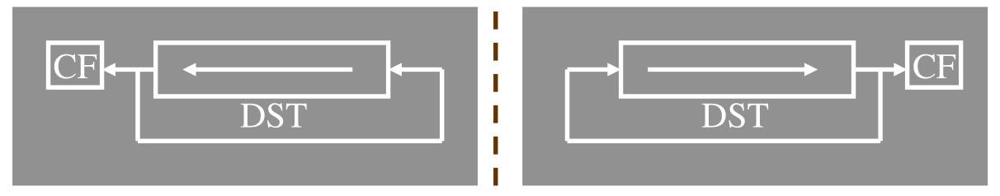

带CF的循环移位，左移为RCL，右移为RCR。

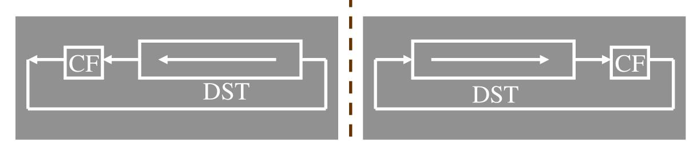

## 标志位操作指令

用这些指令可以手动设置PSW里的位。

|指令|功能|
|-|-|
|CLC|CF置0|
|STC|CF置1|
|CMC|CF取反|
|CLD|DF置0|
|STD|DF置1|
|CLI|IF置0，关闭中断|
|STI|IF置1，打开中断|

## 转移指令

8086汇编中转移指令有两大类：无条件转移指令（如JMP、CALL、RET、IRET），条件转移指令（如JZ，JC，JCXZ，LOOP）

### JMP（无条件）

```asm
JMP LABEL ; 段内或段间直接寻址，跳转到LABEL标号处
JMP REG16 ; 段内间接寻址，跳转到REG指定的段内偏移
JMP MEM   ; 字单元段内转移，双字单元段间转移，跳转到MEM指定的位置
```

其中JMP LABEL不需要指明是Near还是Far。如果LABEL与该指令在同一个段内，则为段内直接转移，转移后CS不变，(IP)<-(IP)+DISP16。其中DISP16表示转移目的地址与JMP转移指令之间的16位偏移量（可正可负），这时也叫近程转移。如果偏移量可以用8位表示，那么(IP)<-(IP)+DISP8，这时称为短转移。如果LABEL和JMP在不同的段，则表示段间直接转移，转移后(CS)<-SEG LABEL，(IP)<-OFFSET LABEL，这时称为远程转移。

而段内间接寻址则不是这么玩的，例如`JMP BX`他直接把`BX`内容赋值给`IP`，而没有什么偏移。

段间间接寻址是用双字内存来实现的，第一个字是OFFSET，第二个字是SEG。

### 有条件转移指令

只有当给定的条件满足时，才会转移到指定的地址。条件是看PSW中的标志位，由上一条指令产生。

有条件转移的寻址方式只有段内直接转移一种，而且是短转移，即偏移只能有8位有符号数。

|指令|测试条件|功能|
|-|-|-|
|JC LABEL|CF=1|有进/借位|
|JNC LABEL|CF=0|无进/借位|
|JE/JZ LABEL|ZF=1|相等|
|JNE/JNZ LABEL|ZF=0|不相等|
|JS LABEL|SF=1|负数|
|JNS LABEL|SF=0|非负数|
|JO LABEL|OF=1|有溢出|
|JNO LABEL|OF=0|无溢出|
|JP/JPE LABEL|PF=1|有偶数个1|
|JNP/JPO LABEL|PF=0|有奇数个1|
|JA/JNBE LABEL|(CF=0)且(ZF=0)|大于（无符号）|
|JAE/JNB LABEL|CF=0|大于等于（无符号）|
|JB/JNAE LABEL|CF=1|小于（无符号）|
|JBE/JNA LABEL|(CF=1)或(ZF=1)|小于等于（无符号）|
|JG/JNLE LABEL|$(OF\oplus SF)\wedge ZF=0$|大于（有符号）|
|JGE/JNL LABEL|$OF\oplus SF=0$|大于等于（有符号）|
|JL/JNGE LABEL|$OF\oplus SF=1$|小于（有符号）|
|JLE/JNG LABEL|$(OF\oplus SF)\vee ZF=1$|小于等于（有符号）|

由于有条件转移的范围很小，所以可以把他搭配无条件转移来使用。

### 循环指令

```asm
LOOP LABEL          ; (CX)<-(CX)-1, CX!=0时转LABEL
LOOPZ/LOOPE LABEL   ; CX!=0且ZF=1时转LABEL
LOOPNZ/LOOPNE LABEL ; CX!=0且ZF=0时转LABEL
JCXZ LABEL          ; CX=0时转LABEL
```

都是段内直接转移，且为短转移。

## 字符串操作指令

8086有5类字符串操作，分别为字符串传送（MOVS）、比较（CMPS）、扫描（SCAS）、装入（LODS）、存储（STOS）

字符串处理既可以按字操作，也可以按字节操作，每次处理一个单元。SRC和DST都是隐含寻址。约定如下：

- 如操作数在存储器中，则SRC由DS:SI确定，DST由ES:DI确定；如果操作数在寄存器中，则使用AL（字节型），AX（字型）
- CPU执行操作后，SI和DI会自动修改，当DF=0时增加，DF=1时减小。字节操作时修改1，字操作时修改2。

### 字符串传送

```asm
MOVSB            ; 字节传送 (ES:DI)<-(DS:SI)
MOVSW            ; 字传送 (ES:DI)<-(DS:SI)
MOVS DST, SRC    ; 使用变量名，字节或字传送，但是是隐含寻址
```

字符串传送对PSW无影响。

注意MOVS的DST和SRC不是寻址，操作数仍然是隐含寻址的ES:DI和DS:SI。当DST和SRC都是字型时等同于MOVSW，都是字节型时等同于MOVSB。

### 字符串比较

```asm
CMPSB
CMPSW
CMPS DST, SRC
```

三个操作都是(DS:SI)-(ES:DI)，然后设置PSW标志位。DST和SRC仍然是只标记大小，并不是寻址。

### 字符串扫描

```asm
SCASB
SCASW
SCAS DST
```

字节扫描时，(AL)-(ES:DI)设置PSW。字扫描时，(AX)-(ES:DI)设置PSW。源操作数固定为AX或AL，目的操作数固定为ES:DI。

### 字符串装入

```asm
LODSB
LODSW
LODS SRC
```

字节操作时，把(DS:SI)放入AL。字操作时，把(DS:SI)放入AX。源操作数固定位DS:SI，目的固定为AL或AX。不影响PSW。

### 字符串存储

```asm
STOSB
STOSW
STOS DST
```

把AL或者AX放入(ES:DI)，操作数固定。不影响PSW。常用作对指定区域清零或者赋初值。

### 重复前缀

实际应用中经常需要对整个字符串进行操作，此时需要重复指令。

**REP**

```asm
REP STR_OP ; 当CX!=0时，重复执行STR_OP。CX<-CX-1。例如REP STOSB
```

**REPZ/REPE**

```asm
REPZ STR_OP ; 当CX!=0且ZF=1，重复执行STR_OP。CX<-CX-1。例如REP CMPSB比较直到不相同
```

**REPNZ/REPNE**

```asm
REPNZ STR_OP ; 当CX!=0且ZF=1，重复执行STR_OP。CX<-CX-1。例如REP CMPSB比较直到相同
```

## 子程序

子程序是一种汇编语言的封装，在和C语言中的函数是类似的。子程序通过修改CS和/或IP来实现调用，一般通过CALL指令。CALL好处在可以保存CS和IP，方便之后用RET指令返回。

### CALL

```asm
CALL LABEL
```

如果LABEL可以用短转移。则IP入栈，(IP)<-(IP)+DISP8。如果只能用16位的近程转移，那么IP入栈，(IP)<-(IP)+DISP16。如果只能用远程转移，那么CS先入栈，IP再入栈。再把IP赋值OFFSET，CS赋值SEG。

```asm
CALL OPR
```

如果OPR为REG16，IP入栈，(IP)<-(REG16)

如果OPR为16位RAM，IP入栈，(IP)<-(MEM)

如果OPR为32位RAM，CS入栈，IP入栈，(IP)<-(MEM)，(CS)<-(MEM+2)

### RET

```
RET   ; 用于段内返回，使得(IP)<-(SP)，弹栈
RETF  ; 用于段间返回，先IP出栈，后CS出栈
RET n ; 完成RET（或RETF）后，(SP)<-(SP)+n
```

### 子程序伪指令

```asm
过程名 PROC [类型]
    ...
    ...
    RET
过程名 ENDP
```

其中PROC和ENDP是伪指令。过程名相当于C语言的函数名，给子程序取的名字。它可以看作标号。类型可以是Near也可以是Far，默认为Near。

但是过程名没有命名空间，也不能嵌套声明（可以嵌套调用）。

## 中断

8086有三种中断

1. 内部中断。包括除法错误（0号中断），单步执行（1号），断点中断（3），INTO指令中断（4），INT n中断（n）
2. 外部非可屏蔽中断NMI（2）。包含存储器错误和关机等。
3. 外部可屏蔽中断INTR。

中断处理程序是放在存储器中的。于是我们获取到中断编号后，就要从内存中获取该编号对应的中断处理程序的地址（包括CS和IP）。

中断处理程序的地址的地址，为段地址0000H，偏移地址$中断类型号\times 4$。于是有四个字节或者两个字，第一个字为IP，第二个字为CS。CS:IP给出了中断处理程序的地址。

中断类型范围为0~255

### INT

```asm
INT n
```

表示调用第n号中断，其值为0~255，其会进行如下操作

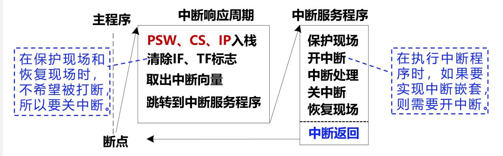

### IRET

中断返回指令。执行时会IP、CS、PSW的顺序出栈。

### DOS提供的系统功能调用

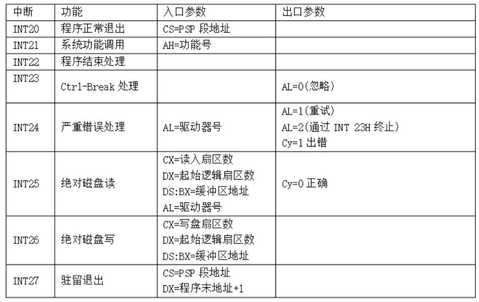

其中INT21的功能号对应的功能为

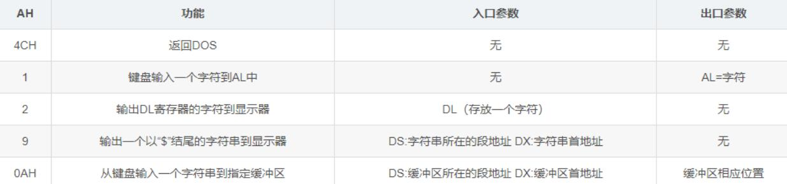

## IO操作

8086是独立编址的，进行IO操作需要特别的指令。

### IN

```asm
IN DST, SRC
```

从端口输入数据。其中SRC一般为DX或者立即数，表示设备端口的地址。但是立即数只能是8位，而DX可以用16位也可以用8位。DST例如用AX表示读一个字，用AL则表示读一个字节。

### OUT

```asm
OUT DST, SRC
```

和IN的DST和SRC的要求换一下即可。

## 处理器控制指令

### NOP

空操作指令。表示什么也不做，但要占用机器的三个时钟周期。

### HLT

暂停指令，使CPU进入暂停状态，退出暂停的条件有：

- RESET信号有效，即CPU进行复位操作
- NMI（非屏蔽中断请求）信号有效，即系统收到了非屏蔽中断，必须处理
- INTR（可屏蔽中断请求）有效，且IF=1，此时要求系统响应该请求

### WAIT

等待指令，使CPU处于等待状态。这是，CPU会定期检测8086芯片的$\overline{TEST}$引脚。为高电平时继续等待，并且每五个时钟周期再检查一次，直到低电平，之后退出等待执行下一条指令。

### LOCK

总线锁定指令

```ASM
LOCK <其他指令>
```

可以保持总线的使用权，表示在使用这组指令期间，别的设备不能使用外部总线

### ESC

```ASM
ESC CODE, DATA
```

换码指令，完成多处理器之间的指令和数据交换。

例如8086cpu可以利用该指令把任务分配给8087。CODE是一个事先规定的6位指令码（立即数表示），DATA表示要送的数据（使用寄存器或存储器寻址）

## 宏指令

宏指令是用户自己定义的指令，它是由指令和伪指令构成的程序段。用户使用宏指令时必须先定义后调用。

宏指令用标识符（宏指令名）来表示一段程序，在程序汇编时，调用的宏指令会被展开成相应的程序段（宏展开）。所以宏指令并没有相对应的指令代码，类似于EQU这样的标识符。

```asm
宏指令名 MARCO <形式参数>
    ... ; 宏体
ENDM    
```

形式参数就像C的函数的参数，不过应该是传引用，例如

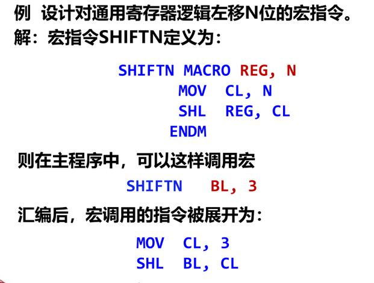

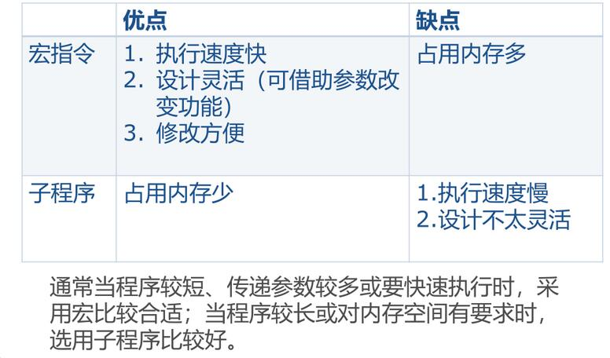

# 总线及其形成

## 基础概念

一组共用的导线，计算机中各种信息沟通的公共通道

- 按照连接对象分类为：内总线、外总线
- 传输信息的种类：数据总线、地址总线、控制总线
- 握手技术和联络方式：同步传输总线、异步传输总线
- 功能层次：片内总线、元件级总线、系统总线、通信总线

微处理器级总线： 微处理器外部结构中的数量有限的输入输出引脚

系统级总线：微处理器级总线和其他逻辑电路连接组成的主机板系统

## 集中常用芯片

### 三态门

典型芯片74LS244

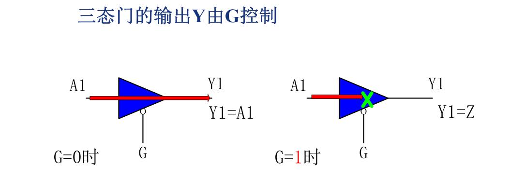

其中Z为高阻态。上图应该G是$\bar G=1$时高阻

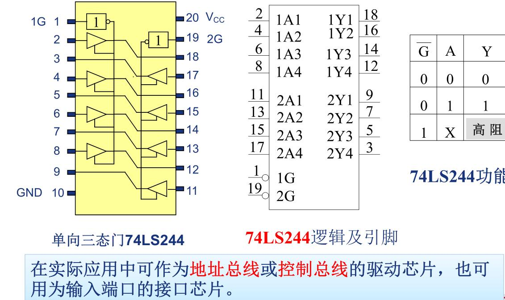

### 双向三态门

典型芯片74LS245

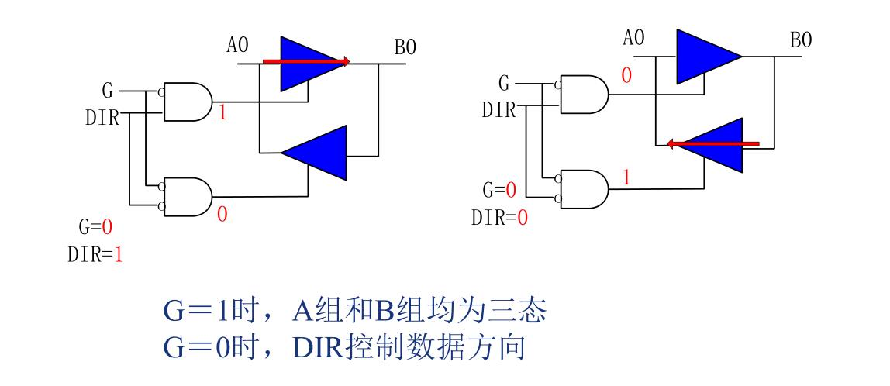

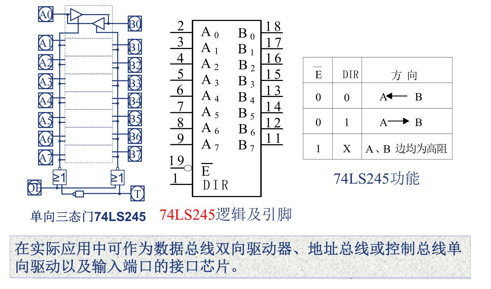

### 带有三态门输出的锁存器

典型芯片74LS373

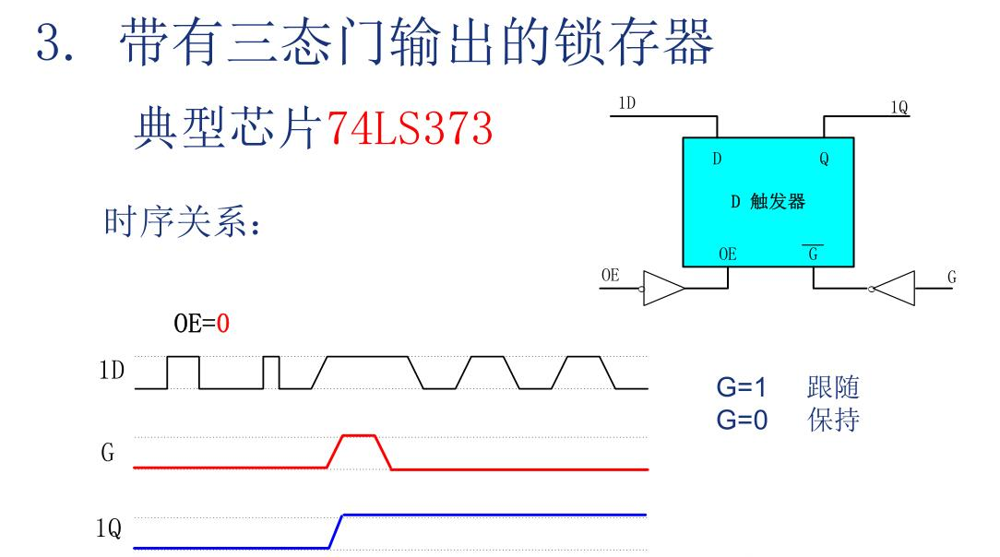

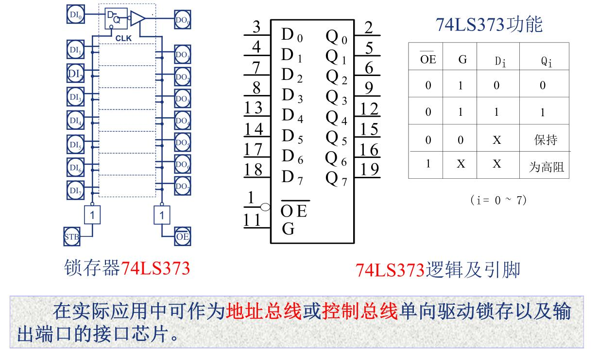

## 8086的引脚功能及时序

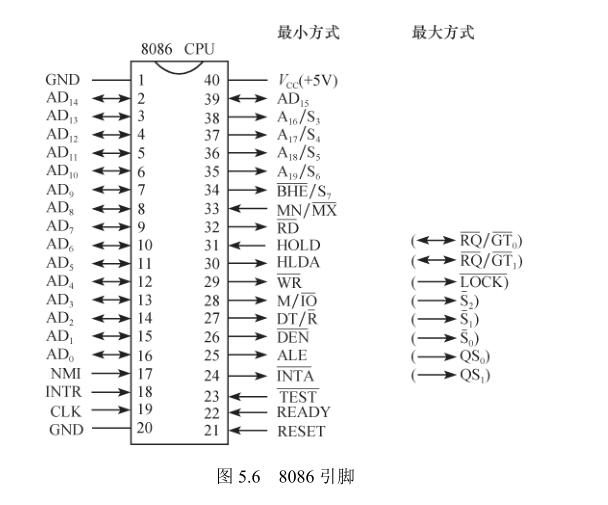

### 总线周期

- T1状态：表示CPU准备输出存储器地址或I/O地址。
- T2状态：用于输出控制信号。
- T3/Tw状态：在这个状态下，CPU会等待存储器或I/O端口准备好数据传输。
- T4状态：这是数据传输完成的确认阶段。

### 最小方式

引脚功能TODO

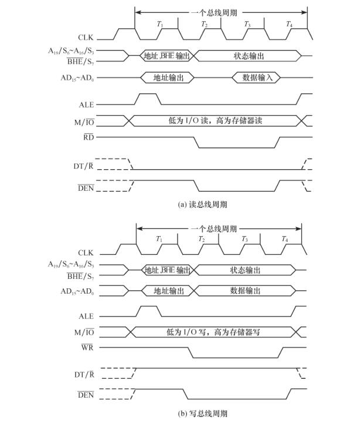

### 最大方式

引脚功能TODO

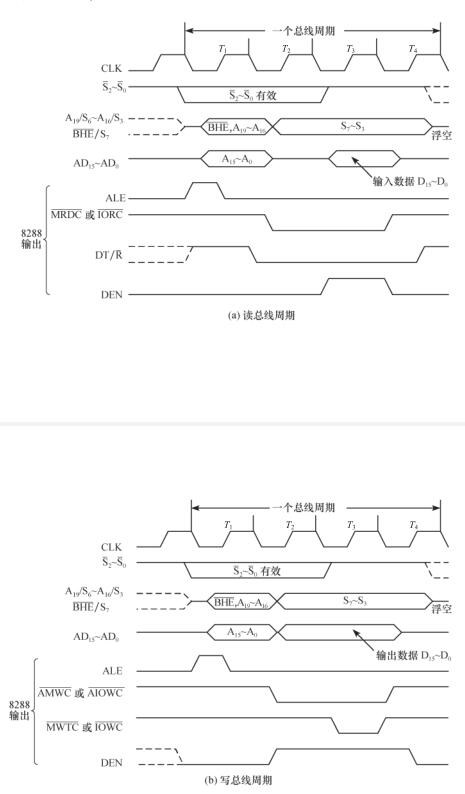

## 系统总线的形成

### 最小方式

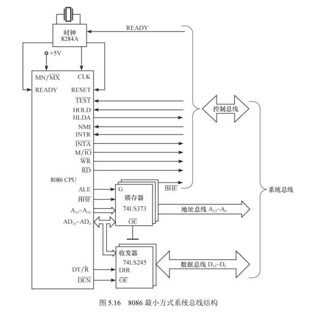

### 最大方式

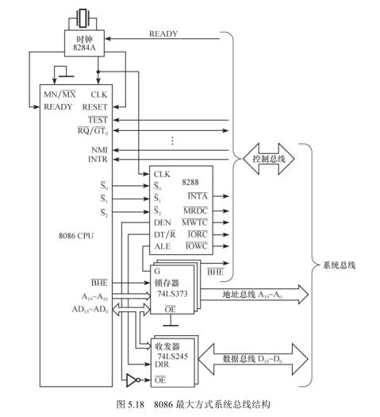

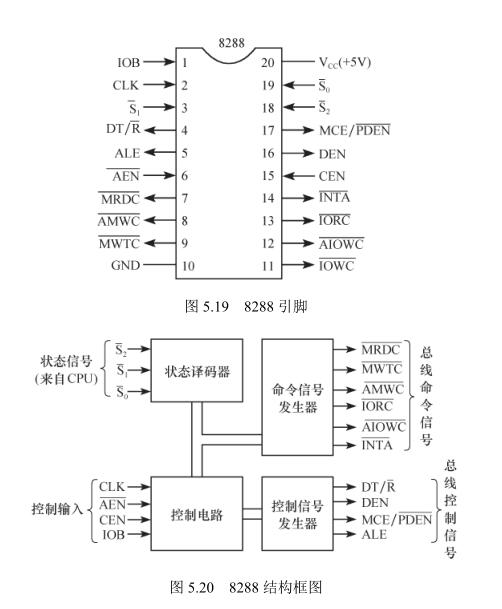

### 8086与8088的差异

1. 在 CPU 内部，8086 CPU 的指令队列寄存器由 6 字节组成，而 8088 CPU 的指令队列寄存器由 4 字节组成。
2. 在 CPU 外部
    1. 8088只有8位数据线即D0-D7
    2. 8088中为$IO/\bar M$，而8086中为$M/\overline{IO}$
3. 8086中的$\overline{BHE}/S_7$在8088中为$\overline{SS_0}$仅用于在最小方式中提供状态信息，在最大方式中始终为高电平。

### PC/XT 总线

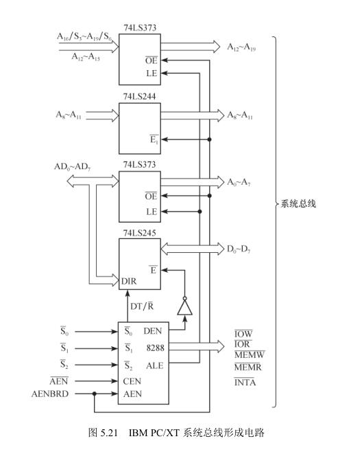

引脚功能todo

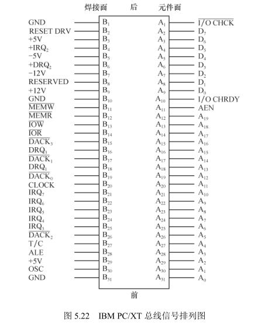

# 存储器设计

## 存储器分类和主要技术指标

P190

## 几种常用存储器芯片介绍

6264和2114是SRAM，而2764是EPROM

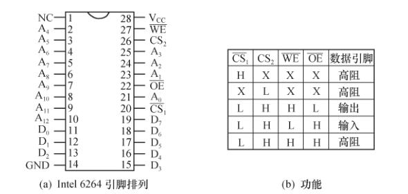

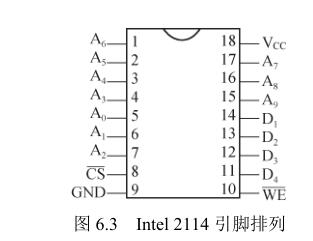

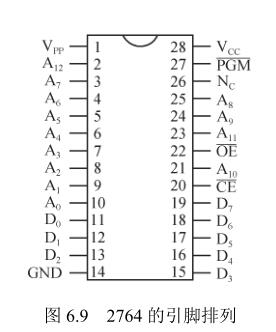

## 扩展存储器设计

P201

## 存储器地址译码电路设计

P207

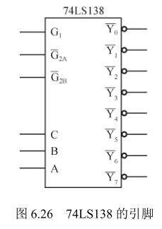

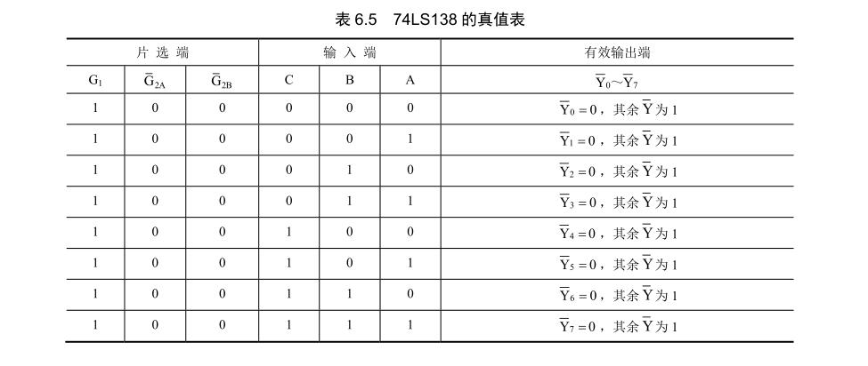

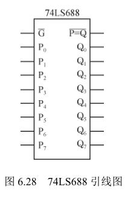

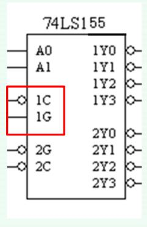

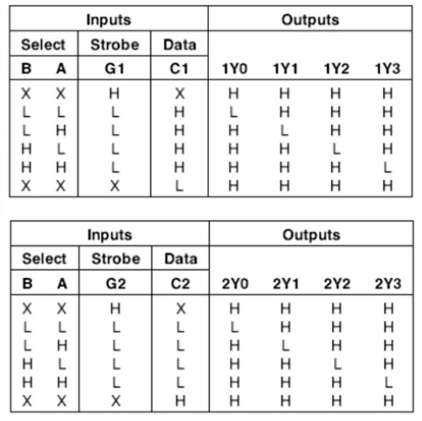

## 存储器与CPU的连接

P209

本章后面的疑似不用学

# 常用芯片的接口技术

## I/O 接口概述

P224

## 外设接口的编址方式

P226

## 输入/输出的基本方式

P228

## 常用芯片的接口技术

P232

本章后面的疑似不用学

# 中断系统与可编程中断控制器 8259A

## 中断的基本概念

P256

## 8086 的中断系统

P260

## 可编程中断控制器 8259A 及其应用

P264

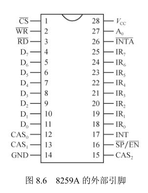

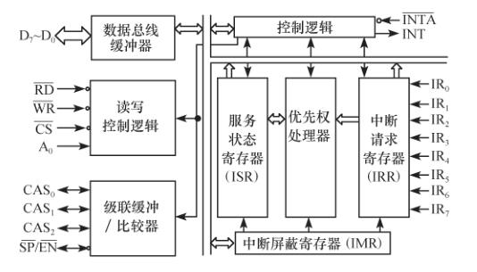

# 定时/计数器 8253 应用设计

## 8253的引脚功能及特点

P273

## 8253的原理结构及工作原理

P273

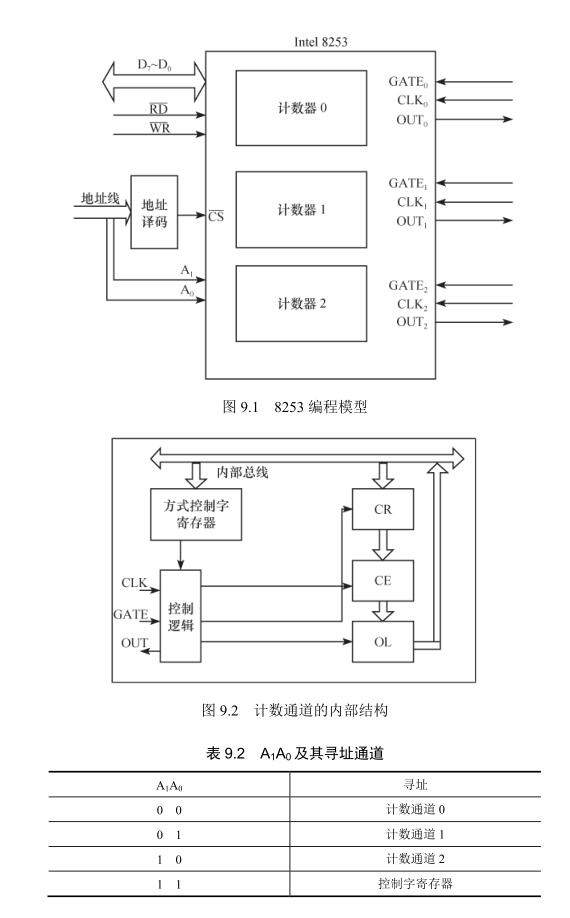

## 8253的控制字及工作方式

P275

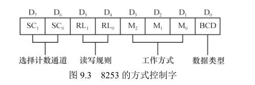

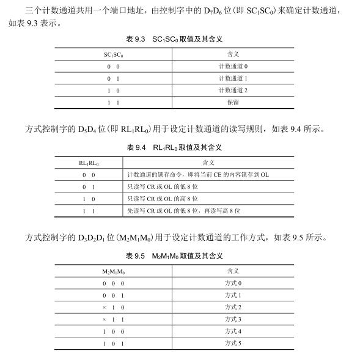

## 8253与系统总线的接口方法

P287

## 8253的应用设计

P300

# 并行接口芯片8255A应用设计

## 8255A的引脚功能及特点

P316

## 8255A的原理结构及工作原理

P316

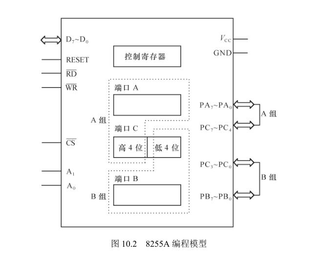

## 8255A的控制字及工作方式

P317

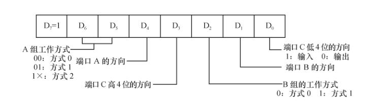

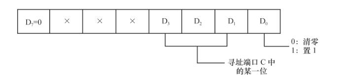

## 8255A与系统总线的接口方法

P323

## 8255A的应用设计

P325
