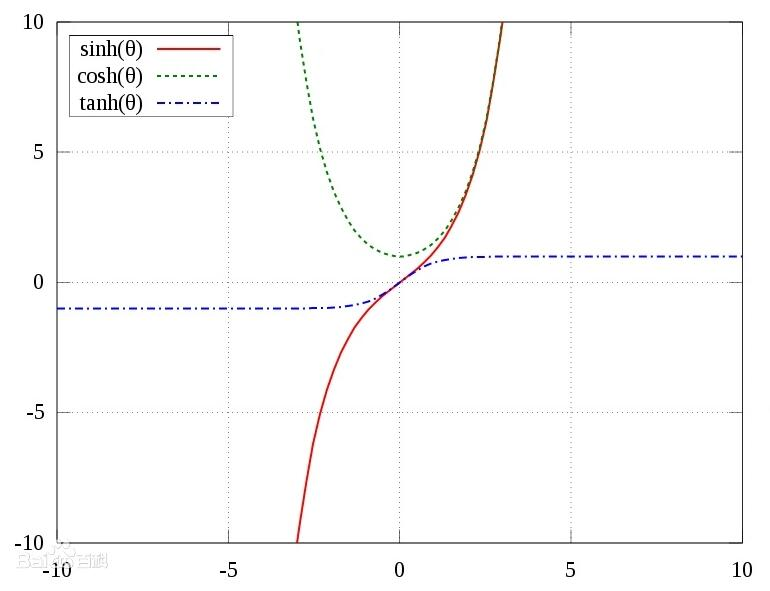
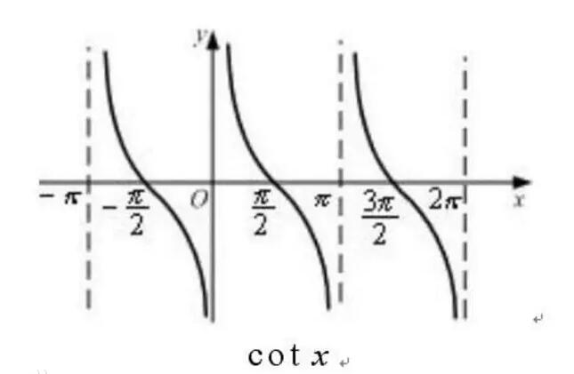
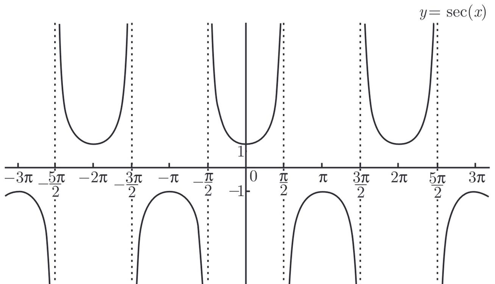
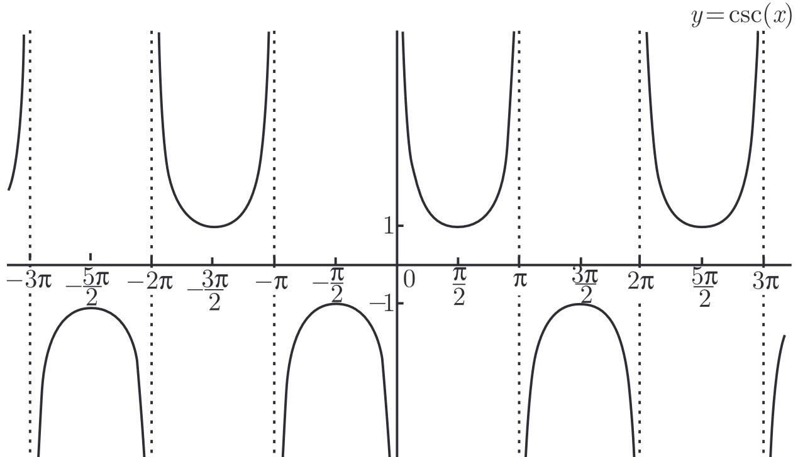
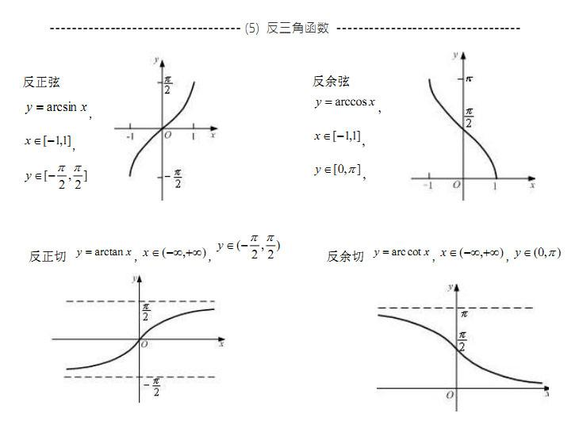

## 函数与极限

### 等价无穷小

当$x\to 0$时，有

$$
sinx\sim x\qquad tanx\sim x\qquad ln(1+x)\sim x\qquad e^x-1\sim x
$$

$$
arcsinx\sim x\qquad arctanx\sim x\qquad log_a(1+x)\sim \frac{x}{lna}
$$

$$
x-ln(1+x)\sim \frac{1}{2}x^2\qquad 1-cosx\sim\frac{1}{2}x^2\qquad ln(x+\sqrt{1+x^2})\sim x
$$

$$
x-sinx\sim \frac{1}{6}x^3\qquad tanx-x\sim \frac{1}{3}x^3\qquad (1+x)^a-1\sim ax
$$

$$
arcsinx-x\sim \frac{1}{6}x^3\qquad x-arctanx\sim\frac{1}{3}x^3\qquad tanx-sinx\sim\frac{1}{2}x^3
$$

### 两个重要极限

$$
\lim_{x\to 0}\frac{sinx}{x}=1
$$

$$
\lim_{x\to \infty}(1+\frac1x)^x=e
$$

### 间断点的分类

#### 第一类间断点

如果$x_0$是函数的间断点，且左极限$f(x_0^-)$及右极限$f(x_0^+)$都存在。

1. 若左极限和右极限相等，但不等于该点函数值或函数在该点无定义，则称为可去间断点。

2. 若左极限右极限不相等，则称为跳跃间断点。

#### 第二类间断点

不是第一类间断点的任何间断点称之为第二类间断点，包含震荡间断点，无穷间断点等。

### 部分函数及其图像

#### 双曲函数

$$
sh\ x=\frac{e^x-e^{-x}}{2}\qquad ch\ x=\frac{e^x+e^{-x}}{2}\qquad th\ 
x=\frac{sh\ x}{ch\ x}=\frac{e^x-e^{-x}}{e^x+e^{-x}}
$$

函数图像如下

其常用公式如下：

$$
sh(x+y)=sh\ xch\ x+ch\ xsh\ y
$$

$$
sh(x-y)=sh\ xch\ x-ch\ xsh\ y
$$

$$
ch(x+y)=ch\ xch\ x+sh\ xsh\ y
$$

$$
ch(x-y)=ch\ xch\ x-sh\ xsh\ y
$$

$$
ch^2x-sh^2x=1\qquad sh\ 2x=2sh\ xch\ x\qquad
ch\ 2x=ch^2x+sh^2x
$$

反双曲函数如下

$$
arsh\ x=ln(x+\sqrt{x^2+1})
$$

$$
arch\ x=ln(x+\sqrt{x^2-1})
$$

$$
arth\ x=\frac{1}{2}ln\frac{1+x}{1-x}
$$

#### 部分三角函数和反三角函数

$cot\ x,sec\ x,csc\ x$的函数图像如下

反三角函数图像如下

### 三角函数公式

#### 和差化积

$$
sin\alpha+sin\beta=2sin\dfrac{\alpha+\beta}{2}\cdot cos\dfrac{\alpha-\beta}{2}
$$
​ 
$$
sin\alpha-sin\beta=2cos\frac{\alpha+\beta}{2}\cdot sin\frac{\alpha-\beta}{2}
$$
​ 
$$
cos\alpha+cos\beta=2cos\frac{\alpha+\beta}{2}\cdot cos\frac{\alpha-\beta}{2}
$$
​ 
$$
cos\alpha-cos\beta=-2sin\frac{\alpha+\beta}{2}\cdot sin\frac{\alpha-\beta}{2}
$$

#### 积化和差

$$
sin\alpha cos\beta=\frac{1}{2}\left[sin(\alpha+\beta)+sin(\alpha-\beta)\right]
$$
​ 
$$
cos\alpha sin\beta=\frac{1}{2}\left[sin(\alpha+\beta)-sin(\alpha-\beta)\right]
$$
​ 
$$
cos\alpha cos\beta=\frac{1}{2}\left[cos(\alpha+\beta)+cos(\alpha-\beta)\right]
$$
​ 
$$
sin\alpha sin\beta=-\frac{1}{2}\left[cos(\alpha+\beta)-cos(\alpha-\beta)\right]
$$

#### 半角公式

$$
sin\frac{\theta}{2}=\pm \sqrt{\frac{1-cos\alpha}{2}}
$$
​ 
$$
sin\frac{\theta}{2}=\pm \sqrt{\frac{1+cos\alpha}{2}}
$$
​ 
$$
tan\frac{\theta}{2}=\pm \sqrt{\frac{1-cos\alpha}{1+cos\alpha}}=\frac{sin\alpha}{1+cos\alpha}=\frac{1-cos\alpha}{sin\alpha}
$$

#### 辅助角公式

$$
asin\theta\pm bcos\theta=\sqrt{a^2+b^2}sin(\theta\pm\varphi),\quad tan\varphi=\frac{b}{a}
$$

#### $sin\ x$和$cos\ x$的$tan\ \frac x2$有理式表示

$$
sin\ x=\frac{2tan\frac x2}{1+tan^2\frac x2}
$$

$$
cos\ x=\frac{1-tan^2\frac x2}{1+tan^2\frac x2}
$$

## 导数与微分

### 反函数求导

如果函数$x=f(y)$在区间$I_y$内单调、可导且$f'(y)\ne 0$，那么它的反函数$y=f^{-1}(x)$在区间$
I_x = \\{ x | x = f(y) , y\in I_y \\}
$内也可导，且

$$
[f^{-1}(x)]'=\frac{1}{f'(y)}\quad or \quad \frac{dy}{dx}=\frac{1}{\frac
{dx}{dy}}
$$

#### 部分常用导数

$$
(tan\ x)'=sec^2x\qquad (cot\ x)'=-csc^2x
$$

$$
(sec\ x)'=sec\ xtan\ x\qquad (csc\ x)'=-csc\ xcot\ x
$$

$$
(a^x)'=a^xlna(a>0,a\ne 1)\qquad (log_ax)'=\frac{1}{xlna}
$$

$$
(arcsin\ x)'=\frac{1}{\sqrt{1-x^2}}\qquad (arccosx)'=-\frac{1}
{\sqrt{1-x^2}}
$$

$$
(arctan\ x)'=\frac{1}{1+x^2}\qquad (arccotx)'=-\frac{1}{1+x^2}
$$

$$
(sh\ x)'=ch\ x,\ (ch\ x)'=sh\ x,\ (th\ x)'=\frac{1}{ch^2x}
$$

$$
(arsh\ x)'=\frac{1}{\sqrt{x^2+1}},\ (arch\ x)'=\frac{1}{\sqrt{x^2-1}},
\ (arth\ x)'=\frac{1}{1-x^2}
$$

#### 参数方程求导

对如下参数方程

$$
x = \varphi (t),\ 
y = \psi (t)
$$

求导得

$$
\frac{dy}{dx}=\frac{dy}{dt}\cdot \frac{1}{\frac{dx}{dt}}=
\frac{\psi'(t)}{\varphi'(t)}
$$

## 中值定理

### 罗尔定理

如果函数$f(x)$满足

（1）在闭区间$[a,b]$上连续

（2）在开区间$(a,b)$内可导

（3）在区间端点处的函数值相等，即$f(a)=f(b)$,

那么在$(a,b)$内至少有一点$\xi\ (a<\xi< b)$，使得$f'(\xi)=0.$

### 拉格朗日中值定理

如果函数$f(x)$满足

（1）在闭区间$[a,b]$上连续；

（2）在开区间$(a,b)$内可导，

那么在$(a,b)$内至少有一点$\xi (a<\xi< b)$，使等式

$$
f(b)-f(a)=f'(\xi)(b-a)
$$

成立

### 柯西中值定理

如果函数$f(x)$及$F(x)$满足

（1）在闭区间$[a,b]$上连续

（2）在开区间$(a,b)$内可导

（3）对任一$x\in(a,b),F'(x)\ne0$

那么在$(a,b)$内至少有一点$\xi$，使等式

$$
\frac{f(b)-f(a)}{F(b)-F(a)}=\frac{f'(x)}{F'(x)}
$$

成立

### 泰勒公式

在$x_0$处展开如下

$$
f(x)=f(x_0)+f'(x_0)(x-x_0)+\frac{f''(x_0)}{2!}(x-x_0)^2+\dots+
\frac{f^{(n)}(x_0)}{n!}(x-x_0)^n+R_n(x)
$$

#### 皮亚诺余项

$$
R_n(x)=o((x-x_0)^n)
$$

#### 拉格朗日余项

$$
R_n(x)=\frac{f^{(n+1)}(\xi)}{(n+1)!}(x-x_0)^{(n+1)}
$$

这里$\xi$是$x_0$与$x$之间的某个值

### 曲率

#### 弧微分公式

$$
ds=\sqrt{1+y'^2}dx
$$

#### 曲率表达式

对于$y=f(x)$，曲率$K$为

$$
K=\frac{|y''|}{(1+y'^2)^{3/2}}
$$

对于$x = \varphi (t),y = \psi (t)$，有

$$
K=\frac{|\varphi'(t)\psi''(t)-\varphi''(t)\psi'(t)|}{[\varphi'^2(t)+
\psi'^2(t)]^{3/2}}
$$

#### 曲率圆与曲率半径

曲率半径与曲率的关系

$$
\rho = \frac{1}{K},\ K=\frac{1}{\rho}
$$

曲率中心$D(\alpha,\beta)$

$$
\alpha = x-\frac{y'(1+y'^2)}{y''},\quad    
\beta = y+\frac{1+y'^2}{y''}
$$

## 不定积分

### 常用积分表

$$
\int\frac{dx}{1+x^2}=arctan\ x+C,\quad \int\frac{dx}{\sqrt{1-x^2}}
=arcsin\ x+C
$$

$$
\int\frac{dx}{cos^2x}=\int{sec^2x}dx=tan\ x+C,\quad\int\frac{dx}{sin^2x}=
\int csc^2xdx=-cot\ x+C
$$

$$
\int sec\ xtan\ xdx=sec\ x+C,\quad \int csc\ xcot\ xdx=-csc\ x+C
$$

$$
\int sh\ xdx=ch\ x+C,\quad \int ch\ xdx=sh\ x+C
$$

$$
\int tan\ xdx=-ln|cos\ x|+C,\quad
\int cot\ xdx=ln|sin\ x|+C
$$

$$
\int sec\ xdx=ln|sec\ x+tan\ x|+C,\quad
\int csc\ xdx=ln|csc\ x-cot\ x|+C
$$

$$
\int \frac{dx}{a^2+x^2}=\frac{1}{a}arctan\frac{x}{a}+C,\quad
\int \frac{dx}{x^2-a^2}=\frac{1}{2a}ln\left |\frac{x-a}{x+a}\right |+C
$$

$$
\int \frac{dx}{\sqrt{a^2-x^2}}=arcsin\frac xa+C,\quad
\int \frac{dx}{\sqrt{x^2+a^2}}=ln(x+\sqrt{x^2+a^2})+C
$$

$$
\int \frac{dx}{\sqrt{x^2-a^2}}=ln|x+\sqrt{x^2-a^2}|+C
$$

### 换元积分法

#### 第一类换元法

设$f(u)$具有原函数，$u=\varphi(x)$可导，则有换元公式

$$
\int f[\varphi(x)]\varphi'(x)dx=\left[\int f(u)du \right]_{u=\varphi(x)}
$$

设要求$\int g(x)dx$，如果$g(x)$可以化为$g(x)=f[\varphi(x)]\varphi'(x)$的形式，那么

$$
\int g(x)dx=
\int f[\varphi(x)]\varphi'(x)dx=\left[\int f(u)du \right]_{u=\varphi(x)}
$$

#### 第二类换元法

设$x=\psi(t)$是单调的可导函数，并且$\psi'(t)\ne 0$.又设$f[\psi(x)]\psi'(x)dx$具有原函数 ，则有换元公式

$$
\int f(x)dx=
\left[\int f[\psi(t)]\psi'(t)dt\right]_{t=\psi^{-1}(x)}
$$

### 分部积分法

设函数$u=u(x)$及$v=v(x)$具有连续导数，则有

$$
\int uv'dx=uv-\int u'vdx
$$

## 定积分

### 积分上限的函数的导数

若

$$
\Phi(x)=\int_{a}^{x}f(t)dt
$$

则

$$
\Phi'(x)=f(x)
$$

若

$$
\Phi(x)=\int_{a}^{g(x)}f(t)dt
$$

则

$$
\Phi'(x)=f(g(x))g'(x)
$$

### 定积分在几何学上的应用

#### 平面图形的面积

##### 直角坐标

例如，以$x$为积分变量，求$f(x)$及直线$x=a$, $x=b$与$x$轴围成的曲边梯形的面积

$$
A=\int_a^bf(x)dx
$$

以y为积分变量，则求的是两直线、函数、与$y$轴围成的曲边梯形的面积

##### 极坐标

$$
dA=\frac12(\rho(\theta))^2d\theta
$$

$$
A=\int_\alpha^\beta\frac12[\rho(\theta)]^2d\theta
$$

#### 体积

##### 旋转体的体积

$$
V=\int_a^b\pi[f(x)]^2dx
$$

##### 平行截面面积为已知的立体的体积

$$
V=\int_a^bA(x)dx
$$

#### 平面曲线的弧长

##### 参数方程

$x=\varphi(t),\quad y=\psi(t).\quad(\alpha\leq t\leq\beta)$

$$
s=\int_\alpha^\beta\sqrt{\varphi'^2(t)+\psi'^2(t)}dt
$$

##### 直角坐标

$$
s=\int_a^b\sqrt{1+y'^2}dx
$$

##### 极坐标

$$
s=\int_\alpha^\beta\sqrt{\rho^2(\theta)+\rho'^2(\theta)}d\theta
$$

## 微分方程

### 齐次方程

如果一阶微分方程可化成

$$
\frac{dy}{dx}=\varphi\left(\frac yx\right)
$$

的形式，那么就称这方程为齐次方程。在齐次方程中，引入新的未知函数$u=\frac{y}{x}$，有

$$
y=ux,\ \frac{dy}{dx}=u+x\frac{du}{dx}
$$

$$
u+x\frac{du}{dx}=\varphi(u)
$$

用分离变量的办法求出关于$u$的积分，最后再以$\frac yx$代替$u$.

### 一阶线性微分方程

1. 方法一

方程

$$
\frac{dy}{dx}+P(x)y=Q(x)
$$

的通解为

$$
y=Ce^{-\int P(x)dx}+e^{-\int P(x)dx}\int Q(x)e^{\int P(x)dx}dx
$$

2. 方法二

先求对应齐次方程

$$
\frac{dy}{dx}+P(x)y=0
$$

的解，得到

$$
y=Ce^{-\int P(x)dx}
$$

将$C$替换为$u$，再对上解求导得$\frac{dy}{dx}$，将其代入原非齐次方程，解出$u$，则

$$
y=ue^{-\int P(x)dx}
$$

### 可降阶的高阶微分方程

1. $y''=f(x,y')$型的微分方程
   
   设$y'=p$则$y''=\frac{dp}{dx}=p'$，代入原方程中求解$p$，再求解$y$

2. $y''=f(y,y')$型的微分方程
   
   设$y'=p$
   
   $$
   y''=\frac{dp}{dx}=\frac{dp}{dy}\cdot\frac{dy}{dx}=p\frac{dp}{dy}
   $$
   
    代入原方程中求解$p$，再求解$y$

### 高阶线性微分方程

#### 定理1

如果函数$y_1(x)$与$y_2(x)$是方程

$$
y''+P(x)y'+Q(x)y=0
$$

的两个特解，那么

$$
y=C_1y_1(x)+C_2y_2(x)
$$

也是方程的解

#### 定理2

如果函数$y_1(x)$与$y_2(x)$是方程的两个线性无关的特解，那么

$$
y=C_1y_1(x)+C_2y_2(x)
$$

就是 方程的通解

#### 定理3

设$y^*(x)$是方程

$$
y''+P(x)y'+Q(x)y=f(x)
$$

的一个特解，$Y(x)$是该方程对应的齐次方程的通解，则

$$
y=Y(x)+y^*(x)
$$

是该非齐次方程的通解

#### 定理4

设定理三种的非齐次线性方程的右端$f(x)$是两个函数之和，即

$$
y''+P(x)y'+Q(x)y=f_1(x)+f_2(x)
$$

而$y_1^* (x)$与$y_2^*(x)$分别是方程

$$
y''+P(x)y'+Q(x)y=f_1(x)
$$

与

$$
y''+P(x)y'+Q(x)y=f_2(x)
$$

的特解，则$y_1^*(x)+y_2^ *(x)$就是原方程的特解

### 常系数齐次线性微分方程

#### 二阶形式如下

$$
y''+py'+qy=0
$$

先求解如下方程

$$
r^2+pr+q=0
$$

分为三种情况

1. 有两个不等实根$r_1,r_2$
   
   则通解为
   
   $$
   y=C_1e^{r_1x}+C_2e^{r_2x}
   $$

2. 有两个相等实根$r_{1,2}$
   
   则通解为
   
   $$
   y=(C_1+C_2x)e^{r_1x}
   $$

3. 有一对共轭复根
   
   $$
   r_1=\alpha+\beta i,\quad r_2=\alpha-\beta i
   $$
   
   $$
   \alpha=-\frac{p}{2},\quad \beta=\frac{\sqrt{4q-p^2}}{2}
   $$
   
   则通解为
   
   $$
   y=e^{\alpha x}(C_1cos\ \beta x+C_2sin\ \beta x)
   $$

#### n阶形式如下

$$
y^{(n)}+p_1y^{(n-1)}+p_2y^{(n-2)}+\dots+p_{n-1}y'+p_ny=0
$$

其中$p_1\dots p_n$都是常数。

其特征方程如下

$$
r^n+p_1r^{n-1}+\dots+p_{n-1}r+p_n=0
$$

分四种情况

1. 单实根$r$，给出一项：$Ce^{rx}$

2. 一对单复根$r_{1,2}=\alpha\pm\beta i$，给出两项：$e^{\alpha x}(C_1cos\beta x+C_2sin\beta x)$

3. k重实根r，给出$k$项：$e^{rx}(C_1+C_2x+\dots+C_kx^{k-1})$

4. 一对k重复根$r_{1,2}=\alpha\pm\beta i$，给出$2k$项：$e^{\alpha x}[(C_1+C_2x+\dots+C_kx^{k-1})cos\beta x+(D_1+D_2x+\dots+D_kx^{k-1})sin\beta x]$

### 常系数非齐次线性微分方程

二阶常系数非齐次线性微分方程的一般形式是

$$
y''+py'+qy=f(x)
$$

求其通解只用求该方程的一个特解和上一节学到的求其对应齐次方程的通解，高数上册只介绍了$f(x)$的两种形式

1. $f(x)=e^{\lambda x}P_m(x)$，其中$\lambda$是常数，$P_m(x)$是$x$的一个$m$次多项式
   
   $$
   P_m(x)=a_0x^m+a_1x^{m-1}+\dots+a_{m-1}x+a_{m}
   $$

2. $f(x)=e^{\lambda x}[P_l(x)cos\omega x+Q_n(x)sin\omega x]$，其中$\lambda,\omega$是常数，$\omega\ne0$，$P_l(x),Q_n(x)$分别是$x$的$l$次、$n$次多项式，且仅有一个可为零.

#### $f(x)=e^{\lambda x}P_m(x)$型

$$
y^*=x^kR_m(x)e^{\lambda x}
$$

其中 $R_m(x)$是与$P_m(x)$同次的多项式，而$k$按$\lambda$不是特征方程(即$r^2+pr+q=0$)的根，是特征方程的单根或是特征方程的重根依次取值为0,1,2.

其中$R_m(x)$中的每一个系数，应当代入原方程中进行计算。

#### $f(x)=e^{\lambda x}[P_l(x)cos\omega x+Q_n(x)sin\omega x]$型

$$
y^*=x^ke^{\lambda x}[R^{(1)}_m(x)cos\omega x+R^{(2)}_m(x)sin\omega x]
$$

其中$R^{(1)}_m(x)$、$R^{(2)}_m(x)$是$m$次多项式，$m=max\\{l,n\\}$，而$k$按$\lambda+\omega i$(或$\lambda-\omega i$)不是特征方程的根、或是特征方程的单根依次取0或1
