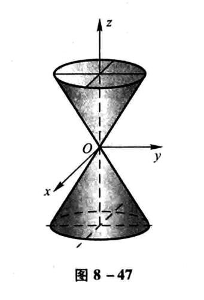
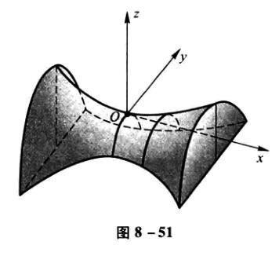

## 向量代数与空间解析几何

### 方向角与方向余弦

非零向量$\bold{r}$与三条坐标轴的夹角$\alpha$、$\beta$、$\gamma$称为向量$\bold{r}$的方向角。设$\overrightarrow{OM}=\bold{r}=(x,y,z)$，则有

$$
(cos\alpha,cos\beta,cos\gamma)=\left(\frac{x}{|\bold{r}|},\frac{y}{|\bold{r}|},\frac{z}{|\bold{r}|}\right)=\frac{1}{|\bold{r}|}(x,y,z)=\frac{\bold{r}}{|\bold{r}|}=\bold{e}
$$

$cos\alpha,cos\beta,cos\gamma$称为向量$\bold{r}$的方向余弦。并且有

$$
cos^2\alpha+cos^2\beta+cos^2\gamma = 1
$$

### 数量积的运算规律

1. 交换律 $\bold{a}\cdot\bold{b}=\bold{b}\cdot\bold{a}$

2. 分配律 $(\bold{a+b})\cdot \bold{c}=\bold{a\cdot c+b\cdot c}$

3. 如下的结合律 $(\lambda \bold{a})\cdot\bold{b}=\lambda(\bold{a\cdot b})$,$\lambda$为数

### 向量积的运算规律

1. $\bold{b\times a=-a\times b}$

2. 分配律 $\bold{(a+b)\times c=a\times c+b\times c}$

3. 如下的结合律 $(\lambda \bold{a})\times \bold{b}=\lambda(\bold{a\times b})$,$\lambda$为数

### 平面的点法式方程

当平面$\Pi$上一点$M_0(x_0,y_0,z_0)$和它的一个法线向量$\bold{n}=(A,B,C)$已知时，有平面的点法式方程：

$$
A(x-x_0)+B(y-y_0)+C(z-z_0)=0
$$

### 平面的一般方程

$$
Ax+By+Cz+D=0
$$

其中这个平面的法向量为$\bold{n}=(A,B,C)$

### 平面的截距式方程

$$
\frac{x}{a}+\frac{y}{b}+\frac{z}{c}=1
$$

其中$a,b,c$分别为$x,y,z$轴上的截距

### 两平面夹角

$$
cos\theta=\frac{|A_1A_2+B_1B_2+C_1C_2|}{\sqrt{A_1^2+B_1^2+C_1^2}\sqrt{A_2^2+B_2^2+C_2^2}}
$$

### 点到平面距离公式

点$P_0(x_0,y_0,z_0)$到平面$Ax+By+Cz+D=0$的距离公式

$$
d=\frac{|Ax_0+By_0+Cz_0+D|}{\sqrt{A^2+B^2+C^2}}
$$

### 空间直线的一般方程

$$
A_1x+B_1y+C_1z+D_1=0
$$

$$
A_2x+B_2y+C_2z+D_2=0
$$

即两个平面的交线（大括号hugo支持不好，打不出来，后同）

另外两个平面的法向量的向量积可以算出直线的切向量

### 平面束方程

由上述空间直线方程可知，通过这一直线的平面还有

$$
\lambda(A_1x+B_1y+C_1z+D_1)+\mu(A_2x+B_2y+C_2z+D_2)=0
$$

其中$\lambda=1$时

$$
(A_1x+B_1y+C_1z+D_1)+\mu(A_2x+B_2y+C_2z+D_2)=0
$$

表示除了$A_2x+B_2y+C_2z+D_2=0$，之外的过直线的平面束。

### 空间直线的对称式方程(点向式方程)

若已知直线过一点$M_0(x_0, y_0, z_0)$和它的一个方向向量$\bold{s}=(m,n,p)$。则有方程

$$
\frac{x-x_0}{m}=\frac{y-y_0}{n}=\frac{z-z_0}{p}
$$

### 空间直线的参数方程

若设

$$
\frac{x-x_0}{m}=\frac{y-y_0}{n}=\frac{z-z_0}{p}=t
$$

则有

$$
x=x_0+mt 
$$

$$
y=y_0+nt
$$

$$
z=z_0+pt
$$

### 两直线的夹角

设两直线方向向量分别为$\bold{s_1}=(m_1,n_1,p_1)$和$\bold{s_2}=(m_2,n_2,p_2)$

$$
cos\varphi = \frac{|m_1m_2+n_1n_2+p_1p_2|}{\sqrt{m_1^2+n_1^2+p_1^2}\sqrt{m_2^2+n_2^2+p_2^2}}
$$

### 直线与平面的夹角

设直线方向向量和平面法向量分别为$\bold{s}=(m,n,p)$和$\bold{n}=(A,B,C)$

$$
sin\varphi = \frac{|Am+Bn+Cp|}{\sqrt{A^2+B^2+C^2}\sqrt{m^2+n^2+p^2}}
$$

### 旋转曲面

设在$yOz$坐标面上有一已知曲线$f(y,z)=0$

则把这个曲线绕z轴旋转一周，得到的曲面为$f(\pm\sqrt{x^2+y^2},z)=0$

绕y轴旋转则为$f(y,\pm\sqrt{x^2+z^2})=0$

在其他坐标面上的曲线类似。

### 二次曲面举例

#### 椭圆锥面

$$
\frac{x^2}{a^2}+\frac{y^2}{b^2}=z^2
$$

#### 椭球面

$$
\frac{x^2}{a^2}+\frac{y^2}{b^2}+\frac{z^2}{c^2}=1
$$

#### 单叶双曲面

$$
\frac{x^2}{a^2}+\frac{y^2}{b^2}-\frac{z^2}{c^2}=1
$$

#### 双叶双曲面

$$
\frac{x^2}{a^2}-\frac{y^2}{b^2}-\frac{z^2}{c^2}=1
$$

#### 椭圆抛物面

$$
\frac{x^2}{a^2}+\frac{y^2}{b^2}=z
$$

#### 双曲抛物面

$$
\frac{x^2}{a^2}-\frac{y^2}{b^2}=z
$$

### 空间曲线及其方程

#### 一般方程

即两个曲面的交线

$$
F(x,y,z) = 0
$$

$$
G(x,y,z) = 0
$$

#### 参数方程

$$
x=x(t)
$$

$$
y=y(t)
$$

$$
z=z(t)
$$

## 多元函数微分法及其应用

### 多元函数的极限

注意极限存在，当且仅当从各个方向趋近那个点时得到的值存在并相等。

例如$f(x,y)=\frac{xy}{x^2+y^2},x^2+y^2\neq 0;f(x,y)=0,x^2+y^2=0$，有沿x轴y轴趋近$(0,0)$极限都为0，但沿直线$y=kx$趋近时极限随$k$变化。故极限不存在。

### 偏导数

注意有时利用定义求解偏导数会更优

例如关于$x$的偏导数

$$
\lim_{\Delta x \to 0}\frac{f(x_0+\Delta x,y_0)-f(x_0,y_0)}{\Delta x} 
$$

在如$x_0=0,y_0=0$或者其他性质比较好的点，会更容易求。

### 高阶偏导数

1. 注意分母上，求导顺序为从左到右。

2. 如果函数$z=f(x,y)$的两个二阶混合偏导数$\frac{\partial^2z}{\partial y\partial x}$及$\frac{\partial^2z}{\partial x\partial y}$在区域$D$内连续，那么在该区域内这两个二阶混合偏导数必相等。

### 全微分

#### 必要条件

如果函数$z=f(x,y)$在点$(x,y)$可微分（蕴含着函数在该点上连续），那么该函数在点$(x,y)$的偏导数$\frac{\partial z}{\partial x}$与$\frac{\partial z}{\partial y}$必定存在，且该函数在该点的全微分为

$$
dz=\frac{\partial z}{\partial x}\Delta x+\frac{\partial z}{\partial y}\Delta y
$$

但这只是必要条件。

形式上的全微分$\Delta z$(和上文的$dz$一个意思)应该满足

$$
\frac{\Delta z-[f_x(x_0,y_0)\cdot\Delta x+f_y(x_0,y_0)\cdot\Delta y]}{\rho}
$$

随着$\rho\to0$而趋于$0$。

其中

$$
\rho=\sqrt{(\Delta x)^2+(\Delta y)^2}
$$

才能可微。

#### 充分条件

如果函数$z=f(x,y)$的偏导数$\frac{\partial z}{\partial x}$、$\frac{\partial z}{\partial y}$在$(x,y)$连续，那么该函数在该点可微分。

### 多元复合函数的求导法则

#### 一元函数与多元函数复合的情形

如果函数$u=\varphi(t)$及$v=\psi(t)$都在点$t$可导，函数$z=f(u,v)$在对应点$(u,v)$具有连续偏导数，那么复合函数$z=f[\varphi(t),\psi(t)]$在t可导，且有

$$
\frac{dz}{dt}=\frac{\partial z}{\partial u}\frac{du}{dt}+\frac{\partial z}{\partial v}\frac{dv}{dt}
$$

#### 多元函数与多元函数复合的情形

$$
u=\varphi(x,y),v=\psi(x,y),z=f(u,v)
$$

若都在对应点$(x,y)$具有连续偏导数，则

$$
\frac{\partial z}{\partial x}=\frac{\partial z}{\partial u}\frac{\partial u}{\partial x}+\frac{\partial z}{\partial v}\frac{\partial v}{\partial x}
$$

$$
\frac{\partial z}{\partial y}=\frac{\partial z}{\partial u}\frac{\partial u}{\partial y}+\frac{\partial z}{\partial v}\frac{\partial v}{\partial y}
$$

#### 混合复合

根据每个复合函数是否含有自变量$x,y$进行偏导，例如

$$
u=\varphi(x,y),v=\psi(y),z=f(u,v)
$$

则

$$
\frac{\partial z}{\partial x}=\frac{\partial z}{\partial u}\frac{\partial u}{\partial x}
$$

$$
\frac{\partial z}{\partial y}=\frac{\partial z}{\partial u}\frac{\partial u}{\partial y}+\frac{\partial z}{\partial v}\frac{d v}{d y}
$$

如果有两层复合函数，则要求导至将$x,y$这样的自变量暴露出来。

#### 全微分形式的不变性

设函数$z=f(u,v)$具有连续偏导数，则有全微分

$$
dz=\frac{\partial z}{\partial u}du+\frac{\partial z}{\partial v}dv
$$

若有$u=\varphi(x,y),v=\psi(x,y)$，有

$$
dz=\frac{\partial z}{\partial x}dx+\frac{\partial z}{\partial y}dy
$$

显然可以算出$\frac{\partial z}{\partial x},\frac{\partial z}{\partial y}$，代入有

$$
dz=\frac{\partial z}{\partial u}du+\frac{\partial z}{\partial v}dv
$$

此为全微分形式的不变性。

### 隐函数的求导公式

#### 一个方程的情形

$$
F(x,y)=0
$$

$$
\frac{dy}{dx}=-\frac{F_x}{F_y}
$$

条件：F在某点的某一邻域内具有连续偏导数，$F_y$在该点不为0

$$
F(x,y,z)=0
$$

$$
\frac{\partial z}{\partial x}=-\frac{F_x}{F_z},\frac{\partial z}{\partial y}=-\frac{F_y}{F_z}
$$

条件类似于上条。

#### 方程组的情形

考虑如下方程组

$$
F(x,y,u,v)=0\\
G(x,y,u,v)=0
$$

一般四个变量只能有两个变量独立变化

即

$$
u(x,y),v(x,y)
$$

两边应用求导法则得

$$
F_x+F_u\frac{\partial u}{\partial x}+F_v\frac{\partial v}{\partial x}=0
$$

$$
G_x+G_u\frac{\partial u}{\partial x}+G_v\frac{\partial v}{\partial x}=0
$$

解方程求出偏导数，求关于$y$的偏导数同理。

### 多元函数积分学的几何应用

#### 一元向量值函数及其导数

空间曲线$\Gamma$的参数方程为

$$
x=\varphi(t),
$$

$$
y=\psi(t),t\in[\alpha,\beta]
$$

$$
z=\omega(t)
$$

写成向量形式，则为

$$
\bold{r}=x\bold{i}+y\bold{j}+z\bold{k}
$$

$$
\bold{f}(t)=\varphi(t)\bold{i}+\psi(t)\bold{j}+\omega(t)\bold{k}
$$

所以有$\bold{r=f}(t)$,$\bold{r}$称为向量函数

向量值导数如下：

$$
\bold{f}'(t_0)=\lim_{\Delta t\to 0}\frac{\Delta \bold{r}}{\Delta t}
=\lim_{\Delta t\to 0}\frac{\bold{f}(t_0+\Delta t)-\bold{f}(t_0)}{\Delta t}
$$

或者如下计算：

$$
\bold{f}'(t_0)=\bold{f_1}'(t_0)\bold{i}+\bold{f_2}'(t_0)\bold j+
\bold{f_3}'(t_0)\bold k
$$

#### 空间曲线的切线与法平面

还是上面那个曲线$\Gamma$，则切线方程为

$$
\frac{x-x_0}{\varphi'(t_0)}=
\frac{y-y_0}{\psi'(t_0)}=
\frac{z-z_0}{\omega'(t_0)}
$$

法平面方程为

$$
\varphi'(t_0)(x-x_0)+
\psi'(t_0)(y-y_0)+
\omega'(t_0)(z-z_0)=0
$$

若$\Gamma$变为

$$
x=x
$$

$$
y=\varphi(x)
$$

$$
z=\psi(x)
$$

则切线方程变为

$$
\frac{x-x_0}{1}=
\frac{y-y_0}{\varphi'(x_0)}=
\frac{z-z_0}{\psi'(x_0)}
$$

法平面方程变为

$$
(x-x_0)+
\varphi'(x_0)(y-y_0)+
\psi'(x_0)(z-z_0)=0
$$

曲线为方程组情形时（三个变量一般只有一个自由变量，所以直接将$y,z$替换为$\varphi(x),\psi(x)$）

$$
F[x,\varphi(x),\psi(x)]=0
$$

$$
G[x,\varphi(x),\psi(x)]=0
$$

两边求对$x$的全导数

$$
\frac{\partial F}{\partial x}+\frac{\partial F}{\partial y}
\frac{dy}{dx}+\frac{\partial F}{\partial z}\frac{dz}{dx}=0
$$

$$
\frac{\partial G}{\partial x}+\frac{\partial G}{\partial y}
\frac{dy}{dx}+\frac{\partial G}{\partial z}\frac{dz}{dx}=0
$$

解出$\bold{T}=(1,\frac{dy}{dx},\frac{dz}{dx})$，即$\bold{T}=(1,\varphi'(x_0),\psi'(x_0))$，就是在此点的切向量，代入可知切线与法平面方程

#### 曲面的切平面与法线

若曲面由$F(x,y,z)=0$隐性给出，则在点$M(x_0,y_0,z_0)$切平面方程为

$$
F_x(x-x_0)+F_y(y-y_0)+F_z(z-z_0)=0
$$

其中各个偏导数都是在M点的偏导数，法线方程如下

$$
\frac{x-x_0}{F_x}=\frac{y-y_0}{F_y}=\frac{z-z_0}{F_z}
$$

考虑曲面方程为$z=f(x,y)$，则可令$F(x,y,z)=f(x,y)-z$

显然有

$$
F_x(x,y,z)=f_x(x,y),F_y(x,y,z)=f_y(x,y),F_z(x,y,z)=-1
$$

切平面、法线方程类似于上。

### 方向导数与梯度

方向导数：

$$
\frac{\partial f}{\partial l}\bigg|_{(x_0,y_0)}=
\lim _{t\to 0^+}\frac{f(x_0+tcos\alpha,y_0+tcos\beta)-f(x_0,y_0)}{t}
$$

如果函数$f(x,y)$在点$P_0(x_0,y_0)$可微分，那么函数在该点沿任一方向$l$的方向导数存在，且有

$$
\frac{\partial f}{\partial l}\bigg|_{(x_0,y_0)}=
f_x(x_0,y_0)cos\alpha+f_y(x_0,y_0)cos\beta
$$

其中$cos\alpha,cos\beta$是方向$l$的方向余弦。

梯度：

$$
\bold{grad}f(x_0,y_0)=\nabla f(x_0,y_0)=f_x(x_0,y_0)\bold{i}+
f_y(x_0,y_0)\bold{j}
$$

如果方向导数存在，则

$$
\frac{\partial f}{\partial l}\bigg|_{(x_0,y_0)}=
f_x(x_0,y_0)cos\alpha+f_y(x_0,y_0)cos\beta
=\nabla f(x_0,y_0)\cdot \bold{e}_l=|\nabla f|cos\theta
$$

其中

$$
\theta=<\nabla f,\bold{e}_l>
$$

### 多元函数的极值及其求法

#### 必要条件

设函数$z=f(x,y)$在点$(x_0,y_0)$具有偏导数，且在点$(x_0,y_0)$处有极值，则有

$$
f_x(x_0,y_0)=0,f_y(x_0,y_0)=0
$$

#### 充分条件

设函数$z=f(x,y)$在点$(x_0,y_0)$的某领域内连续且有一阶和二阶连续偏导数，又$f_x(x_0,y_0)=0,f_y(x_0,y_0)=0$，令

$$
f_{xx}(x_0,y_0)=A,f_{xy}(x_0,y_0)=B,f_{yy}(x_0,y_0)=C
$$

若

1. $AC-B^2>0$时具有极值，$A<0$时有极大值，$A>0$时有极小值；

2. $AC-B^2<0$时没有极值

3. $AC-B^2=0$时可能有也可能没有，需要另作讨论。

#### 拉格朗日乘数法

要找函数$z=f(x,y)$在附加条件$\varphi(x,y)=0$下的可能极值点，先设

$$
L(x,y)=f(x,y)+\lambda\varphi(x,y)
$$

令

$$
L_x=f_x+\lambda\varphi_x=0
$$

$$
L_y=f_y+\lambda\varphi_y=0
$$

$$
L_{\lambda}=\varphi=0
$$

解出$x,y,\lambda$，代入函数$f$中求得可能的极值点。

多个条件时，如多加一个$\psi(x,y)=0$，则设方程

$$
L(x,y)=f(x,y)+\lambda\varphi(x,y)+\mu\psi(x,y)
$$

分别求$L_x=0,L_y=0,L_\lambda=0,L\mu=0$，代入原函数中求可能的极值点。
