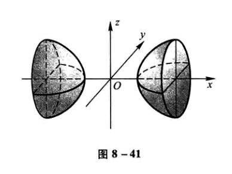
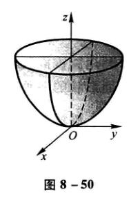

## 向量代数与空间解析几何

### 方向角与方向余弦

非零向量$\bold{r}$与三条坐标轴的夹角$\alpha$、$\beta$、$\gamma$称为向量$\bold{r}$的方向角。设$\overrightarrow{OM}=\bold{r}=(x,y,z)$，则有

$$
(cos\alpha,cos\beta,cos\gamma)=\left(\frac{x}{|\bold{r}|},\frac{y}{|\bold{r}|},\frac{z}{|\bold{r}|}\right)=\frac{1}{|\bold{r}|}(x,y,z)=\frac{\bold{r}}{|\bold{r}|}=\bold{e}
$$

$cos\alpha,cos\beta,cos\gamma$称为向量$\bold{r}$的方向余弦。并且有

$$
cos^2\alpha+cos^2\beta+cos^2\gamma = 1
$$

### 数量积的运算规律

1. 交换律 $\bold{a}\cdot\bold{b}=\bold{b}\cdot\bold{a}$

2. 分配律 $(\bold{a+b})\cdot \bold{c}=\bold{a\cdot c+b\cdot c}$

3. 如下的结合律 $(\lambda \bold{a})\cdot\bold{b}=\lambda(\bold{a\cdot b})$,$\lambda$为数

### 向量积的运算规律

1. $\bold{b\times a=-a\times b}$

2. 分配律 $\bold{(a+b)\times c=a\times c+b\times c}$

3. 如下的结合律 $(\lambda \bold{a})\times \bold{b}=\lambda(\bold{a\times b})$,$\lambda$为数

### 平面的点法式方程

当平面$\Pi$上一点$M_0(x_0,y_0,z_0)$和它的一个法线向量$\bold{n}=(A,B,C)$已知时，有平面的点法式方程：

$$
A(x-x_0)+B(y-y_0)+C(z-z_0)=0
$$

### 平面的一般方程

$$
Ax+By+Cz+D=0
$$

其中这个平面的法向量为$\bold{n}=(A,B,C)$

### 平面的截距式方程

$$
\frac{x}{a}+\frac{y}{b}+\frac{z}{c}=1
$$

其中$a,b,c$分别为$x,y,z$轴上的截距

### 两平面夹角

$$
cos\theta=\frac{|A_1A_2+B_1B_2+C_1C_2|}{\sqrt{A_1^2+B_1^2+C_1^2}\sqrt{A_2^2+B_2^2+C_2^2}}
$$

### 点到平面距离公式

点$P_0(x_0,y_0,z_0)$到平面$Ax+By+Cz+D=0$的距离公式

$$
d=\frac{|Ax_0+By_0+Cz_0+D|}{\sqrt{A^2+B^2+C^2}}
$$

### 空间直线的一般方程

$$
\left\{\begin{matrix}
A_1x+B_1y+C_1z+D_1=0 \\
A_2x+B_2y+C_2z+D_2=0
\end{matrix}\right.
$$

即两个平面的交线

另外两个平面的法向量的向量积可以算出直线的切向量

### 平面束方程

由上述空间直线方程可知，通过这一直线的平面还有

$$
\lambda(A_1x+B_1y+C_1z+D_1)+\mu(A_2x+B_2y+C_2z+D_2)=0
$$

其中$\lambda=1$时

$$
(A_1x+B_1y+C_1z+D_1)+\mu(A_2x+B_2y+C_2z+D_2)=0
$$

表示除了$A_2x+B_2y+C_2z+D_2=0$，之外的过直线的平面束。

### 空间直线的对称式方程(点向式方程)

若已知直线过一点$M_0(x_0, y_0, z_0)$和它的一个方向向量$\bold{s}=(m,n,p)$。则有方程

$$
\frac{x-x_0}{m}=\frac{y-y_0}{n}=\frac{z-z_0}{p}
$$

### 空间直线的参数方程

若设

$$
\frac{x-x_0}{m}=\frac{y-y_0}{n}=\frac{z-z_0}{p}=t
$$

则有

$$
\left\{\begin{matrix}
x=x_0+mt \\
y=y_0+nt \\
z=z_0+pt
\end{matrix}\right.
$$

### 两直线的夹角

设两直线方向向量分别为$\bold{s_1}=(m_1,n_1,p_1)$和$\bold{s_2}=(m_2,n_2,p_2)$

$$
cos\varphi = \frac{|m_1m_2+n_1n_2+p_1p_2|}{\sqrt{m_1^2+n_1^2+p_1^2}\sqrt{m_2^2+n_2^2+p_2^2}}
$$

### 直线与平面的夹角

设直线方向向量和平面法向量分别为$\bold{s}=(m,n,p)$和$\bold{n}=(A,B,C)$

$$
sin\varphi = \frac{|Am+Bn+Cp|}{\sqrt{A^2+B^2+C^2}\sqrt{m^2+n^2+p^2}}
$$

### 旋转曲面

设在$yOz$坐标面上有一已知曲线$f(y,z)=0$

则把这个曲线绕z轴旋转一周，得到的曲面为$f(\pm\sqrt{x^2+y^2},z)=0$

绕y轴旋转则为$f(y,\pm\sqrt{x^2+z^2})=0$

在其他坐标面上的曲线类似。

### 二次曲面举例

#### 椭圆锥面

$$
\frac{x^2}{a^2}+\frac{y^2}{b^2}=z^2
$$

#### 椭球面

$$
\frac{x^2}{a^2}+\frac{y^2}{b^2}+\frac{z^2}{c^2}=1
$$

#### 单叶双曲面

$$
\frac{x^2}{a^2}+\frac{y^2}{b^2}-\frac{z^2}{c^2}=1
$$

#### 双叶双曲面

$$
\frac{x^2}{a^2}-\frac{y^2}{b^2}-\frac{z^2}{c^2}=1
$$

#### 椭圆抛物面

$$
\frac{x^2}{a^2}+\frac{y^2}{b^2}=z
$$

#### 双曲抛物面

$$
\frac{x^2}{a^2}-\frac{y^2}{b^2}=z
$$

