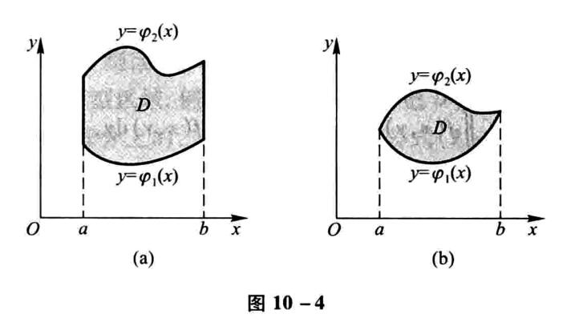

[TOC]

## 向量代数与空间解析几何

### 方向角与方向余弦

非零向量$\bold{r}$与三条坐标轴的夹角$\alpha$、$\beta$、$\gamma$称为向量$\bold{r}$的方向角。设$\overrightarrow{OM}=\bold{r}=(x,y,z)$，则有

$$
(cos\alpha,cos\beta,cos\gamma)=\left(\frac{x}{|\bold{r}|},\frac{y}{|\bold{r}|},\frac{z}{|\bold{r}|}\right)=\frac{1}{|\bold{r}|}(x,y,z)=\frac{\bold{r}}{|\bold{r}|}=\bold{e}
$$

$cos\alpha,cos\beta,cos\gamma$称为向量$\bold{r}$的方向余弦。并且有

$$
cos^2\alpha+cos^2\beta+cos^2\gamma = 1
$$

### 数量积的运算规律

1. 交换律 $\bold{a}\cdot\bold{b}=\bold{b}\cdot\bold{a}$

2. 分配律 $(\bold{a+b})\cdot \bold{c}=\bold{a\cdot c+b\cdot c}$

3. 如下的结合律 $(\lambda \bold{a})\cdot\bold{b}=\lambda(\bold{a\cdot b})$，$\lambda$为数

### 向量积的运算规律

1. $\bold{b\times a=-a\times b}$

2. 分配律 $\bold{(a+b)\times c=a\times c+b\times c}$

3. 如下的结合律 $(\lambda \bold{a})\times \bold{b}=\lambda(\bold{a\times b})$，$\lambda$为数

### 平面的点法式方程

当平面$\Pi$上一点$M_0(x_0,y_0,z_0)$和它的一个法线向量$\bold{n}=(A,B,C)$已知时，有平面的点法式方程：

$$
A(x-x_0)+B(y-y_0)+C(z-z_0)=0
$$

### 平面的一般方程

$$
Ax+By+Cz+D=0
$$

其中这个平面的法向量为$\bold{n}=(A,B,C)$

### 平面的截距式方程

$$
\frac{x}{a}+\frac{y}{b}+\frac{z}{c}=1
$$

其中$a,b,c$分别为$x,y,z$轴上的截距

### 两平面夹角

$$
cos\theta=\frac{|A_1A_2+B_1B_2+C_1C_2|}{\sqrt{A_1^2+B_1^2+C_1^2}\sqrt{A_2^2+B_2^2+C_2^2}}
$$

### 点到平面距离公式

点$P_0(x_0,y_0,z_0)$到平面$Ax+By+Cz+D=0$的距离公式

$$
d=\frac{|Ax_0+By_0+Cz_0+D|}{\sqrt{A^2+B^2+C^2}}
$$

### 空间直线的一般方程

$$
\left\{\begin{matrix}
A_1x+B_1y+C_1z+D_1=0\\
A_2x+B_2y+C_2z+D_2=0
\end{matrix}\right.
$$

即两个平面的交线

另外两个平面的法向量的向量积可以算出直线的切向量

### 平面束方程

由上述空间直线方程可知，通过这一直线的平面还有

$$
\lambda(A_1x+B_1y+C_1z+D_1)+\mu(A_2x+B_2y+C_2z+D_2)=0
$$

其中$\lambda=1$时

$$
(A_1x+B_1y+C_1z+D_1)+\mu(A_2x+B_2y+C_2z+D_2)=0
$$

表示除了$A_2x+B_2y+C_2z+D_2=0$，之外的过直线的平面束。

### 空间直线的对称式方程(点向式方程)

若已知直线过一点$M_0(x_0, y_0, z_0)$和它的一个方向向量$\bold{s}=(m,n,p)$。则有方程

$$
\frac{x-x_0}{m}=\frac{y-y_0}{n}=\frac{z-z_0}{p}
$$

### 空间直线的参数方程

若设

$$
\frac{x-x_0}{m}=\frac{y-y_0}{n}=\frac{z-z_0}{p}=t
$$

则有

$$
\left\{\begin{matrix}
x=x_0+mt  \\
y=y_0+nt  \\
z=z_0+pt
\end{matrix}\right.
$$

### 两直线的夹角

设两直线方向向量分别为$\bold{s_1}=(m_1,n_1,p_1)$和$\bold{s_2}=(m_2,n_2,p_2)$

$$
cos\varphi = \frac{|m_1m_2+n_1n_2+p_1p_2|}{\sqrt{m_1^2+n_1^2+p_1^2}\sqrt{m_2^2+n_2^2+p_2^2}}
$$

### 直线与平面的夹角

设直线方向向量和平面法向量分别为$\bold{s}=(m,n,p)$和$\bold{n}=(A,B,C)$

$$
sin\varphi = \frac{|Am+Bn+Cp|}{\sqrt{A^2+B^2+C^2}\sqrt{m^2+n^2+p^2}}
$$

### 旋转曲面

设在$yOz$坐标面上有一已知曲线$f(y,z)=0$

则把这个曲线绕z轴旋转一周，得到的曲面为$f(\pm\sqrt{x^2+y^2},z)=0$

绕y轴旋转则为$f(y,\pm\sqrt{x^2+z^2})=0$

在其他坐标面上的曲线类似。

### 二次曲面举例

#### 椭圆锥面

$$
\frac{x^2}{a^2}+\frac{y^2}{b^2}=z^2
$$

#### 椭球面

$$
\frac{x^2}{a^2}+\frac{y^2}{b^2}+\frac{z^2}{c^2}=1
$$

#### 单叶双曲面

$$
\frac{x^2}{a^2}+\frac{y^2}{b^2}-\frac{z^2}{c^2}=1
$$

#### 双叶双曲面

$$
\frac{x^2}{a^2}-\frac{y^2}{b^2}-\frac{z^2}{c^2}=1
$$

#### 椭圆抛物面

$$
\frac{x^2}{a^2}+\frac{y^2}{b^2}=z
$$

#### 双曲抛物面

$$
\frac{x^2}{a^2}-\frac{y^2}{b^2}=z
$$

### 空间曲线及其方程

#### 一般方程

即两个曲面的交线

$$
\left\{\begin{matrix}
F(x,y,z) = 0 \\
G(x,y,z) = 0
\end{matrix}\right.
$$

#### 参数方程

$$
\left\{\begin{matrix}
x=x(t) \\
y=y(t) \\
z=z(t)
\end{matrix}\right.
$$

## 多元函数微分法及其应用

### 多元函数的极限

注意极限存在，当且仅当从各个方向趋近那个点时得到的值存在并相等。

例如$f(x,y)=\frac{xy}{x^2+y^2},x^2+y^2\neq 0;f(x,y)=0,x^2+y^2=0$，有沿x轴y轴趋近$(0,0)$极限都为0，但沿直线$y=kx$趋近时极限随$k$变化。故极限不存在。

### 偏导数

注意有时利用定义求解偏导数会更优

例如关于$x$的偏导数

$$
\lim_{\Delta x \to 0}\frac{f(x_0+\Delta x,y_0)-f(x_0,y_0)}{\Delta x} 
$$

在如$x_0=0,y_0=0$或者其他性质比较好的点，会更容易求。

### 高阶偏导数

1. 注意分母上，求导顺序为从左到右。

2. 如果函数$z=f(x,y)$的两个二阶混合偏导数$\frac{\partial^2z}{\partial y\partial x}$及$\frac{\partial^2z}{\partial x\partial y}$在区域$D$内连续，那么在该区域内这两个二阶混合偏导数必相等。

### 全微分

#### 必要条件

如果函数$z=f(x,y)$在点$(x,y)$可微分（蕴含着函数在该点上连续），那么该函数在点$(x,y)$的偏导数$\frac{\partial z}{\partial x}$与$\frac{\partial z}{\partial y}$必定存在，且该函数在该点的全微分为

$$
dz=\frac{\partial z}{\partial x}\Delta x+\frac{\partial z}{\partial y}\Delta y
$$

但这只是必要条件。

形式上的全微分$\Delta z$(和上文的$dz$一个意思)应该满足

$$
\frac{\Delta z-[f_x(x_0,y_0)\cdot\Delta x+f_y(x_0,y_0)\cdot\Delta y]}{\rho}
$$

随着$\rho\to0$而趋于$0$。

其中

$$
\rho=\sqrt{(\Delta x)^2+(\Delta y)^2}
$$

才能可微。

#### 充分条件

如果函数$z=f(x,y)$的偏导数$\frac{\partial z}{\partial x}$、$\frac{\partial z}{\partial y}$在$(x,y)$连续，那么该函数在该点可微分。

### 多元复合函数的求导法则

#### 一元函数与多元函数复合的情形

如果函数$u=\varphi(t)$及$v=\psi(t)$都在点$t$可导，函数$z=f(u,v)$在对应点$(u,v)$具有连续偏导数，那么复合函数$z=f[\varphi(t),\psi(t)]$在t可导，且有

$$
\frac{dz}{dt}=\frac{\partial z}{\partial u}\frac{du}{dt}+\frac{\partial z}{\partial v}\frac{dv}{dt}
$$

#### 多元函数与多元函数复合的情形

$$
u=\varphi(x,y),v=\psi(x,y),z=f(u,v)
$$

若都在对应点$(x,y)$具有连续偏导数，则

$$
\frac{\partial z}{\partial x}=\frac{\partial z}{\partial u}\frac{\partial u}{\partial x}+\frac{\partial z}{\partial v}\frac{\partial v}{\partial x}
$$

$$
\frac{\partial z}{\partial y}=\frac{\partial z}{\partial u}\frac{\partial u}{\partial y}+\frac{\partial z}{\partial v}\frac{\partial v}{\partial y}
$$

#### 混合复合

根据每个复合函数是否含有自变量$x,y$进行偏导，例如

$$
u=\varphi(x,y),v=\psi(y),z=f(u,v)
$$

则

$$
\frac{\partial z}{\partial x}=\frac{\partial z}{\partial u}\frac{\partial u}{\partial x}
$$

$$
\frac{\partial z}{\partial y}=\frac{\partial z}{\partial u}\frac{\partial u}{\partial y}+\frac{\partial z}{\partial v}\frac{d v}{d y}
$$

如果有两层复合函数，则要求导至将$x,y$这样的自变量暴露出来。

#### 全微分形式的不变性

设函数$z=f(u,v)$具有连续偏导数，则有全微分

$$
dz=\frac{\partial z}{\partial u}du+\frac{\partial z}{\partial v}dv
$$

若有$u=\varphi(x,y),v=\psi(x,y)$，有

$$
dz=\frac{\partial z}{\partial x}dx+\frac{\partial z}{\partial y}dy
$$

显然可以算出$\frac{\partial z}{\partial x},\frac{\partial z}{\partial y}$，代入有

$$
dz=\frac{\partial z}{\partial u}du+\frac{\partial z}{\partial v}dv
$$

此为全微分形式的不变性。

### 隐函数的求导公式

#### 一个方程的情形

$$
F(x,y)=0
$$

$$
\frac{dy}{dx}=-\frac{F_x}{F_y}
$$

条件：F在某点的某一邻域内具有连续偏导数，$F_y$在该点不为0

$$
F(x,y,z)=0
$$

$$
\frac{\partial z}{\partial x}=-\frac{F_x}{F_z},\frac{\partial z}{\partial y}=-\frac{F_y}{F_z}
$$

条件类似于上条。

#### 方程组的情形

考虑如下方程组

$$
\left\{\begin{matrix}
F(x,y,u,v)=0\\
G(x,y,u,v)=0
\end{matrix}\right.
$$

一般四个变量只能有两个变量独立变化

即

$$
u(x,y),v(x,y)
$$

两边应用求导法则得

$$
F_x+F_u\frac{\partial u}{\partial x}+F_v\frac{\partial v}{\partial x}=0
$$

$$
G_x+G_u\frac{\partial u}{\partial x}+G_v\frac{\partial v}{\partial x}=0
$$

解方程求出偏导数，求关于$y$的偏导数同理。

### 多元函数积分学的几何应用

#### 一元向量值函数及其导数

空间曲线$\Gamma$的参数方程为

$$
\left\{\begin{matrix}
x=\varphi(t), \\
y=\psi(t), \\
z=\omega(t)
\end{matrix}\right.
t\in[\alpha,\beta]
$$

写成向量形式，则为

$$
\bold{r}=x\bold{i}+y\bold{j}+z\bold{k}
$$

$$
\bold{f}(t)=\varphi(t)\bold{i}+\psi(t)\bold{j}+\omega(t)\bold{k}
$$

所以有$\bold{r=f}(t)$， $\bold{r}$称为向量函数

向量值导数如下：

$$
\bold{f}'(t_0)=\lim_{\Delta t\to 0}\frac{\Delta \bold{r}}{\Delta t}
=\lim_{\Delta t\to 0}\frac{\bold{f}(t_0+\Delta t)-\bold{f}(t_0)}{\Delta t}
$$

或者如下计算：

$$
\bold{f}'(t_0)=\bold{f_1}'(t_0)\bold{i}+\bold{f_2}'(t_0)\bold j+
\bold{f_3}'(t_0)\bold k
$$

#### 空间曲线的切线与法平面

还是上面那个曲线$\Gamma$，则切线方程为

$$
\frac{x-x_0}{\varphi'(t_0)}=
\frac{y-y_0}{\psi'(t_0)}=
\frac{z-z_0}{\omega'(t_0)}
$$

法平面方程为

$$
\varphi'(t_0)(x-x_0)+
\psi'(t_0)(y-y_0)+
\omega'(t_0)(z-z_0)=0
$$

若$\Gamma$变为

$$
\left\{\begin{matrix}
x=x \\
y=\varphi(x) \\
z=\psi(x)
\end{matrix}\right.
$$

则切线方程变为

$$
\frac{x-x_0}{1}=
\frac{y-y_0}{\varphi'(x_0)}=
\frac{z-z_0}{\psi'(x_0)}
$$

法平面方程变为

$$
(x-x_0)+
\varphi'(x_0)(y-y_0)+
\psi'(x_0)(z-z_0)=0
$$

曲线为方程组情形时（三个变量一般只有一个自由变量，所以直接将$y,z$替换为$\varphi(x),\psi(x)$）

$$
F[x,\varphi(x),\psi(x)]=0
$$

$$
G[x,\varphi(x),\psi(x)]=0
$$

两边求对$x$的全导数

$$
\frac{\partial F}{\partial x}+\frac{\partial F}{\partial y}
\frac{dy}{dx}+\frac{\partial F}{\partial z}\frac{dz}{dx}=0
$$

$$
\frac{\partial G}{\partial x}+\frac{\partial G}{\partial y}
\frac{dy}{dx}+\frac{\partial G}{\partial z}\frac{dz}{dx}=0
$$

解出$\bold{T}=(1,\frac{dy}{dx},\frac{dz}{dx})$，即$\bold{T}=(1,\varphi'(x_0),\psi'(x_0))$，就是在此点的切向量，代入可知切线与法平面方程

#### 曲面的切平面与法线

若曲面由$F(x,y,z)=0$隐性给出，则在点$M(x_0,y_0,z_0)$切平面方程为

$$
F_x(x-x_0)+F_y(y-y_0)+F_z(z-z_0)=0
$$

其中各个偏导数都是在M点的偏导数，法线方程如下

$$
\frac{x-x_0}{F_x}=\frac{y-y_0}{F_y}=\frac{z-z_0}{F_z}
$$

考虑曲面方程为$z=f(x,y)$，则可令$F(x,y,z)=f(x,y)-z$

显然有

$$
F_x(x,y,z)=f_x(x,y),F_y(x,y,z)=f_y(x,y),F_z(x,y,z)=-1
$$

切平面、法线方程类似于上。

### 方向导数与梯度

方向导数：

$$
\frac{\partial f}{\partial l}\bigg|_{(x_0,y_0)}=
\lim _{t\to 0^+}\frac{f(x_0+tcos\alpha,y_0+tcos\beta)-f(x_0,y_0)}{t}
$$

如果函数$f(x,y)$在点$P_0(x_0,y_0)$可微分，那么函数在该点沿任一方向$l$的方向导数存在，且有

$$
\frac{\partial f}{\partial l}\bigg|_{(x_0,y_0)}=
f_x(x_0,y_0)cos\alpha+f_y(x_0,y_0)cos\beta
$$

其中$cos\alpha,cos\beta$是方向$l$的方向余弦。

梯度：

$$
\bold{grad}f(x_0,y_0)=\nabla f(x_0,y_0)=f_x(x_0,y_0)\bold{i}+
f_y(x_0,y_0)\bold{j}
$$

如果方向导数存在，则

$$
\frac{\partial f}{\partial l}\bigg|_{(x_0,y_0)}=
f_x(x_0,y_0)cos\alpha+f_y(x_0,y_0)cos\beta
=\nabla f(x_0,y_0)\cdot \bold{e}_l=|\nabla f|cos\theta
$$

其中

$$
\theta=<\nabla f,\bold{e}_l>
$$

### 多元函数的极值及其求法

#### 必要条件

设函数$z=f(x,y)$在点$(x_0,y_0)$具有偏导数，且在点$(x_0,y_0)$处有极值，则有

$$
f_x(x_0,y_0)=0,f_y(x_0,y_0)=0
$$

#### 充分条件

设函数$z=f(x,y)$在点$(x_0,y_0)$的某领域内连续且有一阶和二阶连续偏导数，又$f_x(x_0,y_0)=0,f_y(x_0,y_0)=0$，令

$$
f_{xx}(x_0,y_0)=A,f_{xy}(x_0,y_0)=B,f_{yy}(x_0,y_0)=C
$$

若

1. $AC-B^2>0$时具有极值，$A<0$时有极大值，$A>0$时有极小值；

2. $AC-B^2<0$时没有极值

3. $AC-B^2=0$时可能有也可能没有，需要另作讨论。

#### 拉格朗日乘数法

要找函数$z=f(x,y)$在附加条件$\varphi(x,y)=0$下的可能极值点，先设

$$
L(x,y)=f(x,y)+\lambda\varphi(x,y)
$$

令

$$
\left\{\begin{matrix}
L_x=f_x+\lambda\varphi_x=0 \\
L_y=f_y+\lambda\varphi_y=0 \\
L_{\lambda}=\varphi=0
\end{matrix}\right.
$$

解出$x,y,\lambda$，代入函数$f$中求得可能的极值点。

多个条件时，如多加一个$\psi(x,y)=0$，则设方程

$$
L(x,y)=f(x,y)+\lambda\varphi(x,y)+\mu\psi(x,y)
$$

分别求$L_x=0,L_y=0,L_\lambda=0,L\mu=0$，代入原函数中求可能的极值点。

## 重积分

### 二重积分的概念与性质

性质：

1. 设$\alpha,\beta$为常数，则

$$
\iint\limits_{D}[\alpha f(x,y)+\beta g(x,y)]d\sigma=
\alpha\iint\limits_{D}f(x,y)d\sigma+\beta\iint\limits_{D}g(x,y)d\sigma
$$

2. 如果闭区域$D$被有限条曲线分为有限个部分闭区域，那么在$D$上的二重积分等于在各部分闭区域上的二重积分的和

$$
\iint\limits_{D}f(x,y)d\sigma=
\iint\limits_{D_1}f(x,y)d\sigma+\iint\limits_{D_2}f(x,y)d\sigma
$$

3. 如果在$D$上，$f(x,y)=1$，$\sigma$为$D$的面积，那么

$$
\sigma=\iint\limits_{D}1\cdot d\sigma=\iint\limits_{D}d\sigma
$$

4. 如果在$D$上，$f(x,y)\leq g(x,y)$，那么有

$$
\iint\limits_{D}f(x,y)d\sigma\leq\iint\limits_{D}g(x,y)d\sigma
$$

特别的，有

$$
\left|\iint\limits_{D}f(x,y)d\sigma\right|\leq
\iint\limits_{D}|f(x,y)|d\sigma
$$

5. 设$M$和$N$分别是$f(x,y)$在闭区域$D$上的最大值和最小值，$\sigma$是$D$的面积，则有

$$
m\sigma\leq\iint\limits_{D}f(x,y)d\sigma\leq M\sigma
$$

6. 设函数$f(x,y)$在闭区域D上连续，$\sigma$是$D$的面积，则在$D$上至少存在一点$(\xi,\eta)$，使得

$$
\iint\limits_{D}f(x,y)d\sigma=f(\xi,\eta)\sigma
$$

### 二重积分的计算法

#### 利用直角坐标计算二重积分

在如图的区域中，积分上限为上方曲线，积分下限为下方曲线。

$$
\iint\limits_{D}f(x,y)d\sigma=\int_a^bdx\int_{\varphi_1(x)}
^{\varphi_2(x)}f(x,y)dy
$$

如图则，积分上限为右侧曲线，下限为左侧曲线。

$$
\iint\limits_{D}f(x,y)d\sigma=\int_c^ddy\int_{\psi_1(y)}
^{\psi_2(y)}f(x,y)dx
$$

#### 利用极坐标计算二重积分

有

$$
x=\rho cos\theta
$$

$$
y=\rho sin\theta
$$

且有对于下图

$$
\iint\limits_{D}f(x,y)d\sigma=\iint\limits_{D}f(\rho cos\theta,
\rho sin\theta)\rho d\rho d\theta
$$

$$
=\int_\alpha^\beta d\theta\int_{\varphi_1(\theta)}
^{\varphi_2(\theta)}f(\rho cos\theta,
\rho sin\theta)\rho d\rho
$$

### 三重积分的计算

#### 利用直角坐标计算三重积分

1. “先1后2法”，即先以$z$为积分变量计算

$$
\iiint\limits_\Omega f(x,y,z)dv=\int_a^bdx\int_{y_1(x)}^{y_2(x)}
dy\int_{z_1(x,y)}^{z_2(x,y)}f(x,y,z)dz
$$

2. "先2后1法"，即先以$xy$为积分变量计算

$$
\iiint\limits_\Omega f(x,y,z)dv=\int_{c_1}^{c_2}dz\iint\limits_{D_z}
f(x,y,z)dxdy
$$

#### 利用柱面坐标计算

有

$$
\left\{\begin{matrix}
x=\rho cos\theta \\
y=\rho sin\theta \\
z=z
\end{matrix}\right.
$$

有

$$
\iiint\limits_{\Omega}f(x,y,z)dxdydz=
\iiint\limits_{\Omega}F(\rho,\theta,z)\rho d\rho d\theta dz
$$

#### 利用球面坐标计算

有

$$
\left\{\begin{matrix}
x=rsin\varphi cos\theta \\
y=rsin\varphi sin\theta \\
z=rcos\varphi
\end{matrix}\right.
$$

有

$$
\iiint\limits_{\Omega}f(x,y,z)dxdydz=
\iiint\limits_{\Omega}F(r,\varphi,\theta)r^2sin\varphi drd\varphi d\theta 
$$

### 拆分被积函数

详细的证明没有在书中和老师的教学中找到，互联网搜索也较难

书上有许多例子，如当

$$
\rho ^2\leq z\leq4,0\leq\rho\leq2,0\leq\theta\leq2\pi
$$

有

$$
\iiint\limits_{\Omega}zdxdydz=\iiint\limits_{\Omega}z\rho d\rho d\theta
dz=\int_0^{2\pi}d\theta\int_0^2\rho d\rho\int_{\rho^2}^4zdz
$$

推断为，首先被积函数要是$f(z)g(\rho)$等用乘法连接的，如$z\rho$，而不能是加法如$z+\rho$，才能拆分。另外跟积分上下限的关系不明。

如果是加法，如$x+y+z$可以从轮换对称性考虑（如果有）

### 重积分的应用

#### 曲面面积

设曲面为$z=f(x,y)$，则

$$
A=\iint\limits_D\sqrt{1+f_x^2(x,y)+f_y^2(x,y)}dxdy
$$

#### 质心

设有一平面薄片，占据$xOy$面上的闭区域$D$，在点$(x,y)$处的面密度为$\mu(x,y)$

则有

$$
M_y=\iint\limits_Dx\mu(x,y)d\sigma, M_x=\iint\limits_Dy\mu(x,y)d\sigma
$$

$$
M=\iint\limits_D\mu(x,y)d\sigma
$$

质心坐标为

$$
\bar{x}=\frac{M_y}{M}=
\frac{\iint\limits_Dx\mu(x,y)d\sigma}{\iint\limits_D\mu(x,y)d\sigma}
$$

$$
\bar{y}=\frac{M_x}{M}=\frac{\iint\limits_Dy\mu(x,y)d\sigma}{\iint\limits_D\mu(x,y)d\sigma}
$$

#### 转动惯量

$$
I_x=\iint\limits_Dy^2\mu(x,y)d\sigma,I_y=\iint\limits_Dx^2\mu(x,y)d\sigma
$$

#### 引力

空间一物体对物体外一点$P_0(x_0,y_0,z_0)$的单位质量的质点的引力

物体密度$\rho(x,y,z)$，

$$
\bold{F}=(F_x,F_y,F_z)
$$

$$
=\left (
\iiint\limits_\Omega\frac{G\rho(x,y,z)(x-x_0)}{r^3}dv,
\iiint\limits_\Omega\frac{G\rho(x,y,z)(y-y_0)}{r^3}dv,
\iiint\limits_\Omega\frac{G\rho(x,y,z)(z-z_0)}{r^3}dv
\right ) 
$$

## 曲线积分与曲面积分

### 对弧长的曲线积分

#### 性质

1. 设$\alpha,\beta$为常数，则

$$
\int_L[\alpha f(x,y)+\beta g(x,y)]ds=\alpha\int_L f(x,y)ds+\beta
\int_Lg(x,y)ds
$$

2. 若积分弧段$L$课分成两段光滑曲线弧$L_1$和$L_2$，则

$$
\int_Lf(x,y)ds=\int_{L_1}f(x,y)ds+\int_{L_2}f(x,y)ds
$$

3. 设在$L$上$f(x,y)\leq g(x,y)$, 则

$$
\int_L f(x,y)ds\leq\int_L g(x,y)ds
$$

特别地，有

$$
\left|\int_L f(x,y)ds\right|\leq\int_L|f(x,y)|ds
$$

#### 对弧长的曲线积分的计算法

设$f(x,y)$在曲线弧$L$上有定义且连续，$L$的参数方程为

$$
\left\{\begin{matrix}
x=\varphi(t) \\
y=\psi(t)
\end{matrix}\right.
(\alpha\leq t\leq\beta)
$$

若$\varphi(t)$、$\psi(t)$在$[\alpha,\beta]$上具有一阶连续导数，且$\varphi'^2(t)+\psi'^2(t)\neq0$，则曲线积分$\int_Lf(x,y)ds$存在，且

$$
\int_Lf(x,y)ds=\int_\alpha^\beta f[\varphi(t),\psi(t)]
\sqrt{\varphi'^2(t)+\psi'^2(t)}dt (a<\beta)
$$

注意$\alpha<\beta$是一定要有的。

### 对坐标的曲线积分

$$
\int_LP(x,y)dx+Q(x,y)dy
$$

也可以写作向量形式

$$
\int_L\bold{F(x,y)}\cdot d\bold{r}
$$

其中$\bold{F}=P\bold{i}+Q\bold{j}$，$d\bold{r}=dx\bold{i}+dy\bold{j}$.

#### 性质

1. 与上节相同

2. 与上节相同

3. 设$L$是有向光滑曲线弧，$L^-$是$L$的反向曲线弧，则

$$
\int_{L^-}\bold F(x,y)d\bold r = -\int_L\bold F(x,y)d\bold r
$$

#### 对坐标的曲线积分的计算方法

条件相似，不再重复，查阅书籍

$$
\left\{\begin{matrix}
x=\varphi(t) \\
y=\psi(t)
\end{matrix}\right.
$$

$t$单调地由$\alpha$变到$\beta$

$$
\int_LP(x,y)dx+Q(x,y)dy
$$

$$
=\int_\alpha^\beta\{P[\varphi(t),\psi(t)]\varphi'(t)+
Q[\varphi(t),\psi(t)]\psi'(t)\}dt
$$

不需要$\alpha<\beta$，有时有$x=x,y=y(x)$，类似的替换公式即可。

#### 两类曲线积分之间的联系

$$
\int_LPdx+Qdy=\int_L(Pcos\alpha+Qcos\beta)ds
$$

易推广至三维

也可以写成向量形式

$$
\int_L\bold A\cdot d\bold r = \int_L\bold A\cdot\bm{\tau}ds=
\int_LA_{\tau}ds
$$

### 格林公式

定理1，设闭区域$D$由分段光滑的曲线$L$围成，若函数$P(x,y)$及$Q(x,y)$在$D$上具有一阶连续偏导数，则有

$$
\iint\limits_D(\frac{\partial Q}{\partial x}-\frac{\partial P}{\partial y})
dxdy=\oint_LPdx+Qdy
$$

其中$L$是$D$的取正向的边界曲线。

对平面区域$D$的边界曲线$L$，规定正向如下：当观察者沿着$L$的这个方向行走时，$D$总在他的左边。

定理2，设区域$G$是一个单连通域（复连通不是充要条件），若函数$P(x,y),Q(x,y)$在$G$内具有一阶连续偏导数，则曲线积分$\int_LPdx+Qdy$在$G$内与路径无关（或沿着$G$内任意闭曲线的曲线积分为0）的充分必要条件是

$$
\frac{\partial P}{\partial y}=\frac{\partial Q}{\partial x}
$$

在$G$内恒成立。

定理3，设区域$G$是一个单连通域（复连通不是充要条件，若函数$P(x,y),Q(x,y)$在$G$内具有一阶连续偏导数，则$P(x,y)dx+Q(x,y)dy$在$G$内为某一函数$u(x,y)$的全微分的充分必要条件是

$$
\frac{\partial P}{\partial y}=\frac{\partial Q}{\partial x}
$$

在$G$内恒成立。

### 对面积的曲面积分

$$
\iint\limits_{\Sigma}f(x,y,z)dS
$$

$$
=\iint\limits_{D_{xy}}f[x,y,z(x,y)]\sqrt{1+z_x^2(x,y)+z_y^2(x,y)}dxdy
$$

### 对坐标的曲面积分
#### 关于方向
假设某块小曲面$\Delta S$与$z$轴的夹角为$\gamma$角，在$xOy$面上的投影是$(\Delta\sigma)_{xy}$，则规定$\Delta S$在$xOy$面上的投影$(\Delta S)_{xy}$为

$$
(\Delta S)_{xy}=\left\{\begin{matrix}
(\Delta\sigma)_{xy}, cos\gamma>0 \\
-(\Delta\sigma)_{xy}, cos\gamma<0 \\
0, cos\gamma\equiv 0
\end{matrix}\right.
$$

投影到其他坐标面类似，总而言之向上、向右、向前是正向曲面。

#### 对坐标的曲面积分的计算法
如果曲面积分是在曲面$\Sigma$上侧的，那么

$$
\iint\limits_\Sigma R(x,y,z)dxdy=\iint\limits_{D_{xy}}R[x,y,z(x,y)]dxdy
$$

若在下侧，则

$$
\iint\limits_\Sigma R(x,y,z)dxdy=-\iint\limits_{D_{xy}}R[x,y,z(x,y)]dxdy
$$

同理有

$$
\iint\limits_\Sigma P(x,y,z)dydz=\pm\iint\limits_{D_{yz}}P[x(y,z),y,z]dydz
$$

$$
\iint\limits_\Sigma Q(x,y,z)dzdx=\pm\iint\limits_{D_{zx}}Q[x,y(z,x),z]dzdx
$$

#### 两类曲面积分之间的联系
$$
\iint\limits_\Sigma Pdydz+Qdzdx+Rdxdy=\iint\limits_\Sigma(Pcos\alpha+Qcos\beta+Rcos\gamma)dS
$$

写成向量形式

$$
\iint\limits_\Sigma \bold{A}\cdot d\bold{S}=\iint\limits_\Sigma \bold{A}\cdot\bold{n}dS
$$

### 高斯公式 通量与散度
#### 高斯公式
设空间闭区域$\Omega$是由分片光滑的闭曲面$\Sigma$所围成，若函数$P(x,y,z),Q(x,y,z),R(x,y,z)$在$\Omega$上具有一阶连续偏导数，则有
$$
\iiint\limits_\Omega(\frac{\partial P}{\partial x}+\frac{\partial Q}{\partial y}+\frac{\partial R}{\partial z})dv=\oiint\limits_\Sigma Pdydz+Qdzdx+Rdxdy
$$

或 

$$
\iiint\limits_\Omega(\frac{\partial P}{\partial x}+\frac{\partial Q}{\partial y}+\frac{\partial R}{\partial z})dv=\oiint\limits_\Sigma(Pcos\alpha+Qcos\beta+Rcos\gamma)dS
$$

这里$\Sigma$是$\Omega$的整个边界曲面的外侧，$cos\alpha、cos\beta、cos\gamma$是$\Sigma$在点$(x,y,z)$处的法向量的方向余弦。

#### 沿任意闭曲面的曲面积分为零的条件

设$G$是空间二维单连通区域，若$P(x,y,z),Q(x,y,z),R(x,y,z)$在$G$内具有一阶连续偏导数，则曲面积分

$$
\iint\limits_\Sigma Pdydz+Qdzdx+Rdxdy
$$

在$G$内所取曲面$\Sigma$无关而只取决于$\Sigma$的边界曲线(或沿$G$内任一闭曲面的曲面积分为零)的充分必要条件是

$$
\frac{\partial P}{\partial x}+\frac{\partial Q}{\partial y}+\frac{\partial R}{\partial z}=0
$$

在$G$内恒成立。

#### 通量与散度

设有向量场

$$
\bold{A}(x,y,z) = P(x,y,z)\bold i+Q(x,y,z)\bold j+R(x,y,z)\bold k
$$

其中函数$P,Q,R$均有一阶连续偏导数，$\Sigma$是场内的一片有向曲面，$\bold n$是$\Sigma$在点$(x,y,z)$处的单位法向量，则积分

$$
\iint\limits_\Sigma \bold A\cdot \bold ndS
$$

称为向量场$\bold A$通过曲面$\Sigma$向着指定侧的通量（或流量）。
又可表达为

$$
\iint\limits_\Sigma \bold A\cdot \bold ndS=\iint\limits_\Sigma \bold Ad\bold S=\iint\limits_\Sigma Pdydz+Qdzdx+Rdxdy
$$

对于这个向量场，其散度记作$div\bold A$，即

$$
div\bold A=\frac{\partial P}{\partial x}+\frac{\partial Q}{\partial y}+\frac{\partial R}{\partial z}
$$

利用向量微分算子$\nabla$，也可以表示为

$$
div\bold A = \nabla\cdot\bold A
$$

利用向量场的通量和散度，高斯公式可以写成

$$
\iiint\limits_{\Omega}div\bold Adv=\iint\limits_\Sigma A_ndS
$$

### 斯托克斯公式 环流量与旋度

#### 斯托克斯公式

设$\Gamma$为分段光滑的空间有向闭曲线，$\Sigma$是以$\Gamma$为边界的分片光滑的有向曲面，$\Gamma$的正向与$\Sigma$的侧符合右手规则，若函数$P(x,y,z),Q(x,y,z),R(x,y,z)$在曲面$\Sigma$(连同边界$\Gamma$)上具有一阶连续偏导数，则有

$$
\iint\limits_\Sigma\left(\frac{\partial R}{\partial y}-\frac{\partial Q}{\partial z}\right)dydz+\left(\frac{\partial P}{\partial z}-\frac{\partial R}{\partial x}\right)dzdx+\left(\frac{\partial Q}{\partial x}-\frac{\partial P}{\partial y}\right)dxdy
$$

$$
=\oint_\Gamma Pdx+Qdy+Rdz
$$

#### 空间曲线积分与路径无关的条件

设空间区域$G$是一维单连通域，若函数$P(x,y,z),Q(x,y,z),R(x,y,z)$在$G$内具有一阶连续偏导数，则空间曲线积分$\int_\Gamma Pdx+Qdy+Rdz$在$G$内与路径无关（或沿$G$内任意闭合曲线的曲线积分为零）的充分必要条件是

$$
\frac{\partial P}{\partial y}=\frac{\partial Q}{\partial x},\frac{\partial Q}{\partial z}=\frac{\partial R}{\partial y},\frac{\partial R}{\partial x}=\frac{\partial P}{\partial z}
$$

在$G$内恒成立

#### 环流量与旋度

设有向量场

$$
\bold{A}(x,y,z) = P(x,y,z)\bold i+Q(x,y,z)\bold j+R(x,y,z)\bold k
$$

其中函数$P,Q,R$均连续，$\Gamma$是$\bold A$的定义域内的一条分段光滑的有向闭曲线，$\bm\tau$是$\Gamma$在点$(x,y,z)$处的单位切向量，则积分

$$
\oint_L\bold A\cdot\bm {\tau}ds
$$

称为向量场$\bold A$沿有向闭曲线$\Gamma$的环流量。

又可表述为

$$
\oint_L\bold A\cdot\bm {\tau}ds=\oint_L\bold Ad\bold r = \oint_\Gamma Pdx+Qdy+Rdz
$$

向量场$\bold A$的旋度，记作$\bold{rotA}$，即

$$
\bold{rotA} = \left(\frac{\partial R}{\partial y}-\frac{\partial Q}{\partial z}\right)\bold i+\left(\frac{\partial P}{\partial z}-\frac{\partial R}{\partial x}\right)\bold j+\left(\frac{\partial Q}{\partial x}-\frac{\partial P}{\partial y}\right)\bold k
$$

$$
\bold{rotA}=\nabla\times\bold A
$$

同样的，斯托克斯公式可以写成

$$
\iint\limits_\Sigma\bold{rotA}\cdot\bold{n}dS=\oint_\Gamma\bold{A}\cdot\bm{\tau}ds
$$

$$
\iint\limits_\Sigma(\bold{rotA})_ndS=\oint_{\Gamma}\bold{A}_{\tau} ds
$$

## 无穷级数

### 常数项级数的概念和性质

#### 常数项级数的概念

如果级数$\sum^{\infty}_{i=1}u_i$的部分和数列$\{s_n\}$有极限s，即

$$
\lim\limits_{n\to\infty}s_n=s
$$

那么称无穷级数$\sum^{\infty}_{i=1}u_i$收敛，这时极限$s$叫做这级数的和，并写成

$$
s=u_1+u_2+\dots+u_n+\cdots
$$

如果$\{s_n\}$没有极限，那么称无穷级数$\sum^{\infty}_{i=1}u_i$发散

#### 收敛级数的基本性质

**性质1** 如果级数$\sum^{\infty}_{n=1}u_n$收敛于和$s$，那么级数$\sum^{\infty}_{i=1}ku_i$也收敛，且其和为$ks$.

**性质2** 如果级数$\sum^{\infty}_{n=1}u_n$与$\sum^{\infty}_{n=1}v_n$分别收敛于$s,\sigma$，那么级数$\sum^{\infty}_{n=1}(u_n\pm v_n)$也收敛，且其和为$s\pm\sigma$

**性质3** 在级数中去掉、加上或改变有限项，不会改变级数的收敛性

**性质4** 如果级数$\sum^{\infty}_{n=1}u_n$收敛，那么对于这级数的项任意加括号后所成的级数仍收敛，且其和不变

**性质5（级数收敛的必要条件）** 如果级数$\sum^{\infty}_{n=1}u_n$收敛，那么它的一般项$u_n$趋于0，即

$$
\lim\limits_{n\to\infty}u_n=0
$$

### 常数项级数的审敛法

#### 正项级数及其审敛法

**定理1** 正项级数$\sum^{\infty}_{n=1}u_n$收敛的充分必要条件是：它的部分和数列$\{s_n\}$有界

**定理2（比较审敛法）** 设$\sum^{\infty}_{n=1}u_n$和$\sum^{\infty}_{n=1}v_n$都是正项级数，且$u_n\leq v_n$.若级数$\sum^{\infty}_{n=1}v_n$收敛，则级数$\sum^{\infty}_{n=1}u_n$收敛，若级数$\sum^{\infty}_{n=1}u_n$发散，则级数$\sum^{\infty}_{n=1}v_n$发散.

**推论** 设$\sum^{\infty}_{n=1}u_n$和$\sum^{\infty}_{n=1}v_n$都是正项级数，如果级数$\sum^{\infty}_{n=1}v_n$收敛，且存在正整数$N$使当$n\ge N$时有$u_n\leq kv_n(k>0)$成立，那么级数$\sum^{\infty}_{n=1}u_n$收敛；如果级数$\sum^{\infty}_{n=1}v_n$发散，且存在正整数$N$使当$n\ge N$时有$u_n\ge kv_n(k>0)$成立，那么级数$\sum^{\infty}_{n=1}u_n$发散.

**定理3（比较审敛法的极限形式）** 设$\sum^{\infty}_{n=1}u_n$和$\sum^{\infty}_{n=1}v_n$都是正项级数，

1. 如果$\lim\limits_{n\to\infty}\frac{u_n}{v_n}=l(0\leq l<+\infty)$，且级数$\sum^{\infty}_{n=1}v_n$收敛，那么级数$\sum^{\infty}_{n=1}u_n$收敛；
2. 如果$\lim\limits_{n\to\infty}\frac{u_n}{v_n}=l>0$或$\lim\limits_{n\to\infty}\frac{u_n}{v_n}=+\infty$，且级数$\sum^{\infty}_{n=1}v_n$发散，那么级数$\sum^{\infty}_{n=1}u_n$发散；

**定理4（比值审敛法，达朗贝尔判别法）** 设$\sum^{\infty}_{n=1}u_n$是正项级数，如果

$$
\lim\limits_{n\to\infty}\frac{u_{n+1}}{u_n}=\rho
$$

那么当$\rho<1$时级数收敛，$\rho>1$(或$\lim\limits_{n\to\infty}\frac{u_{n+1}}{u_n}=\infty$)时级数发散，$\rho=1$时级数可能收敛也可能发散。

**定理5（根值审敛法，柯西判别法）** 设$\sum^{\infty}_{n=1}u_n$是正项级数，如果

$$
\lim\limits_{n\to\infty}\sqrt[n]{u_n}=\rho
$$

那么当$\rho<1$时级数收敛，$\rho>1$(或$\lim\limits_{n\to\infty}\sqrt[n]{u_n}=+\infty$)时级数发散，$\rho=1$时级数可能收敛也可能发散。

**定理6（极限审敛法）** $\sum^{\infty}_{n=1}u_n$是正项级数，

1. 如果$\lim\limits_{n\to\infty}nu_n=l>0$(或$\lim\limits_{n\to\infty}nu_n=+\infty$)，那么该级数发散；
2. 如果$p>1$，而$\lim\limits_{n\to\infty}n^pu_n=l>0(0\leq l<+\infty)$，那么该级数收敛.

#### 交错级数及其审敛法

**定理7（莱布尼茨定理）** 如果交错级数$\sum^{\infty}_{n=1}(-1)^{n-1}u_n$满足条件：
1. $u_n\ge u_{n+1}$
2. $\lim\limits_{n\to\infty}u_n=0$

那么级数收敛，且其和$s\leq u_1$，其余项$r_n$的绝对值小于等于$u_{n+1}$

#### 绝对收敛与条件收敛

对于级数$\sum^{\infty}_{n=1}u_n$，若$\sum^{\infty}_{n=1}|u_n|$收敛，那么称$\sum^{\infty}_{n=1}u_n$绝对收敛；如果$\sum^{\infty}_{n=1}u_n$收敛，而$\sum^{\infty}_{n=1}|u_n|$发散，则成$\sum^{\infty}_{n=1}u_n$条件收敛。

**定理8** 如果级数$\sum^{\infty}_{n=1}u_n$绝对收敛，那么$\sum^{\infty}_{n=1}u_n$必定收敛。

#### 绝对收敛级数的性质
**定理9** 绝对收敛级数经改变项的位置后构成的级数也收敛，且与原级数有相同的和.

**定理10** （绝对收敛级数的乘法） 设$\sum^{\infty}_{n=1}u_n$和$\sum^{\infty}_{n=1}v_n$都是绝对收敛，其和分别为$s,\sigma$，则它们的柯西乘积

$$
u_1v_1+(u_1v_2+u_2v_1)+\dots+(u_1v_n+u_2v_{n-1}+\dots+u_nv_1)+\cdots
$$

也是绝对收敛的，且其和为$s\sigma$

### 幂级数
收敛域：开区间；收敛区间：要判断边界点

**定理1（阿贝尔定理)** 如果级数$\sum^{\infty}_{n=0}a_nx^n$当$x=x_0\neq0$时收敛，那么适合不等式$|x|<|x_0|$的一切$x$使这幂级数绝对收敛，反之，如果级数$\sum^{\infty}_{n=0}a_nx^n$当$x=x_0\neq0$当$x=x_0$时发散，那么适合不等式$|x|>|x_0|$的一切$x$使这幂级数发散.

**推论** 如果幂级数$\sum^{\infty}_{n=0}a_nx^n$不仅在$x=0$一点收敛，也不是在整个数轴上都收敛，那么必有一个确定的正数$R$存在，使得

当$|x|< R$时，幂级数绝对收敛

当$|x|>R$时，幂级数发散

当$|x|=R$时，幂级数可能收敛也可能发散，如果收敛可能是绝对或条件收敛。

正数$R$通常叫做收敛半径。

**定理2** 如果
$$
\lim\limits_{n\to\infty}\left|\frac{a_{n+1}}{a_n}\right|=\rho
$$

其中$a_n,a_{n+1}$是幂级数$\sum^{\infty}_{n=0}a_nx^n$的相邻两项的系数，那么这幂级数的收敛半径

$$
R=\left\{\begin{matrix}
\frac{1}{\rho}, \rho\ne0\\
+\infty, \rho=0 \\
0, \rho=+\infty
\end{matrix}\right.
$$

注意如果级数的项中为$x^{2n}$等不能化为$x^n$的，不能用这个定理，只能用比值审敛法等通用手段。

#### 幂级数的运算
设$\sum^{\infty}_{n=0}a_nx^n$和$\sum^{\infty}_{n=0}b_nx^n$分别在区间$(-R,R),(-R',R')$内收敛，则对于这两个幂级数，

1. $\sum^{\infty}_{n=0}a_nx^n\pm\sum^{\infty}_{n=0}b_nx^n=\sum^{\infty}_{n=0}(a_n\pm b_n)x^n$在$(-R,R),(-R',R')$中较小的区间内成立.
2. $\sum^{\infty}_{n=0}a_nx^n\sum^{\infty}_{n=0}b_nx^n=a_0b_0+(a_0b_1+a_1b_0)x+\dots+(a_0b_n+a_1b_{n-1}+\dots+a_nb_0)x^n+\cdots$，$(-R,R),(-R',R')$中较小的区间内成立.
3. $\frac{\sum^{\infty}_{n=0}a_nx^n}{\sum^{\infty}_{n=0}b_nx^n}=\sum^{\infty}_{n=0}c_nx^n$，假设$b_0\ne0$，$c$可以由下式求出
$$
a_0=b_0c_0\\
a_1=b_1c_0+b_0c_1\\
a_2=b_2c_0+b_1c_1+b_0c_2\\
\cdots
$$
幂级数$\sum^{\infty}_{n=0}c_nx^n$的收敛区间可能比原来两级数的收敛区间小得多。

**幂级数的和函数的性质**

**性质1** 幂级数$\sum^{\infty}_{n=0}a_nx^n$的和函数$s(x)$在其收敛域$I$上连续

**性质2** 幂级数$\sum^{\infty}_{n=0}a_nx^n$的和函数$s(x)$在其收敛域$I$上可积，并有逐项积分公式

$$
\int_0^xs(x)dt=\int_0^x[\sum^{\infty}_{n=0}a_nt^n]dt=\sum^{\infty}_{n=0}\int_0^xa_nt^ndt=\sum^{\infty}_{n=0}\frac{a_n}{n+1}x^{n+1}(x\in I),
$$

逐项积分后所得到的幂级数和原级数有相同的收敛半径。

**性质3** 幂级数$\sum^{\infty}_{n=0}a_nx^n$的和函数$s(x)$在其收敛域$I$上可导，且有逐项求导公式

$$
s'(x)=(\sum^{\infty}_{n=0}a_nx^n)'=\sum^{\infty}_{n=0}(a_nx^n)'=\sum^{\infty}_{n=1}na_nx^{n-1}
$$

逐项求导后所得到的幂级数和原级数有相同的收敛半径.

反复应用上述结论可得：$s(x)$在其收敛区间$(-R,R)$内具有任意阶导数。

### 函数展开成幂级数

泰勒级数和麦克劳林级数不再重复，见上册整理。

$f(x)$能在某个邻域展开成泰勒级数的充要条件是

$$
\lim\limits_{n\to\infty}R_n(x)=0, x\in U(x_0)
$$

除了直接展开外，通常也会有间接展开的办法。即通过四则运算、求导、积分、变量替换等等运算转化为一些常见的函数，再代入这些常见函数的展开式。

下面给出一些常见函数的展开式

$$
\frac{1}{1-x}=\sum_{n=0}^{\infty}x^n,x\in(-1,1)
$$

$$
\frac{1}{1+x}=\sum_{n=0}^{\infty}(-1)^nx^n,x\in(-1,1)
$$

$$
e^x=\sum_{n=0}^{\infty}\frac{x^n}{n!},x\in(-\infty,\infty)
$$

$$
sinx=\sum_{n=0}^{\infty}\frac{(-1)^n}{(2n+1)!}x^{2n+1},x\in(-\infty,\infty)
$$

$$
cosx=\sum_{n=0}^{\infty}\frac{(-1)^n}{(2n)!}x^{2n},x\in(-\infty,\infty)
$$

$$
ln(1+x)=\sum_{n=0}^{\infty}\frac{(-1)^n}{n+1}x^{n+1}= \sum_{n=1}^{\infty}\frac{(-1)^{n-1}}{n}x^{n},x\in(-1,1]
$$

$$
(1+x)^m=1+mx+\frac{m(m-1)}{2!}x^2+\cdots+\frac{m(m-1)\cdots(m-n+1)}{n!}x^n+\cdots
$$

### 傅里叶级数
一个定义在$(-\infty,\infty)$上周期为$2\pi$的函数$f(x)$，如果它在一个周期上可积，那么一定可以做出$f(x)$的傅里叶级数

$$
f(x) = \frac{a_0}{2}+\sum_{n=1}^{\infty}(a_ncosnx+b_nsinnx)
$$

其中

$$
a_n=\frac{1}{\pi}\int^\pi_{-\pi}f(x)\cos nxdx,(n=0,1,2,3,\cdots)
$$

$$
b_n=\frac{1}{\pi}\int^\pi_{-\pi}f(x)\sin nxdx,(n=1,2,3,\cdots)
$$

**定理** 设$f(x)$是周期为$2\pi$的周期函数，如果它满足：

1. 在一个周期内连续或只有有限个第一类间断点
2. 在一个周期内至多只有有限个极值点

那么$f(x)$的傅立叶级数收敛，并且

当$x$是$f(x)$的连续点时，级数收敛于$f(x)$;

当$x$是$f(x)$的间断点时，级数收敛于$\frac{1}{2}[f(x^-)+f(x^+)]$

如果函数只在$[-\pi,\pi]$上有定义，可以使用周期延拓来展开成傅里叶级数。

#### 正弦级数和余弦级数

当$f(x)$为奇函数时，可以展开为正弦级数
$$
\sum_{n=1}^\infty b_n\sin nx
$$

当$f(x)$为偶函数时，可以展开为余弦函数
$$
\frac{a_0}{2}+\sum_{n=1}^\infty a_n\cos nx
$$

### 一般周期的傅里叶级数

**周期为$2l$**

$$
f(x)=\frac{a_0}{2}+\sum^\infty_{n=1}\left(a_ncos\frac{n\pi x}{l}+b_nsin\frac{n\pi x}{l}\right)(x\in C)
$$

其中

$$
a_n=\frac{1}{l}\int_{-l}^lf(x)cos\frac{n\pi x}{l}dx\quad (n=0,1,2,\cdots)
$$

$$
b_n=\frac{1}{l}\int_{-l}^lf(x)sin\frac{n\pi x}{l}dx\quad (n=1,2,3,\cdots)
$$

$$
C=\left\{x\left|f(x)=\frac{1}{2}[f(x^-)
+f(x^+)]\right. \right\}
$$

