# 概论

除了老师在课上的PPT课件，我还参考了人民邮电出版社的《操作系统导论》中的内容。本笔记也会像书中一样分为三大板块，但是也会介绍一些其他内容例如系统安全。另外本课程讲的实在过于浅显，我之后可能会专门写《操作系统导论》的笔记。

## 什么是操作系统？

对于高层应用程序的程序员来说，操作系统就是一个扩展的机器，其隐藏对于硬件的操作的具体实现，提供简单易用的API、虚拟机等给程序员使用。

对于开发系统内核的程序员来说，它是一个资源管理器，负责管理CPU的分时复用、存储器的使用等等。协调各种程序的运行。

对于普通使用者来说，操作系统是用户使用计算机的界面（UI）。

比较正式地说，操作系统是控制和管理计算机硬件和软件资源、合理地组织和管理计算机的工作流程以方便用户使用的程序的集合。

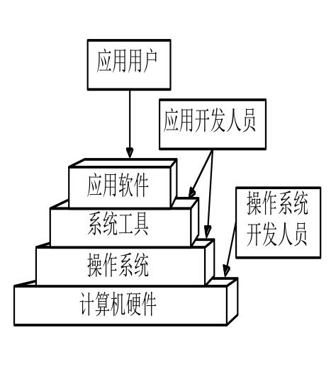

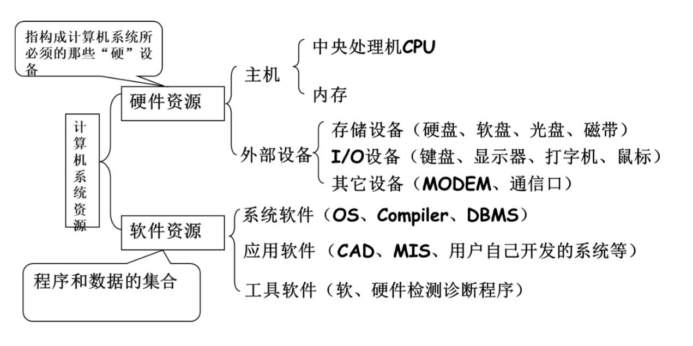

## 引入操作系统的目的

- 方便：给用户提供一个硬件接口，易于操作
- 有效：以有效的方式使用软硬件资源
- 改善性能：组织计算机的工作流程，改善系统性能
- 提供扩展能力：方便引进新的功能

## 现代操作系统的特征

按照《操作系统导论》来说是虚拟化、并发、持久性。下面是PPT中的，个人感觉它没涉及持久性。

### 并发（concurrency）

并发指多个事件在同一时间段内发生。单个CPU核其实只能单独执行一个进程（即串行），我们可以让多个进程交替进行，只要交替得够快，宏观上就像在并发。OS就要完成这些并发过程的管理。

程序的静态实体是可执行文件，动态实体是进程，并发是进程在并发。

并发与并行（parallel）不同，并行是不存在交替过程的，是真正的同时进行。

### 共享（sharing）

计算机中的有限资源不再为某个用户独占，而是可以多个用户共享。OS就负责管理共享的时候如何分配管理。

有两种共享：

- 互斥共享。同一时间内某个资源只能最多有一个用户使用，使用完后别的用户才能用。例：打印机
- 非互斥共享。同一时间内某个资源可以有多个用户“同时”使用。同时并不是并行意义上的，而是并发意义上的。例：CPU、内存。

### 虚拟（virtual）

在并发的时候，切换执行的进程对进程本身是不可见的，它们都以为自己完整地占用了CPU。也就是说，一个物理CPU被虚拟化成多个逻辑CPU，每个进程一个。

虚拟分成分时复用（CPU）和分空间复用（存储器）。

### 不确定性（uncertainty）

也称为异步性（asynchronism）。指多个进程并发时，执行顺序的不确定，导致结果的不确定。

# 虚拟化

虚拟化主要分为虚拟化CPU和虚拟化内存。虽然虚拟化CPU会提到进程和并发的基础概念，但是这里主要讲进程调度，并发部分会主要讲锁。

## 进程

### 基本概念

程序的并发执行使得程序的执行成为一个动态的过程。程序更像是描述一个静态的可执行文件，于是引入进程来描述动态执行的程序。

这些并发的进程的特性为：程序执行的间断性；资源贡献；独立和合作（制约）性。

进程，直观地定义的话，就是执行中的程序。该进程可与其他进程并发执行；它是一个动态的实体，既是资源的基本分配单元，也是基本的执行单元。

**进程与程序的区别**

- 程序是静态的，是有序代码的集合。进程是动态的，是程序的一次执行。
- 程序是永久的，没有生命周期。进程是暂时的，有生命周期，会不断变化。
- 进程是操作系统资源分配和保护的基本单位，而程序不是。
- 进程与程序的结构不同

**进程与程序的联系**

- 通过多次执行，一个程序可以对应多个进程。
- 通过调用，一个进程可以包括多个程序。

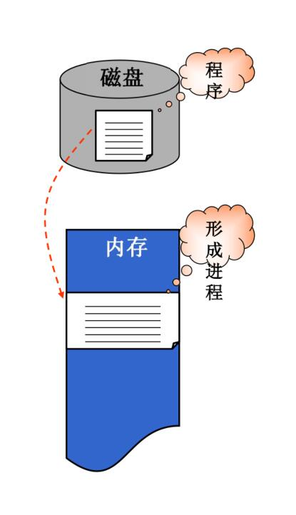

### 组成成分

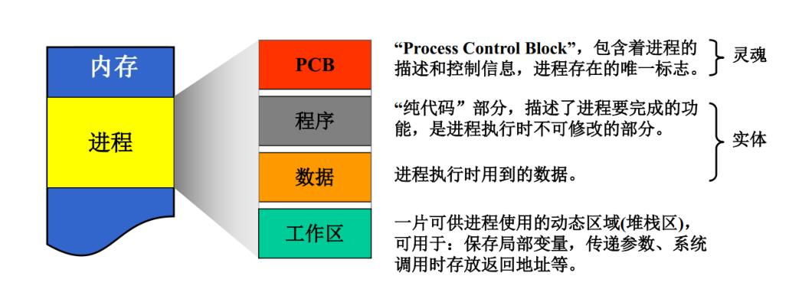

PCB包含的信息有：进程ID、用户ID、创建时间、父子进程关系等标识信息。CPU寄存器内容等现场信息。持有句柄、进程状态、信号量、调度信息、优先级等控制信息。

## 进程控制

OS对进程的控制和管理是通过操作系统内核中的原语实现的。

原语指的是原子操作，即该操作要么完全进行了，要么根本不进行，不存在进行了一半被打断的情况。原语的原子性主要是通过屏蔽中断保证的。

原语主要分为：进程控制原语、进程通信原语、资源管理原语、其他。常见的有：创建、撤销、阻塞、唤醒、挂起、激活等。

进程主要有三种状态

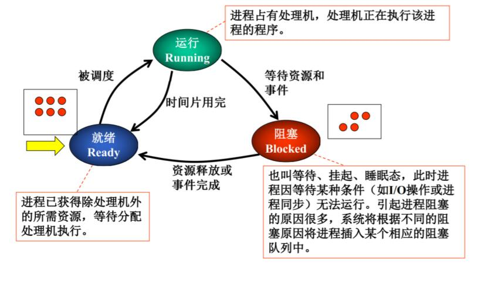

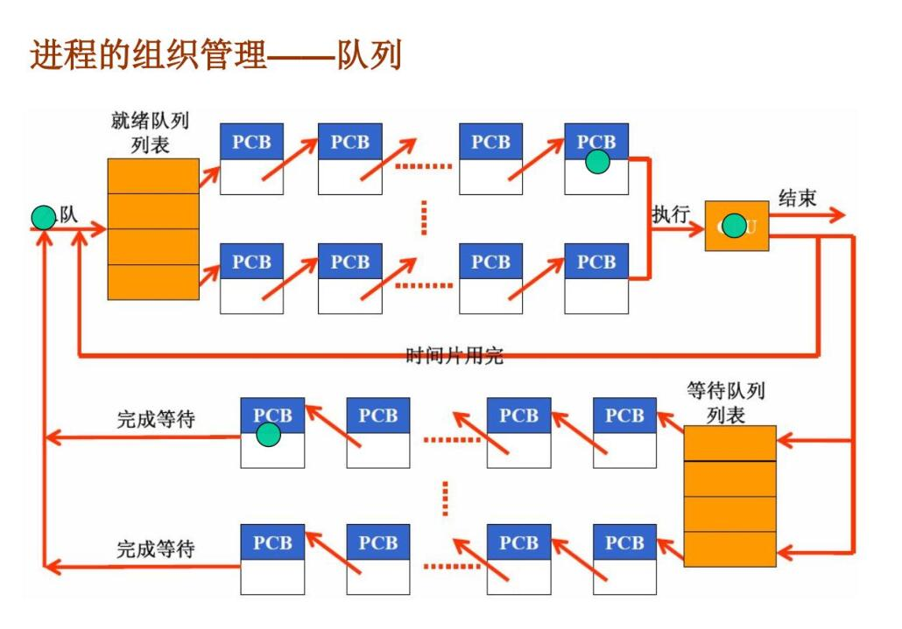

## 进程调度

进程调度关注的问题是：当有多个进程/线程准备就绪时，先执行哪一个？这又有两个子问题，什么时候进行这个决策？如何决策？

设计算法的时候，要同时考虑到系统和用户。对于系统来说，需要有公平性（不会有进程被饿死）和较大的吞吐量。对于用户来说，需要有及时性和较短的周转时间。

周转时间为

$$
T_{周转时间}=T_{完成时间}-T_{到达时间}
$$

而响应时间为

$$
T_{响应时间}=T_{首次运行}-T_{到达时间}
$$

**抢占式和非抢占式**

非抢占式调度意味着，一旦某个进程开始运行，那么直到该进程放弃CPU之前，操作系统只能干看着，无论后面有什么进程在等待。

抢占式意味着，操作系统非常愿意停止一个进程，然后运行新的进程，只要它觉得有必要。

### 先来先服务算法（FCFS）

也就是FIFO，也就是队列。让最早开始等待的进程占用CPU。非抢占式。

其有公平性，但是吞吐量、及时性、周转时间都很差。

### 最短任务优先（SJF）

就和小学经典的排队节水问题一样，接水最少的人最先。这里也是，执行时间最短的任务最先。

可以证明，如果所有任务同时到达，SJF是最优的调度算法（周转意义上）。但是没有这个前提，任务随机地在某个时间点到达（贴近现实），则可能会很差。比如一个超长的任务先到达，过了一两秒后两个很短的任务到达，那么这两个任务就会等很久，造成周转时间长。

这是一个非抢占式算法。

但是考虑到公平性，一个进程可以反复发起短时间的占用，最终占用了长时间的CPU。所以并不公平。

另外我们几乎不可能知道一个进程要占用多长时间。

### 最短完成时间优先（STCF）

在SJF最后的问题中，可能会立刻想到一个抢占式的算法，即让完成最快的任务先进行。显然是抢占式的。

可以证明，STCF在周转意义上是最优的。其他缺点同SJF。

### 基于优先数的调度算法

其给每个进程设置一个优先级，系统在调度的时候优先选择高优先级的进程。如果有相同的优先级则按照FCFS。

优先级有两种确定方法

- 静态优先数法：进程创建时就规定好优先级，运行时不改变
- 动态优先数法：进程的优先级在执行过程中可以改变

PPT没说优缺点，我估计是跟优先级的选择有关。

### 时间片轮转法（RR）

思想很简单，系统规定一个时间长度作为运行一个进程运行的时间，如果这段时间内进程没有运行完，则必须让出CPU然后回去排队。

显然，其及时性很好，但是周转时间很差。

老师的PPT还给出其公平性差，我不明白为什么，这是非常公平的算法。有其他资料印证我的想法。

### 多级反馈队列（MLFQ）

MLFQ中有许多独立的队列，每个队列有不同的优先级。每个任务只能存在于一个队列之中。MLFQ总是执行优先级较高的队列中的工作。优先级相同的工作则对他们使用轮转法。具体规则为：

1. 如果A的优先级>B的优先级，运行A
2. 如果A的优先级=B的优先级，轮转运行A和B
3. 任务进入系统时，放在最高优先级队列
4. 一旦任务用完了时间配额，就把它放入低一级队列
5. 经过一段时间S，将所有工作重新加入到最高优先级队列

Windows内核采用的就是这种算法的修改版

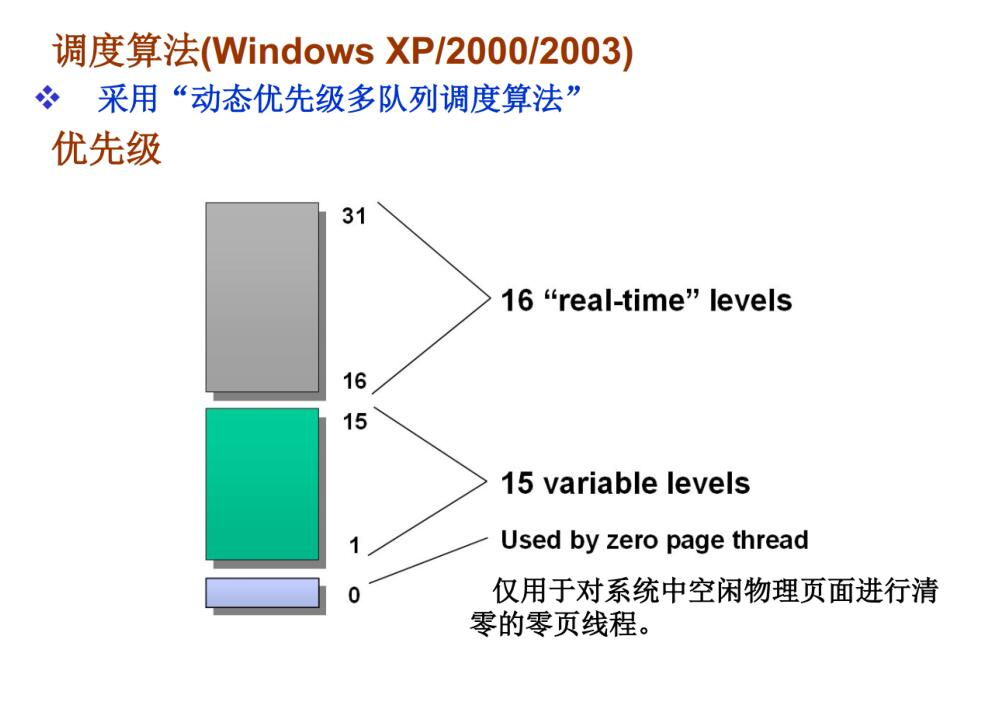

## 地址重定位

当程序被装入内存时，程序的逻辑地址被转换为内存的物理地址，这一过程称为地址重定位。这一过程由MMU（内存管理单元）完成。

### 绝对装入/固定地址再定位

程序的地址再定位是在程序执行之前被确定的。也就是在编译连接时直接生成物理地址。在此，程序地址空间和内存地址空间是一一对应的。

### 可重定位装入

程序装入时，逻辑地址和物理地址可以不一致，此时需要由逻辑地址映射到物理地址。

**静态再定位**

地址定位时修改程序的逻辑地址值，完成定位后，在程序的执行期间地址不再变化。

特点：在程序执行前定位

优点：容易实现，无须硬件支持

缺点：必须分配连续的存储区域，执行期间不能在内存中移动

**动态再定位**

程序在装入内存时，不修改逻辑地址。而是在程序访问内存时，实时地转化成物理地址。

优点：代码可以在内存中移动，代码可以不连续存放在内存中。

缺点：需要硬件支持，实现存储管理的软件比较复杂。

## 内存扩充

其实就是虚拟内存，用辅存在逻辑上扩充内存，来装入更大的程序。

**覆盖技术**

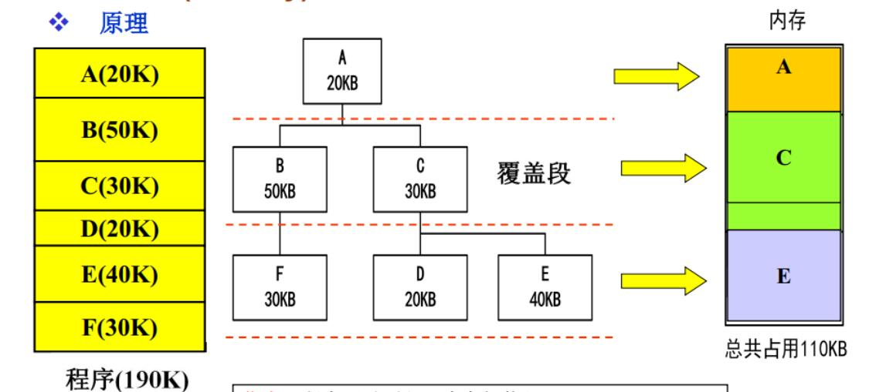

优点：程序可以不必一次装入

缺点：覆盖结构需要程序员精心安排，增加复杂度。覆盖区仍有碎片

**交换技术**

即把内存中放不下的放到外存。

优点：程序可以不必一次全部放入；可以提供优先级服务

缺点：换入换出增加开销。换入时的重定位问题


## 内存管理-分区（连续）存储管理

### 单一连续分区存储管理

内存中一次只装入一个用户程序，程序独占整个用户区。

优点：简单，适合单用户、单任务的系统，不需要硬件支持

缺点：不支持多任务和大任务。太小就浪费，太大就装不下

### 固定分区管理

就像给硬盘分区，内存也可以分为几个区，然后每个区就像单一的连续分区一样管理。

优点：利用率提高；支持多程序

缺点：存在**内碎片**（即分区之间未被使用的内存），浪费。分区数固定，限制并发数。

### 可变分区

不预先划分，而是在作业需要装载时向系统申请，系统从内存中挖出一块给作业。剩下的部分等待下一次使用。

关键是如何管理这些还未分配的内存。

这些未分配的内存块会被记录在一个线性表（通常是链表）里，表中每一项记录了该空闲块的大小以及开始地址。

**最先适应算法（first-fit）**

将所有空闲分区按照地址递增的顺序排列，从前往后找，找到第一个符合的就分给他。

释放内存时，把前后相邻的空闲空间合并。

优点：尽可能利用低地址的空闲区，而把高地址的空闲区留给大作业。并且释放时可以合并分区。

缺点：查表总是从头开始，前面会有很多小空间，会查很多次。存在**外碎片**，即被占用内存之间的各种小空闲内存，它们无法被合并集中使用，只能放在那，谁也看不上。

**下次适应算法（next-fit，循环最先适应算法）**

与first-fit唯一的不同在于，其查找是从上次分配的区块之后查找，查找到末尾时再查开头。

优点：空闲分区分布地更均匀，提高查找速度。

缺点：较大的分区不易保留。

**最佳适应算法（best-fit）**

将所有的分区按容量排序，从小到大找到第一个合适的进行分配。

释放时，在整个链表上搜索地址相邻的空闲区，合并后插入到合适的位置。

优点：分配后剩下的空白块最小，较大的空闲分区会被保留

缺点：空白区可能小到无法使用，形成较多碎片

**最坏适应算法（worst-fit）**

与best-fit相反。即按从大到小地找。

优点：一次就可以匹配成功

缺点：剩余分区会越来越小，无法运行大程序

**可再定位式分区**

又称浮动分区分配。即移动所有被分配的分区，称为一个连续区域，而留下的就是一个较大的空白区。

## 内存管理-页式存储管理

分区要求作业存储时必须连续存放。这样当一个作业大于当前最大的空闲分区时，即使还有其他空闲分区，也不能利用，降低了效率。

分页考虑把作业内内存都分割成若干大小相等的块。每一块叫做一个页，在程序逻辑空间中的叫虚页，在物理地址中的叫做实页（主页）。所有页大小都相等，常为$2$的整数幂。

也有地方把虚页叫做页，实页叫做帧的。

主要关注的问题是，如何把虚页号映射到实页号上。

我们通常会使用页表（page table）来实现。可以用数组、哈希表实现，记录虚页到实页的映射关系

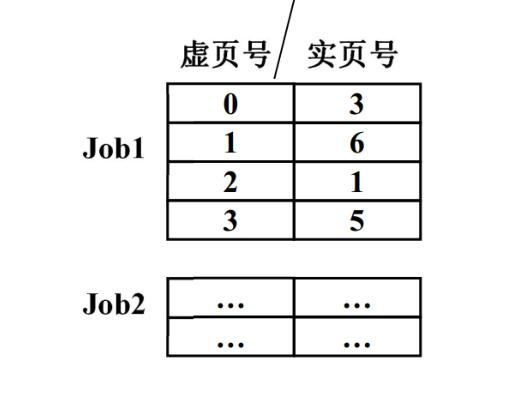

转换也很方便，只需要把虚拟地址的一部分当作页号，一部分当作页内偏移即可。

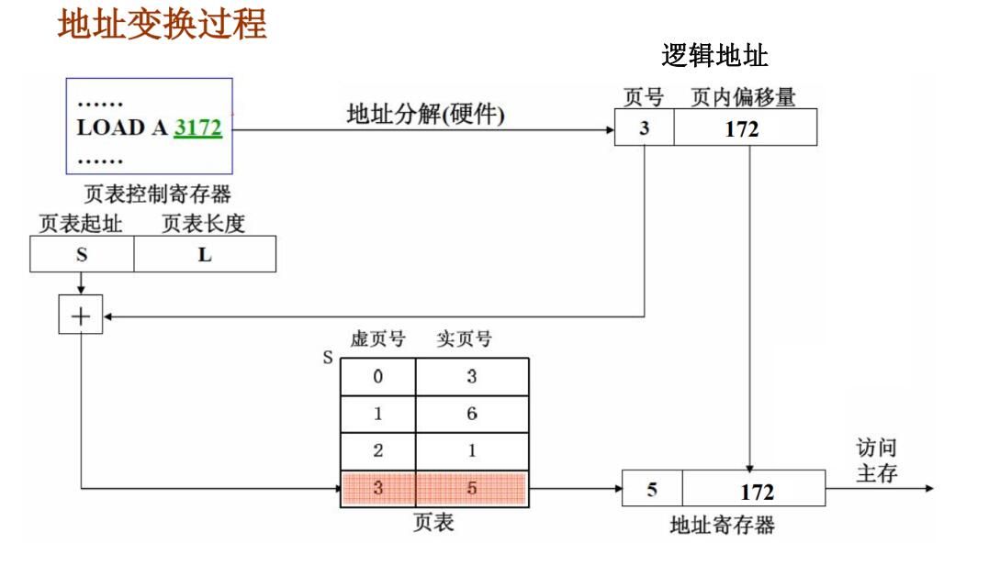

一般来说，页的大小会是$2$的整数次幂，就是因为这个原因。假设虚拟空间有64$(2^6)$字节，按字节编址。假设页的大小为16$(2^4)$字节，那么一共有4页，所以可以把地址的低4位当作页内偏移，高2位作为虚页号（VPN）

页表也是放在内存中的，所以为了取出一个数据，要额外访问一次内存。

优点：程序不必连续存放。没有外碎片

缺点：程序要一次全部装入内存。页表占用空间。建立和管理页表有开销。存在内碎片。并且页面与源程序无逻辑关系，难以对源程序以模块为单位进行分配、共享、保护

### 快速地址转换（TLB）

是为了缓解每次访存都要访两次的技术。简单来说，就是把页表项放在cpu的cache里，cpu中的这些页表项就组成了一个快表。由于时间局部性，这个是会提升效率的。

## 内存管理-段式存储管理

其可以解决分页中不能解决的：信息共享、信息保护、动态链接、动态增长问题。

把程序划分为大小可以不同的段，每一段按照代码逻辑单位进行划分，每一段拥有独立的逻辑空间。

每一段都有一对基址和界限寄存器，每一段都可以独立地放入物理内存。基址意味着段从哪里开始，界限意味着段在哪里结束。当然，还会有内存增长方向的标记。

如何把逻辑地址映射到物理地址呢？和页也有相似之处，把虚拟地址的高几位用作段的标记。

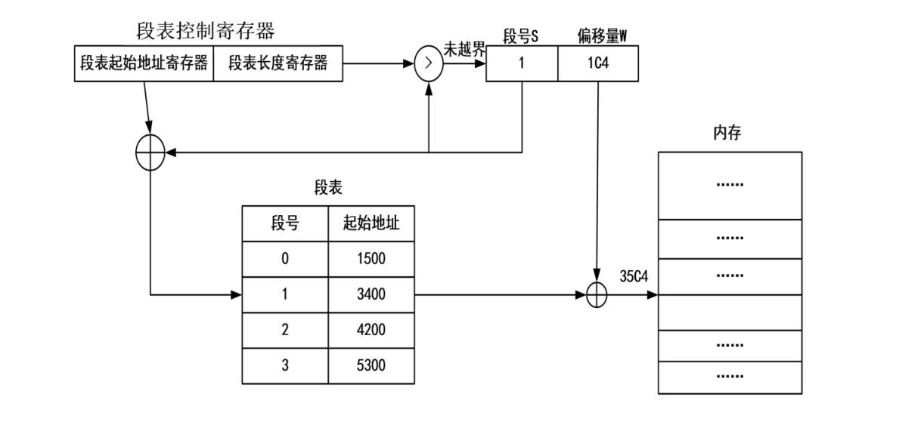

另外，段也可以有保护位，标记该段是否可以被贡献。例如数据段可以被共享，而代码段、堆栈段等不能共享。

优点：程序不必连续存放、没有内碎片、便于共享

缺点：作业要一次装入内存，存在外碎片。

## 内存管理-段页式存储管理

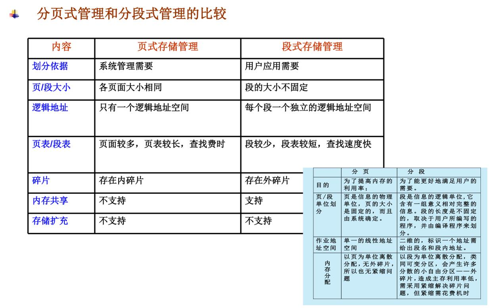

这是一种折衷方式，把段内再进行分页。此时逻辑地址从高到低为：段号、页号、页内地址。而后两个是段内地址。

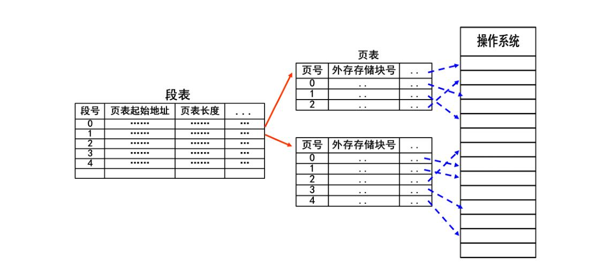

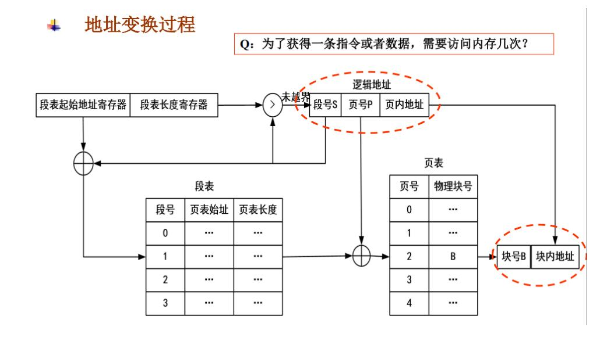

访问内存3次，比分页还慢。

## 虚拟存储

为了在内存空间运行超过内存总容量的大作业，或者同时运行大量作业，解决的方法是从逻辑上扩充内存容量。

### 程序的局部性原理

程序部分运行是可以的。在一段时间内，程序的执行仅局限于某个部分；相应地，它所访问的存储空间也局限于某个区域内。

- 程序大多数时间是顺序执行，较少跳跃
- 子程序调用将会使程序的执行由一部分内存区域转至另一部分区域。
- 程序中存在许多循环结构
- 程序中还包括许多对数据结构的处理，如对连续的存储空间——数组的访问，往往局限于很小的范围内。

**时间局部性**

程序中存在着大量的循环操作，一条指令一旦执行，那么很有可能很快会再次执行。某个存储单元被访问，很有可能很快会再次访问。

**空间局部性**

程序是顺序执行的，所以一旦访问某个存储单元，其周围的存储单元最有可能很快被访问。

所以，程序在装入时，就不用一次性全部装入内存的，只需要把部分装入到内存，就可以执行。在执行过程中，如果发现需要的数据不在内存里，处理器就负责通知操作系统将相应的区域调入内存，然后继续执行。

### 虚拟存储器的特征

- 离散性。内存分配时必须离散地分配，例如分页。最基本的特征
- 多次性。一个作业被分成多次调入内存运行，即在作业运行时没有必要将其全部装入。最重要的特征
- 对换性。作业运行过程中信息在内存和外存的对换区之间换进、换出。
- 虚拟性。逻辑上扩充内存，使得用户看到的内存容量远大于实际容量。

### 虚拟内存的实现-请求页式（demand paging）

在分页系统的基础上，增加了请求调页功能、页面置换功能，从而支持形成虚拟存储系统。

需解决：

- 取页。将哪部分装入内存
- 置页。将调入的页放在什么地方
- 淘汰。内存不足时，换出哪些页

第一个问题很好回答，只有在一个页需要的时候才把它装入内存。好处是

- IO需求更少
- 内存需求更少
- 响应快
- 支持多用户

硬件需要做到，在无效的访问时终止。访问不在内存中的页时把页换入内存。

**页表**

要做到虚拟存储，页表需要添加一些信息

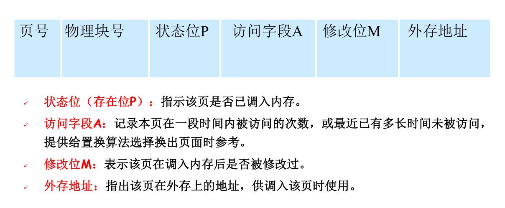

**缺页中断**

另外，还需要添加一些功能。即

- 产生和处理缺页中断
- 页面置换功能

每当需要的页不在内存时，就产生缺页中断，请求OS把页调入内存。

与一般中断的主要区别在于：

- 缺页中断机构在指令执行期间产生和处理中断信号，而一般中断在一条指令执行完后检查和处理中断信号。
- 缺页中断返回到该指令的开始重新执行该指令，而一般中断返回到该指令的下一条指令执行。
- 一条指令在执行期间，可能产生多次缺页中断。

处理缺页中断的过程：

- 查找页表来确定此次地址访问是否合法
- 如果不合法,则中止该进程; 否则如果是发生了缺页,则需要将其调入内存
- 找到一个空闲物理块
- 启动磁盘,把该页读入内存
- 读磁盘结束后,修改页表以指出该页已在内存中
- 重新开始执行刚才发生缺页中断的指令,这时它可以访问刚才调入的页

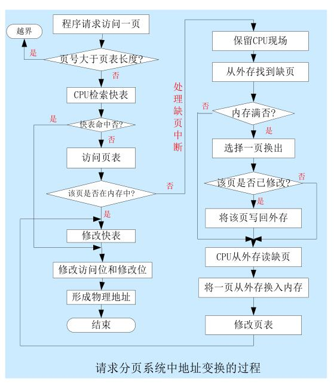

缺页的整体过程如下

1. 陷入OS
2. 保存该用户寄存器和进程状态
3. 确定该中断是一个缺页中断
4. 检查该页面引用是合法的并确定该页在磁盘上的位置
5. 将该页从磁盘读入一个空闲物理块
    1. 在磁盘等待队列中等待直到该请求被处理
    2. 等待设备寻道延迟
    3. 将该块从磁盘传送至内存
6. 为了提高CPU利用率，将CPU分派给其他进程使用
7. 磁盘I/O完成，产生中断
8. 保存正在执行进程的现场信息（如果第6步执行了）
9. 确定中断来自于磁盘
10. 修改页表以示所缺的页已进入内存
11. 等待CPU再次分派给这个进程
12. 恢复该进程的现场信息，包括寄存器、进程状态、页表等，恢复执行

以上步骤不是在任何情况下都会发生的，主要动作为

- 处理缺页中断
- 从磁盘读入所需的页
- 重新开始被中断的进程

其中磁盘IO开销最大。

就像Cache有命中率，这里也有缺页率。

如果作业在执行过程中总的访问内存次数为$A$，成功访问次数为$S$，缺页的次数为$F$。则

$$
A = S+F
$$

$$
p = F/A
$$

然后我们就能得出有效存取时间（EAT）的概念，即访问一次内存的平均开销

$$
EAT = (1-p)\times 内存访问时间+p(缺页中断处理时间+换出时间+换入时间+重启程序时间)
$$

**页置换**

在可用页面不足时，找到内存中并没有使用的某个页，换出。其出发点就是希望把未来不使用或者短时间内较少使用的页调出。最终希望能有最小的缺页率。

常见算法

- 先进先出页面淘汰算法
- 最近最少使用（LRU）算法
- 最佳算法
- 第二次机会淘汰算法
- 页面缓冲算法

（感觉和Cache、TLB的替换算法一样）

其中前两个比较重要，会考。但是在计组里面学过了，就不记了。主要讲讲LRU的实现

*计数器实现*

其中LRU的一种实现是，给每个页表项一个时间域，CPU增加一个计数器，每次访问内存就给计数器+1，然后赋值给被访问的页的时间域。

于是最近最少使用的页就是时间域最小的页。

*栈实现*

用双向链表记录一个页号的栈。每次访问时把该页移到栈顶。于是栈底的页就是最近最少使用的。

置换算法的好坏将直接影响系统的性能，不适当的算法可能会导致进程发生“抖动/颠簸”（Thrashing)

抖动：刚被换出的页很快又被访问，需重新调入，导致系统频繁地交换页面，以致大部分CPU时间花费在完成页面置换的工作上

原因为：

1. 页面淘汰算法不合理
2. 分配给进程的物理页太少

常驻集指虚拟页式管理中给进程分配的物理页面数目。常驻集与缺页率的关系：

1. 常驻集越小，内存中能并发的进程数就越多，但是就就单个进程来说，缺页率会很高
2. 常驻集到达一定数目后，再增加页面，缺页率不会明显下降

常驻集的大小确定方式有

- 固定分配法。如平均分配法；根据程序大小按比例分配法；按优先权分配法
- 可变分配。性能较好，但是增加了算法开销

由于局部性原理，进程在一段时间内总是集中访问一些页面，称之为活跃页面。如果能给进程提供等于活跃页面数等大（或大于）的常驻集，那么缺页就会减少。

对于给定的访问序列选取定长的区间，称为工作集窗口，落在工作集窗口中的页面集合称为工作集。可以用工作集来调整常驻集的大小。

- OS跟踪每个进程的工作集，并为其分配大于其工作集的物理块数。
- 如果还有空闲物理块，则可启动另外的进程。
- 如果所有进程的工作集之和超过了可用物理块的总数，则OS会选择暂停一个进程，该进程被换出，所释放的物理块可分配给其他进程。

利用工作集进行常驻集调整的策略：

1. 记录一个进程的工作集变化
2. 定期从常驻集里删除不在工作集中的页面
3. 总是让常驻集包含工作集

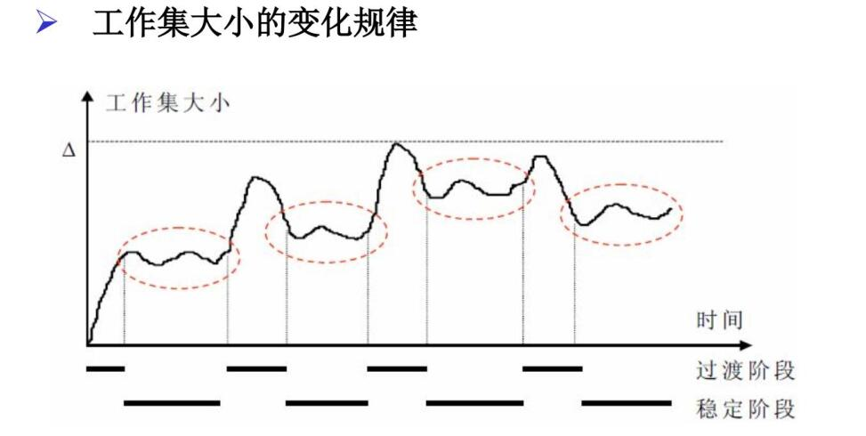

**页面调入策略**

为能使进程运行，事先需将一部分要执行的程序和数据调入内存

*预调页策略*

- 主动的页面调入策略，即把那些预计很快会被访问的程序或数据所在的页面，预先调入内存。
- 预测的准确率不高（50%），主要用于进程的首次调入。也有的系统将预调页策略用于请求调页

*请求调页策略*

- 当进程在运行中发生缺页时，由系统将缺页调入内存
- 目前虚拟存储器系统大多采用此策略
- 在调页时须花费较大的系统开销，如需频繁启动磁盘I/O

至于从何处调入页面。虚拟存储系统中，外存被分为两部分：文件区和对换区（如linux交换空间）。对换区（连续分配）的磁盘IO速度比文件区（离散分配）要高。

### 虚拟内存的实现-请求段式（demand segmentation）

课上没有内容
# 并发

## 线程

把进程介绍放到虚拟化，把线程介绍放到并发，并不是说进程不能并发，只是《操作系统导论》中API的介绍是这样安排的。我这里也一样。

### 基本概念

线程算是一种轻型的进程，是一个可执行的实体单元，是线代操作系统中处理器调度（执行）的基本单位。

**线程和进程的关系**

- 线程是进程的一个组成部分，线程由进程创建，一个进程中可以有多个线程。
- 进程是资源分配和保护的基本单位。每个进程都有自己独立的资源，而一个进程内的多个线程使用资源有很多是一样的，也即进程的资源。
- 所有线程的代码段和数据段是一样的，但是可以执行在不同的代码上
- 每个线程可独立运行也可以互相合作
- 每个线程的上下文是独立的，也即寄存器、栈等。

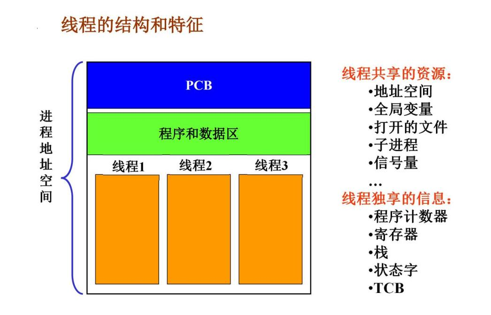

### 线程的实现方式

**用户态线程**

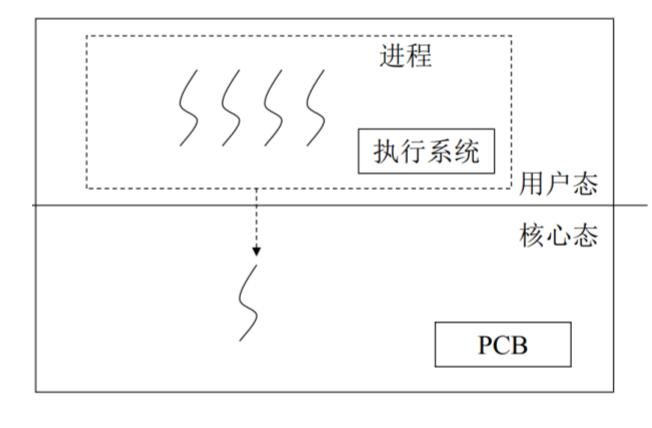

即进程自己管理线程。

优点：

- 线程对操作系统不可见，操作系统适应性强
- 线程切换快

缺点：

- 程序设计困难
- 并发度低

**内核态线程**

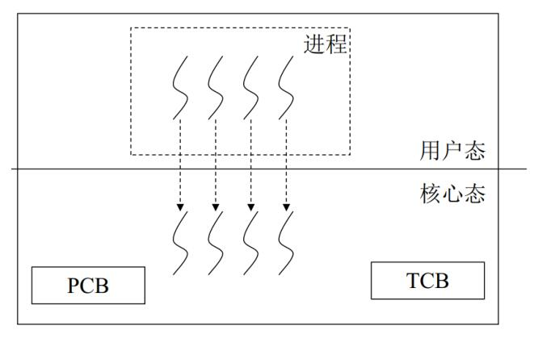

即操作系统来管理线程。

优点：实现简单，并发度高

缺点：执行效率低、资源消耗高

**混合模型**

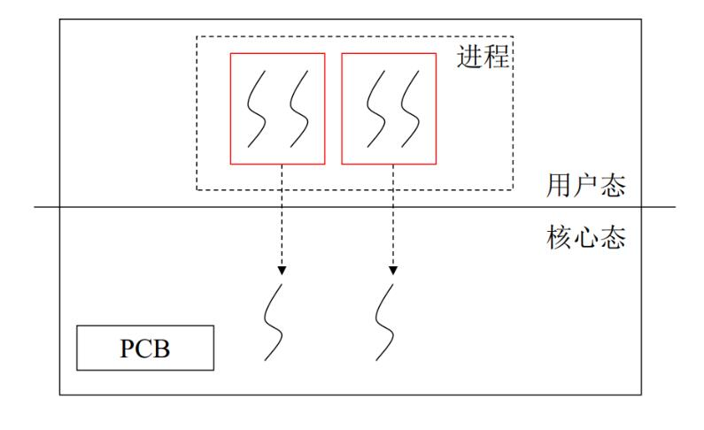

## 进程通信

进程通信简单来说就是在进程间传输数据

除了交换数据，同步、互斥也建立在沟通通信的基础上，来传递状态和控制信息


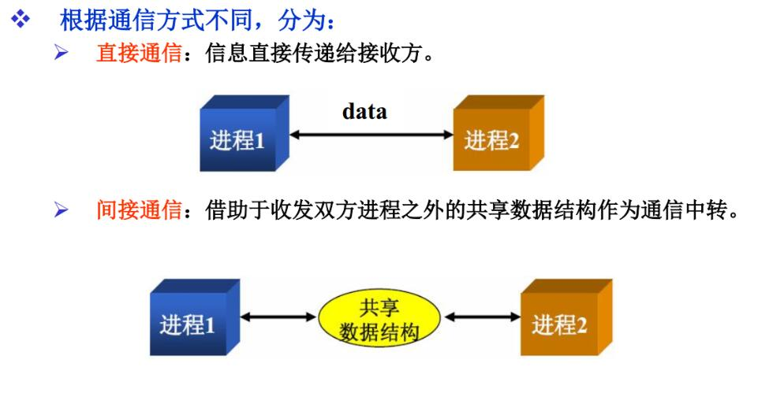

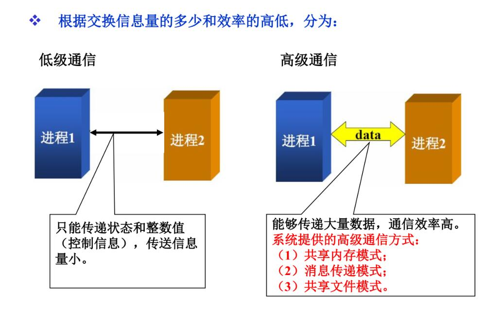

**共享内存模式**

它是间接通信，是最快捷有效的方法之一。

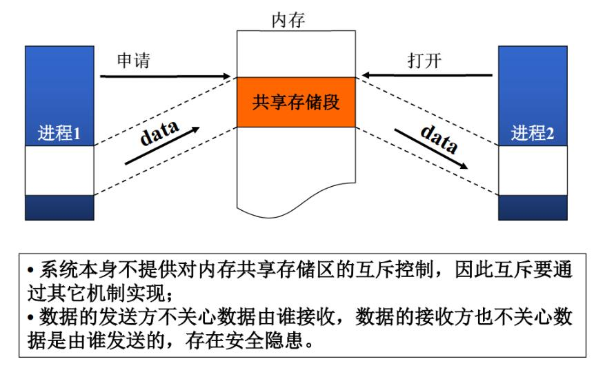

**消息传递模式**

由发送方形成，通过一定的机制传递给接收方的一组信息，它的长度可以固定，也可以变化。和客户端-服务端的形式比较像。

消息也是分为消息头和消息体。就像HTTP请求一样。

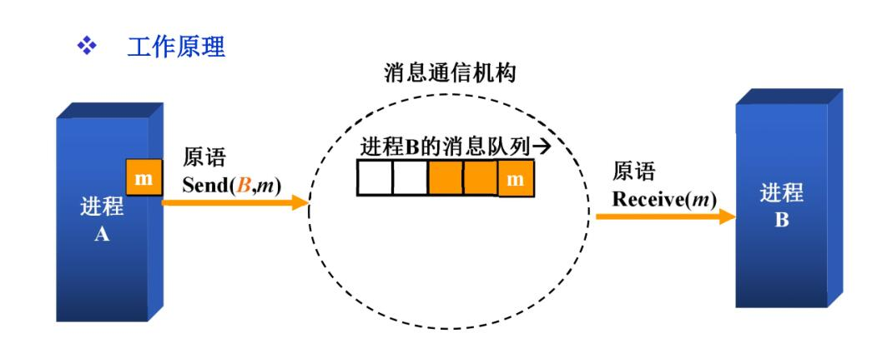

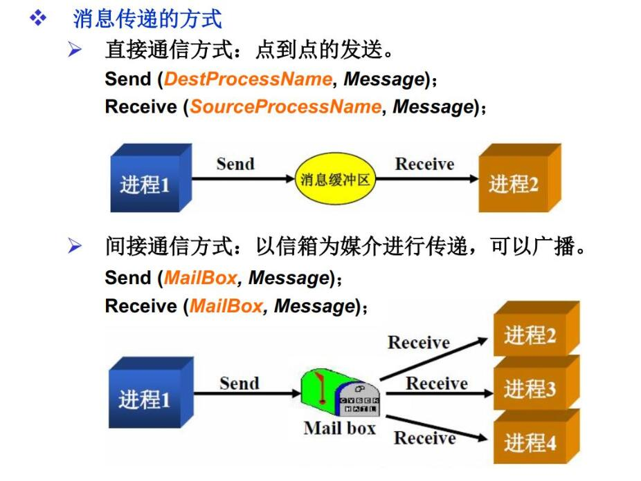

**共享文件模式（管道）**

Linux的管道就是经典的例子。

管道是一种信息流缓冲机构，基于文件系统，可以连接两个进程，以FIFO的方式单向传送数据。

*匿名管道*

匿名管道是一种未命名的、单向管道。常用在父子进程之间。匿名管道是本地的，不能用在网络之间。匿名管道如果想要双向通信，通常会创建两个单向管道。

*命名管道*

命名管道是一种有名称的，可在本地或者网络间传输，支持可靠的单向或双向通信。

## （自旋）锁

- 临界区：是访问共享资源的一段代码，资源通常是一个变量或数据结构
- 竞态条件：出现在多个执行线程大致同时进入临界区时，它们都试图更新共享资源，达到了错误的结果
- 不确定性：程序里面有竞态条件，就会导致程序的输出不确定。
- 互斥原语：即可以把临界区原子化的操作

大致上，锁是这样用的

```cpp
lock();
a = a+1;
unlock();
```

### 控制中断

即在临界区关中断，防止调度程序切换线程。

```c
void lock(){
    DisableInterrupts();
}
void unlock(){
    EnableInterrupts();
}
```

缺点：

1. 恶意程序可以在lock之后死循环，让系统假死
2. 不支持多处理器
3. 导致中断丢失
4. 效率低

### 测试并设置（Test-And-Set）

```c
typedef struct lock_t{
    int flag;
} lock_t;

void init(lock_t *lock){
    lock->flag = 0; // 0代表未加锁，1代表加锁
}

void lock(lock_t *lock){
    while (TestAndSet(&lock->flag, 1)==1)
        ; //自旋
}

void unlock(lock_t *lock){
    lock->flag = 0;
}
```

测试并设置所要做的事是，当一个进程要进入临界区时，首先测试这把锁，如果锁的值为$0$，则设置为$1$并进入临界区。否则等待直到其变为$0$

这样一直测试直到条件满足的锁，也叫做自旋锁。和后面信号量实现的sleep-wakeup锁区分开（我没有找到sleep-wakeup锁的确切定义）。

结果意义上，等价于设置新值，返回旧值。其等价于如下c语言代码。

```c
int TestAndSet(int *old_ptr, int new){
    int old = *old_ptr;
    *old_ptr = new;
    return old;
}
```

注意，不能用C语言就实现锁，必须要有硬件的支持。上述测试并设置并不是原子的，可能会在中间中断。

幸运的是，操作系统提供这样的指令，如`HSL`和`XCHG`。

这个锁并不保证任何的公平性，线程可能会永远自旋。

另外，一直在自旋也会导致性能开销很大，CPU会一直处于忙等待（Busy waiting）状态

### 比较并交换（compare-and-exchange（swap））

也是需要硬件支持的。

```c
int CompareAndSwap(int *ptr, int expected, int new){
    int actual = *ptr;
    if(actual == expected)
        *ptr = new
    return actual;
}

void lock(lock_t *lock){
    while(CompareAndSwap(&lock->flag, 0, 1)==1)
        ;
}
```

如果只是实现简单的自旋锁，那么等价于测试并设置。

### 链接的加载和条件式存储指令（load/store）

TODO

### 获取并增加

TODO

## 条件变量

TODO。课堂上没讲，只需要明白使用条件变量可以避免自旋即可。

## 信号量

### 生产者-消费者模型

也叫做有界缓冲区问题。

假设有一个或多个生产者线程和一个或多个消费者线程。生产者把生成的数据项放入缓冲区；消费者从缓冲区取走数据项，以某种方式消费。

如果让生产者将数据放入已满的缓冲区，或者消费者从空的缓冲区中获取数据，就会产生错误。

这项工作由两类线程完成，一类称为生产者线程，另一类为消费者线程。

### 信号量基本概念

信号量（semaphore）是一个有整数值的对象，仅可以用初始化和两个函数来操作它。POSIX标准中，这两个函数为`sem_wait()`和`sem_post()`，而在Dijkstra的荷兰语论文中称之为`P()`和`V()`

信号量表示资源的实体，这个整数值与队列有关。

信号量分为

- 公有信号量：用于进程间的互斥，初值通常为1
- 私有信号量：用于进程间的同步，初值通常为0或n

C语言等效代码如下，具体还是要靠硬件、或者底层同步原语（锁和条件变量）实现原子化的操作。

```c
int sem_wait(sem_t *s){ // 即P()
    s = s - 1;
    if(s<0){
        // 调用进程被阻塞（sleep/wait）
        // 进入s的等待队列
    }
}
```

```c
int sem_post(sem_t *s){
    s = s + 1;
    if(s<=0){
        // 从s的等待队列里唤醒一个进程
        // 移出队列
    }
}
```

显然的，我们如果要把他当锁使用，就要给`s`的初值设置为`1`。此时，`s==1`代表无线程在运行。`s==0`代表有一个在运行。`s==-n`代表有`n`个线程在等待(n>0)。给临界区加锁的方式如下

```c
sem_wait(&s); // P(s)
a = a + 1;
sem_post(&s); // V(s)
```

这种让线程睡眠的锁叫做sleep-wakeup锁。

如果当作条件变量使用，可能会设置`s`的初值为`0`。通常P和V会放在不同的线程中使用

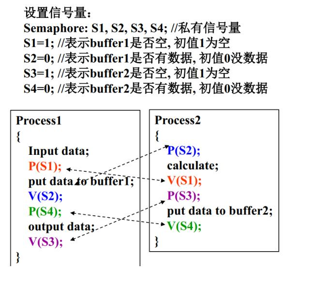

### 信号量解决生产者-消费者问题

```c
sem_t empty;
sem_t full;
sem_t mutex;

void *producer(void *arg){
    int i;
    for(int i=0;i<loops;i++){
        sem_wait(&empty);
        sem_wait(&mutex);
        put(i);
        sem_post(&mutex);
        sem_post(&full);
    }
}

void *consumer(void *arg){
    int i;
    for(int i=0;i<loops;i++){
        sem_wait(&full);
        sem_wait(&mutex);
        int tmp = get(i);
        sem_post(&mutex);
        sem_post(&empty);
        printf("%d\n", tmp);
    }
}

int main(){
    //...
    sem_init(&empty, 0, MAX); //第二个参数不用管，默认为0，第三个参数为初始值，这里为缓冲区大小
    sem_init(&full, 0, 0);
    sem_init(&mutex, 0, 1);
    //...
}

```

**使用注意事项**

首先，PV一定是成对出现的。互斥操作时处于同一线程中，同步操作时处于不同线程中。

其次，PV操作的位置和次序非常重要。例如，生产者的代码不能变为

```c
sem_wait(&mutex);
sem_wait(&empty);
put(i);
sem_post(&full);
sem_post(&mutex);
```

消费者的代码同理也不能替换顺序。否则会产生死锁问题，即消费者等待full，而生产者等待mutex，二者都在等待。

**缺点**

信号量解决了同步问题，但是信号量大量分布在各个进程中不便于管理，使用不当会导致死锁。

### 读者-写者模型

这也是一个经典的Inter-Process Communication（IPC）问题。

例如，一个数据结构可以被多个进程共享。有的进程负责修改数据，称为“写者”，有的进程只读数据，称为“读者”。规定：“读者”可以同时读取共享数据对象，“写者”不能与任何其他经常同时访问数据对象。

可以用信号量实现如下

```c
typedef struct _rwlock_t{
    sem_t lock;
    sem_t writelock;
    int readers;
} rwlock_t;

void rwlock_init(rwlock_t *rw){
    rw->readers = 0;
    sem_init(&rw->lock, 0, 1);
    sem_init(&rw->writelock, 0, 1);
}

void rwlock_acquire_readlock(rwlock_t *rw){
    sem_wait(&rw->lock);
    rw->readers++;
    if(rw->readers==1)
        sem_wait(&rw->writelock); // 即，第一个读者需要占用write锁
    sem_post(&rw->lock)
}

void rwlock_release_readlock(rwlock_t *rw){
    sem_wait(&rw->lock);
    rw->readers--;
    if(rw->readers==0)
        sem_wait(&rw->writelock); // 即，最后一个读者需要释放write锁
    sem_post(&rw->lock)
}

void rwlock_acquire_writelock(rwlock_t *rw){
    sem_wait(&rw->writelock);
}

void rwlock_release_writelock(rwlock_t *rw){
    sem_post(&rw->writelock);
}
```

### 理发师问题

这也是一个IPC经典问题。

理发店有一位理发师，一把理发椅和$n$把用来等候理发的椅子。如果没有顾客，理发师就在理发椅上休息。顾客来时，如果理发师空闲则理发，否则有空椅则坐等，否则离开。

```c
s customers = 0, barbers = 0, mutex = 1;
int waiting = 0;

void barber(){
    while(1){
        P(customers); // 检查是否有顾客
        P(mutex);
        waiting--
        V(mutex);
        V(barbers); // 向顾客发送信号
        cut_hair();
    }
}

void customer(){
    P(mutex);
    if(waiting<MAX){
        waiting++;
        V(mutex);
        V(customers); // 给理发师发送信号
        P(barbers); // 接收理发师的信号
        get_haircut();
    }
    else{
        V(mutex);
    }
}
```

### 哲学家就餐问题

这也是一个IPC经典问题。


有五个哲学家和五把叉子。哲学家有时要思考，有时要就餐。哲学家只有在同时拿到左右两把叉子时，才能就餐。

即哲学家为：

```c
while(1){
    think();
    getforks();
    eat();
    putforks();
}
```

我们可能会实现如下的锁：

```c
void getforks(){
    sem_wait(forks[left(p)]);
    sem_wait(forks[right(p)]);
}

void putforks(){
    sem_post(forks[left(p)]);
    sem_post(forks[right(p)]);
}
```

但是这是有问题的，假设每个哲学家都在一开始就拿自己左手边的叉子，那么所有人都会等待右手边的叉子空闲，没有人会放下叉子，于是就死锁了。

解决这个问题最简单的方法就是，假定某个哲学家的顺序不同，他先取右边，再取左边，这样就不会死锁了。

## 管程

管程的思想为，集中和封装针对一个共享资源的所有访问，包括所需的同步操作。Dijkstra在1971提出这个概念来集中管理临界资源的同步操作，构成一个所谓的秘书进程。凡是要访问临界区的进程，都需要报告秘书，由秘书来实现诸进程对临界区的互斥使用。

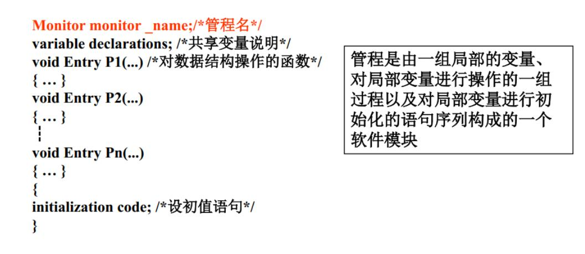

**基本特性**

- 局部于管程的数据只能被局部于管程内的函数所访问
- 一个进程只能通过调用管程内的函数才能访问管程内的共享数据
- 每次只能有一个进程在管程内执行某个函数
- 管程是一个语言成分，管程的互斥访问完全由编译器在编译期添加。

## 死锁缺陷

### 基本概念

之前我们也提到过死锁，就是大家都在等别人释放资源但是自己又不释放。

正式的：在多道程序中，由于多个并发进程共享系统资源，如果使用不当可能会造成一种僵局，即当某个进程提出资源的使用请求后，是的系统中的一些进程处于无休止的阻塞状态，在无外力的作用下，这些进程将无法继续进行下去，这就是死锁。

上面这段画可以总结出死锁产生的环境：

- 多道程序设计技术
- 多个并发进程
- 资源共享和独占
- 没有外力可以借助

Coffman在1971年支持死锁产生的4个必要条件

- 资源互斥访问。并且资源是有限的
- 非抢占（不可剥夺）。线程持有资源时，不能被其他线程抢占资源
- 持有并等待。即线程持有资源，又在等待其他资源
- 循环等待。即线程之间存在一个环路，环路上每个线程都持有一个资源，而这个资源又是下一个线程所需要的。

老师的PPT上还给出一个“零散请求”，我不知道什么意思。

死锁轻则导致系统资源利用率下降，重则系统崩溃。

与死锁相似的还有一种叫活锁，即两个线程释放资源后，又分别占用了对方释放的资源，反复释放和占用。

### 置之不理——鸵鸟政策

优点：简单、简化系统设计，节约成本

缺点：安全性低、可靠性低

### 事后处理法——检查和恢复

即容忍死锁的发生，之后处理（如关机）。

优点：灵活

缺点：不是所有情况都可以容忍死锁的发生

### 积极防御法

不让死锁发生，以积极的遏制为出发点。

手段

- 预防：破坏死锁产生的条件（代码意义上），使其不可能发生
- 避免：允许存在发生死锁的可能性，但是在每一步进行资源分配时灵活处理，使得其永远达不到死锁状态

### 积极防御法-预防

**破坏互斥条件**

通常来说，代码都会存在临界区，所以破坏互斥很困难，不好用。

**破坏非抢占条件**

即允许一个进程还未执行完成时就释放已经占有的资源（被剥夺使用权）。

缺点是实现困难，为了恢复现场需要耗费很多时间和空间。只适合CPU、存储器这样的资源。

**破坏零散请求条件**

即在进程创建时就分配所有需要的资源，然后再执行。这样运行中就没有资源申请了。运行完再释放。

缺点是效率低，资源浪费，并发性下降。

**破坏循环等待条件**

也许是最常用、最实用的。

给资源编号、排序，所有资源的申请必须按这个顺序申请。

缺点是资源编号困难；资源的编号很难和进程申请资源的顺序一致。

**破坏持有并等待条件**

即把所有的锁套在一个大锁里。

缺点是不适合封装。另外会降低并发度。

上面这五个都是预防，以破坏必要条件为方法，由于对资源的申请加上了众多限制，因此虽然有一定限制但是利用率和效率较低。

### 积极防御法-避免

**通过调度避免死锁**

在分配资源之前，系统判断假若满足进程的要求是否会发生死锁，如果会就不予分配，从而保证永远不会到达死锁。

优点：比预防更加灵活，允许更多并发，资源利用率和效率也更高。

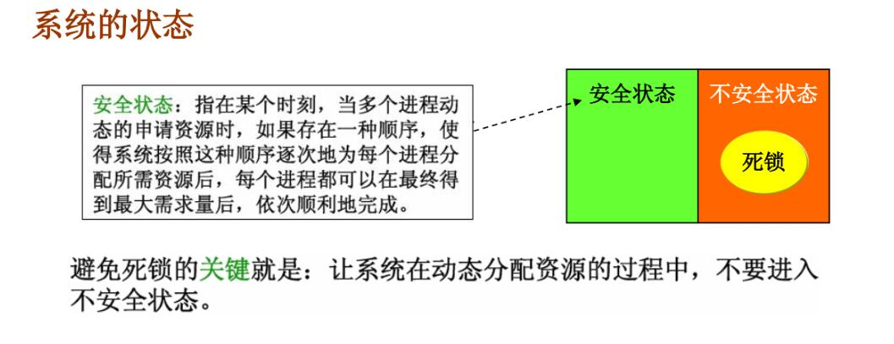

**单银行家算法（资源分配时避免死锁）**

在银行中，客户申请贷款的数量是有限的，每个客户在第一次申请贷款时要声明完成该项目所需的最大资金量，在满足所有贷款要求时，客户应及时归还。银行家在客户申请的贷款数量不超过自己拥有的最大值时，都应尽量满足客户的需要。在这样的描述中，银行家就好比操作系统，资金就是资源，客户就相当于要申请资源的进程。

单银行家算法我不打算记笔记，因为他是多项资源银行家算法的特例，思想和算法流程完全一样。不同点在于单银行家可以使用单个整数值，而多银行家必须用上向量。

**多项资源银行家算法**

适用于一个进程申请多个资源的情况。单银行家算法就是只申请一个资源时的特例。

假设有ABCD四种资源，有P1P2P3P4四个进程。

Allocation矩阵表示已分配的资源，Max矩阵表示线程的总需求量，Available向量表示操作系统还剩多少资源，NEED矩阵表示线程还需要多少。当然还可以有allocation向量表示系统分出去多少资源，即Allocation矩阵的列加和向量。sum向量表示操作系统总共有多少资源。等等。

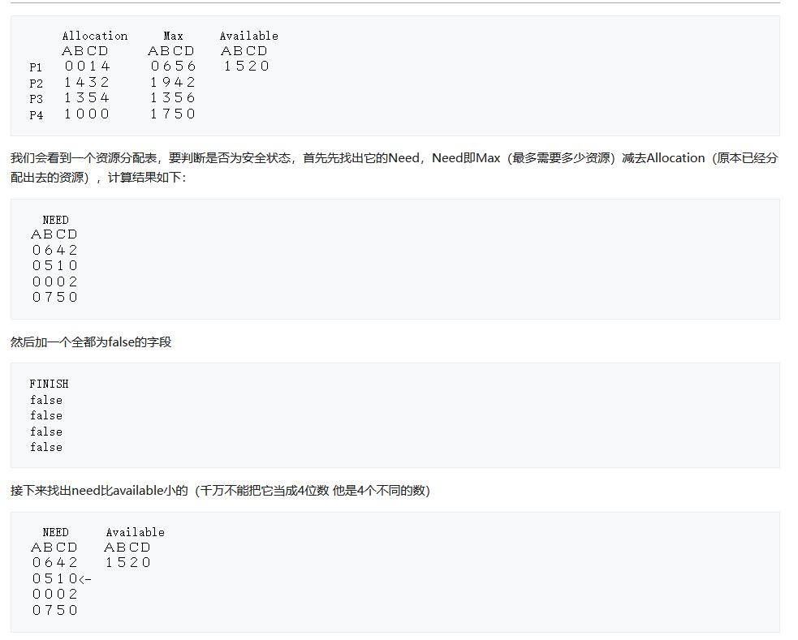

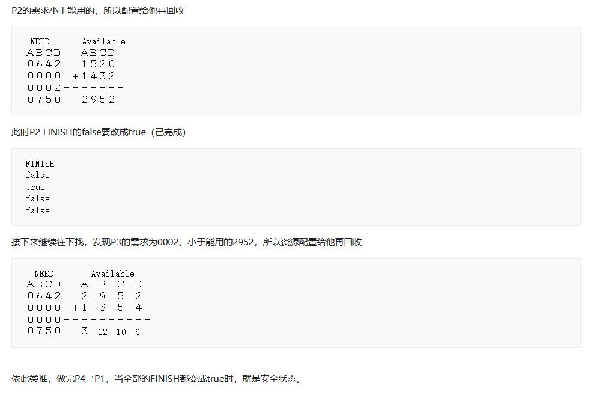

安全状态前面也提到过，在该算法中，如果最终FINISH都变成true，就是安全状态，否则不安全。如果是安全的，那么算法中进行分配的顺序就是实际上操作系统进行资源分配的顺序。如果不安全，则会死锁，不进行分配。

### 死锁的检测

方法是使用资源分配图

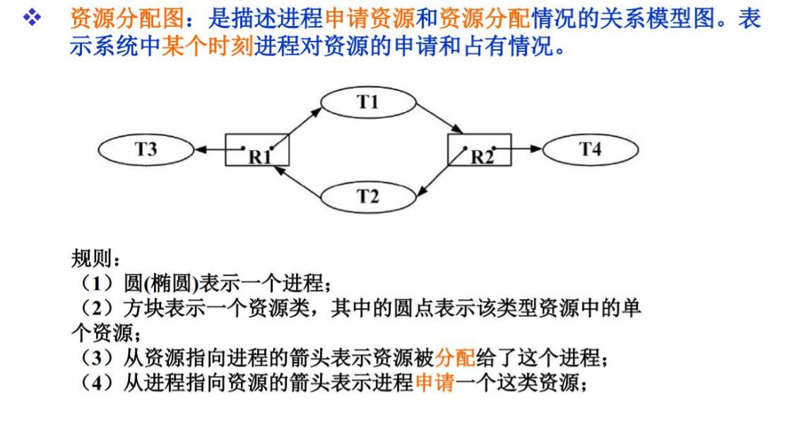

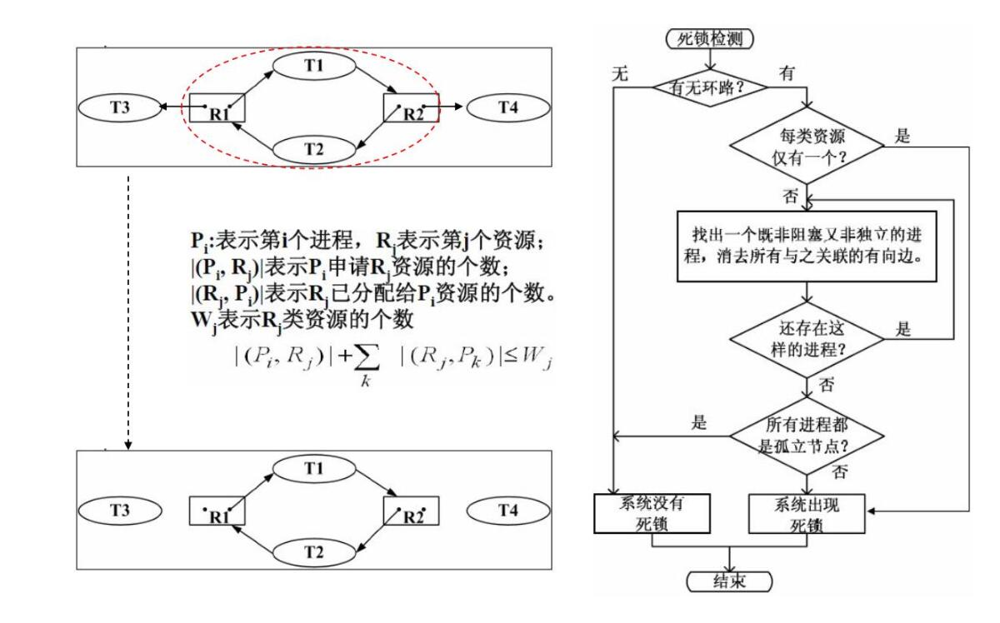

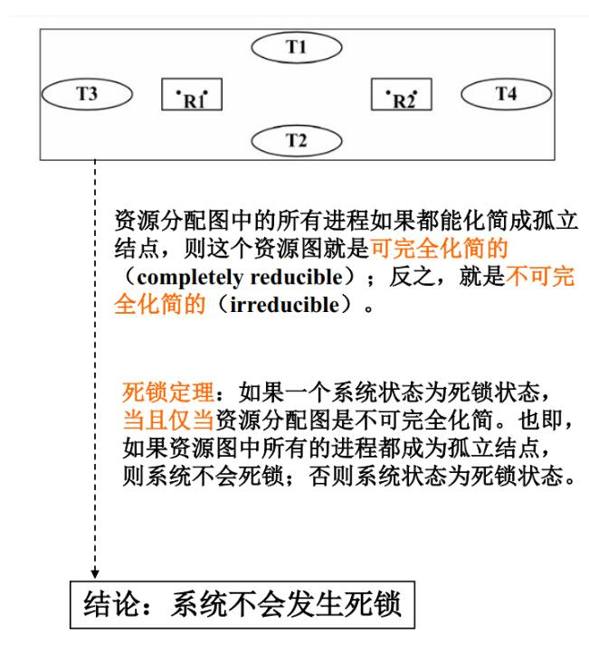

上图中，非阻塞即该进程并没有在等待资源释放。如T3和T4

### 临时资源的死锁检测

临时性资源：即可消耗的资源。如信号、消息、邮件等。其特点是：没有固定数目；不需要释放。

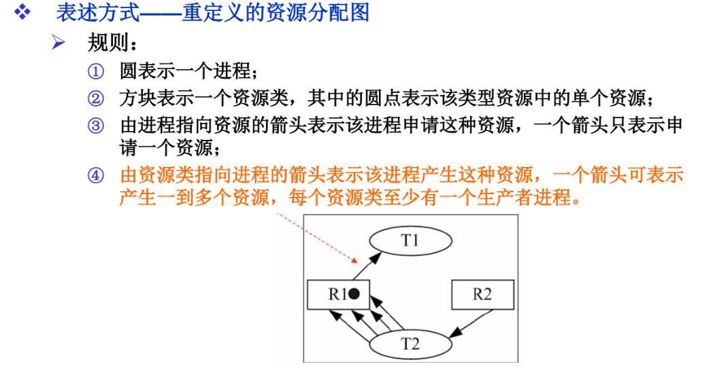

对于临时性资源来讲，它有生产者，生产者会源源不断的产生资源，所以只要生产者不被阻塞，可以认为资源最终一定是充分的，可以满足各消费进程的需要。

所以判断是否会死锁，关键在于判断生产者进程的状态。如果生产者不被阻塞，则总会产生该类资源。

方法：

1. 从没有阻塞的进程入手，删除没有阻塞的进程的请求边，并使资源类中的资源数减1
2. 重复以上步骤，直到：
    1. 图中所有请求边都删除，则不会死锁。
    2. 图中仍存在请求边，但无法化简，则死锁。

TODO

### 死锁的解除

**重新启动**

实现简单，但会造成损失和浪费

**撤销进程**

死锁发生时，系统撤销造成死锁的进程，解除死锁。

一次性撤销所有死锁损失较大。

系统可以先撤销优先级低的、占有资源少的、运行时间短的。

**剥夺资源**

系统保留死锁进程，只剥夺死锁进程占有的资源，直到死锁解除。选择剥夺谁的资源同上。

**进程回退**

死锁时，系统可以根据保存的历史信息，让死锁进程退回到某种之前的状态，直到死锁解除。

实现方法：结合检查点或回退（checkpoint/roolback）机制实现。

系统定期保存所有进程的检查点（即某一时刻的状态）。一旦系统看到某个进程卷入了死锁，该进程就会被终止，剥夺它的资源。然后查看保存点的信息，重建状态，回到上次的检查点执行。

目前发展比较成熟，广泛用于DBMS中。

# 持久性

## 文件

### 基本概念

文件是记录在外存上的，具有符号名的，在逻辑上有完整意义的一组相关信息项的集合。

从用户的角度看，文件是逻辑外存的最小分配单元，即数据只能以文件的形式写入外存。

文件的符号名可以由字母、数字和其他符号组成。符号名一般包括文件名和扩展名。

文件的优点：

1. 用户使用方便。只需要知道文件名即可存取
2. 文件安全可靠。只有通过文件系统才能访问，而文件系统可以有各种安全措施
3. 文件可备份。
4. 文件可共享。

文件由两部分组成

- 文件体：文件的真实内容
- 文件说明（属性）：操作系统为了管理文件所用到的信息。也是文件控制信息。文件目录就主要存放这些东西。
    - 文件名称
    - 文件内部标识符（inode number, inumber）
    - 文件类型
    - 文件位置
    - 文件大小
    - 访问权限
    - ...

文件的类型有很多

- 按后缀分
- 按文件的性质和用途可以分为：系统文件、库文件、用户文件
- 按保护方式分：只读、读写、可执行、不保护
- 按保存期限：临时文件、档案文件、永久文件

### 文件的逻辑结构

指用户所观察到的文件组织形式，它独立于物理特性，又称为文件组织。

分类为：

- 有结构的记录式文件：由一个以上的记录构成。又分为定长记录和变长记录
- 无结构的流式文件：文件没有结构，由一串字符流构成

### 文件的物理结构

指文件在物理设备上的存放方法。

常见的文件存储介质有磁带、光盘、磁盘

**卷**

卷是存储介质的物理单位，对应于一盘磁带、一块软盘、一个光盘、一个硬盘分区

**块**

块是存储介质上连续信息所组成的一个区域，也叫做物理记录。在磁盘上称为扇区。

物理设备保证，对于块的读写是原子的。

**块大小**

### 文件的物理存储方式

**连续存储**

它将逻辑上连续的文件信息依次存放在编号连续的物理块上。

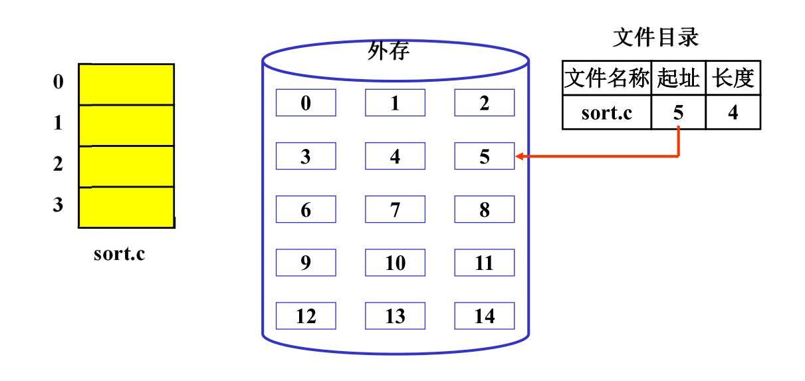

**链式结构**

逻辑上连续的信息在物理块上不一定连续。每个物理块有一个指向下一个物理块的指针

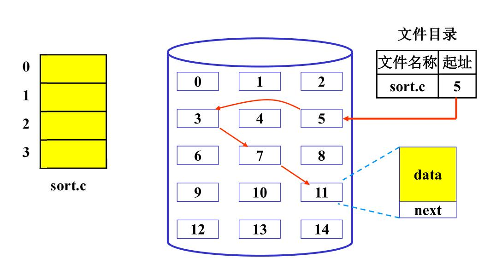

**索引结构**

也是物理上不一定连续，系统为**每个文件**构建一个索引表，索引表中存放文件的逻辑块与物理块的对应关系。索引表放在一个块中。

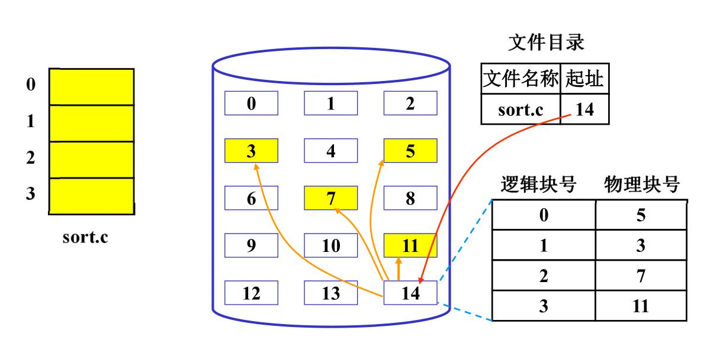

此时，如果只用一个表，表的大小决定了文件的最大大小。

于是我们就要想办法扩展表。

*链接文件方式*

即多个索引表用链接文件的方式串联起来。

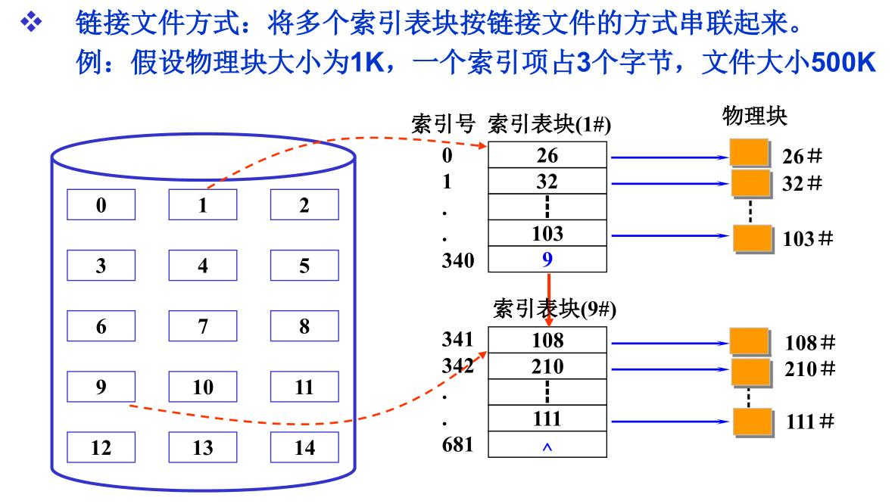

*多重索引方式*

即给索引表建立一个索引表

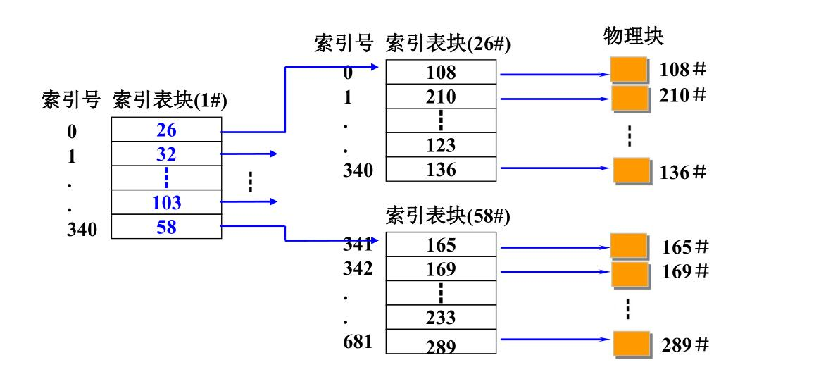

UNIX系统就采用了一种三级索引结构。UNIX文件系统中设置了一类特殊的索引节点，称为inode。inode包含了文件的控制信息

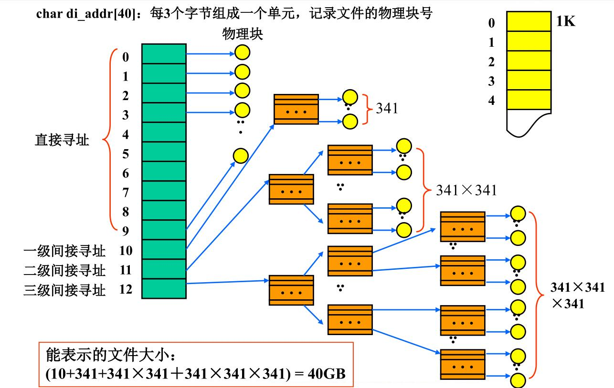

*Hash文件*

采用计算寻址结构，它由主文件和溢出文件组成。

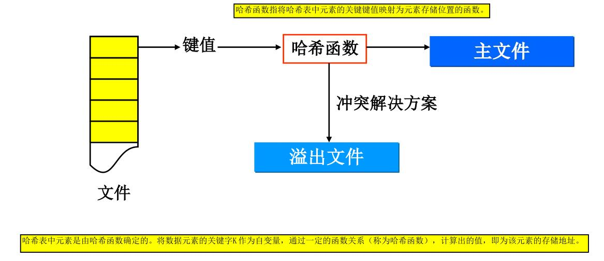

### 文件的存取方式

指读写文件存储器上的一个物理块的方法。分为

- 顺序读取。指对文件中的信息按顺序依次读写的方式。
- 随机读取：
    - 直接存取法：允许用户随意存取文件中任意一个物理记录。
    - 按键存取法：根据文件中各记录的某个数据项内容来存取记录的，这种数据项称之为“键”。


## 文件系统

### 基本概念

文件系统是OS中负责存取和管理信息的模块，它用统一的方式管理用户和系统信息，并提供方便的操作方法。

面向用户的功能

- 文件的按名存取
- 文件的共享和保护
- 文件的操作和使用

OS需要考虑的内容

- 文件目录的建立和维护
- 存储空间的分配和回收
- 数据的保护

### 文件目录

文件目录就是负责管理文件控制信息的地方。

当然文件目录也是放在外存中的，文件目录中的每一条叫做文件控制块（FCB）

文件目录结构的组织方式直接影响到文件的存取速度，关系到文件共享性和安全性，因此组织好文件的目录是设计文件系统的重要环节。

其可以分类为

**一级目录结构**

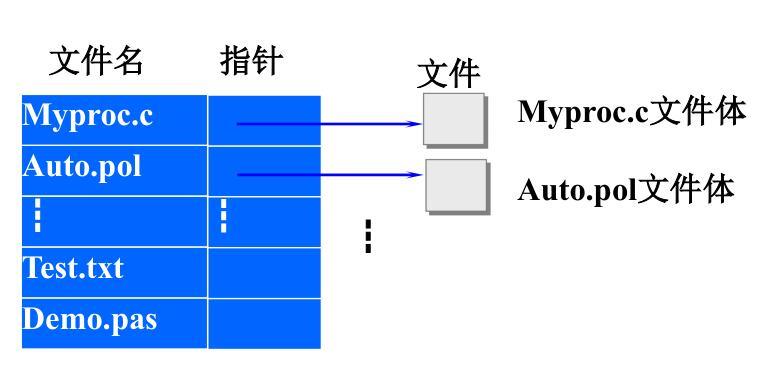

优点是简单

缺点是：查找速度慢、不允许重名、不便于实现文件共享（单用户）

**二级目录结构**

基本上就只解决了多用户问题。不同用户可重名

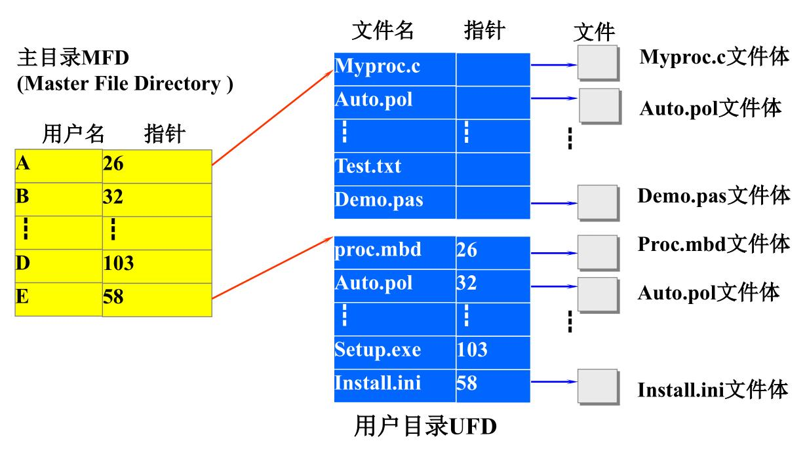

**多级目录结构**

类似于linux的。

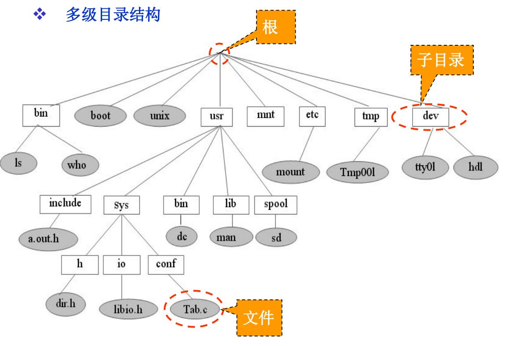

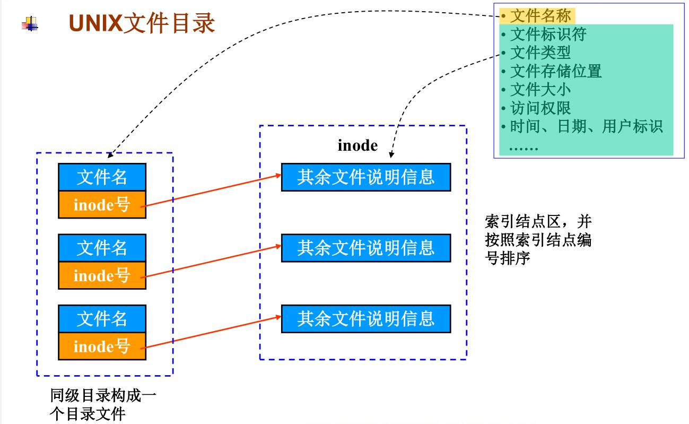

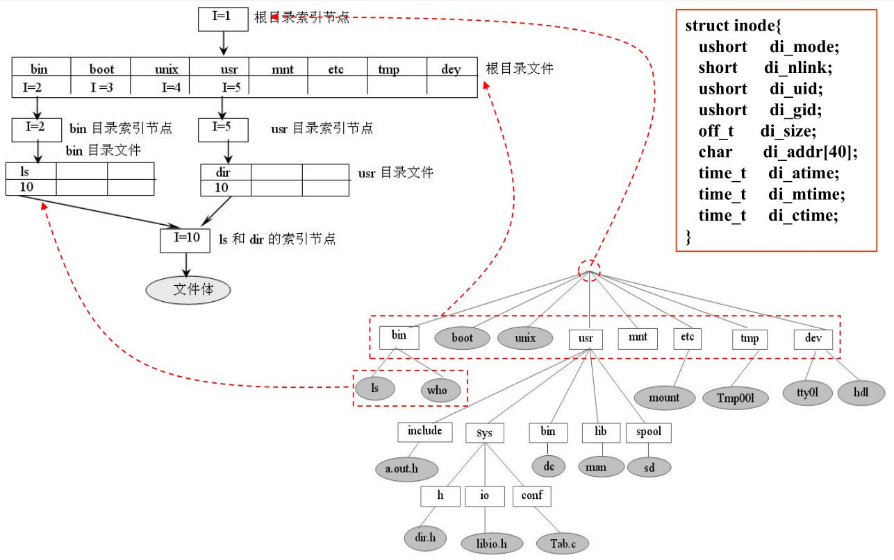

一个目录中的信息只包含文件名和inode号，inode表另外存储。通常文件系统视目录为一个特殊的文件。因此目录也有一个inode，位于inode表中的某处。

另外，每个目录都有一个目录文件。

为了实现“按名存取”，UNIX会使用线性检索法，即一层层往下找。

显然，你得假设根目录的inode号是事先约定的，才能防止为了找根目录inode号必须查询目录文件，而为了找目录文件必须进入根目录的bug。一般根目录的inode号为2

### 文件目录的维护

操作系统在内存设置了一个非常精炼的文件机构，它不是外存文件管理机构的全部映象，而是存储最近正在使用文件的相关信息。

文件打开后由内存的一套管理机构管理，关闭时退出管理机构，所以将这种文件管理机构称为打开文件机构。

**内存文件控制块**

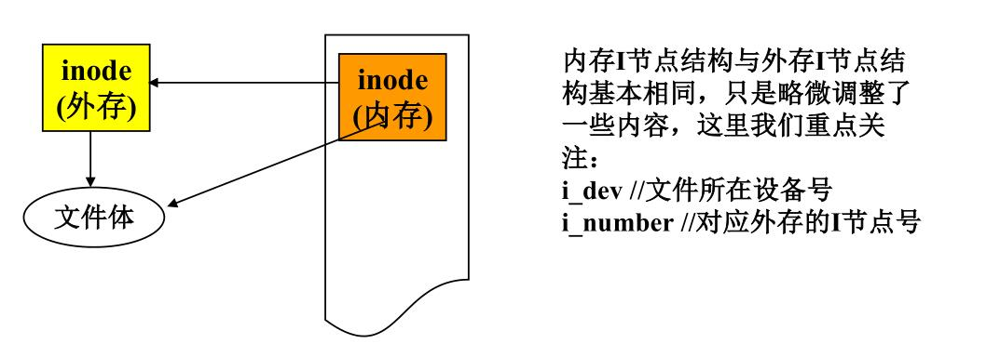

相当于一种Cache了也是。

首先在内存中找inode，如果找不到，就在内存中分配一个空闲表项，填入外存的inode信息。

当需要查询、修改时，直接在内存inode中进行。关闭文件时，如果内存inode被修改过，则把修改更新到外存中。

**系统打开文件表**

系统打开文件表用于记录所有打开文件的控制信息

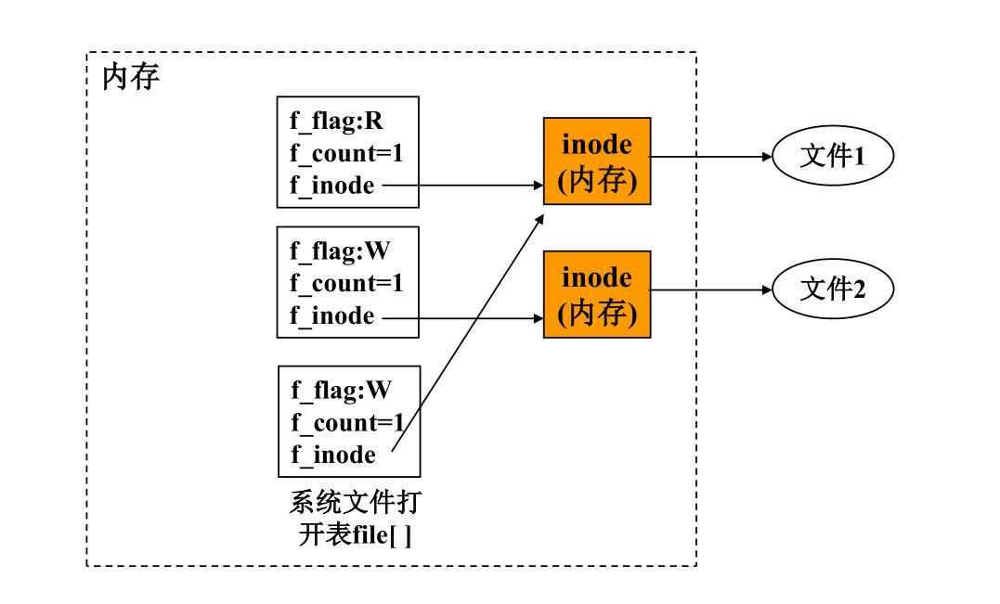

**用户打开文件表**

每一个进程都有一张打开文件表——用户打开文件表。

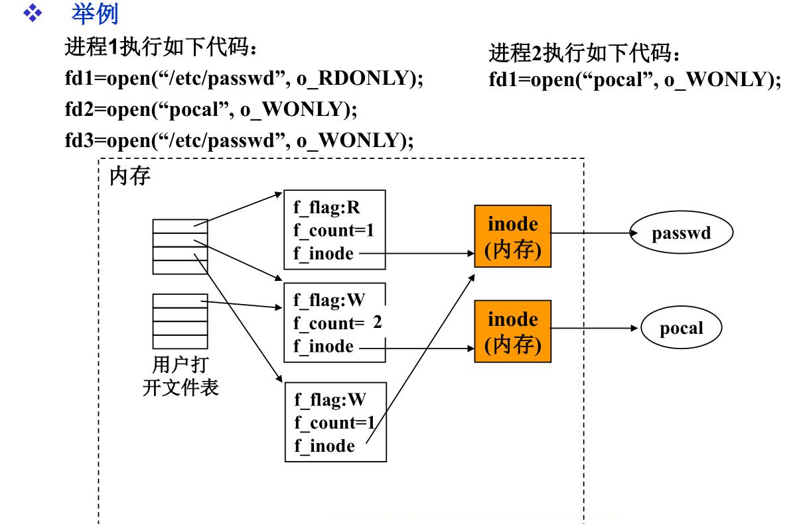

### 外存空间管理

外存和内存很像，也是多用户，需要存储、删除。

外存空闲空间管理的数据结构通常称为磁盘分配表。常用的管理办法有

**空闲区表**

将外存空间上一个连续未分配区域称为“空闲区”。操作系统为磁盘外存上所有空闲区建立一张空闲表，每个表项对应一个空闲区，空闲表中包含序号、空闲区的第一块号、空闲块的块数等信息。

**位示图（bitmap）**

相当于一个vis数组，每一位记录对应物理块的使用情况。0代表空闲，1代表占用。

**空闲块链**

即每个空闲块有一个指针指向下一个空闲块，构成链表。头指针放在一个约定的位置中

**成组链接法**

即缝合空闲表和空闲链表。

将空闲块分成若干组，每100个空闲块为一组。每组的第一个空闲块登记了下一组空闲块的物理盘块号和本组空闲块总数 。

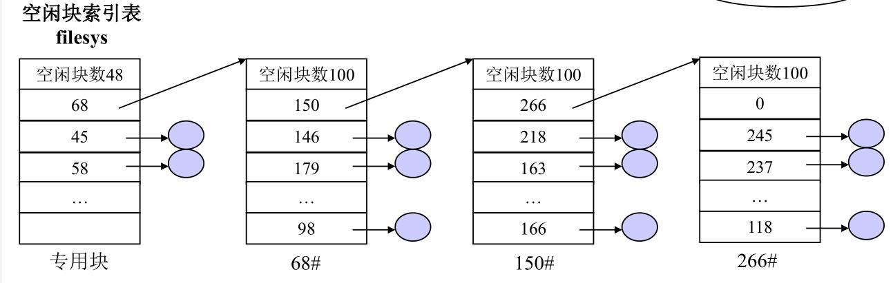

其释放算法如下

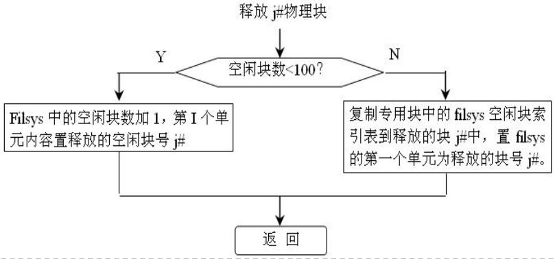

分配算法如下：

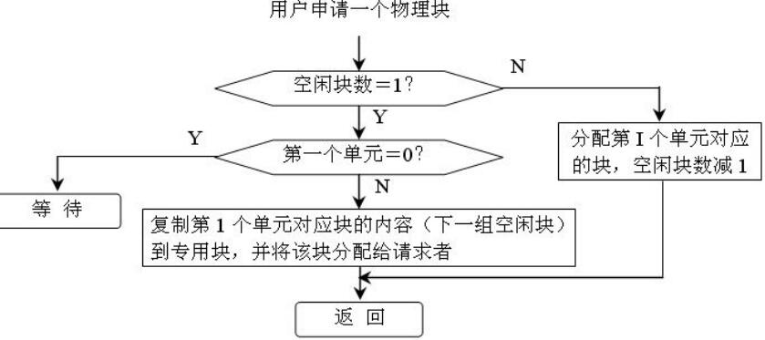

（老师的ppt给的一坨，建议看[https://blog.csdn.net/qq_45744501/article/details/116953538](https://blog.csdn.net/qq_45744501/article/details/116953538)）

### 文件共享

指不同用户或进程使用同一文件，实际上文件的实体只有一个。

UNIX系统的文件名和inode分离，就有助于实现共享。

**静态共享**

一个文件同时属于多个文件目录项，但实际上文件仅仅只有一处物理存储，这种多个文件目录项对应一个文件实体的多对一的关系叫做文件链接。

静态共享中这种关系不管文件此时是否在被使用，都存在。

*硬链接*

硬链接只是在要创建链接的目录中创建了另一个名称，其指向和原有文件相同的inode。因为inode是在特定的文件系统中的，所以不能跨分区。

*软链接/符号链接*

文件的内容为被链接文件的路径名。

**动态共享**

出现在进程共享文件时，伴随着进程的生成而存在，进程的终止而消失。

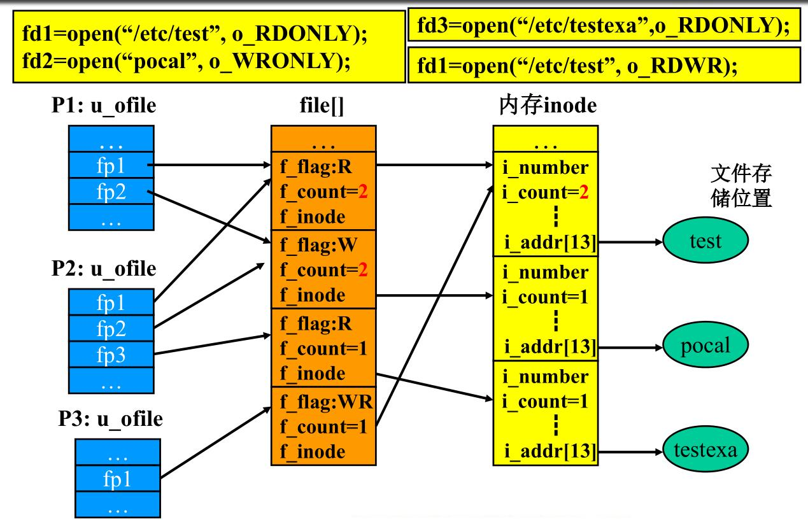

### WINDOWS文件系统实例

TODO

## IO设备管理

### 基本概念

负责计算机与外部的输入输出(I/O)工作的设备为外部设备，简称为外设。

进行管理的目标就是提高设备利用率，提高CPU与I/O设备之间的并行操作程度。为用户提供方便统一的界面。

### IO系统的结构

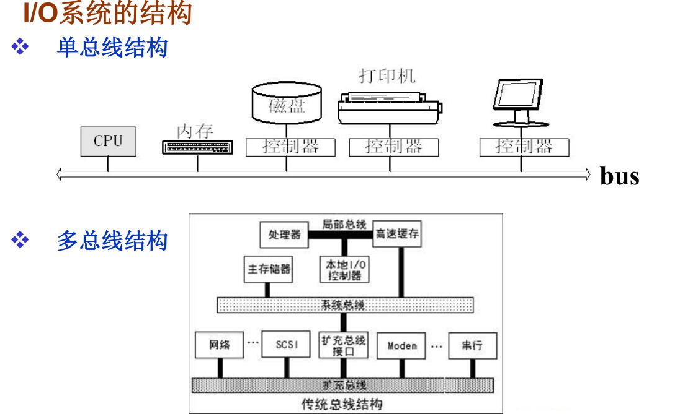

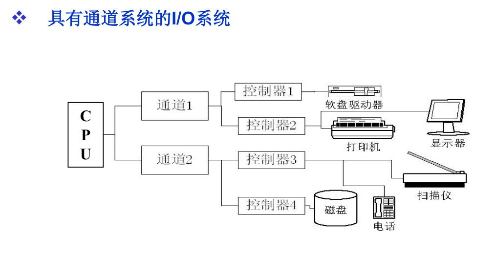

### IO系统的控制方式

**程序控制IO（直接控制方式）**

优点：简单

缺点：CPU的大部分时间都用于对硬件进行查询，效率低下

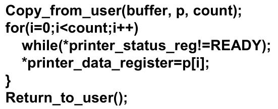

**中断驱动IO**

优点，在外设进行数据处理时，CPU不同等待，可以继续执行。提高了CPU的工作效率，并且可以和设备并行。

缺点是，数据传输仍然要通过CPU进行。如果处理的数据量少（低速设备）还行，如果量大则会长期占用CPU。

**直接存储访问（DMA）IO**

即加个DMA控制器。CPU只用控制DMA控制器来控制IO操作的开始和结束，剩下的数据传输交给DMA控制器进行。适用于高速设备。

**通道控制方式IO**

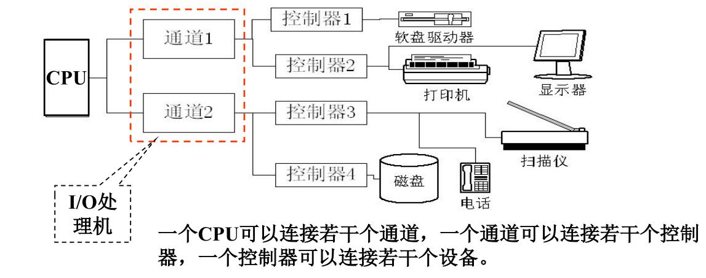

（个人感觉就是用了多个DMA）

解决了I/O操作的独立性和各部件工作的并行性。不仅CPU和通道之间能并行，通道和通道之间也能并行，从而设备之间可以并行。

### IO设备的分类

**按数据组织分类**

- 块设备。以数据块为单位来组织和传递信息。属于有结构设备
    1. 传输速率高
    2. 可寻址，即可随机读
    3. 通常用DMA方式，例如磁盘
- 字符设备。以单个字符为单位来传输数据。属于无结构设备。一般用于数据的输入和输出，例如打印机
    1. 传输速率低
    2. 不可寻址
    3. 通常用中断方式

**按传输速率分类**

- 低速设备。如键盘鼠标麦克风
- 中速设备。如打印机
- 高速设备。如磁带、磁盘、光盘驱动器

**按资源分配方式**

- 独占设备。即一段时间内只允许一个进程访问，大多数都很低速。如打印机。因为独占，所以要互斥地访问。
- 共享设备。即一段时间内可以多个进程访问。如磁盘。
- 虚拟设备。指通过虚拟技术将一台独占设备变换为若干台供多个用户（进程）共享的逻辑设备。

### IO软件的组成

由三部分组成

- I/O交通管制程序。负责各I/O设备之间的协调工作
- I/O调度程序。负责设备的分配和调度
- I/O设备处理程序。负责每类设备的具体操作

其设计目标为

- 设备独立性
- 统一命名

结构分为四层

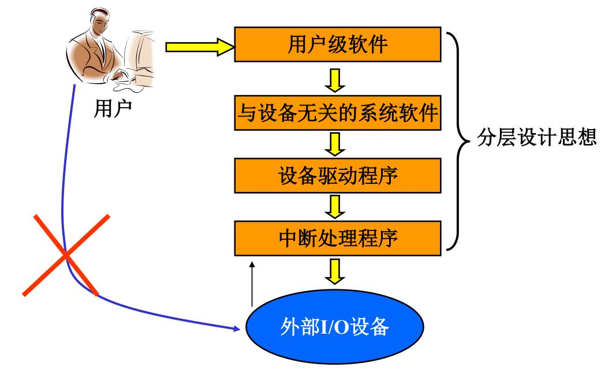

**中断处理程序**

目的：解决高速处理设备和低速输入输出设备之间的矛盾，提高系统工作效率。

**设备驱动程序**

设备驱动程序是直接同硬件打交道的软件模块。其接受自与设备无关的上层软件的抽象请求；进行与设备相关的处理。

具体功能例如

- 控制和监督各I/O控制器的正确执行
- 处理和设备相关的操作
- 缓冲区管理

设备驱动是操作系统底层中唯一知道各种设备控制细节的部分。例如磁盘驱动程序关注磁臂的运动，其他软件则根本不关注。

**与设备无关的系统软件**

是建立在设备驱动程序之上的，与具体设备无关的I/O功能的集合。

- 统一命名
- 设备保护
- 提供与设备无关的逻辑块
- 缓冲管理
- 存储设备的块管理
- 独占设备的分配和释放
- 出错处理
    - 操作故障。由驱动程序处理
    - 非操作故障。由与设备无关的系统软件处理，并向上层返回出错信息

**用户空间的I/O软件**

常见的有

- IO系统调用
- Spooling系统：构成虚拟设备

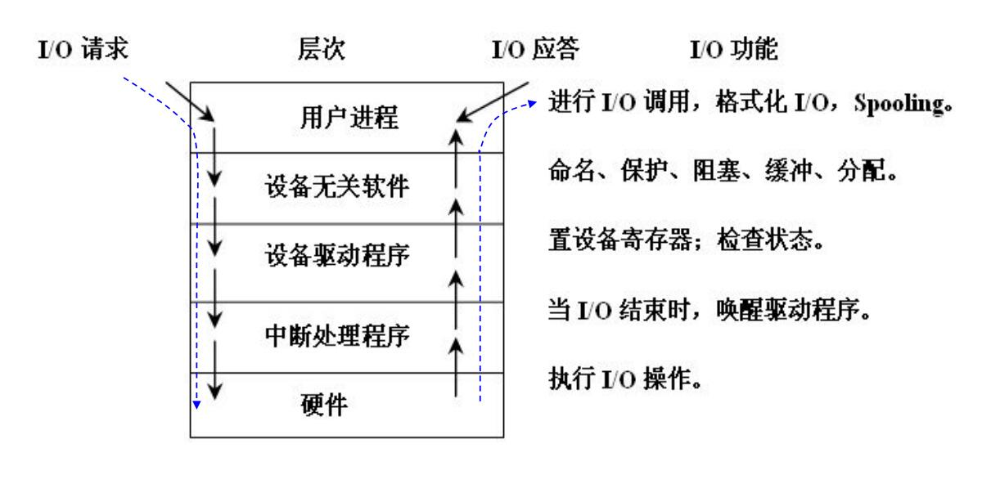

### 具有通道的设备管理

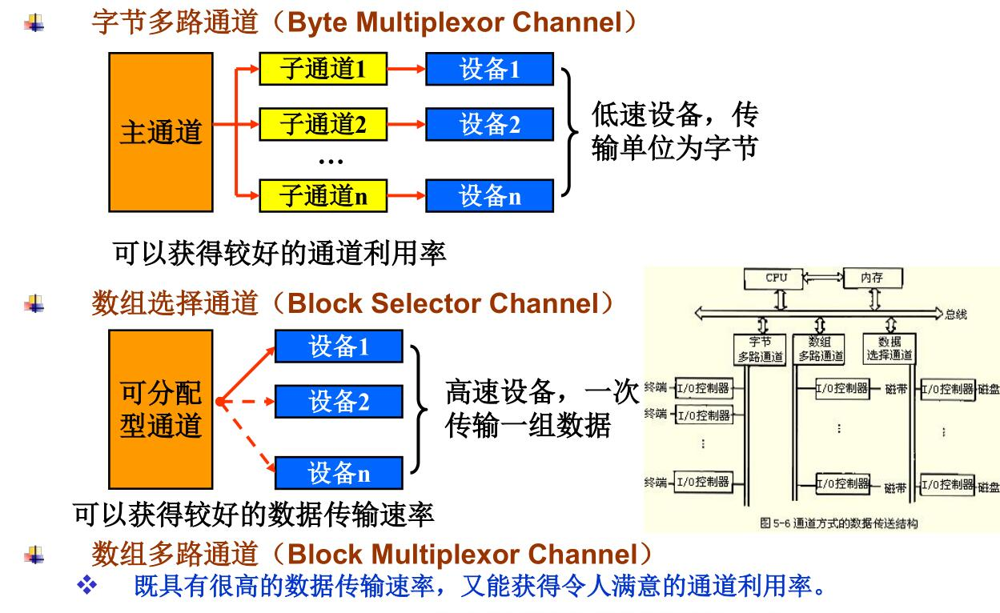

- 通道命令（CCW）。通道又称IO处理机，具有自己的指令系统，其指令叫CCW
- 通道程序。用CCW编写的程序称通道程序
- 通道地址字（CAW）。用来存放通道程序首地址的内存单元称通道地址字
- 通道状态字（CSW）。是通道向操作系统报告工作情况的状态汇集

其操作过程如下

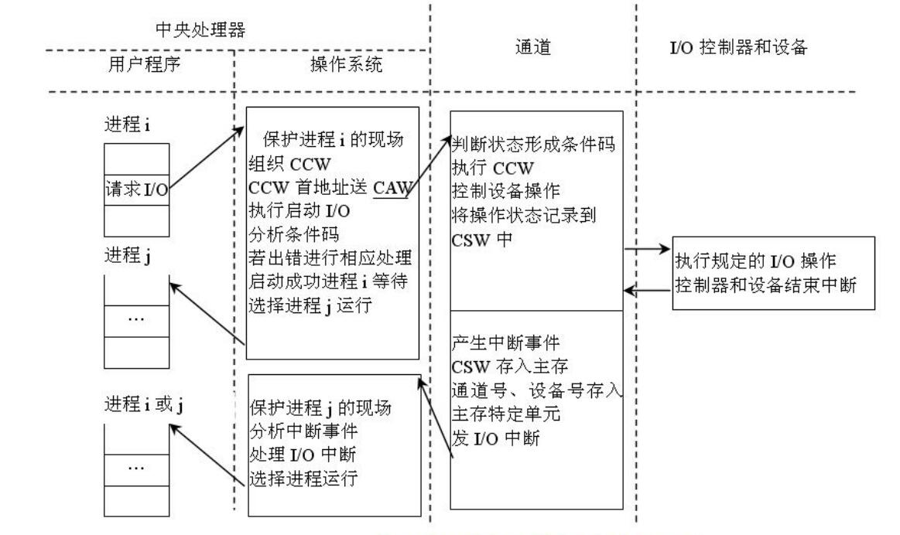

### IO缓冲

缓冲区是一种交换数据的区域

**单缓冲技术**

只设置一个缓冲，CPU和外设轮流使用。

**双缓冲技术**

计算过程、数据输入缓冲的过程、数据传送的过程可以并行。适合于外设速度较高的情况。

例如两个缓冲A，B。IO输入到缓冲A的时候，用户读取B的内容，之后输入到B，用户又读取A。反复交换，不需要轮流等待使用。

**环形缓冲**

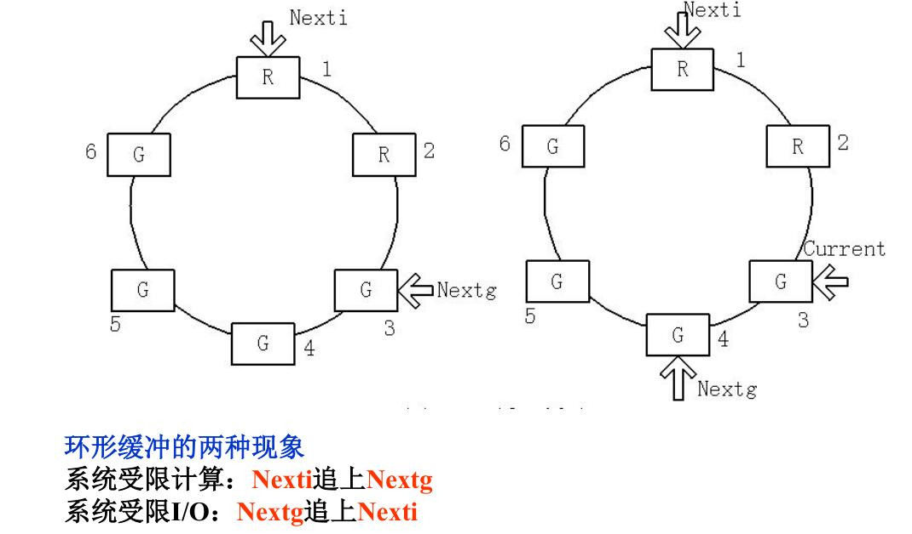

**缓冲池**

可供多个进程共享的双向缓冲技术

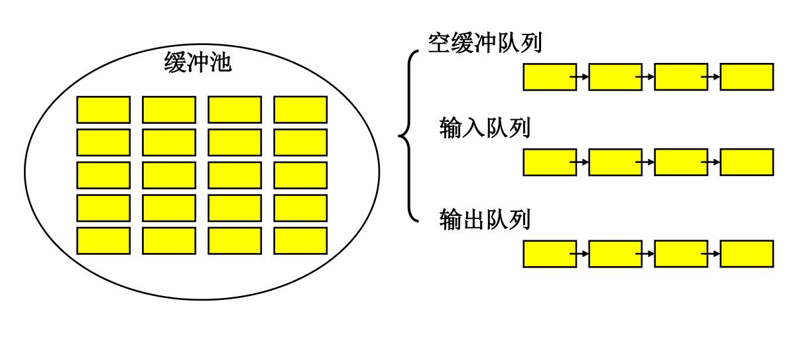

### UNIX设备管理实例

TODO

## 磁盘

### 磁盘调度

影响文件系统性能的因素包括：

- 存储介质
- 磁盘性能的好坏
- 磁盘调度算法的好坏
- 磁盘高速缓冲区的大小

磁盘是一种共享设备，为了保证信息的安全，系统每一时刻只允许一个进程启动磁盘进行I/O操作，其余的进程只能等待。因此合理的设置调度算法就十分重要。

设置调度算法的目标：使各进程对磁盘的平均访问时间最小。

磁盘读取一次的时间分为三个部分

- 寻道时间
- 旋转延迟时间
- 数据传输时间

数据传输很难去在软件层面修改，我们只能修改寻道时间和旋转等待时间。

于是目标就转化为：使磁盘的平均寻道时间最少

要让其最少，就要磁头移动的磁道数平均最少

**FCFS算法**

严格按照进程请求访问磁盘的先后次序进行调度，是一种最简单的磁盘调度算法。

**SSF（最短寻到时间优先）算法**

思想：要求每次访问的磁道与当前磁头所在的磁道距离最近。

优点：移臂次数比FCFS少

缺点：饥饿

**SCAN（电梯调度）算法**

即保持当前磁头的移动方向，直到最远的访问，再调头。

优点：克服了饥饿，并且总寻道时间较短。

**旋转调度算法**

研究当移动臂定位后，如何访问数据的问题。可能有如下情况

- 访问同一磁道上不同编号的扇区
- 访问不同磁道上不同编号的扇区
- 访问不同磁道上相同编号的扇区

当一次移臂调度将移动臂定位到某一柱面后，还可能要进行多次旋转调度才能得到所有数据。

**信息的优化分布**

TODO

# 分布式系统

## 分布式计算机系统

分布式计算机系统(Distributed Computer Systems)是由多个分散的计算机经网络连接而形成的统一的计算机系统。其中各个资源单元(物理的或逻辑的)既相互协同又高度自治

物理资源：包括处理机、输入输出接口、通信接口等。

逻辑资源：进程，文件、数据库等。

其特性有：

- 分布性。资源在物理上是分散的
- 自治性。多个主机都处于平等地位，在物理上独立。
- 透明性。系统的分布性、操作和实现对用户完全透明，
- 共享性。
- 协同性。

其功能为：

- 通信
- 资源共享
- 协同工作

其结构多种多样，如

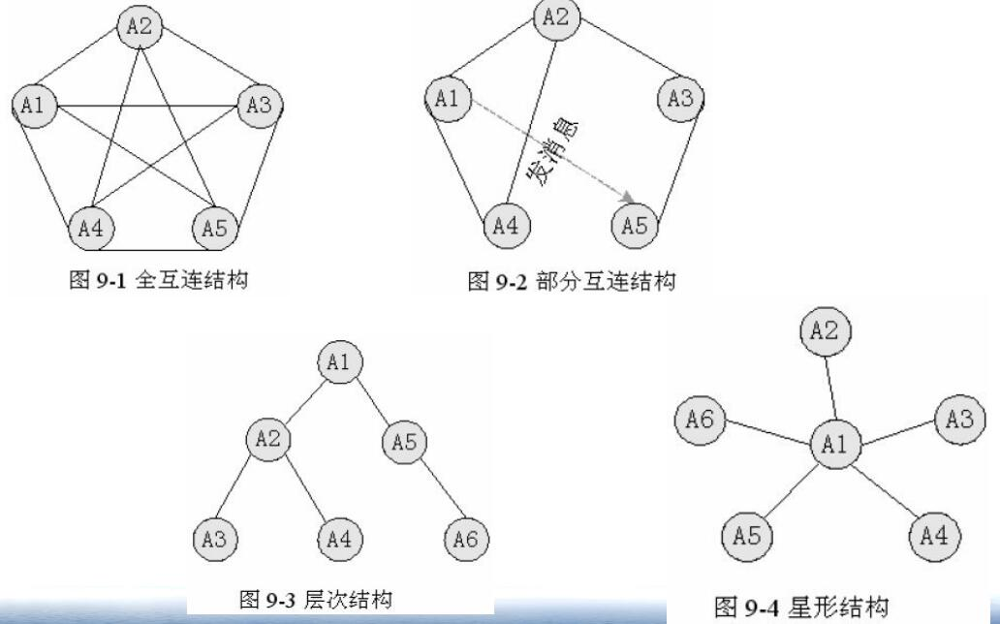

性能衡量标准：

- 基本开销：连接系统中的各个场点要多少花费。
- 通信开销：两个点之间的通信时间
- 可靠性：某台机器出现故障，剩下的机器是否能工作？

## 分布式操作系统

分布式操作系统就是管理分布式系统软硬件资源，是提供具有分布式系统特征的功能和服务的软件系统。

主要特点为：

- 进程通信不能借助公共存储器，因而常采用信息传递方式
- 系统中的资源分布于多个场点
- 不失时机地协调各场点的负载
- 故障检测与恢复及系统重构和可靠性等问题的处理和实现都比较复杂。

## 远程过程调用（RPC）

允许程序调用位于其它节点机器上的过程。

当节点A上的进程想调用节点B上的一个过程时，A上的调用进程被挂起，调用信息以参数的形式从节点A传送到节点B，在B上执行被调用过程，然后将执行的结果返回节点A。对程序员来说，他看不到消息传递过程和I/O处理过程。

# 操作系统安全

## 概述

操作系统的不安全性主要是由于系统设计中的“破绽”所引起的。

1. 网络攻击破坏系统的可用性和完整性。例如网络病毒传播
2. 隐通道破坏系统的保密性和完整性。隐通道是指系统的一个用户通过违反系统安全策略的方式传送信息给另一用户的机制。
3. 无意和偶发性的攻击破坏操作系统的可用性和完整性。包括用户操作上的失误，计算机硬件的故障、其他软件中存在的潜在漏洞，计算机运行环境不达标以及突然断电、火灾等自然灾害

## 安全机制

操作系统安全的主要目标如下：

- 通过安全策略，防止用户对计算机资源的非法使用
- 对用户进行身份识别
- 监督系统运行的安全性
- 保证系统自身的安全性和完整性

### 硬件安全机制

**存储安全**

访问判决基于物理页号的识别

**运行保护**

安全操作系统很重要的一点是进行分层设计，而运行域正是这样一种基于保护环（Protection）的等级式结构。运行域是进程运行的区域，在最内层、具有最小环号的环具有最高特权，而在最外层、具有最大环号的环是最小的特权环。一般的系统不少于3～4个环。

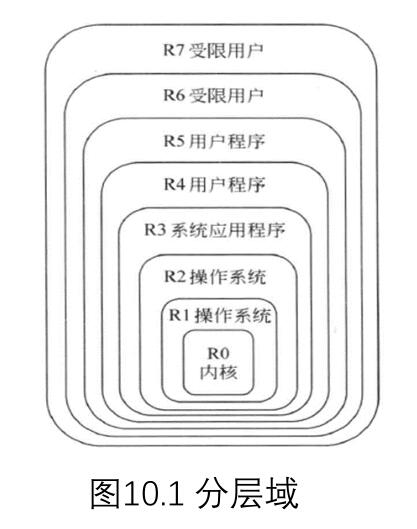

**IO保护**

### 标识与鉴别机制

标识（Identification）就是系统要标识用户的身份，并为每个用户去一个内部名称-用户标识符，用户标识符必须是唯一的且不能被伪造。将用户标识符与用户联系的过程称为鉴别（Authentication），鉴别过程主要用以识别用户的真实身份，要求用户具有能够证明其身份的特殊信息。一般情况下，可以通过多个因素来共同鉴别用户身份的真伪。

常用的方法有：

- 基于密码的身份验证
- 基于令牌的身份验证
- 生物特征识别认证

### 访问控制机制

目标是防止非法用户进入系统和合法用户对系统资源的非法使用。访问控制常以
用户身份认证为前提。

如果说用户标识与鉴别机制解决的是“你是谁？你宣称的身份是否真实？”，访问控制技术解决的就是“你能做什么？你有什么样的权限？”

常用的策略有

- 自主访问控制（DAC）。传统方法
- 强制访问控制（MAC）。从军事信息安全中演化出来
- 基于角色的访问控制（RBAC）。越来越受欢迎

### 最小权限管理

系统不应给用户/管理员超过执行任务所需权限以外的权限，如将超级用户的权限划分为一
组细粒度的权限，分别授予不同的系统操作员/管理员，使各种系统操作员/管理员只具有完成其任务所需的权限，从而减少由于权限用户口令丢失或错误软件、恶意软件、误操作引起的损失。

### 可信路径

用户必须确实与安全核心通信，而不是与一个特洛伊木马打交道。系统必须防止特洛伊木马模仿登录过程，窃取用户的口令。可信路径提供了一种确保安全通信的方法。

### 审计

审计就是对系统中有关安全的活动进行记录、检查及审核。审计作为一种事后追查的手段来保证系统的安全

## Linux的安全性实例

### PAM机制

PAM即可插拔认证模块。是一种高效而且灵活便利的用户级别的认证方式。

PAM最大的特点是实现了服务程序和认证机制的分离，它采用模块化设计和插件功能，使得我们可以轻易地在应用程序中插入新的鉴别模块或替换原先的组件，而不必对应用程序做任何修改，从而使软件的定制、维持和升级更加轻松——因为鉴别机制与应用程序之间相对独立。

### 文件系统加密

较有代表性的是TCFS（Transparent Cryptographic File System）。它通过将加密服务和文件系统紧密集成，使用户感觉不到文件的加密过程。TCFS不修改文件系统的数据结构，备份与修复以及用户访问保密文件的语义也不变。

### 网络监控与入侵检测

包括让Linux记录入侵企图，当攻击发生时及时通知管理员；让Linux在规定情况的攻击发生时，采取事先确定的措施；让Linux发出一些错误信息，比如模仿成其他操作系统，以增加攻击者的攻击难度。

### 强制访问控制

没讲细节

### 安全审计

Linux还可以进行检测、记录时间信息和网络连接情况。这些信息将被重定
向到日志中备查。

### 防火墙机制

防火墙是在被保护网络和因特网之间，或者在其他网络之间限制访问的一种部件或一系列部件。Linux防火墙系统提供了如下功能：

1. 访问控制
2. 审计
3. 抗攻击
4. 其他附属功能。如与审计相关的报警和入侵检测，与访问控制相关的身份验证、加密和认证，甚至VPN等
