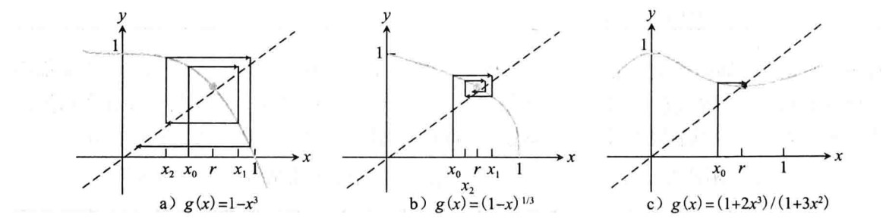

# 基础知识

## 多项式求值

对于形如下式的多项式

$$
P(x)=2x^4+3x^3-3x^2+5x-1
$$

如果我们普通地代入计算，则会需要计算10次乘法，以及4次加法。这显然不是最优的，更优的方法例如秦九韶算法，将多项式重写为

$$
P(x)=-1+x*(5+x*(-3+x*(3+x*2)))
$$

此时再代入值计算，则只用4次乘法和4次加法。一般来说$d$阶多项式可以通过$d$次乘法和$d$次加法求值。

标准形式的多项式

$$
P(x) = c_1+c_2x+c_3x^2+c_4x^3+c_5x^4
$$

可以写成

$$
P(x)=c_1+x(c_2+x(c_3+x(c_4+x(c_5))))
$$

或者也有更一般的形式，可以用于之后的插值计算

$$
P(x)=c_1+(x-r_1)(c_2+(x-r_2)(c_3+(x-r_3)(c_4+(x-r_4)(c_5))))
$$

其中称$r1,r2,r3,r4$为基点。

## 二进制数字

二进制数字可以表示为：

$$
\cdots b_2b_1b_0b_{-1}b_{-2}\cdots
$$

其等价于十进制下的

$$
\cdots b_22^2+b_12^1+b_02^0+b_{-1}2^{-1}+b_{-2}2^{-2}\cdots
$$

### 十进制转化为二进制

例如$53.7$转化为二进制，可以拆分为整数部分和小数部分，分别转化，然后在拼接起来。

**整数部分**

将整数连续除以$2$，记录余数，直到整数最后变为$0$，余数反过来排列在一起就是二进制表示。例如

$$
53\div 2 = 26\cdots1
$$

$$
26\div 2 = 13\cdots0
$$

$$
13\div 2 = 6\cdots1
$$

$$
6\div 2 = 3\cdots0
$$

$$
3\div 2 = 1\cdots1
$$

$$
1\div 2 = 0\cdots1
$$

那么二进制表示就是$110101$

**小数部分**

将小数部分不断乘以$2$，得到的结果保留整数部分，直到小数部分为$0$，整数部分顺序排列即为小数部分的二进制表示

例如

$$
0.7*2 = 0.4+1
$$

$$
0.4*2 = 0.8+0
$$

$$
0.8*2 = 0.6+1
$$

$$
0.6*2 = 0.2+1
$$

$$
0.2*2 = 0.4+0
$$

$$
0.4*2 = 0.8+0
$$

$$
\vdots
$$

后面重复，代表在二进制中是无限循环小数。有$(0.7)_{10}=(0.1\overline{0110})_2$

最后有$(53.7)_{10} = (110101.1\overline{0110})_2$。

### 二进制转化为十进制

开头已经介绍过一般情况，对于有限小数是容易计算的。

无限小数时，例如$x=(0.\overline{1011})_2$，先左移$4$位，再减去原始的$x$，有

$$
2^4x = 1011.\overline{1011}\\
x=0000.\overline{1011}
$$

相减得

$$
(2^4-1)x = (1101)_2 = (11)_{10}
$$

求解$x$可得，$x=(0.\overline{1011})_2=11/15$。

## 实数的浮点表示

本节按照IEEE754标准。

### 浮点格式

一个浮点数字包含三个部分：符号（正负）、尾数（包含一串有效数位）和一个指数，这些部分都在一个计算机字(WORD)里。

浮点数常用三种精度级别：单精度、双精度、扩展精度。它们分配的数位分别是32、64、80。具体如下

|   精度    |   符号   |  指数  | 尾数 |
| :-: | :-: | :-: | :-: |
|  单精度  | 1 | 8 | 23 |
| 双精度 | 1 | 11 | 52 |
| 扩展精度 | 1 | 15 | 64 |

三种精度以相同的方式运行。标准化的IEEE浮点数表示为

$$
\pm 1.bbb\cdots b\times 2^p
$$

其中$N$个$b$或0或1，$p$是一个$M$位的二进制数表示指数。最左边的一位（主导数位）必须是$1$。

当一个二进制数用一个标准浮点数字表示的时候，它被称为“左对齐”，意味着其中最左边的一个数位$1$被平移到小数点的左边，平移通过指数的变化来补偿，例如，十进制数$9$，对应的二进制数$1001$保存为

$$
+1.001\times 2^3
$$

以双精度（$M=11,N=52$）为例，1的双精度表示为

$$
+1.0000000000000000000000000000000000000000000000000000\times 2^0
$$

其中有52位尾数，下一个比$1$大的浮点数是

$$
+1.0000000000000000000000000000000000000000000000000001\times 2^0
$$

或者说是$1+2^{-52}$

**定义1**

机器精度对应的数字，记作$\varepsilon_{math}$，是$1$和比$1$大的最小浮点数之间的距离。对于双精度来说就是$2^{-52}$

如果一个小数是无限小数，或者是超过了52位的小数，IEEE规定，如果在第53位为0，则52位以后的全部社区，如果53位为1，则在52位上加1。特别的，如果第53位为1，其后所有已知位为0，那么当且仅当52位是1时在52位上加1。

上述方法称为IEEE舍入最近法则。

**定义2**

将IEEE双精度浮点数字记做$x$，利用舍入最近法则记做$fl(x)$

在计算机算术中，实数$x$用一串数位$fl(x)$替换。根据这个定义，$9.4$在二进制中表示如下

$$
+1.0010110011001100110011001100110011001100110011001100|110\cdots\times 2^3
$$

则$fl(9.4)$表示为

$$
+1.0010110011001100110011001100110011001100110011001101\cdots\times 2^3
$$

我们通过去掉最右边无穷长的数字尾巴$0.\overline{1100}\times 2^{-52}\times 2^3=\overline{0.0110}\times 2^{-51}\times 2^3=0.4\times 2^{-48}$得到浮点表达。并在舍入过程中加上$2^{-52}\times 2^3=2^{-49}$。因而

$$
fl(9.4) = 9.4+2^{-49}-0.4\times 2^{-48}\\
=9.4+(1-0.8)2^{-49}\\
=9.4+0.2\times 2^{-49}
$$

换句话说，将$9.4$保存为双精度浮点数时可能产生了$0.2\times 2^{-49}$的误差，我们把它称作舍入误差。

**定义3**

令$x_c$是计算版本$x$的精确度量，则

$$
绝对误差=|x_c-x|
$$

$$
相对误差=\frac{|x_c-x|}{|x|}(x\neq 0)
$$

**相对舍入误差**

在IEEE机器算术模型中，$fl(x)$的相对舍入误差不会比机器精度的一半大：

$$
\frac{|fl(x)-x|}{|x|}\leq \frac{1}{2}\varepsilon_{math}
$$

### 浮点数的机器表示

每个双精度浮点数字被分配了8字节，或者说64位，来存储对应的三个部分。每个字都有如下形式

$$
se_1e_2\cdots e_{11}b_1b_2\cdots b_{52}
$$

其中第1位保存了符号位，后面11位用于保存指数，再后面小数点后的52位保存尾数。符号位0是正数，1是负数。11位指数表示的正二进制整数，这些正数通过往指数上叠加$2^10-1=1023$得到，指数范围在$-1022$和$1023$之间，$e_1\cdots e_{11}$覆盖了从$1$到$2046$之间对应的指数，由于特殊目的，没有使用$0$和$2047$。

数字$1023$称为双精度格式的指数偏差。它被用于把正和负指数转化为正的二进制数保存在指数位中，对于单精度和扩展精度，指数偏差位分别是127和16383.

也就是说，指数位上的数字，减去1023才是浮点数中所应该是的指数。

再来看特殊值$2047$。如果尾数位串都是0，则用于表示$\infty$（其符号取决于第一位），否则表示$NaN$，意为不是一个数字。

例如$1/0$是$+\inf$，前$12$位用十六进制表示为7FF，后面全是0.

$-1/0$是$-\inf$，前$12$位用十六进制表示为FFF，后面全是0.

$0/0$是$NaN$，前$12$位用十六进制表示为FFF，后面不全是0.

再来看特殊值$0$，意味着$e_1e_2\cdots e_{11}=(000 0000 0000)_2$。其表示一个非标准浮点数

$$
\pm 0.b_1b_2\cdots b_{52}\times 2^{-1022}
$$

由上可见，第一位不再假设为1.这样的非标准化数字称作异常浮点数字。这样就扩展了数字的表示范围，因而，最小的可表达的双精度数字是$2^{-52}\times 2^{-1022}$。

另外$+0,-0$也是一个异常数字。计算中它们被看作是相同的两个实数。

### 浮点数加法

首先对齐进行加法的两个数字的小数点位，接着相加，然后把结果保存为浮点数字。

在加法寄存器中，可以进行超过52位的加法，但是在相加之后必须舍入变回52位。

## 有效数字缺失

有一个主要问题以多种形式出现，该问题是由于对近似相等的两个数字相减造成有效数字的位数减少。

例如$123.4567-123.4566=0.0001$，有效数字从原来的七位减少到一位。

很多情况下我们可以通过重新构造计算来解决这个问题。

**例1**

在三位小数的计算机上计算$\sqrt{9.01}-3$

正确的结果接近$1.6662\times 10^{-3}$，但当我们使用三位有效数字时，由于$\sqrt{9.01}\approx 3.0016662$，保存三位有效数字时得到$3.00$。再减去$3.00$，得到$0.00$，没有一个有效数位是正确的。

但是我们可以用以下方法挽救

$$
\sqrt{9.01}-3 = \frac{(\sqrt{9.01}-3)(\sqrt{9.01}+3)}{\sqrt{9.01}+3}=\frac{9.01-9}{\sqrt{9.01}+3}
$$

$$
=\frac{0.01}{3.00+3.00}=\frac{0.01}{6}=0.00167\approx 1.67\times 10^{-3}
$$

这种方法本质上是一个窍门。称作“共轭等式”。通常会使用一些特定的恒等式，例如三角恒等式。

例如

$$
E_1=\frac{1-cosx}{sin^2x},E_2=\frac{1}{1+cosx}
$$

两个式子虽然等价，但是在数值计算上，输入一个较为靠近0的数，则第二个比第一个精度高。

**例2**

解方程$ax^2+bx+c=0$

对于最基础的求根公式

$$
x=\frac{-b\pm \sqrt{b^2-4ac}}{2a}
$$

其中间取负号问题可能不大，但是取正号时，如果$ac$相对于$b^2$非常小，则分式上面会直接舍入等于0，造成整个结果等于0.

为了解决这个问题，可以在$b$是正数时

$$
x_1=-\frac{b+\sqrt{b^2-4ac}}{2a},x_1=-\frac{2c}{b+\sqrt{b^2-4ac}}
$$

$b$是负数时

$$
x_1=\frac{-b+\sqrt{b^2-4ac}}{2a},x_1=\frac{2c}{-b+\sqrt{b^2-4ac}}
$$

## 微积分回顾

书中回顾了函数的连续性、罗尔定理、拉格朗日中值定理、泰勒展开、积分中值定理等。

# 求解方程

## 二分法

### 方法

**定义1**

如果$f(r)=0$，函数$f(x)$在$x=r$时有一个根。

**定理1**

根据函数的连续性，我们知道，如果一个函数是连续的（在[a,b]上），并且在$a<b$时有$f(a)f(b)<0$，那么函数在$(a,b)$之间至少有一个根$r$使得$f(r)=0$

显然，我们可以判断$c=(b+a)/2$时$f(a)f(c)$的符号来判断根具体在$[a,c]$还是$[c,b]$之中

由此我们就可以得到一个求出根的伪代码

```
二分法
给定初始区间[a,b]使得f(a)f(b)<0

while (b-a)/2>TOL
    c = (a+b)/2
    if f(c)=0,stop,end
    if f(a)f(c)<0
        b = c
    else
        a = c
    end
end

最终的区间[a,b]中包含一个根
近似根为(a+b)/2
```

显然我们求出的是一个区间$[a,b]$，有一个根在其中，我们只能估计一个值。另外代码中的TOL指的是精度，即这个根在$(a+b)/2\pm TOL$这个范围内。

### 分析

现在来分析二分法的精确度和收敛速度。

假设$[a,b]$是初始区间，在$n$次二分之后，得到的最终区间$[a_n,b_n]$的长度为$(b-a)/2^n$。选择中点$x_c=(a_n+b_n)/2$为解的最优估计值，与真实值的误差不会超过区间长度的一般。总之，n步二分法之后，我们得到

$$
求解误差=|x_c-r|<\frac{b-a}{2^{n+1}}
$$

$$
函数计算次数=n+2
$$

对于其精度，每一次函数计算后，解的不确定性都会减少一半。

**定义2**

如果误差小于$0.5\times 10^{-p}$，解精确到小数点后$p$位。

## 不动点迭代

举一个例子，以弧度制计算$\cos$。以任意值代入，比如我们代入$1$.有$cos1=0.5403\cdots$，再将结果代入，有$cos(cos1)=0.85755\cdots$，以此类推，多次代入后，我们发现无论初始值是多少，最后都会收敛到$0.7390851332\cdots$

### 函数的不动点

**定义1**

当$g(r)=r$，实数$r$是函数$g$的不动点。

例如，我们求解$\cos x-x=0$的方程，用不动点的视角来看，就是求解$\cos x=x$，或者说求解$\cos x$的不动点。

一旦方程写做$g(x)=x$，从一个初始估计$x_0$开始进行不动点迭代过程，对函数$g$进行迭代，

$$
x_1=g(x_0)\\
x_2=g(x_1)\\
x_3=g(x_2)\\
\vdots
$$

依此下去。当进行无穷多步迭代后序列$x_i$可能收敛，也可能不收敛。但是，如果函数$g$是一个连续函数并且$x_i$收敛，收敛到一个数字$r$，那么$r$就是对应的不动点。意味着

$$
g(r) = g(\lim_{i\to\infty}x_i)=\lim_{i\to\infty}g(x_i) = \lim_{i\to\infty}x_{i+1}=r
$$

所有方程$f(x)=0$都能转化为$g(x)=x$来不动点迭代吗？答案是肯定的。

虽然都能迭代，但不总是能收敛的。

例如$x^3+x-1=0$换成$x=1-x^3$来迭代，最后结果就会在$1,0$之间摆动，这是因为$g(0)=1,g(1)=0$。

但是，如果使用$x=\sqrt[3]{1-x}$来迭代，就可以求出正确的不动点$x=0.6823\cdots$。迭代了大概25次。

如果使用$x=(1+2x^3)/(1+3x^2)$，也可以收敛，并且只需要迭代4次就可以得到$x=0.6823\cdots$。

### 不动点迭代几何

我们要解释出现上述差异的原因。

如下图，将$g(x),x$画在同一坐标系下，其中交点就是不动点，图中的箭头代表迭代过程。这种表示又被称作cobweb图。



图$a$中迭代逐渐远离了不动点，而$b,c$两图，迭代都在不断靠近不动点。

由图我们猜测迭代收敛与否和$g(x)$在不动点附近的斜率有关。

### 不动点迭代的线性收敛

以$g_1(x)=-\frac{3}{2}x+\frac{5}{2},g_2(x)=-\frac{1}{2}x+\frac{3}{2}$为例。它们的不动点都是$x=1$。

我们把$g(x)$写作$x-r$的形式，其中$r=1$：

$$
g_1(x)=-\frac{3}{2}(x-1)+1\\
g_1(x)-1=-\frac{3}{2}(x-1)\\
x_{i+1}-1=-\frac{3}{2}(x_i-1)
$$

如果我们把$e_i=|r-x_i|$作为第$i$步时的误差，可以看到上式的误差是$e_{i+1}=3e_i/2$，意味着误差越来越大，也就是发散。

对于$g_2(x)$有

$$
x_{i+1}-1=-\frac{1}{2}(x_i-1)
$$

$e_{i+1}=e_i/2$，误差越来越小，就是收敛。

**定义2**

令$e_i$表示迭代过程中第$i$步时的误差，如果

$$
\lim_{i\to\infty}\frac{e_{i+1}}{e_i}=S<1
$$

该方法被称为满足线性收敛，收敛速度为$S$。

这样的推理过程也可以适用于更加一般的连续可微函数

**定理1**

假设函数$g$是连续可微函数，$g(r)=r,S=|g'(r)|<1$，则不动点迭代对于一个足够接近$r$的初始估计，以速度$S$线性收敛到不动点$r$。

**定义3**

如果迭代方法对于一个足够接近$r$的初值能收敛到$r$，该迭代方法称为局部收敛到$r$。

### 终止条件

同二分法不同，FPI没有误差与迭代次数的关系公式，必须决定何时终止算法，这称为终止条件。

对于一组容差$TOL$，我们可能使用绝对终止条件

$$
|x_{i+1}-x_i|<TOL
$$

当解不在$0$附件时可以使用相对误差条件

$$
\frac{|x_{i+1}-x_i|}{|x_{i+1}|}<TOL
$$

还有混合绝对/相对误差终止条件

$$
\frac{|x_{i+1}-x_i|}{max(|x_{i+1}|,\theta)}<TOL
$$

其中$\theta>0$，常常用于$0$附近的解。此外，如果收敛失败，一个好的FPI也应该设置迭代次数上限。

二分法可以保证线性收敛，不动点迭代仅仅是局部收敛。不动点迭代收敛时，是线性收敛。二分法每次可以去掉$1/2$的不确定性，而FPI的不确定性每次会乘上$S=|g'(r)|$，因此可能比二分法更快或更慢，依赖于$S$比$1/2$更大还是更小。

## 精度的极限

### 前向与后向误差

**定义1**

假设$f$是一个函数，$r$是一个根，意味着满足$f(r)=0$。假设$x_a$是$r$的近似值。对于根求解问题，近似$x_a$的后向误差是$|f(x_a)|$，前向误差是$|r-x_a|$。

举个例子，求解以下函数的根

$$
f(x) = x^3-2x^2+\frac{4}{3}x-\frac{8}{27}
$$

我们可以通过手算验证$2/3$是它的根。

当我们使用双精度浮点数去二分法求解时，最后可能解出$r=0.6666641$，并且到此结束，因为此时$f(r)=0$，意味着其等于机器$0$。在这$2/3\pm 10^{-5}$的范围上，其函数值都等于机器$0$。

事实上，$r$的后向误差接近$\varepsilon_{math}=2.2\times 10^{-16}$，而前向误差在大约$10^{-5}$。双精度不能在机器精度的相对误差下可靠计算，从而导致了一个范围内的数最终都等于机器$0$。

事实上$2/3$是这个函数的三重根

**定义2**

假设$r$是可微函数$f$的根，如果$0=f(r)=f'(r)=f''(r)=\cdots=f^{(m-1)}(r)$，但是$f^{(m)}(r)\neq 0$，就说$f$在$r$点具有$m$重根。多于一个根的叫重根，只有一个根的叫单根。

由于函数在多根附近十分平缓，前向和后向误差之间在近似解的附近存在很大的不一致。后向误差在垂直方向进行度量，通常比在水平方向度量的前向误差小得多。

前向和后向误差的讨论和方程求解器的终止条件有关。我们有两种方法更加接近方程的根

1. 使得$|x_a-r|$足够小
2. 使得$|f(x_a)|$足够小

具体选择使用哪一种，取决于问题所处的环境。对于二分法，两种误差都可以观察到。而FPI只能知道后向误差，而不可能知道前向误差。

### 威尔金森多项式

一个难以进行数值求解的单根例子在威尔金森的论著中进行了讨论，威尔金森多项式是

$$
W(x) = (x-1)(x-2)\cdots(x-20)
$$

但当我们把它展开，并用二分法等方法却很难求出正确的解，精确度甚至不到第二个小数。

这主要是因为其展开式的每一项的常数太大，例如常数项是$2432902008176640000$，这导致在求值计算中会由于近似相等、大数字的消去而有损失。

但是若不展开，代入求根器中却能算出精确根。当然如果已经分解好了，也就没有求解的必要了。

### 根搜索的敏感性

威尔金森多项式和多重根的问题，其本质都是方程中小的求解误差造成求解根中的大误差。

如果在输入中是一个小误差，在这种情况下对问题进行求解，造成输出中的大问题，这样的问题被称作敏感性问题。

假设问题是找到$f(x)=0$的根$r$，但是对输入做了一个小变化$\varepsilon g(x)$，其中$\varepsilon$很小。令$\Delta r$是对应根中的变化，因而

$$
f(r+\Delta r)+\varepsilon g(r+\Delta r)=0
$$

将$f$和$g$一阶泰勒展开，有

$$
f(r)+(\Delta r)f'(r)+\varepsilon g(r)+\varepsilon(\Delta r)g'(r)+O((\Delta r)^2)
$$

对于小的$\Delta r$，直接忽略掉$O((\Delta r)^2)$，有

$$
(\Delta r)(f'(r)+\varepsilon g'(r))\approx-f(r)-\varepsilon g(r)=-\varepsilon g(r)
$$

假设和$f'(r)$相比，$\varepsilon$很小，则又有

$$
\Delta r\approx\frac{-\varepsilon g(r)}{f'(r)+\varepsilon g'(r)}\approx -\varepsilon\frac{g(r)}{f'(r)}
$$

上式就叫做根的敏感公式。（假设$r$是$f(x)$的根，并且$r+\Delta r$是$f(x)+\varepsilon g(x)$的根，则当$\varepsilon <<f'(r)$时有上式）

对于一个一般算法生成的近似$x_c$，我们定义

$$
误差放大因子=\frac{相对前向误差}{相对后向误差}
$$

**条件**

条件数也是误差放大度量的一种方式。数值分析是对算法的研究，算法把定义问题的数据作为输入，对应的结果作为输出。条件数指的是理论问题本身所带来的的误差放大部分，和用于求解问题的特定算法无关。

问题的条件数定义为所有输入变化，或者至少规定类型的变化所造成的最大误差放大。

条件数高的问题称为病态问题，条件数在$1$附件的问题称为良态问题。

## 牛顿方法

为了找到$f(x)=0$的根，给定一个初始估计$x_0$，画出函数$f$在$x_0$的切线。用切线来近似函数$f$，求出其与$x$轴的交点作为$f$的根。由于函数$f$的弯曲，该交点可能不是精确解，因而该步骤要迭代进行。

$$
x_0=初始估计
$$

$$
x_{i+1}=x_i-\frac{f(x_i)}{f'(x_i)},\quad i=0,1,2,\cdots
$$

### 牛顿方法的二次收敛

**定义1**

令$e_i$表示一个迭代方法第$i$步后得到的误差。该迭代是二次收敛，如果满足下式

$$
M=\lim_{i\to\infty}\frac{e_{i+1}}{e^2_i}<\infty
$$

**定理1**

令$f$是二阶连续可微函数，$f(r)=0$。如果$f'(r)\neq 0$，则牛顿方法局部二次收敛到$r$。第$i$步的误差$e_i$满足

$$
\lim_{i\to\infty}\frac{e_i}{e_i^2}=M
$$

其中

$$
M=\frac{f''(r)}{2f'(r)}
$$

也可被看作

$$
e_{i+1}\approx M e_i^2
$$

对于线性收敛方法，这个误差公式应该和$e_{i+1}\approx Se_i$进行比较，FPI方法中$S=|g'(r)|$，二分法中$S=1/2$

尽管$S$对线性收敛很关键，但是$M$的值并不是很重要，这是由于其包含了平方，只要$M$不太大，误差就会进一步下降。

### 牛顿方法的线性收敛

上面的定理并不意味着牛顿方法总能二次收敛。

例如求$f(x)=x^2$的实根，牛顿法如下

$$
x_{i+1}=x_i-\frac{f(x_i)}{f'(x_i)}=\frac{x_i}{2}
$$

仅仅每步除以$2$.对于其他幂函数也有类似的结果。

**定理1**

假设在区间$[a,b]$上，$(m+1)$阶连续可微函数$f$在$r$点有一个$m$阶多重根，则牛顿方法局部收敛到$r$，第$i$步误差$e_i$满足

$$
\lim_{i\to \infty}\frac{e_{i+1}}{e_i}=S
$$

其中$S=(m-1)/m$

事实上，牛顿法在单根位置上，$f'(r)\neq 0$，具有二次收敛速度，在多根位置上$f'(r)=0$，收敛式线性的。

**定理2**

如果在$[a,b]$区间上$f$是$(m+1)$阶连续函数，包含$m>1$的多重根，则改进的牛顿方法

$$
x_{i+1}=x_i-\frac{mf(x_i)}{f'(x_i)}
$$

收敛到$r$，并具有二次收敛速度。

牛顿法如同FPI，也可能不会收敛到根。例如两个数循环出现、某一步$f'(x_i)=0$等。

## 不需要导数的根求解

虽然牛顿法在非重根时表现的比二分法和FPI更好，因为它获取了“导数”这个额外信息。但有时候我们可能难以计算导数。

这种情况下，割线方法就是一个好的替代。它使用近似值割线替代了切线，并且收敛速度差不多快。

### 割线方法及其变体

不难想到，直接用差商

$$
\frac{f(x_i)-f(x_{i-1})}{x_i-x_{i-1}}
$$

去近似替换牛顿法中的$f'(x_i)$，就得到了割线方法

$$
x_0,x_1=初始估计
$$

$$
x_{i+1}=x_i-\frac{f(x_i)(x_i-x_{i-1})}{f(x_i)-f(x_{i-1})},i=1,2,3,\cdots
$$

假设割线方法收敛到函数$f$的根$r$，且$f'(r)\neq 0$，近似误差关系

$$
e_{i+1}\approx \bigg|\frac{f''(r)}{2f'(r)}\bigg|e_ie_{i-1}
$$

成立并且

$$
e_{i+1}\approx \bigg|\frac{f''(r)}{2f'(r)}\bigg|^{\alpha-1}e_i^\alpha
$$

其中$\alpha = (1+\sqrt 5)/2\approx 1.62$。割线方法以超线性的速度收敛到一个单根，意味着它在线性和二次收敛方法之间。

割线方法有三种推广形式，它们也很重要。

**试位方法（Regula Falsi）**

和二分法相似，但是其中的中点被类似割线方法的近似所替换，给定区间$[a,b]$，该区间包含根（假设$f(a)f(b)<0$），使用割线方法定义下一个点为

$$
c = a-\frac{f(a)(a-b)}{f(a)-f(b)}=\frac{bf(a)-af(b)}{f(a)-f(b)}
$$

根据$f(a)f(c)<0$或者$f(c)f(b)<0$，分别选择新的区间$[a,c]$或$[c,b]$，新的区间仍然可以括住根。

通常试位方法会表现地比二分法和割线方法都好，但是试位方法不能包子每一步都消除一半的不确定性，有时收敛会很慢。

**Muller方法**

该方法不是计算经过先前两个点的直线和$x$轴的交点，而是使用桑耳前面生成的点$x_0,x_1,x_2$，画出通过它们的抛物线$y=p(x)$，并计算抛物线和$x$轴的交点。

书上并没有详细介绍这个方法。

**逆二次插值（IQI）**

是割线方法到抛物线的一种相近的泛化方法。但是使用形如$x=p(y)$的抛物线，而不是Muller方法中的$y=p(x)$。

我们的问题可以立刻求解：这个抛物线和$x$轴只有一个交点，所以从上一步中的三个估计$x_i,x_{i+1},x_{i+2}$寻找$x_{i+3}$，这个过程中没有混淆。

经过三点$(a,A),(b,B),(c,C)$的二阶多项式$x=P(y)$为

$$
P(y) = a\frac{(y-B)(y-C)}{(A-B)(A-C)}+b\frac{(y-A)(y-C)}{(B-A)(B-C)}+c\frac{(y-A)(y-B)}{(C-A)(C-B)}
$$

这是一个拉格朗日插值的例子，用$y=0$代入，得到和$x$轴的交点，经过重新组合与替代，我们得到

$$
P(0)=c-\frac{r(r-q)(c-b)+(1-r)s(c-a)}{(q-1)(r-1)(s-1)}
$$

其中$q=f(a)/f(b),r=f(c)/f(b),s=f(c)/f(a)$

对于IQI，设置

$$
a=x_i,b=x_{i+1},c=x_{i+2},A=f(x_i),B=f(x_{i+1}),C=f(x_{i+2})
$$

下一步的估计$x_{i+3}=P(0)$为

$$
x_{i+3}=x_{i+2}-\frac{r(r-q)(x_{i+2}-x_{i+1})+(1-r)s(x_{i+2}-x_{i})}{(q-1)(r-1)(s-1)}
$$

其中$q=f(x_{i})/f(x_{i+1}),r=f(x_{i+2})/f(x_{i+1}),s=f(x_{i+2})/f(x_{i})$

### Brent方法

这是一种混合方法，该方法使用前面介绍的迭代技术，推出一个新的方法。

该方法用于连续函数$f$，区间的边界是$a$和$b$，同时$f(a)f(b)<0$。Brent方法记录当前点$x_i$，该点具有最优的后向误差，同时有包含根的区间$[a_i,b_i]$。简单来讲，尝试使用逆二次方法，并在下述情况下，使用结果来替代$x_i,a_i,b_i$中的一个

1. 后向误差得到改进
2. 包含根的区间至少减小一半

否则，尝试使用割线方法以实现相同的目的，如果割线方法也失败了，则使用二分法，保证至少减少一半的不确定性。

# 方程组

## 高斯消元法

### 朴素的高斯消元法

和线性代数中介绍的一致

对于一个线性方程组可以进行三种操作

1. 两个方程彼此交换位置
2. 在一个方程上加上或减去另外一个方程的倍数
3. 对于一个方程乘以非零的常数

通常我们也会使用增广矩阵来替代方程组。

### 操作次数

**引理1**

对于任何正整数$n$

1. $1+2+3+\cdots+n = n*(n+1)/2$
2. $1^2+2^2+\cdots+n^2 = n(n+1)(2n+1)/6$

消去某一列在主对角线下的元素，以第一列为例，将第二行变为如下形式

$$
\begin{matrix}
a_{11}  & a_{12} & \cdots & a_{1n} & | & b_1\\
0  & a_{22}-\frac{a_{21}}{a_{11}}a_{12} & \cdots & a_{2n}-\frac{a_{21}}{a_{11}}a_{1n} & | &b_2-\frac{a_{21}}{a_{11}}b_1
\end{matrix}
$$

其他行同理，其中$a_{11}$在操作中作为除数，这样的数字称为主元。不难得知，如果主元为$0$，算法会终止，这是朴素办法的一个问题。

*高斯消元法中消去步骤的操作次数*

$n$个方程$n$个未知数的消去计算（下三角除了对角线的部分转换为$0$），可以在$2n^3/3+n^2/2-7n/6$次操作后完成

消去之后，矩阵变成上三角形式，之后从最后一个未知数往回带进行求解。

*高斯消元法中回代过程的操作次数*

$n$个方程$n$个未知数的三角形系统的回代过程，可以在$n^2$次操作后完成

综上，消去的事件复杂度为$O(n^3)$，回代是$O(n^2)$，总的是$O(n^3)$

## LU分解

### 高斯消元法的矩阵形式

继续同线性代数，我们可以把方程组写成一个矩阵和一个向量相乘的形式，即$\bm A\bm x=\bm b$

吧方程组写成矩阵的形式的优势在于可以使用矩阵运算。LU分解是高斯消元法的矩阵形式。它包含把系数矩阵$A$写做下三角矩阵$L$和上三角矩阵$U$的乘积

我们有关于LU分解的三个事实

1. 令$L_{ij}(-c)$表示下三角矩阵，其主对角线上的元素为$1$，在$(i,j)$位置上的元素为$-c$。则$A\to L_{ij}(-c)A$表示行运算“从第$i$行中减去第$j$行的$c$倍”。

例如$L_{21}(-c)$

$$
A=
\begin{bmatrix}
a_{11}  & a_{12} & a_{13}\\
a_{21}  & a_{22} & a_{23}\\
a_{31}  & a_{32} & a_{33}
\end{bmatrix}\to
\begin{bmatrix}
1  & 0 & 0\\
-c  & 1 & 0\\
0  & 0 & 1
\end{bmatrix}
\begin{bmatrix}
a_{11}  & a_{12} & a_{13}\\
a_{21}  & a_{22} & a_{23}\\
a_{31}  & a_{32} & a_{33}
\end{bmatrix}
$$

$$
=\begin{bmatrix}
a_{11}  & a_{12} & a_{13}\\
a_{21}-ca_{11}  & a_{22}-ca_{12} & a_{23}-ca_{13}\\
a_{31}  & a_{32} & a_{33}
\end{bmatrix}
$$

2. $L_{ij}(-c)^{-1}=L_{ij}(c)$
3. 下面的矩阵乘积成立

$$
\begin{bmatrix}
1  & & 0\\
c_1  & 1 & \\
  &  & 1
\end{bmatrix}
\begin{bmatrix}
1  &  & \\
  & 1 & \\
c_2  &  & 1
\end{bmatrix}
\begin{bmatrix}
1  &  & \\
  & 1 & \\
  & c_3 & 1
\end{bmatrix}
\begin{bmatrix}
1  &  & \\
c_1  & 1 & \\
c_2  & c_3 & 1
\end{bmatrix}
$$

根据以上事实，我们可以把系数矩阵$A$表示为$A=LU$，其中$U$和高斯消元得到的上三角矩阵相同，而$L$矩阵就是所进行的操作乘起来的矩阵。

### 使用LU分解回代

一旦知道$L,U$，问题$Ax=b$就可以转化为$LUx=b$。定义$c=Ux$，则回代有两个步骤

1. 对于方程$Lc=b$，求解$c$
2. 对于方程$Ux=c$，求解$x$

其中$Lc=b$因为$L$是下三角矩阵，从上往下回代，$Ux=c$因为$U$是上三角矩阵，从下往上回代。

### LU分解的复杂度

如果只有一个方程组，那么和高斯消元法没有区别

但是，如果我们遇到的问题是

$$
Ax=b_1\\
Ax=b_2\\
\cdots\\
Ax=b_k
$$

这样的。那LU分解会比高斯消元一个一个去计算要来得快。

但是，并不是所有的矩阵都可以进行$LU$分解

例如分解

$$
\begin{bmatrix}
0  & 1\\
1  & 1
\end{bmatrix} = 
\begin{bmatrix}
 1 & 0\\
 a & 1
\end{bmatrix}
\begin{bmatrix}
 b & c\\
 0 & d
\end{bmatrix}=
\begin{bmatrix}
 b & c\\
 ab & ac+d
\end{bmatrix}
$$

由于$ab=1,b=0$不可能同时成立，所以反证法得知不能分解。

## 误差来源

### 误差放大和条件数

**定义1**

向量$x=(x_1,\cdots,x_n)$的无穷范数或者最大范数为$||x||_\infty=max|x_i|$，即$x$所有元素中的最大绝对值。

**定义2**

令$x_a$是线性方程组$Ax=b$的近似解。余项是向量$r=b-Ax_a$，后向误差是余项的范数$||b-Ax_a||_\infty$，前向误差是$||x-x_a||_\infty$

同时也定义相对后向误差为

$$
\frac{||r||_\infty}{||b||_\infty}
$$

相对前向误差定义为

$$
\frac{||x-x_a||_\infty}{||x||_\infty}
$$

这个方程的误差放大因子是二者的比率，即

$$
误差放大因子=\frac{相对前向误差}{相对后向误差}
$$

**定义3**

方阵$A$的条件数$cond(A)$为求解$Ax=b$时，对于所有右侧向量$b$，可能出现的最大误差放大因子。

和向量范数类似，定义$n\times n$矩阵$A$的矩阵（无穷）范数为

$$
||A||_\infty = 每行元素绝对值之和的最大值
$$

**定理1**

$n\times n$矩阵$A$的条件数是

$$
cond(A) = ||A||\cdot||A^{-1}||
$$

依据误差放大因子，在求解$Ax=b$可能出现的相关前向误差是$\varepsilon_{math}\cdot cond(A)$。换句话说，如果$cond(A)\approx 10^k$，我们在计算$x$时，将丢掉$k$位数字精度。

**向量范数和矩阵范数的性质**

对于向量无穷范数

1. $||x||\geq 0$，当且仅当$x=[0,\cdots,0]$时等号成立
2. 对于每个标量$\alpha$和向量$x$，$||\alpha x||=|\alpha|\cdot ||x||$
3. 对于向量$x,y$有$||x+y||\leq||x||+||y||$

对于矩阵无穷范数

1. $||A||\geq 0$，当且仅当$A=0$时等号成立
2. 对于每个标量$\alpha$和向量$x$，$||\alpha A||=|\alpha|\cdot ||A||$
3. 对于矩阵$A,B$有$||A+B||\leq||A||+||B||$

被称为算子范数的矩阵范数，也可以使用特定的向量范数进行定义

$$
||A||=\max \frac{||Ax||}{||x||}
$$

对于任意矩阵$A$和向量$x$满足

$$
||Ax||\leq ||A||\cdot||x||
$$

### 淹没

考虑如下方程组

$$
10^{-20}x_1+x_2=1\\
x_1+2x_2=4
$$

高斯消元如下

$$
\begin{bmatrix}
 10^{-20} & 1 & | & 1\\
 1 & 2 & | & 4
\end{bmatrix}\to
\begin{bmatrix}
 10^{-20} & 1 & | & 1\\
 0 & 2-10^{20} & | & 4-10^{20} 
\end{bmatrix}
$$

然后解出

$$
[x_1,x_2]=\bigg [\frac{2\times 10^{20}}{10^{20}-2},\frac{4-10^{20}}{2-10^{20}}\bigg]\approx[2,1]
$$

我们手算是可以这样的，但是当我们使用IEEE双精度的时候，

$$
\begin{bmatrix}
 10^{-20} & 1 & | & 1\\
 0 & 2-10^{20} & | & 4-10^{20} 
\end{bmatrix}
$$

舍入得

$$
\begin{bmatrix}
 10^{-20} & 1 & | & 1\\
 0 & -10^{20} & | & -10^{20} 
\end{bmatrix}
$$

然后首先解出$x_2=1$，然后$x_1=0$，与精确解相比相差巨大。

我们的解决办法是，更换行顺序，

$$
\begin{bmatrix}
 1 & 2 & | & 4\\
 10^{-20} & 1 & | & 1
\end{bmatrix}\to
\begin{bmatrix}
 1 & 2 & | & 4\\
 0 & 1-2\times 10^{-20} & | & 1-4\times 10^{-20} 
\end{bmatrix}
$$

舍入后也可以得到$x_2=1$，然后$x_1=2$。

上述例子告诉我们，高斯消去的过程中要尽可能保证乘子比较小。

## PA=LU分解

### 部分主元

部分主元要求，在每一次选择主元时，找到这一列中绝对值最大的一个元素，其对应行与主元行进行交换。交换之后作为新的主元。这样我们就能完全避免淹没问题。

同样，这样可以避免$0$主元问题。如果这一列没有非零元素，则矩阵是奇异矩阵，此时高斯消元怎样都不能得到正确解。

### 置换矩阵

**定义1**

置换矩阵是一个$n\times n$矩阵，其在每一行、每一列仅有一个$1$，其他全部为$0$

**置换矩阵基础定理**

令$P$是通过对单位矩阵实施一组特定的行交换后得到的一个$n\times n$的置换矩阵，则对于任意的$n\times n$矩阵$A$，$PA$对应于对矩阵$A$实施同样的行变换得到的结果。

例如

$$
\begin{bmatrix}
 1 & 0 & 0\\
 0 & 0 & 1 \\
 0 & 1 & 0  
\end{bmatrix}
$$

是由单位矩阵交换二三行得到的，则

$$
\begin{bmatrix}
 1 & 0 & 0\\
 0 & 0 & 1 \\
 0 & 1 & 0  
\end{bmatrix}
\begin{bmatrix}
 a & b & c\\
 d & e & f \\
 g & h & i  
\end{bmatrix}=
\begin{bmatrix}
 a & b & c  \\
 g & h & i  \\
 d & e & f 
\end{bmatrix}
$$

即把后面那个矩阵也交换了二三行。
