# 数制和编码

## 十进制、二进制、八进制、十六进制及其转换

过于简单，不多介绍。可以在计组笔记里找到

## 反码、补码和补码运算

也可以在计组笔记中找到。

## 十进制代码

每四位二进制对应一个十进制数。

主要有8421(BCD)、2421、5211、余3码、余3循环码。

8421，2421，5211是三种恒权代码，另外两个不是。

其中余3码就是在BCD码上加$3$得到的。余3循环码的特点是相邻的两个代码之间仅有一位状态不同。至于余3循环码怎么得到，看格雷码

需要注意的是他们的禁止码是哪些，在后面的时序逻辑电路可能会用到。按照从小到大的顺序写出$0\sim 9$对应的码，没写出来的就是禁止码。为什么要从小到大？比如2421码，最高位和第二低位都是2，我们要优先选择低位的。

## 格雷码

格雷码的形式如下，假设为四位格雷码，最开始是0000. 则最右边的一位变化为0110的顺序，第二位为00111100的顺序，第三位为0000111111110000.以此类推。注意第四位只循环了半个周期，四位格雷码就表示完毕了。

格雷码的特点是相邻的两个代码之间只有一位发生变化。在代码转换的过程中不会产生过渡噪声。

四位余3码就是从第四个格雷码开始取10个，即从0010开始到1010。

## ASCII码

略。

# 逻辑代数基础

## 三个基本运算

分别是与(AND)$(\cdot)$、或(OR)$(+)$、非(NOR)$('或\overline{ })$，电路符号如下

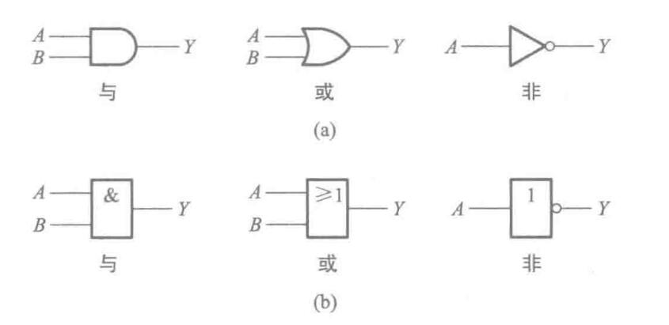

当然，这三个运算可以复合出一些操作。与非(NAND)、或非(NOR)、与或非(AND-NOR)、异或(XOR)，同或(XNOR)。符号如下

其中异或有

$$
A\oplus B = A\cdot B'+A'\cdot B
$$

同或有

$$
A\odot B = A\cdot B + A'\cdot B'
$$

二者互为反运算，$A\oplus B = (A\odot B)',A\odot B=(A\oplus B)'$

注意，与运算可以把$A\cdot B$写为$AB$。关于运算优先级，虽然书上没说，但是应该是非>与>或。

## 逻辑代数的基本公式和常用公式

要证明这些公式，可以列真值表。然后这些公式就可以用来证明别的公式了，比如下面的。

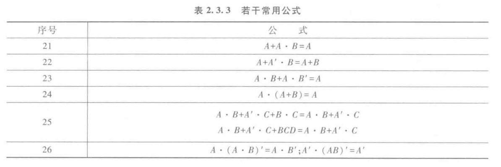

## 逻辑代数的基本定理

### 代入定理

在任何一个包含变量A的逻辑等式中，若以另外一个逻辑式代入式中所有A的位置，则等式仍然成立。

### 反演定理

对于任意一个逻辑式$Y$，若将所有的$\cdot$换成$+$，所有的$+$换成$\cdot$，$0$换成$1$，$1$换成$0$，原变量换成反变量，反变量换成原变量，得到的结果就是$Y'$。

需要注意：

1. 要保留原来的运算顺序，例如原来$A+BC$，变换后要变成$A'(B'+C')$
2. 不属于单个变量上的反号应保持不变，例如$(AC)'$变换为$(A'+C')'$

### 对偶定理

若两个逻辑式相等，则它们的对偶式也相等。

对偶式是：对于任意一个逻辑式$Y$，若将所有的$\cdot$换成$+$，所有的$+$换成$\cdot$，$0$换成$1$，$1$换成$0$，得到的结果就是$Y^D$。

想要证明两个逻辑式相等，可以转换为证明它们的对偶式相等。有时候这更简单。

## 完备集

对于一个代数系统，若仅用它所定义的一组运算符号就能解决所有的运算问题，则称这一组符号是一个完备的集合，简称完备集。

对于逻辑代数，与、或、非毫无疑问是一个完备集。但它并不是最小的。与非、或非、与或非，它们三个都是能够单独组合实现与、或、非功能的。它们是最小的完备集。

## 逻辑函数

如果以逻辑变量作为输入，以运算结果作为输出，那么当输入变量的取值确定之后，输出的取值便确定了，因此输入输出之间是一种函数关系。

$$
Y = F(A,B,C,\cdots)
$$

### 常用形式

1. 与或式。$F=AB+CD$
2. 或与式。$F=(A+B)(C+D)$
3. 与非与非式。$F=\overline{\overline{AB}\cdot\overline{CD}}$
4. 或非或非式。$F=\overline{\overline{A+B}+\overline{C+D}}$
5. 与或非式。$F=\overline{{AB}\cdot{CD}}$

任何逻辑函数都能转换成以上五种形式。它的作用在于，如果电路元件只给你某某元件，你要把原来的表达式转换为上述五种式子，再去套用元件。多用德摩根律。

### 描述方法

1. 真值表
2. 逻辑函数式
3. 逻辑图（电路图）
4. 波形图

### 两种标准式

#### 最小项

$n$个变量的最小项$m$是含$n$个变量的“乘积项”，其中每个变量都以原变量或反变量的形式出现恰好一次。

$n$个变量的最小项有$2^n$个。

输入变量的每一组取值都使一个对应的最小项等于$1$。为了方便，例如$A=1,B=0,C=1$时，该最小项写作$AB'C$。如果看成二进制数$101$，则最小项标记为$m_{101}=m_5$

最小项的性质有

1. 在输入变量的任何取值下必有一个最小项，且仅有一个最小项的值为$1$
2. 全体最小项的和为$1$
3. 任意两个最小项的乘积为$0$
4. 具有相邻性的两个最小项之和可以合并成一项并消去一对因子

#### 最大项

$n$个变量的最大项$M$是含$n$个变量的“和”，其中每个变量都以原变量或反变量的形式出现恰好一次。

$n$个变量的最小项有$2^M$个。

与最小项正好相,反输入变量的每一组取值都使一个对应的最大项等于$0$。$A=1,B=0,C=1$时最大项写作$A'+B+C'$，记作$M_{101}=M_5$

最大项的性质有

1. 在输入变量的任何取值下必有一个最大项，且仅有一个最大项的值为$0$
2. 全体最大项的积为$0$
3. 任意两个最大项的和为$1$
4. 只有一个变量不同的两个最大项的乘积等于各相同变量之和

最后，可以发现$M_i=m_i'$

### 逻辑函数的最小项之和形式

首先将给定的逻辑函数式化为若干乘积项之和的形式，亦称“积之和”形式。然后，再利用基本公式$A+A'=1$将每个乘积项中缺少的因子补全，这样就可以将与或的形式化为最小项之和的标准形式。

例如

$$
Y = ABC'+BC
$$

$$
Y = ABC'+(A+A')BC = ABC'+ABC+A'BC=m_3+m_6+m_7
$$

也可以写作

$$
Y(A,B,C)=\sum m(3,6,7)
$$

### ### 逻辑函数的最大项之积形式

利用公式$AA'=0$

例如

$$
Y = A'B+AC = (A'B+A)(A'B+C) = (A+B)(A'+C)(B+C)
$$

$$
Y = (A+B+CC')(A'+BB'+C)(AA'+B+C) = (A+B+C)(A+B+C')(A'+B+C)(A'+B'+C)
$$

$$
Y(A,B,C,D) = \prod M(0,1,4,6)
$$

或者，我们可以先求$Y'$，并且写出$Y'$的最小项，再把$Y'$求反得到最大项。或者得出$Y$的最小项，利用$m_i$和$M_i$的互补关系直接写出结果。

互补关系指的是，例如$3$个变量的表达式，$Y$最小式之和为$\sum m(0,1,4,5)$，则$Y$最大项之积为$\prod M(2,3,6,7)$，把剩下没用的都放到最大项里了。这个的证明可以在离散数学笔记中找到。

## 逻辑函数的化简

### 公式化简法

1. 并项法，使用$AB+AB'=A$
2. 吸收法，使用$A+AB=A$
3. 消项法，使用$AB+A'C+BCDE = AB+A'C$
4. 消因子法，使用$A+A'B = A+B$
5. 配项法，使用$A+A=A,A+A'=1$

### 卡诺图法

介绍不方便，看教材。

注意事项：横轴和纵轴是格雷码排列的。但是填进去的时候，按照坐标的字面量填入最小项。而不是什么转换为格雷码对应的十进制数，再填入对应的十进制表示的最小项。

如果表达式里有这一项，就填入1，没有就填入0。例如有$ABCD$就填入坐标为$11,11$的那一格，也就是第三行第三列，填入$m_{15}$，填入$1$，没有这一项就填入$0$

如果你得到的是最大项，那么在卡诺图对应的位置填入$0$，其他位置填入$1$。

**合并规律**

用尽可能大的圈，去套$1$，不可套$0$，但是可以重叠（不要多余，每个圈里面至少有一格只被套过一次）、可以越过边界到达相对的边界一边。

不方便说，多做题。

## 具有无关项的逻辑函数及其化简

对于输入变量的每一组取值组合，逻辑函数都有确定的值，则这类逻辑函数称为完全描述的逻辑函数。

对于输入变量的某些取值组合，逻辑函数值不确定（可以为1，也可以为0），或者不存在，这类逻辑函数称为非完全描述的逻辑函数。

无关项在卡诺图里填$\times$，在真值表里填$\times$，在逻辑函数中用约束项表示

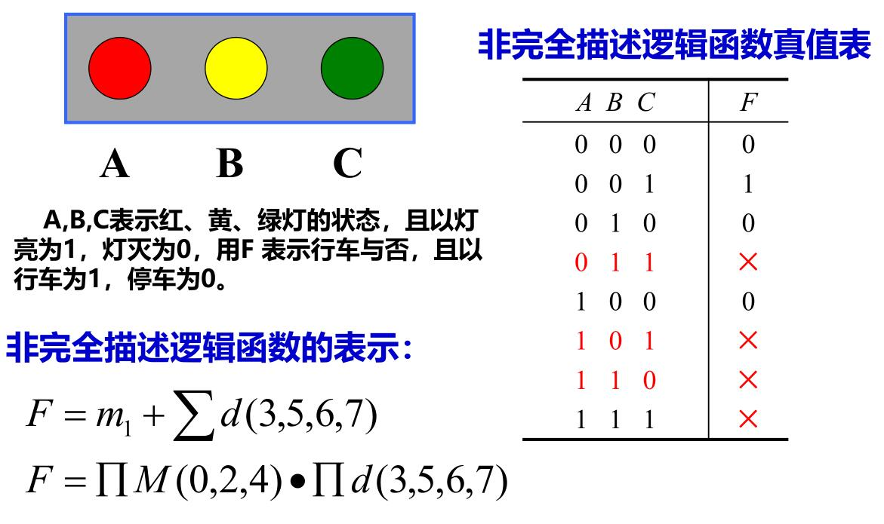

在逻辑函数中，一般最小项的约束条件为$\sum d(\cdots) = 0$。最大项的约束条件为$\prod d(\cdots) = 1$

在卡诺图化简中，带有$\times$的可以圈也可以不圈。

# 组合逻辑电路

## 概述

数字电路可以分为两类：组合逻辑电路、时序逻辑电路

组合逻辑电路的输出仅仅取决于该时刻的输入。

输入输出关系可以表示为

$$
\left\{\begin{matrix}
y_1=f_1(a_1,\cdots,a_n) \\
y_2=f_2(a_1,\cdots,a_n)  \\
\vdots \\
y_m=f_m(a_1,\cdots,a_n) 
\end{matrix}\right.
$$

写成向量形式为$Y=F(A)$

## 分析方法

根据电路图写表达式、列真值表，判断功能

## 设计方法

把想做的功能抽象出来，写成表达式，化简表达式，画电路图。

## 常用组合逻辑电路模块

### 8-3普通编码器

功能就是，把某一位输入变成二进制位输出，比如$I_6=1$，则输出$110$。

它普通就普通在，任意时刻只允许一个输入。

### 8-3优先编码器

可以有多个输入，但是按照内部的优先级顺序，会进行选择什么输出。注意这些圆点代表非门，或者说低电平有效。

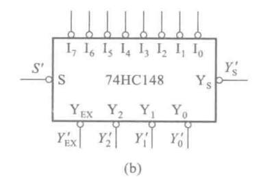

### 3-8译码器

就是8-3编码器反过来

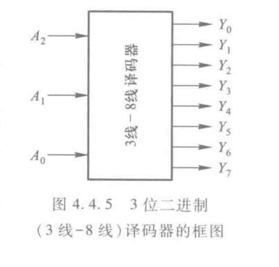

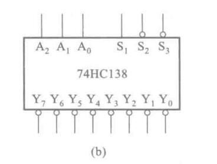

### 2-10进制译码器

也就是BCD翻译为10进制数字

### 七段字符管

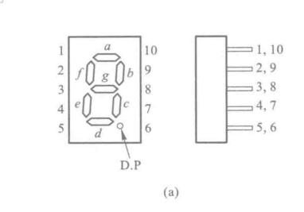

### 数据选择器

从一组输入中选出一个进行输出。

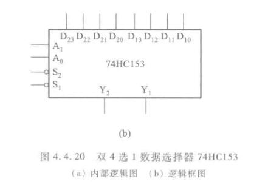

### 加法器

#### 一位半加器

$$
\left\{\begin{matrix}
S = A'B+AB' = A\oplus B \\
CO = AB
\end{matrix}\right.
$$

不考虑低位的进位，称为半加。 $S$为本位加的结果，$CO$为进位

#### 一位全加器、串行加法器、超前进位加法器

见计组笔记。

$$
\left\{\begin{matrix}
S = A\oplus B\oplus CI \\
CO = AB + (A\oplus B)CI
\end{matrix}\right.
$$

## 组合逻辑电路中的竞争-冒险

在组合电路中，某一输入变量经不同途径传输后，到达电路中某一会合点的时间有先有后，这种现象称为竞争。由于竞争而使电路输出发生瞬时错误的现象称为冒险。

将门电路两个输入信号同时向相反的逻辑电平跳变的现象称为竞争。

应当指出，有竞争不代表一定会产生尖峰脉冲。

### 判断有无竞争

只要输出端的逻辑函数在一定条件下能化简成

$$
Y = A+A'\quad or\quad Y = AA'
$$

则一定有竞争。

例如$Y=AB+A'C$，在$B=C=1$时有$Y=A+A'$

或者在卡诺图上看。如果两卡诺圈相切，而相切处未被其他卡诺圈包围，则有竞争。

两个输入变量以上的竞争就难以判断了，最有效的办法是做实验。利用示波器观察，如果有毛刺，就有冒险。

### 消除竞争-冒险的方法

1. 接入滤波电容
2. 引入选通脉冲
3. 修改逻辑设计

修改逻辑设计需要增加冗余项。

例如，$Y = AB+A'C = AB+A'C+BC$，此时，当$B=C=1$时，无论$A$取什么值，都有$Y=1$

# 半导体存储电路

## SR锁存器

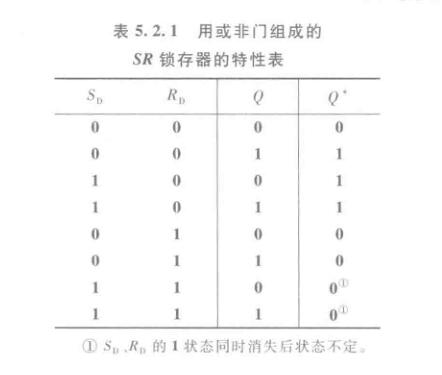

注意我们约定不同时给SR输入有效。有些地方的SR锁存器是低电平有效，无论什么情况，记住：两个都无效时，保存原有的输出。S（Set）有效时，输出变为$1$，R（Reset）有效时，输出变为$0$。

## 触发器

### 电平触发

1. 只有当CLK为有效时，触发器才接受输入信号
2. 在CLK=1的全部时间里，SR状态的变化都有可能引起输出状态的改变。在CLK回到0之后，触发器保存的是CLK回到0之前瞬间的状态。

显然，如果CLK=1时SR多次变化，输出也会多次变化。抗干扰能力弱。

### 边沿触发

触发器的次态仅取决于时钟信号的上升沿（或者下降沿）到达时的逻辑状态。抗干扰能力强。

### 脉冲触发

当CLK的有效电平消失以后，输出状态才改变。所以也叫延迟触发。

### SR触发器

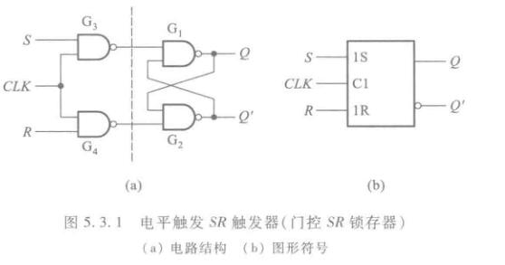

$$
\left\{\begin{matrix}
Q^* = S+R'Q \\
SR = 0(约束)
\end{matrix}\right.
$$

### JK触发器

$$
Q^* = JQ' + K'Q
$$

也就是$J=K=0$时，输出不变，$J=1,K=0$时输出变$1$，$J=0,K=1$时输出变$0$，$J=K=1$时，输出翻转。

只是比SR多了一个翻转的功能而已。

由于JK可以实现SR和T，所以现在一般生产JK触发器和D触发器较多。

注意到上面的时钟信号输入端口有个三角形，和之前的不一样。之前没有三角形的代表电平有效，这里有三角的代表上升沿有效。如果还有个非门在前面，则代表下降沿有效。这张图的JK触发器是下降沿有效。

### T触发器

$$
Q^* = TQ'+T'Q
$$

也就是说$T=0$时保持，$T=1$时翻转。

### D触发器

$$
Q^*=D
$$

也就是说输出等于输入。

## 触发器功能的描述方法

1. 状态转移真值表
2. 次态卡诺图与特征方程
3. 状态转移图
4. 激励表
5. 波形图

# 时序逻辑电路

## 概述

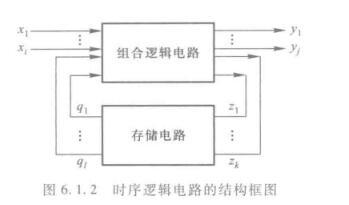

写成向量形式得到

$$
Y = F(X,Q)
$$

$$
Z = G(X,Q)
$$

$$
Q^* = H(Z,Q)
$$

第一个方程称为输出方程，第二个为驱动方程，第三个为状态方程。

在时序电路中区分出同步时序电路和异步时序电路。由于课时问题，我们学院只讲同步时序。

根据输出信号的特点分为米利型和穆尔型。米利型：输出信号取决于存储电路和输入变量。穆尔型：输出电路仅仅取决于存储电路。

## 分析方法

1. 从给定的逻辑图中写出每个触发器的驱动方程
2. 驱动方程代入相应触发器的特性方程，得出每个触发器的状态方程，从而得到状态方程组
3. 根据逻辑图写出输出方程

### 表示方法

1. 状态转换表
2. 状态转换图。输入写斜线上，输出写斜线下，没有输入就空着。
3. 状态机流程图

## 可自启动电路

时序电路中的所有无效状态经过有限个CP脉冲后都能进入有效状态环，则称它是可自启动的。

## 设计方法

1. 逻辑抽象，得出电路的状态转换图或状态转换表
2. 状态化简。如果两个电路状态在相同的输入下有相同的输出，并且转换到同一个次态中，则为等价。可以合并为一个。
3. 状态分配
4. 选定触发器，求出状态方程、驱动方程、输出方程
5. 画出逻辑图
6. 检查能否自启动

## 常用的时序逻辑电路

### 移位寄存器

### 同步计数器

PT是计数允许端，CP是时钟信号。Cr是异步清零，ABCD是在LD有效时的置数输入。Oc是进位端。

**任意进制计数器的构成方法**

已有N进制计数器，需要M进制计数器

*M< N时*

1. 置零法
2. 置数法

*M>N*时

将多片N进制计数器组合起来，构成M进制计数器。可以分为串行进位方式、并行进位方式、整体置零方式。

### 集成寄存器
