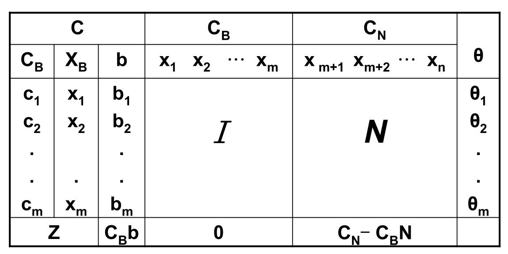
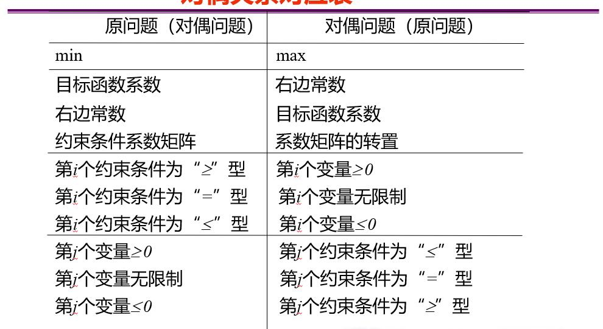

# 读前警示

出于Obsidian不支持\\bm的标签的原因，也出于我打字方便、教科书也没用加粗的原因，从某一段开始的瞬间，很多地方都不会使用粗体来表示向量。这其实无所谓，我们可以把标量看做一维向量。我们的大部分讨论都是在向量之上的，除了部分参数是标量。大部分矩阵是大写字母。

阅读时应结合前后文理解一个符号是什么意思。

# 数学基础概念、定义

## 向量内积

在$n$维线性空间$R^n$中，$\bm a = [a_1,a_2,\cdots,a_n]^T\in R^n,\bm b = [b_1,b_2,\cdots,b_n]^T\in R^n$，则

$$
\bm a^T b = a_1b_1+a_2b_2+\cdots,a_nb_n
$$

称作向量$\bm a,\bm b$的内积。

内积满足交换律，线性，以及正定性：$\bm a^T \bm a\geq 0$，当且仅当$\bm a=\bm 0$时，取等号。

其他各种性质都在线性代数中学过了，这里只是简单回顾。

## 向量范数

称一个从向量空间$R^n$到实数域$R$的非负函数$||\cdot||$为范数，如果它满足：

1. 正定性：对于所有的$\bm v\in R^n$，有$||\bm v||\geq 0$，且$||\bm v||=0$当且仅当$\bm v=0$
2. 齐次性：对于所有的$\bm v\in R^n$和$\alpha\in R$，有$||\alpha\bm v||=|\alpha|||\bm v||$
3. 三角不等式：对于所有的$\bm v,\bm w\in R^n$，有$||\bm v+\bm w||\leq ||\bm v||+||\bm w||$

对于$\bm v = (v_1,v_2,\cdots,v_n)^T$，常见的向量范数为$\mathscr{l}_n$范数$(p>=1)$

$$
||v||_p = (|v_1|^p+|v_2|^p+\cdots+|v_3|^p)^{1/p}
$$

当$p=\infty$时，$\mathscr{l}_\infty$定义为

$$
||v||_\infty = \max_i|v_i|
$$

一些地方也可以见到$0$-范数，其表示分量中不为零的个数。

最常见的是$2$-范数，又称欧几里得范数，常常$||\cdot||$省略角标不写表示$2$-范数。

## 二次型

$n$维二次函数可以表示如下

$$
f(x_1,x_2,\cdots,x_n)=a_{11}x_1^2+a_{12}x_1x_2+\cdots+a_{1n}x_1x_n+a_{21}x_2x_1+\cdots+a_{nn}x^2_n
$$

其可以表示为向量矩阵形式

$$
\sum^n_{i=1}\sum^n_{j=1}a_{ij}x_ix_j=\bm x^T A \bm x
$$

这个$A$矩阵是个实对称矩阵，其元素$a_{ij}=a_{ji}$，是对应的$x_ix_j$项系数的一半（原式子出于简单起见没有把同类项合并）。

## 正定矩阵

如果正定二次型$f(\bm x)=\bm x^TA\bm x$，对于一组不全为零的数$x_1,x_2,\cdots,x_n$，恒有$f(x_1,x_2,\cdots,x_n)>0$，则称$f$正定，$A$为正定矩阵。若换成$\geq$，则称为半正定矩阵，若换成$\leq$，则称为半负定矩阵。

有两个判定定理

1. $A$正定的充要条件为$A$的特征值都大于$0$
2. $A$正定的充要条件为$A$的所有顺序主子式都大于$0$

## 方向导数

设$f:R^n\to R$在点$\bm x$处可微，$\bm p$是固定不变的非零向量，$\bm e$是方向$\bm p$上的单位向量，则称极限

$$
\dfrac{\partial f(\bm x)}{\partial \bm p} = \lim_{t\to 0^+}\dfrac{f(\bm x+t\bm e)-f(\bm x)}{t}
$$

为函数$f(x)$在点$\bm x$处沿$\bm p$方向的方向导数，记为$\dfrac{\partial f(\bm x)}{\partial\bm p}$。当其大于零时，函数在该点沿此方向上升，小于零时沿此方向下降。

## 梯度

给定函数设$f:R^n\to R$，且$f$在点$\bm x$的一个领域内有意义，若存在向量$\bm g\in R^n$满足

$$
\lim_{\bm p\to \bm 0}\dfrac{f(\bm x+\bm p)-f(\bm x)-\bm g^T\bm p}{||\bm p||}=0
$$

其中这个范数可以是任意向量范数，就称$f$在点$\bm x$可微，此时$\bm g$是$f$在点$\bm x$处的梯度，记作$\nabla f(x)$。可以计算，若令$\bm p=\epsilon \bm e_i$，$\bm e_i$是第$i$个分量为$1$的单位向量，可知$\nabla f(x)$的第$i$个分量即为$\dfrac{\partial f(x)}{\partial x_i}$。因此

$$
\nabla f(x) = \bigg[\dfrac{\partial f(x)}{\partial x_1},\dfrac{\partial f(x)}{\partial x_2},\cdots,\dfrac{\partial f(x)}{\partial x_n}\bigg]^T
$$

一个非常浅显的事实是，一维向量函数的梯度就是它的一阶导数。

梯度方向是函数在该点上升的最快方向，反方向是最速下降方向。

梯度与方向导数的关系为

$$
\dfrac{\partial f(\bm x)}{\partial \bm p}=\nabla f(\bm x)^T\bm e
$$

其中$\bm e$是$\bm p$方向上的单位向量。

$\bigg|\dfrac{\partial f(\bm x)}{\partial \bm p}\bigg|\leq |\nabla f(\bm x)^T|$

梯度有几条显然的性质：

1. 若$\nabla f(\bm x)^T\bm p<0$，则$\bm p$的方向是函数$f$在$\bm x$处的下降方向
2. 若$\nabla f(\bm x)^T\bm p>0$，则$\bm p$的方向是函数$f$在$\bm x$处的上升方向
3. 梯度正交的方向变化率为零

## 海瑟矩阵

用一个简单的比方，梯度和海瑟矩阵的关系，就相当于一阶导数和二阶导数的关系。

给定函数$f:R^n\to R$，若其在点$\bm x$处的二阶偏导数$\dfrac{\partial^2 f(\bm x)}{\partial \bm x_i\partial \bm x_j},i,j=1,2,\cdots,n$都存在，则

$$
\nabla^2f(\bm x) = 
\begin{bmatrix}
 \dfrac{\partial^2 f(\bm x)}{\partial x_1^2} & \dfrac{\partial^2 f(\bm x)}{\partial x_1\partial x_2} & \dfrac{\partial^2 f(\bm x)}{\partial x_1\partial x_3} & \cdots & \dfrac{\partial^2 f(\bm x)}{\partial x_1\partial x_n}\\
 \dfrac{\partial^2 f(\bm x)}{\partial x_2\partial x_1} & \dfrac{\partial^2 f(\bm x)}{\partial x_2^2} & \dfrac{\partial^2 f(\bm x)}{\partial x_2\partial x_3} & \cdots & \dfrac{\partial^2 f(\bm x)}{\partial x_2\partial x_n}\\
 \vdots & \vdots & \vdots &  & \vdots\\
 \dfrac{\partial^2 f(\bm x)}{\partial x_n\partial x_1} & \dfrac{\partial^2 f(\bm x)}{\partial x_n\partial x_2} & \dfrac{\partial^2 f(\bm x)}{\partial x_n\partial x_3} &  & \dfrac{\partial^2 f(\bm x)}{\partial x_n^2}
\end{bmatrix}
$$

称为$f$在点$x$处的海瑟矩阵。

## 泰勒展开

给定函数$f:R^n\to R$，具有二阶连续偏导数，则

$$
f(\bm x+\bm p) = f(\bm x) + \nabla f(\bm x)^T\bm p + \dfrac{1}{2}\bm p^T\nabla^2 f(\bm x)^T\bm p + o(||\bm p||^2)
$$

其中$o(||p||^2)$当$||p||^2\to 0$时，是关于$||p||^2$的高阶无穷小量。

## 邻域

对于任意给定的实数$\delta>0$，满足不等式$||\bm x-\bm x_0||<\delta$的$\bm x$的集合称为点$\bm x_0$的邻域，记为

$$
N(\bm x_0,\delta) = \{\bm x|\ ||\bm x-\bm x_0||<\delta,\delta>0\}
$$

## 极小点

设$f:D\subseteq R^n\to R$，若存在点$\bm x^*\in D$和数$\delta>0$，$\forall \bm x\in N(\bm x^*,\delta)\cap D$，都有$f(\bm x^*)\leq f(\bm x)$，则称$\bm x^*$为$f(\bm x)$的（非严格）局部极小点。

设$f:D\subseteq R^n\to R$，若存在点$\bm x^*\in D$和数$\delta>0$，$\forall \bm x\in N(\bm x^*,\delta)\cap D$，但$\bm x\neq \bm x^*$，都有$f(\bm x^*)< f(\bm x)$，则称$\bm x^*$为$f(\bm x)$的严格局部极小点。

设$f:D\subseteq R^n\to R$，若存在点$\bm x^*\in D$和数$\delta>0$，$\forall \bm x\in D$，都有$f(\bm x^*)\leq f(\bm x)$，则称$\bm x^*$为$f(\bm x)$的（非严格）全局极小点。

设$f:D\subseteq R^n\to R$，若存在点$\bm x^*\in D$和数$\delta>0$，$\forall \bm x\in D$，但$\bm x\neq \bm x^*$，都有$f(\bm x^*)\leq f(\bm x)$，则称$\bm x^*$为$f(\bm x)$的严格全局极小点。

如果$\bm x^*$是极小点并且是$D$的内点，则$\nabla f(\bm x^*)=0$。这是一个必要非充分条件。

但如果$f$有连续二阶偏导数，$\bm x^*$是一个驻点，并且$\nabla^2 f(\bm x^*)$是正定的，则$\bm x^*$是$f(\bm x)$的严格局部极小点。

## 驻点

设$f:D\subseteq R^n\to R$，$\bm x^*$是$D$的内点，若$\nabla f(\bm x^*)=0$，则称$\bm x^*$为$f(\bm x)$的驻点。

## 锥

设集合$C\subset R^n$，若对$\forall\bm x\in C$以及$\forall \lambda\geq 0$均有$\lambda\bm x\in C$，则称$C$为锥

## 凸组合

设$\bm x_1,\bm x_2,\cdots,\bm x_l$是$R^n$中的$l$个已知点。若对于某点$\bm x\in R^n$，存在常数$\lambda_1,\lambda_2,\cdots,\lambda_l\geq 0$，且$\sum\lambda_i=1$，使得$\bm x=\sum\lambda_i\bm x_i$，则称$\bm x$是$\bm x_1,\bm x_2,\cdots,\bm x_l$的凸组合。如果$\lambda_1,\lambda_2,\cdots,\lambda_l>0$且$\sum\lambda_i=1$，则称为严格凸组合。

## 凸集

对于$C\subset R^n$中的任意两个点$\bm x_1, \bm x_2$，如果连接两个点的线段在$C$内，则称$C$为凸集。即

$$
\bm x_1,\bm x_2\in C\Rightarrow\theta \bm x_1+(1-\theta)\bm x_2\in C,\forall 0\leq\theta\leq 1
$$
**定理1**

任意一组凸集的交仍然是凸集。

特别的，规定空集是凸集。容易验证，空间$R^n$、半空间、超平面、直线、点、球都是凸集。

**凸集分离定理**

设$C_1,C_2$是$R^n$中两个非空的集合，$H=\{\bm x|\bm p^T\bm x=\alpha\}$为超平面，如果对$\forall\bm x\in C_1$都有$\bm p^T\bm x\geq \alpha$，对$\forall x\in C_2$都有$\bm p^T\bm x\leq \alpha$（或二者正好相反），则称超平面$H$分离集合$C_1,C_2$

## 半空间

设$\bm a\in R^n,\bm a\neq\bm 0,b\in R$，则集合

$$
\{\bm x|\bm a^T\bm x>b,\bm x\in R^n\}
$$

称为$R^n$的半空间。

有限个半空间的交$\{\bm x|\bm A\bm x\leq \bm b\}$称为多面集，其中$\bm A$为$m\times n$矩阵，$\bm b$为$m$维向量。

## 凸函数

**广义实值函数**

令$\bar R\xlongequal{\text{def}}R\cup\{\pm\infty\}$为广义实数空间，则映射$f:R^n\to\bar R$为广义实值函数。

规定$-\infty< a<+\infty,\forall a\in R$，以及$(+\infty)+(+\infty)=+\infty,(+\infty)+a=+\infty,\forall a\in R$

**适当函数**

给定广义实值函数$f$和非空集合$\mathcal{X}$，如果存在$x\in\mathcal{X}$使得$f(x)<+\infty$，并且对任意的$x\in\mathcal{X}$，都有$f(x)>-\infty$，那么称函数$f$关于集合$\mathcal{X}$是适当的。

**凸函数**

设函数$f$为适当函数，如果$\text{dom} f$是凸集，且

$$
f(\theta x+(1-\theta)y)\leq \theta f(x)+(1-\theta)f(y)
$$

对所有$x,y\in\text{dom}f,0\leq\theta\leq 1$都成立，则称$f$是凸函数。

如果$f(\theta x+(1-\theta)y)< \theta f(x)+(1-\theta)f(y)$，则称为严格凸函数。

**性质1**

设$f_1,f_2$是凸集$C$上的凸函数，则函数$f_1+f_2$在$S$上也是凸函数。

**性质2**

设$f$是凸集$C$上的凸函数，则对任意的$a\geq 0$，函数$af$也是凸函数。

## 凸函数判定

$f$是凸函数，当且仅当对任意的$x\in\text{dom}f,v\in R^n,g:R\to R$

$$
g(t)=f(x+tv),\text{dom} g = \{t|x+tv\in\text{dom} f\}
$$

是凸函数。

**一阶条件**

对于定义在凸集上的可微函数$f$，$f$是凸函数当且仅当

$$
f(y)\geq f(x)+\nabla f(x)^T(y-x),\forall x,y\in\text{dom}f
$$

严格凸函数则要求$>$号。物理意义是：任意点处的切线增量不超过函数的增量。

**梯度单调性**

设$f$为可微函数，则$f$为凸函数当且仅当$\text{dom}f$为凸集且$\nabla f$为单调映射，即

$$
(\nabla f(x)-\nabla f(y))^T(x-y)\geq 0,\forall x,y\in\text{dom}f
$$

**二阶条件**

设$f$为定义在凸集上的二阶连续可微函数，则$f$是凸函数当且仅当

$$
\nabla^2 f(x)\succeq 0,\forall x\in\text{dom}f
$$

如果$\succ$，则是严格凸函数。

或者，凸函数的充要条件是$\nabla^2 f(x)$在$\text{dom}f$上的任意点均半正定。

# 线性规划

## 图解法

1. 确定可行域
2. 确定目标函数的等值线及优化方向
3. 平行移动目标函数等值线，通过观察得到线性规划的最优解

高中已经学过很多次这个东西了，不再详细介绍。

注意到，图解法只适用于有两个变量的情况，更高维的情况下，要用单纯形法。

## 一般形式

一般形式如下

$$
\min f(x_1+x_2+\cdots+x_n) = c_1x_1+c_2x_2+\cdots+c_nx_n
$$

$$
s.t.
\left\{\begin{matrix}
a_{11}x_1+a_{12}x_2+\cdots+a_{1n}x_n = b_1\\
a_{21}x_1+a_{22}x_2+\cdots+a_{2n}x_n = b_2 \\
\vdots \\
a_{m1}x_1+a_{m2}x_2+\cdots+a_{mn}x_n = b_m\\
x_1,x_2,\cdots,x_n\geq 0
\end{matrix}\right.
$$

一共包含$n$个决策变量，$m$个约束条件。其中对目标函数既可以求最大也可以求最小，约束条件可以是$=,\leq,\geq$。决策变量$x_i$通常非负，也有其他情况。$c_j$称为价值系数，$b_j$称为资源系数，$a_{ij}$称为约束系数、技术系数。

利用矩阵，可以写作

$$
\min f(x) = c^Tx
$$

$$
s.t.
\left\{\begin{matrix}
Ax=b\\
x\geq 0
\end{matrix}\right.
$$

## 标准形式

标准形式有四个特征

1. 目标函数求$\min$
2. 约束条件两端用$=$连接
3. 所有$b_i$非负
4. 所有$x_i$非负

接下来介绍如何转换其他形式到标准形式（注意按顺序来）

**目标函数求最小值**

例如$\min z=x_1-2x_2+3x_3$，等价于$\max z'=-x_1+2x_2-3x_3$，其中$z'=-z$

**约束函数求最小值**

1. 例如$-2x_1+6x_2-x_3\leq3$，将其转化为

$$
-2x_1+6x_2-x_3+x_s=3
$$

$x_s$表示决策中尚未使用的那部分资源，所以称之为松弛变量。$x_s\geq 0$

2. 例如$-2x_1+6x_2-x_3\ge3$，将其转化为

$$
-2x_1+6x_2-x_3-x_s=3
$$

$x_s$表示决策中超过了实际需要的部分，因此常称它为剩余变量。$x_s\geq 0$

由上可见，既把函数从不等式转变成了等式，并且新添加的变量也是非负的，也不影响原来的目标函数。统一整个计算过程。

**$b_i$非负**

这个只需要将约束条件两端取反即可。

**$x_i$非负**

1. 若$x_i\leq 0$，则令$x'_i=-x_i$，此时$x'_i\geq 0$
2. 若$x_i$无约束，则令$x_i = x_i'-x_i'',x_i'\geq0,x_i''\geq0$

注意这里的变换要把变换也代入目标函数中

## 线性规划解的基本性质

对于线性规划问题来说，可行解实际上是由约束条件构成的线性方程组的解。并且还满足非负约束条件，即决策变量都取非负值。

我们假定线性规划问题的系数矩阵$A$的秩总等于其行数，$rank(A)=m$。这意味着系数矩阵$A$的各行是线性无关的，这也表明约束方程中的各个方程是相互独立的。

由于$A$的秩为$m$，所以其必有一个$m\times m$的子矩阵为$B$，其行列式不为零。

我们将$A$的任意一个这样的子矩阵$B$称为线性规划问题的一个基。

显然$B=[p_1,p_2,\cdots,p_m]$，其中的每一个为基向量，与基向量对应的变量$x_j$称为基变量，$x_B = [x_1,x_2,\cdots,x_m]^T$，其余称为非基变量，$x_N=[x_{m+1},x_{m+2},\cdots,x_n]^T$。

可以得到一个解$x=[x_B^T,x_N^T]^T=[x_1,x_2,\cdots,x_m,0,\cdots,0]^T$

称$x$为该约束方程的基解，其中$x_b=B^{-1}b$

对于满足非负约束条件的$x\geq 0$（所有分量都大于等于$0$）的基解称为可行解，对应的基称为可行基。

基可行解的非零分量个数小于$m$时，称为退化解。也就是说，不是所有基解都是可行解。

**定理1**

线性规划问题的基可行解是其可行域的顶点。

**定理2**

若可行域有界，线性规划问题的目标函数则一定在其可行域的极点上达到最优。

## 单纯形法

前面提到，可行解一定在凸集的顶点上，但是，这个顶点的数量很可能非常大。单纯形法就是在这些顶点中优化的算法

基本思路

1. 首先将线性规划问题化成标准形式
2. 求出初始基本可行解
3. 判断其是否为最优解
4. 如果不是最优，则迭代到其相邻的基本可行解，并再次检验

单纯形法把寻优的目标集中在所有基本可行解（即可行域顶点）中。从一个初始的基本可行解出发，寻找一条达到最优基本可行解的最佳路径。

### 确定初始基本可行解

确定初始的基本可行解等价于确定初始的可行基，一旦初始的可行基确定了，那么对应的初始基本可行解也就唯一确定.

方便起见，不妨设$A$中的前$m$个系数列向量恰好构成一个可行基，即$A=(B|N)$

其中$B=[p_1,p_2,\cdots,p_m]$为基变量$x_1,x_2,\cdots,x_m$的系数列向量构成的可行基。

$N = [p_{m+1},p_{m+2},\cdots,p_n]$为非基变量$x_{m+1},x_{m+2},\cdots,x_n$的系数列向量构成的矩阵。

即原始问题为

$$
\min z = c^Tx
$$

$$
s.t.\left\{\begin{matrix}
Ax=b \\
x\geq 0
\end{matrix}\right.
$$

化为

$$
\min z = [c_B^T,c_N^T][x_B^T,x_N^T]^T
$$

$$
s.t.\left\{\begin{matrix}
[B,N][x_B^T,x_N^T]^T=b \\
x_B,x_N\geq 0
\end{matrix}\right.
$$

乘法后得

$$
\min z = c_B^Tx_B+c_N^Tx_N
$$

$$
s.t.\left\{\begin{matrix}
Bx_B+Nx_N=b \\
x_B,x_N\geq 0
\end{matrix}\right.
$$

计算出$x_B = B^{-1}b-B^{-1}Nx_N$，代入目标函数中，得到

$$
\min z = c_B^TB^{-1}b-(c_B^TB^{-1}N-c_N^T)x_N
$$

$$
s.t.\left\{\begin{matrix}
x_B = B^{-1}b-B^{-1}Nx_N \\
x_B,x_N\geq 0
\end{matrix}\right.
$$

令$x_N=\bm 0$，则$x_B=B^{-1}b$

所以初始的基本可行解为$x=[x_B^T,0]^T$

### 判断现行的基本可行解是否最优

假如求得一个基本可行解为$x=[x_B^T,0]^T$，那么

$$
z = cx = [c_B^T,c_N^T][(B^{-1}b)^T,0]^T=c_B^TB^{-1}b
$$

如果检验向量$\sigma_N$满足

$$
\sigma_N^T = c_N^T - c_B^TB^{-1}N\geq 0
$$

这个基本可行解就是最优解。检验向量的各个分量称为检验数。上面的$\geq0$是指每个分量都$\geq 0$

**特殊情况1**

如果$\sigma_N^T\geq 0$，其中存在一个检验数$\sigma_{m+k}=0$，则线性规划问题有无穷多最优解

**特殊情况2**

$\sigma_N^T$，其中存在一个检验数$\sigma_{m+k}<0$，且该检验数所对应的非基变量的系数列向量的全部系数都为负数或零，则线性规划问题无有界最优解。

### 基本可行解的改进——基变换

如果现行的基本可行解$x$不是最优解，即在检验向量$σ_N^T=c_N^T－c_B^TB^{-1}N$中存在负的检验数，则需在原基本可行解$x$的基础上寻找一个新的基本可行解，并使目标函数值有所改善。

具体做法是：

1. 先从检验数为负的非基变量中确定一个换入变量，使它从非基变量变成基变量，
2. 再从原来的基变量中确定一个换出变量，使它从基变量变成非基变量。由此得到一个新的基本可行解。

**换入变量的确定-最大减小原则**

假设检验向量$\sigma_N^T = c_N^T-c_B^TB^{-1}N = [\sigma_{m+1},\sigma_{m+2},\cdots,\sigma_n]$。若其中有两个以上的检验数为负，那么为了使目标函数值下降最快，就要选取最小负检验数所对应的非基变量为换入变量。

即若$\sigma_{m+k}$是最小的，那么就要把$x_{m+k}$换入。

**换出变量的确定-最小比值原则**

如果确定$x_{m+k}$为换入变量，方程$x_B = B^{-1}b-B^{-1}Nx_N\Rightarrow x_B = B^{-1}b-B^{-1}p_{m+k}x_{m+k}$

其中$p_{m+k}$为$A$中与$x_{m+k}$对应的系数列向量。我们要在$x_B = (x_1,x_2,\cdots,x_m)^T$中确定一个基变量为换出变量，可以按最小比值原则确定换出变量。

$$
\theta = \min\bigg\{\dfrac{(B^{-1}b)_i}{(B^{-1}p_{m+k})_i}\bigg|(B^{-1}p_{m+k})_i>0,1\leq i\leq m\bigg\} = \dfrac{(B^{-1}b)_l}{(B^{-1}p_{m+k})_l}
$$

则选择对应的$x_l$作为换出变量。这里的角标是因为$B^{-1}b$和$B^{-1}p_{m+k}$都是$m$维向量。

### 用初等变换求改进了的基本可行解——旋转运算

假设$B$是可行基，则

$$
Ax = b\Rightarrow[B,N][x_B^T,x_N^T]^T = b\Rightarrow [I,B^{-1}N][x_B^T,x_N^T]^T = B^{-1}b
$$

令非基变量$x_N=\bm 0$，则基变量$x_B = B^{-1}b$，基本可行解为$x=[(B^{-1}b)^T,0]^T$

用逆阵$B^{-1}$左乘约束方程组的两端，等价于对方程组施以一系列的初等“行变换”。变换的结果是将系数矩阵$A$中的可行基$B$变换成单位矩阵$I$，把非基变量系数列向量构成的矩阵$N$变换成$B^{-1}N$，把向量$b$变换成$B^{-1}b$

变换前后的方程组同解。

且改进了的基本可行解$X'$只是在$X$的基变量的基础上用一个换入变量替代其中一个换出变量，其它的基变量仍然保持不变。这些基变量的系数列向量是单位矩阵$I$中的单位向量。为了求得改进的基本可行解$X'$，只需对增广矩阵

$$
[I,B^{-1}N,B^{-1}b]
$$

施行初等行变换，将换入变量的系数列向量变换成换出变量所对应的单位向量即可。

### 表格单纯形法

## 对偶问题原理

假设全是列向量。

设原问题$P$为

$$
\min f(x) = c^Tx
$$

$$
s.t.
\left\{\begin{matrix}
Ax\geq b\\
x\geq 0
\end{matrix}\right.
$$

则其对偶问题$D$为

$$
\max g(y) = b^Ty
$$

$$
s.t.
\left\{\begin{matrix}
A^Ty\leq c\\
y\geq 0
\end{matrix}\right.
$$

### 对偶关系表

### 对偶关系定理

**弱对偶定理**

对偶问题(max)的任何可行解$Y^*$，其目标函数值总是不大于原问题(min)任何可行解$X^*$的目标函数值。

**对偶定理**

假如原问题或对偶问题之一具有有限的最优解，则另一问题也具有有限的最优解，且两者响应的目标函数值相等。假如一个问题的目标函数值是无界的，则另一问题没有可行解。

**互补松弛定理**

假设$X^*,Y^*$分别是原问题和对偶问题的可行解，$U^*$是原问题剩余变量的值，$V^*$是对偶问题松弛变量的值，则$X^*,Y^*$分别为原问题和对偶问题的最优解的充要条件是

$$
X^*V^*+Y^*U^* = 0
$$

这个定理还表述为如下两个形式

1. 假如一个问题的某个变量取正数，则相应问题的另外一个约束条件必取等式
2. 一个问题中的约束条件不取等式，则相应于另一个问题中的变量为零

说起来有些抽象，做题理解。

# 一维搜索法

## 概念

对于一维无约束优化问题

$$
\min f(\alpha)
$$

求解极小点和极小值的数值迭代方法即为一维搜索方法。

极小点的必要条件和充分条件见前。注意我们可以用充分条件求解最小值，但是并不是所有情况都能使用，比如函数不一定二阶可微。所以我们常使用迭代法。

## 基本步骤

1. 确定搜索区间$[a,b]$
2. 在区间内寻找最小点

优化算法的基本迭代公式为：

$$
x^{k+1} = x^{k} + \alpha^kd^k
$$

其中$\alpha^k$为搜索步长，$d^k$为搜索方向。$x^0$为人工给出的初始估计。

## 终止条件

**两次迭代的绝对误差**

$$
|f(x^{k+1})-f(x^k)|<\varepsilon,\quad ||x^{k+1}-x^k||<\varepsilon
$$

**两次迭代的相对误差**

$$
\dfrac{|f(x^{k+1})-f(x^k)|}{|f(x^k)|}<\varepsilon,\quad \dfrac{||x^{k+1}-x^k||}{||x^k||}<\varepsilon
$$

**目标函数梯度的模足够小**

$$
||\nabla f(x^k)||<\varepsilon
$$

## 搜索区间的确定

### 单谷（峰）函数

我们选取的区间使得函数是单股（峰的），这样我们有以下定理（单谷为例）

设$f(x)$在$[a,b]$上单谷，$x^*\in[a,b]$是其极小点，$x_1< x_2$是$[a,b]$上任意两点。则：

- 若$f(x_1)\geq f(x_2)$，则$x^*\in[x_1,b]$
- 否则$x^*[a,x_2]*$

### 进退算法（成功-失败法）

求取区间。

1. 选取初始点$a$和步长$h$
2. 计算并比较$f(a),f(a+h)$。

若$f(a)\geq f(a+h)$，则步长加倍，计算$f(a+3h)$。若$f(a+h)\leq f(a+3h)$，则令$a_1=a,a_2=a+3h$，停止运算；否则步长加倍，并重复以上（计算$a+3h$和$a+7h$）。

若$f(a)< f(a+h)$，则步长变为$-h$，计算$f(a-h)$。若$f(a-h)\geq f(a)$，则令$a_1=a-h,a_2=a+h$，停止运算；否则步长加倍，继续后退（计算$a-h$和$a-3h$）。

## 二分法

已知区间$[a,b]$，且$f(x)$在其中可微，求极小点

1. 计算$x_0=\dfrac{a+b}{2}$
2. 若$f'(x_0)<0$，令$a = x_0$，转步骤$3$。若$f'(x_0)>0$，令$b = x_0$，转步骤$3$。若$f'(x_0)=0$，停止，$x^*=x_0$。
3. 若$|b-a|<\varepsilon$，则$x^*=\dfrac{a+b}{2}$，停止，否则转步骤$1$

**优点**

计算量少，而且总能收敛到一个局部极小点

**缺点**

收敛速度慢

## 牛顿切线法

1. 给定初始点$x_0,\varepsilon>0,k=0$
2. 计算$f'(x_k),f''(x_k)$
3. 若$|f'(x_k)|<\varepsilon$，停止，$x^*=x_k$，否则转步骤$4$
4. 计算

$$
x_{k+1} = x_k - \dfrac{f'(x_k)}{f''(x_k)}
$$

令$k = k+1$，转步骤$2$

**优点**

收敛快，局部二阶收敛

**缺点**

计算二阶导数工作量大。对初始点要求高，需要初始点离极小点不太远，否则有可能使极小化发散或收敛到非极小点；局部收敛。

## 黄金分割法

1. 给定区间$[a,b],\varepsilon>0$
2. 计算$x_1 = a+0.382(b-a),x_2 = a+0.618(b-a),f(x_1),f(x_2)$
3. 如果$f(x_1)< f(x_2)$，则$b = x_2，x_2 = x_1,f_2=f_1,x_1 = a+0.382(b-a),f_1 = f(x_1)$。否则$a=x_1,x_1=x_2,f_1=f_2,x_2=a+0.618(b-a),f_2=f(x_2)$
4. 判断$|a-b|<\varepsilon$，则跳转$5$，否则跳转$4$
5. $x^*=0.5(a+b),f^*=f(x^*)$，终止。

**优点**

不要求函数可微，计算量小，程序简单

**缺点**

收敛慢

## 抛物线插值法

以二次插值法为例

1. 设置初始区间$[x_1,x_3]$，和一中间点$x_2$，一般为区间中点，设置$\varepsilon>0$
2. 计算$f_1,f_2,f_3$，计算

$$
\overline{x} = \dfrac{1}{2}(x_1+x_3-\dfrac{c_1}{c_2})
$$

其中

$$
c_1 = \dfrac{f_1-f_3}{x_1-x_3}, c_2 = \dfrac{\dfrac{f_1-f_2}{x_1-x_2}-c_1}{x_2-x_3}
$$

计算$f(\overline{x})$

3. 若$\overline{x}< x_2$，则新区间为$[x_1,x_2]$，否则新区间为$[x_2,x_3]$。如果$|x_2-\overline{x}|<\varepsilon$，停止迭代，进入$4$。新中间点为$\overline{x}$，返回$2$
4. $x^*=\overline{x},f^*=f(\overline{x})$，终止。

**优点**

不要求函数可微，计算量小，程序简单，比黄金分割法快

**缺点**

不如黄金分割法可靠

# 无约束最优化方法

本章和上章一样都是无约束问题，但是本章的函数是$f:R^N\to R$

## 搜索步长准则

### Armijo准则

设$d^k$是$x^k$处的下降方向，若

$$
f(x^k+\alpha d^k)\leq f(x^k)+c_1\alpha \nabla f(x^k)^Td^k
$$

则称步长$\alpha$满足Armijo准则，其中$c_1\in (0,1)$是一个常数（通常很小，1e-3）

它有一些缺点，例如$\alpha=0$显然满足条件

### Goldstein准则

$$
f(x^k+\alpha d^k)\leq f(x^k)+c\alpha \nabla f(x^k)^Td^k
$$

$$
f(x^k+\alpha d^k)\geq f(x^k)+(1-c)\alpha \nabla f(x^k)^Td^k
$$

则称步长$\alpha$满足Goldstein准则，其中$c\in (0,\dfrac{1}{2})$是一个常数。

它克服了Armijo的困难。第一个公式保证了其有足够的下降，第二个公式保证了步长足够大。

## 最速下降法

迭代格式为

$$
x^{k+1} = x^k - \alpha_k\nabla f(x^k)
$$

显然，这个方法就是选取方向$d^k = -\nabla f(x^k)$，也就是最快下降方法。我们通常会记$g(x) = \nabla f(x)$。

终止准则为$||g(x^{k+1})||\leq \varepsilon$

$\alpha_k$可以设定为常数，也可以用线搜索算法确定。设定为常数时不会有锯齿状况，只有线搜索出来的最优步长会锯齿。

最优步长为

$$
t_k = \arg\min_t f(x^k-t\nabla f(x^k))
$$

线搜索得到$\alpha_k$的方法为回退法。其满足Armijo准则。首先给定初值$\hat{\alpha}$，回退发同步不断以指数方式缩小试探步长，找到第一个满足Armijo准则的点。

- 选择初始步长$\hat{\alpha}$,参数$\gamma,c\in(0,1)$（经验上来说，选择$\gamma$接近$1$比如0.95，$c$很小，比如1e-3），初始化$\alpha\leftarrow\hat{\alpha}$
- 当$f(x^k+\alpha d^k)>f(x^k)+c\alpha\nabla f(x^k)^T d^k$时，令$\alpha\leftarrow \gamma\alpha$
- 输出$a_k = \alpha$

**正定二次函数情况**

如果$f(x) = \dfrac{1}{2}x^TAx+b^Tx+c$

则最优步长为

$$
\alpha_k = \dfrac{||\nabla(f^k)||^2}{\nabla f(x^k)^TA\nabla f(x^k)}
$$

也可以写作

$$
\alpha_k = \dfrac{g_k^Tg_k}{g_k^TAg_k}
$$

**优点**

算法简单、计算量小、占用内存小

**缺点**

收敛速度慢，前后两次的搜索方向是正交的（仅限于最优步长情况），容易困在局部最优，还可能被困在鞍点

## 随机梯度降

我们的优化目标变为了

$$
\min f(x) = \dfrac{1}{N}\sum^N_{i=1}f_i(x)
$$

其中$f_i(x)$对应第$i$个样本的损失函数。

按照最速下降法的要求，

$$
x^{k+1} = x^k - \alpha_k\nabla f(x^k)
$$

我们的梯度为

$$
\nabla f(x^k) = \dfrac{1}{N}\sum^N_{i=1}\nabla f_i(x^k)
$$

通常，这个量会很大，我们不能简单的得到梯度。于是我们用到了随机梯度降

$$
x^{k+1} = x^k - \alpha_k\nabla f_{S_k}(x^k)
$$

其中$s_k$是从$\{1,2,\cdots,N\}$中随机等可能的抽取的一个样本。$\alpha_k$是步长，在人工智能算法中也叫做学习率。

可以推断得到

$$
E_{S_k}[\nabla f_{S_k}(x^k)|x^k] = \nabla f(x^k)
$$

**优缺点**

同下

## 小批量随机梯度降

即抽取元素比较少的集合$B_k\in \{1,2,\cdots,N\}$

$$
x^{k+1} = x^k - \dfrac{\alpha_k}{|B_k|}\sum_{s\in B_k}\nabla f_{s}(x^k)
$$

其中$|B_k|$为元素个数，又叫batch-size。大小为1时就是随机梯度降，大小和训练样本数据一样大时，算法就是梯度下降。

**优点**

同梯度降

**缺点**

学习率选取较为困难，容易收敛到局部最优，还可能被困在鞍点

## 动量法

$$
v^{k+1} = \mu_k v^k - \alpha_k\nabla f_{S_k}(x^k)
$$

$$
x^{k+1} = x^k + v^{k+1}
$$

其中$\mu_k\in [0,1)$，通常取$\mu_k\geq 0.5$，代表具有较大的惯性。$\mu_k=0$时退化成随机梯度降。

**优点**

和上一次梯度方向一致时，能很好的加速。能够跳出局部最优。在梯度改变方向的时候，能减少迭代次数

## Nesterov算法

$$
v^{k+1} = \mu_k v^k - \alpha_k\nabla f_{S_k}(x^k+\mu_k v^k)
$$

$$
x^{k+1} = x^k + v^{k+1}
$$

即提前预估了下一次参数所在的位置。

## AdaGrad

该方法可以自发调整参数。

令$g^k = \nabla f_{S_k}(x^k)$

引入向量

$$
G^k = \sum^k_{i=1}g^i\odot g^i
$$

其中$\odot$代表向量的对应分量相乘，然后再组合成新的向量。

迭代格式为

$$
x^{k+1} = x^k-\dfrac{\alpha}{\sqrt{G^k+\varepsilon}}\odot g^k
$$

$$
G^{k+1} = G^k  + g^{k+1}\odot g^{k+1}
$$

这里$\alpha$为初始步长，$\varepsilon>0$是防止除零操作。

**缺点**

随着迭代次数的增加，$G^k$越来越大，使得$\dfrac{\alpha}{\sqrt{G^k+\varepsilon}}\to 0$，梯度消失

### RMSProp

为了解决学习率趋于$0$的问题，引入一个$\rho\in[0,1)$

$$
x^{k+1} = x^k-\dfrac{\alpha}{\sqrt{M^k+\varepsilon}}\odot g^k
$$

$$
M^{k+1} = \rho M^k  + (1-\rho) g^{k+1}\odot g^{k+1}
$$

### AdaDelta

令

$$
g'_k = \sqrt{\dfrac{\Delta x^k+\varepsilon}{M^k+\varepsilon}}\odot g^k
$$
迭代如下

$$
x^{k+1} = x^k-g'_k
$$

$$
M^{k+1} = \rho M^k  + (1-\rho) g^{k+1}\odot g^{k+1}
$$

$$
\Delta x^{k+1} = \rho \Delta x^k + (1-\rho)g'_k\odot g'_k 
$$

### Adam

可以算是RMSProp和动量方法的缝合方法，Adam不直接使用随机梯度作为基础的更新方向，而是选择了一个动量项进行更新：

$$
S^k = \rho_1 S^{k-1} + (1-\rho_1)g^k
$$

与此同时又和RMSProp相似：

$$
M^k = \rho_2 M^{k-1} + (1-\rho_2) g^k\odot g^k
$$

并不使用这两个量进行更新，而是先修正

$$
\hat S^k = \dfrac{S^k}{1-\rho_1^k}, \hat M^k = \dfrac{M^k}{1-\rho_2^k}
$$

这里$\rho_1^k,\rho_2^k$是其$k$次方。然后使用如下公式更新：

$$
x^{k+1} = x^k - \dfrac{\alpha}{\sqrt{\hat M^k+\varepsilon}}\odot \hat S^k
$$

这里的参数$\rho_1$通常选为$0.9$，$\rho_2$通常选为$0.999$，全局步长$\alpha = 0.001$

## 牛顿法

牛顿法和一维搜索里面的那个基本就是一样的。

$$
x^{k+1} = x^k - \dfrac{\nabla f(x^k)}{\nabla ^2f(x^k)}
$$

它的步长恒为$1$，停止条件为$||\nabla f(x^k)||<\varepsilon$

## 修正牛顿法

第一个修正是修正在其步长上，我们不再使用固定步长$1$，而是像梯度下降法一样，使用线搜索方法确定一个步长。

第二个修正是在海瑟矩阵上。海瑟矩阵在高维的时候既不容易计算也不容易储存，并且如果海瑟矩阵不正定，下降方向可能会很差。为此，我们求解下降方向$d^k$时，首先确定矩阵$E^k$使得矩阵$B^k\xlongequal{\text{def}}\nabla^2f(x^k)+E^k$正定且条件数较小，之后求解修正的牛顿方程$B^k d^k=-\nabla f(x^k)$得到方向$d^k$。

迭代方程还是$x^{k+1}=x^k+\alpha_kd^k$

## 拟牛顿法

拟牛顿算法直接放弃计算海瑟矩阵，而是找到一个具有类似性质的、方便维护的矩阵去替代。

### DFP更新公式

定义矩阵$H^0=I$，其更新公式为

$$
H^{k+1} = H^k + \dfrac{s^k(s^k)^T}{(y^k)^Ts^k} - \dfrac{H^ky^k(H^ky^k)^T}{(y^k)^TH^ky^k}
$$

其中$s^k = x^{k+1}-x^k, y^ k= g^{k+1}-g^{k}$

优化算法的迭代公式是

$$
x^{k+1} = x^k - \alpha_kH^k\nabla f(x^k)
$$

其中$\alpha_k$用线搜索确定。注意这里的$H$直接就具有海瑟逆矩阵的性质，不用写到分母上了。

## 共轭方向法

思想：为了克服锯齿现象，假设能够选定下一次迭代的搜索方向直指极小点$X^*$ ，那么对于二元二次函数只需依次沿搜索方向$d^0,d^1$进行两次精确一维搜索就可以求到极小点$X^*$。此时两个方向需要满足$(d^0)^T A d^1$（假设二元二次函数为$f(x)=\dfrac{1}{2}x^tAx+bx+c$）

**定义1**

设$A\in R^{n\times m}$是对称正定矩阵，$p_1,p_2\in R^n$，如果$p_1^TAp_2=0$，则称这两个向量是$A$共轭（$A$正交）的。

如果有限个非零向量$p_1,p_2,\cdots,p_m$，它们任意两个不同的向量都是$A$共轭的，则称这一组向量为$A$共轭方向组，也称它们是一组$A$的共轭方向。

注意特殊情况，当$A=I$时，这些向量就是普通的正交向量。

**定理1**

如果$R^n$中的非零向量$p_1,p_2,\cdots,p_m(m\leq n)$是$A$共轭向量组，则这$m$个向量是线性无关的。

**定理2**

设$n$元函数$f(x)=\dfrac{1}{2}x^tAx+bx+c$且$A=A^T$正定，又设$n$维向量组$p_1,p_2,\cdots,p_n$是$A$共轭向量组，从任意点$x^1$出发，依次以该向量组为搜索方向进行精确一维搜索，则

1. $\nabla f(x^{k+1})$与$p_1,p_2,\cdots,p_k$正交
2. 最多迭代$n$次必达到二次函数的极小点。

在下降迭代法中，若取下降方向是共轭方向，所得到的方法我们称为共轭方向法。

## 共轭梯度法

共轭方向的选择很多，但是效果不一样。共轭梯度法是一种好的选择共轭方向的办法。

初始方向为

$$
d^0 = -\nabla f(x^0)
$$

它的方向的更新公式是

$$
d^{k+1} = -\nabla f(x^{k+1}) + \rho_k d^k
$$

$$
\rho_k = \dfrac{\nabla f(x^{k+1}) Ad^k}{(d^k)^TAd^k}
$$

总的优化迭代公式仍然是

$$
x^{k+1} = x^k + \alpha_k d^k
$$

步长仍然用线搜索确定。

## FR共轭梯度法

简单地说，就是

$$
\rho_k = \dfrac{||g^{k+1}||^2}{||g^k||^2}
$$

其他不变。在正定二次函数中，这两个计算$\rho^k$的方法是等价的。但是这个函数看着更简单好用一些。

# 有约束最优化方法

对于

$$
\min f(x)
$$

$$
s.t.
\left\{\begin{matrix}
g_i(x)\geq 0,i=1,2,\cdots,m\\
h_j(x)=0,j=1,2,\cdots,l
\end{matrix}\right.
$$

这样的有不等式和等式约束的优化问题。我们用罚函数法。其本质思想是把处于可行域之外的点，加一个惩罚项，让它搜索路径向着可行域前进。对于可行域内的点则不做惩罚。

## 外点罚函数法

**等式约束的二次罚函数**

$$
P_E(x,\sigma) = f(x) + \dfrac{1}{2}\sigma\sum^l_{j=1}h_j^2(x)
$$

等式右边第二项称为惩罚项，其中$\sigma>0$称为罚因子。（这里这个$\dfrac{1}{2}$有些教材有有些没有，我不知道为什么，但我觉得没有明显影响）

**不等式约束的二次罚函数**

$$
P_I(x,\sigma) = f(x) + \dfrac{1}{2}\sigma\sum^m_{i=1}\min\{g_i(x),0\}^2
$$

也不难理解，总之我们要使在可行域内的惩罚项设置为$0$。注意这里是$\min$，因为我们的不等式约束是$\geq0$型，如果是$\leq0$型，要么改变不等式，要么改成$\max$

如果约束既有不等式的又有等式的，那么直接把惩罚项加起来即可。

**计算机迭代办法**

1. 给定$\sigma_0>0,x^0,k=0$。罚因子增长函数$\rho>1$
2. 当未达到收敛准则时，进行以下计算

- 求解$\displaystyle {x^{k+1} = \arg \min_x P(x,\sigma_k)}$
- 选取$\sigma_{k+1} = \rho\sigma_{k}$
- $k = k+1$

**解析法求解**

我们令

$$
\dfrac{\partial P(x,\sigma)}{\partial x_i} = 0
$$

对于所有的$x$的分量$x_i$成立。然后我们求出所有$x_i$的表达式

$$
x_i = F_i(\sigma)
$$

则我们的最优解就是

$$
x^*_i = \lim_{\sigma\to+\infty}F_i(\sigma)
$$

## 内点罚函数法

只适用于不等式优化的，其罚函数有两种

$$
P_I(x,\sigma) = f(x) + \sigma\sum^m_{i=1}\dfrac{1}{g_i(x)}
$$

和

$$
P_I(x,\sigma) = f(x) - \sigma\sum^m_{i=1}\ln(g_i(x))
$$

显然，我们需要选择的初始点要在可行域内，而外点罚函数不需要。

**计算机迭代办法**

1. 给定$\sigma_0>0,x^0,k=0$。罚因子增长函数$\rho\in(0,1)$
2. 当未达到收敛准则时，进行以下计算

- 求解$\displaystyle {x^{k+1} = \arg \min_x P(x,\sigma_k)}$
- 选取$\sigma_{k+1} = \rho\sigma_{k}$
- $k = k+1$

**解析法求解**

我们令

$$
\dfrac{\partial P(x,\sigma)}{\partial x_i} = 0
$$

对于所有的$x$的分量$x_i$成立。然后我们求出所有$x_i$的表达式

$$
x_i = F_i(\sigma)
$$

则我们的最优解就是

$$
x^*_i = \lim_{\sigma\to0}F_i(\sigma)
$$

## 混合罚函数法

我们知道，外点罚函数可以用于等式和不等式优化，而内点罚函数可以用于不等式优化。我们可以进行一个缝合，把等式约束的用外点罚函数，把不等式优化的用内点罚函数。

罚函数的统一形式为

$$
P(x,\sigma) = f(x) + E(x,\sigma) + I(x,\sigma)
$$

其中$E(x,\sigma)$只有一种选择

$$
E(x,\sigma) = \dfrac{1}{\sqrt{\sigma}}\sum^l_{j=1}h_j^2(x)
$$

$I(x,\sigma)$则有三种选择

$$
I(x,\sigma) = \dfrac{1}{\sqrt{\sigma}}\sum^m_{i=1}\min\{g_i^2(x),0\}
$$

$$
I(x,\sigma) = \sigma\sum^m_{i=1}\dfrac{1}{g_i(x)}
$$

$$
I(x,\sigma) = -\sigma\sum^m_{i=1}\ln(g_i(x))
$$

进行组合即可。

注意内点罚函数需要起始点在可行域内。
