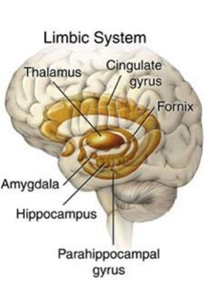
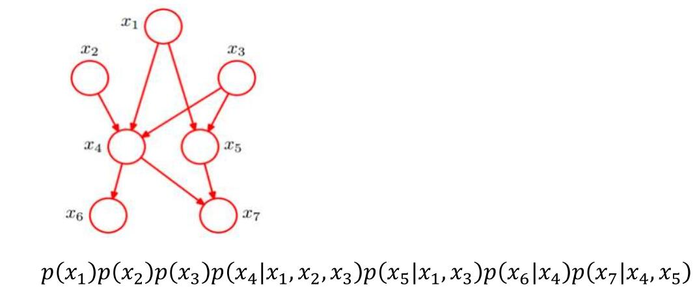
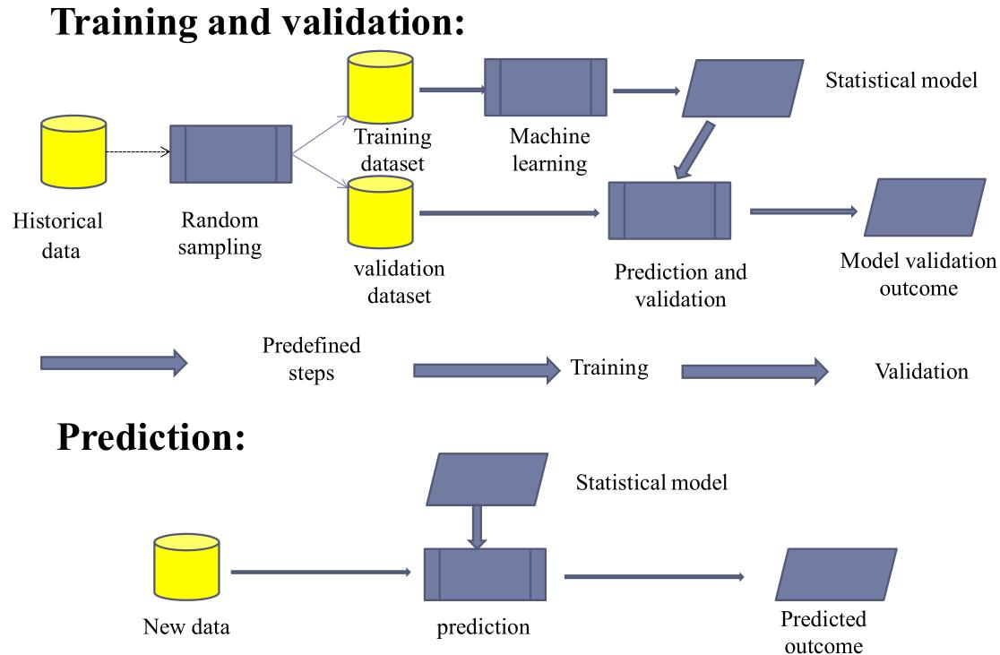

# 中英文词汇对照

因为这门课是英语试卷，有些专有名词还是得记录

|英文|中文|
|-|-|
|neurons|神经元|
|cortex|皮质（尤指大脑皮层）|
|neocortex|新皮质|
|synapses|突触|
|synaptic|突触的|
|dopamine|多巴胺|
|amnesia|失忆|
|prefrontal cortex|额叶前皮质|
|lobe|脑叶|
|subcortical|皮质下的|
|hippocampus|海马区|
|amygdala|杏仁核|
|thalamus|丘脑|
|basal ganglia|基底核|
|cerebellum|小脑|
|occipital lobe|枕叶|
|temporal lobe|颞叶|
|frontal lobe|额叶|
|parietal lobe|顶叶|
|arousal|激励|
|modulatory functions|调节功能|
|Reinforcement Learning|强化学习|
|Motor Control|运动控制|
|Executive Function|执行功能|
|motor coordination|运动协调|
|semantic|语义的|
|spike||
|dendrites|树突|
|axon|轴突|
|excitatory pyramidal neurons|兴奋性椎体神经元|
|inhibitory interneurons|抑制性中间神经元|
|white matter|白质|
|Likelihood function|似然函数|
|neurology|神经学|
|genetics|遗传学|

# 绪论

## 大脑

在大脑新皮质上，每个神经元都有约10k个来自其他神经元的输入，通过突触连接。而大脑中总体有20billion规模的神经元。

虽然每两个神经元之间的连接相对而言影响较小，但是通过学习机制（learning mechanisms），这些神经元们可以实现非常复杂的信息处理功能。

大脑的学习过程并不要求单个神经元非常复杂，它其实是信息整合的一个简单形式

1. 准确描述神经元的反应特性
2. 在聚合神经网络上实现复杂的信息处理

## 认知计算的基本问题

1. 视觉
2. 注意力
3. 多巴胺与奖励机制
4. 记忆
5. 含义（Meaning）
6. 任务导向行为

## 我们应该关注大脑的什么？

David Marr认为，我们只需要独立地关注三个层次：

1. 计算层次。即大脑中在进行什么计算，什么信息在被处理？
2. 算法层次。大脑中的计算是如何进行的，信息处理的步骤是什么？
3. 实现层面。硬件如何实现这些算法？

注意独立，我们就可以抛弃实现，只研究计算和算法层次。

这部分的研究的简明历史如下

1. 1960s~1990s，主要的研究是认为人脑和传统计算机差不多，所以研究主要面向逻辑和符号命题
2. 后来，基于概率的研究变得流行，贝叶斯概率的框架使用广泛，他强调大脑在信息处理过程中的分级性质。但是贝叶斯理论对大脑在神经层面的拟合不是很好，实际上大脑不像一个通用的计算设备
3. 神经网络

## 脑区域之下皮质

### 海马区（Hippocampus）

是旧皮质，在短期记忆中有很重要的作用。

### 杏仁核（Amyglada）

对情绪显著刺激（emotionally salient stimuli）很重要，并且可以向大脑的其他部分发送警报（alert）。

它在基于奖惩机制的强化运动（和认知）动作（reinforcing motor (and cognitive) actions）中也发挥重要的作用。

### 丘脑（Thalamus）

为感官信息进入大脑新皮质提供了主要通道。也可能对注意力、激励和其他调节功能很重要。它在感知和注意力以及运动控制和强化学习中发挥作用。

### 基底核（Basal Ganglia）

它是下皮质的一系列区域的集合，在运动控制、强化学习和执行功能（Executive Function）中发挥关键作用

它帮助做出最后的“GO”指令，决定是否执行大脑皮层建议的特定动作，以及决定是否更新前额叶的认知计划。

### 小脑（Cerebellum）

其神经元占了脑的一半，在运动协调中有重要作用。在大部分认知任务中也处于活跃状态。

## 脑区域之新皮质

Brodmann根据解剖结果把大脑分为四个区域。

### 枕叶（Occipital lobe）

这里包含初级的视觉皮层，在枕叶的非常末端的位置。然后包含向外辐射的高级视觉中枢。

### 颞叶（Temporal lobe）

包含初级的听觉皮层，以及联系到高级听觉和语言处理的区域。

与此同时，视觉看到的物体转换到语言、语言转换到视觉的功能也是在这里进行的。这也是我们为什么能进行阅读的原因。

颞叶也对语义知识（semantic knowledg）很重要，也就是你对事物的深层理解。

这里包含了我们对于他人的面容、名字，事实、事件、物体、文字的认知。

### 额叶

额叶的前部，或叫前额叶，是大脑执行功能的区域。这里是所有高级shots被called的区域。

在这里，你的所有计划被整理出来，然后受基本动机和情绪的影响后，才真正决定你会如何行动。

这里也是处理最抽象、最有挑战性的认知形式的关键所在。

额叶皮层的内侧和腹侧区域对于情绪和动机非常重要。

### 顶叶（Parietal lobe）

这里对encoding空间位置、数字、数学、抽象关系和其他有关“智慧”的东西很重要。

它给视觉信息指导运动动作提供了主要的通道。

## 神经元

大脑神经元如此复杂，其是为了一个非常简单的整体功能“检测（detection）”服务的。

神经元接受数以千计的输入，但其中重要且有意义的只有一些特定模式（specific pattern）的输入，这些有价值的输入被称为“spike”，这也是神经元之间交流的基础。

神经元接受信号后，将它们与阈值比较，然后加入到总体的输出中，再用这个总体的输出和其他神经元交流。

## 把神经元看作是Detector

发送神经元和接收神经元用突触连接，大部分突触都连接在接收端的树突上。这些信号通过树突进入细胞体，进行信息的处理与综合。

输出的阈值判断发生在输出端的最开始，也就是轴突。

突触网络的效能或者说权重，指的是发送神经元发送的信号能以多大程度影响到接收神经元。

从计算上说，权重决定了一个神经元接受什么。权重越大，神经元对这个输入就更敏感，反之亦然。

学习的过程就是不断地调整神经元之间连接的权重，来达到想要的输出。

## 大脑新皮质的神经网络

有85%的神经元是兴奋性锥体神经元（excitatory pyramidal neurons），它们的连接跨度很广，可以跨越不同的脑区，有时候甚至可以跨越整个大脑。学习行为主要就发生在这些兴奋性神经元中；有15%是抑制性中间神经元（inhibitory interneurons），它们的连接更加局部化。某种意义上，可以理解为兴奋性神经元的散热器。

## 新皮质的层级结构

新皮质具有6种不同的层，每种脑区都有这种6层结构。但是拥有不同功能的脑区，其6层结构的厚度也各有不同，暗示了层级结构的功能。

新皮质中负责数据输入的脑区（Input Area）接收感知的输入（例如视觉；通常会经过丘脑），这些脑区的Layer 4通常会更大。这是因为来自丘脑的轴突都连接到这里。这些输入层（input layer）有一种特别的兴奋性神经元，称为星状细胞（stellate cell）。这些细胞的树突非常浓密，并且似乎尤其善于收集这一层的局部轴突输入。

新皮质中的隐藏脑区（Hidden Area），并不直接接受感觉输入，也不直接输出运动动作。它们是这个输入和输出的中间部分。我们可以理解为，这些区域从感官输入中创建越来越复杂和抽象的类别（catagories），然后再从这些高级类别中，协助选择出正确的运动动作。这些脑区的superficial layers 2/3会更厚，包含了许多锥体神经元，并且都放在很好的位置来实现这些抽象化功能。

新皮质中的输出脑区（Output Area），拥有直接作用于肌肉控制区的突触，发出电信号后，可以直接影响物理运动。这些输出层有更厚的deep layer 5/6，会把轴突发送给许多下皮质区域。

## 新皮质中的连接模式

信息传输包含正向传播和反向传播两个过程。

正向传播时，信息从感官信息流向大脑中更高级、更深的部分，从而形成了越来越抽象和复杂的类别（catagories）

反向传播时，信息从隐藏层和输出层出发，回到这些区域在正向传播时的前级区域，从而支持自上而下的行为认知控制、直接注意力，并且帮助解决感官输入中的歧义。

所以说，区域之间的连接很大程度上是双向的，发送前向信息的区域通常也会收到下级区域的信息。这种双向连接对于使网络能够跨层聚合到连贯的整体活动状态很重要，对于错误驱动（error-driven）的学习也很重要。

## 类别和分布式表示（Categorization and Distributed Representations）

如上，当我们看到一个人时，在最低的一层中，这里我们获得的表示只有一些最基本的特征。在下一层，我们把这些特征连起来，变成更复杂的视觉特征。在下一层，我们把面部特征全部组合了起来，形成了对于面容的认知。最后，我们把这张脸和语义上的各种东西关联起来，例如名字，性别，性格。

这个过程可以通过fMRI来显示，不同视觉刺激的脑部活动区域高度重合。

## 神经元的数学公式

一个基本的积分和激发神经元（A Basic Integrate-and-Fire Neuron）

$$
\tau_m\dfrac{du(t)}{dt}=u_{res}-u(t)+R_mi(t)
$$

其中$\tau_m$是神经元的膜时间常数，其由通道的平均电导决定。$u_{res}$是神经元的静息电位。$i(t)$是输入电流，其由突触前神经元放电产生，并且是众多这种放电的和。$R_m$是神经元对电流的电阻。

具体来说，$i(t)$还受到突触连接强度的影响，

$$
i(t) = \sum_j\sum_{t^f_j} w_jf(t-t^f_j)
$$

其中$f(\cdot)$代表激活函数，$t$表示突触$j$的突触前神经元的放电时间，该时间由膜电位$u$达到阈值$\theta$的时间决定。

$$
u(t^f) = \theta
$$

# 神经网络基础概念

## 神经元及其数学模型

神经元大体上由四个部分组成：细胞体、轴突、树突、突触

在神经元的信息处理过程中，树突相当于信息的接收器，细胞体相当于加和、处理信息的东西，轴突相当于信息的发射器，突触就是信息传递的连接点。

神经元只有当输入信息达到阈值后才会兴奋。所有这些信息都是电化学信息。学习则是突触间电化学过程效率的变化的过程。

于是我们就可以把神经元抽象成一个数学模型。这其实是一个有向图，每个节点代表神经元的细胞体。每个节点一般的多个输入对应树突，一个输出（有时有多个）对应轴突。神经元的兴奋阈值在这里是节点的激活函数，而突触间的效率在这里就是边的权重。例如下图

其中一个经典的模型是感知器：

他这里的中间的两个大节点可以理解为把一个节点拆成两个部分。感知器的作用是把一系列输入分为两个类型中的一类。

## 大脑分区和基础的神经网络

大脑分区和功能之前探讨过了，这里不再赘述。

神经网络面对的问题是，对于一组历史数据$\{(x_1,y_1),(x_2,y_2),\cdots,(x_l,y_l)\}$，要找出一个函数$f(x)=\hat y$，使得对未来的数据$x$，$\hat y$是一个良好的预测。

单输入的神经元如下：

拓展到多输入为

$f$一般称为激活函数，典型的有：

**阶跃函数、符号函数**

$$
f(x) = step(x)
$$

$$
f(x)=sgn(x)
$$

**线性函数**

$$
f(x)=kx+b
$$

**sigmoid函数**

$$
f(x) = \sigma(x) = \dfrac{1}{1+e^{-x}}
$$

特别的，其导数为

$$
\sigma'(x) = \sigma(x)(1-\sigma(x))
$$

其范围为$(0,1)$，输出中心为$0.5$。指数运算会比较慢，并且$x$很大时，出现梯度消失问题。

**双曲正切**

$$
f(x) = \tanh(x)=\dfrac{2}{1+e^{-2x}}-1
$$

长得和Sigmoid很像，但是其范围为$(-1,1)$，输出中心为$0$。问题和sigmoid相同。

**ReLU**

$$
f(x)=\max(0,x)
$$

其没有指数运算，且不会梯度消失。但输入为负数时，完全失效。

**Leaky ReLU**

即在$x\geq 0$时，$f(x)=x$，在$x<0$时，$f(x)=ax$，其中$a$是一个相对于$1$很小的正常数。其对ReLU进行了微小的修正，使得在负数输入时有效。

有了这些东西，我们就可以构造神经网络了，其中最简单的单层（Single Layer）（实际上是双层）神经网络如下。

这样的神经网络作用极其有限。只能用在线性分类任务上，大部分函数都不是线性的，或者不是线性可分的。

于是就有了多层的神经网络，在上图的输入层和输出层之间添加一个或非常多个隐藏层。

这样，神经网络就能处理更多复杂的分类问题。但是，多层神经网络的问题是难以训练。

## 正向传播和反向传播

反向传播算法的出现解决了训练的问题。

假设神经元$j$的期望输出是$t_j$，实际输出是$o_j$，那么误差就是

$$
E = \dfrac{1}{2}\sum_j(t_j-o_j)^2
$$

我们要优化的是每个连接的权重，我们就要找到每个权重对于误差的影响，偏导数

$$
\dfrac{\partial E}{\partial w_{ij}}
$$

其中$w_{ij}$是神经元$i$到$j$的权重

我们经常会用梯度下降法来优化权重，其迭代方向为

$$
\Delta w_{ij} = -\eta\dfrac{\partial E}{\partial w_{ij}}
$$

假设上一层的输入是$b_i$，这一层的输入为$\beta_j$，那么有$\beta_j = \sum_i w_{ij}b_i$

注意到$w_{ij}$首先影响输入值$\beta_j$，再影响到输出值$o_j$，最后才能影响到$E$。所以

$$
\dfrac{\partial E}{\partial w_{ij}} = \dfrac{\partial E}{\partial o_j}\cdot \dfrac{\partial o_j}{\partial \beta_j}\cdot\dfrac{\partial \beta_j}{\partial w_{ij}}
$$

其中，显然有$\dfrac{\partial \beta_j}{\partial w_{ij}}=b_i$

设$g_j = -\dfrac{\partial E}{\partial o_j}\cdot \dfrac{\partial o_j}{\partial \beta_j}$，如果激活函数为$\sigma(x)$，假设神经元阈值为$\theta_j$，则

$$
g_j = -(t_j-o_j)\sigma'(\beta_j-\theta_j) = o_j(1-o_j)(t_j-o_j)
$$

于是更新公式为

$$
w_{ij}\leftarrow w_{ij}+\Delta w_{ij} = w_{ij} + ng_jb_i
$$

# 传统学习

## 贝叶斯推理和学习

传统的频率学派认为，可以用大量试验中，事件出现的频率来估计概率。

但是贝叶斯学派不同，贝叶斯学派同时利用样本信息和先验知识。

频率学派通过大量独立实验将概率解释为统计均值（大数定律）。贝叶斯学派则将概率解释为信念度（degree of belief）（不需要大量的实验）。

频率学派把模型参数看做固定量，把样本看做随机变量。而贝叶斯学派则都看作随机变量。

贝叶斯推理在如下情况时，比频率方法更为有效：

- 样本数量十分有限
- 避免过拟合
- 我们有理由相信某个模型更为合适，但是这个理由不包含在样本数据里
- 我们更想知道某个事实有多大的可能性，而不是可能性最大的事实是什么

贝叶斯学派经常用到以下概率公式

**条件概率**

$$
P(A|B) = \dfrac{P(AB)}{P(B)}
$$

值得注意的是$P(A|B)\neq P(B|A)$通常成立

**事件的积的概率**

$P(AB) = P(A|B)P(B)$

有$P(AB)=P(BA)$

**全概率公式**

$$
P(A) = P(AB_1)+P(AB_2)+\cdots+P(AB_n)
$$

其中$B_1+B_2+\cdots+B_n$是必然事件，它们两两互斥。

于是再由条件概率，得到全概率公式为：

$$
P(A)=\sum^n_{i=1}P(A|B_i)P(B_i)
$$

**贝叶斯公式**

$$
P(B_i|A) = \dfrac{P(A|B_i)P(B_i)}{P(A)}=\dfrac{P(A|B_i)P(B_i)}{\sum^n_{i=1}P(A|B_i)P(B_i)}
$$

将贝叶斯公式写在模型中，得到

$$
P(model|data) = \dfrac{P(data|model)P(model)}{P(data)}
$$

也即

$$
P(\theta|X)=\dfrac{P(X|\theta)P(\theta)}{P(X)}
$$

其中$P(\theta|X)$是模型的后验概率，$P(X|\theta)$是数据的似然函数（Likelihood Function），$P(\theta)$是模型的先验概率，$P(X)$为证据。

### 先验概率

先验概率分布即$P(\theta)$，他的目的是，在我们得到任何样本之前，先capture我们对于$\theta$的先验知识。

### 似然函数

记为$L(\theta|X)=P(X|\theta)$，固定$X$时，关于参数$\theta$的似然函数，（在数值上）等于给定参数$\theta$后变量$X$的概率。

### 后验概率

贝叶斯推断的目标就是，使用样本数据$X$，来更新我们的先验概率$P(\theta)$，就得到了后验概率

### 最大后验估计（MAP）

$$
h_{MAP} = \arg\max_{h\in H} P(h|D) = \arg\max_{h\in H}\dfrac{P(D|h)P(h)}{P(D)}
$$

由于分母是常数，所以有

$$
h_{MAP} = \arg\max_{h\in H}P(D|h)P(h)
$$

### 最大似然估计（MLP）

$$
h_{MLP} = \arg\max_{h\in H}P(D/h)
$$

在有些时候，所有$H$的估计的先验概率是一样的（或者可以假设为一样的），就可以用最大似然估计。

### 贝叶斯过程

$$
P(X|\theta)=\dfrac{P(\theta|X)P(X)}{P(\theta)}
$$

假设你对某些特定的参数$\theta$感兴趣，那么通用的步骤如下

1. 通过先验知识确定$P(\theta)$
2. 通过试验等办法收集$X$
3. 用贝叶斯公式得到后验概率
4. 后验概率作为下一次迭代的先验概率，下次迭代时要获取新的$X$

### 贝叶斯分类器

假设总共有$N$类，其label分别为$y=\{c_1,c_2,\cdots,c_N\}$。对于一个样本$x$，设其属于$c_j$类，其被错误归类为$c_i$时，损失大小为$\lambda_{ij}$

样本$x$被归类为$c_i$的条件风险（或期望损失）就为

$$
R(c_i|x) = \sum^N_{j=1}\lambda_{ij}P(c_j|x)
$$

我们的任务是最小化损失，即最小化

$$
R(h) = E_x[R(h(x)|x)]
$$

为了最小化总体风险，我们只需要在每个样本上都选择那个能使条件风险最小的类别。即

$$
h^*(x)=\arg\min_{c\in y}R(c|x)
$$

此时$h^*(x)$就是贝叶斯最优分类器。与之对应的总体风险$R(h^*)$称为贝叶斯风险。

具体来说，若目标是最小化分类错误率，我们是损失可以写作

$$
\lambda_{ij}\left\{\begin{matrix}
0, & i=j\\
1, & i\neq j
\end{matrix}\right.
$$

此时条件概率可以算出来，

$$
R(c|x) = 1-P(c|x)
$$

于是最优分类器就为

$$
h^*(x) = \arg\max_{c\in y}P(c|x)
$$

即对每个样本$x$，都选择能使其后验概率最大的类别$c$

对于$P(c|x)$怎样得出，判别式模型对于给定的$x$，通过直接建模$P(c|x)$来预测$c$。而生成式模型，先对联合概率$P(x,c)$建模，再通过贝叶斯公式得到$P(c|x)$

$$
P(c|x)=\dfrac{P(x,c)}{P(x)} = \dfrac{P(c)P(x|c)}{P(x)}
$$

### 朴素贝叶斯分类器

之前的贝叶斯公式的问题是$P(x|c)$是一个联合概率，其并不方便直接从训练样本里面得出。朴素贝叶斯假设属性条件独立，那么有

$$
P(c|x)=\dfrac{P(c)P(x|c)}{P(x)}=\dfrac{P(c)}{P(x)}\prod^d_{i=1}P(x_i|c)
$$

其中$d$为属性数目，$x_i$为$x$在第$i$个属性上的取值。

于是朴素贝叶斯分类器就为

$$
h_{nb} = \arg\max_{c\in y} P(c)\prod^d_{i=1}P(x_i|c)
$$

若有充足的独立同分布样本，则可容易地估计出类先验概率

$$
P(c) = \dfrac{|D_c|}{|D|}
$$

即类$c$的个数在所有样本个数中的占比。

对于离散属性，条件概率可以估计为

$$
P(x_i|c)=\dfrac{|D_{c,x_i}|}{|D_c|}
$$

$D_{c,x_i}$指的是，$D_c$中，在第$i$个属性上取值为$x_i$的样本组成的集合。

对于连续属性，可以考虑概率密度函数，例如$P(x_i|c)\sim N(\mu_{c,i},\sigma^2_{c,i})$，其中$\mu_{c,i},\sigma^2_{c,i}$是第$c$类样本在第$i$个属性上取值的均值和方差。

### 贝叶斯网络

贝叶斯网络是一个有向无环图。其中节点代表随机变量$\{X_1,X_2,\cdots,X_n\}$。如果两个节点之间有因果关系，那么用一条有向边连接，起点是原因，终点是结果。

这个因果关系由参数$\theta$描述，所以贝叶斯网络可以表述为一个图$G$和参数$\theta$，即$B=< G,\theta >$。假设属性$x_i$在图中的父节点为$\pi_i$（注意可以有多个父节点），则$\theta_{x_i|\pi_i}=P_B(x_i|\pi_i)$

贝叶斯网假设每个属性与它的非后裔属性独立，于是有

$$
P_B(x_1,x_2,\cdots,x_d) = \prod^d_{i=1}P_B(x_i|\pi_i) = \prod^d_{i=1}\theta_{x_i|\pi_i}
$$

例如

## 有监督学习

即训练集除了属性，还有标签。

其训练、验证、预测程序框架如下

一般来说，其有如下步骤

1. 决定数据集的类型
2. 获取数据集
3. 决定学习的模型，以及学习的算法
4. 完成程序设计，在训练集上跑
5. 评估正确率等指标，然后选择继续修正参数再次训练或者结束。

有监督学习的任务主要分为两个：回归、分类。回归就是对输入给出预测的输出，例如预测未来某一天的温度；分类则是对样本进行划分，使其属于某一个类别。

常见的算法有：决策树、随机森林、支持向量机、逻辑回归、人工神经网络、K近邻、贝叶斯等

### 回归任务

其一般如下。设样本为$\{(x^{(1)}, y^{(1)}), (x^{(2)}, y^{(2)}), \cdots, (x^{(m)}, y^{(m)})\}$。程序对于$x$给出的预测是$h_\theta(x)=\hat y$，其中$h_\theta$就是我们的预测函数，或者说模型，而$\theta$是模型参数。我们的目标是求出

$$
\theta^* = \arg\min_{\theta}\sum^m_{i=1}(\hat y^{(i)}-y^{(i)})^2=\arg\min_\theta J(\theta)
$$

至于如何求出，一般会使用数值最优化方法，例如梯度下降。搜索方向即是$-\eta\nabla J(\theta)$

### 分类任务

总体来说和回归任务形式上还是挺相似的。只是样本的$y$记录的是样本的类别标签。给出的预测也是预测标签。通常目标也是最小化损失函数。

前面在贝叶斯分类器中提到过，生成式模型（Generative Algorithms）和判别式模型（Discriminative Algorithms）的区别。

判别式模型直接对$P(Y|X)$建模。例子：通过人脸识别来判断性别。典型算法有：逻辑回归、SVM、神经网络等。

而生成式模型通过对$P(X|Y)$和$P(Y)$建模，通过贝叶斯公式来算$P(Y|X)$。例子：你收到电子邮件（观察结果，the observation），你想推断邮件是否是垃圾邮件（原因，the cause）。典型算法有：朴素贝叶斯、贝叶斯网络。

### 逻辑回归（Logistic Regression）

逻辑回归是一种线性分类算法，其通常是二分类，并且给出确定结果（而不是属于某一类的概率）。当输出为1时，预判为正类，输出为0时，预判为负类。

线性回归的模型如下，其一般用于回归问题

$$
h_\theta(x)=\theta_0+\theta_1x_1+\theta_2x_2+\cdots+\theta_nx_n = \theta^Tx+\theta_0
$$

想把它转化到分类问题上时，我们给他套上一个sigmoid函数，即$\sigma(x)=\dfrac{1}{1+e^{-z}}$

得到逻辑回归的模型如下

$$
h_\theta(x) = \dfrac{1}{1+e^{-(\theta^Tx+\theta_0)}}
$$

之后我们有

$$
\ln\dfrac{h_\theta(x)}{1-h_\theta(x)} = \theta^Tx+\theta_0
$$

因为逻辑回归的输出只有$0,1$，当$h_\theta(x)=0$时，$\theta^Tx+\theta_0=-\infty$，当$h_\theta(x)=1$时，$\theta^Tx+\theta_0=\infty$

所以我们的判别方法为：当$\theta^Tx+\theta_0<0$时，判断为负类（0）。当当$\theta^Tx+\theta_0>0$时，判断为正类（1）。

关于如何训练，我们得到的损失函数如下

$$
J(\theta) = \dfrac{1}{m}\sum^m_{i=1}[-y^{(i)}\log(h_\theta(x^{(i)}))-(1-y^{(i)})\log(1-h_\theta(x^{(i)}))]
$$

其中$m$是样本数量，$y$的取值为$\{0,1\}$。目标就是最小化损失函数，可以利用梯度下降法等办法。

另外，还是有可能算出属于某个类的概率的，即$p(y/x;\theta)=(h_\theta(x))^y(1-h_\theta(x))^{1-y}$

### 支持向量机

支持向量机也是二分类分类器。其基本思想是找到一个分类面（或者是线，或者是超平面），把样本分成两类。但是这样的划分面可能有很多个

（注意，样本虽然形式上和逻辑回归相似，都是$\{(x_1,y_1),(x_2,y_2),\cdots,(x_1,y_1),(x_m,y_m)\}$，并且都是二分类，但是支持向量机这里，$y\in\{-1,1\}$，$1$代表正类，$-1$代表负类）

直觉上来说，我们应该选择那条加粗的线。因为它对样本的局部扰动容忍性最好。换言之，这个划分超平面所产生的分类结果是最鲁棒的，对未见示例的泛化能力最强.

划分的超平面的形式如下

$$
w^Tx+b=0
$$

其中$w=(w1,w2,\cdots,w_d)$是法向量，决定超平面的方向，$b$是位移项，决定超平面和原点的距离。我们将其记为$(w,b)$，样本空间中任意一个点$x$到该超平面的距离为

$$
r = \dfrac{|w^Tx+b|}{||w||}
$$

假设超平面能将训练样本正确分类，即对于$(x_i,y_i)\in D$，若$y_i=1$，则有$w^Tx_i+b>0$，若$y_i=-1$，则有$w^Tx_i+b<0$，令

$$
\left\{\begin{matrix}
 w^Tx_i+b\geq +1, & y=+1\\
 w^Tx_i+b\leq -1, & y=-1
\end{matrix}\right.
$$

如下图

距离超平面最近的几个训练样本使得上式的等号成立，这些训练样本被称为支持向量。两个异类支持向量到超平面的距离之和为

$$
\gamma = \dfrac{2}{||w||}
$$

这也被称为间隔。

支持向量机的训练目标就是最大化间隔。也就是如下的最优化问题

$$
\begin{align*}
 \max_{w,b} &\quad \dfrac{2}{||w||}\\
 \text{s.t.} &\quad y_i(w^Tx_i+b)\geq 1,\quad i=1,2,\cdots,m
\end{align*}
$$

其中目标函数等价于最小化问题

$$
\begin{align*}
 \min_{w,b} &\quad \dfrac{1}{2}||w||^2\\
 \text{s.t.} &\quad y_i(w^Tx_i+b)\geq 1,\quad i=1,2,\cdots,m
\end{align*}
$$

上式是一个凸二次规划问题，其对偶问题是

$$
\begin{align*}
 \max_{\alpha} &\quad \sum^m_{i=1}\alpha_i-\dfrac{1}{2}\sum^m_{i=1}\sum^m_{j=1}\alpha_i\alpha_jy_iy_jx_i^Tx_j\\
 \text{s.t.} &\quad \sum^m_{i=1}\alpha_iy_i=0\\
  &\quad \alpha_i\geq 0,\quad i = 1,2,\cdots,m
\end{align*}
$$

求出$\alpha$后，即可算出模型

$$
f(x)=w^Tx+b=\bigg(\sum^m_{i=1}\alpha_iy_ix_i^T\bigg)x+b=\sum^m_{i=1}\alpha_iy_ix_i^Tx+b
$$

到目前为止，我们能分类的样本都只能是线性可分的。如果是对于异或问题等非线性可分的问题，我们引入核函数，将样本从原始空间映射到一个更高维的特征空间，使得样本在这个特征空间内线性可分。

可以证明，如果原始空间是有限维，即属性数有限，那么一定存在一个高维特征空间使样本可分.

令$\phi(x)$表示将$x$映射后的特征向量，于是，在特征空间中划分超平面所对应的模型可表示为

$$
f(x) = w^T\phi(x)+b
$$

其对偶问题是

$$
\begin{align*}
 \max_{\alpha} &\quad \sum^m_{i=1}\alpha_i-\dfrac{1}{2}\sum^m_{i=1}\sum^m_{j=1}\alpha_i\alpha_jy_iy_j\phi(x_i)^T\phi(x_j)\\
 \text{s.t.} &\quad \sum^m_{i=1}\alpha_iy_i=0\\
  &\quad \alpha_i\geq 0,\quad i = 1,2,\cdots,m
\end{align*}
$$

其中$\phi(x_i)^T\phi(x_j)$是样本映射到特征空间之后的内积。由于特征空间维数可能很高，甚至可能是无穷维，因此直接计算$\phi(x_i)^T\phi(x_j)$通常是困难的。为了避开这个障碍，可以设想这样一个函数：

$$
\kappa(x_i,x_j)=<\phi(x_i),\phi(x_j)>=\phi(x_i)^T\phi(x_j)
$$

即$x_i$与$x_j$在特征空间的内积等于它们在原始样本空间中通过函数$\kappa(x_i,x_j)$计算的结果。这里的这个函数就是核函数。

解出来的模型就是

$$
f(x) = w^T\phi(x)+b = \sum^m_{i=1}a_iy_i\phi(x_i)^T\phi(x)+b = \sum^m_{i=1}a_iy_i\kappa(x_i,x)+b
$$

核函数具体形式TODO

### KNN

KNN的思想很简单，挑选出距离该样本最近的$k$个样本，这$k$个样本中最多的类别决定为预测类别。算法流程如下

todo

其中距离常用的有欧拉距离、曼哈顿距离等。$k$是超参数，一般比较小，如几或几十，通常可以用交叉验证来确定最优的$k$

KNN的错误概率为

$$
P(err)=1-\sum_{c\in Y}P(c|x)P(c|z)
$$

其中$x$是测试样本，$z$是其最邻近样本。

### 随机森林

在讲随机森林前要先讲集成学习。

如上，先产生一组个体学习器，再用某种策略将它们结合起来。

个体学习器通常由一个现有的学习算法从训练数据产生，

根据个体学习器的生成方式，目前的集成学习方法大致可分为两大类：

1. 个体学习器间存在强依赖关系、必须串行生成的序列化方法
2. 以及个体学习器间不存在强依赖关系、可同时生成的并行化方法

前者的代表是Boosting，后者的代表是Bagging和随机森林。

Bagging要求每个预测器的算法相同（也称为基学习器的基学习算法），但是在不同的随机训练子集上训练。Bagging要去取样时样本放回，如果取样时样本不放回的叫pasting。

一旦这些基学习器训练完成，继承就可以通过简单地聚合所有预测器的预测来对新实例做出预测。对于分类，聚合函数通常是统计法（即投票，简单多数），而回归问题则通常用平均法。

随机森林是决策树的集成，通常使用bagging。

1. 设训练集的大小是$n$，利用采样，可放回地对训练集采样$n$次，得到一个大小同样为$n$的数据集。重复这个操作，得到$m$个大小为$n$采样集。（可以算出每个采样集中有原始数据集的$63.2\%$的样本）
2. 我们在这$m$个采样集上，分别训练$m$个决策树。
3. 用这$m$个决策树同时预测一个数据，通过投票结果，给出最后的判断。

传统的决策树是，从当前的$d$个特征中选择最优的特征。随机森林中的决策树，是随机选取$d$个特征中的$k$个特征。在从$k$个特征中选出最优的那个特征。

## 无监督学习

和有监督学习相比，无监督学习就是样本没有打上label。

训练集一般就没有$y$，为$\{x^{(1)}, x^{(2)}, \cdots, x^{(m)}\}$。常见的应用有：

网络搜索、认知科学、神经学、遗传学。

### K-means聚类算法

K-means算法把$n$个样本分成$k$类，每一个样本和与它最近的类型中心分为一类。这里可以是各种距离，包括欧几里得距离、海明距离、曼哈顿距离等。

假设样本集为$D=\{x_1,x_2,\cdots,x_m\}$，要把他们分为$k$类，$C=\{C_1,C_2,\cdots,C_k\}$。K-means的优化目标是，最小化：

$$
E = \sum^k_{i=1}\sum_{x\in C_i}||x-\mu_i||^2_2
$$

其中$\mu_i$是每一类的聚类中心，

$$
\mu_i = \dfrac{1}{|C_i|}\sum_{x\in C_i}x
$$

$E$越小，代表着各类的样本和样本重心的紧密度（closeness degree）越高，代表着聚类效果越好。

算法流程如下：

1. 随机选取$k$个聚类中心$\mu_i$，可以指定坐标，也可以直接从样本点中随机选。
2. 把每个点划分进最近的聚类中心的那一类。
3. 计算新的聚类中心。即使用$\mu_i = \dfrac{1}{|C_i|}\sum_{x\in C_i}x$
4. 重复2-3，直到迭代次数足够，或聚类中心不再改变（两次迭代的距离差距极小）

### 主成分分析（Principal Component Analysis(PCA)）

主成分分析更多地用作一种降维手段，它主要涉及识别数据中的相关性。

考虑在正交属性空间中的样本点，如何用一个超平面（直线的高维推广）对所有样本进行恰当的表达？

显然这个超平面如果存在，就要

- 最近重构性（Recent reconfigurability）：样本点到这个超平面的距离都足够近。
- 最大可分性（Maximum separability）：样本点在这个超平面上的投影能尽可能分开。

算法流程如下，设样本集是$D=\{x_1,x_2,\cdots,x_m\}$，要将他降维至$d'$维。

 1. 对所有样本进行中心化：$x_i\rightarrow x_i-\dfrac{1}{m}\sum^m_{i=1}x_i$，即最后使得$\sum_i x_i=0$
 2. 计算样本的协方差矩阵$XX^T$
 3. 对协方差矩阵$XX^T$做特征值分解（常见的其实会用SVD分解，分解成$U\Sigma V^T$，这里的$V$，每一列向量都是样本的主成分，也是特征值）
 4. 取$V^T$中的前$d'$个列向量$w_1,w_2,\cdots,w_{d'}$
 5. 输出$W=[w_1,w_2,\cdots,w_{d'}]$

此时，样本点$x_i$在低维坐标中的投影是$z_i=(z_{i1},z_{i2},\cdots,z_{i}d')$，其中$z_{ij} = w_j^Tx_i$（或者说，$z_i=W^Tx_i$）。如果基于$z_i$来重构$x_i$，则有$\hat x_i = \sum^{d'}_{j=1}z_{ij}w_j$。

至于如何选择$d'$，则可以使用交叉验证，使用KNN验证不同的$d'$的效果。

对PCA，还可从重构的角度设置一个重构阈值，例如$t = 95\%$，然后选取使下式成立的最小$d'$值：

$$
\dfrac{\sum^{d'}_{i=1}\lambda_i}{\sum^{d}_{i=1}\lambda_i}\geq t
$$

其中$\lambda_i$是特征值，并且特征值从大到小排序。

### 独立成分分析（Independent Component Analysis(ICA)）

ICA是一种统计学原理的计算方法，是一种线性变换。这个变幻把数据或信号分为统计学意义上独立的非高斯源的线性组合。其最重要的假设是，假设信号在统计学意义上是独立的。

经典问题是鸡尾酒会问题（cocktail party problem）。

在派对中，可能会有很多人说话，这些声音嘈杂在一起，但是人可以从其中专注于单一的说话者。ICA就是用于解决这种分离问题的。图上的$W$是分离矩阵。

### 生成对抗网络（Generative Adversarial Network(GAN)）

GAN由一个生成网络（generation network）和一个判别网络（discriminant
network）组成。

具体而言，生成网络从潜在空间（potential space，latent space）中随机采样来作为输入（通常会用随机分布作为输入，并且通常用高斯分布），其输出需要尽可能模拟训练集中的真实样本。

判别网络的输入是真实样本和生成网络的输出，目的就是尽可能将生成网络生成的东西和真实的东西区分开来。

两个网络相互对抗，并不断调整参数，最终目标是使判别网络无法很好地区分生成网络生成的数据和真实样本的数据。

其公式如下

$$
\min_G\max_D V(D,G)=E_{x\sim p_{data}(x)}[\log D(x)] + E_{z\sim p_z(z)}[\log(1-D(G(z)))]
$$

其中$E_{x\sim p}[\log Q(x)]$这种形式的东西是交叉熵，见附录。

$E_{x\sim p_{data}(x)}[\log D(x)]$描述的是真实数据的交叉熵，其中$x$是真实数据。而$E_{z\sim p_z(z)}[\log(1-D(G(z)))]$是从潜在空间中生成的东西的交叉熵，其中$z$是从中生成的东西。

$V(D,G)$相当于表示真实样本和生成样本的差异程度，其中G是生成器，D是判别器。$min_G\max_D$代表，首先固定$G$，最大化判别器的判别效果。然后最大化判别器之后将其固定，要求最小化生成器生成的东西和真实数据的差异。

## 半监督学习

如果训练集里面一部分是有标签的，而另一部分是无标签的，那么在此上训练的就是半监督学习算法。 

虽然什么比例都可以，但通常情况下是，有标签的只占一小部分，大部分仍是无标签。大部分的半监督学习算法也是结合了有监督学习和无监督学习，例如深度置信网络（Deep Belief Networks(DBNS)），他是一个以无监督学习为基础的受限玻尔兹曼机（Restricted Boltzmann Machine(RBMS)），但是整个系统却是建立在有监督学习技术上的。

# 强化学习

## 概论

在强化学习中，软件智能体在环境中进行观察并采取行动，作为回报，它会获得奖励。

也就是说，强化学习的数据是很多对“状态-动作”，每采取一个动作，到达一个新的状态，然后获得奖励（或惩罚）。而其目标是，学会以一种可以随时间推移最大化其预期回报的方式来采取行动。

假设每一步行动$a_t$后，状态从$S_t$转移到$S_{t+1}$，获得$r_t$的回报，那么从$t$开始的总回报为（注意和后面区分）

$$
R_t = \sum^\infty_{i=t} r_i
$$

需注意“机器”与“环境”的界限，在环境中状态的转移（指采取动作后的转移方向）、奖赏的返回是不受机器控制的，机器只能通过选择要执行的动作来影响环境，也只能通过观察转移后的状态和返回的奖赏来感知环境.

## 马尔科夫决策过程（Markov Decision Processes）

我们可以使用马尔科夫决策过程来描述一个强化学习任务。

机器处于环境$E$中，状态空间为$X$，每个状态$x\in X$是机器感知到的环境的描述。机器能采取的动作构成的动作空间为$A$，若某个动作$a\in A$作用在当前的状态$x$上，则（潜在的）转移函数$P$将使得环境从当前状态按某种概率转移到另一个状态。在转移到另一个状态的同时，环境会根据（潜在的）奖赏函数$R$反馈给机器一个奖赏。

综合起来，强化学习任务对应了四元组$E=< X,A,P,R >$，其中$P:X\times A\times X\rightarrow \mathbb{R}$指定了状态转移的概率，$R:X\times A\times X\rightarrow \mathbb{R}$指定了奖赏。在有些时候奖赏函数只和状态转移有关，即$R:X\times X\rightarrow \mathbb{R}$。如下是用有向图表示的一个例子

一个状态转移如果是马尔科夫的，则必须要符合马尔科夫性质。也就是说，状态转移只取决于当前的状态，而与过去的状态无关（独立）。公式表述如下

$$
P[x_{t+1}|x_t] = P[x_{t+1}|x_1,x_2,\cdots,x_t]
$$

当然，马尔科夫决策过程中的所有状态转移都要是马尔科夫的。

当然，有些地方马尔科夫决策过程是五元组，还要多一元$\gamma$，其是折扣因子（discount factor），其取值范围为$[0,1]$，此时，从$t$开始的奖赏（称为$\gamma$折扣累计奖赏）为

$$
R_t = \sum^\infty_{i=0}\gamma^i r_{i+t}
$$

如果不使用折扣因子，则可以使用$T$步累计奖赏（注意和前面区分）

$$
R_t = \dfrac{1}{T}\sum^T_{t=1}r_t
$$

如果转移不是确定的，那么就要使用$E[\sum^\infty_{i=0}\gamma^i r_{i+t}]$和$E(\dfrac{1}{T}\sum^T_{t=1}r_t)$，对所有的随机变量求期望，来求期望奖赏。

机器在这样一个马尔科夫决策过程中，要做的是通过在环境中不断地尝试而学得一个“策略”（policy）$\pi$，根据这个策略，在状态$x$下就能得知要执行的动作$a=\pi(x)$。策略有两种表示方法

1. $\pi :X\to A$，用于确定性的策略
2. $\pi:X\times A\to \mathbb{R}$，用于表示概率、随机性的策略，此时用$\pi(x,a)$（或者$\pi(a|x)$）表示状态$x$下选择动作$a$的概率。注意必须有$\sum_a \pi(x,a)=1$。

此时，在策略$\pi$下，状态$x$的奖励就为（假设第$t$步进行到$x$）

$$
R_x=E_\pi[R_{t+1}|X_t=x]
$$

把从此时开始的总折扣奖励记为

$$
G_t = R_{t+1}+\gamma R_{t+2}+\cdots = \sum^\infty_{k=0}\gamma^kR_{t+k+1}
$$

也可以用$T$步累计奖赏。策略的优劣取决于长期执行这一策略后得到的累计奖赏。

在模型已知时，对任意策略$\pi$能估计出该策略带来的期望累积奖赏。用这个期望累积奖赏来评估策略。

假设回报只和状态转移有关，那么从此时开始的状态值函数（Value Function）记为

$$
V_\pi(x) = E_\pi[G_t|X_t=x]
$$

区分两种累计奖赏，以$0$为开始行动步骤，则有

$$
\left\{\begin{matrix}
 V^\pi_T(x) = E_\pi[\frac{1}{T}\sum^T_{t=1}r_t|x_0=x],& T步累积奖赏\\
 V^\pi_\gamma(x)=E_\pi[\sum^{+\infty}_{t=0}\gamma^t r_{t+1}|x_0=x], & \gamma 折扣累积奖赏
\end{matrix}\right.
$$

如果回报和状态转移和采取的动作都有关，那么状态-动作值函数记为

$$
Q_\pi(x,a) = E_\pi[G_t|X_t=x, A_t=a]
$$

区分有

$$
\left\{\begin{matrix}
 Q^\pi_T(x,a) = E_\pi[\frac{1}{T}\sum^T_{t=1}r_t|x_0=x,a_0=a],& T步累积奖赏\\
 Q^\pi_\gamma(x,a)=E_\pi[\sum^{+\infty}_{t=0}\gamma^t r_{t+1}|x_0=x,a_0=a], & \gamma 折扣累积奖赏
\end{matrix}\right.
$$

于是我们的优化目标就是选出最优策略

$$
\pi^\ast(x) = \arg\max_a Q^\ast(x,a)
$$

## 有模型学习

考虑多步强化学习任务，暂且假定任务对应的马尔科夫决策过程的四元组$E=< X,A,P,R >$均为已知，这样的情形称为“模型已知”，即及其已对环境进行了建模，能在机器内部模拟出与环境相同或近似的状况.在已知模型的环境中学习称为“有模型学习" (model-based learning)。

此时，对于任意的状态$x,x'$和动作$a$，在$x$状态下执行动作$a$转移到$x'$状态的概率$P^a_{x\to x'}=P[X_{t+1}=x'|X_t=x,A_t=a]$是已知的，其带来的奖赏$R^a_{x\to x'}$也是已知的。

### 动态规划

众所周知，动态规划是非常通用的方法，只要满足：

1. 最优子结构
2. 重叠子问题

即可使用。

在强化学习中，DP需要知道整个环境，并且$V_\pi(x)$需要是递归的。另外，$V(x)$的估计是自助的（bootstrapping）

在强化学习中使用DP的主要想法是：使用值函数来构建搜索最优策略的方式；需要一个对于环境的完美模型。主要由两步构成：从任意的策略开始；重复评估/改进直到收敛。评估/改进则是：计算$\pi$的$V_\pi(x)$，然后用$V_\pi(x)$来改进$\pi$

通过$\pi$来计算$V_\pi(x)$是一个递归的过程，以$\gamma$为例，有

$$
V^\pi_\gamma(x) = \sum_{a\in A}\pi(x,a)\sum_{x'\in X}P^a_{x\to x'}(R^a_{x\to x'}+\gamma V^\pi_{\gamma}(x'))
$$

这个递归等式也称为Bellman等式（推导过程可以去周志华《机器学习》查阅，主要是因为满足马尔科夫性质，并且已知$P$和$R$，做全概率展开，才能推导）。显然的，利用动态规划，我们可以从$0$开始，从低到高计算，这样只需要计算$T$次即可到达现在的值函数。

通过$V_\pi(x)$来更新$\pi$，则是

$$
\pi'(x) = \arg\max_{a\in A}Q_\pi(x,a) = \arg\max_{a\in A}\sum_{x'\in X}P^{a}_{x\to x'}[R^a_{x\to x'}+\gamma V_\pi(x')]
$$

注意上式是通过用$V_\pi$来表示$Q_\pi$来实现，具体公式推导可以去周志华《机器学习》查阅。

此时$\pi'$要么严格好于$\pi$，要么$\pi'$已经是最优的了。

重复执行上述更新过程，我们有两种停止更新的策略

1. 策略迭代。即真的用$\pi_0$计算$V_{\pi_0}$，再用其更新出$\pi_1$，再计算$V_{\pi_1}$，直到$\pi$收敛。输出$\pi^*$他要用两次嵌套迭代，在每次改进策略后都需重新进行策略评估。但是不需要收敛到$V_{\pi_k}$（我实在不明白老师PPT里这句话指的是什么意思）
2. 值迭代。即使用$V_{k+1}(x) = \max_{a\in A}\sum_{x'\in X}P^a_{x\to x'}(R^a_{x\to x'}+\gamma V_k(x'))$来迭代。需要收敛到$V^*$（我实在不明白老师PPT里这句话指的是什么意思）

两个算法的伪代码如下（虽然是基于$T$步奖赏的，但是修改不难）

## 免模型学习

在现实的强化学习任务中，环境的转移概率、奖赏函数往往很难得知，甚至有多少状态都很难得知，往往只有一些经验和模拟经验。如果学习算法不依赖于环境建模，则称为免模型学习。

### 蒙特卡罗方法（MC）

对比有模型学习的方法，策略迭代算法在没有模型的时候，首先就没有办法评估策略，因为未知$P,R$而无法做到全概率展开。另一方面，策略迭代算法估计的是状态值函数$V$，而最终的策略则是通过状态-动作值函数$Q$来获得。当模型已知时，$V$到$Q$很容易，但未知时则很困难。另外，模型已知的时候，我们可以从起始状态动态规划地得到所有状态。而没有模型时则不行，只能在探索的过程中逐渐发现各个状态。

一种直接的策略评估替代方法是多次“采样”，然后求取平均累积奖赏来作为期望累积奖赏的近似，这称为蒙特卡罗强化学习.由于采样必须为有限次数，因此该方法更适合于使用$T$步累积奖赏的强化学习任务.

**策略评估**

目标：获取$V_\pi(x)$

提供的数据：在$E$中执行策略$\pi$，产生的轨迹（episode）$< x_0,a_0,r_1,x_1,a_1,r_2,\cdots,x_{T-1},a_{T-1},r_T,x_T >$,

其思想是，只要多次采样，求平均，就能近似得到期望累积奖赏。

$$
V\pi\approx avg(G_t),\quad s.t.\quad X_t=x
$$

这里有两种平均的方式

1. Every-Visit MC。当每次轨迹访问到$x$时，就更新这个均值
2. First-visit MC。只有第一次访问到$x$时，才会更新这个均值。

这两种方法都会近似地收敛。

具体上，每次迭代：

1. $N(X_t)\leftarrow N(X_t)+1$
2. $V(X_t)=V(X_t)+\dfrac{1}{N(X_t)}(G_t-V(X_t))$

只要迭代的次数够多，那么有

$$
V(X_t)\to V_\pi(X_t),N(X_t)\to\infty
$$

First-visit MC的伪代码如下

**估计状态-动作值函数**

更新公式如下

$$
Q(X_t, A_t) = Q(X_t, A_t) + \dfrac{1}{N(X_t)}(G_t-Q(X_t,A_t))
$$

于是我们就可以得到蒙特卡罗版本的策略迭代算法：

（我不明白为什么上面的$Q$不大写）

其中$E$是一次蒙特卡罗版本的策略评估，$I$是一次策略优化（贪心地，可以对状态值函数贪心，也可以对动作-状态值函数贪心）。伪代码如下

### 时序差分学习（Temporal Difference）

相比于蒙特卡罗算法需要在完成一个采样轨迹后再更新策略的值估计，基于动态规划的策略迭代和值迭代算法在执行每一步策略后就进行值函数更新。这样看下来，蒙特卡罗算法效率就很低，这是因为蒙特卡罗算法没有用上马尔科夫性质（MDP）。而时序差分学习就参考了蒙特卡罗算法的思想，直接从经验学习而不用模型，也参考了动态规划的思想，从后继节点学习。对于连续的任务能work，通常比纯蒙特卡罗快。

蒙特卡罗算法在一个完整的采样轨迹完成后再对所有的状态-动作对进行更新，但是这个过程实际上是可以增量式地进行的。更新公式如下

$$
V(X_t)\leftarrow V(X_t)+\alpha(R^{a}_{X_t\to X_{t+1}}+\gamma V(X_{t+1})-V(X_t))
$$

$R^{a}_{X_t\to X_{t+1}}+\gamma V(X_{t+1})$称为TD目标，而$R^{a}_{X_t\to X_{t+1}}+\gamma V(X_{t+1})-V(X_t)$这样的差分形式就是为什么它叫做时序差分算法。

优势总结：

- TD可以在最终结果出来之前学习，而MC不能。或者说TD可以从不完整的轨迹中学习，而MC不能。
- TD运行在连续（无中断）的环境中（即在线算法），而MC每次迭代都要中断（即离线算法）。
- 内存消耗低
- 峰值计算少

**在线学习**

- 无模拟器（simulator），直接与环境交互
- 智慧体在每个动作后直接接受奖励/开销（Rewards/costs）

主要的挑战是：

- 探索/利用的权衡（Exploration/exploitation tradeoff），即每一步行动应该是专注于最大化立即的奖励，还是专注于获得更多的信息？
- 对于每一步动作的实时计算，效率问题。
- 因为每次都要与环境交互才能获取信息，所以学习时信息相对有限。

**离线学习**

- 智慧体可以与模拟器交互
- 奖励/开销不重要（于是也就没有探索/利用的权衡问题）
- 由于不是实时计算，所以两次动作之间的计算时间不是关键问题。
- 模拟器可以造出重组的信息供智慧体学习。

主要的挑战是：

- 如何优化使得收敛到最优策略的事件开销最小。

**TD版策略评估**

即使用之前提到的

$$
V(X_t)\leftarrow V(X_t)+\alpha(R^{a}_{X_t\to X_{t+1}}+\gamma V(X_{t+1})-V(X_t))
$$

伪代码如下

**Sara算法**

因为Sara算法的评估与改进过程用的是同一个策略，所以也叫做同策略（On-Policy）算法，其$Q$值更新策略为：

$$
Q(X_t, A_t)\leftarrow Q(X_t, A_t)+\alpha(R^{a}_{X_t\to X_{t+1}}+\gamma Q(X_{t+1}, A_{t+1})-Q(X_t, A_t))
$$

直观上来说，就是本次状态的$Q$值，使用下个状态奖励和$Q$值来更新。伪代码如下

**Q-学习**

它是异策略（Off-Policy）算法。其更新公式为

$$
Q(X_t, A_t)\leftarrow Q(X_t, A_t)+\alpha(R^{a}_{X_t\to X_{t+1}}+\gamma \max_a Q(X_{t+1}, a)-Q(X_t, A_t))
$$

直观上来说，它不仅仅用轨迹中的下一个点来更新，它把所有下一个动作达到的状态的最大$Q$值拿来更新。

### n-步TD

之前提到的TD，每进行一个动作就更新一次，而n-步TD扩展了这个过程。可以每进行$n$个动作，才进行一次更新。如下图

其中$n\to \infty$时，TD就是蒙特卡罗算法。各个更新公式为

$$
\begin{align*}
 & n=1(TD), & \quad G^{(1)}_t=R_{t+1}+\gamma V(X_{t+1})\\
 & n=2, & \quad G^{(2)}_t=R_{t+1}+\gamma R_{t+2}+\gamma^2 V(X_{t+2})\\
 & \vdots & \\
 & n & G^{(n)}_t = R_{t+1}+\gamma R_{t+2}+\cdots+\gamma^{n-1} V(X_{t+n})
\end{align*}
$$

$V$值更新方式如下

$$
V(X_t) = V(X_t)+\alpha(G^{(n)}_t-V(X_t))
$$

### TD($\lambda$)

首先定义$G_t^\lambda$（$\lambda$-return），其利用权重$(1-\lambda)\lambda^{k-1}$，综合了所有n-步TD的信息，

$$
G^\lambda_{t} = (1-\lambda)\sum^\infty_{k=1}\lambda^{k-1}G^{(k)}_t
$$

直观来看如下

**前向视角**

更新公式为

$$
V(X_t) = V(X_t) + \alpha(G^\lambda_{t}-V(X_t))
$$

利用$\lambda$-return来更新。其通过观测（最遥远的）未来，来计算$G^\lambda_t$，就像MC一样，必须要获得完整的轨迹才能进行更新，也即离线算法。

**资格迹（Eligibility Traces）**

假设下面这样一个问题（Credit assignment问题）

智慧体接收到三个铃铛响和一个光照，最后智慧体发生了一个shock。那么铃铛响和光照中谁导致了这个shock？有两种启发式想法

- 频率启发：给发生频率最高的时间assign credit
- 最近启发：给最近的事件assign credit

而资格迹综合了这两个启发

$$
E_0(x) = 0
$$

$$
E_t(x)=\gamma\lambda E_{t-1}(x)+1,(X_t=x)
$$

**反向视角**

每次更新时都记录其资格迹，用如下公式更新当前的$V(x)$

$$
\delta_t = R_{t+1}+\gamma V(X_{t+1})-V(X_t)
$$

$$
V(x) = V(x)+\alpha\delta_tE_t(x)
$$

其中$\delta_t$称为TD-error。（老师的PPT中第一个等式的第三项的符号打反了，打了个$+$号）

**TD($\lambda$)和TD(0)、MC的关系**

当$\lambda=0$时，$E_t=1$，此时TD($\lambda$)就是TD(0)（也就是最原始版本的TD）。

当$\lambda=1$时，大致上等价于every-visit的MC。因为它的误差更新是在线的，一步一步的。如果只在最后才更新值函数，也就是离线的，那么等价于MC。

## 强化学习中的自助法（Bootstrapping）和采样（Sampling）

**自助法**

更新时包括估计

MC不包含，DP包含，TD包含。

**采样**

更新时采样期望。

MC采样，DP不采样，TD采样。

## 值函数近似

前面我们一直假定强化学习任务是在有限状态空间上进行，每个状态可用一个编号来指代。之前我们的$V(x)$和$Q(x,a)$都是通过记录、查询数组（或者其他数据结构）得到的。

但是现实中的强化学习任务，往往状态空间不是离散而是连续的，并且状态可能是无穷多的。我们引入值函数近似来处理这个问题

$$
V(x,w)\approx V_\pi(x)
$$

$$
Q(x,a,w)\approx Q_\pi(x,a)
$$

从已经见过的状态中推广到未来的状态中，通过MC或者TD来更新这个$w$

我们主要考虑可微的值函数的近似，例如：特征的线性组合、神经网络。另外，我们需要一种训练方法，适合处理非固定的数据。此时我们可以用梯度下降法来更新

$$
J(w)=E[(V_\pi(x)-V(x,w))^2]
$$

方向为

$$
\Delta w = -\dfrac{1}{2}\alpha\nabla_wJ(w)
$$

随机梯度降的方向为

$$
\Delta w = \alpha(V_\pi(x)-V(x,w))\nabla_w V(x,w)
$$

## Actor-Critic方法

- 值函数和策略是隐式表示的
- 只需要最小的计算就可以选择下一步行动
- 可以学习到隐式随机的策略
- 可以给策略加上限制条件
- 作为心理和神经模型而吸引人

## 强化学习还存在的问题

- 状态值函数，动作-状态值函数，后状态值函数，应该估算哪一个？
- 探索/利用权衡问题
- 同步/异步更新的问题
- 智慧体应该从真实环境中获取信息还是应该从模拟环境中获取信息？
- 更新时间点的问题。更新应该作为选择操作的一部分进行，还是在选择之后进行？
- 更新时内存的使用问题。更新过的值应当在内存中留存多长时间？

# 序列模型（Sequence Model）：RNN、LSTM、注意力机制

什么是序列数据（sequence data）？

以上图为例。上面的不是序列数据，而下面的是。并且下面的是时间上的序列数据，其是对于一个特定的东西或者现象，在一段时间内的记录。

当然并不一定需要是时间上相关的，例如自然语言，其就是前后语义相关的。总而言之，以串数据，前后两个数据之间要有相关性，才能成为序列数据。

以下是一些常见例子：

- 语音识别
- AI编曲
- 情感分类
- DNA序列分析
- 机器翻译
- 视频人物动作分析
- 命名实体（Name Entity）识别

以命名实体识别为例

为什么这个问题不便于用如下的传统的神经网络呢？

问题在于：

- 不同的样本，其输入长度和输出长度都可能不同。
- 在文章中不同的地方，学习到的东西不能共享。

为此我们需要引入一些新的方法。

## 循环神经网络（RNN）

在之前，我们主要只关注了前馈神经网络，即激活仅在一个方向上流动，从输入层到输出层。而RNN在前馈神经网络的基础上，还具有反向的连接，最简单的例子如下

一个神经元添加了一个输出到自身的连接。在每个时间步长$t$（也称为帧），该循环神经元接受输入$x_t$和前一个时间步长$y_{t-1}$的输出（第一个时间步长时，前一个步长的输出定义为$0$）。上图的右侧代表了按时间展开该网络。

很容易可以扩展到一整层

此时，一层的输入$y$和一层的输出$x$都是向量。此时，每个循环神经元都有两个权重，$w_x$和$w_y$，前者用于输入$x_t$，后者用于输出$y_{t-1}$。对于一层来说，则是两个权重矩阵$W_x,W_y$。此时一层的输出为

$$
y_t = \phi(W^T_xx_t+W^T_yy_{t-1}+b)
$$

### 记忆单元

由于在时间步长$t$时递归神经元的输出是先前时间步长中所有输入的函数，因此你可以说它具有记忆的形式。在时间步长上保留某些状态的神经网络的一部分称为记忆单元（或简称为单元）。

其中$a_1,a_2$（有些地方会是$h_1,h_2$），就是记忆单元。

此时，循环神经元和其按时间展开的形式如下

单个或单层的循环神经网络非常基础，通常只能学习短模式（通常约10个步长）。

### 不同类型的RNN

**多到多的RNN（我自己叫他同时的多到多）**

之前介绍的，都是多到多的RNN，如下

其代表性的例子就是命名实体识别任务。

**多到一的RNN**

**另一种多到多的RNN（我自己叫他非同时的多到多）**

**一到多的RNN**

**多层RNN**

**双向RNN**

注意上图的下面两行的意思是，有两种记忆单元，一种在时间上往前传播，一种往后传播。

例如在完型填空中，I am __ hungry now. 填的词根前面和后面的文章都有关，需要双向RNN。

**金字塔型RNN**

### RNN的训练

训练RNN，诀窍是将其按时间展开，然后利用常规的前向传播和反向传播即可。

**前向传播过程**

$$
a^{< t >} = \phi(W_{ax} x^{< t >}+W_{aa} a^{< t-1 >}+b_a)
$$

$$
\hat y^{< t >} = g(W_{ya} a^{< t >}+b_y)
$$

$$
L^{< t >} = CrossEntropy(\hat y^{< t >}, y^{< t >})
$$

$$
L = \sum^{T_y}_{t=1} L^{< t >}
$$

其中$\phi$（可能）通常会使用$\tanh$

**反向传播过程**

这也称作时间反向传播（BPTT (back propagation through time)）

$$
\dfrac{\partial L}{\partial b_y} = \sum^{T_y}_{t=1}\bigg(\dfrac{\partial L^{< t >}}{\partial y^{< t >}}\bigg)\bigg(\dfrac{\partial y^{< t >}}{\partial b_y}\bigg)
$$

$$
\dfrac{\partial L}{\partial a^{< 1 >}} = \sum^{T_y}_{t=1}\bigg(\dfrac{\partial L^{< t >}}{\partial y^{< t >}}\bigg)\bigg(\dfrac{\partial y^{< t >}}{\partial a^{< 1 >}}\bigg) = \sum^{T_y}_{t=1}\bigg(\dfrac{\partial L^{< t >}}{\partial y^{< t >}}\bigg)\bigg(\dfrac{\partial y^{< t >}}{\partial a^{< t >}}\bigg)\bigg(\dfrac{\partial a^{< t >}}{\partial a^{< t-1 >}}\bigg)\cdots\bigg(\dfrac{\partial a^{< 2 >}}{\partial a^{< 1 >}}\bigg)
$$

### 梯度消失问题（The Vanishing Gradient Problem）

反向传播过程有一长串相乘的梯度，其中大部分展开后都有$W_{aa}$矩阵。这导致，在长序列的训练中，如果$W_{aa}$太大，就会梯度爆炸，如果$W_{aa}$太小，就会梯度消失。

### 误差平面非常粗糙的问题

## 长短期记忆（LSTM(Long Short-term Memory)）

前面也提到，很简单的RNN基本单元可能只能处理很短的时间序列，所以我们引入LSTM。

假设我们不关注内部的结构，它的外部结构和基本的单元还是很相似的。只不过，原来的$a^{ <t> }$被分成了两个部分$c^{< t >}$和$h^{< t >}$。可以理解为$h$是短期记忆，$c$是长期记忆。

关键的思想是网络可以学习长期状态下存储的内容、丢弃的内容以及从中读取的内容。

当长期状态$c_{(t-1)}$从左到右遍历网络时，它首先经过一个遗忘门，丢掉了一些记忆，然后通过加法操作添加了一些新的记忆（由输入门选择的记忆）。结果$c_{(t)}$直接送出来，无须任何进一步的转换。因此，在每个时间步长中，都会丢掉一些记忆，并添加一些记忆。

此外，在加法运算之后，长期状态被复制并通过$\tanh$函数传输，然后结果被输出门滤波。这将产生短期状态$h_{(t)}$（等于该时间步长的单元输出$y_{(t)}$）。

对于输入的部分：首先，将当前输入向量$x_{(t)}$和先前的短期状态$h_{(t-1)}$馈入四个不
同的全连接层。它们都有不同的目的：

- 主要层是输出$g_{(t)}$的层。它通常的作用是分析$x_{(t)}$短期状态$h_{(t-1)}$。在基本单元中，除了这一层，没有其他东西，它的输出直接到$y_{(t)}$和$h_{(t)}$。相比之下，在LSTM单元中，该层的输出并非直接输出，而是将其最重要的部分存储在长期状态中（其余部分则丢弃）。这个层的设计，只有很少部分的信息被修改，方便信息在未被修改的情况下直接通到后面的层。
- 其他三层是门控制器。由于它们使用逻辑激活函数，因此它们的输出范围是$0$到$1$。如你所见，它们的输出被馈送到逐元素乘法运算，因此，如果它们输出$0$，则关闭门；如果它们输出$1$，则将门打开。
    - 遗忘门$f_{(t)}$，控制长期状态中哪些应该被删除。其维数和$C_{(t-1)}$相同，乘法是元素相乘。
    - 输入门$i_{(t)}$，控制$g_{(t)}$中的哪些部分应该添加到长期状态中
    - 输出门$o_{(t)}$，控制应在此时间步长读取长期状态的哪些部分并输出到$h_{(t)}$和$y_{(t)}$

注：基本单元的RNN相当于：

还有一个老师给出的更一般化的模型：

LSTM的计算公式如下

$$
i_{(t)} = \sigma(W_{xi}^T x_{(t)}+W_{hi}^T h_{(t-1)}+b_i)
$$

$$
f_{(t)} = \sigma(W_{xf}^T x_{(t)}+W_{hf}^T h_{(t-1)}+b_f)
$$

$$
o_{(t)} = \sigma(W_{xo}^T x_{(t)}+W_{ho}^T h_{(t-1)}+b_o)
$$

$$
g_{(t)} = \tanh(W_{xg}^T x_{(t)}+W_{hg}^T h_{(t-1)}+b_g)
$$

$$
c_{(t)} = f_{(t)}\otimes c_{(t-1)}+i_{(t)}\otimes g_{(t)}
$$

$$
y_{(t)} = h_{(t)} = o_{(t)}\otimes \tanh(c_{(t)})
$$

有些地方会把$g_{(t)}$记作$\tilde{C}_{(t)}$

### 窥视孔连接（Peephole）

常规LSTM中，门控制器只能查看短期状态和输入。窥视孔连接允许它们也查看长期状态。

### 联合遗忘和输入门

常规LSTM中，决定遗忘什么和决定添加什么是分开的。有时可以将这些决定一起做，我们只忘记那些，正好被新记忆替代的记忆。

### 门控循环单元（Gated Recurrent Unit(GRU)）

GRU单元是LSTM单元的简化版，它的性能似乎也不错

- 它将两个状态向量合并为一个$h_{(t)}$
- 和前面一样的，把遗忘和添加的门合成一个$z_{(t)}$
- 没有输出门，在每个时间步长都输出完整的状态向量。但是有一个新的门$r_{(t)}$限制先前状态的哪一个部分将显示给主要层$g_{(t)}$

公式如下

$$
z_{(t)} = \sigma(W_{xz}^T x_{(t)},W_{hz}^T h_{(t-1)}+b_z)
$$

$$
r_{(t)} = \sigma(W_{xr}^T x_{(t)},W_{hr}^T h_{(t-1)}+b_r)
$$

$$
g_{(t)} = \tanh(W_{xg}^T x_{(t)},W_{hg}^T (r_{(t)}\otimes h_{(t-1)})+b_g)
$$

$$
h_{(t)} = z_{(t)}\otimes h_{(t-1)} + (1-z_{(t)})\otimes g_{(t)}
$$

老师的PPT给出的形式如下，我觉得完全等价，只是翻转一下$z_{(t)}$的语义。

## RNN条件生成

例如通过莎士比亚的作品进行学习，然后用RNN生成一段新的文章。

这种方式把每一个字符当作输入，然后让RNN根据前文输出下一个字符。一个字符一个字符地，最后得到了最终的文本。

例如图像生成，这种可以把图像拆成一个一个像素，然后像生成文字一样生成图片。

显然，这些东西都不是随机生成的，我们给AI一些前提条件，让AI脑补补完。

另外，基于神经网络的机器翻译和Chat-bot（包括GPT）也是用到了RNN的条件生成，主要用到了编码器-解码器网络。

## 编码器-解码器网络

上图是一个简单的神经机器翻译模型，把英语翻译成法语。

简而言之，英语句子被送入到编码器，解码器输出法语翻译。注意，法语翻译也用作解码器的输入，但是向后偏移了一步。换句话说，给解码器的输入是在上一个步长应该输出的单词。对于第一个单词，解码器的输入是序列开始（SOS）令牌。解码器希望以序列结尾（EOS）令牌来结束句子。

注意英语句子是反转单词顺序的，这确保英语句子的开头最后被馈送到编码器。这是有用的，因为通常这是编码器需要翻译的第一个内容。

每个单词最初都由其ID表示， 接下来，embedding层返回词嵌入，然后将词嵌入馈送到编码器和解码器。

在每个步长中，解码器为在（法语）词汇表中的每个单词输出一个分数，然后softmax层将这些分数转换为概率。概率最高的词将会被输出。

## 注意力机制

考虑神经机器翻译模型中“milk”到“lait”的路径，它非常长，这意味着这个单词的表征在实际使用之前需要进行许多步骤。

另外，输入$X$被压缩为固定长度的向量$c$。最后一个隐藏状态跟最后一个输入非常相关，当输入很长时，该模型表现骤然变差。

每个输入都是按同样的权重给予的，这在很多情况下是不符合直觉的。

编码器的输入是按顺序一个一个单词来的，所以隐藏的状态中就包含了顺序信息，会导致解码器也会受到这个顺序的影响。但是我们希望结果并不会受到这样的影响。

注意力机制允许解码器在每个时间步长中专注于适当的单词（由编码器编码）。例如，要输出“lait”时，会把注意力集中在单词“milk”上，这意味着从输入单词到其翻译的路径变短了，因此RNN的短期记忆限制的影响变小了。这一技术彻底改变了神经机器翻译（一般来说是NLP），特别是对于长句子。

（左下角应该是编码器）

注意力机制不像之前一样，编码器到解码器只有一个固定语义的输出。事实上，注意力机制允许有多个语义的输出，然后每个语义的输出还有各自的权重。

在每个时间步长，解码器的记忆单元都会计算所有这些编码器的输出的加权总和：这确定了该步长会把终点关注在哪个单词。权重$\alpha_{(t,i)}$表示在第$t$个解码器时间步长处的第$i$个编码器输出的权重。谁的权重更大，解码器就会更注重它。解码器的其他部分的工作方式和之前类似，在每个步长，记忆单元都会接收我们刚刚说的输入，再加上前一个时间步长的隐藏状态，最后它接收前一个时间步长中的目标单词（虽然图中没画出来。在推断时，则接收前一个时间步长的输出）。

这些权重从何而来？它们由一种称为对齐模型（或注意力层）的小型神经网络生成，该网络与其余的编码器-解码器模型一起训练。它始于有单个神经元的时间分布Dense层，该层接收所有编码器的输出作为输入，与解码器先前的隐藏状态（如$h_{(2)}$）合并，然后为每个输入输出一个分数。然后分数经过softmax层，变成最终权重。

注意力机制的公式如下：

条件概率$p$为

$$
p(y'_i|y_1',\cdots,y_{i-1}',x)=g(y_{i-1}', h_{(i-1)},c_i)
$$

其中$h_{i}$是解码器RNN的隐藏状态

$$
h_i = f(h_{i-1}, y_{i-1}',c_i)
$$

其中$c_i$是加权处理过的输出

$$
c_i = \sum^{T_x}_{j=1}\alpha_{ij}y_j
$$

其中$y_j$是编码器的隐藏状态兼输出。$a_{ij}$中$i$代表的是解码器的时间$t$，$j$代表的是编码器的第$j$个输出。

$$
a_{ij} = \dfrac{\exp(e_{ij})}{\sum^{T_x}_{k=1}\exp(e_{ik})}
$$

$e_{ij}$有三种公式

$$
e_{ij} = \left\{\begin{matrix}
 h^T_{(t)}y_{(i)} & 点\\
 h^T_{(t)}Wy_{(i)} & 通用\\
 v^T\tanh(W[h_{(t)};y_{(i)}]) & 合并
\end{matrix}\right.
$$

# 附录

## 熵

[https://zhuanlan.zhihu.com/p/149186719](https://zhuanlan.zhihu.com/p/149186719)

具体可以看上文。信息论中的熵是指：无损编码事件信息的最小平均编码长度。假设所要表述的信息有$N$种可能性，每种可能性$i$出现的概率为$P(i)$，那么，熵为

$$G
-\sum_i P(i)\log_2 P(i)
$$

这个东西可以理解为，$-\log_2 P(i)$的期望，记作$H(P)$，那么有

$$
H(P) = E_{x\sim P}[-\log P(x)] = -\sum_i P(i)\log_2 P(i)
$$

如何理解$-\log P(i)$？注意当每种情况等可能时，编码的长度就需要至少（并且足够）$\log N$，而$\log N = -\log\dfrac{1}{N} = -\log P$。上式只是拓展到不同概率的事件的情况。所以$-\log P(i)$可以理解为该事件的平均编码长度。所有事件的平均编码长度就是概率的加权平均，也就是熵了。

## 交叉熵

熵是假设了我们知道每种可能性的概率分布，但是我们在实践中通常不知道概率分布，只有一个预估的概率分布$Q$。于是我们就只有一个预估的熵

$$
E_{x\sim Q}[-\log Q(x)]
$$

我们希望这个熵尽可能接近理论上的熵，于是我们引入了交叉熵

$$
H(P,Q) = E_{x\sim P}[-\log Q(x)]
$$

这个$P$可能是建模得到的，也可能是大量统计观测得到的。在机器学习中可能就是样本集的，而$Q$则是预测器给出的。

可以证明$H(P,Q)\geq H(P)$，我们的训练目标就是使得交叉熵尽可能的接近真实的熵。所以可以把交叉熵用作损失函数。

假设五分类任务，训练集用one-hot方式编码，即第一类编码为$[1,0,0,0,0]$，第二类编码为$[0,1,0,0,0]$，以此类推。即每一个样本都确定地属于一个类（可以算出熵都为$0$）。

假设分类器A给出的预测是$[0.4,0.3,0.1,0.1,0.1]$，分类器B给出的预测是$[0.9,0.1,0,0,0]$。那么

$$
\begin{align*}
 H(P,Q_A) & = -\sum_i P(i)\log Q_A(i) \\
  & = -(1\log 0.4+0\log 0.3+0\log 0.1+0\log 0.1+0\log 0.1)\\
  & = 0.916
\end{align*} 
$$

$$
\begin{align*}
 H(P,Q_B) & = -\sum_i P(i)\log Q_A(i) \\
  & = -(1\log 0.9+0\log 0.1+0\log 0.1+0\log 0.1+0\log 0.1)\\
  & = 0.152
\end{align*} 
$$

显然分类器B的交叉熵更低，实际上预测结果也更好。

特别的，对于二分类问题，其交叉熵就为

$$
-P\log Q - (1-P)\log(1-Q)
$$

机器学习中，一般把标签作为$P$，预测作为$Q$，于是就有

$$
-y\log h_\theta(x) - (1-y)\log (1-h_\theta(x))
$$
