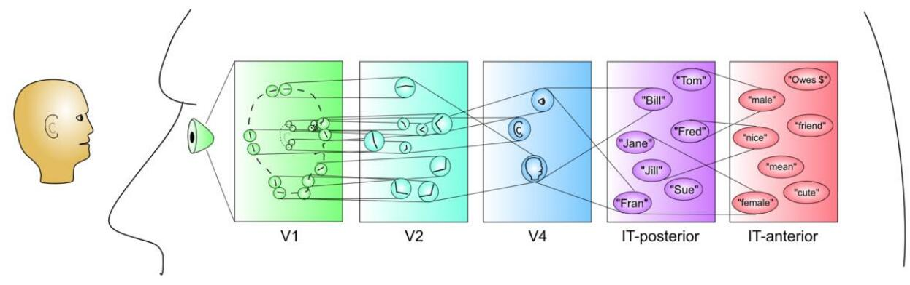

# 中英文词汇对照

因为这门课是英语试卷，有些专有名词还是得记录

|英文|中文|
|-|-|
|neurons|神经元|
|cortex|皮质（尤指大脑皮层）|
|neocortex|新皮质|
|synapses|突触|
|synaptic|突触的|
|dopamine|多巴胺|
|amnesia|失忆|
|prefrontal cortex|额叶前皮质|
|lobe|脑叶|
|subcortical|皮质下的|
|hippocampus|海马区|
|amygdala|杏仁核|
|thalamus|丘脑|
|basal ganglia|基底核|
|cerebellum|小脑|
|occipital lobe|枕叶|
|temporal lobe|颞叶|
|frontal lobe|额叶|
|parietal lobe|顶叶|
|arousal|激励|
|modulatory functions|调节功能|
|Reinforcement Learning|强化学习|
|Motor Control|运动控制|
|Executive Function|执行功能|
|motor coordination|运动协调|
|semantic|语义的|
|spike||
|dendrites|树突|
|axon|轴突|
|excitatory pyramidal neurons|兴奋性椎体神经元|
|inhibitory interneurons|抑制性中间神经元|
|white matter|白质|
|Likelihood function|似然函数|
|neurology|神经学|
|genetics|遗传学|

# 认知计算绪论

## 大脑

在大脑新皮质上，每个神经元都有约10k个来自其他神经元的输入，通过突触连接。而大脑中总体有20billion规模的神经元。

虽然每两个神经元之间的连接相对而言影响较小，但是通过学习机制（learning mechanisms），这些神经元们可以实现非常复杂的信息处理功能。

大脑的学习过程并不要求单个神经元非常复杂，它其实是信息整合的一个简单形式

1. 准确描述神经元的反应特性
2. 在聚合神经网络上实现复杂的信息处理

## 认知计算的基本问题

1. 视觉
2. 注意力
3. 多巴胺与奖励机制
4. 记忆
5. 含义（Meaning）
6. 任务导向行为

## 我们应该关注大脑的什么？

David Marr认为，我们只需要独立地关注三个层次：

1. 计算层次。即大脑中在进行什么计算，什么信息在被处理？
2. 算法层次。大脑中的计算是如何进行的，信息处理的步骤是什么？
3. 实现层面。硬件如何实现这些算法？

注意独立，我们就可以抛弃实现，只研究计算和算法层次。

这部分的研究的简明历史如下

1. 1960s~1990s，主要的研究是认为人脑和传统计算机差不多，所以研究主要面向逻辑和符号命题
2. 后来，基于概率的研究变得流行，贝叶斯概率的框架使用广泛，他强调大脑在信息处理过程中的分级性质。但是贝叶斯理论对大脑在神经层面的拟合不是很好，实际上大脑不像一个通用的计算设备
3. 神经网络

## 脑区域之下皮质

### 海马区（Hippocampus）

是旧皮质，在短期记忆中有很重要的作用。

### 杏仁核（Amyglada）

对情绪显著刺激（emotionally salient stimuli）很重要，并且可以向大脑的其他部分发送警报（alert）。

它在基于奖惩机制的强化运动（和认知）动作（reinforcing motor (and cognitive) actions）中也发挥重要的作用。

### 丘脑（Thalamus）

为感官信息进入大脑新皮质提供了主要通道。也可能对注意力、激励和其他调节功能很重要。它在感知和注意力以及运动控制和强化学习中发挥作用。

### 基底核（Basal Ganglia）

它是下皮质的一系列区域的集合，在运动控制、强化学习和执行功能（Executive Function）中发挥关键作用

它帮助做出最后的“GO”指令，决定是否执行大脑皮层建议的特定动作，以及决定是否更新前额叶的认知计划。

### 小脑（Cerebellum）

其神经元占了脑的一半，在运动协调中有重要作用。在大部分认知任务中也处于活跃状态。

## 脑区域之新皮质

Brodmann根据解剖结果把大脑分为四个区域。

### 枕叶（Occipital lobe）

这里包含初级的视觉皮层，在枕叶的非常末端的位置。然后包含向外辐射的高级视觉中枢。

### 颞叶（Temporal lobe）

包含初级的听觉皮层，以及联系到高级听觉和语言处理的区域。

与此同时，视觉看到的物体转换到语言、语言转换到视觉的功能也是在这里进行的。这也是我们为什么能进行阅读的原因。

颞叶也对语义知识（semantic knowledg）很重要，也就是你对事物的深层理解。

这里包含了我们对于他人的面容、名字，事实、事件、物体、文字的认知。

### 额叶

额叶的前部，或叫前额叶，是大脑执行功能的区域。这里是所有高级shots被called的区域。

在这里，你的所有计划被整理出来，然后受基本动机和情绪的影响后，才真正决定你会如何行动。

这里也是处理最抽象、最有挑战性的认知形式的关键所在。

额叶皮层的内侧和腹侧区域对于情绪和动机非常重要。

### 顶叶（Parietal lobe）

这里对encoding空间位置、数字、数学、抽象关系和其他有关“智慧”的东西很重要。

它给视觉信息指导运动动作提供了主要的通道。

## 神经元

大脑神经元如此复杂，其是为了一个非常简单的整体功能“检测（detection）”服务的。

神经元接受数以千计的输入，但其中重要且有意义的只有一些特定模式（specific pattern）的输入，这些有价值的输入被称为“spike”，这也是神经元之间交流的基础。

神经元接受信号后，将它们与阈值比较，然后加入到总体的输出中，再用这个总体的输出和其他神经元交流。

## 把神经元看作是Detector

发送神经元和接收神经元用突触连接，大部分突触都连接在接收端的树突上。这些信号通过树突进入细胞体，进行信息的处理与综合。

输出的阈值判断发生在输出端的最开始，也就是轴突。

突触网络的效能或者说权重，指的是发送神经元发送的信号能以多大程度影响到接收神经元。

从计算上说，权重决定了一个神经元接受什么。权重越大，神经元对这个输入就更敏感，反之亦然。

学习的过程就是不断地调整神经元之间连接的权重，来达到想要的输出。

## 大脑新皮质的神经网络

有85%的神经元是兴奋性锥体神经元（excitatory pyramidal neurons），它们的连接跨度很广，可以跨越不同的脑区，有时候甚至可以跨越整个大脑。学习行为主要就发生在这些兴奋性神经元中；有15%是抑制性中间神经元（inhibitory interneurons），它们的连接更加局部化。某种意义上，可以理解为兴奋性神经元的散热器。

## 新皮质的层级结构

新皮质具有6种不同的层，每种脑区都有这种6层结构。但是拥有不同功能的脑区，其6层结构的厚度也各有不同，暗示了层级结构的功能。

新皮质中负责数据输入的脑区（Input Area）接收感知的输入（例如视觉；通常会经过丘脑），这些脑区的Layer 4通常会更大。这是因为来自丘脑的轴突都连接到这里。这些输入层（input layer）有一种特别的兴奋性神经元，称为星状细胞（stellate cell）。这些细胞的树突非常浓密，并且似乎尤其善于收集这一层的局部轴突输入。

新皮质中的隐藏脑区（Hidden Area），并不直接接受感觉输入，也不直接输出运动动作。它们是这个输入和输出的中间部分。我们可以理解为，这些区域从感官输入中创建越来越复杂和抽象的类别（catagories），然后再从这些高级类别中，协助选择出正确的运动动作。这些脑区的superficial layers 2/3会更厚，包含了许多锥体神经元，并且都放在很好的位置来实现这些抽象化功能。

新皮质中的输出脑区（Output Area），拥有直接作用于肌肉控制区的突触，发出电信号后，可以直接影响物理运动。这些输出层有更厚的deep layer 5/6，会把轴突发送给许多下皮质区域。

## 新皮质中的连接模式

信息传输包含正向传播和反向传播两个过程。

正向传播时，信息从感官信息流向大脑中更高级、更深的部分，从而形成了越来越抽象和复杂的类别（catagories）

反向传播时，信息从隐藏层和输出层出发，回到这些区域在正向传播时的前级区域，从而支持自上而下的行为认知控制、直接注意力，并且帮助解决感官输入中的歧义。

所以说，区域之间的连接很大程度上是双向的，发送前向信息的区域通常也会收到下级区域的信息。这种双向连接对于使网络能够跨层聚合到连贯的整体活动状态很重要，对于错误驱动（error-driven）的学习也很重要。

## 类别和分布式表示（Categorization and Distributed Representations）

如上，当我们看到一个人时，在最低的一层中，这里我们获得的表示只有一些最基本的特征。在下一层，我们把这些特征连起来，变成更复杂的视觉特征。在下一层，我们把面部特征全部组合了起来，形成了对于面容的认知。最后，我们把这张脸和语义上的各种东西关联起来，例如名字，性别，性格。

这个过程可以通过fMRI来显示，不同视觉刺激的脑部活动区域高度重合。

## 神经元的数学公式

一个基本的积分和激发神经元（A Basic Integrate-and-Fire Neuron）

$$
\tau_m\dfrac{du(t)}{dt}=u_{res}-u(t)+R_mi(t)
$$

其中$\tau_m$是神经元的膜时间常数，其由通道的平均电导决定。$u_{res}$是神经元的静息电位。$i(t)$是输入电流，其由突触前神经元放电产生，并且是众多这种放电的和。$R_m$是神经元对电流的电阻。

具体来说，$i(t)$还受到突触连接强度的影响，

$$
i(t) = \sum_j\sum_{t^f_j} w_jf(t-t^f_j)
$$

其中$f(\cdot)$代表激活函数，$t$表示突触$j$的突触前神经元的放电时间，该时间由膜电位$u$达到阈值$\theta$的时间决定。

$$
u(t^f) = \theta
$$

# 模式识别绪论

## 模式识别是什么

模式识别是研究如何让机器观察环境，学习从环境中区分出感兴趣的物体，然后做出明智的有理由的决策。

主要包括：目标识别（人脸识别）、语音识别、文本分类、图像视频识别等。

模式识别的两个核心：特征提取和分类器设计。

存在于时间和空间中可观察的物体，如果我们可以区别它们是否相同或是否相似，都可以称之为模式。

识别的过程是从底层，逐渐抽象到高层，这样的一个过程。

模式识别的目的：利用计算机对物体（模式）进行分类，在错误概率最小的条件下，使识别的结果尽量与客观物体相符合。

## 模式识别的基本概念

- 样本：一类事物的一个具体体现，所研究对象的一个个体，也称模式。
- 样本集：若干样本的集合
- 类或类别：在所有样本上定义的一个子集，处于同一类的样本在我们所关心的性质上是不可区分的，即具有相同的模式，也称模式类。
- 特征：用于表征样本的观测信息，通常是数值表示的，有时也称为属性（attribute）；如果是高维则称为特征向量，样本的特征（向量）构成了特征空间，每个样本是特征空间中的一个点。
- 已知样本：事先知道类别标号的样本
- 未知样本（待识别的样本，测试样本）：类别标号未知但特征已知的样本

一般来说，模式识别必须经过如下的过程：模式空间->特征空间->类型空间

- 在模式空间（等于特征空间）中每个样本模式都是一个点，点的位置由该模式在各维上的测量值确定。
- 模式空间中的点经过特征提取就得到了特征空间。对模式空间里的各坐标元素进行综合分析，以提取最能揭示样本属性的特征，这些特征就构成特征空间。
- 特征空间进行分类决策就得到了类型空间。根据适当的判决规则，把特征空间里的样本区分成不同的类型，从而把特征空间塑造成了类型空间。

## 模式识别的基本框架

- 传感器（sensing）：信号采集
- 分割：使图像模式互不重叠
- 特征提取：可判别特征、平移、旋转和尺度变换不变性特征
- 分类
- 后处理

训练和识别流程：

模式识别系统设计的五个步骤：

- 收集数据
- 特征选择
- 选择模型
- 训练分类器
- 评估分类器

分类器主要有有监督学习和无监督学习。具体可以看后面传统机器学习方法。

## 模式识别的方法

### 模板匹配

首先对每个类别建立一个或多个模板，然后对输入数据和每个类别的模板求距离或相关，根据相关性和距离大小做分类。

优点：简单直接

缺点：适应性差

形变模板

### 统计方法

根据训练样本，建立决策边界。这是我们课上的重点。

- 统计决策理论：根据每一类总体的概率分布决定决策边界
- 判别式分析方法：给出带参数的决策边界，根据某种准则，由训练样本决定“最优”的参数

### 句法方法

许多复杂的模式可以分解为简单的子模式，这些子模式组成所谓 “基元”。每个模式都可以由基元根据一定的关系来组成。模式的相似性由句子的相似性来决定。

优点：适合结构性强的模式

缺点：抗噪声能力差，计算复杂度高

### 神经网络

进行大规模并行计算的数学模型。具有学习、推广、自适应、容错、分布表达和计算的能力。

- 优点：可以有效的解决一些复杂的非线性问题
- 缺点：缺少有效的学习理论

### 比较

# 神经网络基础概念

## 神经元及其数学模型

神经元大体上由四个部分组成：细胞体、轴突、树突、突触

在神经元的信息处理过程中，树突相当于信息的接收器，细胞体相当于加和、处理信息的东西，轴突相当于信息的发射器，突触就是信息传递的连接点。

神经元只有当输入信息达到阈值后才会兴奋。所有这些信息都是电化学信息。学习则是突触间电化学过程效率的变化的过程。

于是我们就可以把神经元抽象成一个数学模型（这里是M-P模型）。这其实是一个有向图，每个节点代表神经元的细胞体。每个节点一般的多个输入对应树突，一个输出（有时有多个）对应轴突。神经元的兴奋阈值在这里是节点的激活函数，而突触间的效率在这里就是边的权重。例如下图

其中一个经典的模型是感知器：

他这里的中间的两个大节点可以理解为把一个节点拆成两个部分。感知器的作用是把一系列输入分为两个类型中的一类。

## 人工神经网络的特点

- 固有的并行结构和并行处理
- 容错性
- 自适应性

## 大脑分区和基础的神经网络

大脑分区和功能之前探讨过了，这里不再赘述。

神经网络面对的问题是，对于一组历史数据$\{(x_1,y_1),(x_2,y_2),\cdots,(x_l,y_l)\}$，要找出一个函数$f(x)=\hat y$，使得对未来的数据$x$，$\hat y$是一个良好的预测。

单输入的神经元如下：

拓展到多输入为

$f$一般称为激活函数，典型的有：

**阶跃函数、符号函数**

$$
f(x) = step(x)
$$

$$
f(x)=sgn(x)
$$

**线性函数**

$$
f(x)=kx+b
$$

**分段线性函数**

**sigmoid函数**

$$
f(x) = \sigma(x) = \dfrac{1}{1+e^{-x}}
$$

特别的，其导数为

$$
\sigma'(x) = \sigma(x)(1-\sigma(x))
$$

其范围为$(0,1)$，输出中心为$0.5$。指数运算会比较慢，并且$x$很大时，出现梯度消失问题。

**双曲正切**

$$
f(x) = \tanh(x)=\dfrac{2}{1+e^{-2x}}-1
$$

长得和Sigmoid很像，但是其范围为$(-1,1)$，输出中心为$0$。问题和sigmoid相同。

**ReLU**

$$
f(x)=\max(0,x)
$$

其没有指数运算，且不会梯度消失。但输入为负数时，完全失效。

**Leaky ReLU**

即在$x\geq 0$时，$f(x)=x$，在$x<0$时，$f(x)=ax$，其中$a$是一个相对于$1$很小的正常数。其对ReLU进行了微小的修正，使得在负数输入时有效。

### 人工神经网络的拓扑结构

**单层网络**

有了这些东西，我们就可以构造神经网络了，其中最简单的单层（Single Layer）（输入数据不被看做一层）神经网络如下。

这样的神经网络作用极其有限。只能用在线性分类任务上，大部分函数都不是线性的，或者不是线性可分的。

**多层网络**

于是就有了多层的神经网络，在上图的输入层和输出层之间添加一个或非常多个隐藏层。

这样，神经网络就能处理更多复杂的分类问题。但是，多层神经网络的问题是难以训练。

在构成多层网络时，层间的转移函数应是非线性的，否则多层网络的计算能力并不比单层网络强。若干的线性单元层叠加还是线性单元。

**回归型网络（反馈网络）**

一般来说，凡包含反馈连接的网络均称为回归型网络，或称反馈网络。

**前馈型网络(feed-forward network)**

- 结点按照一定的层次排列；
- 网络是单向的，信号只能按照单一的方向，从下一层结点传递到相应的上一层结点；
- 上层结点与下一层所有结点相联接。
- 层间（Inter-field）联接

代表网络有：多层感知机、径向基函数网络。

**反馈型网络(feed-back network)**

- 输入信号作用于神经元结点后，各个结点的输出又作为输入反馈到各结点，形成一个动态系统，当系统稳定后读取其输出；
- 层间（Inter-field）联接
- 循环联接

代表网络：Hopfield网络

**竞争学习网络(competitive learning network)**

- 神经元结点通常排列在同一个层次上；
- 没有反馈联接，但是结点之间有横向的联接或相互影响；
- 在学习时通过神经元之间的竞争实现特定的映射。
- 层内（Intra-field）联接

代表网络：自组织映射(SOM)网络

## 正向传播和反向传播

在感知器算法中我们实际上是在利用理想输出与实际输出之间的误差作为增量来修正权值，然而在多层感知器中，我们只能计算出输出层的误差，中间隐层由于不直接与外界连接，其误差无法估计。

反向传播算法的出现解决了训练的问题。从后向前反向逐层传播输出层的误差，以间接计算隐层的误差。

算法分为两个阶段

- 正向过程：从输入层经隐层逐层正向计算各单元的输出；
- 反向过程：由输出误差逐层反向计算隐层各单元的误差，并用此误差修正前层的权值。

流程为

1. 选择一组训练样本，每一个样本由输入信息和期望的输出结果两部分组成。
2. 从训练样本集中取一样本，把输入信息输入到网络中。
3. 分别计算经神经元处理后的各层结点的输出。
4. 计算网络的实际输出和期望输出的误差。
5. 从输出层反向计算到第一个隐层，并按照某种能使误差向减小方向发展的原则，调整网络中各神经元的连接权值。
6. 对训练样本集中的每一个样本重复3-5的步骤，直到对整个训练样本集的误差达到要求时为止。

反向传播算法中采用梯度法修正权值，为此要求输出函数可微 。通常采用sigmoid函数作为输出函数。假设神经元$j$的期望输出是$t_j$，实际输出是$o_j$，那么误差就是

$$
E = \dfrac{1}{2}\sum_j(t_j-o_j)^2
$$

我们要优化的是每个连接的权重，我们就要找到每个权重对于误差的影响，偏导数

$$
\dfrac{\partial E}{\partial w_{ij}}
$$

其中$w_{ij}$是神经元$i$到$j$的权重

我们经常会用梯度下降法来优化权重，其迭代方向为

$$
\Delta w_{ij} = -\eta\dfrac{\partial E}{\partial w_{ij}}
$$

假设上一层的输出是$b_i$，这一层的总输入为$\beta_j$，那么有$\beta_j = \sum_i w_{ij}b_i$

注意到$w_{ij}$首先影响输入值$\beta_j$，再影响到输出值$o_j$，最后才能影响到$E$。所以

$$
\dfrac{\partial E}{\partial w_{ij}} = \dfrac{\partial E}{\partial o_j}\cdot \dfrac{\partial o_j}{\partial \beta_j}\cdot\dfrac{\partial \beta_j}{\partial w_{ij}}
$$

其中，显然有$\dfrac{\partial \beta_j}{\partial w_{ij}}=b_i$

设$g_j = -\dfrac{\partial E}{\partial o_j}\cdot \dfrac{\partial o_j}{\partial \beta_j}$，如果激活函数为$\sigma(x)$，假设神经元阈值为$\theta_j$，则

$$
g_j = -(t_j-o_j)\sigma'(\beta_j-\theta_j) = o_j(1-o_j)(t_j-o_j)
$$

于是更新公式为

$$
w_{ij}\leftarrow w_{ij}+\Delta w_{ij} = w_{ij} + \eta g_jb_i
$$

综上，BP算法的迭代一次的流程为

1. 从前向后各层计算各单元的实际输出$o_j$。$\beta_j = \sum_i w_{ij}o_i$（假设上一层的输出为$o_i$），$o_j = \sigma(\beta_j)$
2. 对输出层计算$g_j=-o_j(1-o_j)(t_j-o_j)$（注意这里采用了和之前稍微不同的方向，后面也会对应修改方向）
3. 从后向前计算各隐层$g_j=o_j(1-o_j)\sum_k w_{jk}g_k$
4. 计算并保存各个权值修正量$\Delta w_{ij} = -\eta g_j o_i$
5. 修正权值$w_{ij}\leftarrow w_{ij}+\Delta w_{ij}$

优点：理论基础牢固，推导过程严谨，物理概念清晰，通用性好等。所以，它是目前用来训练前馈多层网络较好的算法。

缺点：收敛慢；不能保证全局最优；推广能力有可能较差。

## 常见网络

### SOM网络

SOM是一种自组织（竞争型）神经网络。Kohonen认为：一个神经网络接受外界输入模式时，将会分为不同的对应区域，各区域对输入模式具有不同的响应特征，且该过程是自动完成的。

该网络由输入层和输出层组成，其中输入层的神经元个数的选取按输入网络的向量个数而定，输入神经元为一维矩阵，接收网络的输入信号，输出层则是由神经元按一定的方式排列成一个二维节点矩阵。输入层的神经元与输出层的神经元通过权值相互联结在一起。当网络接收到外部的输入信号以后，输出层的某个神经元便会“兴奋”起来。

基本思想：网络的竞争层的各神经元竞争对输入模式响应的机会，最后仅有一个神经元成为竞争的胜者。这一获胜神经元则表示对输入模式的分类。

学习算法：模拟生物神经元之间的兴奋、协调与抑制、竞争作用的信息处理的动力学原理来指导网络的学习与工作，而不像多层神经网络那样是以网络的误差作为算法的准则。

竞争学习的步骤：

1. 向量归一化，对当前向量和全部神经元做归一化
2. 寻找获胜神经元，依据相似度评价
3. 网络输出与权值调整

步骤3完成后回到步骤1继续训练，直到学习率衰减到0 。学习率处于$(0,1]$，一般随着学习的进展而减小，神经元（权重）趋于聚类中心。

### RBF网络

径向基函数网络（RBF网络）是一种常用的前馈神经网络。（拓扑结构比较固定）

- 只有一个隐层；
- 隐层单元采用径向基函数作为输出函数；
- 输入层到隐层单元间的权值固定为1；
- 输出结点为线性求和单元
- 隐层到输出结点的权值可调

这里的径向基函数是一个非线性映射，将原始空间投影到高维，从而线性可分。它是某种沿径向对称的标量函数。通常定义为空间中任意一点到某一中心之间欧氏距离的单调函数。记为

$$
k(||x-x_i||)
$$

其中$x$是输入向量，$x_i$是第$i$个隐节点的中心。径向基函数的作用往往是局部的，离中心越远函数值越小。常用的径向基函数是高斯函数。

$$
k(||x-x_c||) = \exp\bigg(-\dfrac{||x-x_c||^2}{2\sigma^2}\bigg)
$$

可以从两个方面理解RBF网络

- 函数逼近：把网络看成对未知函数$f(x)$的逼近器。一般任何函数都可以表示成一组基函数的加权和，这相当于用隐层单元的输出函数构成一组基函数来逼近$f(x)$。
- 线性分类：把隐层看做是对输入的非线性映射（通常将低维线性不可分的样本映射到高维空间），再用线性分类器（输出结点的输出函数是线性函数）分类。

RBF有三个参数可以调，即$x_c,\sigma$和隐层节点到输出节点的权值。RBF学习算法分两个阶段

- 确定RBF函数的中心：无师学习
- 训练隐层与输出节点之间的权值：有师学习

一种可能的具体训练算法步骤如下：

1. 对所有样本的输入进行聚类（可以采用k均值聚类算法），求得各隐层结点RBF函数的中心。
2. 当RBF函数的中心$x_c$确定后，训练隐层与输出结点之间的权值。这是一个线性优化问题。（利用训练样本监督完成，如最小二乘法，梯度下降法）

和BP相比，其非线性映射采用了不同的输出函数，径向基函数的作用是局部的，而sigmoid函数是全局的。

已经证明，RBF网络具有唯一最佳逼近的特性，且无局部极小，可以获得全局最优解

但是，径向基函数、隐层结点个数难以确定（人工神经网络的公共问题），目前尚无解决方案。隐层结点RBF函数的中心难以求解，阻碍了RBF网络的广泛应用。

### BP网络

参见之前的反向传播算法。

其解决简单感知器不能解决的疑惑问题。从本质上讲，BP算法就是以网络误差平方为目标函数、采用梯度下降法来计算目标函数的最小值。

BP神经网络具有很强的非线性映射能力和柔性的网络结构。网络的中间层数、各层的神经元个数可根据具体情况任意设定，并且随着结构的差异其性能也有所不同。

但是学习速度慢，容易陷入局部最优。网络层数、神经元个数的选择没有相应的理论指导；网络推广能力有限。

### Hopfield网络

Hopfield神经网络是一种单层互相全连接的反馈型神经网络。每个神经元既是输入也是输出，网络中的每一个神经元都将自己的输出通过连接权传送给所有其它神经元，同时又都接收所有其它神经元传递过来的信息。即：网络中的神经元在t时刻的输出状态实际上间接地与自己t-1时刻的输
出状态有关。神经元之间互连接，所以得到的权重矩阵将是对称矩阵。

Hopfield神经网络成功引入能量函数的概念，使网络运行地稳定性判断有了可靠依据。基本的Hopfield神经网络是一个由非线性元件构成的全连接型单层递归系统。其状态变化可以用差分方程来表示。

递归型网络的一个重要特点就是它具有稳定状态。当网络达到稳定状态的时候，也就是它的能量函数达到最小的时候。

**离散随机Hopfield神经网络**

每个神经元只取二元的离散值$0,1$或$-1,1$。神经元$i$和神经元$j$之间的权重由$w_{ij}$决定。神经元由当前状态$u_i$和输出$v_i$组成，也是二值。

$$
u_{i}(t+1) = \sum^n_{j=1}w_{ij} v_j(t)+I_i
$$

$$
v_i(t+1) = f(u_i) = [u_i>0]
$$

其中$I_i$是神经元$i$的外部连续输入，$f$是激励函数。

当网络更新时，如果权重矩阵与非负对角线对称，则下面这个能量函数可以保证最小化，直到系统收敛到其稳定状态之一：

$$
E = -\dfrac{1}{2}\sum^n_{i=1}\sum^n_{j=1}w_{ij}v_iv_j-\sum^n_{i=1}I_iv_i
$$

# 传统学习

## 贝叶斯推理和学习

传统的频率学派认为，可以用大量试验中，事件出现的频率来估计概率。

但是贝叶斯学派不同，贝叶斯学派同时利用样本信息和先验知识。

频率学派通过大量独立实验将概率解释为统计均值（大数定律）。贝叶斯学派则将概率解释为信念度（degree of belief）（不需要大量的实验）。

频率学派把模型参数看做固定量，把样本看做随机变量。而贝叶斯学派则都看作随机变量。

贝叶斯推理在如下情况时，比频率方法更为有效：

- 样本数量十分有限
- 避免过拟合
- 我们有理由相信某个模型更为合适，但是这个理由不包含在样本数据里
- 我们更想知道某个事实有多大的可能性，而不是可能性最大的事实是什么

贝叶斯学派经常用到以下概率公式

**条件概率**

$$
P(A|B) = \dfrac{P(AB)}{P(B)}
$$

值得注意的是$P(A|B)\neq P(B|A)$通常成立

**事件的积的概率**

$P(AB) = P(A|B)P(B)$

有$P(AB)=P(BA)$

**全概率公式**

$$
P(A) = P(AB_1)+P(AB_2)+\cdots+P(AB_n)
$$

其中$B_1+B_2+\cdots+B_n$是必然事件，它们两两互斥。

于是再由条件概率，得到全概率公式为：

$$
P(A)=\sum^n_{i=1}P(A|B_i)P(B_i)
$$

**贝叶斯公式**

$$
P(B_i|A) = \dfrac{P(A|B_i)P(B_i)}{P(A)}=\dfrac{P(A|B_i)P(B_i)}{\sum^n_{i=1}P(A|B_i)P(B_i)}
$$

将贝叶斯公式写在模型中，得到

$$
P(model|data) = \dfrac{P(data|model)P(model)}{P(data)}
$$

也即

$$
P(\theta|X)=\dfrac{P(X|\theta)P(\theta)}{P(X)}
$$

其中$P(\theta|X)$是模型的后验概率，$P(X|\theta)$是数据的似然函数（Likelihood Function），$P(\theta)$是模型的先验概率，$P(X)$为证据。

### 先验概率

先验概率分布即$P(\theta)$，他的目的是，在我们得到任何样本之前，先capture我们对于$\theta$的先验知识。

### 似然函数

记为$L(\theta|X)=P(X|\theta)$，固定$X$时，关于参数$\theta$的似然函数，（在数值上）等于给定参数$\theta$后变量$X$的概率。

### 后验概率

贝叶斯推断的目标就是，使用样本数据$X$，来更新我们的先验概率$P(\theta)$，就得到了后验概率

### 最大后验估计（MAP）

$$
h_{MAP} = \arg\max_{h\in H} P(h|D) = \arg\max_{h\in H}\dfrac{P(D|h)P(h)}{P(D)}
$$

由于分母是常数，所以有

$$
h_{MAP} = \arg\max_{h\in H}P(D|h)P(h)
$$

### 最大似然估计（MLP）

$$
h_{MLP} = \arg\max_{h\in H}P(D/h)
$$

在有些时候，所有$H$的估计的先验概率是一样的（或者可以假设为一样的），就可以用最大似然估计。

### 贝叶斯过程

$$
P(X|\theta)=\dfrac{P(\theta|X)P(X)}{P(\theta)}
$$

假设你对某些特定的参数$\theta$感兴趣，那么通用的步骤如下

1. 通过先验知识确定$P(\theta)$
2. 通过试验等办法收集$X$
3. 用贝叶斯公式得到后验概率
4. 后验概率作为下一次迭代的先验概率，下次迭代时要获取新的$X$

### 贝叶斯决策理论（贝叶斯分类器）

其是一种统计决策理论。要求：各个类别的总体概率分布 (先验概率和类条件概率密度) 是已知的；决策分类的类别数是一定的。

常用的决策准则有：最小错误率准则、最小风险准则、黎曼皮尔逊准则、最小最大决策准则。

下面解释一下机器学习中的各种概率的实际意义。设有$C$个类型，类型空间为$\Omega = \{\omega_1,\omega_2,\cdots,\omega_C\}$，则

- 先验概率$P(\omega_i)$：代表未获得观测数据之前类别的分布（即类别占比大小）
- 类条件概率$P(x|\omega_i)$：代表在$\omega_i$类中$x$的概率分布密度
- 后验概率$P(\omega_i|x)$：代表在$x$出现的条件下$\omega_i$出现的概率

例如我们要区分鲈鱼鲑鱼，假设只捕获了这两种鱼，并且捕获的数量相等，则有$P(w_1)=P(w_2),P(w_1)+P(w_2)=1$

以光泽度为特征，类条件概率可以为

根据贝叶斯公式，就可以得出后验概率。

$$
P(w_i|x)=\dfrac{P(x|w_i)P(w_i)}{\sum P(x|w_j)P(w_j)}
$$

后验概率的直观含义如下：

**最小错误率准则（最大后验概率准则）**

于是，如果$P(w_1|x)>P(w_2|x)$，那么判断为$w_1$类，否则判断为$w_2$类。（决策过程）

此时，真实为$w_2$却被判定为$w_1$的概率误差就为$P(w_1|x)$；真实为$w_1$却被判定为$w_2$的概率误差就为$P(w_2|x)$。无论如何，概率误差为$P(error|x)=\min[P(w_1|x),P(w_2|x)]$

其决策过程有四个等价形式（以二分类为例）

1. $w = \arg\max_{w_j} P(w_j|x)$
2. $w=\arg\max_{w_j}P(x|w_j)P(w_j)$
3. 若$\dfrac{P(x|w_1)}{P(x|w_2)}>\dfrac{P(w_2)}{P(w_1)}$，则$x$属于$w_1$，否则属于$w_2$。（似然比形式）
4. 若$-\ln P(x|w_1)+\ln P(x|w_2)<\ln\dfrac{P(w_1)}{P(w_2)}$，则$x$属于$w_1$，否则属于$w_2$

**最小风险准则**

假设总共有$N$类，其label分别为$y=\{c_1,c_2,\cdots,c_N\}$。对于某个样本，设其属于$c_j$类，其被错误归类为$c_i$时，损失大小为$\lambda_{ij}$

样本$x$被归类为$c_i$的条件风险（或期望损失）就为

$$
R(c_i|x) = \sum^N_{j=1}\lambda_{ij}P(c_j|x)
$$

我们的任务是最小化损失，即最小化（期望风险）

$$
R(h) = E_x[R(h(x)|x)] = \int R(h(x)|x)p(x)dx
$$

为了最小化总体风险，我们只需要在每个样本上都选择那个能使条件风险最小的类别。即

$$
h^*(x)=\arg\min_{c\in y}R(c|x)
$$

此时$h^*(x)$就是贝叶斯最优分类器。与之对应的总体风险$R(h^*)$称为贝叶斯风险。

具体过程为：

1. 同前，先根据已知条件算出后验概率$P(w_i|x)$
2. 利用后验概率和损失函数，计算采取每种决策的风险$R(c_i|x) = \sum^N_{j=1}\lambda_{ij}P(c_j|x)$
3. 找出风险最小的决策$h^*(x)=\arg\min_{c\in y}R(c|x)$

损失函数要根据具体问题具体设置，通常不是很容易，需要有关专家研讨决定。

以二分类为例，其决策为$R(a_1|x)< R(a_2|x)$时，判断为属于$w_1$，否则属于$w_2$。展开、经过运算后得到似然比形式为

$$
\dfrac{P(x|w_1)}{P(x|w_2)}>\dfrac{\lambda_{12}-\lambda_{22}}{\lambda_{21}-\lambda_{11}}\times\dfrac{P(w_2)}{P(w_1)}
$$

此时判断属于$w_1$。

显然，如果有$\lambda_{12}-\lambda_{22}=\lambda_{21}-\lambda_{11}$，那么其等价于最小错误率准则。

对于多分类任务，我们的损失可以写作（此时等价于多分类*最小化分类错误率*）

$$
\lambda_{ij}\left\{\begin{matrix}
0, & i=j\\
1, & i\neq j
\end{matrix}\right.
$$

此时条件概率可以算出来，

$$
R(c|x) = 1-P(c|x)
$$

于是最优分类器就为

$$
h^*(x) = \arg\max_{c\in y}P(c|x)
$$

即对每个样本$x$，都选择能使其后验概率最大的类别$c$

对于$P(c|x)$怎样得出，判别式模型对于给定的$x$，通过直接建模$P(c|x)$来预测$c$。而生成式模型，先对联合概率$P(x,c)$建模，再通过贝叶斯公式得到$P(c|x)$

$$
P(c|x)=\dfrac{P(x,c)}{P(x)} = \dfrac{P(c)P(x|c)}{P(x)}
$$

### 判别函数和决策面、分类器设计

用于表示决策规则的某些函数$g_i(x)$称为判别函数，每个类别分别对应一个判别函数。

判别函数与决策面方程密切相关，且都由相应的决策规则所确定。

对于$c$类分类问题，按照决策规则可以把$d$维特征空间分成$c$个决策域，将划分决策域的边界面称为决策面，在数学上用解析形式可以表示成决策面方程。

判决区域$R_i$是特征空间中的一个子空间，所有落入$R_i$的样本都会被判断为类别$w_i$

在判决边界上，通常有两类或多类的判别函数值相等。

分类器设计就是设计判别函数，求出判定面方程$g(x)$

分类器最常用的表述方式为判别函数$g_i(x),i=1,2,\cdots,c$

基于判别函数的判定方法为：$w_i = \arg\max_i g_i(x)$。决策面方程就为$g_i(x)=g_j(x)$

基于最小错误率的判决函数就是$g_i(x)=P(w_i|x)$，基于最小风险的判决函数就是$g_i(x)=-R(a_i|x)$。

特别的，对于两分类问题，可以只用一个判别函数$g(x)=g_1(x)-g_2(x)$。如果$g(x)>0$，则为$w_1$，否则为$w_2$。此时决策面为$g(x)=0$

### 朴素贝叶斯分类器

之前的贝叶斯公式的问题是$P(x|c)$是一个联合概率，其并不方便直接从训练样本里面得出。朴素贝叶斯假设属性条件独立，那么有

$$
P(c|x)=\dfrac{P(c)P(x|c)}{P(x)}=\dfrac{P(c)}{P(x)}\prod^d_{i=1}P(x_i|c)
$$

其中$d$为属性数目，$x_i$为$x$在第$i$个属性上的取值。

于是朴素贝叶斯分类器就为

$$
h_{nb} = \arg\max_{c\in y} P(c)\prod^d_{i=1}P(x_i|c)
$$

若有充足的独立同分布样本，则可容易地估计出类先验概率

$$
P(c) = \dfrac{|D_c|}{|D|}
$$

即类$c$的个数在所有样本个数中的占比。

对于离散属性，条件概率可以估计为

$$
P(x_i|c)=\dfrac{|D_{c,x_i}|}{|D_c|}
$$

$D_{c,x_i}$指的是，$D_c$中，在第$i$个属性上取值为$x_i$的样本组成的集合。

对于连续属性，可以考虑概率密度函数，例如$P(x_i|c)\sim N(\mu_{c,i},\sigma^2_{c,i})$，其中$\mu_{c,i},\sigma^2_{c,i}$是第$c$类样本在第$i$个属性上取值的均值和方差。

### 贝叶斯网络

贝叶斯网络是一个有向无环图。其中节点代表随机变量$\{X_1,X_2,\cdots,X_n\}$。如果两个节点之间有因果关系，那么用一条有向边连接，起点是原因，终点是结果。

这个因果关系由参数$\theta$描述，所以贝叶斯网络可以表述为一个图$G$和参数$\theta$，即$B=< G,\theta >$。假设属性$x_i$在图中的父节点为$\pi_i$（注意可以有多个父节点），则$\theta_{x_i|\pi_i}=P_B(x_i|\pi_i)$

贝叶斯网假设每个属性与它的非后裔属性独立，于是有

$$
P_B(x_1,x_2,\cdots,x_d) = \prod^d_{i=1}P_B(x_i|\pi_i) = \prod^d_{i=1}\theta_{x_i|\pi_i}
$$

例如

### 正态分布下的统计决策

**单变量正态分布**

$$
p(x) = \dfrac{1}{\sqrt{2\pi}\sigma}\exp\bigg\{-\dfrac{1}{2}\bigg(\dfrac{x-\mu}{\sigma}\bigg)^2\bigg\}
$$

记作$N(\mu,\sigma)$，其中$\mu=Ex=\int xp(x)dx,\sigma^2=Dx=E(x-\mu)^2=\int (x-\mu)^2p(x)dx$

**多元正态分布函数**

设$x$是$d$维向量

$$
p(x) = \dfrac{1}{(2\pi)^{d/2}|\Sigma|^{1/2}}\exp\bigg(-\dfrac{1}{2}(x-\mu)^T\Sigma^{-1}(x-\mu)\bigg)
$$

其中$\mu$是均值向量$(\mu_1,\mu_2,\cdots,\mu_d)^T$，

$\Sigma$是协方差矩阵即$E((x-\mu)(x-\mu)^T)=[\sigma_{ij}]_{d\times d}$，其中每个元素为$\sigma_{ij}=E((x_i-E(x_i))(x_j-E(x_j)))$。协方差矩阵是对称非负定矩阵。

一个多元正态分布函数共有$d+d(d+1)/2$个参数，其中$d$个参数是均值向量，剩下的$d(d+1)/2$是协方差矩阵。

该概率密度函数中等密度点的轨迹为一超椭球面。如果要使$p(x)$值不变，只需要保证$\exp$内的参数为常数。

**马氏距离（的平方）**

$$
\gamma^2 = (x-\mu)^T\Sigma^{-1}(x-\mu) = \sum^n_{i=1}\sum^n_{j=1}p_{ij}(x_i-\mu_i)(x_j-\mu_j)\geq 0
$$

与欧氏距离（的平方）$(x-\mu)^T(x-\mu)$相比，马氏距离考虑数据各个维度间的相关性，$x$到$\mu$的马氏距离为常数时，所组成的超椭球面为等密度点 。

**判别函数**

根据最小错误率贝叶斯判别函数，在多元正态概型$(p(x|w_i)\sim N(\mu_i, \sigma_i), i=1,\cdots,c)$下就可以立即写出其相应的表达式。

因为

$$
p(x|w_i) = \dfrac{1}{(2\pi)^{d/2}|\Sigma_i|^{1/2}}\exp\bigg(-\dfrac{1}{2}(x-\mu_i)^T\Sigma^{-1}_i(x-\mu_i)\bigg)
$$

之前我们得出最小错误率的判决函数就是$g_i(x)=P(w_i|x)$，也就等价于$g_i(x)=P(x|w_i)P(w_i)$（分母为无关项）。我们判断是选取判决函数最大的作为预测类，也就等价于最大的$g_i(x)=\ln P(x|w_i)+\ln P(w_i)$。于是，代入多元正态，得到最终的判别函数为

$$
g_i(x) = -\dfrac{1}{2}(x-\mu_i)^T\Sigma^{-1}_i(x-\mu_i)-\dfrac{d}{2}\ln 2\pi-\dfrac{1}{2}\ln|\Sigma_i|+\ln P(w_i)
$$

决策面方程为$g_i(x)-g_j(x)=0$，即

$$
-\dfrac{1}{2}[(x-\mu_i)^T\Sigma^{-1}_i(x-\mu_i)-(x-\mu_j)^T\Sigma^{-1}_j(x-\mu_j)] - \dfrac{1}{2}\ln\dfrac{|\Sigma_i|}{|\Sigma_j|}+\ln\dfrac{P(w_i)}{P(w_j)} = 0
$$

*情况1*

若$\Sigma_1=\cdots=\Sigma_c=\sigma^2 I$，则有$\Sigma^{-1}_i=\dfrac{1}{\sigma^2} I, |\Sigma_i|=\sigma^{2d}$，代入、展开、去除与$i$无关的项得到判决函数为

$$
g_i(x) = \dfrac{1}{\sigma^2}\mu_i^Tx-\dfrac{1}{2\sigma^2}\mu^T_i\mu_i+\ln P(w_i)=w^T_{i1}x+w_{i0}
$$

等价于一个线性判别函数。其决策面为$g_i(x)=g_j(x)$，等价于$w^T(x-x_0)=0$。其中

$$
w = \mu_i-\mu_j
$$

$$
x_0 = \dfrac{1}{2}(\mu_i+\mu_j)-\dfrac{\sigma^2}{||\mu_i-\mu_j||^2}\ln\dfrac{P(w_i)}{P(w_j)}(\mu_i-\mu_j)
$$

直观来说，如果$P(w_i)=P(w_j)$，则$x_0$位于两中心的终点。否则更靠近先验概率小的方向。

在先验概率相等的情况下，最优判决的规则为：为将某特征向量$x$归类，通过测量$x$到$c$个均值向量中心的欧氏距离，并将$x$归为离它最近的那一类。这样的分类器称为“**最小距离分类器**”。

*情况2*

若$\Sigma_1=\cdots=\Sigma_c=\Sigma$，在几何上，相当于各类样本集中在以该类均值为中心的同样大小和形状的超椭球内。

去除无关项，得到判决函数为

$$
g_i(x) = -\dfrac{1}{2}(x-\mu_i)^T\Sigma^{-1}(x-\mu_i)+\ln P(w_i)
$$

特例，如果$P(w_i)=P$为固定值，那么判决函数就可以进一步简化为$g_i(x)=\gamma^2$，即马氏距离的平方。

把上式展开，去除与$i$无关的项，可以得到

$$
g_i(x) = \mu_i^T\Sigma^{-1}x-\dfrac{1}{2}\mu_i^T\Sigma^{-1}\mu_i+\ln P(w_i)=w^T_{i1}x+w_{i0}
$$

等价于一个线性判别函数。其决策面为$g_i(x)=g_j(x)$，等价于$w^T(x-x_0)=0$。其中

$$
w = \Sigma^{-1}(\mu_i-\mu_j)
$$

$$
x_0 = \dfrac{1}{2}(\mu_i+\mu_j)-\dfrac{1}{(\mu_i-\mu_j)^T\Sigma^{-1}(\mu_i-\mu_j)}\ln\dfrac{P(w_i)}{P(w_j)}(\mu_i-\mu_j)
$$

由于$w$并非沿着$\mu_i-\mu_j$方向，因此分界面并非与均值间的连线垂直正交。

*情况3*

即任意的$\Sigma_i$

$$
g_i(x) = -\dfrac{1}{2}(x-\mu_i)^T\Sigma^{-1}_i(x-\mu_i)-\dfrac{1}{2}\ln|\Sigma_i|+\ln P(w_i)
$$

可以写为

$$
g_i(x) = x^Tw_{i2}x+w_{i1}^Tx+w_{i0}
$$

这样的二次型形式。决策面$g_i(x)=g_j(x)$为

$$
x^T(W_i-W_j)x+(w_i-w_j)^Tx+w_{i0}-w_{j0}=0
$$

由上式所决定的决策面为超二次曲面随着参数的不同而呈现为某种超二次曲面，即超球面、超椭球面、超抛物面、超双曲面或超平面。

### 贝叶斯vs其他判别

我们的贝叶斯理论都基于后验概率，所以要先知道先验概率和类条件概率。实际情况下并不一定知道类条件概率，如果样本充足，则可以用估计的办法估计类条件概率。有时候样本不够多，样本维数又比较高，此时估计就会不准确。更适合采用别的方法，例如线性判别。

线性判别直接假设判别函数，用样本来估计判别函数的参数，而免去估计类条件概率。非贝叶斯的算法基本上都采用这种方式。判别函数最简单的形式是线性函数，决策面是超平面，此时也叫做线性判别。其包含参数$w,w_0$

然而，在贝叶斯决策中，判别函数为最小错误率和最小风险。使用这种判别函数的分类器是所有分类器中的最优分类器。其他判别函数下的分类器都只能称为次优分类器。

后面介绍的准则函数，都只是在给定准则下的最优解，而不是整个问题的最优解。次优解的好处是代价小。

## 有监督学习

即训练集除了属性，还有标签。

其训练、验证、预测程序框架如下

一般来说，其有如下步骤

1. 决定数据集的类型
2. 获取数据集
3. 决定学习的模型，以及学习的算法
4. 完成程序设计，在训练集上跑
5. 评估正确率等指标，然后选择继续修正参数再次训练或者结束。

有监督学习的任务主要分为两个：回归、分类。回归就是对输入给出预测的输出，例如预测未来某一天的温度；分类则是对样本进行划分，使其属于某一个类别。

常见的算法有：决策树、随机森林、支持向量机、逻辑回归、人工神经网络、K近邻、贝叶斯等

### 回归任务

其一般如下。设样本为$\{(x^{(1)}, y^{(1)}), (x^{(2)}, y^{(2)}), \cdots, (x^{(m)}, y^{(m)})\}$。程序对于$x$给出的预测是$h_\theta(x)=\hat y$，其中$h_\theta$就是我们的预测函数，或者说模型，而$\theta$是模型参数。我们的目标是求出

$$
\theta^* = \arg\min_{\theta}\sum^m_{i=1}(\hat y^{(i)}-y^{(i)})^2=\arg\min_\theta J(\theta)
$$

至于如何求出，一般会使用数值最优化方法，例如梯度下降。搜索方向即是$-\eta\nabla J(\theta)$

### 分类任务

总体来说和回归任务形式上还是挺相似的。只是样本的$y$记录的是样本的类别标签。给出的预测也是预测标签。通常目标也是最小化损失函数。

前面在贝叶斯分类器中提到过，生成式模型（Generative Algorithms）和判别式模型（Discriminative Algorithms）的区别。

判别式模型直接对$P(Y|X)$建模。例子：通过人脸识别来判断性别。典型算法有：逻辑回归、SVM、神经网络等。

而生成式模型通过对$P(X|Y)$和$P(Y)$建模，通过贝叶斯公式来算$P(Y|X)$。例子：你收到电子邮件（观察结果，the observation），你想推断邮件是否是垃圾邮件（原因，the cause）。典型算法有：朴素贝叶斯、贝叶斯网络。

### Fisher线性判别

对于两类问题，线性判别函数为

$$
g(x) = w^Tx+w_0
$$

判决面方程为$g(x)=0$

决策规则为：令$g(x)=g_1(x)-g_2(x)$，如果$g(x)>0$，则判断为$w_1$，若$g(x)<0$，则判断为$w_2$，如果$g(x)=0$，则可以拒判或者任意分。

至于如何取得参数，我们需要一个准则函数$J$，其是$x,w,w_0$的函数，它的极值对应于“最优”的决策。我们用最优化方法求取$J$的极值，就可以得到最优参数。

Fisher判别分析考虑把$d$维特征投影到一条直线上，形成一维空间，并且保持较好的性能。

只要给每个样本$x$乘以向量$w^T$就可得到一个标量$y=w^Tx$，也就是投影到了一条直线上。其中$w$就是投影到的直线。其方向重要而长度不重要。

如何保持较好的性能呢？Fisher法希望两类样本在该直线上的距离尽可能远，而类内的距离尽可能近。

假设有$m$个$n$维样本$\{x_1,x_2,\cdots,x_m\}$，第一类集合为$D_1$，规模为$N_1$，第二类集合为$D_2$，规模为$N_2$

**在$n$维$X$空间中**

各类均值向量为

$$
\mu_i = \dfrac{1}{N_i}\sum_{x_j\in D_i}x_j
$$

类$i$的类内离散度为

$$
S_i = \sum_{x_j\in D_i}(x_j-\mu_i)(x_j-\mu_i)^T
$$

总类内离散度就为

$$
S_w = S_1+S_2
$$

其是对称半正定矩阵，当$m>n$时通常是非奇异的

类间离散度为

$$
S_b = (\mu_1-\mu_2)(\mu_1-\mu_2)^T
$$

其是对称半正定矩阵。

**在$1$维$Y$空间中**

各类均值向量为

$$
\bar\mu_i = \dfrac{1}{N_i}\sum_{y_j\in D_i}y_j
$$

类$i$的类内离散度为

$$
\bar S_i^2 = \sum_{x_j\in D_i}(y_j-\bar\mu_i)^2
$$

总类内离散度就为

$$
\bar S_w = \bar S_1^2+\bar S_2^2
$$

类间离散度为

$$
\bar S_b = (\bar\mu_1-\bar\mu_2)^2
$$

于是Fisher的最佳投影方向的准则函数就为

$$
J(w) = \dfrac{\bar S_b}{\bar S_w}
$$

最优参数就是

$$
w^\ast = \arg\max_w J(w)
$$

把$y_j$用$w^Tx$代入，展开可以得到

$$
\bar S_b = w^T S_b w
$$

$$
\bar S_w = w^TS_ww
$$

所以有

$$
J(w) = \dfrac{w^TS_bw}{w^TS_ww}
$$

假定分母是非零常数，则可以用拉格朗日乘数法算出

$$
w^* = S^{-1}_w(\mu_1-\mu_2)
$$

于是用这个参数，我们把所有样本$x$降维为$y=w^{*T}x$。

分类规则为，$y>w_0$时属于$\omega_1$类，否则属于$\omega_2$类。其中$w_0$可以用多种取法。最常用的有

### 逻辑回归（Logistic Regression）

逻辑回归是一种线性分类算法，其通常是二分类，并且给出确定结果（而不是属于某一类的概率）。当输出为1时，预判为正类，输出为0时，预判为负类。

线性回归的模型如下，其一般用于回归问题

$$
h_\theta(x)=\theta_0+\theta_1x_1+\theta_2x_2+\cdots+\theta_nx_n = \theta^Tx+\theta_0
$$

想把它转化到分类问题上时，我们给他套上一个sigmoid函数，即$\sigma(x)=\dfrac{1}{1+e^{-z}}$

得到逻辑回归的模型如下

$$
h_\theta(x) = \dfrac{1}{1+e^{-(\theta^Tx+\theta_0)}}
$$

之后我们有

$$
\ln\dfrac{h_\theta(x)}{1-h_\theta(x)} = \theta^Tx+\theta_0
$$

因为逻辑回归的输出只有$0,1$，当$h_\theta(x)=0$时，$\theta^Tx+\theta_0=-\infty$，当$h_\theta(x)=1$时，$\theta^Tx+\theta_0=\infty$

所以我们的判别方法为：当$\theta^Tx+\theta_0<0$时，判断为负类（0）。当当$\theta^Tx+\theta_0>0$时，判断为正类（1）。

关于如何训练，我们得到的损失函数如下

$$
J(\theta) = \dfrac{1}{m}\sum^m_{i=1}[-y^{(i)}\log(h_\theta(x^{(i)}))-(1-y^{(i)})\log(1-h_\theta(x^{(i)}))]
$$

其中$m$是样本数量，$y$的取值为$\{0,1\}$。目标就是最小化损失函数，可以利用梯度下降法等办法。

另外，还是有可能算出属于某个类的概率的，即$p(y/x;\theta)=(h_\theta(x))^y(1-h_\theta(x))^{1-y}$

### 感知准则函数与感知器算法

**线性可分性**

如果存在一个向量$a$使得，对于所有的$x\in w_1$，有$a^Tx>0$，对于所有的$x\in w_2$，有$a^Tx<0$，那么样本集是线性可分的。否则是线性不可分的。

**样本规范化**

对于线性可分的样本集，令

$$
x_i' = \left\{\begin{matrix}
 x_i  ,&\quad x_i\in w_1\\
 -x_i ,&\quad x_i\in w_2
\end{matrix}\right.
$$

那么线性可分条件就可以改写为$a^T x'_i>0$

上述过程称为样本的规范化。$x'_i$称为规范化增广样本向量。本部分的后续内容都是规范化的，简记为$x_i$

**解向量和解区**

对于线性可分的一组规范化样本$\{x_1,x_2,\cdots,x_m\}$，若存在一个权向量$a^*$满足

$$
a^{*T}x_i>0
$$

则称$a^*$为一个解向量，在权值空间中所有解向量组成的区域称为解区。

**对解区的限制**

解向量不唯一，我们可以通过加入限制得到更好的选择。一般认为，越靠近解区中间的解向量，似乎越能对新的样本正确分类。

我们可以选找一个单位长度的解向量使之最大化样本到分界面的距离

也可以引用一个余量$b>0$，寻找对所有样本$x_i$满足

$$
a^Tx_i > b
$$

的最小长度的向量。新的解区位于原解区之中，而且他的边界到原解区边界的距离为$b/||x_i||$

**感知器算法**

对于线性可分的（规范化）样本，满足$w^Tx_i > 0$。在训练时，对于某个迭代中的权向量$w$，如果某个样本被错误分类，则$w^T x_k\leq 0$。我们对所有错分样本的惩罚函数，即感知器准则函数定义如下

$$
J_P(w) = \sum_{w^T x_k\leq 0}(-w^Tx_k)
$$

当且仅当函数取得最小值$0$时，有最优的$w^*$。求解过程可以用梯度下降法。见[最优化理论学习笔记](../最优化理论学习笔记/#最速下降法)

感知器算法的更新公式如下：

$$
w^{(k+1)} = \left\{\begin{matrix}
 w^{(k)}, &\ w^{(k)T}x_i>0\\
 w^{(k)}+Cx_i &\ w^{(k)T}x_i\leq 0
\end{matrix}\right.
$$

其中$C$是一个校正增量。对正确分类的模式则“赏”，实际上是“不罚”，即权向量不变。对错误分类的模式则“罚”，使$w^{(k)}$加上一个正比于$x_i$的分量。如此反复直到所有样本都可以被正确分类。

如果线性可分，那么参数一定会收敛。否则一定无法收敛，会一直迭代。

这个算法必须要有代表性的正确的训练数据，其对噪声很敏感，解不够鲁棒。

如果要有比较好的训练效果，以及时间不是开销太大。一般样本数为$C=2(k+1)$的$10\sim 20$倍，其中$k$为特征维数。

### 广义线性判别分析

对于非线性问题，线性判别函数难以正确分类，而且设计非线性判别函数比较复杂。

此时，常用的方法是将原特征空间映射到一个高维空间，将低维空间中的非线性问题转化为高维空间中的线性问题，从而降低模式分类的难度。

例如对于二次判别函数$g(x)=c_0+c_1x+c_2x^2$。我们就可以令$y=[1,x,x^2],a=[c_0,c_1,c_2]$。则$g(x)=a^Ty$就是$y$的线性函数。

此时称$g(y)$为广义线性判别函数，$a$叫做广义权向量。

如此做的副作用是，增加了特征的维数，如上例就是一维变三维。可以证明，如果特征数有限，那么一定存在一个高维特征空间使得样本线性可分。

判别函数的一般形式是

$$
g(x) = w_1f_1(x)+w_2f_2(x)+\cdots+w_kf_k(x)+w_0
$$

其中$f_i$是单值函数。将函数从$x$空间变换到$y$空间后，在新空间中是线性函数。

### 支持向量机

**理论基础**

传统的统计模式识别方法只有在样本趋向无穷大时，其性能才有理论的保证。这就是经验风险最
小化理论，比如人工神经网络。统计学习理论（STL）研究有限样本情况下的机器学习问题。SVM
的理论基础就是统计学习理论。

传统的统计模式识别方法在进行机器学习时，强调经验风险最小化。而单纯的经验风险最小化会产生“过学习问题”（过拟合），其推广能力较差。

根据统计学习理论，学习机器的实际风险由经验风险值和置信范围值两部分组成。而基于经验风险最小化准则的学习方法只强调了训练样本的经验风险最小误差，没有最小化置信范围值，因此其推广能力较差。

SVM则是以训练误差（经验风险最小）作为优化问题的约束条件，以置信范围值最小化（推广能力）作为优化目标，即SVM是一种基于结构风险最小化准则的学习方法，其推广能力明显优于一些传统的学习方法。

SVM的优化最终可以规约为二次规划问题，由于目标和约束都是凸函数，所以SVM的解是全局唯一的最优解。

SVM在解决小样本、非线性及高维模式识别问题中表现出许多特有的优势，它能够获取全局最优解，并能够推广应用到函数拟合等其他机器学习问题中。

**线性判别函数和判别面**

线性判别函数是由$x$的各个分量的线性组合而成的函数

$$
g(x) = w^Tx+w_0
$$

支持向量机通常是是二分类分类器。

判别面则是方程$g(x)=0$，也即上面那张图中的直线。

如果两个点$x_1,x_2$都在判定面上，那么有$w^Tx_1+w_0=w^Tx_2+w_0$，即$w^T(x_1-x_2)=0$。即$w$与判别面上的任意向量正交，称$w$为判别面的法向量。

**广义线性判别函数**

和之前说到的广义线性判别分析中的一样，见前即可。

**最优分类超平面**

SVM其基本思想是找到一个分类面（或者是线，或者是超平面），把样本分成两类。但是这样的划分面可能有很多个

（注意，样本虽然形式上和逻辑回归相似，都是$\{(x_1,y_1),(x_2,y_2),\cdots,(x_1,y_1),(x_m,y_m)\}$，并且都是二分类，但是支持向量机这里，$y\in\{-1,1\}$，$1$代表正类，$-1$代表负类）

直觉上来说，我们应该选择那条加粗的线。因为它对样本的局部扰动容忍性最好。换言之，这个划分超平面所产生的分类结果是最鲁棒的，对未见实例的泛化能力最强.

这个划分面也叫做最优分类超平面。即一个超平面能够将训练样本没有错误的分开，而且两类训练样本中离超平面最近的样本与超平面之间的距离之和最大。这个距离之和也叫做分类间隔（margin）

形式地说，划分的超平面的形式如下

$$
w^Tx+b=0
$$

其中$w=(w1,w2,\cdots,w_d)$是法向量，决定超平面的方向，$b$是位移项，决定超平面和原点的距离。我们将其记为$(w,b)$，样本空间中任意一个点$x$到该超平面的距离为

$$
r = \dfrac{|w^Tx+b|}{||w||}
$$

假设超平面能将训练样本正确分类，即对于$(x_i,y_i)\in D$，若$y_i=1$，则有$w^Tx_i+b>0$，若$y_i=-1$，则有$w^Tx_i+b<0$，令

$$
\left\{\begin{matrix}
 w^Tx_i+b\geq +1, & y=+1\\
 w^Tx_i+b\leq -1, & y=-1
\end{matrix}\right.
$$

如下图

距离超平面最近的几个训练样本使得上式的等号成立，这些训练样本被称为支持向量。两个异类支持向量到超平面的距离之和为

$$
\gamma = \dfrac{2}{||w||}
$$

这也被称为间隔。

支持向量机的训练目标就是最大化间隔（或者是求最优超平面）。也就是如下的最优化问题

$$
\begin{align*}
 \max_{w,b} &\quad \dfrac{2}{||w||}\\
 \text{s.t.} &\quad y_i(w^Tx_i+b)\geq 1,\quad i=1,2,\cdots,m
\end{align*}
$$

其中目标函数等价于最小化问题

$$
\begin{align*}
 \min_{w,b} &\quad \dfrac{1}{2}||w||^2\\
 \text{s.t.} &\quad y_i(w^Tx_i+b)\geq 1,\quad i=1,2,\cdots,m
\end{align*}
$$

上式是一个凸二次规划问题，拉格朗日法得出其对偶问题是

$$
\begin{align*}
 \max_{\alpha} &\quad \sum^m_{i=1}\alpha_i-\dfrac{1}{2}\sum^m_{i=1}\sum^m_{j=1}\alpha_i\alpha_jy_iy_jx_i^Tx_j\\
 \text{s.t.} &\quad \sum^m_{i=1}\alpha_iy_i=0\\
  &\quad \alpha_i\geq 0,\quad i = 1,2,\cdots,m
\end{align*}
$$

求出$\alpha$后，即可算出模型

$$
f(x)=w^Tx+b=\bigg(\sum^m_{i=1}\alpha_iy_ix_i^T\bigg)x+b=\sum^m_{i=1}\alpha_iy_ix_i^Tx+b
$$

当然，输出是$\pm 1$的话，可以写作$f(x) = \text{sgn}\bigg\{\sum^m_{i=1}\alpha_iy_ix_i^Tx+b\bigg\}$。

其中$\alpha_i$是支持向量系数，最优超平面的权重向量等于训练样本以一定的系数加权后进行线性组合。只有满足优化式等号成立的样本对应$\alpha_i$的才大于$0$，其他样本都等于$0$。求和只对少数支持向量进行。

当样本集不是线性可分时，存在一些样本使得$y_i(w^Tx_i+b)<1$。对于这个样本，我们总可以找到一个整数$\xi$使得对于该样本有$y_i(w^Tx_i+b)+\xi\geq 1$。对于众多这样的样本，优化目标函数就变为

$$
\min_{w}\dfrac{1}{2}||w||^2+C\sum\xi_i
$$

其中$\xi_i$是松弛因子，其和越大，错分的样本越多。此时的目标变成一方面让分类间隔尽可能的大，另一方面让错分的样本尽可能的少且错误率尽可能的低。

**核函数**

到目前为止，我们能分类的样本都只能是线性可分的。如果是对于异或问题等非线性可分的问题，我们引入核函数，将样本从原始空间映射到一个更高维的特征空间，使得样本在这个特征空间内线性可分。

可以证明，如果原始空间是有限维，即属性数有限，那么一定存在一个高维特征空间使样本可分.

令$\phi(x)$表示将$x$映射后的特征向量（显然$\phi(x)$不会是线性变换），于是，在特征空间中划分超平面所对应的模型可表示为

$$
g(x) = w^T\phi(x)+b
$$

其对偶问题是

$$
\begin{align*}
 \max_{\alpha} &\quad \sum^m_{i=1}\alpha_i-\dfrac{1}{2}\sum^m_{i=1}\sum^m_{j=1}\alpha_i\alpha_jy_iy_j\phi(x_i)^T\phi(x_j)\\
 \text{s.t.} &\quad \sum^m_{i=1}\alpha_iy_i=0\\
  &\quad \alpha_i\geq 0,\quad i = 1,2,\cdots,m
\end{align*}
$$

其解为$f(x) = \text{sgn}\bigg\{\sum^m_{i=1}\alpha_iy_i\phi(x_i)^T\phi(x)+b\bigg\}$

其中$\phi(x_i)^T\phi(x_j)$是样本映射到特征空间之后的内积。由于特征空间维数可能很高，甚至可能是无穷维，因此直接计算$\phi(x_i)^T\phi(x_j)$通常是困难的。为了避开这个障碍，可以设想这样一个函数：

$$
\kappa(x_i,x_j)=<\phi(x_i),\phi(x_j)>=\phi(x_i)^T\phi(x_j)
$$

即$x_i$与$x_j$在特征空间的内积等于它们在原始样本空间中通过函数$\kappa(x_i,x_j)$计算的结果。这里的这个函数就是核函数。

从计算角度，不论$\phi(x)$所生成的变换空间维数有多高，这个空间里的线性支持矢量机求解都可以在原空间通过核函数$\kappa(x_i,x_j)$进行，这样就避免了高维空间里的计算，而且计算核函数的复杂度与计算内积并没有实质性增加。

解出来的模型就是

$$
f(x)=\text{sgn}\bigg\{\sum^m_{i=1}\alpha_iy_i\kappa(x_i,x)+b\bigg\}
$$

根据泛函的有关理论，只要一种核函数满足Mercer条件，它就对应某一变换空间中的内积。因此，在最优分类面中采用适当的内积函数就可以实现某一非线性变换后的线性分类。现在我们可以说正式得到了完全体的SVM。

核函数具体形式有许多，在实际问题中，通常是直接给出核函数。常见的有

- 线性核函数$\kappa(x_i,x_j)=x_i^Tx_j$
- 多项式核函数$(x_i^Tx_j)^d$，其中$d\geq 1$为多项式的次数。也有写作$(sx_i^Tx_j+c)^d$的。
- 径向基核函数$\exp(-\gamma||x_i-x_j||^2)$。$\gamma=1/2\sigma^2$时称为高斯核，$\gamma=1/\sigma$时称为拉普拉斯核
- sigmoid核$\tanh(\beta x_i^Tx_j+\theta)$，其中$\beta>0,\theta<0$

**训练方式**

对于线性情况，我们通过数值最优化办法求出对偶问题的$\alpha$，然后显然有$w=\sum \alpha_iy_ix_i$。利用KKT条件可以算出$b=\dfrac{1}{|S|}\sum_{i\in S}(y_i-\sum \alpha_jy_jx_j^Tx_i)$，其中$S$是所有支持向量的下标集。

非线性情况，同样地有$w=\sum a_iy_i\phi(x_i)$，$b$类似。当然我们可能不关注$w^Tx$而直接关注$\sum^m_{i=1}\alpha_iy_i\kappa(x_i,x)$

**多分类SVM**

SVM单独一般只能做二分类，但是我们可以训练多个SVM实现多分类。

- One-against-all方法，把$k$类问题分解成$k$个两类问题，例如区分A与非A，B与非B，C与非C三个;
- One-against-one方法，把$k$类问题分解成$k(k-1)/2$个两类问题，例如区分AB，区分BC，区分AC三个;
- 其他的整体算法(Weston,Bredensteiner, 和Guermeur)

**特点**

- 专门针对有限样本的情况的最优解，而不是无限样本假设的最优解
- 全局最优解而非局部
- 推广能力好，避免维数灾难。
- 较强的非线性处理能力
- 支持向量是SVM的训练结果，在SVM分类决策中起决定作用的是支持向量。
- SVM的最终决策函数只由少数的支持向量所确定，计算的复杂性取决于支持向量的数目，而不是样本空间的维数，这在某种意义上避免了“维数灾难”。
- 少数支持向量决定了最终结果，这不但可以帮助我们抓住关键样本、“剔除”大量冗余样本,而且注定了该方法不但算法简单，而且具有较好的“鲁棒”性。
    - 增、删非支持向量样本对模型没有影响
    - 支持向量样本集具有一定的鲁棒性
    - 有些成功的应用中，SVM方法对核的选取不敏感

### 最近邻

近邻法（NN和KNN）在原理上属于模板匹配，并且它没有训练过程。它将训练样本集中的每个样本都作为模板，用测试样本与每个模板做比较，看与哪个模板最相似(即为近邻)，就按最近似的模板的类别作为自己的类别。

近邻法的共同缺点是计算量大，存储量也大。它也不考虑决策风险。另外有限样本的分析难以进行。

但是在模板数量很大时其错误率指标还是相当不错的。该方法普适性比较好。常用来作为一个基准算法。

最近邻就是将与测试样本最近邻样本的类别作为决策的方法。

对于一个$C$类别问题，每类有$N_i$个样本，则第$i$类的判别函数为

$$
g_i(x) = \min_k||x-x_i^k||
$$

其中$x^k_i$表示$w_i$类中的第$k$个样本。距离可以有很多种，用的比较多的是欧氏距离。

决策规则为，$w = \arg\min_w g_i(x)$。

最近邻法的错误率会有偶然性，也就是指与具体的训练样本集有关。计算错误率的偶然性会因训练样本数量的增大而减小。随着训练样本的增加，准确率会有所提高。

最近邻的错误率比贝叶斯错误率要大，但是在无限样本的情况下，错误率不会超过两倍贝叶斯错误率。

NN的错误概率为

$$
P(err)=1-\sum_{c\in Y}P(c|x)P(c|z)
$$

其中$x$是测试样本，$z$是其最邻近样本。

在无限大样本时，有

$$
P(err)\approx 1 - \sum_{c\in Y}P^2(c|x)\leq 1-P^2(c^*|x)=(1+P(c^*|x))(1-P(c^*|x))\leq 2\times(1-P(c^*|x))
$$

### KNN

KNN的思想很简单，挑选出距离该样本最近的$k$个样本，这$k$个样本中最多的类别决定为预测类别。$k$一般为奇数。一般比较小，如几或几十，通常可以用交叉验证来确定最优的$k$。

在无穷多样本的情况下，KNN错误率要低于NN。也仍然是在一倍到两边贝叶斯错误率之间。

### 决策树

决策树比较适合离散属性的分类问题。他是一种多级分类器，综合采用多个决策规则，逐步把复杂的多类别分类问题转化为若干个简单的分类问题。

决策树是一个树形的决策帮助数据结构工具。一般的，一棵决策树包含一个根结点、若干个内部结点和若干个叶结点；叶结点对应于决策结果，其他每个结点则对应于一个属性测试；每个结点包含的样本集合根据属性测试的结果被划分到子结点中；根结点包含样本全集。从
根结点到每个叶结点的路径对应了一个判定测试序列.

二叉决策树是一个特例，把复杂的多分类任务转化成多级两分类任务。

对噪声数据有很好的健壮性且能学习析取表达式，之前的线性判别函数中的感知器函数对噪声特别敏感，决策树对噪声鲁棒性较好。

构造好的决策树的关键在于如何选择好的逻辑判断或属性。人们研究出，一般情况下或具有较大概率地说，树越小则树的预测能力越强。要构造尽可能小的决策树，关键在于选择恰当的逻辑判断或属性。

若某一个子集上样本很少，还有分支，这说明属性不是很好，只对某些很少的样本有作用（过拟合）

决策树的适用条件：

1. 有一个决策者期望实现的明确目标。
2. 决策者有多于两种可行的选项
3. 有多于两个不确定的因素超过了决策者的控制范围
4. 决策者可以估计不确定因素的发生概率
5. 可以计算不同方案在不同因素下的收益或损失

优点：可以生成可以理解的规则，比较直观；计算量不太大；可以处理连续和离散字段；可以清晰地在树的构造过程中显示哪些字段比较重要

缺点：对于连续性的字段比较难预测；类别太多时，错误率可能会增加的比较快；一般的算法分类时，只是根据一个属性来分类；不是全局最优。

生成决策树有三种算法：ID3（处理离散）、C4.5（处理连续）、CART（处理属性缺失）。

**信息增益**

信息增益Information Gain，指知道一个特征后，不确定性的减少程度。也就是知道前后的信息熵的变化程度。记作$g(D,A)$，其中$D$是训练集，$A$是其中的一个特征，有

$$
g(D,A) = H(D) - H(D|A)
$$

其中

$$
H(D) = -\sum_i\dfrac{|C_i|}{|D|}\log\dfrac{|C_i|}{|D|}
$$

$$
H(D|A) = \sum^K_{k=1}\dfrac{|D_k|}{|D|}H(D_k)
$$

其中$D_k$指的是，离散属性$A$将当前样本集划分成$n$个分支节点，每个分支构成了一个新样本集$D_k$。其中$C_i$是指分类目标有几类，其中$D$所有样本中属于第$i$类的集合。例如分为正类和负类，$C_0$就是$D$中所有负类的集合，$C_1$就是$D$中所有正类的集合。

样本数越多的分支结点的影响越大，信息增益越大，则意味着使用属性$A$来进行划分所获得的“纯度提升”越大。因此，我们可用信息增益来进行决策树的划分属性选择。

ID3选择这个值来选择最优划分属性。

**信息增益率**

实际上，信息增益准则对可取值数目较多的属性有所偏好，为减少这种偏好可能带来的不利影响，C4.5选择使用增益率来替代。

$$
g_R(D,A) = \dfrac{g(D,A)}{H_A(D)}
$$

$$
H_A(D) = -\sum^K_{k=1}\dfrac{|D_k|}{|D|}\log\dfrac{|D_k|}{|D|}
$$

属性$A$的可能取值越多，通常$H_A$会越大。

但是C4.5也不是直接使用增益率，增益率准则对可取值数目较少的属性有所偏好。它使用一种启发式的算法，先从候选划分属性中找出信息增益高于平均水平的属性，再从中选择增益率最高的。

**基尼指数**

CART选择使用基尼不纯度来选择划分属性，数据集的纯度可以用基尼值来度量

$$
Gini(D) = \sum^{|Y|}_{k=1}\sum_{k'\neq k}p_kp_{k'} = 1 - \sum^{|Y|}_{k=1}p_k^2
$$

直观来说，$Gini(P)$反映了从数据集$D$中随机抽取两个样本，其类别标记不一致的概率。因此，$Gini(D)$越小，则数据集$D$的纯度越高。基尼指数定义为

$$
Gini\_index(D,A) = \sum^K_{k=1}\dfrac{|D_k|}{|D|}Gini(D_k)
$$

于是最优属性为$a^*=\arg\min_{a\in A} Gini\_index(D,A)$

决策树的算法流程如下

**剪枝（pruning）**

剪枝是决策树学习算法对付“过拟合”的主要手段。在决策树学习中，为了尽可能正确分类训练样本，结点划分过程将不断重复，有时会造成决策树分支过多，这时就可能因训练样本学得“太好” 了，以致于把训练集自身的一些特点当作所有数据都具有的一般性质而导致过拟合。因此，可通过主动去掉一些分支来降低过拟合的风险.

决策树剪枝的基本策略有 “预剪枝”(prepruning)和 “后剪枝 " (post-pruning)两种。预剪枝是指在决策树生成过程中，对每个结点在划分前先进行估计，若当前结点的划分不能带来决策树泛化性能提升，则停止划分并将当前结点标记为叶结点；后剪枝则是先从训练集生成一棵完整的决策树，然后自底向上地对非叶结点进行考察，若将该结点对应的子树替换为叶结点能带来决策树泛化性能提升，则将该子树替换为叶结点.

### 随机森林

在讲随机森林前要先讲集成学习，见后。

决策树对于训练集的数据很敏感，如果训练集太小，则预测结果会不好，如果训练集太大，则容易过拟合。所以要引入随机森林。

另外，像CART这样的算法，是贪心的，即使使用bagging，所有的决策树结构上还是相似的，并且预测是相关的。如果来自子模型的预测是不相关的，或者至少是弱相关的，那么集合方法就能工作得更好。

随机森林是决策树的集成，通常使用bagging。随机森林的算法略微调整bagging，使得决策树的训练的数据的特征，被限制在了一些随机采样出来的特征中，从而解决相关性的问题。

1. 设训练集的大小是$n$，利用采样，可放回地对训练集采样$n$次，得到一个大小同样为$n$的数据集。重复这个操作，得到$m$个大小为$n$采样集。（可以算出每个采样集中有原始数据集的$63.2\%$的样本）（也就相当于使用$m$次bootstrapping）
2. 我们在这$m$个采样集上，分别训练$m$个决策树。
3. 用这$m$个决策树同时预测一个数据，通过投票结果，给出最后的判断。

传统的决策树是，从当前的$d$个特征中选择最优的特征。随机森林中的决策树，是随机选取$d$个特征中的$k$个特征。在从$k$个特征中选出最优的那个特征。

通常，对于分类任务，可以选择$k=\sqrt{d}$，对于回归任务，可以选择$k=d/3$

**优点**

作为最流行的一种bagging算法，它综合几个弱学习器来形成一个强学习器，提高准确度的同时降低方差，并且还消除了过拟合。

**缺点**

引入了模型可解释性的损失。当没有进行适当的步骤时，可能会给结果模型引入很多偏差。计算复杂度可能提升。

## 无监督学习

和有监督学习相比，无监督学习就是样本没有打上label。

训练集一般就没有$y$，为$\{x^{(1)}, x^{(2)}, \cdots, x^{(m)}\}$。常见的应用有：网络搜索、认知科学、神经学、遗传学。

### 高斯混合模型

统计学习模型可以分为两类，一类是概率模型，另一类是非概率模型。

概率模型的形式是$P(Y|X)$。如果输入是$X$，输出是$Y$，训练后模型得到的输出不是一个具体
的值，而是一系列的概率值。对于聚类问题来说，就是输入$X$对应于各个不同聚类簇$Y$的概率，称作软聚类。

非概率模型的形式是一个决策函数$Y=f(X)$，如果输入是$X$，输出是$Y$，训练后模型得到的
输出是一个具体的值。对于聚类问题来说，输入数据$X$后就可以通过模型映射得到唯一的判决结果$Y$，在无监督学习中称作硬聚类。

高斯混合模型（GMM）是一种典型的概率模型。假设所有数据点都是由具有未知参数的有限个高斯分布混合产生的。

高斯混合模型是用于估计样本的概率密度分布的方法，其估计采用的模型是几个在训练前就已经建立好的高斯模型的加权和。高斯模型的数目是一个超参数，在模型建立前给定，每个聚类簇都对应于一个高斯分布。

理论上，高斯混合模型可用于近似任何概率分布。

单高斯模型的基本定义和之前提到的正态分布下的统计决策一致。即用一个一维正态分布或者一个多维正态分布就可以描述样本$x$，将$x$代入概率密度函数，当概率值大于给定阈值时，就认为该样本属于$C$类。

单高斯分布模型可以拟合数据接近高斯分布的情况，但实际应用中，数据的分布情况往往不满足高斯分布，这就引入了高斯混合模型。

高斯混合模型假定样本数据分布服从几个高斯分布的加权和的形式。

$$
\Pr(x) = \sum^K_{k=1}\pi_kN(x;\mu_k,\Sigma_k)
$$

其中任意的一个高斯分布称为这个模型的一个分量。$0\leq \pi_k\leq 1$是混合系数，表示每个分量的权重 。满足$\sum \pi_k=1$

**将高斯混合模型用于聚类**

先假设数据服从混合高斯分布，再根据数据推出高斯混合模型的概率分布就可以进一步求出各个样本属于每个聚类的概率。

高斯混合模型的$K$个高斯模型实际上对应$K$个聚类簇。

高斯混合模型参数的求解，就是在只有样本数据，而不知道样本分类的情况下，计算出模型的隐含参数$\pi_k,\mu,\Sigma$。可以使用期望最大化（EM）算法来求解。

求解完后聚类的具体步骤为

1. 以$\pi_k$为概率随机选择$K$个高斯分布分量中的一个（个人猜测类似于轮盘赌）
2. 把样本数据代入第一步中选中的高斯分布，判断输出概率是否大于阈值，如果不是则返回第一步重新选择。

如何求解模型？如果样本分类已知，就是有监督学习，可以用最大似然估计

$$
\pi_k = \dfrac{N_k}{N}
$$

$$
\mu_k = \dfrac{1}{N_k}\sum_{x\in L(k)}x
$$

$$
\Sigma_k=\dfrac{1}{N_k}\sum_{x\in L(k)}(x-\mu_k)(x-\mu_k)^T
$$

其中$N$是总样本数，$N_k$是属于$k$类的样本数，$L(k)$是$k$类的样本集合。

如果样本分类未知，就是无监督学习。假设有$N$个数据点，其服从某种分布$Pr(x;\theta)$，我们的目标是找到一组这种分布的参数$\theta$，使得在这种分布下生成这些数据点的概率最大，也就是似然函数最大。似然函数表示为

$$
\prod^N_{i=1} \Pr(x_i;\theta)
$$

在实际应用中，往往单个点分布的概率都很小，为了便于求解， 一般对似然函数取对数 ，得到对数似然函数。对高斯混合模型求对数似然函数

$$
\sum^N_{i=1}\log\bigg[\sum^K_{k=1}\pi_k N(x_i;\mu_k,\Sigma_k)\bigg]
$$

我们的目标是要找到一组最佳的模型参数，使得上式所示的期望最大，期望最大化算法（EM）的名字就由此而来。

**EM算法**

在统计模型中，EM算法是一种求参数的最大似然或最大后验概率(MAP)估计的迭代方法，其模型依赖于未观测到的隐含变量。

- EM算法迭代地交替执行期望(E)步和最大化(M)步
- E步使用参数的当前估计计算的对数似然的期望值创建函数
- M步计算最大化在E步上找到的期望对数似然的参数。然后用这些参数估计来确定下一步中隐含变量的分布。

EM求解的问题的一般形式是

$$
\theta^* = \arg\max_{\theta}\prod^{|X|}_{j=1}\sum_{y\in Y}\Pr(X=x_j,Y=y;\theta)
$$

其中$Y$是隐含变量。其基本思路是：随机初始化一组模型参数$\theta^{(0)}$，并根据后验概率更新$Y$的预期$E(Y)$，然后用$E(Y)$代替$Y$求出新的模型参数$\theta^{(1)}$。如此迭代直到$\theta$收敛。

1. 定义分类数目$K$，对每个分量$k$设置$\pi_k,\mu_k,\Sigma_k$的初始值，然后计算对数似然函数
2. E步，引入隐含变量$\gamma$，其在高斯混合模型中表示数据点由各个分量生成的概率

$$
\gamma(i,k) = \dfrac{\pi_kN(x_i;\mu_k,\Sigma_k)}{\sum^K_{j=1}\pi_jN(x_i;\mu_j,\Sigma_j)}
$$

3. M步，通过最大似然估计来求解模型参数，现在我们认为上一步求出$\gamma(i,k)$的就是“数据点$x_i$由分量$k$生成的概率。仿照之前的有类别标记的估计法，有

$$
N_k = \sum^N_{i=1}\gamma(i,k)
$$

$$
\pi_k = \dfrac{N_k}{N}
$$

$$
\mu_k = \dfrac{1}{N_k}\sum^N_{i=1}\gamma(i,k)x_i
$$

$$
\Sigma_k = \dfrac{1}{N_k}\sum^N_{i=1}\gamma(i,k)(x_i-\mu_k)(x_i-\mu_k)^T
$$

4. 计算对数似然函数$\sum^N_{i=1}\log\bigg[\sum^K_{k=1}\pi_k N(x_i;\mu_k,\Sigma_k)\bigg]$
5. 检查参数是否收敛，或者对数似然函数是否收敛，不收敛则返回2

### K-means聚类算法

K-means是一种基于样本间相似性度量的聚类方法，这类方法的目标是类内样本相似性高，类间样本相似性低。基于样本间相似性度量的聚类方法可以分为动态聚类法和层次聚类法，K-means是动态聚类法。

动态聚类的关键点是

1. 选取一定的距离度量方法作为样本间的相似性度量准则。
2. 确定样本的合理初始划分，包括代表点的选择，初始分类方法的选择等。
3. 确定评价聚类结果质量的准则函数，对初始分类进行调整，使其达到该准则函数的极值。

K-means算法把$n$个样本分成$k$类，每一个样本和与它最近的类型中心分为一类。这里可以是各种距离，包括欧几里得距离、海明距离、曼哈顿距离等。

假设样本集为$D=\{x_1,x_2,\cdots,x_m\}$，要把他们分为$k$类，$C=\{C_1,C_2,\cdots,C_k\}$。K-means的优化目标是，最小化：

$$
J = \sum^k_{i=1}\sum_{x\in C_i}||x-\mu_i||^2_2
$$

其中$\mu_i$是每一类的聚类中心，

$$
\mu_i = \dfrac{1}{|C_i|}\sum_{x\in C_i}x
$$

$J$越小，代表着各类的样本和样本重心的紧密度（closeness degree）越高，代表着聚类效果越好。

算法流程如下：

1. 随机选取$k$个聚类中心$\mu_i$，可以指定坐标，也可以直接从样本点中随机选。
2. 把每个点划分进最近的聚类中心的那一类。
3. 计算新的聚类中心。即使用$\mu_i = \dfrac{1}{|C_i|}\sum_{x\in C_i}x$
4. 重复2-3，直到迭代次数足够，或聚类中心不再改变（两次迭代的距离差距极小）

优点：简单、快速；处理大数据集，该算法是相对可伸缩和高效率的；当类密集，且类与类之间区别明显（比如球型聚集）时，聚类效果很好；

缺点：结果与初始聚类中心有关；必须预先给出类别数$k$；对噪声和孤立点敏感；不适合发现非凸面形状的聚类

对于初值选择问题，可以多设置一些不同的初值，对比最后的结果，直到稳定。

对于聚类数未知情况下的聚类问题：聚类分裂、合并确定聚类数；可以通过其他的算法来估计$k$

### 模糊聚类（FCM）

前置知识为[人工智能概论笔记](../人工智能概论笔记/#模糊计算和模糊推理)

这里只用到$\mu_A(x)$表示$x$属于集合$A$的程度。

在模糊模式识别中，用模糊子集代替确定子集，而得到模糊的分类结果，即分类结果的模糊化，其中，一个样本以不同的程度属于各个类别，而不再属于某个确定的类别。也就是软聚类。

优点是：可以反映出分类过程中的不确定性, 有利于用户根据结果进行决策。模糊化的分类结果比明确的分类结果中包含更多的信息, 有利于进一步决策。

相较于Kmeans的准则函数，FCM的准则函数添加了隶属度部分（有$N$个样本，共$C$类）

$$
J_f = \sum^C_{j=1}\sum^N_{i=1}[\mu_j(x_i)]^b||x_i-m_j||^2
$$

其中$b >1$是一个可以控制聚类结果的模糊程度的超参数，$m_j$是$j$类的聚类中心。约束条件为

$$
\sum^C_{j=1}\mu_j(x_i)=1
$$

在此$N$个约束条件下，对$J_f$使用拉格朗日乘数法，可得

$$
m_j = \dfrac{\sum^N_{i=1}[\mu_j(x_i)]^bx_i}{\sum^N_{i=1}[\mu_j(x_i)]^b}
$$

$$
\mu_j(x_i) = \dfrac{(1/||x_i-m_j||^2)^{1/(b-1)}}{\sum^C_{l=1}(1/||x_i-m_l||^2)^{1/(b-1)}}
$$

算法步骤为：

1. 设定聚类数目$C$，参数$b$（通常为$2\sim 5$），和一个$\varepsilon >0$
2. 初始化聚类中心
3. 根据上式更新$\mu_j(x_i)$
4. 根据新的隶属度函数更新新的聚类中心
5. 如果两次迭代的聚类中心不变动（变动距离小于$\varepsilon$），则停止。否则返回3

最后的输出可以输出隶属度，也可以输出隶属度最大的类。

FCM算法速度较快，对于满足正态分布的数据聚类效果会很好。但是也会对孤立点敏感，并且也对初始化关系大，且需要提前给出类别数。

### 层次聚类算法

基于划分的聚类算法可以将数据集划分为指定数量的聚类簇，但在某些情况下，数据集需要在不同的级别进行划分。

并且，基于划分的算法需要给出聚类的数目$K$，实际应用中经常不能确定类的数目。有时，数据集划分为两类四类八类都是合理的。因此，特定数据集应该聚成多少个簇通常取决于我们研究该数据集的尺度。

层次聚类算法主要分为分裂的和凝聚的两类，具体决于其层次结构是“自上而下”还是“自下而上”的。

分裂方法：自上而下，首先把所有样本数据归为同一个聚类簇。然后递归地把这些聚类簇划
分成更小的子聚类簇，直到每一个样本都单独作为一个聚类簇，或满足某个终止条件。常见的基于分裂方的的算法有层次K-均值算法。

凝聚方法：自下而上，数据集中的每个样本首先被视为一个聚类簇，然后迭代地将这些较小
的簇合并为更大的聚类簇。直到最后所有样本被归为一个大聚类簇，或满足某个终止条件。

**层次K均值**

1. 把所有样本数据归到一个簇$C$中，即为层次结构的根
2. 使用Kmeans把簇$C$划分成指定的$K$个子簇
3. 对于2中的$K$个簇，分别使用Kmeans划分为更小的簇，递归地只到无法划分或者满足终止条件。

缺点：一旦两个样本在开始时被分成不同的簇，即使两点之间的距离非常接近，它们也不会在以后的聚类过程中聚在一起。

**凝聚方法**

1. 把每个样本都看做一个簇，共$n$个，每个簇只含一个样本
2. 重复以下步骤，只到所有样本被聚类到同一个簇或者满足停止条件
    1. 从$C$中找到两个距离最近的簇
    2. 合并这两个簇
    3. 从$C$中删除原来的两个簇，添加新簇

关于簇间的距离。单连锁方式：两个簇中相距最近的点作为簇间距离。全连锁方式：按照两个簇中相距最远的两个点之间的距离作为簇间距离。平均连锁：把两个簇之间两两点之间的距离的平均值作为簇间距离。

### 主成分分析（Principal Component Analysis(PCA)）

主成分分析更多地用作一种降维手段，它主要涉及识别数据中的相关性。

考虑在正交属性空间中的样本点，如何用一个超平面（直线的高维推广）对所有样本进行恰当的表达？

显然这个超平面如果存在，就要

- 最近重构性（Recent reconfigurability）：样本点到这个超平面的距离都足够近。
- 最大可分性（Maximum separability）：样本点在这个超平面上的投影能尽可能分开。

算法流程如下，设样本集是$D=\{x_1,x_2,\cdots,x_m\}$，要将他降维至$d'$维。

 1. 对所有样本进行中心化：$x_i\rightarrow x_i-\dfrac{1}{m}\sum^m_{i=1}x_i$，即最后使得$\sum_i x_i=0$
 2. 计算样本的协方差矩阵$XX^T$
 3. 对协方差矩阵$XX^T$做特征值分解（常见的其实会用SVD分解，分解成$U\Sigma V^T$，这里的$V$，每一列向量都是样本的主成分，也是特征值）
 4. 取$V^T$中的前$d'$个列向量$w_1,w_2,\cdots,w_{d'}$
 5. 输出$W=[w_1,w_2,\cdots,w_{d'}]$

此时，样本点$x_i$在低维坐标中的投影是$z_i=(z_{i1},z_{i2},\cdots,z_{id'})$，其中$z_{ij} = w_j^Tx_i$（或者说，$z_i=W^Tx_i$）。如果基于$z_i$来重构$x_i$，则有$\hat x_i = \sum^{d'}_{j=1}z_{ij}w_j$。

至于如何选择$d'$，则可以使用交叉验证，使用KNN验证不同的$d'$的效果。

对PCA，还可从重构的角度设置一个重构阈值，例如$t = 95\%$，然后选取使下式成立的最小$d'$值：

$$
\dfrac{\sum^{d'}_{i=1}\lambda_i}{\sum^{d}_{i=1}\lambda_i}\geq t
$$

其中$\lambda_i$是特征值，并且特征值从大到小排序。

### 独立成分分析（Independent Component Analysis(ICA)）

ICA是一种统计学原理的计算方法，是一种线性变换。这个变幻把数据或信号分为统计学意义上独立的非高斯源的线性组合。其最重要的假设是，假设信号在统计学意义上是独立的。

经典问题是鸡尾酒会问题（cocktail party problem）。

在派对中，可能会有很多人说话，这些声音嘈杂在一起，但是人可以从其中专注于单一的说话者。ICA就是用于解决这种分离问题的。图上的$W$是分离矩阵。

### 生成对抗网络（Generative Adversarial Network(GAN)）

GAN由一个生成网络（generation network）和一个判别网络（discriminant
network）组成。

具体而言，生成网络从潜在空间（potential space，latent space）中随机采样来作为输入（通常会用随机分布作为输入，并且通常用高斯分布），其输出需要尽可能模拟训练集中的真实样本。

判别网络的输入是真实样本和生成网络的输出，目的就是尽可能将生成网络生成的东西和真实的东西区分开来。

两个网络相互对抗，并不断调整参数，最终目标是使判别网络无法很好地区分生成网络生成的数据和真实样本的数据。

其公式如下

$$
\min_G\max_D V(D,G)=E_{x\sim p_{data}(x)}[\log D(x)] + E_{z\sim p_z(z)}[\log(1-D(G(z)))]
$$

其中$E_{x\sim p}[\log Q(x)]$这种形式的东西是交叉熵，见附录。

$E_{x\sim p_{data}(x)}[\log D(x)]$描述的是真实数据的交叉熵，其中$x$是真实数据。而$E_{z\sim p_z(z)}[\log(1-D(G(z)))]$是从潜在空间中生成的东西的交叉熵，其中$z$是从中生成的东西。

$V(D,G)$相当于表示真实样本和生成样本的差异程度，其中G是生成器，D是判别器。$min_G\max_D$代表，首先固定$G$，最大化判别器的判别效果。然后最大化判别器之后将其固定，要求最小化生成器生成的东西和真实数据的差异。

## 半监督学习

### 通用理论

如果训练集里面一部分是有标签的，而另一部分是无标签的，那么在此上训练的就是半监督学习算法。 

虽然什么比例都可以，但通常情况下是，有标签的只占一小部分，大部分仍是无标签。大部分的半监督学习算法也是结合了有监督学习和无监督学习，例如深度置信网络（Deep Belief Networks(DBNS)），他是一个以无监督学习为基础的受限玻尔兹曼机（Restricted Boltzmann Machine(RBMS)），但是整个系统却是建立在有监督学习技术上的。

实际上，未标记样本虽然没有直接含有类别标记信息，但如果它们和有标记样本是从相同的数据中独立同分布采样得到的，则它们包含的有关数据分布的信息对学习模型有很大帮助。

如何让学习过程不依赖外界的咨询交互，自动利用未标记样本所含信息来提高模型性能便是本专题所要介绍的内容，即半监督学习(Semi-Supervised Learning，SSL)。

形式化地来说，有标记的样本集记为$D_l=\{(x_1,y_1),(x_2,y_2),\cdots,(x_l,y_l)\}$，未标记的样本集为$D_u=\{x_{l+1},x_{l+2},\cdots,x_{l+u}\}$。其中通常会有$l << u$

面对这样的问题，我们可能会有如下的思路。

**思路1**

只使用$D_l$来训练。其问题是样本过少，完全舍弃非标记样本的信息，训练量不足

**思路2**

把$D_u$打上标记。这其实就转化为有监督学习了，缺点是消耗大量时间。

**思路3**

先利用$D_l$学出一个模型，然后利用这个模型，从$D_u$中挑出一个样本，对这个样本的标签进行预测（查询），把这个获得标签的样本作为新的标记样本加入$D_l$中重新学习得到一个模型。反复重复直到$D_u$全部被给予标记并被放入$D_l$中。

这样的学习方式被称为主动学习（Active Learning）。其目标是希望尽可能少的查询标签来获得尽量好的模型性能。

缺点是，显然主动学习引入了额外的专家知识，仍然需要与外界产生交互来将部分未标记样本转变为有标记样本。

**思路4**

利用未标记样本提供的数据分布的信息。这样的学习方式被称为半监督学习。让学习器不依赖外界交互、自动的利用未标记样本来提升学习性能，就是半监督学习（Semi-Supervised Learning，SSL）。即训练集中同时包含有标记样本数据和未标记样本数据。

半监督学习需要预设两个假设前提

- 聚类假设（Cluster Assumption）：假设数据存在簇结构，同一个簇的样本属于同一个类别。
- 流形假设（Manifold Assumption）：假设数据分布在一个流形结构上，邻近的样本拥有相似的输出值。

更一般地假设，如果两个样本相似，那么他们具有相似的输出。

### 半监督分类

**生成式模型**

给定样本$x$，类别标记为$y\in Y=\{1,2,\cdots,N\}$。假设样本是由高斯混合模型生成的。且每一个类别都对应一个高斯混合成分，数据是由如下概率密度生成

$$
p(x) = \sum^N_{i=1}\alpha_i\cdot p(x;\mu_i,\Sigma_i)
$$

其中$a_i\geq 0, \sum a_i=1$

用$f(x)\in Y$表示模型$f$对样本的预测值，$\Theta\in\{1,2,\cdots,N\}$是样本$x$隶属的高斯混合成分。最大化后验概率得

$$
\begin{align*}
 f(x) & = \arg\max_{j\in Y}p(y=j|x) \\
  & = \arg\max_{j\in Y}\sum^N_{i=1}p(y=j,\Theta=i|x)\\
  & = \arg\max_{j\in Y}\sum^N_{i=1}p(y=j|\Theta=i,x)\cdot p(\Theta=i|x)\\
  &
\end{align*}
$$

其中$p(y=j,\Theta=i,x)$是第$i$个高斯混合成分生成，且类别为$j$的概率

$$
p(\Theta=i|x) = \dfrac{\alpha_i\cdot p(x;\mu_i,\Sigma_i)}{\sum^N_{j=1}\alpha_j\cdot p(x;\mu_j,\Sigma_j)}
$$

是样本$x$由第$i$个高斯混合成分生成的后验概率。

这里面，$p(y=j|\Theta=i,x)\cdot p(\Theta=i|x)$的前半部分要知道标记$y$，也就是有标记样本，而后半部分不需要知道，于是我们就可以同时利用有标记和未标记样本。

参数求解过程如下：

- 假定给了有标记数据集$D_l$和未标记数据集$D_u$
- 假设所有样本独立同分布且由同一个高斯混合模型生成
- 使用极大似然估计得到高斯混合模型的参数$\alpha_i,\mu_i,\Sigma_i$
- 使用EM算法对其参数进行求解

其中，极大似然函数可以写作

$$
LL(D_l\cup D_u) = \sum_{(x_j,y_j)\in D_l}\ln\bigg(\sum^N_{i=1}\alpha_i\cdot p(x_j;\mu_i,\Sigma_i)\cdot p(y_j|\Theta=i,x_j)\bigg) + \sum_{x_j\in D_u}\ln\bigg(\sum^N_{i=1}\alpha_i\cdot p(x_j;\mu_i,\Sigma_i)\bigg)
$$

EM算法如下

**半监督SVM**

其中使用最广泛的是TSVM。使用转导推理（Transductive Inference）方法，通过观察特定的训练样本，进而预测特定的测试样本。

TSVM也是针对二分类问题，tsvm的目标是给出$D_u$的预测标记$\hat y=\{y_{l+1},y_{l+2}+\cdots+y_{l+u}\}$，使得划分超平面具有最大边界。即

$$
\begin{align*}
 \min_{w,b,\hat y,\xi} &\quad \dfrac{1}{2}||w||^2+C_l\sum^{l}_{i=1}\xi_i+C_u\sum_{i=1}^{u}\xi_{l+i} & \\
 \text{s.t.} &\quad y_i(w^Tx_i+b)+\xi_i\geq 1, & \quad i=1,2,\cdots,l\\
  &\quad \hat y_{l+i}(w^Tx_{l+i}+b)+\xi_{l+i}\geq 1, & i=1,2,\cdots,u\\
  &\quad \xi_i\geq 0 & i=1,2,\cdots,u+l
\end{align*}
$$

其中$C_l,C_u$是用户自定义参数，用来决定有标记样本和未标记样本的重要程度。

TSVM是一个时间和计算复杂度都十分高的算法。因此，半监督SVM需要重点研究如何设计出高效的优化策略。

**基于图的半监督学习**

对于一个样本集，我们可以把其样本之间的关系用一个图来表示，其中每个样本对应图中的一个节点。如果两个样本直接的相关性很高，则对应的两个结点之间会存在一条边并且边的权重和样本之间的相似度成正比。

代表算法：一种多分类标记传播算法。

首先用$D_l\cup D_u$建立一个图$G=(V,E)$，其中$V=\{x_1,x_2,\cdots,x_{l+u}\}$，图是满图，边权用高斯函数如下定义

$$
w_{ij} = \begin{cases}
 \exp\bigg(\dfrac{-||x_i-x_j||_2^2}{2\sigma^2}\bigg), & i\neq j\\
 0 ,& i=j
\end{cases}
$$

定义对角矩阵$D=diag(d_1,d_2,\cdots,d_{l+u})$，其中$d_i=\sum_{j=1}^{l+u}w_{ij}$。

设标签$y\in \Psi$，定义一个大小为$(l+u)\times |\Psi|$的非负标记矩阵$F=(F_1^T,F_2^T,\cdots,F_{l+u}^T)^T$，其中$F_i=(F_{i1},F_{i2},\cdots,F_{i|\Psi|})$为样本$x_i$的标记向量，其分类准则为$y_i=\arg\max_{j}F_{ij}$。矩阵初始化为

$$
F^{(0)}_{ij}=\begin{cases}
1, & (1\leq i\leq l)\wedge(y_i=j)\\
0, & \text{otherwise}
\end{cases}
$$

根据矩阵边矩阵$W$建立一个标记传播矩阵$S = D^{-1/2}WD^{-1/2}$。其中$D^{-1/2}=diag(\dfrac{1}{\sqrt{d_1}}, \dfrac{1}{\sqrt{d_2}}, \cdots, \dfrac{1}{\sqrt{d_{l+u}}})$，于是我们得到迭代公式

$$
F^{(t+1)} = \alpha SF^{(t)}+(1-\alpha)Y
$$

其中$Y=F^{(0)}$，$\alpha\in(0,1)$是由用户控制的参数。上式迭代收敛到

$$
F^* = \lim_{t\to\infty}F^{(t)}=(1-\alpha)(I-\alpha S)^{-1}Y
$$

算法复杂度上存在较大的不足，很难处理大规模数据。

在构建图的过程中，只考虑到训练样本集，很难判断新的样本在图中的位置。在出现新的样本时，需要将新样本加入到原样本集对图进行重建且进行标记传播。

**基于分歧的方法**

使用两个学习器来“协同训练”，在训练过程中，两个分类器挑选置信度较高的已标记和未标记样本交给对方学习，直到达到某个终止条件。

一个样本往往拥有多个属性，每个属性在这里被称为一个“视图”。给出样本空间$X=X_1\times X_2$，其中$X_1,X_2$对应一个样本的两种不同视图。在此基础上，每个样本$x$可以用一对$(x_1,x_2)$来表示。

使用这个方法对于数据有前提假设：每个视图条件独立；每个视图本身就足以进行正确的分类，即$f(x)=f(x_1)=f(x_2)=y$。满足该假设的不同的视图具有相容性，即它们包含的关于输出类别的信息是一致的。

算法框架如下

- 假设$x$拥有两个条件独立且充分的两个视图$x_1$和$x_2$
- 利用每个视图基于有标记样本分别训练得到一个分类器，然后让每个分类器各自去选择自己“最信任的”的未标记样本赋值一个伪标记，并且把这个伪标记的样本作为一个有标记样本提供给另外一个分类器进行训练更新。
- 这个“互相学习”的过程不断的进行迭代，直到达到迭代的终止条件为止。

实际问题中，满足这两个假设的样本集是很少的。2000年有一种新的协同训练方法可以不要求两个假设。2007年的Tri-training使用三个分类器协同训练，对样本集没有苛刻的要求。特点为：

- 对于每一个分类器，将剩余的两个分类器作为其辅助分类器来对未标记样本进行分类，标记相同的未标记样本就会被作为置信度较高的样本。
- 主分类器会随机从中选取一些伪标记样本添加到标记样本集中进行训练。
- 每一次被挑选出来的未标记样本在参与完本轮的迭代后，仍然作为未标记样本保留在未标记数据集中。

框架如下：

- 首先对有标记样本集进行可重复抽样(bootstrapping)来获得三个有标记训练集进行初始分类器的训练。
- 在迭代过程中，每个分类器轮流作为主分类器，其余两个作为辅助分类器来为主分类器提供新的无标记数据用来训练。
- 在进行样本预测时，使用三个分类器的结果进行投票得到最终的分类标记。

### 半监督聚类

聚类本来是无监督的，但是利用少量的标记样本可以对聚类算法进行辅助。

标记可以分为：数据对是否属于同一类别的约束关系、类别标记。

**基于距离的半监督聚类算法**

传统聚类大多采用基于距离的度量准则来描述相似性，但是选择何种距离没有统一答案。半监督时，根据约束或者类别信息来构造某种距离度量，然后在该距离度量的基础上进行聚类。

**基于约束的半监督聚类算法**

利用监督信息对聚类的搜索过程进行约束。例如Constrained-K-means算法和Seeded-K-means算法。

- 在K-means算法的基础上，引入了由少量标记样本组成的Seed集合，含有全部的$K$个聚类簇，每种类别最少有一个样本。
- 对Seed进行划分得到K个聚类并且基于此来进行初始化，即初始的聚类中心。
- 利用EM算法来进行优化步骤。

在Seeded-K-means算法中，Seed集的标记是可以发生改变的，而在Constrained-K-means算法中，Seed集的样本标记是固定的。

在不含噪声的情况下，Constrained-K-means算法的性能较好，而在Seed集中含有噪声的情况下，Seeded-K-means的性能明显更优。

## 集成学习/组合分类器

如上，基本思想是先产生一组个体学习器，再用某种策略将它们结合起来，以获得一个更好的性能

个体学习器通常由一个现有的学习算法从训练数据产生，

根据个体学习器的生成方式，目前的集成学习方法大致可分为两大类：

1. 个体学习器间存在强依赖关系、必须串行生成的序列化方法。训练集不独立
2. 以及个体学习器间不存在强依赖关系、可同时生成的并行化方法。训练集独立

前者的代表是Boosting，后者的代表是Bagging和随机森林（见前）。

Bagging要求每个预测器的算法相同（也称为基学习器的基学习算法），但是在不同的随机训练子集上训练。Bagging要去取样时样本放回，如果取样时样本不放回的叫pasting。

在大多数数据集中，boosting的准确性比bagging高。在有些数据集中，boosting会引起退化（过拟合）。

一旦这些基学习器训练完成，集成就可以通过简单地聚合所有预测器的预测来对新实例做出预测。对于分类，聚合函数通常是统计法（即投票，简单多数），而回归问题则通常用平均法。

### Bagging

如前所述，要求每个预测器的学习算法相同。每次学习中，某个个体学习器的训练集都是bootstrapping得来的。分类问题采用投票，回归问题采用平均。

Bagging比较适合“不稳定”的分类算法，例如决策树、神经网络。不稳定指的是数据集的小的变动能够使得分类结果的显著的变动。

只有弱学习算法不稳定时，采用Bagging来集成，才能提升预测准确率。其对稳定的学习算法效果不明显，甚至有副作用。

### Boosting

Boosting是一族可将弱学习器提升为强学习器的算法。这族算法的工作机制类似：先从初始训练集训练出一个基学习器，再根据基学习器的表现对训练样本分布进行调整，使得先前基学习器做错的训练样本在后续受到更多关注（加大权重），然后基于调整后的样本分布来训练下一个基学习器；如此重复进行，直至基学习器数目达到事先指定的值T，最终将这T个基学习器进行加权结合。

如上图，训练过程是阶梯式的，基学习器按照顺序学习，最后加权综合。

每次迭代过程分为两步：在一定的权重条件下训练数据，得出分类器；根据分类器的错误率调整权重

有两个关键问题：如何更改每个训练样本的权重？如何把弱学习器组合成强学习器？

Boost用途广泛，例如计算机视觉的对象分类任务、二分类加速等等。

- Boosting易受到噪音的影响；
- AdaBoost可以用来鉴别异常；经过多轮后，具有最高权重的样本即为异常。
- 应用Boosting，不需寻找很难获得的预测精度很高的强学习算法，只需找出精度稍好于随机预测的弱学习算法即可。
- 但是同时也有可能使集成过分偏向于某几个特别困难的示例。因此，该方法不太稳定，有时能起到很好的作用，有时却没有效果。

**AdaBoost**

AdaBoost可能是Boost中最著名的。对于两个关键问题，它的回答是

1. 增加前一轮中被错误分类的样本的权重，减少正确分类的样本的权重
2. 使用一个加权的投票方法来组合

有很多种推导AdaBoost的方法，比较容易理解的是加性模型，即基学习器的线性组合

$$
H(x) = \sum^T_{t=1}\alpha_th_t(x)
$$

来最小化指数损失函数

$$
l_{exp}(H|D) = E_{x\sim D}[e^{-f(x)H(x)}]
$$

其中$f(x)$是真实函数。数据集的$y\in\{-1,1\}$（预测器的输出也应该是$h\in \{-1,1\}$）

训练算法如下

**XGBoost**

一种对多个回归树进行集成的方法，构造出的多个回归树通过优化使得树群的预测值尽可能接近真实值且具有泛化能力

### 分类器组合评价

**泛化误差**

假设$E(s)$表示在数据集$s$上的组合分类结果，那么$E(s)$的泛化误差则是根据带类标的样本空间分布对任意数量选定样本的误分类概率。

可以用之后提到的holdout、bootstrapping、k-fold估计泛化误差。

**计算复杂度**

包括产生一个新的分类器的计算复杂度、更新一个分类器的计算复杂度、将一个新样本进行分类的计算复杂度。

总体复杂度可以看作是这三种度量方式的总和，特别是当数据集数量较大时，更应当考虑到产生某一新的分类器的损耗。

**其他评价标准**

鲁棒性、稳定性、可解释性、大规模数据的可测量性。

### 非监督集成学习

非监督集成(Unsupervised ensemble)也称聚类集成，被认为在许多方面都能超越单个聚类算法，如：鲁棒性，稳定性和一致性估计以及并行性和可量测性

## 分类器准确率评估

### 保留法（holdout）

即划分为两个独立的数据集：训练集、测试集。

### K-fold

将数据分为$k$个子集。每次训练时，用$k-1$个子集做训练集，剩下1个子集做测试集，然后$k$次交叉验证求平均。

### 留一法

即K-fold中，每个子集的大小都为$1$。

# 特征选择

## 基本概念

对分类器设计来说，使用什么样的特征描述事物，也就是说使用什么样的特征空间是个很重要的问题。

对特征空间的改造、优化，主要的目的是降维，即把维数高的特征空间改成维数低的特征空间，降维主要有两种途径。

- 筛选掉次要特征。关键在于如何确定特征的重要性，以及如何筛选
- 通过线性变换来降维。

**三大类特征**

三大类特征：物理、结构和数字的

- 物理和结构特征：易于为人的直觉感知，但有时难于定量描述，因而不易用于机器判别。
- 数字特征：易于用机器定量描述和判别，如基于统计的特征。

**特征空间的优化**

对初始的特征空间进行优化是为了降维。即初始的特征空间维数较高。能否改成一个维数较低的空间，称为优化。有两种方法

- 特征选择。从原有的的$D$维特征空间，删去一些特征描述量，从而得到精简后的特征空间。新空间的维数$d < D$，并且，其是原空间的一个子集，每个分量都必然能在原空间中找到对应的分量。
- 特征提取。找到一个映射关系$A:Y\to X$，使得新样本特征描述维数比原维数降低。其中每个分量$x_i$是原特征向量各分量的函数，即$x_i=W^T y_i$

一般人常想，只要逐个分析每个特征，判断它对分类的价值，然后根据其价值删去或保留，但是这种方法并不能保证特征空间的最优组合优化，因此本节仅讨论一些原理上更好的方法。

特征选择要从原始特征中挑选出一些最有代表性、分类性能最好的特征进行分类。

要解决两个问题：

- 选择的标准，如可分离性判据
- 快速特征子集搜索算法

另外，从$D$中选$d$个，或者从$D$中选出不定大小的子集，是典型的组合优化问题。

特征选择的方法：

- 是否直接考虑分类器性能？
    - Filter方法。根据独立于分类器的指标$J$来评价所选择的特征子集$S$，在所有可能的特征子集中搜索出使得$J$最大的特征子集作为最优特征子集。不考虑所使用的学习算法。
    - Wrapper方法。将特征选择和分类器结合在一起，在分类过程中表现优异的的特征子集会被选中。
- 选择特征的顺序
    - 自下而上：特征数从零逐步增加到d。
    - 自上而下：特征数从D开始逐步减少到d。

## 类别可分离性判据

用以定量检验分类性能的准则称为类别可分性准则$J_{ij}$，需要满足以下几点：

1. 与错误概率有单调关系。这样，准则取最大值时的，错误概率也更小
2. 特征独立时具有可加性
3. 度量特性
    - $J_{ij}>0$，$i\neq j$时
    - $J_{ij}=0$，$i=j$时
    - $J_{ij}=J_{ji}$

这里$J_{ij}$是第$i$类和第$j$类的可分性准则函数，$J_{ij}$越大，两类的分离程度就越大。

4. 单调性，即加入新的特征时，准则函数不减小。

### 基于距离的可分离性判据

基于距离的可分性判据的实质是Fisher准则的延伸。各类样本之间的距离越大，则类别可分性越大。因此，可以用各类样本之间的距离的平均值作为可分性准则

$$
J_d(x) = \dfrac{1}{2}\sum^C_{i=1}P_i\sum^{C}_{j=1}P_j\dfrac{1}{n_in_j}\sum^{n_i}_{k=1}\sum^{n_j}_{l=1}\delta(x^{(i)}_k, x^{(j)}_l)
$$

其中$c$是类别数，$P_i,P_j$是相应类别的先验概率，$\delta(x^{(i)}_k, x^{(j)}_l)$是两个向量之间的距离，通常用欧氏距离。

如果记均值向量和总平均向量为

$$
m_i=\dfrac{1}{n_i}\sum^{n_i}_{k=1} x^{(i)}_k,\quad m = \sum^C_{i=1}P_im_i
$$

那么等价为

$$
J_d(x) = \sum^C_{i=1}P_i\bigg[\dfrac{1}{n_i}\sum^{n_i}_{k=1} \delta(x^{(i)}_k, m_i)+\delta(m_i,m)\bigg]
$$

其中方括号中的前半为样本到质心的平方距离，后半为某类均值向量到总体样本向量之间的平方距离。如果乘进去，则有类间离散度$\tilde{S}_b$和类内离散度$\tilde{S}_w$为

$$
\tilde{S}_w = \sum^C_{i=1}P_i\dfrac{1}{n_i}\sum^{n_i}_{k=1}(x^{(i)}_k-m_i)(x^{(i)}_k-m_i)^T
$$

$$
\tilde{S}_b = \sum^C_{i=1}P_i(m_i-m)(m_i-m)^T
$$

此时

$$
J_d(x) = tr(\tilde{S}_w+\tilde{S}_b)
$$

其他表达形式如下。

基于距离的准则概念直观，计算方便。但没有直接考虑样本的分布情况，与错误率没有直接关系；而且两类样本的分布有重叠时，这些判据不能反映重叠的情况。

### 基于概率的可分性判据

基于距离的可分性判据原理直观，计算简便。但是这种原理没有考虑概率分布，因此当不同类样本中有部分在特征空间中交迭分布时，简单地按距离划分，无法表明与错误概率之间的联系。

显然不同类别在特征空间$x$中的分布要尽可能不一样，则分类就比较容易，通俗的讲，则不同类别在特征空间的不同区域聚集，则分类就容易，它们重迭的程度越低，越有别于分类。

分布密度的交叠程度可用$p(X|w_1)$及$p(X|w_2)$这两个分布密度函数之间的距离$J_p$来度量，距离$J_p$有以下几个共同点：

1. $J_p$是非负的
2. 当两类完全不交叠时，$J_p$达到其最大值
3. 当两类分布密度相同时，$J_p=0$

常用的有巴氏距离、切诺夫界限、散度等

**Bhattacharyya距离**

$$
J_B = -\ln\int[p(x|w_1)p(x|w_2)]^{1/2}dx
$$

不交叠时为无穷大，相同时为$0$。巴氏距离与错误率的上界有直接关系，因此$J_B$不仅用来对特征空间进行降维优化，而且也用来对分类器的错误率作出估计。

**Chernoff界限**

$$
J_C = -\ln\int p^s(x|w_1)p^{1-s}(x|w_2)dx
$$

其中$s\in[0,1]$，当$s=0.5$时其等价于巴氏距离、

**散度**

散度是区分$i,j$两类总的平均信息

$$
l_{ij}(x) = \dfrac{p(x|w_i)}{p(x|w_j)}
$$

$$
I_{ij}(x) = \int_x p(x|w_i)\ln\dfrac{p(x|w_i)}{p(x|w_j)}dx
$$

$$
I_{ji}(x) = \int_x p(x|w_j)\ln\dfrac{p(x|w_j)}{p(x|w_i)}dx
$$

$$
J_D(x) = I_{ij}+I_{ji}
$$

如果两类样本服从正态分布，且协方差矩阵相等，那么散度就是马氏距离。

### 基于熵的可分性依据

特征对分类的有效性也可以从后验概率角度来考虑。后验概率越集中，错误概率就越小，反之后验概率分布越平缓，即接近均匀分布，则分类错误概率就越大。

熵函数记作

$$
H = J_c[P(w_1|x),\cdots,P(w_c|x)]
$$

其中，香农熵为

$$
J_c^1 = -\sum^c_{i=1}P(w_i|x)\log_2 P(w_i|x)
$$

平方熵为

$$
J_c^2 = 2\bigg[1-\sum^c_{i=1}P^2(w_i|x)\bigg]
$$

熵函数期望表征类别的分离程度：

$$
J(\cdot)=E\{J_c[P(w_1|x),\cdots,P(w_c|x)]\}
$$

## 特征子集的搜索策略

### 单独最优特征组合

计算各特征单独使用时的可分性判据$J$并加以排序，取前$d$个作为选择结果。

问题是组合起来不一定是最优结果，只有当可分性判据对各特征具有（广义）可加性时，才可以选出一组最优特征。例如：各类具有正态分布；各特征统计独立；可分性判据基于Mahalanobis距离

### 顺序前进法（SFS）

自下而上

每次从未入选的特征中选择一个特征，使得它与已入选的特征组合在一起时所得的可分性或分类识别率为最大，直到加入的特征数达到$d$

优点是考虑了所选特征与已入选特征之间的相关性。比单独最优特征组合效果好。

缺点是，一旦某特征入选，后面无论加入什么，也无法去除它。

### 广义顺序前进法（GSFS）

每次从未入选的选出$r$个，使得$r$个特征加入后$J$最大

SFS每次只加一个，未考虑新加特征之间的统计相关性。GSFS更好，但计算量更大，且还是无法拿出之前的。

### 顺序后退法（SBS）

自上而下

从全体特征开始，每次剔除一个特征，使得保留的特征集合具有最大的可分性或分类识别率。依次迭代，直到可分性或识别率开始下降。

特点是，计算过程中可以估计每次去掉一个特征所造成的可分性的降低。计算量比前进法大。同样的，一旦被删除就无法再加入。

也有广义顺序后退法。

### 增l减r法

为了避免一加入就无法剔除，一剔除就无法加入的问题。引入局部回溯手段。

在第$k$步先用SFS一个个加入特征到$k+l$个，再用SBS一个个剔除$r$个特征。反复进行直到满足$d$个特征。此时$l>r$，自下而上，起始时有$0$个特征。

如果$l< r$，则要先剔除，再增加。自上而下，起始时有$D$个特征。

也有其推广。即把上面每一步的SFS和SBS换成GSFS和GSBS。

### 遗传算法

从生物进化论得到启迪。遗传，变异，自然选择。基于该思想发展了遗传优化算法。

- 基因链码：待解问题的解的编码，每个基因链码也称为一个个体。对于特征选择，可用一个$D$位的0/1构成的串表示一种特征组合。
- 群体：若干个个体的集合，即问题的一些解的集合。
- 交叉：由当前两个个体的链码交叉产生新一代的两个个体。
- 变异：由一个链码随机选取某基因使其翻转。
- 适应度：对于每个解，以给定的优化准则来判断其性能的优劣，作为其适应度，即函数$f_i$的值，个体$x_i$越好，$f_i$越大。新一代群体对环境的平均适应度比父代高。

基本步骤如下：

1. 令进化代数$t=0$
2. 给出初始化群体$P(t)$，令$x_g$为其中任一个体
3. 对$P(t)$中每个个体估值，并将群体中的最优解$x'$与$x_g$比价， 如果比$x_g$更优，则$x_g=x'$
4. 如果终止条件满足，则算法结束，$x_g$作为输出。否则继续
5. 从$P(t)$中选择个体并进行交叉和变异操作，得到新一代群体$P(t+1)$，令$t=t+1$，转第3步。

其中交叉操作仅对非最优个体进行，而且交叉后的个体应该适应度比父代大，如果不满足就要反复交叉直到满足或者无法交叉。

变异操作是对交叉后还不满足条件的进行的。如果某个类中有一半以上交叉的后代个体不大于父代，则全变异。

**轮盘赌选择法**

依据个体的适应度值计算每个个体在子代中出现的概率，并按照此概率随机选择个体构成子代种群。

轮盘赌选择策略的出发点是适应度值越好的个体被选择的概率越大。因此，在求解最大化问题的时候，我们可以直接采用适应度值来进行选择。

1. 将种群中个体的适应度值叠加，得到总适应度值
2. 每个个体的适应度值除以总适应度值得到个体被选择的概率
3. 计算个体的累积概率以构造一个轮盘
4. 轮盘选择：产生一个$[0,1]$区间内的随机数，若该随机数小于或等于个体$a$的累积概率且大于个体$b$的累积概率，选择个体$a$进入子代种群。重复步骤(4)多次次，得到的个体构成新一代种群。

# 强化学习

## 概论

在强化学习中，软件智能体在环境中进行观察并采取行动，作为回报，它会获得奖励。

也就是说，强化学习的数据是很多对“状态-动作”，每采取一个动作，到达一个新的状态，然后获得奖励（或惩罚）。而其目标是，学会以一种可以随时间推移最大化其预期回报的方式来采取行动。

假设每一步行动$a_t$后，状态从$S_t$转移到$S_{t+1}$，获得$r_t$的回报，那么从$t$开始的总回报为（注意和后面区分）

$$
R_t = \sum^\infty_{i=t} r_i
$$

需注意“机器”与“环境”的界限，在环境中状态的转移（指采取动作后的转移方向）、奖赏的返回是不受机器控制的，机器只能通过选择要执行的动作来影响环境，也只能通过观察转移后的状态和返回的奖赏来感知环境.

## 马尔科夫决策过程（Markov Decision Processes）

我们可以使用马尔科夫决策过程来描述一个强化学习任务。

机器处于环境$E$中，状态空间为$X$，每个状态$x\in X$是机器感知到的环境的描述。机器能采取的动作构成的动作空间为$A$，若某个动作$a\in A$作用在当前的状态$x$上，则（潜在的）转移函数$P$将使得环境从当前状态按某种概率转移到另一个状态。在转移到另一个状态的同时，环境会根据（潜在的）奖赏函数$R$反馈给机器一个奖赏。

综合起来，强化学习任务对应了四元组$E=< X,A,P,R >$，其中$P:X\times A\times X\rightarrow \mathbb{R}$指定了状态转移的概率，$R:X\times A\times X\rightarrow \mathbb{R}$指定了奖赏。在有些时候奖赏函数只和状态转移有关，即$R:X\times X\rightarrow \mathbb{R}$。如下是用有向图表示的一个例子

一个状态转移如果是马尔科夫的，则必须要符合马尔科夫性质。也就是说，状态转移只取决于当前的状态，而与过去的状态无关（独立）。公式表述如下

$$
P[x_{t+1}|x_t] = P[x_{t+1}|x_1,x_2,\cdots,x_t]
$$

当然，马尔科夫决策过程中的所有状态转移都要是马尔科夫的。

当然，有些地方马尔科夫决策过程是五元组，还要多一元$\gamma$，其是折扣因子（discount factor），其取值范围为$[0,1]$，此时，从$t$开始的奖赏（称为$\gamma$折扣累计奖赏）为

$$
R_t = \sum^\infty_{i=0}\gamma^i r_{i+t}
$$

如果不使用折扣因子，则可以使用$T$步累计奖赏（注意和前面区分）

$$
R_t = \dfrac{1}{T}\sum^T_{t=1}r_t
$$

如果转移不是确定的，那么就要使用$E[\sum^\infty_{i=0}\gamma^i r_{i+t}]$和$E(\dfrac{1}{T}\sum^T_{t=1}r_t)$，对所有的随机变量求期望，来求期望奖赏。

机器在这样一个马尔科夫决策过程中，要做的是通过在环境中不断地尝试而学得一个“策略”（policy）$\pi$，根据这个策略，在状态$x$下就能得知要执行的动作$a=\pi(x)$。策略有两种表示方法

1. $\pi :X\to A$，用于确定性的策略
2. $\pi:X\times A\to \mathbb{R}$，用于表示概率、随机性的策略，此时用$\pi(x,a)$（或者$\pi(a|x)$）表示状态$x$下选择动作$a$的概率。注意必须有$\sum_a \pi(x,a)=1$。

此时，在策略$\pi$下，状态$x$的奖励就为（假设第$t$步进行到$x$）

$$
R_x=E_\pi[R_{t+1}|X_t=x]
$$

把从此时开始的总折扣奖励记为

$$
G_t = R_{t+1}+\gamma R_{t+2}+\cdots = \sum^\infty_{k=0}\gamma^kR_{t+k+1}
$$

也可以用$T$步累计奖赏。策略的优劣取决于长期执行这一策略后得到的累计奖赏。

在模型已知时，对任意策略$\pi$能估计出该策略带来的期望累积奖赏。用这个期望累积奖赏来评估策略。

假设回报只和状态转移有关，那么从此时开始的状态值函数（Value Function）记为

$$
V_\pi(x) = E_\pi[G_t|X_t=x]
$$

区分两种累计奖赏，以$0$为开始行动步骤，则有

$$
\left\{\begin{matrix}
 V^\pi_T(x) = E_\pi[\frac{1}{T}\sum^T_{t=1}r_t|x_0=x],& T步累积奖赏\\
 V^\pi_\gamma(x)=E_\pi[\sum^{+\infty}_{t=0}\gamma^t r_{t+1}|x_0=x], & \gamma 折扣累积奖赏
\end{matrix}\right.
$$

如果回报和状态转移和采取的动作都有关，那么状态-动作值函数记为

$$
Q_\pi(x,a) = E_\pi[G_t|X_t=x, A_t=a]
$$

区分有

$$
\left\{\begin{matrix}
 Q^\pi_T(x,a) = E_\pi[\frac{1}{T}\sum^T_{t=1}r_t|x_0=x,a_0=a],& T步累积奖赏\\
 Q^\pi_\gamma(x,a)=E_\pi[\sum^{+\infty}_{t=0}\gamma^t r_{t+1}|x_0=x,a_0=a], & \gamma 折扣累积奖赏
\end{matrix}\right.
$$

于是我们的优化目标就是选出最优策略

$$
\pi^\ast(x) = \arg\max_a Q^\ast(x,a)
$$

## 有模型学习

考虑多步强化学习任务，暂且假定任务对应的马尔科夫决策过程的四元组$E=< X,A,P,R >$均为已知，这样的情形称为“模型已知”，即及其已对环境进行了建模，能在机器内部模拟出与环境相同或近似的状况.在已知模型的环境中学习称为“有模型学习" (model-based learning)。

此时，对于任意的状态$x,x'$和动作$a$，在$x$状态下执行动作$a$转移到$x'$状态的概率$P^a_{x\to x'}=P[X_{t+1}=x'|X_t=x,A_t=a]$是已知的，其带来的奖赏$R^a_{x\to x'}$也是已知的。

### 动态规划

众所周知，动态规划是非常通用的方法，只要满足：

1. 最优子结构
2. 重叠子问题

即可使用。

在强化学习中，DP需要知道整个环境，并且$V_\pi(x)$需要是递归的。另外，$V(x)$的估计是自助的（bootstrapping）

在强化学习中使用DP的主要想法是：使用值函数来构建搜索最优策略的方式；需要一个对于环境的完美模型。主要由两步构成：从任意的策略开始；重复评估/改进直到收敛。评估/改进则是：计算$\pi$的$V_\pi(x)$，然后用$V_\pi(x)$来改进$\pi$

通过$\pi$来计算$V_\pi(x)$是一个递归的过程，以$\gamma$为例，有

$$
V^\pi_\gamma(x) = \sum_{a\in A}\pi(x,a)\sum_{x'\in X}P^a_{x\to x'}(R^a_{x\to x'}+\gamma V^\pi_{\gamma}(x'))
$$

这个递归等式也称为Bellman等式（推导过程可以去周志华《机器学习》查阅，主要是因为满足马尔科夫性质，并且已知$P$和$R$，做全概率展开，才能推导）。显然的，利用动态规划，我们可以从$0$开始，从低到高计算，这样只需要计算$T$次即可到达现在的值函数（对于T步奖赏来说，对于$\gamma$来说，可以设定一个停止准则$\max_x\in X|V(x)-V'(x)|< \theta$）。

通过$V_\pi(x)$来更新$\pi$，则是

$$
\pi'(x) = \arg\max_{a\in A}Q_\pi(x,a) = \arg\max_{a\in A}\sum_{x'\in X}P^{a}_{x\to x'}[R^a_{x\to x'}+\gamma V_\pi(x')]
$$

注意上式是通过用$V_\pi$来表示$Q_\pi$来实现，具体公式推导可以去周志华《机器学习》查阅。

此时$\pi'$要么严格好于$\pi$，要么$\pi'$已经是最优的了。

重复执行上述更新过程，我们有两种停止更新的策略

1. 策略迭代。即真的用$\pi_0$计算$V_{\pi_0}$，再用其更新出$\pi_1$，再计算$V_{\pi_1}$，直到$\pi$收敛。输出$\pi^*$他要用两次嵌套迭代，在每次改进策略后都需重新进行策略评估。但是不需要收敛到$V_{\pi_k}$（我实在不明白老师PPT里这句话指的是什么意思）
2. 值迭代。即使用$V_{k+1}(x) = \max_{a\in A}\sum_{x'\in X}P^a_{x\to x'}(R^a_{x\to x'}+\gamma V_k(x'))$来迭代。需要收敛到$V^*$（我实在不明白老师PPT里这句话指的是什么意思）

两个算法的伪代码如下（虽然是基于$T$步奖赏的，但是修改不难）

## 免模型学习

在现实的强化学习任务中，环境的转移概率、奖赏函数往往很难得知，甚至有多少状态都很难得知，往往只有一些经验和模拟经验。如果学习算法不依赖于环境建模，则称为免模型学习。

### 蒙特卡罗方法（MC）

对比有模型学习的方法，策略迭代算法在没有模型的时候，首先就没有办法评估策略，因为未知$P,R$而无法做到全概率展开。另一方面，策略迭代算法估计的是状态值函数$V$，而最终的策略则是通过状态-动作值函数$Q$来获得。当模型已知时，$V$到$Q$很容易，但未知时则很困难。另外，模型已知的时候，我们可以从起始状态动态规划地得到所有状态。而没有模型时则不行，只能在探索的过程中逐渐发现各个状态。

一种直接的策略评估替代方法是多次“采样”，然后求取平均累积奖赏来作为期望累积奖赏的近似，这称为蒙特卡罗强化学习.由于采样必须为有限次数，因此该方法更适合于使用$T$步累积奖赏的强化学习任务.

**策略评估**

目标：获取$V_\pi(x)$

提供的数据：在$E$中执行策略$\pi$，产生的轨迹（episode）$< x_0,a_0,r_1,x_1,a_1,r_2,\cdots,x_{T-1},a_{T-1},r_T,x_T >$,

其思想是，只要多次采样，求平均，就能近似得到期望累积奖赏。

$$
V\pi\approx avg(G_t),\quad s.t.\quad X_t=x
$$

这里有两种平均的方式

1. Every-Visit MC。当每次轨迹访问到$x$时，就更新这个均值
2. First-visit MC。只有第一次访问到$x$时，才会更新这个均值。

这两种方法都会近似地收敛。

具体上，每次迭代：

1. $N(X_t)\leftarrow N(X_t)+1$
2. $V(X_t)=V(X_t)+\dfrac{1}{N(X_t)}(G_t-V(X_t))$

只要迭代的次数够多，那么有

$$
V(X_t)\to V_\pi(X_t),N(X_t)\to\infty
$$

First-visit MC的伪代码如下

**估计状态-动作值函数**

更新公式如下

$$
Q(X_t, A_t) = Q(X_t, A_t) + \dfrac{1}{N(X_t)}(G_t-Q(X_t,A_t))
$$

于是我们就可以得到蒙特卡罗版本的策略迭代算法：

（我不明白为什么上面的$Q$不大写）

其中$E$是一次蒙特卡罗版本的策略评估，$I$是一次策略优化（贪心地，可以对状态值函数贪心，也可以对动作-状态值函数贪心）。伪代码如下

### 时序差分学习（Temporal Difference）

相比于蒙特卡罗算法需要在完成一个采样轨迹后再更新策略的值估计，基于动态规划的策略迭代和值迭代算法在执行每一步策略后就进行值函数更新。这样看下来，蒙特卡罗算法效率就很低，这是因为蒙特卡罗算法没有用上马尔科夫性质（MDP）。而时序差分学习就参考了蒙特卡罗算法的思想，直接从经验学习而不用模型，也参考了动态规划的思想，从后继节点学习。对于连续的任务能work，通常比纯蒙特卡罗快。

蒙特卡罗算法在一个完整的采样轨迹完成后再对所有的状态-动作对进行更新，但是这个过程实际上是可以增量式地进行的。更新公式如下

$$
V(X_t)\leftarrow V(X_t)+\alpha(R^{a}_{X_t\to X_{t+1}}+\gamma V(X_{t+1})-V(X_t))
$$

$R^{a}_{X_t\to X_{t+1}}+\gamma V(X_{t+1})$称为TD目标，而$R^{a}_{X_t\to X_{t+1}}+\gamma V(X_{t+1})-V(X_t)$这样的差分形式就是为什么它叫做时序差分算法。

优势总结：

- TD可以在最终结果出来之前学习，而MC不能。或者说TD可以从不完整的轨迹中学习，而MC不能。
- TD运行在连续（无中断）的环境中（即在线算法），而MC每次迭代都要中断（即离线算法）。
- 内存消耗低
- 峰值计算少

**在线学习**

- 无模拟器（simulator），直接与环境交互
- 智慧体在每个动作后直接接受奖励/开销（Rewards/costs）

主要的挑战是：

- 探索/利用的权衡（Exploration/exploitation tradeoff），即每一步行动应该是专注于最大化立即的奖励，还是专注于获得更多的信息？
- 对于每一步动作的实时计算，效率问题。
- 因为每次都要与环境交互才能获取信息，所以学习时信息相对有限。

**离线学习**

- 智慧体可以与模拟器交互
- 奖励/开销不重要（于是也就没有探索/利用的权衡问题）
- 由于不是实时计算，所以两次动作之间的计算时间不是关键问题。
- 模拟器可以造出重组的信息供智慧体学习。

主要的挑战是：

- 如何优化使得收敛到最优策略的事件开销最小。

**TD版策略评估**

即使用之前提到的

$$
V(X_t)\leftarrow V(X_t)+\alpha(R^{a}_{X_t\to X_{t+1}}+\gamma V(X_{t+1})-V(X_t))
$$

伪代码如下

**Sara算法**

因为Sara算法的评估与改进过程用的是同一个策略，所以也叫做同策略（On-Policy）算法，其$Q$值更新策略为：

$$
Q(X_t, A_t)\leftarrow Q(X_t, A_t)+\alpha(R^{a}_{X_t\to X_{t+1}}+\gamma Q(X_{t+1}, A_{t+1})-Q(X_t, A_t))
$$

直观上来说，就是本次状态的$Q$值，使用下个状态奖励和$Q$值来更新。伪代码如下

**Q-学习**

它是异策略（Off-Policy）算法。其更新公式为

$$
Q(X_t, A_t)\leftarrow Q(X_t, A_t)+\alpha(R^{a}_{X_t\to X_{t+1}}+\gamma \max_a Q(X_{t+1}, a)-Q(X_t, A_t))
$$

直观上来说，它不仅仅用轨迹中的下一个点来更新，它把所有下一个动作达到的状态的最大$Q$值拿来更新。

### n-步TD

之前提到的TD，每进行一个动作就更新一次，而n-步TD扩展了这个过程。可以每进行$n$个动作，才进行一次更新。如下图

其中$n\to \infty$时，TD就是蒙特卡罗算法。各个更新公式为

$$
\begin{align*}
 & n=1(TD), & \quad G^{(1)}_t=R_{t+1}+\gamma V(X_{t+1})\\
 & n=2, & \quad G^{(2)}_t=R_{t+1}+\gamma R_{t+2}+\gamma^2 V(X_{t+2})\\
 & \vdots & \\
 & n & G^{(n)}_t = R_{t+1}+\gamma R_{t+2}+\cdots+\gamma^{n-1} V(X_{t+n})
\end{align*}
$$

$V$值更新方式如下

$$
V(X_t) = V(X_t)+\alpha(G^{(n)}_t-V(X_t))
$$

### TD($\lambda$)

首先定义$G_t^\lambda$（$\lambda$-return），其利用权重$(1-\lambda)\lambda^{k-1}$，综合了所有n-步TD的信息，

$$
G^\lambda_{t} = (1-\lambda)\sum^\infty_{k=1}\lambda^{k-1}G^{(k)}_t
$$

直观来看如下

**前向视角**

更新公式为

$$
V(X_t) = V(X_t) + \alpha(G^\lambda_{t}-V(X_t))
$$

利用$\lambda$-return来更新。其通过观测（最遥远的）未来，来计算$G^\lambda_t$，就像MC一样，必须要获得完整的轨迹才能进行更新，也即离线算法。

**资格迹（Eligibility Traces）**

假设下面这样一个问题（Credit assignment问题）

智慧体接收到三个铃铛响和一个光照，最后智慧体发生了一个shock。那么铃铛响和光照中谁导致了这个shock？有两种启发式想法

- 频率启发：给发生频率最高的时间assign credit
- 最近启发：给最近的事件assign credit

而资格迹综合了这两个启发

$$
E_0(x) = 0
$$

$$
E_t(x)=\gamma\lambda E_{t-1}(x)+1,(X_t=x)
$$

**反向视角**

每次更新时都记录其资格迹，用如下公式更新当前的$V(x)$

$$
\delta_t = R_{t+1}+\gamma V(X_{t+1})-V(X_t)
$$

$$
V(x) = V(x)+\alpha\delta_tE_t(x)
$$

其中$\delta_t$称为TD-error。（老师的PPT中第一个等式的第三项的符号打反了，打了个$+$号）

**TD($\lambda$)和TD(0)、MC的关系**

当$\lambda=0$时，$E_t=1$，此时TD($\lambda$)就是TD(0)（也就是最原始版本的TD）。

当$\lambda=1$时，大致上等价于every-visit的MC。因为它的误差更新是在线的，一步一步的。如果只在最后才更新值函数，也就是离线的，那么等价于MC。

## 强化学习中的自助法（Bootstrapping）和采样（Sampling）

**自助法**

更新时包括估计

MC不包含，DP包含，TD包含。

**采样**

更新时采样期望。

MC采样，DP不采样，TD采样。

## 值函数近似

前面我们一直假定强化学习任务是在有限状态空间上进行，每个状态可用一个编号来指代。之前我们的$V(x)$和$Q(x,a)$都是通过记录、查询数组（或者其他数据结构）得到的。

但是现实中的强化学习任务，往往状态空间不是离散而是连续的，并且状态可能是无穷多的。我们引入值函数近似来处理这个问题

$$
V(x,w)\approx V_\pi(x)
$$

$$
Q(x,a,w)\approx Q_\pi(x,a)
$$

从已经见过的状态中推广到未来的状态中，通过MC或者TD来更新这个$w$

我们主要考虑可微的值函数的近似，例如：特征的线性组合、神经网络。另外，我们需要一种训练方法，适合处理非固定的数据。此时我们可以用梯度下降法来更新

$$
J(w)=E[(V_\pi(x)-V(x,w))^2]
$$

方向为

$$
\Delta w = -\dfrac{1}{2}\alpha\nabla_wJ(w)
$$

随机梯度降的方向为

$$
\Delta w = \alpha(V_\pi(x)-V(x,w))\nabla_w V(x,w)
$$

## Actor-Critic方法

- 值函数和策略是隐式表示的
- 只需要最小的计算就可以选择下一步行动
- 可以学习到隐式随机的策略
- 可以给策略加上限制条件
- 作为心理和神经模型而吸引人

## 强化学习还存在的问题

- 状态值函数，动作-状态值函数，后状态值函数，应该估算哪一个？
- 探索/利用权衡问题
- 同步/异步更新的问题
- 智慧体应该从真实环境中获取信息还是应该从模拟环境中获取信息？
- 更新时间点的问题。更新应该作为选择操作的一部分进行，还是在选择之后进行？
- 更新时内存的使用问题。更新过的值应当在内存中留存多长时间？

# 序列模型（Sequence Model）：RNN、LSTM、注意力机制

什么是序列数据（sequence data）？

以上图为例。上面的不是序列数据，而下面的是。并且下面的是时间上的序列数据，其是对于一个特定的东西或者现象，在一段时间内的记录。

当然并不一定需要是时间上相关的，例如自然语言，其就是前后语义相关的。总而言之，以串数据，前后两个数据之间要有相关性，才能成为序列数据。

以下是一些常见例子：

- 语音识别
- AI编曲
- 情感分类
- DNA序列分析
- 机器翻译
- 视频人物动作分析
- 命名实体（Name Entity）识别

以命名实体识别为例

为什么这个问题不便于用如下的传统的神经网络呢？

问题在于：

- 不同的样本，其输入长度和输出长度都可能不同。
- 在文章中不同的地方，学习到的东西不能共享。

为此我们需要引入一些新的方法。

## 循环神经网络（RNN）

在之前，我们主要只关注了前馈神经网络，即激活仅在一个方向上流动，从输入层到输出层。而RNN在前馈神经网络的基础上，还具有反向的连接，最简单的例子如下

一个神经元添加了一个输出到自身的连接。在每个时间步长$t$（也称为帧），该循环神经元接受输入$x_t$和前一个时间步长$y_{t-1}$的输出（第一个时间步长时，前一个步长的输出定义为$0$）。上图的右侧代表了按时间展开该网络。

很容易可以扩展到一整层

此时，一层的输入$y$和一层的输出$x$都是向量。此时，每个循环神经元都有两个权重，$w_x$和$w_y$，前者用于输入$x_t$，后者用于输出$y_{t-1}$。对于一层来说，则是两个权重矩阵$W_x,W_y$。此时一层的输出为

$$
y_t = \phi(W^T_xx_t+W^T_yy_{t-1}+b)
$$

### 记忆单元

由于在时间步长$t$时递归神经元的输出是先前时间步长中所有输入的函数，因此你可以说它具有记忆的形式。在时间步长上保留某些状态的神经网络的一部分称为记忆单元（或简称为单元）。

其中$a_1,a_2$（有些地方会是$h_1,h_2$），就是记忆单元。

此时，循环神经元和其按时间展开的形式如下

单个或单层的循环神经网络非常基础，通常只能学习短模式（通常约10个步长）。

### 不同类型的RNN

**多到多的RNN（我自己叫他同时的多到多）**

之前介绍的，都是多到多的RNN，如下

其代表性的例子就是命名实体识别任务。

**多到一的RNN**

**另一种多到多的RNN（我自己叫他非同时的多到多）**

**一到多的RNN**

**多层RNN**

**双向RNN**

注意上图的下面两行的意思是，有两种记忆单元，一种在时间上往前传播，一种往后传播。

例如在完型填空中，I am __ hungry now. 填的词根前面和后面的文章都有关，需要双向RNN。

**金字塔型RNN**

### RNN的训练

训练RNN，诀窍是将其按时间展开，然后利用常规的前向传播和反向传播即可。

**前向传播过程**

$$
a^{< t >} = \phi(W_{ax} x^{< t >}+W_{aa} a^{< t-1 >}+b_a)
$$

$$
\hat y^{< t >} = g(W_{ya} a^{< t >}+b_y)
$$

$$
L^{< t >} = CrossEntropy(\hat y^{< t >}, y^{< t >})
$$

$$
L = \sum^{T_y}_{t=1} L^{< t >}
$$

其中$\phi$（可能）通常会使用$\tanh$

**反向传播过程**

这也称作时间反向传播（BPTT (back propagation through time)）

$$
\dfrac{\partial L}{\partial b_y} = \sum^{T_y}_{t=1}\bigg(\dfrac{\partial L^{< t >}}{\partial y^{< t >}}\bigg)\bigg(\dfrac{\partial y^{< t >}}{\partial b_y}\bigg)
$$

$$
\dfrac{\partial L}{\partial a^{< 1 >}} = \sum^{T_y}_{t=1}\bigg(\dfrac{\partial L^{< t >}}{\partial y^{< t >}}\bigg)\bigg(\dfrac{\partial y^{< t >}}{\partial a^{< 1 >}}\bigg) = \sum^{T_y}_{t=1}\bigg(\dfrac{\partial L^{< t >}}{\partial y^{< t >}}\bigg)\bigg(\dfrac{\partial y^{< t >}}{\partial a^{< t >}}\bigg)\bigg(\dfrac{\partial a^{< t >}}{\partial a^{< t-1 >}}\bigg)\cdots\bigg(\dfrac{\partial a^{< 2 >}}{\partial a^{< 1 >}}\bigg)
$$

### 梯度消失问题（The Vanishing Gradient Problem）

反向传播过程有一长串相乘的梯度，其中大部分展开后都有$W_{aa}$矩阵。这导致，在长序列的训练中，如果$W_{aa}$太大，就会梯度爆炸，如果$W_{aa}$太小，就会梯度消失。

### 误差平面非常粗糙的问题

## 长短期记忆（LSTM(Long Short-term Memory)）

前面也提到，很简单的RNN基本单元可能只能处理很短的时间序列，所以我们引入LSTM。

假设我们不关注内部的结构，它的外部结构和基本的单元还是很相似的。只不过，原来的$a^{ < t > }$被分成了两个部分$c^{< t >}$和$h^{< t >}$。可以理解为$h$是短期记忆，$c$是长期记忆。

关键的思想是网络可以学习长期状态下存储的内容、丢弃的内容以及从中读取的内容。

当长期状态$c_{(t-1)}$从左到右遍历网络时，它首先经过一个遗忘门，丢掉了一些记忆，然后通过加法操作添加了一些新的记忆（由输入门选择的记忆）。结果$c_{(t)}$直接送出来，无须任何进一步的转换。因此，在每个时间步长中，都会丢掉一些记忆，并添加一些记忆。

此外，在加法运算之后，长期状态被复制并通过$\tanh$函数传输，然后结果被输出门滤波。这将产生短期状态$h_{(t)}$（等于该时间步长的单元输出$y_{(t)}$）。

对于输入的部分：首先，将当前输入向量$x_{(t)}$和先前的短期状态$h_{(t-1)}$馈入四个不
同的全连接层。它们都有不同的目的：

- 主要层是输出$g_{(t)}$的层。它通常的作用是分析$x_{(t)}$短期状态$h_{(t-1)}$。在基本单元中，除了这一层，没有其他东西，它的输出直接到$y_{(t)}$和$h_{(t)}$。相比之下，在LSTM单元中，该层的输出并非直接输出，而是将其最重要的部分存储在长期状态中（其余部分则丢弃）。这个层的设计，只有很少部分的信息被修改，方便信息在未被修改的情况下直接通到后面的层。
- 其他三层是门控制器。由于它们使用逻辑激活函数，因此它们的输出范围是$0$到$1$。如你所见，它们的输出被馈送到逐元素乘法运算，因此，如果它们输出$0$，则关闭门；如果它们输出$1$，则将门打开。
    - 遗忘门$f_{(t)}$，控制长期状态中哪些应该被删除。其维数和$c_{(t-1)}$相同，乘法是元素相乘。
    - 输入门$i_{(t)}$，控制$g_{(t)}$中的哪些部分应该添加到长期状态中
    - 输出门$o_{(t)}$，控制应在此时间步长读取长期状态的哪些部分并输出到$h_{(t)}$和$y_{(t)}$

注：基本单元的RNN相当于：

还有一个老师给出的更一般化的模型：

LSTM的计算公式如下

$$
i_{(t)} = \sigma(W_{xi}^T x_{(t)}+W_{hi}^T h_{(t-1)}+b_i)
$$

$$
f_{(t)} = \sigma(W_{xf}^T x_{(t)}+W_{hf}^T h_{(t-1)}+b_f)
$$

$$
o_{(t)} = \sigma(W_{xo}^T x_{(t)}+W_{ho}^T h_{(t-1)}+b_o)
$$

$$
g_{(t)} = \tanh(W_{xg}^T x_{(t)}+W_{hg}^T h_{(t-1)}+b_g)
$$

$$
c_{(t)} = f_{(t)}\otimes c_{(t-1)}+i_{(t)}\otimes g_{(t)}
$$

$$
y_{(t)} = h_{(t)} = o_{(t)}\otimes \tanh(c_{(t)})
$$

有些地方会把$g_{(t)}$记作$\tilde{C}_{(t)}$

### 窥视孔连接（Peephole）

常规LSTM中，门控制器只能查看短期状态和输入。窥视孔连接允许它们也查看长期状态。

### 联合遗忘和输入门

常规LSTM中，决定遗忘什么和决定添加什么是分开的。有时可以将这些决定一起做，我们只忘记那些，正好被新记忆替代的记忆。

### 门控循环单元（Gated Recurrent Unit(GRU)）

GRU单元是LSTM单元的简化版，它的性能似乎也不错

- 它将两个状态向量合并为一个$h_{(t)}$
- 和前面一样的，把遗忘和添加的门合成一个$z_{(t)}$
- 没有输出门，在每个时间步长都输出完整的状态向量。但是有一个新的门$r_{(t)}$限制先前状态的哪一个部分将显示给主要层$g_{(t)}$

公式如下

$$
z_{(t)} = \sigma(W_{xz}^T x_{(t)},W_{hz}^T h_{(t-1)}+b_z)
$$

$$
r_{(t)} = \sigma(W_{xr}^T x_{(t)},W_{hr}^T h_{(t-1)}+b_r)
$$

$$
g_{(t)} = \tanh(W_{xg}^T x_{(t)},W_{hg}^T (r_{(t)}\otimes h_{(t-1)})+b_g)
$$

$$
h_{(t)} = z_{(t)}\otimes h_{(t-1)} + (1-z_{(t)})\otimes g_{(t)}
$$

老师的PPT给出的形式如下，我觉得完全等价，只是翻转一下$z_{(t)}$的语义。

## RNN条件生成

例如通过莎士比亚的作品进行学习，然后用RNN生成一段新的文章。

这种方式把每一个字符当作输入，然后让RNN根据前文输出下一个字符。一个字符一个字符地，最后得到了最终的文本。

例如图像生成，这种可以把图像拆成一个一个像素，然后像生成文字一样生成图片。

显然，这些东西都不是随机生成的，我们给AI一些前提条件，让AI脑补补完。

另外，基于神经网络的机器翻译和Chat-bot（包括GPT）也是用到了RNN的条件生成，主要用到了编码器-解码器网络。

## 编码器-解码器网络

上图是一个简单的神经机器翻译模型，把英语翻译成法语。

简而言之，英语句子被送入到编码器，解码器输出法语翻译。注意，法语翻译也用作解码器的输入，但是向后偏移了一步。换句话说，给解码器的输入是在上一个步长应该输出的单词。对于第一个单词，解码器的输入是序列开始（SOS）令牌。解码器希望以序列结尾（EOS）令牌来结束句子。

注意英语句子是反转单词顺序的，这确保英语句子的开头最后被馈送到编码器。这是有用的，因为通常这是编码器需要翻译的第一个内容。

每个单词最初都由其ID表示， 接下来，embedding层返回词嵌入，然后将词嵌入馈送到编码器和解码器。

在每个步长中，解码器为在（法语）词汇表中的每个单词输出一个分数，然后softmax层将这些分数转换为概率。概率最高的词将会被输出。

## 注意力机制

考虑神经机器翻译模型中“milk”到“lait”的路径，它非常长，这意味着这个单词的表征在实际使用之前需要进行许多步骤。

另外，输入$X$被压缩为固定长度的向量$c$。最后一个隐藏状态跟最后一个输入非常相关，当输入很长时，该模型表现骤然变差。

每个输入都是按同样的权重给予的，这在很多情况下是不符合直觉的。

编码器的输入是按顺序一个一个单词来的，所以隐藏的状态中就包含了顺序信息，会导致解码器也会受到这个顺序的影响。但是我们希望结果并不会受到这样的影响。

注意力机制允许解码器在每个时间步长中专注于适当的单词（由编码器编码）。例如，要输出“lait”时，会把注意力集中在单词“milk”上，这意味着从输入单词到其翻译的路径变短了，因此RNN的短期记忆限制的影响变小了。这一技术彻底改变了神经机器翻译（一般来说是NLP），特别是对于长句子。

（左下角应该是编码器）

注意力机制不像之前一样，编码器到解码器只有一个固定语义的输出。事实上，注意力机制允许有多个语义的输出，然后每个语义的输出还有各自的权重。

在每个时间步长，解码器的记忆单元都会计算所有这些编码器的输出的加权总和：这确定了该步长会把终点关注在哪个单词。权重$\alpha_{(t,i)}$表示在第$t$个解码器时间步长处的第$i$个编码器输出的权重。谁的权重更大，解码器就会更注重它。解码器的其他部分的工作方式和之前类似，在每个步长，记忆单元都会接收我们刚刚说的输入，再加上前一个时间步长的隐藏状态，最后它接收前一个时间步长中的目标单词（虽然图中没画出来。在推断时，则接收前一个时间步长的输出）。

这些权重从何而来？它们由一种称为对齐模型（或注意力层）的小型神经网络生成，该网络与其余的编码器-解码器模型一起训练。它始于有单个神经元的时间分布Dense层，该层接收所有编码器的输出作为输入，与解码器先前的隐藏状态（如$h_{(2)}$）合并，然后为每个输入输出一个分数。然后分数经过softmax层，变成最终权重。

注意力机制的公式如下：

条件概率$p$为

$$
p(y'_i|y_1',\cdots,y_{i-1}',x)=g(y_{i-1}', h_{(i-1)},c_i)
$$

其中$h_{i}$是解码器RNN的隐藏状态

$$
h_i = f(h_{i-1}, y_{i-1}',c_i)
$$

其中$c_i$是加权处理过的输出

$$
c_i = \sum^{T_x}_{j=1}\alpha_{ij}y_j
$$

其中$y_j$是编码器的隐藏状态兼输出。$a_{ij}$中$i$代表的是解码器的时间$t$，$j$代表的是编码器的第$j$个输出。

$$
a_{ij} = \dfrac{\exp(e_{ij})}{\sum^{T_x}_{k=1}\exp(e_{ik})}
$$

$e_{ij}$有三种公式

$$
e_{ij} = \left\{\begin{matrix}
 h^T_{(t)}y_{(i)} & 点\\
 h^T_{(t)}Wy_{(i)} & 通用\\
 v^T\tanh(W[h_{(t)};y_{(i)}]) & 合并
\end{matrix}\right.
$$

详细的算法步骤是：

1. 首先准备编码器和解码器的隐藏状态
2. 为每一个编码器的状态给出一个score
3. 把所有score送到softmax层
4. 把所有经过softmax后的score乘以对应的编码器的隐藏状态，得到一些向量
5. 把所有这些向量对齐相加
6. 把得到的结果发送给解码器

### 注意力机制分类

**软注意力和硬注意力**

硬注意力关注更小的部分，而软注意力关注点比较模糊、泛化。

**全局注意力和局部注意力**

全局注意力和之前提到的一样，所有隐藏状态都被用来计算输出权重。

局部注意力可以看作是软注意力和硬注意力的混合，计算复杂度更低（比全局和软注意力），并且可微、方便训练（对比硬注意力）。

### 注意力机制的应用

1. 机器翻译
2. 语音识别
3. 图像描述生成

# 情感分析

## 几个研究领域

### 情感分类

老师的课上只介绍了一种理论：情绪轮理论

其将情绪分解为8种基本情绪，根据强弱分为三个等级。复合情绪由基本情绪叠加得来。

### 文本情感分析

社交媒体上存在大量包含用户情感的文本，每一句留言都很可能包含了发布者的情感。有很多分析方法。

**基于词典的规则方法**

这是很传统、很早期的方法。主要围绕主客观判定和情感极性判定两方面展开。主要是从文档中提取与特定主体的正面或负面相关的情绪，通过使用语法分析器和情感词典进行语义分析。

**基于统计机器学习的方法**

机器学习方法主要是采用有监督的学习方式，在有标注的训练预料上训练一个情感分类器，然后用于未标注数据的情感极性预测。当然，他需要人工提取特征，并且很依赖标注数据。

**基于深度学习的方法**

基于深度学习的方法文本特征是自动提取的，通过神经网络学习文本中所蕴含的语义信息，达到情感分析的目的。可以利用大量无标注数据进行预训练，减少对标注数据的需求。解决传统方法的稀疏性问题。自动学习特征表示，更灵活。

### 声音情感分析

主要是关于录音的特征分析。

### 图像情感分析

主要是基于人脸特征点的分析。

## 简介

通常，我们研究的情绪识别任务，会从人们脸上的表情来进行分析。

通常，我们假设人的情感状态是可以从脸部的运动推断出来的。通常，这也叫emotional expressions或facial expressions。

但是，实际上更为复杂。仅仅从简单的一些脸部运动来推断人的感受，并不是可靠的，例如

如果只靠表情分析，这可能甚至会有误导性的效果。

这是一个反向推理的过程，即从特定的表情，推断到特定的情绪。一个鲁棒性好的（robust）的推理应该满足四个准则：可靠性、特异性、可推广性、有效性（Reliability, specificity, generalizability, and validity.）

只有一个人的面部运动非常符合这四个准则时，我们才可以很好地反向推理出他的情绪。

虽然研究确实证明了，面部表情和情绪并没有因果性，但是面部移动也不是毫无意义和不含信息的。

## 情感分析的相关研究

1967年，Mehrabian认为，人的情绪由55%的面部表情、38%的supporting language和7%的oral language组成。

1971年，Ekman和Friesen把情感分为六种基本情感。

### 面部参数化（Facial Parameterization）

**FACS**

1977年，Ekman和Friesen建立了面部动作编码系统（Facial Action Coding System (FACS)）。这是一个基于面部肌肉的方法。

这个系统识别单独或成组的、引起面部表现变化的各种面部肌肉。这些面部的改变和导致它改变的肌肉，叫做一组Action Units（AU）。人脸由许多这样的AU组成。

AU有些是additive的，有些是non-additive的。每一种表情都可以表述为一个或多个additive或non-additive的AU的组合。（既然可以组合，那我就不明白它哪里non-additive了，这ppt也真是写的不明不白）

**FAPs**

面部动画参数（Facial Animation parameters(FAPs)）是MPEG-4 SNHC标准的一部分。

FAPs是一整套面部动作的参数，包括头部运动、舌头、眼睛、嘴巴控制。FAPs和AU都很关注肌肉运动。

每个FAP，都是一个面部动作，这个动作使得脸从中性状态中变形。

FAP值表示FAP的大小，也就代表了这个从中性状态变形的大小程度。例如：微笑和大笑。

### 人脸检测方法

**Kanade-Lucas-Tomasi跟踪器**

该方法将过去和当前帧中固定大小的特征窗口之间的匹配度量定义为窗口上强度差的平方和。

**比率模板跟踪器（Ratio Template Tracker）**

比例模板包含了16个区域和23个关系。

左边的比例模板套在右边的人脸上如图。

**特征空间（Eigenspace）方法**

模块化特征空间描述符用于识别具有显著特征的人脸图像。

本征面定义了样本图像的子空间，称为“面空间（face space）”。

**PersonSpotter系统**

首先通过图像的差异来定位包含运动物体的区域。然后使用皮肤检测器和凸检测器来识别和跟踪面部。这个方法对于背景有很好的鲁棒性。

**PBVD**

它的跟踪器使用了一个三维的线模型（使用贝赛尔曲线）。这个PBVD模型也可以用于分析面部动作。

**Candide face model**

使用三角面搭建模型。

**AdaBoost方法**

AdaBoost其实是个集成学习方法，也会提高准确度并且不会提升多少时间复杂度。用在人脸检测上，识别脸和分离背景的速度很快。

AdaBoost级联了分类器，一个分类器的输出接到下一个分类器的输入

缺点是对噪声和异常数据比较敏感。

**空间比例模板（Spatial Ratio Template）方法**

相比于比例模板，其融入了黄金比，在不同的光照条件下表现更好。

**Haar分类器方法**

Haar分类器在实时环境中有鲁棒性，缩放容易、选取正确率高。Haar特征主要考虑提取脸的边缘、线条、动作和肤色。

**Contours（轮廓）方法**

基于人脸轮廓的识别方法，并且可以用在视频序列上（实时计算）。

**自适应肤色方法**

肤色是很有用的特征。虽然RGB和CMY、YUV等颜色格式用的很多，但是在这里，用的更多的是YIQ和YUV

### 人脸特征提取技术-基于几何的方法

基于几何的方法关注永久的特征。例如眼镜、额头、鼻子、嘴巴。算法用预定的几何位置描述这些东西的形状、位置等。

面部组成部分的（空间）关系向量化后就可以用于训练。可以通过测量重要部分的位移来识别面部表情。

**ASM**

**AAM**

AAM的作用是，当形状和纹理和训练结果相比出现变化时，及时调整形状和纹理模型。

为了识别面部表情，AAM从FACS中提取先验知识。

**尺度不变特征变换（scale invariant featuretransform(SIFT)）**

基于部位的SIFT，使用固定尺寸和方向的SIFT描述符来描述面部部位。

这种表述继承了SIFT特征对于光照条件的容忍性，并且计算很简单。

**特征点追踪**

这可能是使用频率最高的方法。

通过把人脸的特征点直接写到xy坐标上来表述人脸。当中性人脸存在时，这个方法可以用来减少识别误差。但是它对光照变化比较敏感。

### 人脸特征提取技术-基于外观（Appearance）的方法

外观特征（Appearance Feature）通常是从脸的全局或者是从包含不同信息的不同人脸区域中提取的。

基于外观的算法通常关注瞬态特征（例如皱眉、鼓气），这些特征描述脸上的材质、（光照）强度、直方图和像素值。

外观信息对于噪声更不敏感，能检测更多种类的面部表情，对于微小的表情的检测更为重要。

这些特征提取技术适用于RGB和热模态（thermal modalities），但是不适用于3D信息，因为它不传达外观信息。

**本地二进制模式（Local Binary Pattern(LBP)）**

在LBP中，人脸被切分为多个小方块，每个小方块的二进制信息都会被计算直方图（histogram）。最后这些小直方图会被连接起来用作全局特征

**Gabor-小波（wavelet）**

这个方法对波浪状结构的图片敏感，例如皱纹、脸上的凸起等。

但是，分析的结果的维度会非常大，对于实时计算来说是困难的。

**Happy等人对LBP的改进型**

它们借鉴LBP，但是块大小是不同的，然后依然计算直方图作为特征向量。这些特征向量导入主成分分析中进行分类。

**梯度HoG直方图（Histogram of Gradients HoG）**

HoG通过图像所包含的（人脸）边缘的方向来表示图像。HoG通过在图像上应用梯度算子。并根据梯度大小和方向来编码输出，从而提取局部特征。

首先，还是像LBP一样分成小格子（cell）。然后直方图绘制这些小格子的（梯度）大小和方向的数据。然后在更大的块（block）中，组合这些小格子。如果有重叠，那么维度会增加。

**Ghimire等人的研究**

实际上，并不一定总是要关注全局，不同的脸部的区域有不同程度的重要性。例如眼睛和嘴巴能提供的信息比额头和脸颊要多。

Ghimire等人就把脸部分成了域特定（domain-specific）的局部区域，然后再从这些地方提取区域特定的外观特征。

其中比较重要的局部区域，考虑使用增量搜索方法（incremental search approach），通常可以降维，也可以提高识别准确率。

**红外图像（infrared images）方法**

一些研究者试图研究红外图像的人脸识别，而不是可见光图像。

Shenetal等人，使用红外图像，从人脸的局部区域中，提取横向和纵向的温度变化信息。他们的分类算法是使用了AdaBoost的K近邻。

### 分类器

**SVM**

人脸识别这一块，使用一对一的、包含径向基（RBF）核函数的SVM。当然，就只能做二分类，识别一个样本属不属于该类型。做多分类要用组合多个分类器的方法。

**最近邻**

最近邻是最简单的非参数算法，决策域是整个训练集。

**NB/TAN分类器**

如果最近邻（NB）的训练集比较小，那么就存在准确率和最大分类误差的折衷。

研究者发明了一种更好的分类器：树增广朴素贝叶斯（Tree Augmented Naive Bayes (TAN)）

作为一个一般的经验法则，数据不足时使用NB，如果有足够的数据可用时，则用TAN。（我就不明白了，前面说NB的训练集较小的时候有问题，现在又说数据不足时用NB？）

## DRML

深度区域和多标签学习（Deep region and multi-label learning）是一个区域层（region layer）。使用前馈函数来诱导重要的面部区域，强制学习的权重去获取脸部的结构信息。

整一个网络是一个可以端到端训练的。并且自动学习对局部区域内固有变化具有鲁棒性的表示。

## 对于静态图片的深度面部表情识别网络（Deep FER networks for static images）

### 预训练和微调（Pre-training and fine-tuning）

一个多级的微调策略可以实现更好的性能表现。

第一层的微调，是在预训练模型上使用FER2013.

第二层的微调基于目标集（例如EmotiW）的训练部分，用于细化模型去适应更具体的数据集（例如目标机集本身）。

虽然预训练和微调可以解决过拟合问题，但是可能会削弱对应情感的表示能力。为了消除这个影响，一个两层的训练算法——FaceNet2ExpNet被提出。

### 多样化网络输入

只使用一整章对齐的脸的RGB图像来作为网络的输入，学习用到的特征可能会丢失一些重要信息。例如：均匀或规则的纹理信息；图像缩放、旋转、遮挡和关照方面的不变性，这可能代表了FER的混杂因素。

### 辅助（Auxiliary）块和层

许多研究都建议添加一些良好设计的辅助块或层，从而加强对于情感相关的特征的表示能力。通常基于CNN的架构。

Hu等人嵌入了三种不同的监督块。SS块浅层监督，IS块中间层监督，DS块深层监督。

Cai等人提出用Island loss层。island loss在特征提取层中计算，softmax loss在决策层中计算，然后被用于监督CNN的训练。

Liu等人提出用(N+M)-tuple clusters loss层。

### 网络集成

在特征层的集成，最常用的策略师把几个不同的网络学习到的特征连在一起，作为一个单独的特征向量。

在决策层的集成，最常用的有三种方法：投票多数、简单平均、加权平均。有研究者甚至提出了一种三层委员会架构，使用混合决策来获取更多样化的决策。

### 多任务网络

许多现有的FER网络只关注单任务，并且学习的特征都是对表情敏感的，而不考虑其他潜在因素的相互作用。

然而在现实世界中，面部表情被许多因素影响，例如头的姿势，光照和受试者身份（面部形态）。

为了解决这个问题，多任务学习被引入，来转换其他相关任务的知识和理清妨害因素。

在MSCNN中，一对图像被送到MSCNN来训练。

将具有交叉熵损失的表情识别任务和具有对比损失的人脸验证任务相结合来训练MSCNN，前者学习表情间变化较大的特征，后者减少表情内特征的变化。

## 数据集

在FER领域，有许多数据集被用在广泛的实验中。

传统意义上，人脸表情数据通常都是在2D静态图片或者2D视频上获取的。但是基于2D的数据比较难以处理较大的姿势变化和较微小的面部动作。而3D的面部表情分析将有助于检查细微的表情变化。

**The Japanese Female Facial Expression (JAFFE)**

213张图片，7种（6种基础表情+1种中性表情）。总共有10个日本女性作为模型。每个图像是$256\times 256$

**The Karolinska Directed Emotional Face (KDEF)**

4900张人类表情的图，总共有70个人，每个人都包含7种表情，每个表情有5个不同的角度。大小为$562\times 762$

**FER2013**

一个由谷歌图像搜索API自动收集的大型无约束数据库。所有图像都缩放到了$48\times 48$。28709的训练集，3589的验证集，3589的测试集。标签有7种表情。

**Compound Emotion (CE)**

5060张图，22种基础、组合表情，总共来自230个人，130女性，100男性，年龄平均23.

还有很多，但是我觉得对于复习意义不大，不记录了。

## 未来工作的挑战

### 光照

变化的光照会影响特征的提取任务。也有些预处理技术被用来处理光照问题，但是，我们仍然需要一种鲁棒的方法来克服这些困难。

### 遮挡

在真实情况中，有很大可能性，脸面前会有遮挡物，例如眼镜（或许还有口罩）。这些遮挡会导致分类不精确，因为很难从非遮挡区域中识别出主要的视觉特征。

面部遮挡有几个显著的特征，使其特别难以处理：

- 遮挡的类型可能会取决于面部出现的情况
- 遮挡有很多类型，并且可能同时存在
- 大多数类型的遮挡通常还不会固定在脸上的特定位置
- 不同类型的遮挡可能有不同的持续时间
- 由于导致遮挡的对象的可变性，导致遮挡的视觉特性（例如形状、外观和大小）通常是不可预测的；例如太阳镜、3D眼镜、护目镜是不同的。

未来的工作包括：

- 全面的基准数据集，包括各种类型的频繁自然面部遮挡
- 致力于设计面部遮挡检测技术，以可靠地确定面部遮挡的具体参数，如类型和位置
- 利用多种模式之间的时间相关性并结合多种模式的融合特征来对抗面部遮挡的研究
- 在多个真实数据集上深入研究面部遮挡对非原型自发情绪表现的影响

### 姿势变化

头部的姿势变化可能会导致“自遮挡”。现在大多数研究都是针对脸部的正面视角，只有一小部分关注到了多姿势的表情识别，导致整体效果不佳。

### 数据集偏差

数据偏差和不一致的标记在不同的面部表情数据集之间非常常见。比如数据采集的条件不同，打标记的人有主观性，可能会错误区分anger和disgust等。

未来的工作是：消除这种混淆；同样准确的识别所有表情

### 自发表情（Spontaneous expressions）

人的表情有时候是故意非常夸张的，看起来很做作。有些研究正在将重点转移到研究这些自发表情上，通常会通过一些视频和电影来引发情绪。

引发开心的表情很容易，但是引发恐惧和愤怒却很难。另外，研究人员不能拿自己的脸来当数据，因为他们知道自己会用数据来干什么，就像医疗需要双盲试验一样，获取数据也应该双盲或者单盲。研究者还要从不同的光照和遮挡下采集数据。

未来的工作：找到捕获愤怒和恐惧表情的特征的方法。找到能引发恐惧和愤怒的影片。

### 多模式感情识别（Multimodal affect recognition）

例如和肢体语言的情绪、情绪的光谱图结合，构成一个更高层次的框架。从而提供补充的信息，具有更好的鲁棒性。

由于面部表情的互补性，模态融合正成为一个研究方向。

- 红外图像。
- 来自3D人脸模型和生理数据的深度信息。

# 附录

## 熵

[https://zhuanlan.zhihu.com/p/149186719](https://zhuanlan.zhihu.com/p/149186719)

具体可以看上文。信息论中的熵是指：无损编码事件信息的最小平均编码长度。假设所要表述的信息有$N$种可能性，每种可能性$i$出现的概率为$P(i)$，那么，熵为

$$
-\sum_i P(i)\log_2 P(i)
$$

这个东西可以理解为，$-\log_2 P(i)$的期望，记作$H(P)$，那么有

$$
H(P) = E_{x\sim P}[-\log P(x)] = -\sum_i P(i)\log_2 P(i)
$$

如何理解$-\log P(i)$？注意当每种情况等可能时，编码的长度就需要至少（并且足够）$\log N$，而$\log N = -\log\dfrac{1}{N} = -\log P$。上式只是拓展到不同概率的事件的情况。所以$-\log P(i)$可以理解为该事件的平均编码长度。所有事件的平均编码长度就是概率的加权平均，也就是熵了。

对于某个特定的数据集，我们用试验频率代替概率，得到熵为

$$
H(D) = -\sum^K_{k=1}\dfrac{|C_k|}{|D|}\log\dfrac{|C_k|}{|D|}
$$

## 交叉熵

熵是假设了我们知道每种可能性的概率分布，但是我们在实践中通常不知道概率分布，只有一个预估的概率分布$Q$。于是我们就只有一个预估的熵

$$
E_{x\sim Q}[-\log Q(x)]
$$

我们希望这个熵尽可能接近理论上的熵，于是我们引入了交叉熵

$$
H(P,Q) = E_{x\sim P}[-\log Q(x)]
$$

这个$P$可能是建模得到的，也可能是大量统计观测得到的。在机器学习中可能就是样本集的，而$Q$则是预测器给出的。

可以证明$H(P,Q)\geq H(P)$，我们的训练目标就是使得交叉熵尽可能的接近真实的熵。所以可以把交叉熵用作损失函数。

假设五分类任务，训练集用one-hot方式编码，即第一类编码为$[1,0,0,0,0]$，第二类编码为$[0,1,0,0,0]$，以此类推。即每一个样本都确定地属于一个类（可以算出熵都为$0$）。

假设分类器A给出的预测是$[0.4,0.3,0.1,0.1,0.1]$，分类器B给出的预测是$[0.9,0.1,0,0,0]$。那么

$$
\begin{align*}
 H(P,Q_A) & = -\sum_i P(i)\log Q_A(i) \\
  & = -(1\log 0.4+0\log 0.3+0\log 0.1+0\log 0.1+0\log 0.1)\\
  & = 0.916
\end{align*} 
$$

$$
\begin{align*}
 H(P,Q_B) & = -\sum_i P(i)\log Q_A(i) \\
  & = -(1\log 0.9+0\log 0.1+0\log 0.1+0\log 0.1+0\log 0.1)\\
  & = 0.152
\end{align*} 
$$

显然分类器B的交叉熵更低，实际上预测结果也更好。

特别的，对于二分类问题，其交叉熵就为

$$
-P\log Q - (1-P)\log(1-Q)
$$

机器学习中，一般把标签作为$P$，预测作为$Q$，于是就有

$$
-y\log h_\theta(x) - (1-y)\log (1-h_\theta(x))
$$

## bootstrapping

这是一种评估方法。通过可放回地从数据集中抽样$m$次，得到大小为$m$的训练集。可以算出，大概有$36.8\%$的数据从未出现在训练集中，那么就可以把这些数据用作测试集。

如果不放回，变量的后续选择始终取决于先前的选择，这会使得预判准则不随机。

## 矩阵/向量求导技术

### 向量变量与标量函数

定义$f(x), x=[x_1,x_2,\cdots,x_n]^T$，即变量是向量，而函数值是标量，则其导数为

$$
\dfrac{\partial f(x)}{\partial x} = \bigg[\dfrac{\partial f}{\partial x_1},\dfrac{\partial f}{\partial x_2},\cdots,\dfrac{\partial f}{\partial x_n}\bigg]^T
$$

其求导满足普通的线性、乘法、除法法则。下面给出几个常用公式

$$
\dfrac{\partial c}{\partial x} = \vec{0},\ c是常数
$$

$$
\dfrac{\partial x^Ta}{\partial x} = \dfrac{\partial a^Tx}{\partial x} = a,\ a是常数向量
$$

$$
\dfrac{\partial x^Tx}{\partial x} = 2x
$$

$$
\dfrac{\partial x^T Ax}{\partial x} = Ax+A^Tx,\ A是常数矩阵
$$

$$
\dfrac{\partial a^Txx^Tb}{\partial x} = ab^Tx+ba^Tx,\ a,b是常数向量
$$

### 矩阵变量与标量函数

定义$f(X),X_{m\times n}$，其导数定义为

$$
\dfrac{\partial f}{\partial X}=
\begin{bmatrix}
 \dfrac{\partial f}{\partial x_{11}} & \dfrac{\partial f}{\partial x_{12}} & \cdots & \dfrac{\partial f}{\partial x_{1n}}\\
 \dfrac{\partial f}{\partial x_{21}} & \dfrac{\partial f}{\partial x_{22}} & \cdots & \dfrac{\partial f}{\partial x_{2n}}\\
 \vdots & \vdots & \ddots & \vdots\\
 \dfrac{\partial f}{\partial x_{m1}} & \dfrac{\partial f}{\partial x_{m2}} & \cdots & \dfrac{\partial f}{\partial x_{mn}}
\end{bmatrix}
$$

其同样满足线性、乘法、除法运算法则。常用公式如下

$$
\dfrac{\partial c}{\partial X} = 0_{m\times n},\ c是常数
$$

$$
\dfrac{\partial a^TXb}{\partial X} = ab^T
$$

$$
\dfrac{\partial a^TX^Tb}{\partial X} = ba^T
$$

$$
\dfrac{\partial a^TXX^Tb}{\partial X} = ab^TX+ba^TX
$$

$$
\dfrac{\partial a^TX^TXb}{\partial X} = Xba^T+Xab^T
$$
