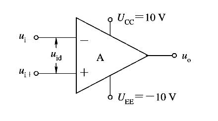
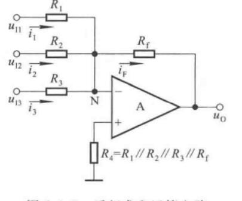

# 集成运算放大器

## 基本分析方法

一个集成运算放大器的典型形式如下

分析它的基本方式是：

1. 虚短：$u_+=u_-$
2. 虚断：$i_+=i_-=0$

以下是集成运算放大器的一些参数：

1. $u_{id}=u_{i+}-u_{i-}$：差模输出电压
2. $A_{uo}$：集成运放的开环电压放大倍数
3. $R_i$：集成运放的输入电阻
4. $R_o$：集成运放的输出电阻

其中理想条件是$R_i\to\infty,R_o\to 0,A_{uo}\to\infty,i_+=i_-=0$。

## 电压传输特性

## 基本运算电路

### 反向比例运算电路

（根据虚短虚断）可以计算得到

$$
u_O = -\dfrac{R_f}{R}u_I
$$

其中输出电阻$R_o=0$，输入电阻$R_i=R$

### 同相比例运算电路

$$
u_O = (1+\dfrac{R_f}{R})u_I
$$

引入了电压串联负反馈，可以认为输入电阻无穷大，输出电阻为$0$

### 电压跟随器

$$
u_O = u_I
$$

### 反向求和运算电路

$$
u_O = -R_f\bigg(\dfrac{u_{I1}}{R_1}+\dfrac{u_{I2}}{R_2}+\dfrac{u_{I3}}{R_3}\bigg)
$$

可以看作是反相比例放大器的叠加电路，输入电阻取决于不同的端口。

### 同相求和运算电路

$$
u_O = R_f\cdot\dfrac{R_P}{R_N}\cdot
\bigg(\dfrac{u_{I1}}{R_1}+\dfrac{u_{I2}}{R_2}+\dfrac{u_{I3}}{R_3}\bigg)
$$

其中，$R_P = R_1\parallel R_2\parallel R_3\parallel R_4, R_N = R\parallel R_f$，若$R_P=R_N$，则

$$
u_O = R_f\cdot
\bigg(\dfrac{u_{I1}}{R_1}+\dfrac{u_{I2}}{R_2}+\dfrac{u_{I3}}{R_3}\bigg)
$$

### 加减运算电路

其实就是把上面两个电路结合一下。

$$
u_O = R_f\bigg(\dfrac{u_{I3}}{R_3}+\dfrac{u_{I4}}{R_4}-\dfrac{u_{I1}}{R_1}-\dfrac{u_{I2}}{R_2}\bigg)
$$

### 差分比例运算电路

是加减运算电路的一种特例，其只有两个输入，且参数对称

$$
u_O = \dfrac{R_f}{R}(u_{I2}-u_{I1})
$$

### 积分器

$$
u_O = -\dfrac{1}{RC}\int u_Idt
$$

### 微分器

$$
u_O = -RC\dfrac{du_I}{dt}
$$

## 滤波器

滤波器可以分为无源和有源滤波器。如果滤波电路仅由无源元件（电阻、电容、电感）组成，则称为无源滤波电路。如果滤波电路由无源元件和有源元件（双极型管，单极型管、集成运放）共同组成，则称为有源滤波电路。

我们主要讨论有源滤波器。在分析有源滤波电路时，常常通过拉普拉斯变换将电压、电流、以及无源元件变换为等效电路（具体见[信号与系统学习笔记](../信号与系统学习笔记/#电路的s域模型)）。输出量与输入量之比称为传递函数，即

$$
A_u(s) = \dfrac{U_o(s)}{U_i(s)}
$$

下面介绍的都是有源滤波电路。

### 一阶同相输入低通滤波器

其传递函数为

$$
A_u(s)=\dfrac{U_o(s)}{U_i(s)}=\bigg(1+\dfrac{R_2}{R_1}\bigg)\dfrac{U_p(s)}{U_i(s)}=\bigg(1+\dfrac{R_2}{R_1}\bigg)\dfrac{1}{1+sRC}
$$

用$jw$取代$s$，令$f_0=\dfrac{1}{2\pi RC}$，得到

$$
\dot{A}_u = \bigg(1+\dfrac{R_2}{R_1}\bigg)\cdot\dfrac{1}{1+j\dfrac{f}{f_0}}
$$

式中$f_0$称为特征频率。令$f=0$，得到通带放大倍数。

$$
\dot A_{up}=1+\dfrac{R_2}{R_1}
$$

当$f=f_0$时，$\dot A_u=\dfrac{\dot A_{up}}{\sqrt 2}$，故通带截止频率$f_p=f_0$。

### 二阶同相输入低通滤波器

假设$C_1=C_2=C$

$$
A_u(s) = \bigg(1+\dfrac{R_2}{R_1}\bigg)\dfrac{1}{1+3sRC+(sRC)^2}
$$

用$jw$取代$s$，令$f_0=\dfrac{1}{2\pi RC}$，得到

$$
\dot A_u = \dfrac{1+\dfrac{R_2}{R_1}}{1-\bigg(\dfrac{f}{f_0}\bigg)^2+j3\dfrac{f}{f_0}}
$$

称$f_0$为特征频率。令上式分母的模等于$\sqrt 2$，可以解出通带截止频率为$f_p\approx 0.37f_0$。

### 一阶反向输入低通滤波器

通带放大倍数为

$$
\dot A_{up} = -\dfrac{R_2}{R_1}
$$

电路的传输函数为

$$
A_u(s) = -\dfrac{R_2\parallel\dfrac{1}{sC}}{R_1}=\dfrac{R_2}{R_1}\dfrac{1}{1+sR_2C}
$$

用$jw$取代$s$，令$f_0=\dfrac{1}{2\pi R_2C}$

$$
\dot A_u = \dfrac{\dot A_{up}}{1+j\dfrac{f}{f_0}}
$$

截止频率$f_p=f_0$

### 二阶反向输入低通滤波器

$$
\dot A_{up} = -\dfrac{R_f}{R_1}
$$

教材上并没有给出$\dot A_u$的表达式和截止频率。

$$
f_0=\dfrac{1}{2\pi\sqrt{C_1C_2R_2R_f}}
$$

### 二阶高通滤波器

$$
\dot A_{up} = 1+\dfrac{R_f}{R_1}
$$

$$
f_p = \dfrac{1}{2\pi RC}
$$

### 带通滤波器

将低通和高通串联，就得到带通。

设前者的截止频率为$f_{p1}$，后者的截止频率为$f_{p2}$，则$f_{p2}应该小于$$f_{p1}$，则通带为$(f_{p1}-f_{p2})$

$$
\dot A_{uf} = 1+\dfrac{R_f}{R_1}
$$

当$C_1=C_2=C,R_1=R,R_2=2R$，令$f_0=\dfrac{1}{2\pi RC}$（中心频率）

$$
\dot A_u = \dfrac{1}{1+j\dfrac{1}{3-\dot A_{uf}}\bigg(\dfrac{f}{f_0}-\dfrac{f_0}{f}\bigg)}\dfrac{\dot A_{uf}}{3-\dot A_{uf}}
$$

当$f=f_0$

$$
\dot A_{up}=\dfrac{\dot A_{uf}}{|3-\dot A_{uf}|}
$$

$$
f_{p1} = \dfrac{f_0}{2}\bigg(\sqrt{(3-\dot A_{uf})^2+4}-(3-\dot A_{uf})\bigg)
$$

$$
f_{p2} = \dfrac{f_0}{2}\bigg(\sqrt{(3-\dot A_{uf})^2+4}+(3-\dot A_{uf})\bigg)
$$

### 带阻滤波器

将输入电压同时作用于低通和高通，再将两个电路的输出电压求和，就可以得到带阻滤波器。$f_{p1}<f_{p2}$，阻带为$(f_{p2}-f_{p1})$

$$
\dot A_{up} = 1+\dfrac{R_f}{R_1}
$$

### 全通滤波器（移相器）

$$
\dot A_u = \dfrac{1-jwRC}{1+jwRC}
$$

也即

$$
|\dot A_u| = 1
$$

$$
\varphi = 180\degree-2arctan\dfrac{f}{f_0},f_0=\dfrac{1}{2\pi RC}
$$

# 半导体器件

## 半导体基础知识

**本征半导体**

纯净的具有晶体结构的半导体称为本征半导体。例如硅和锗的纯净半导体。

本征半导体中，共价键的价电子可以获得足够大的能量，挣脱共价键的束缚，游离出去，成为自由电子，并在共价键处留下带有一个单位的正电荷的空穴。这个过程称为本征激发。

本征激发产生成对的自由电子和空穴，所以本征半导体中自由电子和空穴的数量相等。

价电子的反向递补运动等价为空穴在半导体中自由移动。因此，在本征激发的作用下，本征半导体中出现了带负电的自由电子和带正电的空穴，二者都可以参与导电，统称为载流子。

**杂质半导体**

往本征半导体里掺入少量合适的杂质元素，便可得到杂质半导体。按掺入的杂质元素不同，可以分成N型半导体和P型半导体。

**N型半导体**

在本征半导体中掺入五价原子，即构成N型半导体。N型半导体中每掺杂一个杂质元素的原子，就提供一个自由电子，从而大量增加了自由电子的浓度。

N型半导体中，自由电子的浓度大于空穴的浓度，故称自由电子为多数载流子，空穴为少数载流子，前者也称为多子，后者也称为少子，由于杂质原子可以提供电子，故称为施主原子。

**P型半导体**

在本征半导体中掺入三价原子，即构成P型半导体。P型半导体中每掺杂一个杂质元素的原子，就提供一个空穴，从而大量增加了空穴的浓度。

P型半导体中，空穴为多子，自由电子为少子，主要靠空穴导电。因杂质原子中的空位吸收电子，故称之为受主原子。

**漂移电流和扩散电流**

漂移电流：在电场的作用下，自由电子会逆着电场方向漂移，而空穴则顺着电场方向漂移，这样产生的电流称为漂移电流，该电流的大小主要取决于载流子的浓度，迁移率和电场强度。

扩散电流：半导体中载流子浓度不均匀分布时，载流子会从高浓度区向低浓度区扩散，从而形成扩散电流，该电流的大小正比于载流子的浓度差即浓度梯度的大小。

**PN结**

通过掺杂工艺，把本征半导体的一边做成 P 型半导体，另一边做成 N 型半导体，则 P 型半导体和 N 型半导体的交接面处会形成一个有特殊物理性质的薄层，称为 PN 结。 

在无外电场和其他激发作用下，参与扩散运动的多子数目等于参与漂移运动的少子数目，从而达到动态平衡，形成PN结。

由于扩散到P区的自由电子与空穴复合，而扩散到N区的空穴与自由电子复合，所以在交界面附近多子的浓度下降，P区出现负离子区，N区出现正离子区，它们是不能移动的，称为空间电荷区（耗尽层），从而形成内电场。

当外加电压极性不同时，PN结表现出截然不同的导电性能。

当电源的正极接到PN结的P端，且电源的负极接到PN结的N端时，称PN结外加正向电压，也称正向接法或正向偏置。此时空间电荷区变窄，削弱内电场，使扩散运动加剧，漂移运动减弱。由于电源的作用，扩散运动将源源不断地进行，从而形成正向电流，PN结导通。

当电源的正极接到PN结的N端，且电源的负极接到PN结的P端时，称PN结外加反向电压，也称反向接法或反向偏置。加强了内电场，阻止扩散运动，加剧漂移运动。但是少子数目极少，反向电流非常小，所以常常忽略不计，认为PN结外加反向电压时处于截止状态。

**PN结的电流方程**

